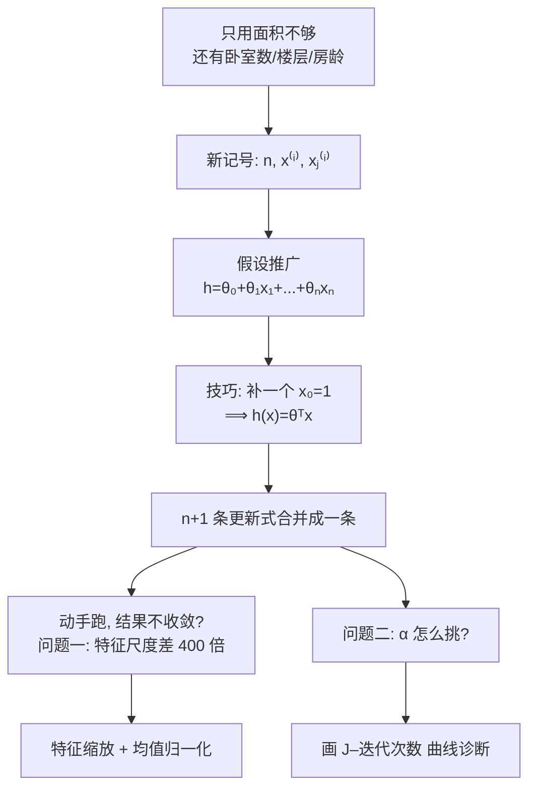

# C2.3 多变量线性回归与梯度下降实践

> [!abstract] 这一讲的任务
> 前两讲我们做了一个能用的估价模型，但它只看**一个**东西：面积。
> 你朋友大概率会追问一句：**“那我家是三室两厅、带电梯、才盖了 5 年，这些不算钱吗？”**
>
> 这一讲干两件事：
> **① 把模型从“一个特征”推广到“任意多个特征”**——数学上很顺，但会逼出一套新记号；
> **② 处理两个真正动手时才会撞上的工程问题**：特征尺度差太多怎么办、$\alpha$ 到底怎么挑。
>
> 第二件事课件叫它 “Gradient descent **in practice**”——**这是从“会推公式”到“能跑通模型”之间那道坎。**

> [!info] 怎么读这份讲义
> 前半（第 1–3 节）是理论推广，后半（第 4–8 节）是实践技巧。**后半更重要**——公式推错了会报错，这些技巧不做则是“程序能跑但就是不收敛”，最难查。
> 标有 **（拓展）** 的部分第一遍可跳过。

---

## 0. 开场：模型不够用了

回到你给朋友估价的场景。你现在的模型是

$$h_\theta(x)=\theta_0+\theta_1\times\text{面积}$$

朋友看完报价，提出一个非常合理的质疑：

> “隔壁那套跟我家面积一模一样，可他家是**顶楼没电梯、房龄 40 年**，凭什么估一个价？”

他说得对。**面积一样的房子，价格可以差很多**——因为还有别的因素在起作用。课件把数据表扩充成了这样：

| Size (feet²) | Number of bedrooms | Number of floors | Age of home (years) | Price ($1000) |
|---|---|---|---|---|
| $x_1$ | $x_2$ | $x_3$ | $x_4$ | $y$ |
| 2104 | 5 | 1 | 45 | 460 |
| 1416 | 3 | 2 | 40 | 232 |
| 1534 | 3 | 2 | 30 | 315 |
| 852 | 2 | 1 | 36 | 178 |
| … | … | … | … | … |

这里 **$n=4$**（四个特征），**$m=47$**（四十七套房）。

> [!question] 停一下，先自己想
> **如果让你把 $h_\theta(x)=\theta_0+\theta_1x$ 改成能用四个特征的版本，你会怎么写？**
>
> 大多数人第一次都能写对：**每个特征配一个自己的系数，然后全加起来。** 我们就照这个写。

---

## 1. 新记号：这次真的要分清上标和下标

在写公式之前，必须先把记号立好。因为现在有**两个维度**在同时变化：**是第几套房子**、**是第几个特征**。

> [!important] Notation（本节最容易混，务必分清）
> | 记号 | 含义 | 例子 |
> |---|---|---|
> | $n$ | **特征的个数**（number of features） | $n=4$ |
> | $m$ | 训练样例的个数 | $m=47$ |
> | $x^{(i)}$ | **第 $i$ 个训练样例的输入**——注意它是**一整个向量** | $x^{(2)}=\begin{bmatrix}1416\\3\\2\\40\end{bmatrix}$ |
> | $x_j^{(i)}$ | **第 $i$ 个样例中，第 $j$ 个特征的值**——这是**一个数** | $x_3^{(2)}=2$（第 2 套房的楼层数） |
>
> 表格的**第 2 行整行**就是 $x^{(2)}=[1416,3,2,40]^T$——**上标 = 一整行。**

> [!warning] 记住这一句就不会错
> $$\textbf{上标数样本（第几行），下标数特征（第几列）。}$$
>
> - $x^{(2)}$ = 第 2 行的**全部**特征 ⟹ 一个 4 维向量
> - $x_3^{(2)}$ = 第 2 行第 3 列 ⟹ 一个数（2）
>
> **自测一下：$x_2^{(3)}$ 是多少？**
> 第 3 个样本、第 2 个特征 ⟹ 第 3 行的“卧室数” ⟹ **3**。

## 2. 假设函数的推广

原来那个式子**作废**，换成新的：

$$\require{cancel}\cancel{h_\theta(x)=\theta_0+\theta_1x}$$

$$h_\theta(x)=\theta_0+\theta_1x_1+\theta_2x_2+\theta_3x_3+\theta_4x_4$$

一般地，$n$ 个特征时：

> [!important] 多变量线性回归的假设函数
> $$h_\theta(x)=\theta_0+\theta_1x_1+\theta_2x_2+\cdots+\theta_nx_n$$

看一个**具体的数值例子**，非常值得逐项读：

$$h_\theta(x)=80+0.1x_1+0.01x_2+3x_3-2x_4$$

> [!note] 把它当成一份“估价说明书”来念
> | 项 | 含义 |
> |---|---|
> | $\theta_0=80$ | **基础价 80k**。所有特征都为 0 时的名义价格，负责把整个平面上下平移，通常没有单独的物理意义 |
> | $\theta_1=0.1$ | **面积每多 1 平方英尺，价格 +0.1k（即 +100 美元）** |
> | $\theta_2=0.01$ | 每多 1 间卧室，+0.01k |
> | $\theta_3=3$ | 每多 1 层，+3k |
> | $\theta_4=-2$ | $x_4$ 是房龄 **age** ——**房龄每多 1 年，价格 −2k** |
>
> **注意那个负号：它是有含义的。** 参数的**正负号 = 这个特征对结果的影响方向**，绝对值 = 影响强度。
> “老房子更便宜”这条常识，就写在 $\theta_4=-2$ 里。
>
> **但要小心**：不能直接拿 $\theta_2=0.01$ 和 $\theta_3=3$ 比大小说“楼层比卧室重要 300 倍”——**因为两个特征的尺度不同**。这正是第 4 节要讲的事。

---

## 3. 一个让所有公式变整齐的小技巧

现在有个小小的不对称：$\theta_0$ 是**孤零零的常数项**，其他每个 $\theta_j$ 都乘着一个 $x_j$。这会让公式和代码都多一个特例。

> [!important] 课件的解法：凭空补一个特征
> **For convenience of notation, define $x_0=1$**
> 也就是 $x_0^{(i)}=1$——**给每一个样本都补上这一维，值恒为 1。**
>
> 于是：
> $$h_\theta(x)=\theta_0x_0+\theta_1x_1+\cdots+\theta_nx_n\qquad(x_0=1)$$
> **每一项都成了“参数 × 特征”，形式完全整齐了。**

> [!note] 这不是作弊：$\theta_0\cdot 1=\theta_0$，值一点没变
> 我们只是把“常数项”**伪装成**“一个恒等于 1 的特征的系数”。数值上完全等价，但形式上统一了。
> 这类“为了形式统一而引入的约定”在数学里很常见，**它的回报马上就会看到**（第 3.2 节和第 3.3 节各有一次）。

### 3.1 于是可以写成向量

把特征和参数都堆成列向量：

$$x=\begin{bmatrix}x_0\\x_1\\x_2\\\vdots\\x_n\end{bmatrix}\in\mathbb{R}^{n+1},
\qquad
\theta=\begin{bmatrix}\theta_0\\\theta_1\\\theta_2\\\vdots\\\theta_n\end{bmatrix}\in\mathbb{R}^{n+1}$$

> [!important] 向量形式（考点）
> $$\boxed{\;h_\theta(x)=\theta^T x\;}$$
> 这称为**多变量线性回归 Multivariate linear regression**。
>
> 核对一下维度，就知道为什么是 $\theta^T$ 而不是 $\theta$：
> $$\underbrace{[\theta_0\ \ \theta_1\ \cdots\ \theta_n]}_{\theta^T,\ 1\times(n+1)}\times\underbrace{\begin{bmatrix}x_0\\x_1\\\vdots\\x_n\end{bmatrix}}_{x,\ (n+1)\times1}\ =\ \underbrace{\text{一个数}}_{1\times1}$$

> [!note] 前置知识：$\theta^Tx$ 就是内积，不是新东西
> $T$ 是**转置 transpose**：把列向量躺倒成行向量。
> 行向量 × 列向量 = **对应元素相乘再求和**：
> $$\theta^Tx=\sum_{j=0}^{n}\theta_jx_j=\theta_0x_0+\theta_1x_1+\cdots+\theta_nx_n$$
> **这正是上面那个展开式。** 你在线性代数里管它叫**内积 / 点积 dot product**，也写作 $\theta\cdot x$。
>
> **所以 $\theta^Tx$ 只是同一件事的紧凑写法。** 看到它不要紧张，在心里展开就行。

> [!tip] 为什么值得费劲写成向量（专业关联）
> 三个理由，一个比一个重要：
> 1. **写起来短**：不管 $n$ 是 4 还是 4000，都是 $\theta^Tx$。
> 2. **消灭特例**：$\theta_0$ 不再需要单独处理（下一节就能看到）。
> 3. **代码快几十倍**：NumPy 的 `theta @ x` 底层调 BLAS，走 SIMD 和多核；Python 的 `for` 循环逐项相乘慢得多。这叫**向量化 vectorization**。
>    深度学习框架更进一步，把**整批数据**也堆成矩阵一次算完（$X\Theta$），才喂得饱 GPU。
>
> **“能写成矩阵乘法就别写循环”——这是从这门课一直通到工业界的第一条性能准则。**

### 3.2 梯度下降也跟着推广

框架完全照搬 [[C2.2 梯度下降]]，只是所有东西升成了向量：

| | 内容 |
|---|---|
| **Hypothesis** | $h_\theta(x)=\theta^Tx=\theta_0x_0+\theta_1x_1+\cdots+\theta_nx_n$，其中 $x_0=1$ |
| **Parameters** | $\theta_0,\dots,\theta_n$ —— 把它们看成**一个 $n+1$ 维向量** $\theta$（“n+1 dimensional vector”） |
| **Cost function** | $J(\theta)=\dfrac{1}{2m}\sum_{i=1}^m\big(h_\theta(x^{(i)})-y^{(i)}\big)^2$ |
| **Gradient descent** | Repeat $\{\ \theta_j:=\theta_j-\alpha\frac{\partial}{\partial\theta_j}J(\theta)\ \}$，simultaneously update for every $j=0,\dots,n$ |

> [!note] 记号简化
> 课件把 $J(\theta_0,\theta_1,\dots,\theta_n)$ **划掉**，改写成 $J(\theta)$——**用一个向量符号代表全部参数**。
> 以后看到 $J(\theta)$，默认 $\theta$ 是整个参数向量。

### 3.3 那个 $x_0=1$ 的第二次回报

把新旧算法**并排**放在一起对比：

**Previously ($n=1$)：**
$$
\begin{aligned}
\theta_0 &:= \theta_0-\alpha\frac{1}{m}\sum_{i=1}^m\big(h_\theta(x^{(i)})-y^{(i)}\big)\qquad\color{gray}{\leftarrow\ \text{末尾没有 }x}\\
\theta_1 &:= \theta_1-\alpha\frac{1}{m}\sum_{i=1}^m\big(h_\theta(x^{(i)})-y^{(i)}\big)\,x^{(i)}\qquad\color{gray}{\leftarrow\ \text{末尾有 }x}
\end{aligned}
$$

**上一讲我们注意到这两式“只差末尾一个 $x$”，当时只能死记。现在看看会发生什么：**

> [!important] New algorithm ($n\ge1$)（考点，必须默写）
> $$\text{Repeat }\{$$
> $$\theta_j := \theta_j - \alpha\,\frac{1}{m}\sum_{i=1}^{m}\big(h_\theta(x^{(i)})-y^{(i)}\big)\,x_j^{(i)}$$
> $$\}\qquad \text{(simultaneously update } \theta_j \text{ for } j=0,1,\dots,n)$$

展开来是：
$$
\begin{aligned}
\theta_0 &:= \theta_0-\alpha\frac1m\sum_{i=1}^m(h_\theta(x^{(i)})-y^{(i)})\,x_0^{(i)}\\
\theta_1 &:= \theta_1-\alpha\frac1m\sum_{i=1}^m(h_\theta(x^{(i)})-y^{(i)})\,x_1^{(i)}\\
\theta_2 &:= \theta_2-\alpha\frac1m\sum_{i=1}^m(h_\theta(x^{(i)})-y^{(i)})\,x_2^{(i)}\\
&\ \ \vdots
\end{aligned}
$$

> [!important] 关键在 $\theta_0$ 那一行末尾的 $x_0^{(i)}$
> 新算法里 $\theta_0$ 那一行末尾多了个 $x_0^{(i)}$，而 $x_0^{(i)}=1$。
>
> **这意味着：**
> 旧的 $\theta_0$ 更新式看起来“少乘一个 $x$”，其实是**乘了 $x_0^{(i)}=1$**。
>
> ⟹ **补上 $x_0=1$ 这个约定之后，原本 $n+1$ 条各不相同的更新式，变成了完全一样的一条。**
>
> 这就是那个小技巧真正的价值——**不是省笔墨，是消灭特例。** 写代码时，你可以用一个循环（或者一次矩阵运算）处理所有参数，不需要给 $\theta_0$ 开小灶。

> [!note] 【拓展】 偏导数的推导
> 和 [[C2.2 梯度下降]] 第 5 节同理，只是内层导数变成 $x_j^{(i)}$：
> $$\frac{\partial J}{\partial\theta_j}=\frac{1}{2m}\sum_i 2\big(h_\theta(x^{(i)})-y^{(i)}\big)\cdot\frac{\partial}{\partial\theta_j}\Big(\sum_{k=0}^n\theta_kx_k^{(i)}-y^{(i)}\Big)$$
> 括号里**只有 $k=j$ 那一项含 $\theta_j$**，它的导数是 $x_j^{(i)}$，其余项对 $\theta_j$ 求导全是 0，于是
> $$\frac{\partial J}{\partial\theta_j}=\frac{1}{m}\sum_{i=1}^m\big(h_\theta(x^{(i)})-y^{(i)}\big)x_j^{(i)}$$

---

# 实践 I：跑不动的时候，先看特征尺度

## 4. 一个会让你卡住半天的现象

**理论到这里已经完整了。现在假设你真的把它写成了代码，跑起来——然后发现它几乎不收敛。**

$\alpha$ 调大就发散，调小就慢得看不到头。公式反复检查也没错。**问题出在哪？**

先看一眼数据：

- $x_1$ = size（**0 – 2000** feet²）
- $x_2$ = number of bedrooms（**1 – 5**）

> [!question] 停一下：这两个特征的取值范围差了多少倍？
> **大约 400 倍。**
>
> 这件事看起来无害——不就是单位不同吗？但它对梯度下降是**致命的**。下面看为什么。

![[C2.3-特征缩放-等高线对比.png]]

> [!important] 后果：等高线被拉成又窄又长的椭圆
> 画出两组 $J(\theta)$ 的等高线对比：
> - **缩放前（左）**：等高线是**极扁的椭圆**，红色的梯度下降路径**来回剧烈震荡**，“之”字形地缓慢挪向中心。
> - **缩放后（右）**：等高线接近**同心圆**，路径**几乎笔直**地冲向中心。

> [!note] 为什么尺度差异会让等高线变扁——想清楚这个，你就再也不会忘了做缩放
> **直觉版：**
> $\theta_1$ 乘的是一个 0~2000 的**大数**，所以 **$\theta_1$ 只要动一点点，$J$ 就剧烈变化**；
> $\theta_2$ 乘的是 1~5 的**小数**，**$\theta_2$ 动很多，$J$ 才变一点**。
>
> ⟹ 曲面在 $\theta_1$ 方向**极陡**、在 $\theta_2$ 方向**极平** ⟹ **等高线在 $\theta_1$ 方向被压扁**。
>
> **梯度下降为什么怕扁椭圆：**
> 负梯度指向的是**局部最陡**的方向。在扁椭圆上，最陡的方向**几乎垂直于“通往中心”的方向**——就像在一条又深又窄的沟里，最陡的方向永远是“往对面的沟壁”，而不是“沿沟往下”。
> 于是每一步都在横向来回弹，纵向进展极慢；而且**必须把 $\alpha$ 调得很小才不至于弹飞**，小 $\alpha$ 又让纵向更慢。**两头堵。**
>
> **【拓展】** 这个现象在数值分析里叫**病态 ill-conditioning**，用**条件数 condition number**（Hessian 最大特征值 / 最小特征值）度量。**特征缩放做的事就是压低条件数。**

## 5. 解决办法：特征缩放

> [!important] Idea: Make sure features are on a similar scale.
> （**核心想法：让各个特征处在相近的数值尺度上。**）

### 5.1 最简单的做法：除以范围

课件的做法直截了当：

$$x_1=\frac{\text{size (feet}^2)}{2000},\qquad x_2=\frac{\text{number of bedrooms}}{5}$$

于是
$$0\le x_1\le 1,\qquad 0\le x_2\le 1$$

**两个特征现在都在 $[0,1]$ 里，尺度一致了。**

### 5.2 目标范围：不用很精确

> [!important] Get every feature into approximately a $-1\le x_i\le 1$ range.
> （把每个特征**大致**压进 $[-1,1]$。）
>
> **“approximately（大致）”是关键词**——不需要精确。下面这组判例可以拿来当尺子用：
>
> | 范围 | 判定 | 理由 |
> |---|---|---|
> | $0\le x_1\le 3$ | ✓ | 和 $[-1,1]$ 同量级 |
> | $-2\le x_2\le 0.5$ | ✓ | 同上 |
> | $-100\le x_3\le 100$ | ✗ | **大了两个数量级** |
> | $-0.0001\le x_4\le 0.0001$ | ✗ | **小了四个数量级** |
> | $-3$ 到 $3$ | ✓ | **可接受的上界** |
> | $-\frac13$ 到 $\frac13$ | ✓ | **可接受的下界** |
>
> **经验法则：落在 $[-3,3]$ 到 $[-\frac13,\frac13]$ 之间都算合格；差一两个数量级就要处理。**
>
> 课件另外单独标注了 **$x_0=1$**——它是我们自己补的常数项，本来就是 1，**不需要也不应该缩放**。

### 5.3 更好的做法：均值归一化

除以范围解决了“尺度”，但还有个小问题：$x_1\in[0,1]$ 是**偏向一侧的**，均值大约 0.5，不是 0。把数据**挪到以 0 为中心**通常收敛更快。

> [!important] Mean Normalization 均值归一化
> **Replace $x_i$ with $x_i-\mu_i$ to make features have approximately zero mean.**
> （用 $x_i-\mu_i$ 替换 $x_i$，使特征均值约为 0。）
> **（Do not apply to $x_0=1$.）**
>
> 课件的例子：
> $$x_1=\frac{size-1000}{2000},\qquad x_2=\frac{\#bedrooms-2}{5}$$
> 结果：
> $$-0.5\le x_1\le 0.5,\qquad -0.5\le x_2\le 0.5$$

> [!note] 拆开看这两个式子做了什么
> 以 $x_1$ 为例，一共两步：
> 1. **减去均值 $\mu_1=1000$**（这批房子的平均面积）⟹ 数据**平移到以 0 为中心**；
> 2. **除以范围 2000**（$\max-\min$）⟹ 数据**压缩到宽度约为 1**。
>
> 核对一下：size ∈ [0, 2000] → 减 1000 后 ∈ [−1000, 1000] → 除 2000 后 ∈ **[−0.5, 0.5]** ✓
>
> **通式：**
> $$x_i \leftarrow \frac{x_i-\mu_i}{s_i}$$
> $\mu_i$ 是该特征的**均值**，$s_i$ 是**范围（max−min）或标准差**。
>
> **【拓展】** 用标准差的版本叫**标准化 standardization / Z-score**：$\frac{x-\mu}{\sigma}$，结果均值 0、方差 1。这是实践中最常用的一种，`sklearn.preprocessing.StandardScaler` 就是它。

> [!question] 课堂追问：为什么 $x_0$ 不能做均值归一化？
> $x_0$ 恒等于 1，所以它的均值也是 1。做归一化会得到
> $$x_0-\mu_0=1-1=0$$
> **整列变成 0！** 于是 $\theta_0x_0\equiv0$，**截距项彻底失效**，模型被迫过原点——那条直线再也抬不起来了。
>
> 这就是课件专门写一句 “Do not apply to $x_0=1$” 的原因。

> [!warning] 三个实践中的坑（拓展）
> **【拓展】**
> 1. **测试数据必须用训练集的 $\mu,s$。** 不能对测试集单独算均值——那等于**偷看了测试数据的分布**，属于 [[C1.4 过拟合与剪枝]] 里说的数据泄漏。
> 2. **预测新样本时也要做同样的缩放**，否则输入的量纲和训练时对不上，输出全错。（部署上线后最常见的事故之一。）
> 3. **缩放后 $\theta$ 的含义变了**：$\theta_1$ 不再是“每平方英尺涨多少钱”，而是“每变化一个缩放单位涨多少”。要向别人解释系数，得先换算回去。

---

# 实践 II：$\alpha$ 到底怎么挑

## 6. 两个绕不开的问题

上一讲说了 $\alpha$ 太大太小各有什么后果，**但没说怎么知道自己选得对不对**。课件把这一节的任务写成两句：

> [!important] 课件原文
> - **“Debugging”: How to make sure gradient descent is working correctly.**
>   （调试：怎么**确认**梯度下降跑对了）
> - **How to choose learning rate $\alpha$.**
>   （怎么**选**学习率）

**注意这两个问题的顺序：先要有办法“看出好坏”，才谈得上“怎么选”。** 所以先讲诊断工具。

## 7. 诊断工具：画一条曲线

![[C2.3-学习率-收敛曲线诊断.png]]

> [!important] 做法：画 $J(\theta)$ 随迭代次数变化的曲线
> **横轴 = No. of iterations（迭代次数），纵轴 = $J(\theta)$。**
>
> 判据只有一句话：
> > **$J(\theta)$ should decrease after every iteration.**
> > （每一次迭代之后，$J$ 都应该下降。）

> [!warning] 千万别把这张图和上一讲的抛物线搞混
> 它们的横轴完全不同：
> 
> | | 横轴 | 看的是 |
> |---|---|---|
> | [[C2.1 单变量线性回归与代价函数]] 的抛物线 | **参数 $\theta$** | **代价函数长什么样**（静态的地形图） |
> | 本节这张曲线 | **迭代次数** | **训练过程跑得好不好**（动态的过程记录） |
>
> 本节这张图在工程里叫 **learning curve（学习曲线）/ loss curve（损失曲线）**。
> **你以后训练任何模型——线性回归、CNN、大语言模型——每次都会盯着它看。** 现在就把读法练熟。

**怎么读：**

| 曲线形状 | 诊断 | 对策 |
|---|---|---|
| **持续下降、逐渐变平** | ✅ 正常，接近收敛 | 可以停了 |
| **前期陡降后完全水平** | ✅ 已收敛 | 停 |
| **上升** | ❌ 发散 | **Use smaller $\alpha$** |
| **来回震荡（锯齿状）** | ❌ 每步跨过最低点 | **Use smaller $\alpha$** |
| **下降但极其缓慢** | ⚠️ $\alpha$ 太小 | 增大 $\alpha$ |

> [!important] 课件把它总结成一条极实用的调试逻辑
> > **For sufficiently small $\alpha$, $J(\theta)$ should decrease on every iteration.**
> > **But if $\alpha$ is too small, gradient descent can be slow to converge.**
>
> 把这两句反过来用，就是一条**判断规则**：
> **只要梯度公式没写错，$J$ 上升或震荡，问题几乎一定是 $\alpha$ 太大** ⟹ 调小。
> 反过来，$J$ 稳降但慢得离谱 ⟹ 调大。
>
> **这条规则能解决你 90% 的“模型跑不动”问题。**

### 7.1 要跑多少次迭代？没人知道

横轴上的迭代次数可以是 **30、3000，也可以是 3,000,000**。

> [!note] 这组数字在说什么
> **不同问题需要的迭代次数可以差好几个数量级**——有的 30 次就收敛，有的要 300 万次。
>
> **而且事先无法预测。** 这正是“画曲线”不是可选项、而是必备步骤的原因：**你只能跑起来看。**

### 7.2 自动收敛测试，以及为什么不推荐它

> [!important] Example automatic convergence test
> **Declare convergence if $J(\theta)$ decreases by less than $10^{-3}$ in one iteration.**
> （若一次迭代中 $J$ 的下降量小于 $10^{-3}$，判定为收敛。）
>
> 这个阈值记作 $\varepsilon$（epsilon）。

看起来很方便——让程序自己判断什么时候停。**但实际上不推荐这么做。**

> [!question] 为什么？自动判断不好吗
> 因为**这个阈值极难选对**：
> - **选大了**：还没真收敛就停了（欠训练）。
> - **选小了**：早就收敛了还在空转（浪费算力）。
> - **更麻烦的是：合适的阈值取决于 $J$ 本身的量级。** $J$ 在 $10^6$ 量级时，“下降不到 $10^{-3}$”早就该停了；$J$ 在 $10^{-2}$ 量级时，$10^{-3}$ 还是个很大的变化。
>
> **同一个阈值，换个问题就完全不适用。**
>
> ⟹ **实践中更可靠的做法就是画出曲线用眼睛看。** 课件打叉，正是在提醒你别过度依赖这个自动测试。

## 8. 最后，怎么挑 $\alpha$

> [!important] Summary
> - **If $\alpha$ is too small: slow convergence.**
> - **If $\alpha$ is too large: $J(\theta)$ may not decrease on every iteration; may not converge.**
>   还有一句容易被忽略的：**Slow converge also possible**——**$\alpha$ 太大也可能表现为“收敛很慢”**，不一定直接爆炸。因为来回震荡同样在浪费迭代次数。
>
> ⟹ **所以“收敛慢”不能直接推断出“$\alpha$ 太小”，两边都要试。**

> [!important] To choose $\alpha$, try（考点）
> $$\dots,\ 0.001,\ 0.003,\ 0.01,\ 0.03,\ 0.1,\ 0.3,\ 1,\ \dots$$
> 相邻两数之间的倍率都是约 **$3\times$**。

> [!question] 课堂追问：为什么按 3 倍走，不是 2 倍或 10 倍？
> - **10 倍太粗**：万一 0.01 发散、0.001 又太慢，**中间一大段你根本没试到**。
> - **2 倍太细**：要试的次数几乎翻倍，浪费时间。
> - **3 倍刚好**：$1\to3\to10$，**两步跨一个数量级**。（数学上 $\sqrt{10}\approx3.16$，所以 3 倍约等于“半个数量级”。）
>
> **实际操作流程：**
> 1. 先试一个中间值（比如 0.01），跑几十次迭代，**画曲线**；
> 2. 发散 ⟹ ÷3；太慢 ⟹ ×3；
> 3. 目标是找到**“最大的、仍然稳定下降的那个 $\alpha$”**——它收敛最快。

---

## 9. 这一讲的三句话

> [!important] 如果只带走三句话
> 1. **多特征时 $h_\theta(x)=\theta^Tx$（补 $x_0=1$），梯度下降合并成一条 $\theta_j:=\theta_j-\alpha\frac1m\sum(h-y)x_j^{(i)}$。**
> 2. **特征尺度差太多会把等高线拉扁、让梯度下降震荡 ⟹ 先做特征缩放（大致压到 $[-1,1]$）+ 均值归一化。**
> 3. **判断训练好坏的唯一可靠办法：画 $J$–迭代次数曲线。$J$ 上升或震荡就把 $\alpha$ 调小。**

| 概念 | 要点 |
|---|---|
| $n$ / $m$ | 特征个数 / 样本个数 |
| $x^{(i)}$ / $x_j^{(i)}$ | 第 $i$ 个样本（向量）/ 第 $i$ 个样本的第 $j$ 个特征（数） |
| 多变量假设 | $h_\theta(x)=\theta_0+\theta_1x_1+\cdots+\theta_nx_n$ |
| 向量形式 | 定义 $x_0=1$ ⟹ $h_\theta(x)=\theta^Tx$，$\theta,x\in\mathbb{R}^{n+1}$ |
| 梯度下降 | $\theta_j:=\theta_j-\alpha\frac1m\sum_{i=1}^m(h_\theta(x^{(i)})-y^{(i)})x_j^{(i)}$，$j=0,\dots,n$ 同步更新 |
| 特征缩放 | 让所有特征大致落在 $[-1,1]$；否则等高线变扁、梯度下降震荡 |
| 均值归一化 | $x_i\leftarrow\frac{x_i-\mu_i}{s_i}$；**不对 $x_0$ 做** |
| 诊断 | 画 $J$–迭代次数曲线；$J$ 上升或震荡 ⟹ $\alpha$ 太大 |
| 选 $\alpha$ | 0.001, 0.003, 0.01, 0.03, 0.1, 0.3, 1，**约 3 倍递增** |

> [!note] 下一讲预告
> 我们的模型现在能吃任意多个特征了。下一讲 [[C2.4 多项式回归与正规方程]] 问两个更“贪心”的问题：
> **① 特征能不能自己造？**（能——而且这会让线性回归拟合出曲线）
> **② 非得一步步迭代吗，能不能一次把答案解出来？**（对线性回归，能。）

---

## 10. 本节自测 Self-Test

> [!question] 先自己做，再看答案
> 1. 课件房价表中，$x_3^{(4)}$ 是多少？$x^{(1)}$ 是什么？
> 2. 为什么要人为定义 $x_0=1$？它带来了哪两个好处？
> 3. $\theta,x\in\mathbb{R}^{n+1}$，写出 $\theta^Tx$ 的展开式并说明结果的维度。
> 4. 某特征范围 $[0,100000]$，另一个 $[0,1]$。不做缩放会有什么后果？为什么？
> 5. 用均值归一化处理“房龄”，已知均值 38 年、范围 0~60 年。房龄 50 年归一化后是多少？
> 6. 训练时 $J(\theta)$ 曲线呈锯齿状上下震荡，怎么办？
> 7. 为什么 $x_0$ 不能做均值归一化？
> 8. 试 $\alpha$ 时为什么按 3 倍而不是 10 倍递增？
> 9. 有人说“我的模型收敛很慢，所以 $\alpha$ 一定是太小了”。这个推断严谨吗？

> [!success]- 参考答案
> 1. $x_3^{(4)}$ = **第 4 个样本的第 3 个特征** = 第 4 行的 “Number of floors” = **1**。
>    $x^{(1)}$ = 第 1 个样本的全部特征向量 = $\begin{bmatrix}2104\\5\\1\\45\end{bmatrix}$（若含 $x_0$ 则是 $[1,2104,5,1,45]^T$）。
> 2. ① **写法统一**：所有项都成了“参数 × 特征”，可以写成内积 $\theta^Tx$；
>    ② **消灭特例**：$\theta_0$ 的更新式里“缺失的那个 $x$”其实就是 $x_0=1$，于是 $n+1$ 条更新式合并成一条，代码里不用给 $\theta_0$ 开小灶。
> 3. $\theta^Tx=\sum_{j=0}^n\theta_jx_j=\theta_0x_0+\theta_1x_1+\cdots+\theta_nx_n$。
>    维度：$(1\times(n+1))\cdot((n+1)\times1)=1\times1$，即**一个标量**。
> 4. 后果：$J$ 的等高线被拉成**极扁的椭圆**，负梯度方向几乎垂直于通往最优的方向 ⟹ 梯度下降**剧烈震荡、收敛极慢**，且只能用很小的 $\alpha$，进一步拖慢。
>    原因：大尺度特征对应的参数**稍微一动 $J$ 就剧变**（该方向极陡），小尺度特征对应的参数**动很多 $J$ 才变一点**（该方向极平）。
> 5. $x=\frac{50-38}{60}=\frac{12}{60}=\mathbf{0.2}$。落在 $[-1,1]$ 内 ✓
> 6. **$\alpha$ 太大**。把 $\alpha$ 除以 3（或 10）再试。若调小后仍震荡，检查梯度公式是否写错、是否漏了同步更新。
> 7. $x_0\equiv1$，其均值也是 1，$1-1=0$ ⟹ **整列变成 0**，$\theta_0x_0$ 恒为 0，**截距项失效**，模型被迫过原点。
> 8. 10 倍跨度太大，容易“上一档发散、下一档太慢”，中间没试到；2 倍又太细浪费时间。**3 倍约等于半个数量级**（$\sqrt{10}\approx3.16$），两步跨一个数量级，粒度刚好。
> 9. **不严谨。** 前面明确说过：**$\alpha$ 太大也可能表现为收敛慢**（因为来回震荡浪费迭代）。
>    正确做法是**看曲线形状**：单调下降但慢 ⟹ $\alpha$ 偏小；带震荡地慢 ⟹ $\alpha$ 偏大。两个方向都试一下最稳。

---

**上一节：** [[C2.2 梯度下降]] ｜ **下一节：** [[C2.4 多项式回归与正规方程]]
**课程索引：** [[机器学习课程 MOC]]
