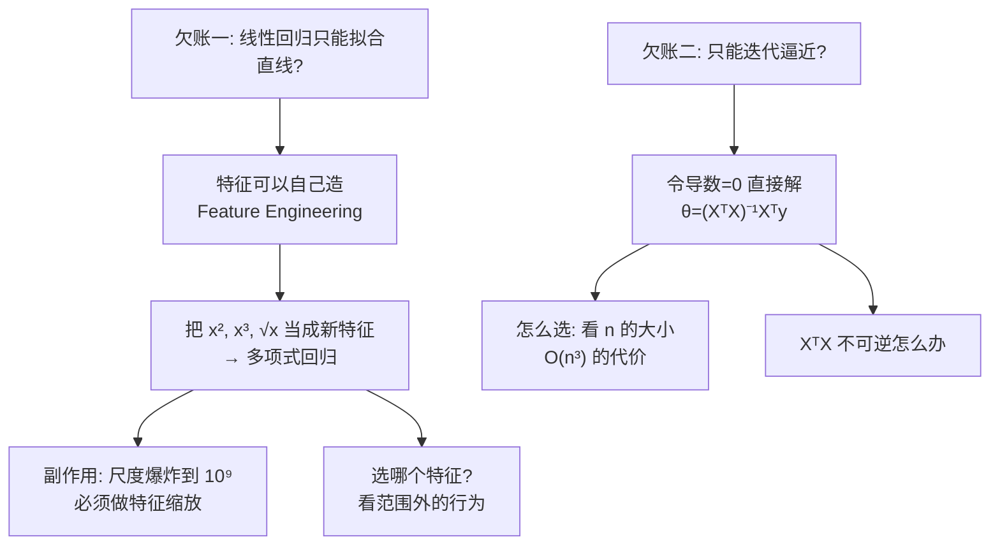

# C2.4 多项式回归与正规方程

> [!abstract] 这一讲的任务
> 到上一讲为止，我们的模型已经能用了。但它还欠着两笔账，这一讲一次还清：
>
> **第一笔：** [[C2.1 单变量线性回归与代价函数]] 里我说过一句没兑现的话——"线性回归其实不只能拟合直线"。这一讲兑现它。**关键在于：特征不是天上掉下来的，是可以自己造的。**
>
> **第二笔：** 我们一直在用梯度下降**一步步逼近**最优解。但对线性回归，其实有一个**一次性把答案解出来**的公式。为什么不早说？因为它有它的适用边界——这一讲讲清楚什么时候该用哪个。

> [!info] 怎么读这份讲义
> 本讲分两个独立的部分，**可以分开读**：
> - **第一部分（第 1–3 节）**：特征工程与多项式回归——**工程实用性最强**的一节。
> - **第二部分（第 4–7 节）**：正规方程——一个漂亮但适用面很窄的闭式解。第 7 节课件标了 (optional)。
> 标有 **（拓展）** 的部分第一遍可跳过。

---

# 第一部分：特征是可以自己造的

## 1. 开场：一个看起来很蠢、但很多人做错的例子

假设你拿到的房价数据，字段不是"面积"，而是这两个：

- **frontage（临街宽度）**：地块沿马路的那一边有多宽
- **depth（进深）**：地块从马路往里延伸多深

![[C2.4-房屋临街宽与进深-图示.png]]

按上一讲学的，你会很自然地写出：

$$h_\theta(x)=\theta_0+\theta_1\times\underbrace{frontage}_{x_1}+\theta_2\times\underbrace{depth}_{x_2}$$

**两个特征，各配一个系数。完全符合规范。**

> [!question] 停一下：这个模型有什么问题？
> 想想房子的价值真正取决于什么。
>
> **一块 10×100 的地和一块 100×10 的地，在这个模型眼里是完全一样的**（$\theta_1\cdot10+\theta_2\cdot100$ vs $\theta_1\cdot100+\theta_2\cdot10$，只要 $\theta_1\ne\theta_2$ 就不一样，但都是线性叠加）。
> 而真正决定价值的是**面积 = 宽 × 深**，这是一个**乘积**关系。
>
> **线性模型只会把特征各配一个系数再相加，它永远表达不出乘积。**

课件手写的解法只有两行，但这两行是整节的核心：

> [!important] 不必照搬给你的字段
> $$\textbf{Area}\quad x = frontage \times depth$$
> $$h_\theta(x)=\theta_0+\theta_1x\qquad(x\approx\textbf{land area 土地面积})$$
>
> **把两个特征乘起来，造出"面积"这一个新特征。** 模型从两个特征降到一个，反而更准。

> [!important] 这个操作叫特征工程 Feature Engineering
> **核心心态的转变：数据给你的那些列，不是不可更改的输入，而是原材料。**
>
> 常见的造法：
> 
> | 操作 | 例子 |
> |---|---|
> | **相乘** | 宽 × 深 = 面积 |
> | **相除** | 总价 ÷ 面积 = 单价；体重 ÷ 身高² = BMI |
> | **取对数** | 收入这类长尾分布常取 $\log$ |
> | **做差** | 结束时间 − 开始时间 = 时长 |
> | **拆分** | 日期 → "星期几"、"是否节假日" |
>
> **为什么有用（一句话）：** 你替模型把它自己表达不出来的非线性关系**预先算好了**。

> [!tip] 专业关联（AI 方向）：这一步后来被自动化了
> 深度学习之所以被称为**表示学习 representation learning**，正是因为它**把特征工程自动化了**——神经网络的隐藏层就是在自动学习特征的组合方式。
>
> 但别急着觉得手工特征工程过时了：**在传统机器学习、数据竞赛和大量工业场景（尤其是表格数据）里，手工特征工程仍然是决定成败的关键。** 很多时候，一个好特征胜过换十个模型。

---

## 2. 兑现那句话：让线性回归拟合曲线

现在回到那笔欠账。看这批房价数据：

![[C2.4-多项式回归-不同特征选择.png]]

散点明显是**一条先陡后缓的曲线**——小房子每多一平米涨得快，大房子涨得慢。**直线肯定拟合不好。**

课件给了两个候选：

$$\theta_0+\theta_1x+\theta_2x^2\qquad\text{(二次 quadratic)}$$
$$\theta_0+\theta_1x+\theta_2x^2+\theta_3x^3\qquad\text{(三次 cubic)}$$

**问题来了：这已经不是线性函数了，我们前面学的那套还能用吗？**

> [!important] 关键手法：把幂次"伪装"成新特征
> $$h_\theta(x)=\theta_0+\theta_1 x_1+\theta_2 x_2+\theta_3 x_3$$
> $$=\theta_0+\theta_1(size)+\theta_2(size)^2+\theta_3(size)^3$$
> 其中我们**令**：
> $$x_1=(size),\qquad x_2=(size)^2,\qquad x_3=(size)^3$$
>
> **这样一来，它就是一个普通的、三个特征的多变量线性回归**（[[C2.3 多变量线性回归与梯度下降实践]]）。
> **梯度下降的代码一行都不用改**——你只是在喂数据之前，多算了两列而已。

> [!important] 所以那句话的意思是
> **"线性"指的是"对参数 $\theta$ 线性"，不是"对 $x$ 线性"。**
>
> $h$ 是 $\theta_j$ 的一次式（每个 $\theta_j$ 都只出现一次方），这就够了。至于 $x$ 怎么变换——平方、开方、取对数、乘起来——**模型完全不在乎，它只看到一列列数字。**
>
> ⟹ **线性回归能拟合任意复杂的曲线，只要你造得出合适的特征。**

### 2.1 但有一个副作用，而且很严重

> [!warning] 多项式特征的尺度会爆炸
> 课件在这页右侧手写了这组数，是本节最该记住的东西：
>
> | 特征 | 取值范围 |
> |---|---|
> | $size$ | 1 – 1000 |
> | $size^2$ | 1 – **1,000,000** |
> | $size^3$ | 1 – **$10^9$** |
>
> **三个特征的尺度差了 6 个数量级。**
>
> 回想 [[C2.3 多变量线性回归与梯度下降实践]] 第 4 节：尺度差 **400 倍**就足以把等高线拉成极扁的椭圆、让梯度下降剧烈震荡。现在差的是 **$10^6$ 倍**。
>
> ⟹ **做多项式回归时，特征缩放不是"最好做一下"，是"不做就一定跑不动"。**

---

## 3. 造哪个特征？一个比"拟合得好"更深的判据

课件对比了两个都能拟合那条曲线的模型：

$$h_\theta(x)=\theta_0+\theta_1(size)+\theta_2(size)^2\qquad\text{(二次)}$$
$$h_\theta(x)=\theta_0+\theta_1(size)+\theta_2\sqrt{size}\qquad\text{(平方根)}$$

课件用粉框把**第二个**圈了出来，认为它更好。

> [!question] 停一下：两个模型在数据上都拟合得不错，凭什么说平方根更好？
> **看图的右半边——数据范围之外。**

> [!important] 课件用蓝色虚线画出了二次函数在数据范围外的走势：它会掉头向下
> 二次函数是抛物线，**必然有一个顶点**。数据只覆盖到顶点左边时你看不出问题，但一旦**外推 extrapolate** 到更大的面积：
>
> **模型开始预测"房子越大越便宜"。**
>
> 而 $\sqrt{size}$ 是**单调递增、增速递减**的：
> - **单调递增** ⟹ 房子越大越贵 ✓
> - **增速递减** ⟹ 边际效应递减（从 50 平到 100 平涨得多，从 500 平到 550 平涨得少）✓
>
> **它的形状天然符合我们对房价的常识，所以外推时依然合理**（图中粉色曲线持续上升）。

> [!important] 这一页真正的教学点，比"选哪个函数"大得多
> **模型的形状要和你对问题的先验知识吻合，而不只是看它在训练数据上拟合得好不好。**
>
> 两个模型在数据范围内的训练误差可能几乎一样，**但范围外的行为天差地别**。而训练误差**根本看不出这个差别**。
>
> 这是 [[C1.4 过拟合与剪枝]] 里"泛化"问题的又一种表现：**训练集上的好成绩，不能保证模型是对的。**

> [!tip] 实践建议（补充）
> - 目标随 $x$ **单调上升但边际递减** ⟹ 试 $\sqrt{x}$ 或 $\log x$
> - 有明显的**峰或谷** ⟹ 试二次
> - **不确定** ⟹ 多试几组，用**验证集**选（[[C1.4 过拟合与剪枝]] 讲的方法）
> - **永远警惕高次多项式的外推**——次数越高，数据范围外的行为越疯狂

---

# 第二部分：能不能一次把答案解出来

## 4. 开场：其实你高中就会这个

前两讲我们花了很大力气讲梯度下降：一步步试探、调学习率、画曲线诊断。

**但你可能一直有个疑问：求一个函数的最小值，不是有更直接的办法吗？**

有。而且你高中就学过：

> [!important] Intuition: If 1D（课件原文）
> 假设代价函数是一条抛物线
> $$J(\theta)=a\theta^2+b\theta+c$$
> 求最小值的标准做法：
> $$\frac{d}{d\theta}J(\theta)=\cdots\overset{\text{set}}{=}0\quad\Longrightarrow\quad\textbf{Solve for }\theta$$
> （**令导数等于零，解方程。**）

**驻点处导数为 0**——这是求极值最基本的方法。

> [!note] 两条路线的对比
> | | 梯度下降 | 令导数为零 |
> |---|---|---|
> | 思路 | **慢慢挪**到谷底 | **直接算出**谷底在哪 |
> | 需要 | 学习率、迭代、诊断 | 解一个方程 |
>
> 既然第二条路这么省事，**为什么前两讲要费那么大劲讲第一条？** 这个问题第 6 节回答。先把公式做出来。

### 4.1 推广到多维

> [!important] 多维情形（课件原文）
> 参数是向量 $\theta\in\mathbb{R}^{n+1}$，代价函数
> $$J(\theta_0,\theta_1,\dots,\theta_n)=\frac{1}{2m}\sum_{i=1}^m\big(h_\theta(x^{(i)})-y^{(i)}\big)^2$$
> 做法：**对每一个 $\theta_j$ 求偏导，令其为零**
> $$\frac{\partial}{\partial\theta_j}J(\theta)=\cdots\overset{\text{set}}{=}0\qquad\text{(for every }j)$$
> 然后**解这个联立方程组**，求出 $\theta_0,\theta_1,\dots,\theta_n$。
>
> 这是 $n+1$ 个方程、$n+1$ 个未知数的**线性**方程组 ⟹ **有闭式解**。

---

## 5. 把数据摆成矩阵

要写出那个解，先得把数据组织成矩阵。课件用 $m=4$ 的房价数据演示：

| $x_0$ | $x_1$ Size | $x_2$ Bedrooms | $x_3$ Floors | $x_4$ Age | $y$ Price |
|---|---|---|---|---|---|
| 1 | 2104 | 5 | 1 | 45 | 460 |
| 1 | 1416 | 3 | 2 | 40 | 232 |
| 1 | 1534 | 3 | 2 | 30 | 315 |
| 1 | 852 | 2 | 1 | 36 | 178 |

> [!important] 设计矩阵 $X$ 与标签向量 $y$
> $$X=\begin{bmatrix}
> 1 & 2104 & 5 & 1 & 45\\
> 1 & 1416 & 3 & 2 & 40\\
> 1 & 1534 & 3 & 2 & 30\\
> 1 & 852 & 2 & 1 & 36
> \end{bmatrix},\qquad
> y=\begin{bmatrix}460\\232\\315\\178\end{bmatrix}$$
>
> 课件手写标注的维度：
> - $X$ 是 **$m\times(n+1)$ 矩阵**（这里 $4\times5$），称为**设计矩阵 design matrix**
> - $y$ 是 **$m$ 维向量**（m-dimensional vector）
> - **第一列全是 1** ⟶ 正是 [[C2.3 多变量线性回归与梯度下降实践]] 里补的 $x_0=1$。**它第三次派上用场了。**

> [!important] 正规方程 Normal Equation（考点，必须默写）
> $$\boxed{\;\theta=(X^TX)^{-1}X^Ty\;}$$
> **一步算出最优参数：不需要迭代，不需要选学习率，不需要画曲线。**

### 5.1 这个公式怎么来的（课件跳过的部分）

> [!note] 【拓展】 完整推导
> 先把代价函数写成矩阵形式。**关键观察：$X\theta$ 是一个 $m$ 维向量，它的第 $i$ 个分量正好是 $h_\theta(x^{(i)})$**（矩阵第 $i$ 行 × $\theta$ = 第 $i$ 个预测）。于是
> $$J(\theta)=\frac{1}{2m}\sum_{i=1}^m\big(h_\theta(x^{(i)})-y^{(i)}\big)^2=\frac{1}{2m}\,\|X\theta-y\|^2=\frac{1}{2m}(X\theta-y)^T(X\theta-y)$$
> 展开（注意 $\theta^TX^Ty$ 是标量，标量等于自己的转置 $y^TX\theta$，所以两项可以合并）：
> $$2mJ(\theta)=\theta^TX^TX\theta-2\theta^TX^Ty+y^Ty$$
> 对 $\theta$ 求梯度（用矩阵求导公式 $\nabla_\theta(\theta^TA\theta)=2A\theta$（$A$ 对称）与 $\nabla_\theta(\theta^Tb)=b$）：
> $$\nabla_\theta J=\frac{1}{m}\big(X^TX\theta-X^Ty\big)$$
> 令它等于零向量：
> $$X^TX\theta=X^Ty\qquad\text{（这个方程本身就叫\textbf{正规方程}）}$$
> 若 $X^TX$ 可逆，两边左乘 $(X^TX)^{-1}$：
> $$\theta=(X^TX)^{-1}X^Ty\qquad\blacksquare$$

> [!tip] "normal（正规/法向）"这个名字的来历（拓展）
> **【拓展】** 它来自几何。我们要在 $X$ 的**列空间**里找一个向量 $X\theta$，使它离 $y$ 最近。
> "最近"意味着**残差 $y-X\theta$ 垂直（normal）于列空间**：
> $$X^T(y-X\theta)=0\quad\Longrightarrow\quad X^TX\theta=X^Ty$$
> **和上面推导的结果一模一样。**
>
> ⟹ **最小二乘的几何本质，就是把 $y$ 投影到 $X$ 的列空间上。** 这是线性代数课里"投影"那一章的直接应用。

### 5.2 顺带一个好消息

> [!important] 用正规方程不需要做特征缩放
> 特征缩放是为了让**梯度下降**跑得快（[[C2.3 多变量线性回归与梯度下降实践]] 第 4 节）——它治的是"等高线太扁"这个病。
>
> **正规方程根本不走等高线，它直接解方程 ⟹ 不受特征尺度影响 ⟹ 不用缩放。**
>
> （严格说，尺度差极大时矩阵求逆的数值精度仍可能受影响，但那是实现层面的问题，理论上不需要。）

---

## 6. 那为什么还要学梯度下降？

现在回答第 4 节留下的问题。

> [!important] 课件的对照表（考点）
> 设 **$m$ 个训练样例，$n$ 个特征**。
>
> | | **Gradient Descent 梯度下降** | **Normal Equation 正规方程** |
> |---|---|---|
> | 学习率 | **Need to choose $\alpha$**（要选，还要调） | **No need to choose $\alpha$** ✓ |
> | 迭代 | **Needs many iterations** | **Don't need to iterate** ✓ |
> | 大 $n$ 时 | **Works well even when $n$ is large** ✓ 课件手写：**$n=10^6$ 也没问题** | **Need to compute $(X^TX)^{-1}$** 课件手写：$n\times n$ 矩阵，复杂度 **$O(n^3)$** **Slow if $n$ is very large** |
> | 特征缩放 | 需要 | 不需要 ✓ |
>
> 课件手写的经验分界（在两栏之间用虚线划出）：
> $$n=100\ \checkmark\qquad n=1000\ \checkmark\qquad n=10000\ \text{（分界线在这附近）}\qquad\cdots\qquad n=10^6\ \text{（只能用梯度下降）}$$

**所以正规方程的软肋只有一个，但很致命：$O(n^3)$。**

> [!note] 为什么求逆是 $O(n^3)$，以及它有多可怕
> $X^TX$ 是一个 **$(n+1)\times(n+1)$ 的方阵**。
> **注意：它的大小只跟特征数 $n$ 有关，跟样本数 $m$ 完全无关**——所以样本再多都不怕，怕的是特征多。
>
> 求一个 $k\times k$ 矩阵的逆（或等价的高斯消元 / Cholesky 分解），运算量约 $O(k^3)$。
>
> | $n$ | $n^3$ | 大致耗时（现代 CPU 粗估） |
> |---|---|---|
> | 100 | $10^6$ | 瞬间 |
> | 1,000 | $10^9$ | 约一秒 |
> | 10,000 | $10^{12}$ | 几分钟到几十分钟 |
> | 100,000 | $10^{15}$ | **不可行** |
>
> **$n$ 每翻 10 倍，时间翻 1000 倍。** 这就是分界线卡在 $10^4$ 附近的原因。

> [!important] 但还有一个更根本的理由——这才是重点
> 上面那个表只在**线性回归**这个前提下成立。
>
> **正规方程是线性回归独有的福利。**
>
> 它之所以存在，是因为 $J(\theta)$ 关于 $\theta$ 是**二次型**，令梯度为零得到的是**线性**方程组，才有闭式解。
> **一旦模型里出现非线性函数**——sigmoid（下一讲的逻辑回归）、ReLU（神经网络）——令梯度为零得到的就是**没有闭式解的非线性方程组**，正规方程当场失效。
>
> ⟹ **梯度下降才是通用的那一个。** 这门课后面几乎全在用它；正规方程是个漂亮的特例，值得知道，但别指望它。

> [!tip] 实践中怎么选（补充）
> - **$n$ 小（几千以内）+ 就是线性回归** ⟹ **用正规方程**：一步到位，没有超参数要调。
> - **$n$ 很大，或数据量大到装不进内存** ⟹ **梯度下降**（及其 mini-batch 变体）。
> - **模型非线性** ⟹ **只能梯度下降**。

---

## 7. 如果那个逆不存在（选修）

> [!note] 课件把这一节标了 (optional)
> 但它值得看懂，因为它会引出后面要学的**正则化**。

**问题：如果 $X^TX$ 不可逆（non-invertible，也叫 singular 奇异 / degenerate 退化）怎么办？**

> [!important] 课件给的两个原因与对策
> **① 冗余特征（Redundant features，线性相关 linearly dependent）**
> 课件的例子非常直白：
> $$x_1=\text{size in feet}^2,\qquad x_2=\text{size in m}^2$$
> **这两列是同一个东西换了单位**：$x_1\approx10.76\,x_2$。
> ⟹ 矩阵的列**线性相关** ⟹ $X^TX$ **不满秩** ⟹ 不可逆。
> **对策：删掉重复的那一个。**
>
> **② 特征太多（Too many features，例如 $m\le n$）**
> 样本数比特征数还少 ⟹ $X$ 的秩最多是 $m$ ⟹ $X^TX$（$(n+1)\times(n+1)$）必然不满秩 ⟹ 不可逆。
> **对策（课件原文）：Delete some features, or use regularization**（删掉一些特征，或使用正则化）。

> [!note] 为什么 "$m\le n$" 必然出问题——用最小的例子想
> 想象**只有 2 个样本，却有 5 个特征**。
> 你在解一个"2 个方程、5 个未知数"的方程组——**方程比未知数少，解有无穷多个**。
>
> 数学上"解不唯一"就体现为矩阵不可逆。
>
> **而且这正是过拟合的极端形式**：模型的自由度远超数据能约束的程度。它能完美拟合训练数据（无穷多种方式），但完全没有泛化能力（[[C1.4 过拟合与剪枝]]）。

> [!tip] 正则化 Regularization 是什么（预告）
> **【拓展】** 课件在这里第一次提到这个词，本课后面会专门讲。一句话预告：
>
> 在代价函数后面**加一项惩罚参数大小**的东西：
> $$J(\theta)=\frac{1}{2m}\sum_i(h_\theta(x^{(i)})-y^{(i)})^2+\lambda\sum_{j=1}^n\theta_j^2$$
> 对应的正规方程变成
> $$\theta=(X^TX+\lambda L)^{-1}X^Ty$$
> 其中 $L$ 是一个对角矩阵。**加上 $\lambda L$ 之后，矩阵一定可逆。**
>
> ⟹ **正则化不仅治过拟合，还顺手把不可逆问题也治好了。** 这种"一个工具解决两个问题"的巧合，在数学里往往说明你找对了东西。
>
> 工程上还有个偷懒办法：用**伪逆 pseudo-inverse**（`np.linalg.pinv`）代替求逆，矩阵奇异时也能给出一个合理的解。

---

## 8. 这一讲的三句话

> [!important] 如果只带走三句话
> 1. **特征是可以自己造的（相乘、平方、开方）——"线性"指对参数线性，所以线性回归能拟合曲线。**
> 2. **造特征时要看它在数据范围之外的行为，而不只看训练集上拟合得好不好。**
> 3. **正规方程 $\theta=(X^TX)^{-1}X^Ty$ 一步求解，但 $O(n^3)$ 且只对线性回归有效；通用的还是梯度下降。**

| 概念 | 要点 |
|---|---|
| 特征工程 | 原始字段可相乘/相除/变换出新特征（frontage×depth = area） |
| 多项式回归 | 令 $x_1=x,\ x_2=x^2,\ x_3=x^3$，仍是普通的多变量线性回归 |
| "线性"的含义 | 对**参数 $\theta$** 线性，不是对 $x$ 线性 |
| 多项式的坑 | 尺度爆炸（$size^3$ 到 $10^9$）⟹ **必须做特征缩放** |
| 特征选择 | $\sqrt{size}$ 优于 $size^2$：二次函数外推时会掉头向下 |
| 正规方程 | $\theta=(X^TX)^{-1}X^Ty$；无需 $\alpha$、无需迭代、无需缩放 |
| 设计矩阵 | $X$ 是 $m\times(n+1)$，**第一列全为 1** |
| 复杂度 | 求 $(X^TX)^{-1}$ 是 $O(n^3)$；$n\gtrsim10^4$ 就该改用梯度下降 |
| 根本限制 | **只对线性回归有效**；模型一非线性就失效 |
| 不可逆 | 冗余特征（线性相关）或 $m\le n$；对策：删特征 / 正则化 / 伪逆 |

> [!note] 下一讲预告
> 第 2 章到这里，**回归问题已经讲完了**。
> 下一讲 [[C2.5 逻辑回归]] 回到**分类**——而且开头就会撞见一个有趣的问题：**能不能直接拿线性回归来做分类？**
> （剧透：不能，而且失败的方式很有教育意义。）

---

## 9. 本节自测 Self-Test

> [!question] 先自己做，再看答案
> 1. "线性回归只能拟合直线"错在哪？
> 2. 用 $size,\ size^2,\ size^3$ 做多项式回归，为什么特别需要特征缩放？
> 3. 为什么课件更推荐 $\sqrt{size}$ 而不是 $size^2$？两者的训练误差可能差不多，你的判据是什么？
> 4. 写出正规方程，说明 $X$ 的维度、第一列是什么。
> 5. $m=1000$、$n=50$，用正规方程还是梯度下降？$n=10^5$ 呢？
> 6. 正规方程需要做特征缩放吗？为什么？
> 7. 举一个会让 $X^TX$ 不可逆的具体例子，并说明对策。
> 8. 逻辑回归和神经网络能不能用正规方程？为什么？
> 9. 有人说"样本量 $m$ 很大时正规方程会很慢"。这句话准确吗？

> [!success]- 参考答案
> 1. **"线性"指对参数 $\theta$ 线性，不是对 $x$ 线性。** 把 $x^2,\sqrt x,\log x$ 等作为新特征输入，同一套线性回归就能拟合曲线。
> 2. 因为幂次让尺度**指数级放大**：$size\in[1,1000]$ 时 $size^2\in[1,10^6]$、$size^3\in[1,10^9]$，差 6 个数量级 ⟹ $J$ 的等高线极度扁平 ⟹ 梯度下降剧烈震荡、基本跑不动。
> 3. 判据是**数据范围之外的行为**。二次函数有顶点，**外推时会掉头向下**，预测出"房子越大越便宜"；$\sqrt{size}$ **单调递增且增速递减**，符合"越大越贵、边际递减"的常识，外推依然合理。
>    **训练误差看不出这个差别**——这正是要点：训练集上的好成绩不能保证模型是对的。
> 4. $\theta=(X^TX)^{-1}X^Ty$。$X$ 是 **$m\times(n+1)$** 的设计矩阵（$m$ 行 = 样本，$n+1$ 列 = 特征），**第一列全是 1**（对应 $x_0=1$）；$y$ 是 $m$ 维列向量。
> 5. $n=50$ 很小 ⟹ **正规方程**（一步到位，还不用调 $\alpha$）。
>    $n=10^5$ ⟹ 求逆约 $10^{15}$ 次运算 ⟹ **不可行** ⟹ **梯度下降**。
> 6. **不需要。** 特征缩放是为了改善梯度下降的收敛速度（治"等高线太扁"）；正规方程直接解线性方程组，与特征尺度无关。
> 7. 两类：① **冗余特征**——同时放入"面积(平方英尺)"和"面积(平方米)"，两列线性相关 ⟹ 删掉一个；② **$m\le n$**——比如 10 个样本却用 100 个特征 ⟹ 删特征、或用正则化（也可用伪逆）。
> 8. **不能。** 正规方程来自"令 $J$ 的梯度为零并求闭式解"，只有当 $J$ 关于 $\theta$ 是**二次型**时，这个方程组才是线性的、可解的。逻辑回归的代价里含 $\log(\text{sigmoid})$，神经网络更是层层非线性 ⟹ 得到的是**没有闭式解的非线性方程组** ⟹ 只能迭代求解。
> 9. **不准确。** $X^TX$ 的大小是 $(n+1)\times(n+1)$，**只取决于特征数 $n$，与样本数 $m$ 无关**。$m$ 大只影响算 $X^TX$ 那一步的成本（$O(mn^2)$，线性于 $m$），**求逆的 $O(n^3)$ 完全不受 $m$ 影响**。所以正规方程怕的是**特征多**，不是**样本多**。

---

**上一节：** [[C2.3 多变量线性回归与梯度下降实践]] ｜ **下一节：** [[C2.5 逻辑回归]]
**课程索引：** [[机器学习课程 MOC]]
