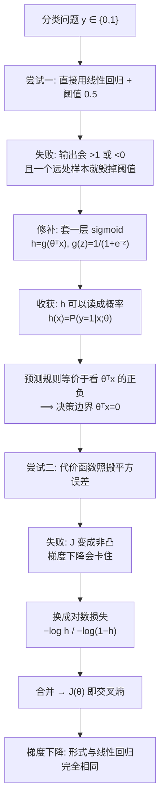

# C2.5 逻辑回归

> [!abstract] 这一讲的任务
> 第 1 章我们用决策树做分类，第 2 章前四讲我们用线性回归做回归。**这一讲把两条线合起来：用第 2 章的"参数化模型 + 优化"这套方法，去解决第 1 章那种"是/否"的问题。**
>
> 路线会很曲折，但每一次转折都有原因：
> 直接用线性回归 → **失败** → 套一个函数把输出压进 $[0,1]$ → 得到概率 → 直接照搬平方误差 → **又失败** → 换一个代价函数 → 成功，而且梯度形式竟然和线性回归一模一样。
>
> **这一讲学到的模型，是今天所有二分类神经网络的最后一层。** 它不是一个过时的老方法。

> [!info] 怎么读这份讲义
> 本讲有**两次"失败"**（第 2 节和第 5 节），它们是整讲的骨架——**看懂为什么失败，比记住最终公式重要得多**。考试常考的也正是这两个"为什么"。
> 正文里标着 **课堂板书** 的图与文字，是讲课人在幻灯片上现场写的，不是课件印刷内容（来历见下）。
> 标有 **（拓展）** 的部分第一遍可跳过。

> [!note] 关于本节课件与板书
> 本讲的课件 Lecture2-2.pdf（18 页）上**没有手写批注**，而且里面 sigmoid 曲线、代价函数曲线等几张图**是空白坐标轴**——只画了轴，曲线是留着上课手绘的。本讲这几张图已用程序重新绘制补齐。
>
> **补充（Lecture3 发下来之后）**：Lecture3 的 `log reg1.pptx` 前 21 页与本讲课件同源，但它是 **.pptx 原件**，内部保存了**完整的课堂板书墨迹**（InkML 格式，本讲对应 16 页）——包括上面那几张空坐标轴上**真正画出来的曲线**。这些墨迹在导出成 PDF 时会被丢弃，所以 Lecture2-2.pdf 里一笔也看不到。
>
> 本讲已把这 16 页板书按原色（蓝/红/品红）重新渲染回幻灯片，随对应知识点嵌入正文。**凡是标着「课堂板书」的图和文字，都是讲课人现场写的，不是课件印刷内容，也不是我的补充。**
>
> **墨迹的来历**：时间戳是 **2011 年 10 月**，说明是**该课件原讲者授课时留下的**，不是本学期课堂录屏。所以它们的地位是「**课件自带的权威讲解**」——比课件印刷内容多，但**不能用来判断本学期课堂讲没讲到**，「拓展」标注仍以本校课堂语音转写稿为准。

---

## 1. 开场：换一类问题

前四讲都在回答"**多少**"。现在换一类问题，它们只有两个答案。课件给了三个例子：

> [!important] 课件的例子
> - **Email: Spam / Not Spam?**（这封邮件是不是垃圾邮件）
> - **Online Transactions: Fraudulent (Yes / No)?**（这笔交易是不是欺诈）
> - **Tumor: Malignant / Benign?**（这个肿瘤是恶性还是良性）
>
> 输出只有两种取值：
> $$y\in\{0,1\}$$
> - **0：负类 "Negative Class"**（e.g., benign tumor 良性肿瘤）
> - **1：正类 "Positive Class"**（e.g., malignant tumor 恶性肿瘤）

![[C2.5-板书-分类问题与标签取值.png]]

**课堂板书**把三个例子里的 "Spam / Not Spam"、"Yes / No"、"Malignant / Benign" 分别圈出来，再从 $y\in\{0,1\}$ 引两条箭头指向右边 0 和 1 的解释——**在强调 0/1 只是我们给两类贴的编号**。

最下面还多写了一行课件上没有的：

$$y\in\{0,1,2,3\}$$

**也就是说，讲到这里就已经把多分类预告了**：二分类只是先把问题简化，标签取三个、四个值的情形后面会讲（见 [[C2.6 高级优化算法与多分类]]）。

> [!note] 哪一类当 1，是人为规定的
> 数学上叫谁 0、叫谁 1 完全自由。**惯例是把"我们想检出的那一类"设为 1**——恶性肿瘤、欺诈交易、垃圾邮件。
> 这只影响解释，不影响算法。（[[C1.2 决策树的表示与自顶向下归纳]] 里 $[9+,5-]$ 的"正例"是同一个概念。）
>
> 本讲只讨论**两类**，称为**二分类 binary classification**。多于两类的**多分类**后面会讲。

**本讲从头到尾用一个例子：根据肿瘤大小判断良恶性。** 横轴 Tumor Size，纵轴 Malignant? (0 或 1)。数据点分成左下一簇（$y=0$）和右上一簇（$y=1$）。

## 2. 第一次尝试：直接用线性回归

我们手上现成的工具就是线性回归。**能不能直接拿来用？**

想法很自然：拟合一条直线，然后**设一个阈值**把连续输出切成两类。

> [!important] Threshold classifier output $h_\theta(x)$ at 0.5（课件原文）
> - If $h_\theta(x)\ge 0.5$, predict "$y=1$"
> - If $h_\theta(x)< 0.5$, predict "$y=0$"

在数据"规规矩矩"的时候，这条直线穿过两簇之间，$h=0.5$ 对应的横坐标恰好落在两类的分界处——**看起来完全能用。**

**课件接下来做了一件事，把这个方案打垮了。**

### 2.1 失败一：加一个样本，分类器就坏了

课件的下一页，数据集**在右侧远处多了一个 $y=1$ 的样本**——一个特别大的恶性肿瘤。

> [!question] 停一下：这个新样本会带来什么影响？
> 它本身完全"正常"：又大又恶性，**完美符合"越大越可能恶性"的规律**，一点都不异常。
>
> 但线性回归为了最小化平方误差，**必须把直线往右下方压**——否则那个远点的残差平方会非常大。

> [!warning] 后果
> 直线一转动，**$h_\theta(x)=0.5$ 对应的那个横坐标就右移了**。
> ⟹ 原本能被正确判为恶性的一部分中等大小的肿瘤，**现在被判成了良性**。
>
> **一个完全正确、完全符合规律的新数据，反而让分类器变差了。** 这说明方法本身有问题。

这件事在课件上只有一页散点图，**两条直线和那条阈值线全是当场画的**：

![[C2.5-板书-线性回归做分类的失败.png]]

**课堂板书**把两次拟合叠在了同一张图上：品红色那条是原始数据拟合出的 $h_\theta(x)=\theta^Tx$，蓝色那条是**加进右侧那个远样本之后**重新拟合的直线——明显被压平、右移；水平虚线标着 **0.5**，两条直线与它的交点分别点了出来，右移的那一段用箭头标出。右上角那个远处的 ✕ 被圈起来，三个箭头一齐指向它：**它就是罪魁祸首**。

**同一份数据、同一个阈值，只因为多了一个完全正常的样本，分界点就跑了。** 两条线叠在一张图上，比任何文字都说明问题。

> [!important] 根本原因，值得记住
> **平方误差惩罚的是"预测值离 0/1 有多远"，而分类真正在乎的只是"落在阈值哪一边"。**
>
> 那个远点的 $h$ 值可能算出来是 3。平方误差认为它"错得离谱"（$(3-1)^2=4$），拼命想把直线拉下来去修它；
> 但从**分类**的角度看，$h=3\ge0.5$，**它早就对得不能再对了**，根本不需要修。
>
> **优化目标和真实目标不一致——这是一切建模错误里最隐蔽的一类。**

### 2.2 失败二：输出跑出 $[0,1]$

> [!important] 课件原文
> **Classification: $y=0$ or $1$**
> **$h_\theta(x)$ can be $>1$ or $<0$**
> **Logistic Regression: $0\le h_\theta(x)\le 1$**

线性回归的 $h_\theta(x)=\theta^Tx$ 是一条直线，**取值可以是任意实数**。

预测出 $h=1.7$ 或 $h=-0.3$——如果你想把 $h$ 解释成"是恶性的概率"，**这毫无意义**：概率不能大于 1，也不能小于 0。

> [!important] 于是需求明确了
> 我们要一个**输出被限制在 $[0,1]$ 之间**的模型。
> 这就是**逻辑回归 Logistic Regression**。

![[C2.5-板书-输出越界与逻辑回归目标.png]]

**课堂板书**把 "$y=0$ or $1$" 整个框起来、在 0 和 1 下面各画一个向上的箭头，把 "$>1$" 和 "$<0$" 划线标出。而最关键的一笔在左下角：**在 "Logistic Regression" 下面拉一条引线，写上 "Classification"。**

讲课人在引入这个名字的同一时刻就把它的误会点破了——

> [!warning] 名字上的坑，考试爱考
> **"Logistic Regression"里带着 "Regression"（回归），但它是一个分类算法。**
>
> 这是机器学习里最著名的命名遗留问题。原因是历史的：它源于统计学中对 logistic 函数做回归的方法——**回归的对象是"概率"这个连续量**，但最终用途是分类。
>
> **被问到"逻辑回归属于分类还是回归"，答案是分类。**

## 3. 修补：把输出压进 $[0,1]$

### 3.1 怎么压

我们不想丢掉 $\theta^Tx$ 这个线性部分——它承载了"各特征加权求和"这个合理的结构。

**那就在它外面套一层函数**，专门负责把任意实数压进 $[0,1]$：

> [!important] Logistic Regression Model
> **Want $0\le h_\theta(x)\le 1$**
> $$\boxed{\;h_\theta(x)=g(\theta^Tx),\qquad g(z)=\frac{1}{1+e^{-z}}\;}$$
>
> $g$ 称为 **Sigmoid function（S 型函数）**，也叫 **Logistic function（逻辑函数）**——**课件把两个名字并排写着，它们指同一个东西。**

合起来写成一条：
$$h_\theta(x)=\frac{1}{1+e^{-\theta^Tx}}$$

![[C2.5-sigmoid函数.png]]

上面这张 sigmoid 图是程序补画的；**课件原件上那个位置只有一个空坐标系**（标着 1、0.5、0），曲线留着上课画。讲课人画出来的是这样：

![[C2.5-板书-sigmoid与假设函数.png]]

这是本讲**板书价值最高的一张**。**课堂板书**用红色画出那条 S 形曲线，并且：在 $z$ 轴 0 处向上引箭头到 0.5，标出**曲线过 $(0,0.5)$**；顶部画虚线到 1，标出**上渐近线**；右端标注 $g(z)$，横轴标注 $z$。

左边那条推导链也全是手写的：

$$h_\theta(x)=g(\theta^Tx),\qquad g(z)=\frac{1}{1+e^{-z}}$$

其中 $g$ 括号里的 $z$ 被圈了出来，并用品红箭头指回 $\theta^Tx$ ——**明确 $z$ 只是 $\theta^Tx$ 的占位符**；右上角把两式代入后的合体形式用方框框住。图下方还写了一句 **"Parameters $\theta$"**：**要学的仍然只有 $\theta$，sigmoid 本身没有任何参数。**

### 3.2 sigmoid 的性质（必须记住）

> [!important] 五条关键性质
> | 性质 | 说明 |
> |---|---|
> | **值域 $0<g(z)<1$** | 恒成立——**永远达不到 0 和 1，但可以无限接近** |
> | **$g(0)=0.5$** | $g(0)=\frac{1}{1+e^0}=\frac{1}{2}$。**这是分类阈值 0.5 的来源** |
> | **$z\to+\infty$ 时 $g\to1$** | $e^{-z}\to0$，分母 $\to1$ |
> | **$z\to-\infty$ 时 $g\to0$** | $e^{-z}\to+\infty$，分母 $\to\infty$ |
> | **单调递增，关于 $(0,0.5)$ 中心对称** | $g(-z)=1-g(z)$ |
>
> **形状**：一条平滑的 "S"。中间（$z$ 接近 0）陡峭，两端逐渐压平（**饱和 saturate**）。

> [!question] 课堂追问：为什么偏偏是这个函数？换个别的不行吗？
> 三个理由，第三个最关键：
>
> **① 值域正好是 $(0,1)$** ⟹ 可以当概率用。
>
> **② 平滑可导** ⟹ 能用梯度下降。
> 对比一下：直接用**阶跃函数** $\text{sign}(z)$ 也能输出 0/1，但它在 0 处不可导、其他地方导数恒为 0——**梯度下降完全没法工作**（梯度处处为 0，参数永远不动）。
>
> **③ 导数形式漂亮得不像话：**
> $$g'(z)=g(z)\big(1-g(z)\big)$$
> **导数可以用函数值本身表示**，不需要重新算指数。这条性质会在第 7 节带来一个惊喜。

> [!note] 【拓展】 推一遍这个导数
> $$g(z)=(1+e^{-z})^{-1}$$
> $$g'(z)=-(1+e^{-z})^{-2}\cdot(-e^{-z})=\frac{e^{-z}}{(1+e^{-z})^2}=\underbrace{\frac{1}{1+e^{-z}}}_{g(z)}\cdot\frac{e^{-z}}{1+e^{-z}}$$
> 而
> $$\frac{e^{-z}}{1+e^{-z}}=\frac{(1+e^{-z})-1}{1+e^{-z}}=1-g(z)$$
> 所以
> $$g'(z)=g(z)\big(1-g(z)\big)\qquad\blacksquare$$

> [!tip] 专业关联（AI 方向）：这个函数你会用一辈子
> sigmoid 是最早的**神经网络激活函数 activation function**。
>
> 今天深度网络的**中间层**大多改用 **ReLU**——因为 sigmoid 两端饱和会导致**梯度消失 vanishing gradient**（$g'=g(1-g)$ 在 $g$ 接近 0 或 1 时趋于 0，梯度传不回去）。
>
> **但 sigmoid 牢牢占据着二分类网络的最后一层**，因为只有它能把任意实数变成一个概率。
> **你以后写的每一个二分类模型，最后一行几乎都是 `torch.sigmoid(...)`——就是这个函数。**

### 3.3 意外的收获：输出可以读成概率

我们本来只是想把输出压进 $[0,1]$，但压完之后，这个数**有了实际含义**：

> [!important] $h_\theta(x)$ 的解释
> $$h_\theta(x)=P(y=1\mid x;\theta)$$
> 读作：**"给定输入 $x$、参数为 $\theta$ 时，$y=1$ 的概率"**。
>
> 注意那个**分号**：**$x$ 是条件，$\theta$ 是参数（不是随机变量）**。课件在代价函数那页写出了这个记号。
>
> 因为只有两类，另一类的概率自然是：
> $$P(y=0\mid x;\theta)=1-h_\theta(x)$$

> [!example] 这个解释有多有用
> 某个肿瘤样本算出 $h_\theta(x)=0.7$，意思是：
> **"这个肿瘤有 70% 的概率是恶性的。"**
>
> 对比线性回归给出的 "1.7"——**后者你没法告诉医生，前者可以直接汇报。**
> 而且医生可以据此决定：0.7 要不要马上手术？如果是 0.95 呢？0.51 呢？**概率给了使用者调整决策的空间，硬标签没有。**

![[C2.5-板书-假设输出的概率解释.png]]

**课堂板书**在页面左下角补出了本节的核心等式 $h_\theta(x)=P(y=1\mid x;\theta)$ 与 $y=0\ \text{or}\ 1$；并把课件右下角那两行用不同颜色分别框出——蓝框是 $P(y=0\mid x;\theta)+P(y=1\mid x;\theta)=1$，红框是 $P(y=0\mid x;\theta)=1-P(y=1\mid x;\theta)$，**两框之间画了连接线，强调第二行只是第一行移项**，不是新知识。另外在 $h_\theta(x)=0.7$ 旁边补了一个 $y=1$，提示这个 0.7 说的是"**$y=1$ 的概率**"，不是"预测值是 0.7"。

### 3.4 预测规则可以化简

> [!important] 预测规则（课件原文）
> Suppose predict "$y=1$" if $h_\theta(x)\ge0.5$；predict "$y=0$" if $h_\theta(x)<0.5$。

这个规则要算 sigmoid、再和 0.5 比。**但利用 sigmoid 的性质，可以化简成一个更简单的形式：**

$$g(z)\ge0.5 \iff z\ge0\qquad(\text{因为 }g\text{ 单调递增且 }g(0)=0.5)$$

于是：

> [!important] 等价的预测规则（非常重要）
> $$h_\theta(x)\ge0.5 \iff \theta^Tx\ \ge\ 0\quad\Longrightarrow\quad \text{预测 } y=1$$
> $$h_\theta(x)< 0.5 \iff \theta^Tx\ <\ 0\quad\Longrightarrow\quad \text{预测 } y=0$$
>
> **判断类别，只需要看 $\theta^Tx$ 的正负号，根本不用算 sigmoid。**

课件这一页其实只印了"predict $y=1$ if $h_\theta(x)\ge0.5$"，**上面这个化简的全过程都在板书上**：

![[C2.5-板书-预测规则与z的正负.png]]

**课堂板书**在右侧写下整条推理链——$g(z)\ge0.5$ **when** $z\ge0$；$h_\theta(x)=g(\theta^Tx)$；$g(z)<0.5$ **when** $z<0$——再在左侧两条预测规则下面各补一行 $\theta^Tx\ge0$ 和 $\theta^Tx<0$。

**它把"为什么能这么换"写了出来：是 sigmoid 的单调性和 $g(0)=0.5$ 让阈值可以从 $h$ 搬到 $z$。** 这一步就是决策边界概念的全部来源。

> [!important] 这个化简直接引出了下一节
> 既然分类只看 $\theta^Tx$ 的符号，那么**分界处就是 $\theta^Tx=0$**。
> 这条线（面）有个名字：**决策边界**。

## 4. 决策边界 Decision Boundary

![[C2.5-决策边界-线性与非线性.png]]

### 4.1 线性决策边界

课件的例子：两个特征 $x_1,x_2$，模型

$$h_\theta(x)=g(\theta_0+\theta_1x_1+\theta_2x_2)$$

取一组具体参数 $\theta_0=-3,\ \theta_1=1,\ \theta_2=1$：

> [!important] Predict "$y=1$" if $-3+x_1+x_2\ge0$
> 即
> $$x_1+x_2\ \ge\ 3$$
>
> **边界是直线 $x_1+x_2=3$**（过 $(3,0)$ 和 $(0,3)$）：
> - 直线**右上方**：$\theta^Tx>0$ ⟹ 预测 $y=1$
> - 直线**左下方**：$\theta^Tx<0$ ⟹ 预测 $y=0$
> - 直线**上**：$\theta^Tx=0$，即 $h_\theta(x)=0.5$ ⟹ **决策边界 Decision Boundary**

![[C2.5-板书-线性决策边界例.png]]

**课堂板书**在这一页做了一次**完整的数值代入**：右上角写出 $\theta=[-3,\,1,\,1]^T$，然后在 $h_\theta(x)=g(\theta_0+\theta_1x_1+\theta_2x_2)$ 的 $\theta_0,\theta_1,\theta_2$ 下面逐个标出 $-3$、$1$、$1$；接着用蓝字把预测规则一路化简

$$-3+x_1+x_2\ge0\;\Longrightarrow\;\theta^Tx\ge0\;\Longrightarrow\;x_1+x_2\ge3$$

另一侧用品红框出临界情形 $h_\theta(x)=0.5\iff\boxed{x_1+x_2=3}$，并写出反向结论 $x_1+x_2<3\Rightarrow y=0$。图上那条 $x_1+x_2=3$ 的直线是画上去的，左下角圈出 $y=0$ 区域、右上角圈出 $y=1$ 区域，箭头引出 **"Decision boundary"** 指着那条线。

**这张图把"决策边界"从一个名词变成了一条你能亲手画出来的直线。**

> [!warning] 本讲最容易考错的概念
> **决策边界是"假设函数 + 参数"的性质，不是训练集的性质。**
>
> 换句话说：**只要 $\theta$ 定下来，边界就完全确定了——哪怕你把训练数据全删光，这条边界依然在那里。**
> 训练数据的唯一作用，是**帮我们挑出一组好的 $\theta$**。
>
> **常见的错误说法**："决策边界是把两类数据分开的那条线。"
> **不准确**——正确说法是"**方程 $\theta^Tx=0$ 描述的那条线**"。它可能分得很好，也可能分得一塌糊涂，**取决于 $\theta$ 好不好**。

### 4.2 非线性决策边界

> [!question] 停一下：如果两类数据不是被一条直线分开的，怎么办？
> 比如 $y=0$ 的点聚在原点附近，$y=1$ 的点散在外围一圈——**没有任何直线能分开它们。**
>
> **提示：上一讲刚学过一招。**

答案就是 [[C2.4 多项式回归与正规方程]] 的**特征工程**——往里加高次特征。

> [!important] Non-linear decision boundaries（课件例子）
> $$h_\theta(x)=g\big(\theta_0+\theta_1x_1+\theta_2x_2+\theta_3x_1^2+\theta_4x_2^2\big)$$
>
> 取 $\theta_0=-1,\ \theta_1=0,\ \theta_2=0,\ \theta_3=1,\ \theta_4=1$：
> $$\text{Predict "}y=1\text{" if}\quad -1+x_1^2+x_2^2\ \ge\ 0$$
> 即
> $$x_1^2+x_2^2\ \ge\ 1$$
>
> **边界是单位圆！**
> - **圆内**（$x_1^2+x_2^2<1$）⟹ 预测 $y=0$
> - **圆外** ⟹ 预测 $y=1$
>
> 正好匹配课件图上的数据形态。

课件还给了一个更复杂的例子，说明这条路能走多远：

$$h_\theta(x)=g\big(\theta_0+\theta_1x_1+\theta_2x_2+\theta_3x_1^2+\theta_4x_1^2x_2+\theta_5x_1^2x_2^2+\theta_6x_1^3x_2+\cdots\big)$$

**加入足够高次的多项式特征，决策边界可以是任意复杂的曲线**（课件画了一个不规则的闭合形状）。

![[C2.5-板书-非线性决策边界.png]]

**课堂板书**在上半部分同样做了数值代入：写出 $\theta=[-1,0,0,1,1]^T$ 并逐项对应标出，在预测规则下面补出 $x_1^2+x_2^2\ge1$，框出临界情形 $\boxed{x_1^2+x_2^2=1}$ ——**这就是单位圆**；图上那条圆形边界是画上去的（课件原图只有散点），并引出 **"Decision boundary"**，圆内标 $y=0$、圆外多处标 $y=1$。

下半部分课件只给了一个空坐标系，板书**手画了一条有凹有凸、形状很怪的闭合曲线**，内部标 $y=1$、外部标 $y=0$；配合那个含 $x_1^2x_2$、$x_1^2x_2^2$、$x_1^3x_2$ 的高次假设（这几项下面逐个划了线）。

**"多项式次数一高，决策边界可以扭成几乎任意形状"——这句话就是 [[C2.7 过拟合与正则化]] 的直接引子。**

> [!warning] 能力越强，越要小心
> 高次特征让模型可以画出极其扭曲的边界，把每一个训练点都"包"进正确的一侧——**这正是 [[C1.4 过拟合与剪枝]] 讲的过拟合。**
>
> 决策树靠**剪枝**控制复杂度；逻辑回归靠的是**正则化 regularization**（[[C2.4 多项式回归与正规方程]] 第 7 节预告过），后面会专门讲。

## 5. 第二次尝试与第二次失败：代价函数

模型有了，接下来要定代价函数——**怎么衡量一组 $\theta$ 好不好？**

**训练集：**
$$\{(x^{(1)},y^{(1)}),\cdots,(x^{(m)},y^{(m)})\},\qquad x\in\begin{bmatrix}x_0\\x_1\\\vdots\\x_n\end{bmatrix},\ x_0=1,\ y\in\{0,1\}$$
$$h_\theta(x)=\frac{1}{1+e^{-\theta^Tx}}$$

![[C2.5-板书-训练集与参数选择.png]]

**课堂板书**在这一页只补了一个维度标注，却很要紧：在特征向量 $x=[x_0,x_1,\ldots,x_n]^T$ 右边写上 $\mathbb{R}^{n+1}$ ——**$n$ 个特征加上恒为 1 的 $x_0$，一共 $n+1$ 维**（[[C2.3 多变量线性回归与梯度下降实践]] 那个约定，这里又一次派上用场）。

课件的问题：**How to choose parameters $\theta$ ?**

> [!question] 停一下：最自然的想法是什么？
> 当然是**照搬线性回归**：
> $$J(\theta)=\frac{1}{m}\sum_{i=1}^{m}\frac12\big(h_\theta(x^{(i)})-y^{(i)}\big)^2$$
> 平方误差用得好好的，为什么要换？

**答案：因为这样定义出来的 $J(\theta)$ 是非凸函数（non-convex）。**

> [!important] 为什么会变成非凸
> 回想 [[C2.2 梯度下降]] 第 4.1 节：线性回归里 $h_\theta(x)=\theta^Tx$ 对 $\theta$ **是线性的**，平方之后得到二次型 ⟹ **凸**。
>
> 但逻辑回归里 $h_\theta(x)=g(\theta^Tx)$ **中间夹了一个非线性的 sigmoid**。把这个 S 形函数再平方，得到的曲面**坑坑洼洼，有很多局部极小**。
>
> **后果（[[C2.2 梯度下降]] 第 4 节讲过）：梯度下降会卡在局部极小，结果取决于初始化，无法保证找到最优解。**

"非凸"两个字在课件上只是一个词加一个空坐标系；**那两条决定性的曲线是现场画的**：

![[C2.5-板书-平方误差非凸.png]]

**课堂板书**在这一页做了四件事：

1. 把课件印的 **"Linear regression"** 中的 "Linear" **划掉**，下面改写成 **"Logistic"** ——点明我们现在是把线性回归那个平方误差**照搬**过来；
2. 把 $\frac12(h_\theta(x^{(i)})-y^{(i)})^2$ 那一块圈出，引箭头写上 $\mathrm{Cost}(h_\theta(x^{(i)}),y)$ ——**"代价函数 = 单样本代价的平均"这个视角是板书引入的**，6.3 节合并式就建在它上面；
3. 右侧单独框出 $\dfrac{1}{1+e^{-\theta^Tx}}$ 并用箭头指回 $h_\theta$ ——**正是因为 $h$ 换成了 sigmoid，平方误差才会变非凸**；
4. **在两个空坐标轴上把曲线画了出来**：左边一条有五六个坑的波浪线（"non-convex"），右边一条光滑的碗形曲线（"convex"），并在碗形曲线上点出几个点、用箭头串成**一路滑到谷底**的轨迹。

**课件只印了 "non-convex" / "convex" 两个词和两个空坐标系。这两条曲线和那串下降箭头，是这一讲最核心的直觉，而它们全部来自板书。**

> [!important] 关键的思路转折
> 面对这个问题，有两条路：
> - **改优化算法**，让它能跳出局部极小 ⟹ 难，而且没有保证。
> - **换一个代价函数**，让它天生就是凸的 ⟹ **这才是正确的路。**
>
> 下面这个对数形式的代价函数，正是为此设计的。**它保证 $J(\theta)$ 关于 $\theta$ 是凸函数**，梯度下降必定找到全局最优。

## 6. 对数损失：把"自信地犯错"罚到痛

### 6.1 分情况定义

> [!important] Logistic regression cost function（考点）
> $$\mathrm{Cost}\big(h_\theta(x),y\big)=\begin{cases}
> -\log\big(h_\theta(x)\big) & \text{if } y=1\\[4pt]
> -\log\big(1-h_\theta(x)\big) & \text{if } y=0
> \end{cases}$$

![[C2.5-逻辑回归代价函数-两种情形.png]]

**先别管它为什么长这样，先看看它的行为。**

> [!important] 情形 $y=1$（真实标签是正类），课件原文
> > **Cost = 0 if $y=1$, $h_\theta(x)=1$**
> > **But as $h_\theta(x)\to 0$, $Cost\to\infty$**
> > **Captures intuition that if $h_\theta(x)=0$ (predict $P(y=1|x;\theta)=0$), but $y=1$, we'll penalize learning algorithm by a very large cost.**
>
> 逐句翻译：
> - 真值是 1，模型说"我 100% 确定是 1"（$h=1$）⟹ **代价 0**，完全正确。
> - 模型越往 0 猜，代价越大。
> - 模型说"我 100% 确定是 0"（$h\to0$），而真值偏偏是 1 ⟹ **代价趋于无穷大**。
>
> **一句话：对"极其自信但完全错误"的预测，施加极重的惩罚。**

![[C2.5-板书-对数损失y等于1.png]]

课件左侧同样只有一个空坐标系（横轴 $h_\theta(x)$ 从 0 到 1）。**课堂板书**画出了 $-\log h$ 的完整形状：**从 $h=1$ 处贴着横轴出发，向左迅速抬升，在 $h\to0$ 处冲向无穷**，纵轴顶端加了向上的箭头表示发散，$h=1$ 处点了一个实心点标出 Cost $=0$。右侧文字上把 "Cost $=0$ if $y=1,h_\theta(x)=1$"、"$h_\theta(x)\to0$"、"$Cost\to\infty$" 分别划线，并把 "but $y=1$" 框出；分段定义里 $-\log(h_\theta(x))$ 那一支被单独框住——**这一页只讲 $y=1$ 这一支**。

> [!important] 情形 $y=0$
> 完全对称：$h=0$（说"确定是 0"）⟹ 代价 0 ✅；$h\to1$（说"确定是 1"）⟹ 代价 $\to\infty$ ❌

![[C2.5-板书-对数损失y等于0.png]]

$y=0$ 这一支的曲线同样是空坐标系上现场画的：**从 $h=0$ 处的实心点（Cost $=0$）出发缓慢上升，接近 $h=1$ 时急剧冲高**，并在 $h=1$ 处画了一条红色竖虚线表示渐近线。

**课堂板书**还在右侧**另画了一个小坐标系**，写着 $-\log(1-z)$，横轴标 0 和 1，画出同样形状的曲线。**这是在提示：把 $h$ 换成一般的变量 $z$，$-\log(1-z)$ 就是 $-\log z$ 左右翻转。两支损失曲线是同一个函数的镜像，不必分别记。**

### 6.2 为什么用 $-\log$

> [!question] 课堂追问：能达到"预测越准代价越小"的函数很多，为什么偏偏是对数？
> 三个理由：
>
> **① 形状对：** $-\log$ 在 $(0,1]$ 上单调递减，且 $-\log 1=0$ ⟹ 天然满足"完全预测对时代价为 0，越偏离代价越大"。
>
> **② 惩罚力度对：** 在 0 附近 $-\log$ 趋于 $+\infty$。对比一下平方误差：
> | | $y=1$ 但 $h=0.01$ 时的代价 |
> |---|---|
> | 对数损失 | $-\ln(0.01)\approx\mathbf{4.61}$ |
> | 平方误差 | $\frac12(0.01-1)^2\approx\mathbf{0.49}$ |
>
> **模型"极其自信地犯了错"，平方误差只罚 0.49——罚得太轻，根本驱动不了模型改正。** 而且平方误差的代价**最多也就 0.5**，天花板极低。
>
> **③ 保证凸性：** 这才是它被选中的决定性理由（第 5 节）。

> [!tip] 这个函数其实是老熟人：它就是交叉熵
> **对数损失在信息论里叫交叉熵 cross-entropy。**
>
> 回想 [[C1.3 熵与信息增益]]：$-\log p$ 正是"概率为 $p$ 的事件发生时携带的信息量 / **惊讶度**"，而熵就是平均惊讶度。
>
> ⟹ **这里的代价 = 模型对"真实发生的事"的平均惊讶度。**
> 模型越是对真实结果感到意外，说明它学得越差。
>
> **第 1 章的熵和第 2 章的逻辑回归，在这里接上了。**

### 6.3 合并成一条式子

分情况写在数学和代码里都不方便。课件把它合并了：

> [!important] 合并形式（考点，必须默写）
> $$\mathrm{Cost}\big(h_\theta(x),y\big)=-y\log\big(h_\theta(x)\big)-(1-y)\log\big(1-h_\theta(x)\big)$$
>
> 总代价：
> $$J(\theta)=\frac{1}{m}\sum_{i=1}^{m}\mathrm{Cost}\big(h_\theta(x^{(i)}),y^{(i)}\big)$$
> $$\boxed{\;J(\theta)=-\frac{1}{m}\left[\sum_{i=1}^{m}y^{(i)}\log h_\theta(x^{(i)})+(1-y^{(i)})\log\big(1-h_\theta(x^{(i)})\big)\right]\;}$$

> [!note] 合并式为什么成立——一个"开关"技巧
> 因为 $y$ **只能取 0 或 1**，两项里**总有一项被乘成 0**：
> - **$y=1$**：$-1\cdot\log h-(1-1)\log(1-h)=-\log h$ ✓ 只剩第一项
> - **$y=0$**：$-0\cdot\log h-(1-0)\log(1-h)=-\log(1-h)$ ✓ 只剩第二项
>
> **$y$ 和 $(1-y)$ 在这里当"开关"用**，自动挑出正确的那一项。
>
> **这个技巧在机器学习里非常常见。** 以后看到形如 $y\cdot A+(1-y)\cdot B$ 的式子，就该立刻反应："这是在做二选一。"

课件上其实**只印了合并前的分段式**和一句 "Note: $y=0$ or 1 always"；合并式本身，以及上面那两次代入验算，都是当场写的：

![[C2.5-板书-合并两段式代价函数.png]]

**课堂板书**用红字写出合并式，然后**把两个系数分别圈出来做验算**：在 $y$ 下面标 $=0$、在 $(1-y)$ 下面标 $=1$（这是 $y=0$ 的情形），再用品红字补出两行结论 $\text{If }y=1:\ \mathrm{Cost}=-\log h_\theta(x)$ 和 $\text{If }y=0:\ \mathrm{Cost}=-\log(1-h_\theta(x))$，并用箭头连回上面分段定义里对应的那一支。

**这也解释了课件那句 Note 的用意**：正因为 $y$ 只能取 0 或 1，两个系数才能互相开关。

> [!note] 【拓展】 这个代价函数是从 MLE 推出来的
> 你在概率统计学过极大似然估计。把两种情形合写成一条概率质量函数：
> $$P(y\mid x;\theta)=h_\theta(x)^{\,y}\big(1-h_\theta(x)\big)^{1-y}$$
> （验证：$y=1$ 时为 $h$；$y=0$ 时为 $1-h$ ✓ ——**又是同一个开关技巧**）
>
> 假设 $m$ 个样本独立，似然函数
> $$L(\theta)=\prod_{i=1}^{m}h_\theta(x^{(i)})^{y^{(i)}}\big(1-h_\theta(x^{(i)})\big)^{1-y^{(i)}}$$
> 取对数：
> $$\ell(\theta)=\sum_{i=1}^m\Big[y^{(i)}\log h_\theta(x^{(i)})+(1-y^{(i)})\log\big(1-h_\theta(x^{(i)})\big)\Big]$$
> 对比上面的 $J$：
> $$J(\theta)=-\frac{1}{m}\,\ell(\theta)$$
> **最小化 $J$ ⟺ 最大化对数似然。**
>
> **这与 [[C2.1 单变量线性回归与代价函数]] 里"平方误差 ⟸ 高斯噪声下的 MLE"完全平行：**
> | 模型 | 代价函数 | 背后的分布假设 |
> |---|---|---|
> | 线性回归 | 平方误差 | 高斯噪声 |
> | 逻辑回归 | 对数损失 | 伯努利分布 |
>
> **两个代价函数都不是拍脑袋定的，都是 MLE 在不同概率假设下的产物。**

### 6.4 训练与预测

> [!important] 课件的收尾
> **To fit parameters $\theta$:** $\displaystyle\min_\theta J(\theta)$
>
> **To make a prediction given new $x$:**
> $$\textbf{Output } h_\theta(x)=\frac{1}{1+e^{-\theta^Tx}}$$
>
> 注意课件强调 Output 的是 $h_\theta(x)$ **本身，即概率**。
> 要不要把它转成 0/1 的硬标签，是**使用者的决定**：阈值默认 0.5，但在医疗筛查等场景常常调低（宁可多报也不能漏诊）。

![[C2.5-板书-简化代价函数与预测.png]]

**课堂板书**把 $\min_\theta J(\theta)$ 框起来，旁边写上 **"Get $\theta$"** ——点明**训练这件事的产出就是一组 $\theta$**；右下角在预测式旁边补写 $P(y=1\mid x;\theta)$，**即：预测时吐出来的那个数要读成概率**，呼应 3.3 节。

---

## 7. 求解：一个让人愣一下的结果

> [!important] Gradient Descent（课件）
> $$J(\theta)=-\frac{1}{m}\left[\sum_{i=1}^{m}y^{(i)}\log h_\theta(x^{(i)})+(1-y^{(i)})\log\big(1-h_\theta(x^{(i)})\big)\right]$$
> **Want $\min_\theta J(\theta)$:**
> $$\text{Repeat }\{\quad \theta_j := \theta_j-\alpha\frac{\partial}{\partial\theta_j}J(\theta)\quad\}\qquad\text{(simultaneously update all }\theta_j)$$
>
> 把偏导数算出来后：
> $$\boxed{\;\theta_j := \theta_j-\alpha\,\frac{1}{m}\sum_{i=1}^{m}\big(h_\theta(x^{(i)})-y^{(i)}\big)x_j^{(i)}\;}$$
>
> 课件在这一页的最后写了一句话：
> > **Algorithm looks identical to linear regression!**
> > （算法看起来和线性回归一模一样！）

课件这一页其实只写到 $\theta_j:=\theta_j-\alpha\frac{\partial}{\partial\theta_j}J(\theta)$，**那个偏导等于什么是板书补的**：

![[C2.5-板书-梯度下降与偏导结果.png]]

**课堂板书**直接写出

$$\frac{\partial}{\partial\theta_j}J(\theta)=\frac{1}{m}\sum_{i=1}^m\big(h_\theta(x^{(i)})-y^{(i)}\big)x_j^{(i)}$$

并用箭头指回上面的更新式。**先给结果、再讲来路**——它的来路就是下面 7.1 的推导。

**这确实很意外。** 我们换了假设函数（加了 sigmoid）、换了代价函数（从平方误差变成对数损失），**结果梯度公式一个字都没变？**

### 7.1 为什么会这样——推一遍就明白了

> [!example] 【拓展】 推导 $\frac{\partial J}{\partial\theta_j}$
> 记 $z=\theta^Tx$，$h=g(z)$。要用两条：
> - $g'(z)=g(z)(1-g(z))$（第 3.2 节推过）
> - $\dfrac{\partial z}{\partial\theta_j}=x_j$
>
> 先看**单个样本**的代价 $C=-y\log h-(1-y)\log(1-h)$，对 $h$ 求导：
> $$\frac{\partial C}{\partial h}=-\frac{y}{h}+\frac{1-y}{1-h}=\frac{-y(1-h)+(1-y)h}{h(1-h)}=\frac{h-y}{h(1-h)}$$
> 再用链式法则乘上 $\frac{\partial h}{\partial z}=h(1-h)$ 和 $\frac{\partial z}{\partial\theta_j}=x_j$：
> $$\frac{\partial C}{\partial\theta_j}=\underbrace{\frac{h-y}{h(1-h)}}_{\partial C/\partial h}\cdot\underbrace{h(1-h)}_{\partial h/\partial z}\cdot\underbrace{x_j}_{\partial z/\partial\theta_j}=(h-y)\,x_j$$
>
> **看到关键的那一步了吗：分母上的 $h(1-h)$ 被 sigmoid 的导数完美约掉了。**
>
> 对 $m$ 个样本取平均：
> $$\frac{\partial J}{\partial\theta_j}=\frac{1}{m}\sum_{i=1}^{m}\big(h_\theta(x^{(i)})-y^{(i)}\big)x_j^{(i)}\qquad\blacksquare$$

> [!important] 这不是巧合，是设计
> $h(1-h)$ 能被约掉，是因为**对数损失和 sigmoid 是配套设计的**：
> - sigmoid 的导数带一个 $h(1-h)$；
> - 对数损失对 $h$ 的导数带一个 $\frac{1}{h(1-h)}$。
>
> **两者相乘，正好抵消。** 如果当初用的是平方误差，这里就约不掉，梯度会多带一个 $h(1-h)$ 因子——而这个因子在 $h$ 接近 0 或 1 时趋于 0，会让梯度**几乎消失**，模型学不动。
>
> **所以换代价函数不只是为了凸性，还顺手治好了梯度消失。**

### 7.2 "看起来一样"≠ 是同一个算法

> [!warning] 别被那句 "looks identical" 骗了
> $$\text{线性回归：}\quad\theta_j:=\theta_j-\alpha\frac1m\sum_i\big(h_\theta(x^{(i)})-y^{(i)}\big)x_j^{(i)},\qquad h_\theta(x)=\theta^Tx$$
> $$\text{逻辑回归：}\quad\theta_j:=\theta_j-\alpha\frac1m\sum_i\big(h_\theta(x^{(i)})-y^{(i)}\big)x_j^{(i)},\qquad h_\theta(x)=\frac{1}{1+e^{-\theta^Tx}}$$
>
> **外壳完全相同，但 $h_\theta(x)$ 的定义不同，最小化的代价函数也不同。**
> ⟹ **它们是两个不同的算法，只是长得像。**
>
> **好消息是：** [[C2.3 多变量线性回归与梯度下降实践]] 学的所有实践技巧——**特征缩放、画 $J$ 曲线诊断、按 3 倍试 $\alpha$、同步更新**——**全部原样适用于逻辑回归**，不用重新学。

![[C2.5-板书-梯度形式与线性回归相同.png]]

**课堂板书**把这件事摆得更直观：整条更新式用蓝框框住，再用红框单独框出里面的 $h_\theta(x^{(i)})$，从红框引一条长箭头到右下角写着 $h_\theta(x)=\frac{1}{1+e^{-\theta^Tx}}$，而右上角另写 $h_\theta(x)=\theta^Tx$。

**同一个位置，两种不同的 $h$——这就是"形式相同、算法不同"的全部含义**，两个 $h$ 并排摆出来，差别不用解释也看得见。左侧还补了参数向量的展开 $\theta=[\theta_0,\theta_1,\theta_2,\ldots,\theta_n]^T$ 与 "for $j=0$ to $n$"，提醒**每一轮要更新的是整个向量的每一个分量**（同步更新）。

> [!tip] 【拓展】 为什么会有这个"巧合"：广义线性模型
> **【拓展】** 线性回归+平方误差、逻辑回归+对数损失，都属于**广义线性模型 GLM（Generalized Linear Model）** 家族。
>
> GLM 的一个普遍结论是：**只要"链接函数"和"指数族分布"配对正确，梯度永远是 $\frac1m\sum(h-y)x_j$ 这个形式。** 泊松回归、softmax 回归（多分类）的梯度也长这样。
>
> **这就是深度学习框架能用同一套反向传播代码处理各种损失函数的根本原因。**

> [!note] 【拓展】 还有更快的优化算法
> 除梯度下降外，还有 **共轭梯度 Conjugate gradient、BFGS、L-BFGS** 等高级算法。
> **优点**：不需要手动选 $\alpha$（内部自动做线搜索），通常收敛更快。**缺点**：更复杂。
> 实践中直接调库：`scipy.optimize.minimize`、`sklearn.linear_model.LogisticRegression`（默认就用 L-BFGS）。

## 8. 这一讲的三句话

> [!important] 如果只带走三句话
> 1. **线性回归做不了分类（输出会越界、且被远处样本带偏），所以套一层 sigmoid 把输出压成概率：$h_\theta(x)=g(\theta^Tx)=P(y=1\mid x;\theta)$。**
> 2. **代价函数不能用平方误差（会非凸），要用对数损失（交叉熵）：$J(\theta)=-\frac1m\sum[y\log h+(1-y)\log(1-h)]$。**
> 3. **决策边界是 $\theta^Tx=0$，它由参数决定而非数据决定；梯度下降的更新式与线性回归形式相同。**

| 概念 | 要点 |
|---|---|
| 分类 | $y\in\{0,1\}$，0=负类，1=正类 |
| 为什么不用线性回归 | ① 输出可能 $>1$ 或 $<0$；② 一个远处样本就会拖动直线、移动阈值 |
| 假设函数 | $h_\theta(x)=g(\theta^Tx)$，$g(z)=\frac{1}{1+e^{-z}}$ |
| sigmoid 性质 | 值域 $(0,1)$；$g(0)=0.5$；$g'=g(1-g)$；$g(-z)=1-g(z)$ |
| 概率解释 | $h_\theta(x)=P(y=1\mid x;\theta)$，$P(y=0\mid x;\theta)=1-h_\theta(x)$ |
| 预测规则 | $h\ge0.5\iff\theta^Tx\ge0$ ⟹ 预测 $y=1$ |
| 决策边界 | $\theta^Tx=0$；**由假设与参数决定，不是训练集的性质** |
| 非线性边界 | 加高次特征，如 $-1+x_1^2+x_2^2\ge0$ 得到单位圆 |
| 为什么不用平方误差 | 套上 sigmoid 后 $J$ **非凸**，梯度下降会卡在局部极小 |
| 代价函数 | $-\log h$（$y=1$）/ $-\log(1-h)$（$y=0$）；合并为 $-y\log h-(1-y)\log(1-h)$ |
| $J(\theta)$ | $-\frac1m\sum[y\log h+(1-y)\log(1-h)]$，即**交叉熵**，来自 **MLE** |
| 梯度下降 | $\theta_j:=\theta_j-\alpha\frac1m\sum(h_\theta(x^{(i)})-y^{(i)})x_j^{(i)}$，**形式与线性回归相同** |

> [!note] 第 2 章到此结束
> 回头看这一章走过的路：
> **单变量线性回归 → 代价函数 → 梯度下降 → 多变量 → 工程实践 → 特征工程 → 正规方程 → 逻辑回归。**
>
> 你现在掌握的这套"**定义模型 → 定义代价 → 用梯度下降最小化**"的流程，**就是现代机器学习的通用骨架**。后面学的每一个新模型，都只是在这三步里换零件。

---

## 9. 本节自测 Self-Test

> [!question] 先自己做，再看答案
> 1. 逻辑回归是分类算法还是回归算法？名字为什么带 "Regression"？
> 2. 用线性回归做分类有哪两个问题？第一个问题的根本原因是什么？
> 3. 计算 $g(0)$、$g(2)$、$g(-2)$（三位小数），并验证 $g(-2)=1-g(2)$。
> 4. 某样本 $h_\theta(x)=0.3$。预测哪一类？$P(y=0\mid x;\theta)$ 是多少？
> 5. $\theta=[-6,1,1]^T$，特征 $[1,x_1,x_2]$。写出决策边界方程，判断点 $(2,3)$ 属于哪类。
> 6. 为什么逻辑回归不能用平方误差做代价函数？
> 7. 真实 $y=1$、模型输出 $h=0.01$，对数损失是多少？平方误差是多少？说明这个差别的意义。
> 8. 把合并形式的 Cost 代入 $y=0$，验证它退化为 $-\log(1-h)$。
> 9. 逻辑回归和线性回归的梯度下降更新式看起来一样，它们是同一个算法吗？
> 10. 决策边界是由训练数据决定的，还是由参数决定的？
> 11. 如果把 sigmoid 换成阶跃函数（$z\ge0$ 输出 1，否则 0），会有什么问题？

> [!success]- 参考答案
> 1. **分类算法**。名字带 "Regression" 是历史遗留：它源于统计学中对 **logistic 函数**做回归——**回归的对象是概率**（连续量），但最终用途是分类。
> 2. ① **$h_\theta(x)$ 可能 $>1$ 或 $<0$**，无法解释成概率；② **对远处样本过度敏感**——一个位置很远但完全正确的样本会把拟合直线拽偏，使 $h=0.5$ 的阈值位置移动，把原本分对的样本分错。
>    第二个问题的**根本原因**：平方误差惩罚的是"离 0/1 多远"，而分类只关心"在阈值哪一边"——**优化目标和真实目标不一致**。
> 3. $g(0)=\frac{1}{1+1}=\mathbf{0.500}$；$g(2)=\frac{1}{1+e^{-2}}=\frac{1}{1.1353}=\mathbf{0.881}$；$g(-2)=\frac{1}{1+e^{2}}=\frac{1}{8.389}=\mathbf{0.119}$。
>    验证：$1-g(2)=1-0.881=0.119=g(-2)$ ✓
> 4. $h=0.3<0.5$ ⟹ **预测 $y=0$**。$P(y=0\mid x;\theta)=1-0.3=\mathbf{0.7}$。
> 5. $\theta^Tx=-6+x_1+x_2$，边界为 $$-6+x_1+x_2=0\ \Longrightarrow\ \mathbf{x_1+x_2=6}$$
>    点 $(2,3)$：$-6+2+3=-1<0$ ⟹ **预测 $y=0$**。
> 6. 因为 $h_\theta(x)=g(\theta^Tx)$ 中间夹了非线性的 sigmoid，平方之后 $J(\theta)$ **不再是凸函数**，曲面有很多局部极小 ⟹ 梯度下降可能卡住，结果依赖初始化。改用对数损失后 $J$ 是凸的。
> 7. **对数损失**：$-\ln(0.01)\approx\mathbf{4.61}$。**平方误差**：$\frac12(0.01-1)^2\approx\mathbf{0.49}$。
>    **意义**：模型"极其自信地犯了错"，对数损失罚 4.61，平方误差只罚 0.49——**罚得太轻，驱动不了模型改正**；而且平方误差的代价上限只有 0.5，对数损失则趋于无穷。
> 8. $y=0$ 代入：$-0\cdot\log h-(1-0)\log(1-h)=-\log(1-h)$ ✓ 第一项被 $y=0$ 乘没了。
> 9. **不是同一个算法。** 更新式的**外壳相同**，但 $h_\theta(x)$ 定义不同（$\theta^Tx$ vs $\frac{1}{1+e^{-\theta^Tx}}$），最小化的代价函数也不同（平方误差 vs 交叉熵）。
>    好处是：特征缩放、$J$ 曲线诊断、选 $\alpha$ 的方法可以**原样复用**。
> 10. **由参数 $\theta$ 决定**。边界就是方程 $\theta^Tx=0$ 描述的那条线/面，$\theta$ 一定边界就定了。训练数据的作用只是**帮我们挑出一组好的 $\theta$**。
> 11. 阶跃函数**在 0 处不可导，其他地方导数恒为 0** ⟹ **梯度处处为 0，梯度下降完全无法工作**（参数永远不更新）。
>     此外它的输出只有 0 和 1 两个值，**无法表达"有多确定"**，失去了概率解释。

---

**上一节：** [[C2.4 多项式回归与正规方程]] ｜ **本章结束**
**课程索引：** [[机器学习课程 MOC]]
