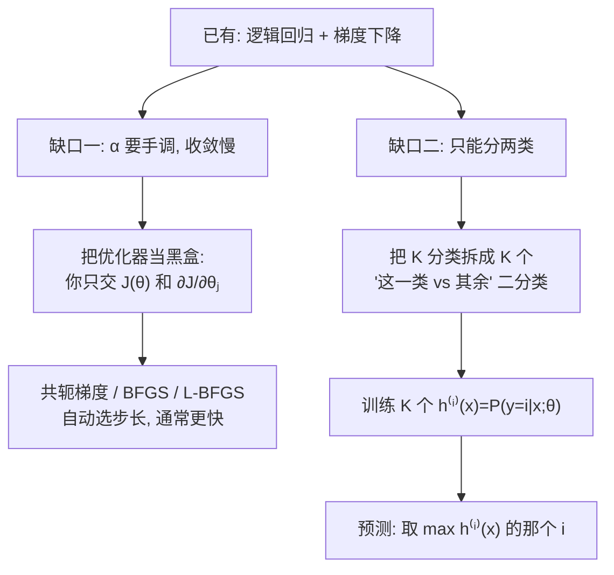

# C2.6 高级优化算法与多分类

> [!abstract] 这一讲的任务
> [[C2.5 逻辑回归]] 结束时，我们手上有一个能用的二分类器：假设函数 $h_\theta(x)=g(\theta^Tx)$，代价函数是对数损失，用梯度下降就能训练。
>
> 这一讲补两个**实战中一定会撞上的缺口**：
> 1. **梯度下降不是唯一的优化器，而且往往不是最好的那个。** 工程上真正在用的是共轭梯度、BFGS、L-BFGS——它们不用你手调学习率 $\alpha$，还更快。这一讲讲清楚：要用它们，你需要提供什么。
> 2. **现实里的分类问题很少只有两类。** 邮件要分到 Work / Friends / Family / Hobby 四个文件夹，天气要分成晴/阴/雨/雪。只会二分类的逻辑回归怎么办？答案叫 **One-vs-all**，它把 $K$ 分类拆成 $K$ 个二分类问题。
>
> 这两件事有一个共同的思想：**不要重新发明轮子，把新问题化归成你已经会解的老问题。**

> [!info] 怎么读这份讲义
> 第 1–2 节讲优化器，重点是**“你要交出什么，库负责什么”**这条接口；第 3–4 节讲多分类，重点是**为什么能拆、拆完怎么合回去**。
> 标有 **（拓展）** 的内容，是由课件和教材延伸补充的部分。复习时可先掌握主干内容，行有余力再看拓展部分。



---

## 1. 开场：一个调参调到崩溃的下午

你按 [[C2.2 梯度下降]] 的做法训练逻辑回归。$\alpha=0.01$，跑 1000 次迭代，$J$ 还在慢慢往下掉，看不出收没收敛。改成 $\alpha=1$，$J$ 直接冲到 NaN。改成 $\alpha=0.3$，跑了 5000 次才勉强平了。

你花在**试 $\alpha$** 上的时间，比花在建模上的还多。

> [!question] 停一下，先自己想想
> 梯度下降每一步都是 $\theta_j:=\theta_j-\alpha\frac{\partial}{\partial\theta_j}J(\theta)$。梯度告诉了你**往哪个方向走**，$\alpha$ 决定**走多远**。
>
> 问题来了：**“走多远”这件事，真的必须由人来定吗？**
>
> 站在山坡上，你知道下坡方向。要走多远其实是可以现场试的——往那个方向走一小步，看看 $J$ 降了没；再走远一点，看看还降不降；直到再走就开始上坡了，那就停在最低处。这个过程完全可以写成代码。

**能。而且早就有人写好了。** 这类算法叫**高级优化算法 Advanced Optimization Algorithms**，它们内部自带**线搜索 line search**，每一步自动挑一个合适的步长。

**你刚才想的，就是高级优化算法要做的事。** 这一讲先把它的使用接口讲清楚。

---

## 2. 优化算法：你交什么，库做什么

### 2.1 抽象出来的接口

> [!important] Optimization algorithm
> Cost function $J(\theta)$. Want $\min_\theta J(\theta)$.
> Given $\theta$, we have code that can compute
> - $J(\theta)$
> - $\frac{\partial}{\partial\theta_j}J(\theta)$ （for $j=0,1,\ldots,n$）

这三行是这一节的**全部**内容，值得慢慢读。

这三行把优化问题剥到了只剩骨头：**优化器不需要知道你在做逻辑回归还是线性回归，不需要知道什么是 sigmoid，不需要看见你的数据。** 它只需要你提供一个函数——给它一个 $\theta$，你返回两样东西：

1. 在这个 $\theta$ 处，代价是多少（$J(\theta)$，一个数）；
2. 在这个 $\theta$ 处，每个方向的坡度是多少（$\frac{\partial}{\partial\theta_j}J(\theta)$，一个 $n+1$ 维向量）。

注意梯度不是一个数，而是 $j=0,1,\ldots,n$ 每个分量各一个。再回头看梯度下降的更新式 $\theta_j:=\theta_j-\alpha\frac{\partial}{\partial\theta_j}J(\theta)$：里面用到的那个 $\frac{\partial}{\partial\theta_j}J(\theta)$，正是你在这里算出来交出去的东西。**优化器需要的全部输入，就只有这两样。**

![[C2.6-板书-优化器接口.png]]

> [!important] 这就是“接口”的含义
> **你负责：写出 $J$ 和梯度的计算代码。**
> **库负责：怎么用这两个数往下走、走多远、什么时候停。**
>
> 梯度下降只是这个接口上**最朴素的一种实现**：
> ```
> Repeat {
>     θⱼ := θⱼ − α (∂/∂θⱼ) J(θ)
> }
> ```
> 它拿到梯度就按固定倍数 $\alpha$ 走，从不思考。而后面几种会思考。

> [!note] 为什么对 $J(\theta)$ 和梯度都要
> 初学者常问：既然更新只用梯度，为什么还要算 $J(\theta)$？
> 因为高级算法要**在候选步长之间做比较**——走 0.1 和走 0.5 哪个更好？必须真的把 $J$ 算出来看看。梯度下降不比较，所以它不需要 $J$；但正因为不比较，它才必须靠你来定 $\alpha$。
>
> 顺便：[[C2.3 多变量线性回归与梯度下降实践]] 里用 $J$–迭代次数曲线诊断 $\alpha$，也需要每轮算 $J$。所以实践中你本来就在算它。

### 2.2 四种优化算法与取舍

> [!important] Optimization algorithms / Advantages / Disadvantages
> **Optimization algorithms:**
> - Gradient descent（梯度下降）
> - Conjugate gradient（共轭梯度法）
> - BFGS
> - L-BFGS
>
> **Advantages:**
> - No need to manually pick $\alpha$（不用手动挑学习率）
> - Often faster than gradient descent.（通常比梯度下降快）
>
> **Disadvantages:**
> - More complex（更复杂）

这四个算法**不是并列的四选一**，要分成两类看：**梯度下降自成一类；共轭梯度、BFGS、L-BFGS 是另一类**，后三个共享同一组优缺点——不用调 $\alpha$、通常更快、但实现复杂。而**不论你换成哪一个，要交出去的东西都一模一样**：$J(\theta)$ 和它的梯度。

![[C2.6-板书-四种优化算法.png]]

光有名字不够，还得知道**它们凭什么更快**，以及**“更复杂”复杂在哪**：

> [!note] 这三种算法在做什么（拓展）
> 都不要求你会推导，但知道它们的思路能让你在面试和调库时不慌。
>
> - **共轭梯度 Conjugate Gradient (CG)**：梯度下降在狭长的碗里会来回“之”字形震荡（[[C2.3 多变量线性回归与梯度下降实践]] 里特征缩放那张等高线图就是这个现象）。CG 的做法是：**每一步的方向都要求与之前走过的方向“共轭”**，粗略地说就是“不要把上一步已经做好的事情再搞坏”，于是不会反复横跳。
> - **BFGS**：梯度只告诉你坡度（一阶信息）。如果还知道**坡度变化有多快**（二阶信息，即 Hessian 矩阵），就能直接算出“这个方向应该走多远”——这是牛顿法的思想。但 $n$ 个参数的 Hessian 是 $n\times n$ 的，算它、求它的逆都太贵。BFGS 的做法是**用历次的梯度差去近似 Hessian 的逆**，不直接算。
> - **L-BFGS**（Limited-memory BFGS）：BFGS 还是要存一个 $n\times n$ 矩阵，$n=10^6$ 时存不下。L-BFGS 只保留**最近若干步**（典型是 5–20 步）的信息来近似，内存变成 $O(n)$。
>
> **“更复杂”复杂在哪**：这几个算法都有几百行的实现细节（线搜索的 Wolfe 条件、数值稳定性、矩阵更新公式）。**结论是：不要自己实现，调库。** 下面就看怎么调库。

> [!warning] 易错点：优化算法 ≠ 模型
> 换优化器**不会改变你最终要拟合的模型**，$J(\theta)$ 是同一个，最优解 $\theta^*$ 是同一个（凸问题下唯一）。变的只是**从初值走到最优解的路径和用时**。
>
> 考试里如果问“把梯度下降换成 L-BFGS，逻辑回归的决策边界会不会变”——**收敛后不会变**。

> [!note] 接到你的专业方向上（拓展）
> 深度学习里主流优化器是 SGD、Momentum、**Adam** 等，不是 L-BFGS。原因是：L-BFGS 这类方法要求每次都在**全部数据**上算准确的 $J$ 和梯度，而深度学习的数据量让这不现实，只能用小批量的**带噪声**梯度，二阶近似就不可靠了。
> 但接口完全一样：你在 PyTorch 里写 `loss.backward()` 交出梯度，`optimizer.step()` 由库决定怎么走——**正是上面这三行接口**。PyTorch 里也确实有 `torch.optim.LBFGS`，用于小规模全批量问题。

### 2.3 怎么调库：一个玩具例子

先用一个**极简的例子**演示调库，好让你把注意力放在“接口长什么样”上。

> [!example] 例子：$\theta$ 只有两个分量
> $$\theta=\begin{bmatrix}\theta_1\\\theta_2\end{bmatrix},\qquad J(\theta)=(\theta_1-5)^2+(\theta_2-5)^2$$
> $$\frac{\partial}{\partial\theta_1}J(\theta)=2(\theta_1-5),\qquad \frac{\partial}{\partial\theta_2}J(\theta)=2(\theta_2-5)$$
>
> 手算验证：$J$ 是两个平方和，显然在 $\theta_1=\theta_2=5$ 时取到最小值 $0$。求导也对：$\frac{d}{d\theta_1}(\theta_1-5)^2=2(\theta_1-5)$，令它为 0 得 $\theta_1=5$。**所以标准答案是 $\theta^*=(5,5)$，最小值 0。**
>
> 先知道标准答案，再去看代码跑出来对不对。这是个好习惯：调库的时候，你必须有办法判断库有没有骗你。

对应的代码（Octave/MATLAB 语法）。读的时候把左边的数学和这里的代码逐行对上：$J(\theta)$ 的两个平方项就是 `jVal`，$\frac{\partial}{\partial\theta_1}J=2(\theta_1-5)$ 就是 `gradient(1) = 2*(theta(1)-5);`，$\theta_2$ 那行同理。**2.1 那个接口落到实处，就是这样一个函数。**

```matlab
function [jVal, gradient] = costFunction(theta)
    jVal = (theta(1)-5)^2 + (theta(2)-5)^2;
    gradient = zeros(2,1);
    gradient(1) = 2*(theta(1)-5);
    gradient(2) = 2*(theta(2)-5);
```

```matlab
options = optimset('GradObj', 'on', 'MaxIter', '100');
initialTheta = zeros(2,1);
[optTheta, functionVal, exitFlag] ...
     = fminunc(@costFunction, initialTheta, options);
```

![[C2.6-板书-fminunc例子与维度要求.png]]

> [!note] 逐行读这段代码
> - `costFunction` **一次返回两样东西**：`jVal` 是 $J(\theta)$，`gradient` 是梯度向量。这正是 2.1 那个接口。
> - `optimset('GradObj','on', ...)`：告诉库“我会自己提供梯度，你别去做数值差分了”。如果写 `'off'`，库会用有限差分自己估梯度——**慢很多，还不准**。
> - `'MaxIter','100'`：最多迭代 100 次。
> - `initialTheta = zeros(2,1)`：初值取零向量。
> - `fminunc` = **f**unction **min**imization, **unc**onstrained（无约束最小化）。`@costFunction` 是函数句柄，把函数本身当参数传进去。
> - 返回三个值：`optTheta`（最优 $\theta$）、`functionVal`（最优处的 $J$ 值）、`exitFlag`（**收敛状态码**，1 表示正常收敛；不是 1 就说明没收敛，结果不能信）。
>
> **注意：全程没有出现 $\alpha$。** 这就是“No need to manually pick $\alpha$”的含义。

关于 `initialTheta` 还有一个细节，第一次写代码就会撞上：

> [!warning] $\theta\in\mathbb{R}^d$，且 $d\ge 2$
> **`fminunc` 要求参数至少是 2 维向量，不接受标量。**
> 如果你的问题只有一个参数（比如只拟合一个 $\theta_0$），直接把一个数传进去会报错，必须补成 $2\times1$ 的向量再传。

### 2.4 把它用到真正的逻辑回归上

现在把玩具例子换成一般情形：$\theta$ 是 $n+1$ 维。

> [!important] 一般情形
> $$\theta=\begin{bmatrix}\theta_0\\\theta_1\\\vdots\\\theta_n\end{bmatrix}$$
> ```matlab
> function [jVal, gradient] = costFunction(theta)
>     jVal = [ code to compute J(θ) ];
>     gradient(1) = [ code to compute ∂J/∂θ₀ ];
>     gradient(2) = [ code to compute ∂J/∂θ₁ ];
>     ...
>     gradient(n+1) = [ code to compute ∂J/∂θₙ ];
> ```

注意 `gradient(1)` 对应 $\theta_0$、`gradient(n+1)` 对应 $\theta_n$——学生总在这里出错：

> [!warning] 最容易踩的坑：下标差 1
> $\theta$ 的数学下标从 **0** 开始（$\theta_0,\theta_1,\ldots,\theta_n$，共 $n+1$ 个），而 Octave/MATLAB 的数组下标从 **1** 开始。所以
> $$\theta_0\leftrightarrow \texttt{theta(1)},\qquad \theta_1\leftrightarrow \texttt{theta(2)},\qquad \ldots,\qquad \theta_n\leftrightarrow \texttt{theta(n+1)}$$
> （Python / NumPy 从 0 开始计数，反而没有这个问题。）

同理，`gradient(1)` 里装的是 $\frac{\partial}{\partial\theta_0}J(\theta)$，`gradient(2)` 装的是 $\frac{\partial}{\partial\theta_1}J(\theta)$，一路错开一位。**与其记规则，不如把这张对照表自己抄一遍**——这个坑在 [[C2.7 过拟合与正则化]] 里还会再出现一次。

![[C2.6-板书-theta下标错位.png]]

那么这两块“code to compute”具体填什么？[[C2.5 逻辑回归]] 已经推导过了，直接抄过来：

$$J(\theta)=-\frac{1}{m}\Big[\sum_{i=1}^m y^{(i)}\log h_\theta(x^{(i)})+(1-y^{(i)})\log\big(1-h_\theta(x^{(i)})\big)\Big]$$

$$\frac{\partial}{\partial\theta_j}J(\theta)=\frac{1}{m}\sum_{i=1}^m\big(h_\theta(x^{(i)})-y^{(i)}\big)x_j^{(i)}$$

> [!important] 停一下，我们刚才干了什么
> 我们把“训练模型”这件事**切成了两半**：
> - **前半（你的活）**：写出 $J$ 和梯度——这是**模型**的事，换模型就要重写。
> - **后半（库的活）**：拿着 $J$ 和梯度往下走——这是**优化**的事，跟模型无关。
>
> 这个切分是整个机器学习工程的基础。你后面学神经网络时，前半变成“前向传播 + 反向传播”，后半还是同一批优化器。

---

## 3. 第二个缺口：多于两类怎么办

### 3.1 现实问题几乎都是多分类

> [!important] Multiclass classification
> - **Email foldering/tagging:** Work, Friends, Family, Hobby（邮件自动归档：工作/朋友/家人/兴趣）
> - **Medical diagrams:** Not ill, Cold, Flu（医疗诊断：没病/感冒/流感）
> - **Weather:** Sunny, Cloudy, Rain, Snow（天气：晴/阴/雨/雪）

给每个例子的类别编上号：Work/Friends/Family/Hobby 是 $y=1,2,3,4$；Not ill/Cold/Flu 是 $y=1,2,3$；Sunny/Cloudy/Rain/Snow 是 $y=1,2,3,4$。当然也可以从 0 开始编成 $0,1,2,3$——**从 1 编还是从 0 编都行，纯粹是约定。**

![[C2.6-板书-多分类标签编号.png]]

于是记号就定下来了：

| | 二分类 Binary | 多分类 Multi-class |
|---|---|---|
| 标签取值 | $y\in\{0,1\}$ | $y\in\{1,2,3,\ldots,K\}$（或 $\{0,1,\ldots,K-1\}$） |
| 数据分布 | 两簇 | $K$ 簇 |
| 一个分类器够吗 | 够 | **不够** |

> [!warning] 记号上的小坑
> 多分类的标签写成 $y\in\{1,2,3\}$，这里的 **1、2、3 只是类别编号，不是大小**。“类别 3”不比“类别 1”大，也不是它的三倍。
> 这类变量叫**名义变量 nominal / categorical**。如果你把它当成数值扔进线性回归，模型会以为类别之间有顺序和间距——这正是 [[C2.5 逻辑回归]] 第 2 节“线性回归做分类失败”的同一个病，只是更严重。

表格最后一行“一个分类器够不够”，把两种数据画在特征平面上一比就知道。横轴 $x_1$、纵轴 $x_2$，两个轴都是特征（**纵轴不是标签**——这和 [[C2.5 逻辑回归]] 开头那张“肿瘤大小 vs 是否恶性”的图不一样，别混了）。二分类时数据是两簇，在两簇之间画一条线就切开了；三分类时数据是三簇，**一条直线无论怎么摆都切不出三块**。

![[C2-多分类-二分类与多分类对比.png]]

![[C2.6-板书-二分类与多分类.png]]

画得出 / 画不出——一个逻辑回归只有一条决策边界，它天生只能回答二选一的问题。

### 3.2 停一下，先自己想想

> [!question] 只会二分类，怎么解三分类？
> 你手上唯一的工具是“训练一个分类器，输出 $P(y=1\mid x)$”。数据有三类。
>
> 一个自然的想法是：**一个分类器只回答一个简单问题。** 那最简单的问题是什么？

答案是：**“是不是类别 1？”**——这就是一个纯粹的二分类问题。

于是：训练三个分类器，第一个回答“是不是类 1”，第二个回答“是不是类 2”，第三个回答“是不是类 3”。这就是 **One-vs-all**。

---

## 4. One-vs-all（One-vs-rest）

### 4.1 怎么拆

> [!important] One-vs-all (one-vs-rest)
> - Class 1: △  Class 2: □  Class 3: ✕
> $$h_\theta^{(i)}(x)=P(y=i\mid x;\theta)\qquad (i=1,2,3)$$

做法是：**训练第 $i$ 个分类器时，把类别 $i$ 的样本全部标成 $y=1$，其余所有类别的样本全部标成 $y=0$。**

拿三类数据举例，同一份数据被改写成三份训练集：

| 分类器 | 正类（$y=1$） | 负类（$y=0$） | 学到的东西 |
|---|---|---|---|
| $h_\theta^{(1)}$ | △（类 1） | □ 和 ✕ | $P(y=1\mid x;\theta)$ |
| $h_\theta^{(2)}$ | □（类 2） | △ 和 ✕ | $P(y=2\mid x;\theta)$ |
| $h_\theta^{(3)}$ | ✕（类 3） | △ 和 □ | $P(y=3\mid x;\theta)$ |

![[C2-多分类-One-vs-all三个分类器.png]]

每一份训练集都只有两类，所以每一份都能用 [[C2.5 逻辑回归]] 的老办法训练出一条决策边界：$h_\theta^{(1)}$ 的边界把三角形那簇和其余点分开，它的输出就是 $P(y=1\mid x;\theta)$；$h_\theta^{(2)}$ 的边界把方块那簇分出来；$h_\theta^{(3)}$ 的边界把 ✕ 那簇分出来。

![[C2.6-板书-One-vs-all拆解.png]]

请特别注意：**这三条边界是各训各的，彼此之间没有任何约束**——第 4.2 节那个“三个输出加起来不等于 1”的结论，几何上就是从这里来的。

> [!important] 注意“rest”这个词
> 名字叫 one-vs-**rest**：“一个 vs 剩下全部”。训练 $h^{(1)}$ 时，我们**不关心**剩下那些样本到底是类 2 还是类 3，全部按负类处理。
> 这也是这个方法能推广到任意 $K$ 类的原因：**不管有几类，每个子问题永远只有两类。**

> [!note] 数据本身没有被复制
> 上表看起来像是“把数据复制了三份”。实现上通常不复制特征矩阵 $X$，只是把标签向量 $y$ 改三次：训练第 $i$ 个分类器时用 `y_i = (y == i)`，得到一个 0/1 向量。$X$ 始终是同一个。

### 4.2 怎么合回去

> [!important] One-vs-all
> Train a logistic regression classifier $h_\theta^{(i)}(x)$ for each class $i$ to predict the probability that $y=i$.
> On a new input $x$, to make a prediction, pick the class $i$ that maximizes
> $$\max_i\; h_\theta^{(i)}(x)$$

来一个新样本 $x$，把它同时喂给三个分类器，得到三个数，**哪个大就判哪一类**。

这里要看清楚：**这个 $\max$ 是“对 $i$ 取”的。** 你比较的不是某一个分类器输出的大小，而是把 $K$ 个分类器的输出排成一列，挑出最大的那个，**要的是它对应的类别编号 $i$**，而不是那个最大值本身。所以严格写法是 $\hat y=\arg\max_i h_\theta^{(i)}(x)$，写答案时这个下标别丢。

![[C2.6-板书-One-vs-all预测.png]]

> [!example] 手算例子
> 一封新邮件 $x$，三个分类器（Work / Friends / Family）输出：
> $$h^{(1)}_\theta(x)=0.7,\quad h^{(2)}_\theta(x)=0.3,\quad h^{(3)}_\theta(x)=0.2$$
> $\max$ 在 $i=1$ 处取到，**预测 $y=1$，即归到 Work 文件夹**。
>
> 注意 $0.7+0.3+0.2=1.2\ne 1$。**这不是 bug。**

> [!warning] 最容易被考的一点：这三个数不是一个概率分布
> 每个 $h_\theta^{(i)}(x)$ 都是**独立训练**出来的（4.1 那三条各画各的分界线），它只回答“是不是第 $i$ 类”这个二选一问题，所以它自己内部满足 $P(y=i)+P(y\ne i)=1$。但三个分类器彼此之间**没有任何约束**，加起来不必等于 1，可能大于 1（三个都觉得像），也可能小于 1（三个都觉得不像）。
>
> 所以严格说，$h^{(i)}_\theta(x)$ 是“**置信度 confidence score**”而不是“类别 $i$ 的后验概率”。取 $\max$ 只是**比较谁更有信心**，这个比较依然是有意义的。
>
> **如果你需要一个真正加起来等于 1 的概率分布**，要用 **softmax 回归（多项逻辑回归 multinomial logistic regression）**，它训练一个模型同时输出 $K$ 个值并强制归一化。这是后面章节的内容，也是神经网络多分类输出层的标准做法。

> [!question] 追问：$K$ 类要训练几个分类器？
> $K$ 个。所以训练开销是二分类的 $K$ 倍。
>
> 顺带一提还有另一种拆法叫 **One-vs-one**：给每一对类别训练一个分类器，共 $\binom{K}{2}=\frac{K(K-1)}{2}$ 个，预测时投票。类别多时分类器个数增长更快，但每个分类器只用两类的数据、训练更快。**本讲只讲 One-vs-all。**（拓展）

> [!note] 一个真实的副作用：类别不平衡（拓展）
> 假设有 10 类、每类样本数相同。训练 $h^{(1)}$ 时，正类占 10%，负类占 90%——**One-vs-all 天然制造了类别不平衡**。如果不加处理，分类器容易倾向于全判负类。实践中会用类别权重、重采样等手段缓解。这是用起来一定会遇到的问题。

---

## 5. 停一下，我们刚才干了什么

这一讲两件事，用的是**同一个套路**：

| | 遇到的问题 | 化归成 | 代价 |
|---|---|---|---|
| 高级优化 | 学习率难调、收敛慢 | 交出 $J$ 和梯度，剩下交给现成的库 | 算法内部更复杂，但你不用管 |
| One-vs-all | 只会二分类 | 拆成 $K$ 个二分类，取 $\max$ 合回去 | 训练 $K$ 个模型；输出不是真概率分布 |

> [!important] 这一讲的三句话
> 1. **优化器只需要你交两样东西：$J(\theta)$ 和梯度 $\frac{\partial J}{\partial\theta_j}$。** 交完就可以用共轭梯度 / BFGS / L-BFGS，不用手调 $\alpha$，通常还更快；模型和优化是两件可以分开的事。
> 2. **One-vs-all 把 $K$ 分类拆成 $K$ 个“这一类 vs 其余”的二分类**，训练时把目标类标成 1、其余标成 0。
> 3. **预测时取 $\max_i h^{(i)}_\theta(x)$**；这 $K$ 个值加起来不一定等于 1，它们是置信度不是概率分布，要真概率分布得用 softmax。

### 速查表

| 名称 | 内容 |
|---|---|
| 优化器接口 | 输入 $\theta$ → 输出 $J(\theta)$ 与 $\frac{\partial}{\partial\theta_j}J(\theta)\;(j=0,\ldots,n)$ |
| 四种算法 | Gradient descent / Conjugate gradient / BFGS / L-BFGS（后三个一组） |
| 优点 | 不用手挑 $\alpha$；通常比梯度下降快 |
| 缺点 | 实现复杂（所以调库） |
| Octave 调用 | `fminunc(@costFunction, initialTheta, options)`，`optimset('GradObj','on','MaxIter','100')` |
| `fminunc` 限制 | $\theta\in\mathbb{R}^d$ 且 $d\ge2$，不接受标量 |
| 下标错位 | `gradient(j+1)` ↔ $\frac{\partial J}{\partial\theta_j}$ |
| One-vs-all 训练 | 对每个 $i$：类 $i$ 标 1，其余标 0，训练 $h_\theta^{(i)}(x)=P(y=i\mid x;\theta)$ |
| One-vs-all 预测 | $\hat y=\arg\max_i h_\theta^{(i)}(x)$ |

> [!abstract] 下一讲预告
> 到这里，线性回归和逻辑回归都能训练、能处理多类了。看起来可以收工——
> 但 [[C1.4 过拟合与剪枝]] 里那个幽灵又回来了：**多项式特征加得越多，训练集拟合得越漂亮，新数据上错得越离谱。** 决策树靠剪枝对付它。参数化模型该怎么办？总不能把学好的特征砍掉吧？
>
> [[C2.7 过拟合与正则化]] 会给出一个更优雅的答案：**特征一个都不删，只是不许参数长太大。**

---

上一讲：[[C2.5 逻辑回归]]　　下一讲：[[C2.7 过拟合与正则化]]
返回：[[机器学习课程 MOC]]
