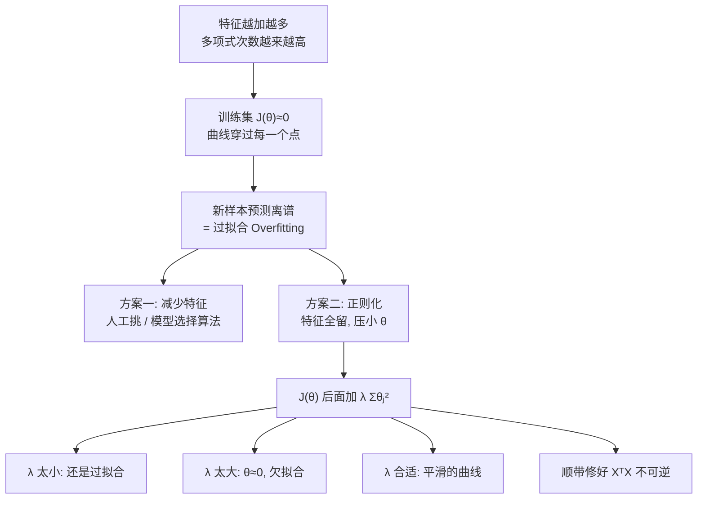

# C2.7 过拟合与正则化

> [!abstract] 这一讲的任务
> [[C1.4 过拟合与剪枝]] 里我们第一次见到过拟合：决策树可以长到把每个训练样本都记住，训练集 100% 正确，新数据上惨不忍睹。当时的对策是**剪枝**——把树砍小。
>
> 现在同样的病出现在线性模型上：[[C2.4 多项式回归与正规方程]] 教你造 $x^2,x^3,x^4$ 这些特征，特征越多拟合越漂亮，**漂亮到假**。
>
> 这一讲的答案不是“砍掉特征”，而是一个更细腻的思路：**特征全留着，但不许参数长太大。** 这个技术叫**正则化 Regularization**，一行公式就能加上去，是整个机器学习里性价比最高的技巧之一——从线性回归一路用到今天的大模型。

> [!info] 怎么读这份讲义
> 第 1–2 节说清楚**病是什么**，第 3 节是**药的直觉**（这一节最关键，$\lambda$ 为什么这么写全在这里），第 4–5 节把药分别配到线性回归和逻辑回归上，第 6 节收口。
> 标有 **（拓展）** 的内容是由课件和教材延伸补充的部分，第一遍可跳过。
> 课件有一处符号笔误（5.3），到了地方会说明。



---

## 1. 开场：三个人画同一组点

期末小组作业，你们拿到五个房子的数据（面积、价格），要画一条曲线去拟合。

- **同学 A** 画了一条直线。他说“房价大致随面积涨”。但那五个点明显是往上弯的，直线从中间穿过去，**每个点都差一截**。
- **同学 B** 加了一个 $x^2$ 项。曲线跟着弯上去了，五个点都挨得很近。
- **同学 C** 一路加到 $x^4$。他的曲线**从五个点正中间一个不落地穿了过去**，误差是零。

你们要交哪一份？

> [!question] 停一下，先自己想想
> 同学 C 的误差是零，从“最小化代价函数”的角度看，他是**最优解**——我们前面几讲教的所有方法，目标就是把 $J(\theta)$ 降到最小，他做到了极致。
>
> 那为什么你会本能地觉得他的答案有问题？

因为你知道：**这条曲线是用来预测新房子的。** 同学 C 的曲线在五个点之间大幅上下扭动，某个区间甚至是往下掉的——来一个面积在两点之间的新房子，他给出的价格会荒唐得离谱。

**你刚才判断出来的，就是过拟合。**

---

## 2. 病：过拟合到底是什么

### 2.1 线性回归的三张图

把三位同学的答卷并排画出来。三张图的横纵轴完全相同（横轴 Size、纵轴 Price），点也是同一组五个点，唯一变的是拟合曲线。三个模型依次是

$$\theta_0+\theta_1x\qquad\qquad \theta_0+\theta_1x+\theta_2x^2\qquad\qquad \theta_0+\theta_1x+\theta_2x^2+\theta_3x^3+\theta_4x^4$$

![[C2-过拟合-线性回归三种拟合.png]]

- **左**：直线离每个点都有距离。模型**太笨**，连训练数据的规律都没抓住。这叫**欠拟合 Underfit**，也叫**高偏差 High bias**。
- **中**：二次曲线贴合趋势，但不强求穿过每个点。这是**刚刚好 Just right**。
- **右**：四次曲线**每个点都穿过**，$J(\theta)\approx0$，代价是曲线在点与点之间剧烈起伏，而且在最右端急转直下——拿它往数据范围外预测会错得离谱（外推风险，[[C2.4 多项式回归与正规方程]] 提过）。这叫**过拟合 Overfit**，也叫**高方差 High variance**。

![[C2.7-板书-欠拟合与过拟合术语.png]]

过拟合的正式说法是：**如果特征太多，学出来的假设可能把训练集拟合得非常好**（$J(\theta)=\frac{1}{2m}\sum_{i=1}^m(h_\theta(x^{(i)})-y^{(i)})^2\approx 0$），**却无法推广到新样本 fail to generalize to new examples。**

> [!important] 三个术语，考试必须分清
> | 情况 | 训练集表现 | 新样本表现 | 术语 |
> |---|---|---|---|
> | 左 | 差 | 差 | **欠拟合 Underfitting**，也叫**高偏差 High bias** |
> | 中 | 好 | 好 | 刚刚好 “just right” |
> | 右 | 极好（$J\approx 0$） | 差 | **过拟合 Overfitting**，也叫**高方差 High variance** |
>
> 记法：“bias 偏差”是**模型本身偏了**（太简单，系统性地偏离真实规律）；“variance 方差”是**模型太敏感**（训练数据抖一下，学出来的曲线就大变样）。

> [!warning] 最常见的误解：过拟合 ≠ 训练误差大
> 恰恰相反，**过拟合时训练误差特别小**（$J(\theta)\approx0$）。这正是它危险的地方：**你在训练集上根本看不出来。**
>
> 所以必须留出模型没见过的数据来评估——这就是 [[C1.4 过拟合与剪枝]] 里验证集的作用。
> 另一个易错点：**验证集 validation set 用来选模型（挑 $\lambda$、挑次数）；测试集 test set 只在最后用一次报成绩。** 用测试集选模型，测试集就被“看过”了，报出来的成绩会偏乐观。

### 2.2 逻辑回归也一样

同样的事在分类上再演一遍（$g$ 是 sigmoid）。三个假设依次是

$$g(\theta_0+\theta_1x_1+\theta_2x_2)$$
$$g(\theta_0+\theta_1x_1+\theta_2x_2+\theta_3x_1^2+\theta_4x_2^2+\theta_5x_1x_2)$$
$$g(\theta_0+\theta_1x_1+\theta_2x_1^2+\theta_3x_1^2x_2+\theta_4x_1^2x_2^2+\theta_5x_1^2x_2^3+\theta_6x_1^3x_2+\ldots)$$

对应到 [[C2.5 逻辑回归]] 学过的**决策边界**：加的多项式项越多，$\theta^Tx=0$ 这条边界就能扭得越厉害。

![[C2-过拟合-逻辑回归三种决策边界.png]]

- **左**：一条直线，切不开这种一类在内、一类在外的分布 → **欠拟合**。
- **中**：加了二次项，边界是一条光滑的闭合曲线，形状对了。
- **右**：高次项太多，边界扭成奇形怪状。数据里有两个 ✕ 混在圆圈堆里，这条边界**特意绕出两个细长的小环，把它们单独圈了进去**——每个训练样本都分对了，但显然没人会相信新数据也长这样 → **过拟合**。

![[C2.7-板书-逻辑回归过拟合.png]]

**为了迁就个别样本而扭曲整体形状——这就是过拟合的几何本质。**

> [!important] 停一下，我们刚才干了什么
> 我们确认了：**过拟合不是回归特有的，也不是分类特有的，是“模型太灵活 + 数据太少”这个组合的通病。**
> 灵活性来自参数个数。所以直觉上，**治病要从“限制灵活性”下手**。

---

## 3. 药：从“砍特征”到“压参数”

### 3.1 先看看砍特征这条路

真实的房价问题可不止一个特征：

$x_1=$ 面积 size of house，$x_2=$ 卧室数，$x_3=$ 层数，$x_4=$ 房龄，$x_5=$ 小区平均收入，$x_6=$ 厨房面积，……，一直到 $x_{100}$。

一百个特征，样本却没多少。**特征一多，拟合曲线就会变成右上那种剧烈起伏、末端还掉头向下的样子。**

![[C2.7-板书-特征太多.png]]

那把特征删掉几个不就行了？

> [!question] 追问：100 个特征，你敢删哪一个？
> 你可能觉得“厨房面积”不重要，删掉。但万一在这个城市，厨房大小恰恰是豪宅的标志呢？
>
> **删掉一个特征，就是永久扔掉它携带的全部信息。** 而且你事先并不知道哪些该删。

对付过拟合，摆在面前的有两条路：

> [!important] Addressing overfitting — Options
> 1. **Reduce number of features 减少特征数量**
>    - **人工挑选**保留哪些特征；
>    - 用**模型选择算法 model selection algorithm**（课程后面会讲）自动挑。
> 2. **Regularization 正则化**
>    - **保留全部特征，但压小参数 $\theta_j$ 的量级。**
>    - 当特征很多、每个都对预测 $y$ 贡献一点点时，效果很好。

![[C2.7-板书-两条对策.png]]

真正要记住的是三个具体动作：人工挑特征、模型选择算法、保留全部特征但压小 $\theta_j$。第二条路下面那句适用条件也值得体会——**特征很多、每个都有一点用**，恰恰是删特征最尴尬的情形，而这正是正则化最擅长的场景。

### 3.2 直觉：先只惩罚两个参数

先做一个极简的思想实验，把正则化“逼”出来。

![[C2-过拟合-线性回归三种拟合.png]]

对比二次模型 $\theta_0+\theta_1x+\theta_2x^2$（刚刚好）和四次模型 $\theta_0+\theta_1x+\theta_2x^2+\theta_3x^3+\theta_4x^4$（过拟合）。四次模型多出来的，就是 $\theta_3x^3$ 和 $\theta_4x^4$ 两项。

**假设我们惩罚 $\theta_3,\theta_4$，把它们压得非常小。** 怎么惩罚？在原来的代价函数后面加两项：

$$\min_\theta\ \frac{1}{2m}\sum_{i=1}^m(h_\theta(x^{(i)})-y^{(i)})^2\ +\ 1000\,\theta_3^2+1000\,\theta_4^2$$

（1000 只是“一个很大的数”的意思。）

> [!question] 停一下：加了这两项会发生什么？
> 优化器的目标是把整个式子**最小化**。现在式子里有 $1000\theta_3^2$ 这一项——只要 $\theta_3$ 稍微大一点点，它就会贡献一个巨大的数值。
>
> 于是优化器只有一条出路：**把 $\theta_3$ 和 $\theta_4$ 压到几乎为 0。**

$\theta_3\approx0,\ \theta_4\approx0$ 意味着什么？意味着 $\theta_3x^3+\theta_4x^4$ 这两项**几乎消失了**，只剩下 $\theta_0+\theta_1x+\theta_2x^2$——四次模型悄悄退化回了二次模型。原来那条剧烈起伏的四次曲线，变成了一条平滑的、接近二次的曲线。

![[C2.7-板书-惩罚theta3与theta4.png]]

> [!important] 关键领悟
> 我们**没有删掉** $x^3,x^4$ 这两个特征，它们还在模型里。我们只是让优化器**自己决定**不去用它们。
>
> 这就是 “Keep all the features, but reduce magnitude of parameters” 的全部含义。**删特征是硬开关（0 或 1），压参数是软旋钮（可以是 0.001，也可以是 0.5）。**

> [!note] 为什么惩罚项写成平方 $\theta_j^2$
> 为什么不是 $|\theta_j|$，不是 $\theta_j$？
> - 不能用 $\theta_j$ 本身：$\theta_j$ 可正可负，取负数时“惩罚”反而变成奖励，优化器会把它推向 $-\infty$。**必须是一个恒非负、且离 0 越远越大的量。**
> - 平方满足这个要求，而且**处处可导**，求导后是干净的 $2\theta_j$，梯度下降能直接用。
> - $|\theta_j|$ 也满足非负要求，它对应 **L1 正则化 / LASSO**，性质不同（会把参数压到**恰好等于 0**，带来稀疏性，相当于自动做特征选择），但在 0 点不可导，处理起来麻烦。本讲用的平方形式叫 **L2 正则化**，在线性回归里也叫**岭回归 Ridge Regression**。
> - 这和 [[C2.1 单变量线性回归与代价函数]] 里“代价函数为什么用平方”是**同一个理由的两次出现**：需要一个非负的、可导的、随偏离增长的度量。

### 3.3 推广：惩罚所有参数

真实问题里有 100 个特征、101 个参数 $\theta_0,\theta_1,\ldots,\theta_{100}$，你事先不知道该压哪几个。刚才我们知道罪魁是 $\theta_3,\theta_4$，现在不知道——**那就全压。**

思路是：**参数取值小 ⟹ 假设更“简单” ⟹ 更不容易过拟合。** 于是代价函数变成

> [!important] 正则化的代价函数
> $$J(\theta)=\frac{1}{2m}\Big[\sum_{i=1}^m\big(h_\theta(x^{(i)})-y^{(i)}\big)^2+\lambda\sum_{j=1}^n\theta_j^2\Big]$$
> $$\min_\theta J(\theta)$$

逐项拆解这个式子：

| 部分 | 名字 | 作用 |
|---|---|---|
| $\sum_{i=1}^m(h_\theta(x^{(i)})-y^{(i)})^2$ | 数据拟合项 / 经验风险 | 逼模型贴合训练数据 |
| $\lambda\sum_{j=1}^n\theta_j^2$ | **正则化项 regularization term** | 逼参数变小 |
| $\lambda$ | **正则化参数 regularization parameter** | 决定上面两个目标谁更重要 |
| $\frac{1}{2m}$ | 归一化常数 | 和 [[C2.1 单变量线性回归与代价函数]] 里一样：$m$ 让代价与样本数无关，$2$ 是为求导时约掉 |

![[C2.7-板书-正则化代价函数由来.png]]

这里有一个极容易被抄漏的细节：正则化项的求和下标从 $j=1$ 开始，被惩罚的是 $\theta_1,\theta_2,\theta_3,\ldots,\theta_{100}$，**$\theta_0$ 不在其中。**

> [!warning] 求和从 $j=1$ 开始，不是 $j=0$！——本讲第一考点
> 注意 $\sum_{j=1}^{n}\theta_j^2$ 的下标：**$\theta_0$ 被排除在外，不参与惩罚。**
>
> **为什么？** $\theta_0$ 是截距项（对应恒等于 1 的 $x_0$），它只负责把整条曲线**整体上下平移**，跟曲线“抖不抖”一点关系都没有。惩罚它没有任何抑制过拟合的作用，反而会强行把预测值往 0 拖——房价数据全在 200 万上下，你却逼截距接近 0，纯属添乱。
>
> 实践上把 $\theta_0$ 也罚进去，结果差别通常很小；但**公式必须写成 $j=1$ 到 $n$**，这是考点。这个“$\theta_0$ 特殊对待”的约定会在 4.1、4.2、5.2 里反复出现，请记住。
>
> 顺带一提：正则化项里**没有** $x$，只有 $\theta$。正则化是对**模型**的约束，与数据无关。

### 3.4 $\lambda$ 是一个天平

把代价函数分成左右两块看：

$$\underbrace{\sum(h_\theta(x^{(i)})-y^{(i)})^2}_{\text{要我贴合数据}}\quad\text{vs}\quad\underbrace{\lambda\sum\theta_j^2}_{\text{要我参数小}}$$

这两个目标是**互相冲突**的：想贴得更紧，参数就得更大更灵活；想参数小，就贴不了那么紧。两块都想把 $J$ 往上推，优化器在它们之间找平衡。$\lambda$——**正则化参数 regularization parameter**——就是决定**这场拔河谁赢**的那个权重。$\lambda$ 选得合适，结果就是那条既贴合趋势、又不乱抖的平滑曲线。

![[C2.7-板书-正则化参数lambda.png]]

既然 $\lambda$ 是个旋钮，就该问问：**把它拧到底会怎样？** 比如在四次模型 $\theta_0+\theta_1x+\theta_2x^2+\theta_3x^3+\theta_4x^4$ 上，令 $\lambda=10^{10}$。

> [!question] 停一下，先自己想想再往下看
> $\lambda=10^{10}$，正则化项的权重压倒性地大。优化器会怎么做？

它会不惜一切代价把 $\theta_1,\theta_2,\theta_3,\theta_4$ **全部压到约等于 0**——因为哪怕它们只有 0.01，乘上 $10^{10}$ 也是天文数字，而数据拟合项那点损失完全不值一提：

$$\theta_1\approx0,\quad \theta_2\approx0,\quad \theta_3\approx0,\quad \theta_4\approx0\ \Longrightarrow\ \boxed{h_\theta(x)\approx\theta_0}$$

**一条水平直线。** 注意 $\theta_0$ 没被惩罚，所以它还能自由取值，最终会停在所有 $y^{(i)}$ 的平均值上。数据明明在往上走，这条线却平平地横穿过去——**欠拟合**。

![[C2-正则化-lambda过大退化为常数.png]]

![[C2.7-板书-lambda过大欠拟合.png]]

> [!important] 结论：$\lambda$ 太大 → 欠拟合
> 我们本来是来治过拟合的，**结果把病治到了另一个极端**。
>
> | $\lambda$ | 结果 |
> |---|---|
> | $\lambda=0$ | 没有正则化，回到原来的模型，可能**过拟合** |
> | $\lambda$ 太小 | 约束太弱，仍然过拟合 |
> | $\lambda$ 合适 | 平滑且贴合，泛化好 |
> | $\lambda$ 太大 | 参数全被压死，$h\approx\theta_0$，**欠拟合 / 高偏差** |
>
> 这是一条 U 形关系：$\lambda$ 从 0 增大，测试误差先降后升。**怎么找那个最低点？用验证集试一串 $\lambda$（比如 $0,0.01,0.02,0.04,\ldots,10$），谁在验证集上最好选谁。** 这属于后面“模型选择”的内容。（拓展）

---

## 4. 药怎么配（一）：正则化的线性回归

$$J(\theta)=\frac{1}{2m}\Big[\sum_{i=1}^m(h_\theta(x^{(i)})-y^{(i)})^2+\lambda\sum_{j=1}^n\theta_j^2\Big],\qquad \min_\theta J(\theta)$$

代价函数变了，训练它的两条路——梯度下降和正规方程——就都要跟着改。

### 4.1 梯度下降怎么改

先想一想：更新式里用的是 $\frac{\partial J}{\partial\theta_j}$，而 $J$ 多了一项，那偏导也就多一项。多的是什么？求一次导就知道。

> [!example] 为什么会多出 $\frac{\lambda}{m}\theta_j$ ——完整求导
> 对 $j\ge 1$：
> $$\frac{\partial}{\partial\theta_j}J(\theta)=\frac{\partial}{\partial\theta_j}\Big\{\frac{1}{2m}\sum_i(h_\theta(x^{(i)})-y^{(i)})^2\Big\}+\frac{\partial}{\partial\theta_j}\Big\{\frac{\lambda}{2m}\sum_{k=1}^n\theta_k^2\Big\}$$
> 第一块 [[C2.2 梯度下降]] 已经推过，等于 $\frac{1}{m}\sum_i(h_\theta(x^{(i)})-y^{(i)})x_j^{(i)}$。
> 第二块：$\sum_{k=1}^n\theta_k^2$ 对 $\theta_j$ 求偏导时，**只有 $k=j$ 那一项含 $\theta_j$**，其余都是常数，导数为 0。所以
> $$\frac{\partial}{\partial\theta_j}\Big\{\frac{\lambda}{2m}\theta_j^2\Big\}=\frac{\lambda}{2m}\cdot 2\theta_j=\frac{\lambda}{m}\theta_j$$
> **$\frac{1}{2m}$ 里那个 2 在这里被平方的导数约掉了**——这就是它当初被放进去的原因（[[C2.1 单变量线性回归与代价函数]] 埋的伏笔，这里第二次回收）。
> 对 $j=0$：正则项求和从 $k=1$ 开始，不含 $\theta_0$，第二块为 0，所以 $\theta_0$ 的更新式和没有正则化时**一模一样**。

于是梯度下降写成两行——$\theta_0$ 单独一行，其余参数一行：

> [!important] 正则化线性回归的梯度下降
> Repeat {
> $$\theta_0:=\theta_0-\alpha\frac{1}{m}\sum_{i=1}^m\big(h_\theta(x^{(i)})-y^{(i)}\big)x_0^{(i)}$$
> $$\theta_j:=\theta_j-\alpha\Big[\frac{1}{m}\sum_{i=1}^m\big(h_\theta(x^{(i)})-y^{(i)}\big)x_j^{(i)}+\frac{\lambda}{m}\theta_j\Big]\qquad(j=\cancel{0},1,2,3,\ldots,n)$$
> }

$\theta_0$ 那行里的 $x_0^{(i)}\equiv1$，所以它其实就是残差之和；第二行的 $j$ 从 1 起，0 被划掉——**又是 3.3 那条规矩：$\theta_0$ 不加正则项。**

> [!note] 关于课件
> 课件 PDF 上第二行方括号里只印出了求和项，$+\frac{\lambda}{m}\theta_j$ 这一项没有印出来。上面按求导结果补全了——不补这一项，下面那行“整理后”的式子也推不出来。

![[C2.7-板书-正则化梯度下降.png]]

现在把第二行整理一下，把含 $\theta_j$ 的两项合并：

$$\theta_j-\alpha\Big[\frac{1}{m}\sum_i(\cdot)x_j^{(i)}+\frac{\lambda}{m}\theta_j\Big]
=\theta_j-\alpha\frac{\lambda}{m}\theta_j-\alpha\frac{1}{m}\sum_i(\cdot)x_j^{(i)}$$

$$\boxed{\;\theta_j:=\theta_j\Big(1-\alpha\frac{\lambda}{m}\Big)-\alpha\frac{1}{m}\sum_{i=1}^m\big(h_\theta(x^{(i)})-y^{(i)}\big)x_j^{(i)}\;}$$

$1-\alpha\frac{\lambda}{m}$ 是多少？$\alpha$ 很小、$m$ 很大，所以它**略小于 1**。代入数字：$\alpha=0.01$、$\lambda=1$、$m=100$，

$$1-\alpha\frac{\lambda}{m}=1-0.01\times\frac{1}{100}=0.9999$$

数值取得粗一点，说它是 0.99 也行。于是更新式读起来是这样：

$$\theta_j:=\underbrace{\theta_j\times 0.99}_{\text{先缩水一点点}}\ \underbrace{-\ \alpha\frac{1}{m}\sum(\cdot)x_j^{(i)}}_{\text{再照常走一步梯度}}$$

![[C2.7-板书-权重衰减0.99.png]]

> [!important] 这个写法揭示了正则化的真实动作
> **每一轮迭代，先把 $\theta_j$ 乘上一个略小于 1 的数，让它自己缩水一点点，然后再做原来的梯度下降。**
>
> 这就是深度学习里 **weight decay（权重衰减）** 这个名字的由来——你在 PyTorch 里写 `optim.SGD(..., weight_decay=1e-4)`，做的就是这件事。**你现在已经知道那个参数是什么了。**
>
> 顺便：$1-\alpha\frac{\lambda}{m}$ 必须**大于 0**，否则参数每轮变号，会震荡发散。正常取值下它非常接近 1。（拓展）

### 4.2 正规方程怎么改

还是那套记号：

$$X=\begin{bmatrix}(x^{(1)})^T\\\vdots\\(x^{(m)})^T\end{bmatrix}\in\mathbb{R}^{m\times(n+1)},\qquad y=\begin{bmatrix}y^{(1)}\\\vdots\\y^{(m)}\end{bmatrix}\in\mathbb{R}^{m}$$

正规方程的来路是“**令每个偏导为零**” $\frac{\partial}{\partial\theta_j}J(\theta)\overset{\text{set}}{=}0$（[[C2.4 多项式回归与正规方程]] 推过），无正则化时解出来是 $\theta=(X^TX)^{-1}X^Ty$。加了正则项后还是这么做，只是每个偏导多出 $\frac{\lambda}{m}\theta_j$（$j\ge1$），解出来多一个矩阵：

> [!important] 正则化的正规方程
> $$\theta=\Big(X^TX+\lambda\underbrace{\begin{bmatrix}0&&&&\\&1&&&\\&&1&&\\&&&\ddots&\\&&&&1\end{bmatrix}}_{(n+1)\times(n+1)}\Big)^{-1}X^Ty$$

> [!important] 那个矩阵要看仔细
> 它是一个 $(n+1)\times(n+1)$ 的对角阵，对角线上是 $0,1,1,\ldots,1$——**左上角第一个元素是 0，其余全是 1**。比如 $n=2$ 时：
> $$\begin{bmatrix}0&0&0\\0&1&0\\0&0&1\end{bmatrix}$$
>
> **为什么左上角是 0？** 因为它对应 $\theta_0$，而 $\theta_0$ 不参与正则化（3.3 的规矩，第三次出现）。**这是一个非常爱考的细节：不是单位矩阵 $I$。**

![[C2.7-板书-正则化正规方程矩阵.png]]

$\lambda>0$ 这个条件，还顺手解决了一个老问题。

> [!important] 白送的好处：顺手修好了不可逆
> [[C2.4 多项式回归与正规方程]] 里提过，当 $m\le n$（样本数不多于特征数）或特征之间线性相关时，$X^TX$ **不可逆 non-invertible / singular**，正规方程算不出来。
>
> 现在只要 $\lambda>0$，$X^TX+\lambda\cdot\text{diag}(0,1,\ldots,1)$ **就一定可逆**。我们本来是为了治过拟合加的这一项，结果**顺带解决了一个数值问题**。
>
> 直觉解释：$X^TX$ 是半正定的（特征值 $\ge 0$），不可逆意味着有特征值等于 0；给对角线加上 $\lambda>0$，相当于把所有特征值往上抬了 $\lambda$，于是全部严格大于 0，矩阵变成正定、必然可逆。（严格说因为左上角加的是 0，$\theta_0$ 那个方向没被抬，但实际中 $x_0$ 那一列全是 1、不会导致奇异。）（拓展）
>
> 课件把这部分标为 **optional/advanced（选学）**，但“正则化能解决 $X^TX$ 不可逆”是很常见的考点，建议记住结论。

那没有正则化的时候，遇到不可逆怎么办？这就要分清 Octave/MATLAB 里的两个函数：**矩阵不可逆（奇异）时用 `pinv`，可逆时用 `inv`。**

![[C2.7-板书-pinv与inv.png]]

> [!note] pinv 与 inv 的区别
> `inv(A)` 求**真正的逆**，矩阵奇异时会报错或给出垃圾结果；`pinv(A)` 求 **Moore–Penrose 伪逆**，**即使矩阵奇异也能给出一个合理的答案**（最小二乘意义下的解）。
> 所以在没有正则化时，大家用 `pinv` 来**绕过** $X^TX$ 不可逆；而加了 $\lambda>0$ 之后，矩阵**根本就不会奇异**，`inv` 和 `pinv` 都能用——**这是“绕过”和“根治”的区别。**
> Python 里对应的是 `numpy.linalg.inv` 与 `numpy.linalg.pinv`。

---

## 5. 药怎么配（二）：正则化的逻辑回归

### 5.1 代价函数

![[C2-过拟合-逻辑回归三种决策边界.png]]

回到 2.2 那个过拟合的逻辑回归：

$$h_\theta(x)=g(\theta_0+\theta_1x_1+\theta_2x_1^2+\theta_3x_1^2x_2+\theta_4x_1^2x_2^2+\theta_5x_1^2x_2^3+\ldots)$$

它的代价函数是 [[C2.5 逻辑回归]] 里的对数损失。加正则化的做法和线性回归一模一样——在后面加上惩罚项：

> [!important] 正则化逻辑回归的代价函数
> $$J(\theta)=-\Big[\frac{1}{m}\sum_{i=1}^m y^{(i)}\log h_\theta(x^{(i)})+(1-y^{(i)})\log\big(1-h_\theta(x^{(i)})\big)\Big]+\frac{\lambda}{2m}\sum_{j=1}^n\theta_j^2$$
> 被惩罚的是 $\theta_1,\theta_2,\ldots,\theta_n$，不含 $\theta_0$。

> [!important] 和线性回归的正则项完全一样
> $$+\frac{\lambda}{2m}\sum_{j=1}^n\theta_j^2$$
> 同样从 $j=1$ 开始，同样不罚 $\theta_0$，同样是 $\frac{\lambda}{2m}$。
> **换了模型、换了损失函数，正则项一个字都不用改。** 因为它约束的是参数，不是数据，也不是预测方式。

加了它之后，那个扭出两个小环的决策边界就会被“熨平”，回到接近中间那张图的光滑形状。

### 5.2 梯度下降

求导过程和 4.1 完全相同：正则项只给 $j\ge1$ 的偏导贡献 $\frac{\lambda}{m}\theta_j$。

> [!important] 正则化逻辑回归的梯度下降
> Repeat {
> $$\theta_0:=\theta_0-\alpha\frac{1}{m}\sum_{i=1}^m\big(h_\theta(x^{(i)})-y^{(i)}\big)x_0^{(i)}$$
> $$\theta_j:=\theta_j-\alpha\Big[\frac{1}{m}\sum_{i=1}^m\big(h_\theta(x^{(i)})-y^{(i)}\big)x_j^{(i)}+\frac{\lambda}{m}\theta_j\Big]\qquad(j=\cancel{0},1,2,3,\ldots,n)$$
> }

![[C2.7-板书-正则化逻辑回归梯度.png]]

$\theta_0$ 那一行和没有正则化时完全一样，**没有新东西**——它当然还要更新，只是不必再看；要看的只是下面那行。到这里，“$\theta_0$ 不罚”已经是第四次出现了：3.3 求和从 $j=1$ 起、4.1 单列一行、4.2 矩阵左上角那个 0、这里被惩罚的范围只到 $\theta_1,\ldots,\theta_n$。

> [!warning] 和线性回归“长得一模一样”，但不是同一个东西
> 把 4.1 和 5.2 这两组更新式并排放，**逐字相同**。这是 [[C2.5 逻辑回归]] 里就强调过的现象，加了正则化之后依然成立。
>
> 但它们**不是同一个算法**，区别藏在 $h_\theta$ 里：
> - 线性回归：$h_\theta(x)=\theta^Tx$
> - 逻辑回归：$h_\theta(x)=\dfrac{1}{1+e^{-\theta^Tx}}$
>
> **“形式相同”是巧合吗？不是。** 两者都属于广义线性模型，用各自的自然损失（平方误差 / 对数损失）时，梯度都会化简成“(预测−真实)×特征”的形式。这是一个很深的结论，后面讲到指数族分布时会再见到。（拓展）

### 5.3 用高级优化算法

最后把 [[C2.6 高级优化算法与多分类]] 的接口和正则化拼在一起。`costFunction` 要交出两样东西，现在都带上正则项：

```matlab
function [jVal, gradient] = costFunction(theta)
    jVal = [ code to compute J(θ) ];
    gradient(1) = [ code to compute ∂J/∂θ₀ ];
    gradient(2) = [ code to compute ∂J/∂θ₁ ];
    ...
    gradient(n+1) = [ code to compute ∂J/∂θₙ ];
```

每一块填什么：

$$\texttt{jVal}:\quad J(\theta)=\Big[-\frac{1}{m}\sum_{i=1}^m y^{(i)}\log h_\theta(x^{(i)})+(1-y^{(i)})\log\big(1-h_\theta(x^{(i)})\big)\Big]+\frac{\lambda}{2m}\sum_{j=1}^n\theta_j^2$$

$$\texttt{gradient(1)}:\quad \frac{1}{m}\sum_{i=1}^m\big(h_\theta(x^{(i)})-y^{(i)}\big)x_0^{(i)}\qquad\text{（没有正则项）}$$

$$\texttt{gradient(2)}:\quad \frac{1}{m}\sum_{i=1}^m\big(h_\theta(x^{(i)})-y^{(i)}\big)x_1^{(i)}+\frac{\lambda}{m}\theta_1$$

后面 `gradient(3)` 到 `gradient(n+1)` 同理。**从第二个梯度开始才多 $\frac{\lambda}{m}\theta_j$ 这一项，第一个（对应 $\theta_0$）没有。** 另外别忘了这里的 $h$ 是 sigmoid：$h_\theta(x)=\frac{1}{1+e^{-\theta^Tx}}$，不是 $\theta^Tx$。

![[C2.7-板书-正则化高级优化.png]]

> [!warning] 课件笔误：正则项前面是加号，不是减号
> 课件这一页把后面几个梯度印成了 $\cdots-\frac{\lambda}{m}\theta_1$（**减号**），课堂上也照着写了减号。**正确的是加号 $+\frac{\lambda}{m}\theta_1$**，三条独立证据：
> 1. **求导**：$\frac{\partial}{\partial\theta_1}\big(\frac{\lambda}{2m}\theta_1^2\big)=+\frac{\lambda}{m}\theta_1$，正则项是**加**在 $J$ 上的，求导后自然还是加。
> 2. **与课件自己的另一页矛盾**：5.2 的梯度下降页写的是 $\theta_j:=\theta_j-\alpha[\cdots+\frac{\lambda}{m}\theta_j]$，方括号里是加号。
> 3. **效果检验**：如果梯度里是减号，更新式变成 $\theta_j:=\theta_j-\alpha[\cdots-\frac{\lambda}{m}\theta_j]=\theta_j(1+\alpha\frac{\lambda}{m})-\cdots$，参数每轮被**放大**——正则化就变成了“鼓励参数变大”，与目的完全相反。
>
> **考试按加号写。** 同时注意 `gradient(1)`（即 $\partial J/\partial\theta_0$）**没有**正则项，这一点课件是对的。

最后再提醒一次 [[C2.6 高级优化算法与多分类]] 那个下标坑：调用 `fminunc(@costFunction, ...)` 时，

$$\theta_0\leftrightarrow\texttt{theta(1)},\quad \theta_1\leftrightarrow\texttt{theta(2)},\quad \ldots,\quad \theta_n\leftrightarrow\texttt{theta(n+1)}$$

所以“不罚 $\theta_0$”落到代码里，就是**不罚 `theta(1)`**。同一个坑在两讲里各强调一次，可见它有多容易错。

![[C2.7-板书-fminunc与theta下标.png]]

> [!note] 接到你的专业方向上（拓展）
> - PyTorch：`torch.optim.SGD(params, lr=0.01, weight_decay=1e-4)`，`weight_decay` 就是这里的 $\lambda$（更准确说是 $\lambda/m$ 量级的东西，实现细节各库不同）。实践中通常**不对 bias 和 BatchNorm 参数施加 weight decay**——正是这里“不罚 $\theta_0$”的同一个道理。
> - 深度学习里另一个极常用的正则化手段是 **Dropout**，思路不同（训练时随机丢弃神经元）但目的一样：限制模型的有效灵活性。
> - **提前停止 early stopping**（验证误差开始上升就停）也是一种正则化，和 [[C1.4 过拟合与剪枝]] 的预剪枝是同一种智慧。

---

## 6. 停一下，我们刚才干了什么

我们完整走了一遍“发现病 → 想药 → 配药”的流程：

1. 特征多 + 数据少 → 曲线为了穿过每个点而剧烈扭动 → 过拟合（训练误差极小，泛化极差）。
2. 扭动是靠**大参数**实现的。所以不删特征，直接**罚大参数**。
3. $J$ 后面加 $\frac{\lambda}{2m}\sum_{j=1}^n\theta_j^2$，$\lambda$ 调节“贴合数据”和“参数要小”的平衡。
4. 梯度下降多一项 $\frac{\lambda}{m}\theta_j$，等价于每轮先给参数**缩水**；正规方程多一个 $\lambda\cdot\text{diag}(0,1,\ldots,1)$，顺手治好不可逆。
5. 线性回归、逻辑回归，正则项写法**完全相同**。

> [!important] 这一讲的三句话
> 1. **过拟合的特征是“训练集极好、新数据极差”**，成因是模型太灵活（参数太多、太大）；对策有两条：减少特征，或者**正则化——保留全部特征、压小参数**。
> 2. **正则化就是在 $J(\theta)$ 后面加 $\frac{\lambda}{2m}\sum_{j=1}^{n}\theta_j^2$**，求和**从 $j=1$ 开始，永远不罚 $\theta_0$**；$\lambda$ 太小治不住过拟合，$\lambda$ 太大会让 $h\approx\theta_0$ 变成欠拟合。
> 3. **梯度下降的更新式只多出 $\frac{\lambda}{m}\theta_j$**，等价写法 $\theta_j:=\theta_j(1-\alpha\frac{\lambda}{m})-\alpha\frac{1}{m}\sum(\cdot)x_j^{(i)}$ 就是“权重衰减”；**正规方程变成 $\theta=(X^TX+\lambda\,\text{diag}(0,1,\ldots,1))^{-1}X^Ty$**，$\lambda>0$ 时必定可逆。

### 速查表

| 名称 | 公式 |
|---|---|
| 正则化线性回归代价 | $J(\theta)=\frac{1}{2m}\big[\sum_{i=1}^m(h_\theta(x^{(i)})-y^{(i)})^2+\lambda\sum_{j=1}^n\theta_j^2\big]$ |
| 正则化逻辑回归代价 | $J(\theta)=-\frac{1}{m}\sum_i[y^{(i)}\log h_\theta(x^{(i)})+(1-y^{(i)})\log(1-h_\theta(x^{(i)}))]+\frac{\lambda}{2m}\sum_{j=1}^n\theta_j^2$ |
| 更新式（$j=0$） | $\theta_0:=\theta_0-\alpha\frac{1}{m}\sum_i(h_\theta(x^{(i)})-y^{(i)})x_0^{(i)}$（无正则项） |
| 更新式（$j\ge1$） | $\theta_j:=\theta_j-\alpha\big[\frac{1}{m}\sum_i(h_\theta(x^{(i)})-y^{(i)})x_j^{(i)}+\frac{\lambda}{m}\theta_j\big]$ |
| 权重衰减写法 | $\theta_j:=\theta_j(1-\alpha\frac{\lambda}{m})-\alpha\frac{1}{m}\sum_i(h_\theta(x^{(i)})-y^{(i)})x_j^{(i)}$ |
| 正则化正规方程 | $\theta=\big(X^TX+\lambda\,\mathrm{diag}(0,1,1,\ldots,1)\big)^{-1}X^Ty$ |
| $n=2$ 时那个对角阵 | $\mathrm{diag}(0,1,1)=\begin{bmatrix}0&0&0\\0&1&0\\0&0&1\end{bmatrix}$ |
| $\lambda$ 的两个极端 | $\lambda\to0$：过拟合；$\lambda\to\infty$：$h\approx\theta_0$，欠拟合 |
| 不可逆时 | 无正则化用 `pinv` 绕过；$\lambda>0$ 则必可逆，`inv` 即可 |
| 课件笔误 | 高级优化页梯度中 $-\frac{\lambda}{m}\theta_j$ 应为 $+\frac{\lambda}{m}\theta_j$ |

> [!abstract] 下一讲预告
> 第 2 章到此结束。我们有了一整套“参数化模型 + 代价函数 + 优化器 + 正则化”的手艺，能做回归、能做二分类、能做多分类、能防过拟合。
>
> 但有一个词我们一直在用，却从没认真定义过：**概率**。
> $h_\theta(x)=P(y=1\mid x;\theta)$ 里那个 $P$ 到底是什么？“给定 $x$”这个竖线又是什么意思？为什么可以说“这个肿瘤有 70% 的概率是恶性的”——一个肿瘤要么恶性要么良性，哪来的 70%？
>
> 第 3 章从零开始补这块地基。四条公理起步，一直推到贝叶斯定理和联合分布。**它不只是数学复习：后面的朴素贝叶斯、EM、图模型、几乎所有现代机器学习方法，都长在这块地基上。** 从 [[C3.1 随机变量、事件与概率公理]] 开始。

---

上一讲：[[C2.6 高级优化算法与多分类]]
下一讲：[[C3.1 随机变量、事件与概率公理]]
返回：[[机器学习课程 MOC]]
