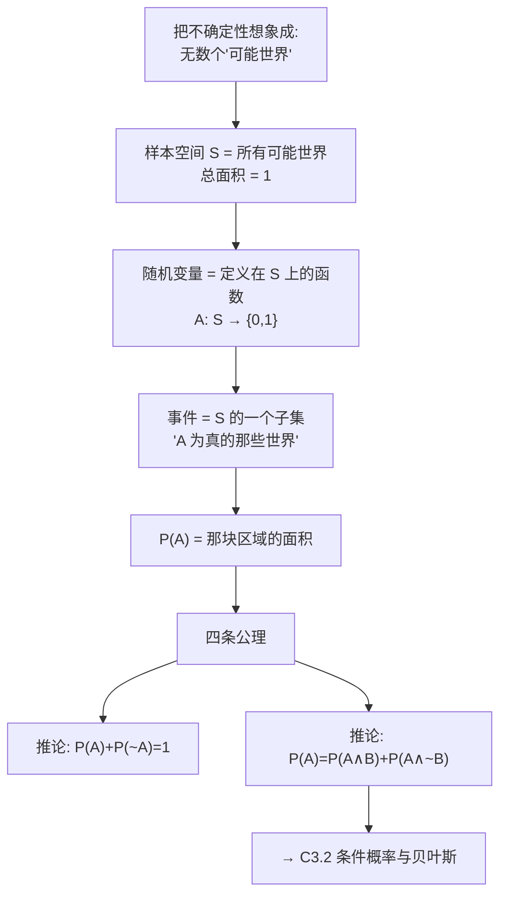

# C3.1 随机变量、事件与概率公理

> [!abstract] 这一讲的任务
> 第 2 章我们一直在用"概率"这个词，却从没定义过它。[[C2.5 逻辑回归]] 里我们写 $h_\theta(x)=P(y=1\mid x;\theta)$，说"这个肿瘤有 70% 的概率是恶性的"——可是一个具体的肿瘤，要么是恶性要么是良性，**哪来的 70%**？
>
> 第 3 章从零开始补这块地基。这一讲要做三件事：
> 1. 说清楚**"可能世界"**这个看待概率的视角，它能让后面所有公式变成画图就能看懂的东西；
> 2. 给出**随机变量、样本空间、事件**三个词的准确含义（三者关系很容易混）；
> 3. 拿到**四条公理**——课件明确说了："These four rules are all we have. Everything else in this lecture is derived from them."（这四条规则就是我们的全部，这一讲其余一切都由它们推出来。）
>
> **这一讲是纯地基，没有一个机器学习算法。但后面朴素贝叶斯、EM、图模型、几乎所有生成式模型都长在上面。**

> [!info] 怎么读这份讲义
> 核心是第 2 节那张**"可能世界"图**。这一讲后面每一条公式，你都应该能在那张图上指出来它对应哪块面积。如果哪一条指不出来，回到第 2 节重读。
> 标有 **（拓展）** 或 **【拓展】** 的内容，是**课堂上没有展开讲、由课件和教材延伸补充**的部分。复习时可先掌握未标注的主干内容，行有余力再看拓展部分。

> [!note] 授课进度说明
> 第 3 章的课件**暂无对应的课堂语音转写稿**，因此各篇只在明确属于教材/推导延伸处标了「拓展」，未做全面区分。拿到转写稿后会按同一规则重新标注。

> [!important] 课程信息（课件首页，知识点，保留）
> **Office: B1c-414　　Email: jinxu@scut.edu.cn**
> 课件页眉写的是 **"Lecture 4 – Probability"**，但它是随本次（Lecture 3）课件一并发放的，本 vault 按知识依赖顺序编为第 3 章。

---

## 0. 开场：今天教室里有多少女生

现在这间教室里坐着一百多号人。我问你一个问题：

**"随便抽一个人，是女生的概率是多少？"**

你会怎么算？大概是：数一数女生有几个，除以总人数。比如 40/120，答案是 1/3。

> [!question] 停一下，先自己想想
> 你刚才做的事情，拆开来看是三步：
> 1. 圈定了一个**范围**——这间教室里的所有人；
> 2. 在这个范围里划出**一部分**——所有女生；
> 3. 算这部分**占整体的比例**。
>
> 现在把这三步的名字告诉你：第 1 步圈的叫**样本空间**，第 2 步划出的叫**事件**，第 3 步算的叫**概率**。
>
> **你刚才做的，就是一次完整的概率计算。** 这一讲剩下的全部内容，都只是把这三步写得更精确一点。

---

## 1. 随机变量：一个我们不确定的量

> [!important] 课件原文：Random Variables
> Informally, $A$ is a **random variable** if
> - $A$ denotes something about which we are uncertain（$A$表示某件我们不确定的事）
> - perhaps the outcome of a randomized experiment（可能是某个随机实验的结果）
>
> **Examples:**
> - $A=$ True if a randomly drawn person from our class is female（从班上随机抽一个人，是女生则 $A$ 为真）
> - $A=$ The hometown of a randomly drawn person from our class（随机抽一个人的家乡）
> - $A=$ True if two randomly drawn persons from our class have the same birthday（随机抽两个人，生日相同则 $A$ 为真）

注意这三个例子**不是同一种类型**：

| 例子 | $A$ 的取值 | 类型 |
|---|---|---|
| 是否女生 | True / False（即 0/1） | **布尔随机变量 Boolean RV** |
| 家乡 | 广州、汕头、北京…… | **离散随机变量 discrete RV**（多个取值） |
| 两人生日是否相同 | True / False | 布尔，但它是**两个个体的复合事件** |

> [!note] 第三个例子为什么特意写出来（补充）
> 前两个例子都是"抽一个人，看他的某个属性"，第三个是"抽两个人，看他们的关系"。课件放它进来是提醒你：**随机变量描述的不一定是某个个体的属性，也可以是一个更复杂的判断。**
>
> 这个例子还有个著名的名字：**生日悖论**。一个班只要有 23 人，就有超过 50% 的概率存在生日相同的两个人；到 60 人时概率超过 99%。**这个反直觉的结论，正是本讲要建立的规则能算出来的。**（拓展）

### 1.1 概率的两种读法

> [!important] 课件原文
> Define $P(A)$ as
> - "the fraction of **possible worlds** in which $A$ is true"（$A$ 为真的**可能世界**所占的比例）
> - or "the fraction of times $A$ holds, in repeated runs of the random experiment"（重复做这个随机实验，$A$ 成立的次数比例）
>
> - the set of possible worlds is called the **sample space**, $S$（所有可能世界的集合叫**样本空间** $S$）
> - a random variable $A$ is a function defined over $S$: $A:S\to\{0,1\}$（随机变量 $A$ 是定义在 $S$ 上的函数）

课件给了**两种**读法，它们回答的是同一个数，但世界观不同：

| 读法 | 说法 | 视角 |
|---|---|---|
| 可能世界 | "在所有可能的世界里，$A$ 为真的占多少" | 静态的、一次性的、几何的 |
| 重复实验 | "反复做这个实验，$A$ 出现的频率" | 动态的、要做很多次的 |

> [!note] 为什么要两种（补充）
> 因为有些问题用"重复实验"读不通。
>
> 回到开头那个问题：**"这个肿瘤是恶性的概率是 70%"** ——你没法把这个肿瘤"重复检查一万次"，它就一个，要么恶性要么良性。
>
> 但用"可能世界"就说得通：**在所有与我们观测到的情况（大小、形状、患者年龄……）一致的可能世界里，有 70% 的世界里这个肿瘤是恶性的。** 这个 70% 描述的是**我们的不确定程度**，而不是肿瘤在抖。
>
> 这两种立场在统计学里有名字：**频率派 frequentist**（重复实验）与**贝叶斯派 Bayesian**（信念程度）。课件在贝叶斯定理那一页会直接用上"beliefs（信念）"这个词。机器学习里两种都用，**不必站队，但要知道你在用哪一种**。

### 1.2 三个词的精确关系

> [!important] 课件原文：A Little Formalism
> More formally, we have
> - a **sample space** $S$ (e.g., the set of students in our class)（样本空间，比如本班全体学生）
>   - aka the set of possible worlds
> - a **random variable** is a function defined over the sample space（随机变量是定义在样本空间上的函数）
>   - Gender: $S\to\{m,f\}$
>   - Height: $S\to\text{Reals}$
> - an **event** is a subset of $S$（事件是 $S$ 的一个子集）
>   - e.g., the subset of $S$ for which Gender $=f$
>   - e.g., the subset of $S$ for which (Gender $=m$) AND (eyeColor $=$ blue)
> - we're often interested in probabilities of specific events
> - and of specific events conditioned on other specific events

> [!warning] 这三个词最容易混，务必分清
> | 词 | 是什么**类型**的东西 | 例子 |
> |---|---|---|
> | 样本空间 $S$ | 一个**集合**（所有可能世界） | 本班全体学生 |
> | 随机变量 | 一个**函数** $S\to$ 取值集合 | Gender、Height |
> | 事件 | $S$ 的一个**子集** | {所有女生}、{所有蓝眼睛男生} |
>
> **随机变量本身不是事件。** Gender 是函数，不是子集。但"Gender $=f$"这个**判断**把 $S$ 切出一个子集，那才是事件。
>
> 记法：**随机变量是"问题"（你性别是什么？），事件是"符合某个答案的那群人"。** 概率只对事件有定义，$P(\text{Gender})$ 是没有意义的写法，$P(\text{Gender}=f)$ 才有。

> [!note] 离散 vs 连续（补充）
> 课件的两个例子刚好覆盖了两类：
> - `Gender: S → {m, f}` ——取值只有有限个，**离散随机变量**；
> - `Height: S → Reals` ——取值是实数，**连续随机变量**。
>
> 本讲之后的全部内容（求和、列真值表、算联合分布）都是**离散**的做法。连续情形要把求和 $\sum$ 换成积分 $\int$，把概率换成**概率密度 probability density**，而且**单点概率为 0**（随机抽一个人身高恰好 175.0000… cm 的概率是 0，只能问"身高在 174–176 之间"的概率）。课件开头的 overview 列出了 "continuous random variables"，但正文没有展开。（拓展）

### 1.3 课件的知识地图

> [!important] 课件原文：Probability Overview
> - **Events**：discrete random variables, continuous random variables, compound events（离散/连续随机变量、复合事件）
> - **Axioms of probability**：what defines a reasonable theory of uncertainty（什么样的不确定性理论才是合理的）
> - **Independent events**（独立事件）
> - **Conditional probabilities**（条件概率）
> - **Bayes rule and beliefs**（贝叶斯定理与信念）
> - **Joint probability distribution**（联合概率分布）
> - **Expectations**（期望）
> - **Independence, conditional independence**（独立性、条件独立性）
>
> 首页另有本讲提要：Random variables, events, axioms of probability；Conditional probability and Bayes rule；The joint distribution and inference with it；Expected values and covariance。**Recap: decision trees, information gain**（回顾：决策树、信息增益）。

> [!note] 对应到本 vault 的分篇
> 上面这张清单在本 vault 里拆成四篇：本篇（事件、公理）→ [[C3.2 条件概率、链式法则与贝叶斯定理]] → [[C3.3 联合分布与推断]] → [[C3.4 期望、方差、协方差与相关系数]]。
> 其中 "Independent events / conditional independence" 课件正文**没有展开讲**，只出现在这张目录上；本 vault 在 [[C3.3 联合分布与推断]] 里做了补充说明。

---

## 2. 核心图：把概率看成面积

这是整章最重要的一张图。后面所有公式都是它的变形。

> [!important] 课件原文：Visualizing $A$
> - **Sample space of all possible worlds**（所有可能世界的样本空间）——图中的大矩形
> - **Its area is 1**（它的面积是 1）
> - **Worlds in which $A$ is true**（$A$ 为真的那些世界）——矩形里的椭圆
> - **Worlds in which $A$ is False**（$A$ 为假的那些世界）——椭圆外、矩形内
> - $P(A)=$ **Area of reddish oval**（$P(A)$ 等于那个椭圆的面积）

![[C3-概率-维恩图三联.png]]

（上图左格即课件这张图的结构；中、右两格是后面 3.2 和 [[C3.2 条件概率、链式法则与贝叶斯定理]] 要用的，先放在一起对照。）

> [!important] 这张图为什么这么重要
> 它把**概率**这个抽象的东西，换成了**面积**这个你从小学就会算的东西。
>
> - 面积不可能是负的　→　$P(A)\ge 0$
> - 一部分的面积不可能超过整体　→　$P(A)\le 1$
> - 整个矩形的面积规定为 1　→　$P(\text{True})=1$
> - 空的区域面积为 0　→　$P(\text{False})=0$
> - 两块区域合起来的面积 = 各自面积之和 − 重叠部分　→　容斥
>
> **下一节那四条"公理"，其实你看着图就已经全部答出来了。**

---

## 3. 四条公理

### 3.1 公理本身

> [!important] 课件原文：The Axioms of Probability
> - $0\le P(A)\le 1$
> - $P(\text{True})=1$
> - $P(\text{False})=0$
> - $P(A\ \text{or}\ B)=P(A)+P(B)-P(A\ \text{and}\ B)$
>
> **These four rules are all we have. Everything else in this lecture is derived from them.**
> （这四条规则就是我们拥有的全部。这一讲其余一切都由它们推导而来。）

课件用蓝框把最后那句话框了起来——**这是这一讲的中心句**。

> [!question] 停一下：第四条为什么要减去 $P(A\text{ and }B)$？
> 看图：$A$ 和 $B$ 两个椭圆有重叠。如果直接写 $P(A\text{ or }B)=P(A)+P(B)$，那块重叠区域就被**数了两次**——一次在 $A$ 的面积里，一次在 $B$ 的面积里。
>
> 所以要减掉一次。这叫**容斥原理 inclusion–exclusion principle**。

> [!warning] 易错点：只有互斥时才能直接相加
> $P(A\text{ or }B)=P(A)+P(B)$ **只在 $A$ 与 $B$ 互斥（mutually exclusive，即 $P(A\wedge B)=0$，两个椭圆完全不重叠）时成立**。
>
> 反例：从班上抽一个人，$A=$"是女生"，$B=$"戴眼镜"。$P(A)=0.4$，$P(B)=0.6$，直接相加得 1.0——难道"是女生或戴眼镜"是必然事件？显然不是，因为有人**既是女生又戴眼镜**，被重复计了。

> [!note] 记号对照表（补充，课件全篇混用）
> 课件在不同页面用了不同写法，指的是同一件事：
> | 含义 | 课件的几种写法 | 集合语言 |
> |---|---|---|
> | $A$ 且 $B$ | $A\text{ and }B$，$A\wedge B$ | $A\cap B$ |
> | $A$ 或 $B$ | $A\text{ or }B$，$A\vee B$ | $A\cup B$ |
> | 非 $A$ | $\sim A$ | $\bar A$，$A^c$ |
>
> 本讲义统一用课件正文最常用的 $\wedge$ 与 $\sim$。考试写哪种都可以，**但同一份答卷里别换来换去**。

### 3.2 第一个推论：$P(A)+P(\sim A)=1$

> [!important] 课件原文：Elementary Probability in Pictures
> $$P(\sim A)+P(A)=1$$
> （配图：矩形里一个圆是 $A$，圆外是 $\sim A$）

从图上看是显然的：$A$ 和 $\sim A$ 合起来就是整个矩形，面积 1。

> [!example] 从公理推出来（补充）
> $A$ 与 $\sim A$ 互斥且穷尽：$A\wedge\sim A=\text{False}$，$A\vee\sim A=\text{True}$。用第四条公理：
> $$P(A\vee\sim A)=P(A)+P(\sim A)-P(A\wedge\sim A)$$
> 左边 $=P(\text{True})=1$（第二条公理），右边最后一项 $=P(\text{False})=0$（第三条公理），于是
> $$1=P(A)+P(\sim A)$$
>
> **这就是"由公理推出来"的示范：四条公理全用上了三条，没有引入任何新假设。**

> [!important] 这条推论比它看起来有用
> 很多时候"正着算"很难、"反着算"很容易。
> 例：从班上抽 5 个人，"**至少有两个人生日相同**"的概率不好直接算（要分两人相同、三人相同……），但它的反面"**所有人生日都不同**"只要一路乘就行。算出反面再用 $1-P(\sim A)$。**这是概率题里最常用的一招。**（拓展）

### 3.3 第二个推论：全概率的雏形

> [!important] 课件原文：A Useful Theorem
> 由 $0\le P(A)\le 1$，$P(\text{True})=1$，$P(\text{False})=0$，$P(A\text{ or }B)=P(A)+P(B)-P(A\text{ and }B)$
> $$\Longrightarrow\quad P(A)=P(A\wedge B)+P(A\wedge\sim B)$$

配图就是上面三联图的**中间那格**：$A$ 这个椭圆被 $B$ 的边界切成两块，一块在 $B$ 里面（$A\wedge B$），一块在 $B$ 外面（$A\wedge\sim B$）。

> [!important] 一句话读懂
> **要么 $B$ 发生，要么 $B$ 不发生，没有第三种可能。** 所以 "$A$ 发生"这件事，必然落进"$A$ 且 $B$"或"$A$ 且非 $B$"两种情形之一，而且这两种情形不重叠。
>
> **把一件事按另一个变量的所有可能取值拆开** ——这个动作在后面会反复出现，它的正式名字叫**全概率公式 law of total probability**，也叫**边缘化 marginalization**。[[C3.3 联合分布与推断]] 里从联合分布算单个变量的概率，用的就是它。

> [!example] 从公理推出来（补充）
> $A\wedge B$ 与 $A\wedge\sim B$ 互斥（不可能同时 $B$ 又 $\sim B$），并集是 $A$：
> $$P(A)=P\big((A\wedge B)\vee(A\wedge\sim B)\big)=P(A\wedge B)+P(A\wedge\sim B)-\underbrace{P(\text{False})}_{=0}$$

> [!example] 手算验证（补充）
> 班上 120 人，女生 40 人（$A$），戴眼镜 70 人（$B$），戴眼镜的女生 25 人。
> - $P(A\wedge B)=25/120$
> - $P(A\wedge\sim B)=(40-25)/120=15/120$
> - 相加 $=40/120=P(A)$　✓

> [!important] 停一下，我们刚才干了什么
> 我们从"概率 = 可能世界里的面积"这个图像出发，写下四条公理，然后**只用这四条**推出了两条推论。
>
> 这个套路会一直延续：[[C3.2 条件概率、链式法则与贝叶斯定理]] 里的链式法则和贝叶斯定理，同样是从这四条加一个定义推出来的。**概率论没有第五条规则。**

---

## 4. 这一讲的三句话

> [!important] 三句话
> 1. **把概率想成"所有可能世界"这张图上的面积**：样本空间 $S$ 是整个矩形（面积 1），事件是其中一块区域，$P(A)$ 就是那块区域的面积。
> 2. **分清三个词**：样本空间是**集合**，随机变量是定义在它上面的**函数**（$A:S\to\{0,1\}$），事件是 $S$ 的**子集**；概率只对事件有定义。
> 3. **只有四条公理**：$0\le P(A)\le1$、$P(\text{True})=1$、$P(\text{False})=0$、$P(A\vee B)=P(A)+P(B)-P(A\wedge B)$；由它们推出 $P(A)+P(\sim A)=1$ 和 $P(A)=P(A\wedge B)+P(A\wedge\sim B)$。

### 速查表

| 名称 | 内容 |
|---|---|
| 样本空间 | $S$，所有可能世界的集合，总概率（面积）为 1 |
| 随机变量 | 定义在 $S$ 上的函数，如 $A:S\to\{0,1\}$、Gender$:S\to\{m,f\}$、Height$:S\to\mathbb{R}$ |
| 事件 | $S$ 的子集，如 $\{s\in S:\text{Gender}(s)=f\}$ |
| 公理 1 | $0\le P(A)\le 1$ |
| 公理 2 | $P(\text{True})=1$ |
| 公理 3 | $P(\text{False})=0$ |
| 公理 4（容斥） | $P(A\vee B)=P(A)+P(B)-P(A\wedge B)$ |
| 推论 1 | $P(A)+P(\sim A)=1$ |
| 推论 2（边缘化） | $P(A)=P(A\wedge B)+P(A\wedge\sim B)$ |
| 互斥时 | $P(A\wedge B)=0\Rightarrow P(A\vee B)=P(A)+P(B)$ |

> [!abstract] 下一讲预告
> 现在我们能算"是女生的概率"。但真正有用的问题几乎都带条件：**"已知这个人戴眼镜，他是女生的概率是多少？"**
>
> 医生更关心的也是这种问题：**"病人咳嗽了，他得流感的概率是多少？"** ——而医学书上给出的数据方向恰好是反的：它告诉你"得了流感的人有 80% 会咳嗽"。
>
> **怎么把箭头掉个头？** 这就是 [[C3.2 条件概率、链式法则与贝叶斯定理]] 的全部内容，也是整个第 3 章最重要的一页。

---

上一讲：[[C2.7 过拟合与正则化]]　　下一讲：[[C3.2 条件概率、链式法则与贝叶斯定理]]
返回：[[机器学习课程 MOC]]
