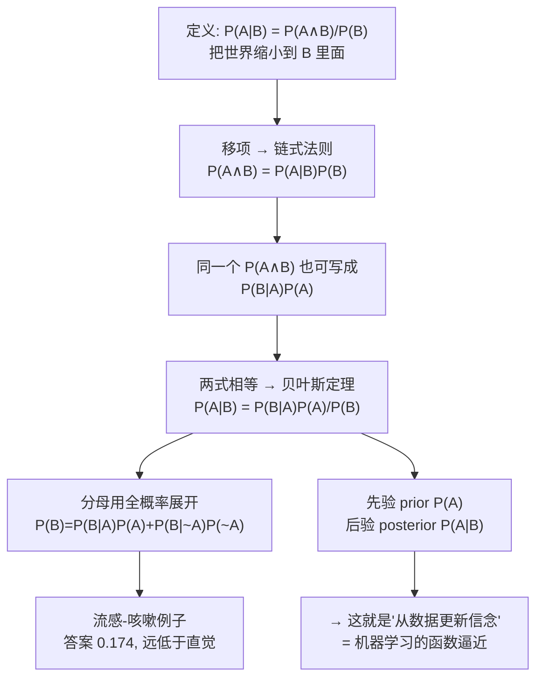

# C3.2 条件概率、链式法则与贝叶斯定理

> [!abstract] 这一讲的任务
> [[C3.1 随机变量、事件与概率公理]] 给了我们四条公理和一张"可能世界"图。但那里算的都是**无条件**的概率："随便抽一个人是女生的概率"。
>
> 现实里几乎没有这种问题。真正的问题总是带着已知信息：
> - 病人**已经咳嗽了**，他得流感的概率是多少？
> - 这封邮件**里面出现了"免费"两个字**，它是垃圾邮件的概率是多少？
> - 这个肿瘤**大小是 4.2 cm**，它是恶性的概率是多少？
>
> 而且有个讨厌的错位：**我们能查到的数据方向，往往和我们想问的方向是反的。** 医学统计告诉你"得流感的人 80% 会咳嗽"，可病人是拿着咳嗽来找你的。
>
> **贝叶斯定理就是那个把箭头掉头的工具。** 这一讲从条件概率的定义出发，三步推出它。

> [!info] 怎么读这份讲义
> 这一讲的推导极短（总共三行），**难的不是推导，是理解**。重点在第 2 节的"缩小世界"直觉和第 5 节那个反直觉的数值例子——很多人算得出公式却算不对直觉，考试和面试最爱考的就是这个落差。
> 标有 **（拓展）** 或 **【拓展】** 的内容，是**课堂上没有展开讲、由课件和教材延伸补充**的部分。复习时可先掌握未标注的主干内容，行有余力再看拓展部分。

> [!note] 授课进度说明
> 第 3 章课件**暂无对应语音转写稿**，「拓展」标注只标在明确属于教材/推导延伸处。

---

## 0. 开场：诊室里的一分钟

你是医生。病人坐下，咳嗽了一声。

你脑子里立刻要回答一个问题：**这人得流感的可能性有多大？**

你手边有三条数据：

- 这个季节，大约 **5% 的人**得了流感；
- 得流感的人里，**80%** 会咳嗽；
- 没得流感的人里，也有 **20%** 会咳嗽（感冒、过敏、呛到、抽烟……）。

> [!question] 停一下，先自己猜一个数
> **别算，凭感觉猜：这个咳嗽的病人，得流感的概率大概是多少？**
>
> 把你的猜测写下来。很多人会说"80% 左右吧，因为流感患者 80% 都咳嗽"。
>
> 记住你的答案，第 5 节我们回来对。**（剧透：正确答案不到 18%。）**

**你刚才被难住的地方，正是条件概率最容易出错的地方：把 $P(咳嗽\mid 流感)$ 和 $P(流感\mid 咳嗽)$ 搞反了。** 这一讲就是教你怎么把它们区分开、又怎么互相换算。

---

## 1. 条件概率的定义

> [!important] 课件原文：Definition of Conditional Probability
> $$P(A\mid B)=\frac{P(A\wedge B)}{P(B)}$$

![[C3-概率-维恩图三联.png]]

（看**右边那一格**：大矩形里有 $B$（粉色圆）和 $A$（绿色椭圆），两者有重叠。）

> [!important] 一句话读懂：缩小世界
> 平时算 $P(A)$，分母是**整个矩形**（面积 1）。
>
> 现在我告诉你"$B$ 已经发生了"。这句话的作用是：**所有 $B$ 之外的世界都被排除掉了，它们不再可能。** 于是你的"世界"从大矩形缩小成了 $B$ 这个圆。
>
> 在这个新世界里问"$A$ 发生的比例是多少"，就是：
> $$P(A\mid B)=\frac{\text{既在 }A\text{ 又在 }B\text{ 的面积}}{\text{新世界（}B\text{）的面积}}=\frac{P(A\wedge B)}{P(B)}$$
>
> **分母换了，就这么回事。** 条件概率不是一种新的概率，它只是"换了个分母的老概率"。

> [!warning] 三个必须记住的点
> 1. **$P(B)$ 必须大于 0。** 如果 $B$ 根本不可能发生，"已知 $B$ 发生了"就是一句废话，条件概率无定义。
> 2. **竖线前后不能交换。** $P(A\mid B)\ne P(B\mid A)$（除非 $P(A)=P(B)$）。这是本讲最大的考点，第 5 节会用数值狠狠说明。
> 3. **分子是 $\wedge$（且），是对称的**：$P(A\wedge B)=P(B\wedge A)$。不对称的是分母。

> [!example] 手算：用开场的数据算一个条件概率（补充）
> 想象 1000 个人：得流感的 50 人，其中咳嗽的 $50\times0.8=40$ 人。
> $$P(\text{咳嗽}\mid\text{流感})=\frac{P(\text{咳嗽}\wedge\text{流感})}{P(\text{流感})}=\frac{40/1000}{50/1000}=\frac{40}{50}=0.8\ \checkmark$$
> 分子分母的 1000 约掉了——**这说明条件概率只关心"$B$ 内部的比例"，跟总人数无关。**

---

## 2. 链式法则：把定义反过来用

> [!important] 课件原文：Corollary: The Chain Rule
> $$P(A\mid B)=\frac{P(A\wedge B)}{P(B)}\quad\Longrightarrow\quad \boxed{P(A\wedge B)=P(A\mid B)\,P(B)}$$
>
> Read it as: "the fraction of worlds where $A$ and $B$ are both true" = "the fraction of $B$-worlds in which $A$ is true" $\times$ "the fraction of worlds where $B$ is true".
> （读作："$A$ 和 $B$ 同时为真的世界所占比例" = "在 $B$ 世界里 $A$ 为真的比例" × "$B$ 为真的世界所占比例"。）

数学上这只是**把定义的分母乘过去**，一秒钟的事。但它的**用法**完全不同：

| 方向 | 用途 |
|---|---|
| $P(A\mid B)=\frac{P(A\wedge B)}{P(B)}$ | 已知联合概率，**求**条件概率 |
| $P(A\wedge B)=P(A\mid B)P(B)$ | 已知条件概率，**造**联合概率 |

> [!important] 课件那句话值得逐字读
> "the fraction of $B$-worlds in which $A$ is true" × "the fraction of worlds where $B$ is true"
>
> 这是一个**两步走**的画面：先从全世界里挑出 $B$ 世界（占比 $P(B)$），再从 $B$ 世界里挑出 $A$ 也成立的（占比 $P(A\mid B)$）。两步的比例相乘，就是最终占全世界的比例。
>
> **这个"分步相乘"的思想是链式法则的全部，也是它能推广到很多变量的原因。**

> [!note] 推广到多个变量（拓展）
> $$P(A\wedge B\wedge C)=P(A\mid B\wedge C)\,P(B\mid C)\,P(C)$$
> 一般地，$n$ 个变量：
> $$P(X_1,X_2,\ldots,X_n)=\prod_{i=1}^{n}P(X_i\mid X_1,\ldots,X_{i-1})$$
> **这条推广是贝叶斯网络 / 概率图模型的出发点**，课件目录里的 "graphical models" 就建在它上面。本讲不展开。

> [!note] 顺带一提：独立事件（课件目录里有、正文没展开，补充）
> 如果"知道 $B$ 发生了"这个信息**完全不改变**你对 $A$ 的判断，即
> $$P(A\mid B)=P(A)$$
> 就说 $A$ 与 $B$ **独立 independent**。代入链式法则立刻得到更常用的等价形式：
> $$P(A\wedge B)=P(A)P(B)$$
> 独立时，且的概率才能直接相乘。**注意独立（independent）和互斥（mutually exclusive）是完全不同的两件事**，而且几乎相反：
> - 互斥：$P(A\wedge B)=0$ —— 知道 $A$ 发生了，就确定 $B$ 没发生，这是**极强的依赖**；
> - 独立：$P(A\wedge B)=P(A)P(B)$ —— 互不影响。
>
> 两个概率都非零的互斥事件**一定不独立**。这是易错点。

---

## 3. 贝叶斯定理：让箭头掉头

### 3.1 推导只有两行

> [!important] 课件原文：Bayes Rule
> let's write 2 expressions for $P(A\wedge B)$
> $$P(A\wedge B)=P(A\mid B)\,P(B)\qquad\text{and}\qquad P(A\wedge B)=P(B\mid A)\,P(A)$$

整个推导的核心就是这一步：**$P(A\wedge B)$ 是对称的，所以可以用两种方式拆。**

- 第一种：先看 $B$，再在 $B$ 里看 $A$；
- 第二种：先看 $A$，再在 $A$ 里看 $B$。

两个都等于同一块重叠面积，所以两者相等：

$$P(A\mid B)P(B)=P(B\mid A)P(A)$$

两边除以 $P(B)$：

> [!important] 课件原文：Bayes' rule
> $$\boxed{P(A\mid B)=\frac{P(B\mid A)\,P(A)}{P(B)}}$$
> we call $P(A)$ the **"prior"** and $P(A\mid B)$ the **"posterior"**（我们称 $P(A)$ 为**先验**，$P(A\mid B)$ 为**后验**）
>
> **Bayes, Thomas (1763)** *An essay towards solving a problem in the doctrine of chances.* Philosophical Transactions of the Royal Society of London, **53:370–418**
>
> *"…by no means merely a curious speculation in the doctrine of chances, but necessary to be solved in order to a sure foundation for all our reasonings concerning past facts, and what is likely to be hereafter…. necessary to be considered by any that would give a clear account of the strength of analogical or inductive reasoning…"*
> （……这绝非机遇论中一个仅供玩味的思辨，而是我们一切关于既往事实、以及未来可能之推理要有稳固基础，就必须解决的问题……任何想要清楚说明类比推理或归纳推理之强度的人，都必须考虑它……）

> [!note] 那段引文为什么值得读（补充）
> 贝叶斯本人（1763 年，论文还是他去世后才发表的）已经看出：这条公式不只是赌局里的算术，**它是"归纳推理"——从观察到的证据反推原因——的数学基础**。
>
> 而"从数据反推规律"正是机器学习在做的事。**这就是为什么一门机器学习课要花一整讲讲概率。**

### 3.2 先验与后验：四个词的分工

> [!important] 贝叶斯定理的四个部分
> $$\underbrace{P(A\mid B)}_{\text{后验 posterior}}=\frac{\overbrace{P(B\mid A)}^{\text{似然 likelihood}}\cdot\overbrace{P(A)}^{\text{先验 prior}}}{\underbrace{P(B)}_{\text{证据 evidence}}}$$
>
> - **先验 $P(A)$**：**在看到证据之前**，你认为 $A$ 成立的可能性。（"这个季节 5% 的人得流感"）
> - **似然 $P(B\mid A)$**：**假如** $A$ 成立，你看到证据 $B$ 的可能性。（"流感患者 80% 咳嗽"）——注意这是**书上能查到的方向**。
> - **后验 $P(A\mid B)$**：**看到证据之后**，你对 $A$ 的新判断。（"这个咳嗽的人得流感的概率"）——这是**你真正想要的方向**。
> - **证据 $P(B)$**：证据本身出现的总概率，起归一化作用。
>
> 一句话：**贝叶斯定理是一台"信念更新机"——输入先验和新证据，输出更新后的信念。**
>
> 名词只有"先验/后验"是课件原文，"似然/证据"是标准术语补充。（拓展）

> [!warning] 本讲最大的考点：$P(A\mid B)$ 和 $P(B\mid A)$ 差得可以非常远
> 把这个错误叫作**基础比率谬误 base rate fallacy**：只盯着似然 $P(B\mid A)=0.8$，**忘了先验 $P(A)=0.05$ 很小**。
>
> 另一个经典例子：$P(\text{是男的}\mid\text{是中国男篮队员})\approx 1$，但 $P(\text{是中国男篮队员}\mid\text{是男的})\approx 0$。**同样两个事件，换个方向差了十个数量级。**（拓展）

---

## 4. 贝叶斯定理的其他形式

> [!important] 课件原文：Other Forms of Bayes Rule
> $$P(A\mid B)=\frac{P(B\mid A)\,P(A)}{P(B\mid A)\,P(A)+P(B\mid\sim A)\,P(\sim A)}$$
> $$P(A\mid B\wedge X)=\frac{P(B\mid A\wedge X)\,P(A\wedge X)}{P(B\wedge X)}$$

### 4.1 第一个形式：把分母拆开

分母 $P(B)$ 通常**查不到**——没人统计过"人群中咳嗽的比例"。但 $P(B\mid A)$ 和 $P(B\mid\sim A)$ 是能查到的。

> [!example] 分母是怎么拆出来的（补充，全程只用 [[C3.1 随机变量、事件与概率公理]] 的东西）
> 先用推论 2（全概率 / 边缘化）：
> $$P(B)=P(B\wedge A)+P(B\wedge\sim A)$$
> 再对两项分别用链式法则：
> $$P(B\wedge A)=P(B\mid A)P(A),\qquad P(B\wedge\sim A)=P(B\mid\sim A)P(\sim A)$$
> 合起来：
> $$P(B)=P(B\mid A)P(A)+P(B\mid\sim A)P(\sim A)$$
> 代回贝叶斯定理即得课件的第一个形式。**没有引入任何新东西——还是那四条公理。**

> [!important] 读法：分母是"所有能产生证据 B 的途径之和"
> 咳嗽这件事有两条来路：**因为流感而咳**（$P(B\mid A)P(A)$），和**不是流感却咳**（$P(B\mid\sim A)P(\sim A)$）。
> 分子只是其中一条。**后验 = 你关心的那条路 ÷ 所有路之和。**
>
> 这个读法比死记公式有用得多：有 $K$ 种原因时，分母就是 $K$ 项相加，$P(B)=\sum_{k}P(B\mid A_k)P(A_k)$。

### 4.2 第二个形式：所有东西都在 $X$ 的条件下

$$P(A\mid B\wedge X)=\frac{P(B\mid A\wedge X)\,P(A\wedge X)}{P(B\wedge X)}$$

> [!important] 一句话读懂：$X$ 是一个从头到尾不变的背景
> 假设 $X=$"病人是 70 岁老人"。这条信息在整个推理里始终成立，于是**每一项都要带上"在 $X$ 之下"**。
>
> 其实就是**把整个样本空间先缩小到 $X$ 里面**，然后在这个小世界里照常用一遍贝叶斯定理。
>
> 把 $P(A\wedge X)=P(A\mid X)P(X)$、$P(B\wedge X)=P(B\mid X)P(X)$ 代进去，$P(X)$ 上下约掉，就得到更常见的写法：
> $$P(A\mid B\wedge X)=\frac{P(B\mid A\wedge X)\,P(A\mid X)}{P(B\mid X)}$$
> **形式和原版一模一样，只是每个符号后面都挂上了 "$\mid X$"。**（拓展）
>
> 实际意义：**贝叶斯定理可以反复使用**。今天来了证据 $X$，把先验更新成后验；明天来了证据 $B$，把昨天的后验当成今天的先验，继续更新。这就是"在线学习"的雏形。

---

## 5. 回到诊室：算出那个数

> [!important] 课件原文：Applying Bayes Rule
> $$P(A\mid B)=\frac{P(B\mid A)P(A)}{P(B\mid A)P(A)+P(B\mid\sim A)P(\sim A)}$$
> $A=$ you have the flu（你得了流感），$B=$ you just coughed（你刚咳嗽了）
> **Assume:** $P(A)=0.05$，$P(B\mid A)=0.80$，$P(B\mid\sim A)=0.2$
> **what is $P(\text{flu}\mid\text{cough})=P(A\mid B)$?**

课件到这里就翻页了——**这个数要自己算**。

> [!example] 完整手算
> 第一步，补齐 $P(\sim A)$：
> $$P(\sim A)=1-P(A)=1-0.05=0.95$$
> 第二步，算分母的两项：
> $$P(B\mid A)P(A)=0.80\times0.05=0.04$$
> $$P(B\mid\sim A)P(\sim A)=0.2\times0.95=0.19$$
> 第三步，分母相加（这就是 $P(B)$，咳嗽的总概率）：
> $$P(B)=0.04+0.19=0.23$$
> 第四步：
> $$P(A\mid B)=\frac{0.04}{0.23}=0.1739\ldots\approx\boxed{17.4\%}$$
> （已用程序复核：$0.04/0.23=0.17391304\ldots$）

![[C3-贝叶斯-流感与咳嗽的可能世界.png]]

> [!important] 用"数人头"再验一遍——这个方法考试时最不容易错
> 想象 **1000 个人**：
> - 得流感的：$1000\times0.05=50$ 人；其中咳嗽的 $50\times0.8=\mathbf{40}$ 人。
> - 没流感的：$950$ 人；其中咳嗽的 $950\times0.2=\mathbf{190}$ 人。
> - **咳嗽的人一共：$40+190=230$ 人。**
> - 这 230 个咳嗽的人里，真得流感的只有 40 个：
> $$\frac{40}{230}=0.1739\ldots\ \checkmark$$
>
> **把概率换成人头，条件概率就变成了"在这一堆人里数比例"，直觉一下子就回来了。** 强烈建议考试时用这个办法自查。

> [!question] 回到开场：你猜的是多少？
> 很多人猜 80% 上下，**真实答案只有 17.4%，差了四倍多。**
>
> **错在哪？** 错在忽略了一个压倒性的事实：**没得流感的人实在太多了（95%）。** 他们每个人咳嗽的概率虽然只有 20%，但架不住基数大——$950\times0.2=190$，**比流感患者里咳嗽的 40 人多出近五倍。**
>
> 所以咳嗽的人群里，绝大多数（190/230 ≈ 83%）根本没有流感。

> [!warning] 这不是数学游戏，是真实世界的陷阱
> 同样的结构出现在：
> - **医学筛查**：一种癌症发病率 0.1%，检测准确率 99%。某人检出阳性，他真得癌的概率约是 9%，不是 99%。
> - **人脸识别布控**：在百万人的车站找 100 个嫌疑人，即便系统 99.9% 准确，报警的绝大多数也是无辜路人。
> - **垃圾邮件过滤**：这正是**朴素贝叶斯分类器**的工作原理，课程后面会讲。
>
> **先验小的时候，再强的证据也翻不了天。** 这句话背下来。

> [!example] 课堂追问：证据强到什么程度才能翻盘？（拓展）
> 如果这个病人**连续咳嗽三天**呢？把第一次的后验 0.174 当作新的先验，再用一次贝叶斯（假设每天咳嗽相互独立）：
> - 第 2 天：$\frac{0.8\times0.174}{0.8\times0.174+0.2\times0.826}=\frac{0.1392}{0.1392+0.1652}=0.457$
> - 第 3 天：$\frac{0.8\times0.457}{0.8\times0.457+0.2\times0.543}=\frac{0.3656}{0.3656+0.1086}=0.771$
>
> **证据累积三次，从 17% 升到 77%。** 这就是 4.2 说的"后验变先验，反复更新"。

---

## 6. "这一切跟函数逼近有什么关系？"

> [!important] 课件原文（整页只有这一句话，红色大字）
> **what does all this have to do with function approximation?**
> （这一切跟函数逼近有什么关系？）

课件用一整页只写这一句，是一个**故意的停顿**——它在提醒你别忘了这是一门机器学习课。

> [!important] 答案（课件用后面的内容回答，这里先点破）
> 回忆 [[C1.1 机器学习概述与课程导航]]：监督学习被形式化成**函数逼近**——我们要从数据里学出一个函数 $f:X\to Y$。
>
> 现在把概率的语言套上去：
> - 我们想要的不是一个硬邦邦的 $f(x)$，而是 $P(Y\mid X)$ ——**给定输入，输出各个标签的可能性**。
> - [[C2.5 逻辑回归]] 学的 $h_\theta(x)=P(y=1\mid x;\theta)$ **正是这样一个条件概率**。所以逻辑回归本质上是在**建模一个条件分布**，不是在画一条线。
> - [[C1.3 熵与信息增益]] 里决策树用的熵、条件熵、信息增益，**每一个都是概率的函数**。
> - 而贝叶斯定理告诉我们：如果不方便直接学 $P(Y\mid X)$，可以去学 $P(X\mid Y)$ 和 $P(Y)$，再翻过来——**这就是朴素贝叶斯、高斯判别分析等"生成式模型 generative model"的全部思路**，与逻辑回归这种"判别式模型 discriminative model"相对。
>
> **所以这一讲不是数学复习课。概率是机器学习用来表达"不确定性"的语言，而学习本身就是"用数据把先验更新成后验"。**

> [!important] 停一下，我们刚才干了什么
> 从一个定义（$P(A\mid B)=\frac{P(A\wedge B)}{P(B)}$）出发，**移项**得到链式法则，**把同一个量拆两次再相等**得到贝叶斯定理，**用全概率展开分母**得到实用形式，然后算出了一个和直觉差四倍的数。
>
> 整个过程**没有引入任何新公理**。[[C3.1 随机变量、事件与概率公理]] 那句话是真的：四条规则就是全部。

---

## 7. 这一讲的三句话

> [!important] 三句话
> 1. **条件概率就是换分母**：$P(A\mid B)=\frac{P(A\wedge B)}{P(B)}$，"已知 $B$"的作用是把世界从整个样本空间缩小到 $B$ 里面；$P(A\mid B)$ 与 $P(B\mid A)$ **绝不能互换**。
> 2. **贝叶斯定理 $P(A\mid B)=\frac{P(B\mid A)P(A)}{P(B)}$ 让箭头掉头**：把"能查到的方向"（似然 $P(B\mid A)$）转成"想知道的方向"（后验 $P(A\mid B)$）；分母通常用 $P(B)=P(B\mid A)P(A)+P(B\mid\sim A)P(\sim A)$ 展开。
> 3. **先验小的时候，强证据也翻不了天**：流感例子里似然高达 0.8，后验却只有 0.174，因为"没病但咳嗽"的人基数太大。算不准就**把概率换成 1000 个人头去数**。

### 速查表

| 名称 | 公式 |
|---|---|
| 条件概率 | $P(A\mid B)=\dfrac{P(A\wedge B)}{P(B)}$，要求 $P(B)>0$ |
| 链式法则 | $P(A\wedge B)=P(A\mid B)P(B)=P(B\mid A)P(A)$ |
| 链式法则（多变量） | $P(X_1,\ldots,X_n)=\prod_i P(X_i\mid X_1,\ldots,X_{i-1})$ |
| 贝叶斯定理 | $P(A\mid B)=\dfrac{P(B\mid A)P(A)}{P(B)}$ |
| 展开分母 | $P(A\mid B)=\dfrac{P(B\mid A)P(A)}{P(B\mid A)P(A)+P(B\mid\sim A)P(\sim A)}$ |
| 带背景条件 | $P(A\mid B\wedge X)=\dfrac{P(B\mid A\wedge X)P(A\wedge X)}{P(B\wedge X)}$ |
| 独立 | $P(A\mid B)=P(A)\iff P(A\wedge B)=P(A)P(B)$ |
| 流感例数值 | $P(A)=0.05$，$P(B\mid A)=0.8$，$P(B\mid\sim A)=0.2$ ⟹ $P(B)=0.23$，$P(A\mid B)\approx0.174$ |

> [!abstract] 下一讲预告
> 到这里我们都在算**两个**事件。可现实里变量成群结队：性别、工作时长、收入、学历、年龄……
>
> 有没有一种东西，**把所有变量的所有取值组合的概率一次性全存下来**，以后想问什么都能直接从里面查？
>
> 有，它叫**联合分布**。[[C3.3 联合分布与推断]] 会告诉你怎么造一个、怎么用它回答任意问题——以及为什么这个"万能查询表"在实践中几乎永远造不出来。

---

上一讲：[[C3.1 随机变量、事件与概率公理]]　　下一讲：[[C3.3 联合分布与推断]]
返回：[[机器学习课程 MOC]]
