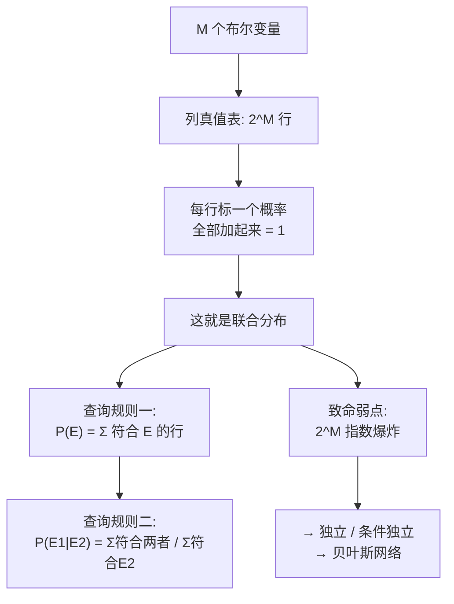

# C3.3 联合分布与推断

> [!abstract] 这一讲的任务
> [[C3.2 条件概率、链式法则与贝叶斯定理]] 里我们处理的都是**两个**事件。可现实的数据表有很多列：性别、每周工作时长、贫富、学历、年龄……而且每次提的问题都不一样——今天问"男性的富人比例"，明天问"每周工作 40 小时以上的人里女性占多少"。
>
> 难道每换一个问题就要重新推一遍公式吗？
>
> 这一讲给出一个一劳永逸的东西：**联合分布 joint distribution**。它像一张"万能查询表"，把所有变量所有取值组合的概率一次性存下来，之后**任何**关于这些变量的概率问题，都变成一件事：**把符合条件的行加起来。**
>
> 这一讲还会告诉你这张表的致命弱点——**它的大小随变量个数指数爆炸**，所以几乎永远造不出来。整个概率图模型领域，就是为了绕开这个爆炸而存在的。

> [!info] 怎么读这份讲义
> 第 2 节是"造表"，第 3–4 节是"查表"，只有两条规则，而且第二条是第一条的推论。**真正的重点在第 5 节：这张表为什么用不起来。** 那是后面好几章的动机。
> 标有 **（拓展）** 或 **【拓展】** 的内容，是**课堂上没有展开讲、由课件和教材延伸补充**的部分。复习时可先掌握未标注的主干内容，行有余力再看拓展部分。

> [!note] 授课进度说明
> 第 3 章课件**暂无对应语音转写稿**，「拓展」标注只标在明确属于教材/推导延伸处。

---

## 0. 开场：一张永远问不完的表

统计局给了你一份人口数据，三列：**性别、每周工作时长（40.5 小时以上/以下）、贫富**。领导今天问你："男性里穷人占多少？"你算了。明天他问："穷人里男性占多少？"你又算了一遍。后天他问："工作时长多的女性富人比例？"

> [!question] 停一下，先自己想想
> 这些问题彼此不同，但你每次做的动作其实**一模一样**：在数据里**挑出符合条件的那些人，数一数**。
>
> 那能不能**预先把所有可能的组合都数好**，做成一张表，以后来什么问题都直接查？

三个变量，每个两种取值，一共 $2\times2\times2=8$ 种组合。**只要把这 8 种组合各占多少比例事先算好，领导以后问什么你都能当场答出来。**

**你刚才想出来的，就是联合分布。**

---

## 1. 造表：三步配方

> [!important] 课件原文：The Joint Distribution
> **Example: Boolean variables $A$, $B$, $C$**
> **Recipe for making a joint distribution of $M$ variables:**
> 1. Make a **truth table** listing all combinations of values of your variables (if there are $M$ Boolean variables then the table will have $2^M$ rows).（列出所有取值组合的真值表；$M$ 个布尔变量则有 $2^M$ 行）
> 2. For each combination of values, **say how probable it is**.（为每一种组合指定它的概率）
> 3. If you subscribe to the axioms of probability, **those numbers must sum to 1**.（若你接受概率公理，这些数必须加起来等于 1）

> [!important] 课件的例子表
> | A | B | C | Prob |
> |---|---|---|---|
> | 0 | 0 | 0 | 0.30 |
> | 0 | 0 | 1 | 0.05 |
> | 0 | 1 | 0 | 0.10 |
> | 0 | 1 | 1 | 0.05 |
> | 1 | 0 | 0 | 0.05 |
> | 1 | 0 | 1 | 0.10 |
> | 1 | 1 | 0 | 0.25 |
> | 1 | 1 | 1 | 0.10 |

> [!example] 第 3 步要自己验（补充，已用程序复核）
> $$0.30+0.05+0.10+0.05+0.05+0.10+0.25+0.10=1.00\ \checkmark$$
> 考试遇到这类表，**第一件事就是把整列加一遍**。加不到 1 说明题目给错了或你抄错了。

![[C3-联合分布-三变量维恩图.png]]

> [!note] 课件那张维恩图怎么读（补充）
> 课件在表格右边配了一张三圆相交的维恩图，上面标着 0.05、0.10、0.25 等数字。**这张图和左边的表是同一份信息的两种画法**：
> - 三个圆分别是"$A$ 为真"、"$B$ 为真"、"$C$ 为真"的世界；
> - 三圆把矩形切成 **8 块**（三圆之外那块也算一块），恰好对应表的 **8 行**；
> - 每块上的数字就是该行的概率。比如三圆的公共交集写着 0.10，对应 $(A,B,C)=(1,1,1)$ 那行。
> - 圆外那块写着 0.30，对应 $(0,0,0)$。
>
> **看图能立刻明白为什么"必须加起来等于 1"——它们不重不漏地铺满了整个矩形。**

> [!warning] 易错点：0/1 是取值，不是概率
> 表的前三列 A、B、C 下面的 0 和 1 是**变量的取值**（假/真），最后一列才是概率。别看串了。

> [!note] 布尔以外的情况（补充）
> 配方里的 $2^M$ 只对**布尔**变量成立。一般地，若变量 $X_i$ 有 $k_i$ 个取值，表的行数是 $\prod_{i=1}^{M}k_i$。下一节课件自己的例子就不是全布尔的。

---

## 2. 查表规则一：任意事件的概率

> [!important] 课件原文：Using the Joint Distribution
> Once you have the JD you can ask for the probability of **any logical expression** involving your attributes
> $$P(E)=\sum_{\text{rows matching }E}P(\text{row})$$
> （有了联合分布，你可以问任意一个由这些属性组成的逻辑表达式的概率：把所有符合 $E$ 的行的概率加起来。）

课件换了一份更真实的数据（来自美国人口普查）：

> [!important] 课件的数据表
> | gender | hours_worked | wealth | Prob |
> |---|---|---|---|
> | Female | v0: 40.5− | poor | 0.253122 |
> | Female | v0: 40.5− | rich | 0.0245895 |
> | Female | v1: 40.5+ | poor | 0.0421768 |
> | Female | v1: 40.5+ | rich | 0.0116293 |
> | Male | v0: 40.5− | poor | 0.331313 |
> | Male | v0: 40.5− | rich | 0.0971295 |
> | Male | v1: 40.5+ | poor | 0.134106 |
> | Male | v1: 40.5+ | rich | 0.105933 |
>
> （`v0: 40.5−` 指每周工作不足 40.5 小时，`v1: 40.5+` 指 40.5 小时及以上。）

> [!warning] 复核发现：这张表加起来是 0.9999991，不是 1
> 已用程序核算：八行之和 $=0.9999991$，差了 $9\times10^{-7}$。
> **这是四舍五入造成的，不是错误**——每个数只保留了 6 位有效数字。做题时按 1 处理即可。但**养成"先加一遍"的习惯**，如果差得多（比如 0.98），那就是真有问题了。

### 2.1 课件的两个查询

> [!important] 课件原文：查询一
> $$P(\text{Poor}\wedge\text{Male})=0.4654=0.331313+0.134106$$

> [!example] 为什么是这两行（补充）
> 条件是"穷 **且** 男"。扫一遍表，同时满足的只有两行：
> - Male / 40.5− / poor = 0.331313
> - Male / 40.5+ / poor = 0.134106
>
> **注意 hours_worked 没有被限制**，所以它的两种取值都要算进来。
> $$0.331313+0.134106=0.465419\approx0.4654\ \checkmark$$（程序复核一致）
>
> **这个"不关心的变量就把它的所有取值加起来"的动作，正是 [[C3.1 随机变量、事件与概率公理]] 推论 2 的推广，叫边缘化 marginalization。**

> [!important] 课件原文：查询二
> $$P(\text{Poor})=0.7607=0.253122+0.0421768+0.331313+0.134106$$

> [!example] 手算复核（补充）
> 这次只限制 wealth = poor，**gender 和 hours_worked 都不关心**，所以 $2\times2=4$ 行全要：
> $$0.253122+0.0421768+0.331313+0.134106=0.7607178\approx0.7607\ \checkmark$$

> [!question] 课堂追问：$P(\text{Rich})$ 是多少？
> 两种算法应该一致：
> - 直接加四行 rich：$0.0245895+0.0116293+0.0971295+0.105933=0.2392813$
> - 用推论 1：$1-P(\text{Poor})=1-0.7607178=0.2392822$
>
> 两者差 $9\times10^{-7}$——**正是上面那个四舍五入误差**，互相印证了。

> [!important] 停一下：这条规则有多强
> "任意逻辑表达式"是字面意思。$P(\text{Male}\vee\text{Rich})$、$P(\sim\text{Poor}\wedge 40.5+)$、$P((\text{Female}\wedge\text{Rich})\vee(\text{Male}\wedge\text{Poor}))$……**全都只需要挑行、相加。**
>
> 有了联合分布，你就不用记容斥公式了——重叠的行本来就只会被数一次。

---

## 3. 查表规则二：推断（条件概率）

> [!important] 课件原文：Inference with the Joint
> $$P(E_1\mid E_2)=\frac{P(E_1\wedge E_2)}{P(E_2)}=\frac{\sum_{\text{rows matching }E_1\text{ and }E_2}P(\text{row})}{\sum_{\text{rows matching }E_2}P(\text{row})}$$
>
> $$P(\text{Male}\mid\text{Poor})=0.4654/0.7607=0.612$$

这条规则**不是新东西**：分子分母各用一次规则一，再套 [[C3.2 条件概率、链式法则与贝叶斯定理]] 的条件概率定义，就是它。

> [!example] 手算复核（补充）
> $$P(\text{Male}\mid\text{Poor})=\frac{P(\text{Male}\wedge\text{Poor})}{P(\text{Poor})}=\frac{0.465419}{0.7607178}=0.61182\approx0.612\ \checkmark$$
>
> 读法：**在所有穷人里，男性占 61.2%。**

> [!warning] 别和 $P(\text{Poor}\mid\text{Male})$ 搞反了——[[C3.2 条件概率、链式法则与贝叶斯定理]] 的老问题
> $$P(\text{Poor}\mid\text{Male})=\frac{P(\text{Poor}\wedge\text{Male})}{P(\text{Male})}=\frac{0.465419}{0.331313+0.0971295+0.134106+0.105933}=\frac{0.465419}{0.6684815}=0.6962$$
> **0.612 和 0.696 是两个完全不同的问题的答案**：前者是"穷人中男性的比例"，后者是"男性中穷人的比例"。
>
> 考试写答案前，**先用一句中文把分母读出来**："我在哪一群人里面数？"——分母就是那群人。

> [!example] 再练一个：富人里男性占多少（补充）
> $$P(\text{Male}\mid\text{Rich})=\frac{0.0971295+0.105933}{0.2392813}=\frac{0.2030625}{0.2392813}=0.8486$$
> 对比 $P(\text{Male}\mid\text{Poor})=0.612$：**富人里男性占 84.9%，穷人里只占 61.2%**——这份数据里性别和贫富显然**不独立**。

### 3.1 顺带看看"独立"长什么样

> [!note] 独立性在联合分布表里怎么检查（课件目录有、正文未展开，拓展）
> $A$ 与 $B$ 独立 $\iff$ 对**所有**取值组合都有
> $$P(A=a\wedge B=b)=P(A=a)\cdot P(B=b)$$
> 也就是说：**表里每一格，都等于对应的行边缘概率乘列边缘概率。** 只要有一格不满足，就不独立。
>
> 用上面的数据验一下 gender 与 wealth：
> - $P(\text{Male})\cdot P(\text{Rich})=0.6684815\times0.2392813=0.15993$
> - 实际 $P(\text{Male}\wedge\text{Rich})=0.2030625$
>
> $0.2031\ne0.1599$，**不独立**——和上一段的结论一致。

> [!note] 条件独立 conditional independence（拓展）
> 更弱也更有用的一个概念：**在已知 $C$ 的条件下**，$A$ 与 $B$ 独立：
> $$P(A\wedge B\mid C)=P(A\mid C)P(B\mid C)$$
> 直觉：$A$ 和 $B$ 看上去相关，但它们的相关**完全是由 $C$ 造成的**；一旦 $C$ 定住，两者就没关系了。
>
> 经典例子：**冰淇淋销量**与**溺水人数**高度正相关，但一旦固定"季节"这个变量，两者就几乎无关——夏天是共同原因。
>
> **条件独立是朴素贝叶斯分类器的全部假设**（"给定类别，各个特征互相独立"），也是贝叶斯网络能大幅压缩联合分布的原因。课程后面会正式讲。

---

## 4. 课件的阶段小结

> [!important] 课件原文：You Should Know
> - **Events**：discrete random variables, continuous random variables, compound events
> - **Axioms of probability**：what defines a reasonable theory of uncertainty
> - **Conditional probabilities**
> - **Chain rule**
> - **Bayes rule**
> - **Joint distribution over multiple random variables**
>   - how to calculate other quantities from the joint distribution（如何从联合分布算出其他量）

> [!important] 这一页就是考纲
> 课件专门用一页写 "You Should Know"，**几乎等同于划重点**。对照本 vault：
>
> | 课件条目 | 本 vault 位置 |
> |---|---|
> | Events / 离散连续随机变量 / 复合事件 | [[C3.1 随机变量、事件与概率公理]] 第 1 节 |
> | Axioms of probability | [[C3.1 随机变量、事件与概率公理]] 第 3 节 |
> | Conditional probabilities | [[C3.2 条件概率、链式法则与贝叶斯定理]] 第 1 节 |
> | Chain rule | [[C3.2 条件概率、链式法则与贝叶斯定理]] 第 2 节 |
> | Bayes rule | [[C3.2 条件概率、链式法则与贝叶斯定理]] 第 3–5 节 |
> | Joint distribution + 如何从中计算 | 本篇第 1–3 节 |
>
> 注意 **"how to calculate other quantities from the joint distribution"** 这句——**考的是会算，不是会背定义。** 给一张表，要能当场算出 $P(E)$ 和 $P(E_1\mid E_2)$。这和 [[C1.3 熵与信息增益]] 那个"每次必考手算"的路数完全一致。

---

## 5. 这张万能表的致命弱点

联合分布看起来完美：造一次，永久使用，任何问题都能答。**那为什么机器学习还要发明那么多模型？**

> [!important] 因为表根本造不出来
> **问题一：行数指数爆炸。**
> | 布尔变量个数 $M$ | 行数 $2^M$ |
> |---|---|
> | 3 | 8 |
> | 10 | 1 024 |
> | 20 | 约 100 万 |
> | 30 | 约 10 亿 |
> | 100 | $1.27\times10^{30}$ |
>
> 一封邮件用 10000 个词做特征（每个词出现/不出现），联合分布有 $2^{10000}$ 行——**比宇宙中的原子数还多出天文数字倍。** 存不下，永远存不下。
>
> **问题二：就算存得下，也估不准。**
> 每一行的概率要从数据里估（用频率）。你有 100 万条样本、表有 10 亿行，**平均每行连一个样本都摊不到**，绝大多数行的估计值是 0。这叫**数据稀疏 data sparsity**。

> [!question] 停一下：那怎么办？
> 两条出路，课程后面都会走：
> 1. **加假设，把表压小。** 如果假设"给定类别，各特征条件独立"，联合分布就能拆成一堆小表的乘积，参数量从指数级降到线性级——**这就是朴素贝叶斯**。如果只假设部分变量之间独立，就得到**贝叶斯网络 / 概率图模型**（课件目录里的 "graphical models"）。
> 2. **干脆不建联合分布。** 只学我们真正需要的那个条件分布 $P(Y\mid X)$，绕过 $P(X)$ ——**这就是[[C2.5 逻辑回归]] 在做的事**，叫**判别式模型 discriminative model**。
>
> **这两条路的分岔，是机器学习里最重要的分类之一。** 你现在已经能看懂它为什么会分岔了。（拓展）

> [!important] 停一下，我们刚才干了什么
> 我们造了一个**理论上完美、实践中不可行**的东西，然后搞清楚了它为什么不可行。
>
> 这不是白费功夫：**联合分布是所有概率模型的"标准答案"**，后面每一个模型都可以理解为"用某种近似去逼近这张表"。知道标准答案长什么样，才能判断一个近似好在哪、差在哪。

---

## 6. 这一讲的三句话

> [!important] 三句话
> 1. **联合分布 = 真值表 + 每行一个概率，全部加起来等于 1**；$M$ 个布尔变量就有 $2^M$ 行。
> 2. **有了它，任意问题都是"挑行相加"**：$P(E)=\sum_{\text{符合}E\text{的行}}P(\text{row})$，条件概率则是 $P(E_1\mid E_2)=\frac{\sum_{\text{符合}E_1\wedge E_2}}{\sum_{\text{符合}E_2}}$；**不关心的变量就把它的所有取值加起来（边缘化）**。
> 3. **它的行数随变量个数指数爆炸，实践中造不出也估不准**；出路是用独立/条件独立假设压缩它（朴素贝叶斯、贝叶斯网络），或者绕开它直接学 $P(Y\mid X)$（判别式模型）。

### 速查表

| 名称 | 内容 |
|---|---|
| 联合分布行数 | 布尔：$2^M$；一般：$\prod_i k_i$ |
| 归一化条件 | $\sum_{\text{all rows}}P(\text{row})=1$ |
| 查询任意事件 | $P(E)=\sum_{\text{rows matching }E}P(\text{row})$ |
| 推断（条件概率） | $P(E_1\mid E_2)=\dfrac{\sum_{\text{matching }E_1\wedge E_2}P(\text{row})}{\sum_{\text{matching }E_2}P(\text{row})}$ |
| 边缘化 | 不关心的变量，把它的所有取值对应的行加起来 |
| 独立 | 对所有取值：$P(A=a\wedge B=b)=P(A=a)P(B=b)$ |
| 条件独立 | $P(A\wedge B\mid C)=P(A\mid C)P(B\mid C)$ |

### 课件数据速查（人口普查例）

| 量 | 值 |
|---|---|
| $P(\text{Poor}\wedge\text{Male})$ | 0.4654 |
| $P(\text{Poor})$ | 0.7607 |
| $P(\text{Rich})$ | 0.2393 |
| $P(\text{Male})$ | 0.6685 |
| $P(\text{Male}\mid\text{Poor})$ | 0.612 |
| $P(\text{Poor}\mid\text{Male})$ | 0.696 |
| $P(\text{Male}\mid\text{Rich})$ | 0.849 |

> [!abstract] 下一讲预告
> 现在我们能从联合分布里查出**任何一个概率**。但很多时候我们并不想要一整个分布，只想要**一个数字来概括它**：这个随机变量"平均而言"是多少？它波动得厉害吗？两个变量是一起涨还是一个涨一个跌？
>
> [[C3.4 期望、方差、协方差与相关系数]] 给出三把尺子——期望、方差、协方差，以及一个把协方差去掉量纲的版本：相关系数。最后会留一个陷阱：**相关系数为 0，两个变量就无关吗？** 答案是否定的，而且反例简单得让人不服气。

---

上一讲：[[C3.2 条件概率、链式法则与贝叶斯定理]]　　下一讲：[[C3.4 期望、方差、协方差与相关系数]]
返回：[[机器学习课程 MOC]]
