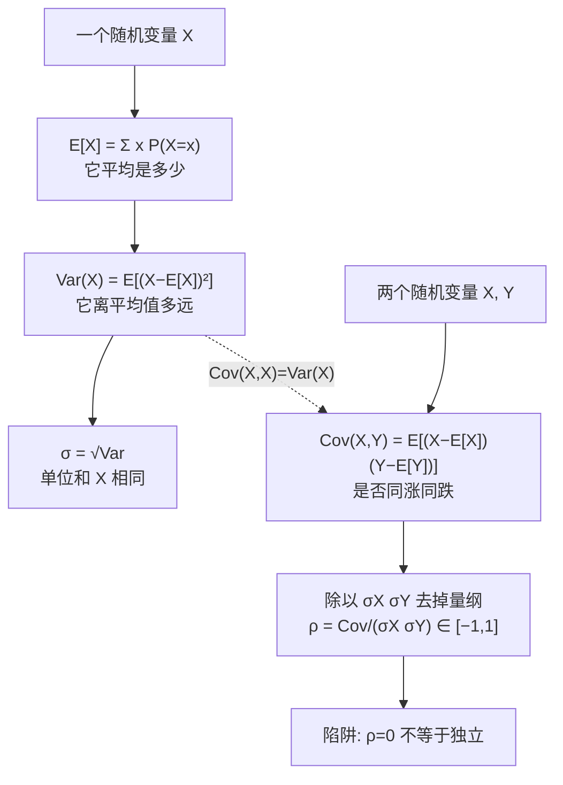

# C3.4 期望、方差、协方差与相关系数

> [!abstract] 这一讲的任务
> [[C3.3 联合分布与推断]] 给了我们一张能回答任何问题的表。但很多时候我们不想要一整张表，只想要**一两个数字来概括它**：
> - 这个随机变量**平均**是多少？→ **期望**
> - 它**波动**得厉不厉害？→ **方差 / 标准差**
> - 两个变量是**一起涨**还是**一涨一跌**？→ **协方差**
> - 这个“一起涨”的程度，怎么**去掉单位**好让不同问题之间能比较？→ **相关系数**
>
> 这四个量是从概率通向统计与机器学习的桥梁。[[C2.3 多变量线性回归与梯度下降实践]] 里的均值归一化用的是期望和标准差；PCA 降维的核心是协方差矩阵；数据分析里天天挂在嘴边的“相关性”就是这里的 $\rho$。
>
> 最后课件留了一个陷阱：**相关系数等于 0，两个变量就无关吗？** 反例简单得让人不服气。

> [!info] 怎么读这份讲义
> 前三节是定义 + 手算，**跟着课件的那组数字自己算一遍**就掌握了。第 5 节的反例是本讲唯一“难”的地方，也是最容易考的地方。
> 标有 **（拓展）** 或 **【拓展】** 的内容，是**课堂上没有展开讲、由课件和教材延伸补充**的部分。复习时可先掌握未标注的主干内容，行有余力再看拓展部分。

> [!note] 授课进度说明
> 第 3 章课件**暂无对应语音转写稿**，「拓展」标注只标在明确属于教材/推导延伸处。本讲全部内容按离散随机变量处理（课件如此），连续情形把 $\sum$ 换成 $\int$。

---

## 0. 开场：一句“平均”引出的麻烦

期末考完，助教在群里说：“这次班级**平均分 75**。”

你看到这个数，脑子里立刻会想到两个后续问题：

1. 75 分是怎么来的？——是大家都考了 75 左右，还是一半人 95、一半人 55？
2. 我考了 82，算好还是不算好？

第一个问题问的是**离散程度**，第二个问题其实也是——如果大家都在 73–77 之间，82 分就相当突出；如果分数从 30 铺到 100，82 分就很普通。

> [!question] 停一下，先自己想想
> 你会用什么数字来回答“大家分数散得厉不厉害”？
>
> 一个自然的想法是：算每个人**离平均分的距离**，然后取平均。
>
> 但马上有个麻烦：考 85 的人距离是 $+10$，考 65 的人距离是 $-10$，**加起来正负抵消，变成 0**。
>
> 这个麻烦你**在 [[C2.1 单变量线性回归与代价函数]] 里已经见过一模一样的一次了**——当时是“预测值减真实值有正有负会抵消”，解决办法是**平方**。这里的解决办法也一样。

**你刚才想到的，就是方差。** 这一讲把这类“用几个数概括一个分布”的量系统地过一遍。

---

## 1. 期望：加权平均

> [!important] 课件原文：Expected Values
> Given a discrete random variable $X$, the **expected value** of $X$, written $E[X]$, is
> $$E[X]=\sum_{x\in X}x\,P(X=x)$$
> We can also talk about the expected value of **functions** of $X$
> $$E[f(X)]=\sum_{x\in X}f(x)\,P(X=x)$$
> **Example:** $P(X=0)=0.3$, $P(X=1)=0.2$, $P(X=2)=0.5\Rightarrow$
> $$E[X]=0\cdot0.3+1\cdot0.2+2\cdot0.5=1.2$$

> [!important] 逐符号拆解
> $$E[X]=\sum_{x\in X}\underbrace{x}_{\text{取值}}\cdot\underbrace{P(X=x)}_{\text{这个取值的概率}}$$
> - 求和号下的 $x\in X$ 是一个**略随意的写法**：严格说应该是“$x$ 取遍 $X$ 的所有可能取值”。$X$ 是随机变量（函数），$x$ 是它的具体取值。**大写是随机变量，小写是取值，这个约定后面一直用。**
> - **期望就是加权平均，权重是概率。** 如果所有取值概率相同（各 $1/n$），它就退化成普通的算术平均 $\frac{1}{n}\sum x$。

> [!warning] 易错点：期望不一定是“可能出现的值”
> 上面算出 $E[X]=1.2$，但 $X$ 只能取 0、1、2，**永远不会等于 1.2**。
> 一个更著名的例子：掷骰子的期望是 3.5，骰子上没有 3.5 这一面。
> **期望是“长期平均”，不是“最可能出现的值”**（后者叫众数 mode）。

> [!important] $E[f(X)]$ 为什么重要
> 第二条公式说：要算 $X$ 的某个函数的期望，**不用先求出 $f(X)$ 的分布**，直接拿 $f(x)$ 去加权就行。
>
> 比如 $E[X^2]=\sum_x x^2P(X=x)$ ——马上就要用它算方差。
>
> 这条性质有个名字叫 **LOTUS（Law of the Unconscious Statistician，无意识统计学家定律）**，名字很怪，但它是所有“算某个量的期望”的基础。（拓展）

> [!note] 期望的两条常用性质（课件未列，补充）
> - **线性性**：$E[aX+b]=aE[X]+b$；$E[X+Y]=E[X]+E[Y]$（**不要求 $X,Y$ 独立**，这一点很反直觉但确实成立）。
> - **乘积**：$E[XY]=E[X]E[Y]$ **只在 $X,Y$ 独立时成立**，一般情况下不成立——它们的差正是协方差。
>
> 线性性是机器学习里最常用的工具之一：训练集的经验风险 $\frac{1}{m}\sum_i L_i$ 就是损失的期望估计，能被反复拆开正因为期望是线性的。

---

## 2. 方差与标准差：波动有多大

> [!important] 课件原文：Variance and Standard Deviation
> The **variance** of $X$ measures how far $X$ is from its mean, on average
> $$\mathrm{Var}(X)=E\big[(X-E[X])^2\big]=\sum_{x\in X}(x-E[X])^2P(X=x)$$
> A useful identity (expand the square): $\mathrm{Var}(X)=E[X^2]-E[X]^2$
> The **standard deviation** $\sigma_X=\sqrt{\mathrm{Var}(X)}$ has **the same unit as $X$**
> **Example:** $P(X=0)=0.3,P(X=1)=0.2,P(X=2)=0.5$, so $E[X]=1.2$ and
> $$E[X^2]=0\cdot0.3+1\cdot0.2+4\cdot0.5=2.2,\quad \mathrm{Var}(X)=2.2-1.2^2=0.76,\quad \sigma_X\approx0.87$$
> Note that $\mathrm{Cov}(X,X)=\mathrm{Var}(X)$

> [!important] 定义在说什么
> $(X-E[X])$ 是“偏离均值多远”，可正可负。**平方**让它恒非负（正负不再抵消，正是开场那个麻烦的解法），再取**期望**就是“平均偏离多远的平方”。
>
> 为什么要开方变成标准差？因为**方差的单位是 $X$ 单位的平方**。身高的方差单位是“平方厘米”，没法解释；开方之后回到厘米，就能说“平均上下浮动 8 厘米”。**课件专门强调 “has the same unit as $X$”，就是这个意思。**

> [!example] 那条恒等式的推导（课件说 “expand the square”，这里展开写）（补充）
> 记 $\mu=E[X]$（这是一个**常数**，不是随机变量——这一点是推导的关键）。
> $$\mathrm{Var}(X)=E[(X-\mu)^2]=E[X^2-2\mu X+\mu^2]$$
> 用期望的线性性拆开：
> $$=E[X^2]-2\mu E[X]+\mu^2=E[X^2]-2\mu\cdot\mu+\mu^2=E[X^2]-\mu^2$$
> 即 $\mathrm{Var}(X)=E[X^2]-E[X]^2$。
>
> **口诀：平方的期望 减 期望的平方。** 顺序反了就错。

> [!example] 课件例子完整手算（已用程序复核）
> $$E[X]=0(0.3)+1(0.2)+2(0.5)=0+0.2+1.0=1.2$$
> $$E[X^2]=0^2(0.3)+1^2(0.2)+2^2(0.5)=0+0.2+2.0=2.2$$
> $$\mathrm{Var}(X)=2.2-1.2^2=2.2-1.44=0.76$$
> $$\sigma_X=\sqrt{0.76}=0.87178\ldots\approx0.87\ \checkmark$$
>
> **用原始定义再验一遍**（应该得到同一个数）：
> $$\mathrm{Var}(X)=(0-1.2)^2(0.3)+(1-1.2)^2(0.2)+(2-1.2)^2(0.5)$$
> $$=1.44\times0.3+0.04\times0.2+0.64\times0.5=0.432+0.008+0.32=0.76\ \checkmark$$

> [!warning] 两个易错点
> 1. $E[X^2]\ne E[X]^2$。上例中 $2.2\ne1.44$。**它们的差就是方差**，所以只有方差为 0（$X$ 是常数）时才相等。
> 2. 方差**恒 $\ge0$**。算出负数一定是算错了——通常就是把恒等式写反成 $E[X]^2-E[X^2]$。

> [!note] 接到你学过的地方（拓展）
> [[C2.3 多变量线性回归与梯度下降实践]] 的**均值归一化** $x\leftarrow\frac{x-\mu}{s}$，其中 $\mu$ 是均值（期望的样本估计）、$s$ 常取标准差。**做完之后新特征的期望是 0、标准差是 1**，这正是为了让不同特征的“波动尺度”一致，等高线从狭长椭圆变回圆形。
> 你现在能说清楚那一步在数学上做了什么了。

---

## 3. 协方差：两个变量的共同起落

> [!important] 课件原文：Covariance
> Given two discrete r.v.'s $X$ and $Y$, we define the **covariance** of $X$ and $Y$ as
> $$\mathrm{Cov}(X,Y)=E\big[(X-E[X])(Y-E[Y])\big]$$
> e.g., $X=$ gender, $Y=$ playsFootball
> or $X=$ gender, $Y=$ leftHanded
> **Remember:** $E[X]=\sum_{x\in X}xP(X=x)$

> [!important] 怎么读这个定义
> 方差里是 $(X-\mu_X)^2$，也就是 $(X-\mu_X)(X-\mu_X)$；协方差把后面那个换成 $(Y-\mu_Y)$。**所以协方差就是“方差的两变量版本”，课件那句 $\mathrm{Cov}(X,X)=\mathrm{Var}(X)$ 说的就是这件事。**
>
> 符号的含义：
> 
> | 情况 | 乘积 $(X-\mu_X)(Y-\mu_Y)$ | 说明 |
> |---|---|---|
> | $X$ 高于均值时 $Y$ 也高于均值 | 正 × 正 = 正 | 同涨 |
> | $X$ 低于均值时 $Y$ 也低于均值 | 负 × 负 = 正 | 同跌 |
> | $X$ 高 $Y$ 低（或反之） | 正 × 负 = 负 | 此消彼长 |
>
> 取期望（平均）之后：
> - $\mathrm{Cov}>0$：**同向变动**（一个大另一个倾向于也大）
> - $\mathrm{Cov}<0$：**反向变动**
> - $\mathrm{Cov}=0$：**不相关 uncorrelated**（注意：**不等于独立**，见第 5 节）

> [!note] 课件那两个例子为什么这么选（补充）
> - $X=$ gender，$Y=$ playsFootball（是否踢足球）：现实里这两者**大概率有非零协方差**。
> - $X=$ gender，$Y=$ leftHanded（是否左撇子）：左利手比例在男女之间差异很小，**协方差接近 0**。
>
> **一个正例一个反例，摆在一起就是在教你“协方差在测量什么”。**
>
> 注意这里 gender 是布尔变量，要算协方差得先把它编码成 0/1（比如 female=0, male=1）。**编码方式会影响协方差的符号**（0/1 对调，符号翻转），但不影响“有没有关系”这个判断。

> [!note] 协方差的等价计算式（课件未给，补充，做题更快）
> 和方差的恒等式同理：
> $$\mathrm{Cov}(X,Y)=E[XY]-E[X]E[Y]$$
> 推导：$E[(X-\mu_X)(Y-\mu_Y)]=E[XY-\mu_XY-\mu_YX+\mu_X\mu_Y]=E[XY]-\mu_X\mu_Y-\mu_Y\mu_X+\mu_X\mu_Y=E[XY]-E[X]E[Y]$。
>
> **由此立刻可见：$X,Y$ 独立 $\Rightarrow E[XY]=E[X]E[Y]\Rightarrow\mathrm{Cov}(X,Y)=0$。** 这就是第 5 节那半句“independent ⇒ uncorrelated”的证明，一行。

> [!note] 协方差矩阵（拓展，AI 方向必用）
> 有 $n$ 个变量时，把两两协方差排成一个 $n\times n$ 矩阵 $\Sigma$，其中 $\Sigma_{ij}=\mathrm{Cov}(X_i,X_j)$。
> - 对角线 $\Sigma_{ii}=\mathrm{Var}(X_i)$（因为 $\mathrm{Cov}(X,X)=\mathrm{Var}(X)$）；
> - 矩阵是**对称**的（$\mathrm{Cov}(X,Y)=\mathrm{Cov}(Y,X)$），且**半正定**。
>
> **PCA 降维做的事就是求这个矩阵的特征向量**；多元高斯分布 $\mathcal{N}(\mu,\Sigma)$ 里的 $\Sigma$ 也是它。课程后面讲降维时会正式用到。

---

## 4. 相关系数：把量纲除掉

> [!important] 课件原文：Correlation Coefficient
> The covariance depends on the **units** of $X$ and $Y$; dividing by the standard deviations gives a number **without unit**
> $$\rho_{XY}=\frac{\mathrm{Cov}(X,Y)}{\sigma_X\sigma_Y},\qquad -1\le\rho_{XY}\le1\quad(\text{Cauchy–Schwarz})$$
> - $|\rho_{XY}|=1$ **exactly when** $Y=aX+b$ (a linear relation); in particular $\rho_{XX}=1$
> - $\rho_{XY}=0$: $X$ and $Y$ are **uncorrelated**
> - **independent $\Rightarrow$ uncorrelated, but not conversely**: $X$ uniform on $\{-1,0,1\}$ and $Y=X^2$ give $\mathrm{Cov}(X,Y)=E[X^3]-E[X]E[X^2]=0$, yet $Y$ is a function of $X$

### 4.1 为什么需要它 

> [!question] 停一下：协方差有什么不好？
> 假设 $X$ 是身高，$Y$ 是体重，你算出 $\mathrm{Cov}(X,Y)=300$。这个数大吗？
>
> **没法判断。** 因为如果你把身高的单位从“米”换成“厘米”，数值乘 100，协方差立刻变成 30000——**关系一点没变，数字变了 100 倍。**
>
> 协方差的单位是 $[X]\cdot[Y]$（比如“厘米·公斤”），所以它的数值大小**既反映关系强度，也反映单位选择**，两者混在一起。

除以 $\sigma_X\sigma_Y$ 就把单位约掉了：$\sigma_X$ 的单位是 $[X]$，$\sigma_Y$ 的单位是 $[Y]$，分子分母单位相同，**$\rho$ 是纯数**。而且它被限制在 $[-1,1]$ 里，任何两组数据之间都可以直接比较。

> [!note] $-1\le\rho\le1$ 的来源（拓展）
> 课件标注了 **Cauchy–Schwarz（柯西–施瓦茨不等式）**：对任意随机变量
> $$\big|E[UV]\big|\le\sqrt{E[U^2]E[V^2]}$$
> 取 $U=X-\mu_X$、$V=Y-\mu_Y$，左边是 $|\mathrm{Cov}(X,Y)|$，右边是 $\sigma_X\sigma_Y$，两边一除即得 $|\rho|\le1$。
> 而**等号成立当且仅当 $U$ 与 $V$ 成比例**，也就是 $Y-\mu_Y=a(X-\mu_X)$，即 $Y=aX+b$ ——正好对应课件的第一条。

### 4.2 三个要点逐条读

> [!important] 要点一：$|\rho|=1$ 当且仅当**完全线性**
> 注意课件写的是 “**exactly when** $Y=aX+b$”——是**充要条件**。
> - $\rho=1$：$a>0$，完美正线性；
> - $\rho=-1$：$a<0$，完美负线性；
> - $\rho_{XX}=1$：$X$ 和自己当然是完美线性（$a=1,b=0$）。
>
> **$|\rho|$ 度量的是“有多接近一条直线”，不是“有多大关系”。** 这个区别是下一条的伏笔。

> [!important] 要点二：$\rho=0$ 叫**不相关 uncorrelated**
> 请特别注意用词：课件说的是 uncorrelated（不相关），**不是 independent（独立）**。这两个词在日常中文里几乎同义，在这里**必须分开**。

> [!important] 要点三：独立 ⟹ 不相关，反之不成立
> 这是本讲最重要的一句话，下一节整节讲它。

![[C3-相关系数-四组散点.png]]

> [!note] 课件那四张图怎么读（补充）
> 课件在这一页并排放了四张散点图，横轴都是 $X$、纵轴都是 $Y$：
> 1. $\rho_{XY}=0.9$：点密集分布在一条上升的直线附近。
> 2. $\rho_{XY}=0$：点散成一团云，看不出方向。
> 3. $\rho_{XY}=-0.9$：点沿一条下降的直线分布。
> 4. $Y=X^2$：点排成一条**清清楚楚的抛物线**，$\rho_{XY}=0$ 却 **dependent（依赖）**。
>
> **第 4 张图是整页的落点**：前三张让你建立“$\rho$ 反映线性趋势”的直觉，第四张立刻把“$\rho=0$ 就是没关系”这个错误推论打掉。

---

## 5. 陷阱：$\rho=0$ 不等于独立

### 5.1 课件的反例

> [!important] 课件原文（反例）
> $X$ uniform on $\{-1,0,1\}$ and $Y=X^2$ give
> $$\mathrm{Cov}(X,Y)=E[X^3]-E[X]E[X^2]=0$$
> yet $Y$ is a function of $X$（然而 $Y$ 就是 $X$ 的函数）
> $$\rho_{XY}=0,\ \text{dependent}$$

> [!example] 完整手算（已用程序复核）
> $X$ 在 $\{-1,0,1\}$ 上均匀分布，即 $P(X=-1)=P(X=0)=P(X=1)=\frac13$。$Y=X^2$，所以 $Y$ 的取值是 $1,0,1$。
>
> **第一步：$E[X]$**
> $$E[X]=(-1)\cdot\tfrac13+0\cdot\tfrac13+1\cdot\tfrac13=0$$
> **第二步：$E[X^2]$（这就是 $E[Y]$）**
> $$E[Y]=E[X^2]=1\cdot\tfrac13+0\cdot\tfrac13+1\cdot\tfrac13=\tfrac23$$
> **第三步：$E[XY]$**。注意 $XY=X\cdot X^2=X^3$：
> $$E[XY]=E[X^3]=(-1)^3\tfrac13+0^3\tfrac13+1^3\tfrac13=-\tfrac13+0+\tfrac13=0$$
> **第四步：代入协方差公式**
> $$\mathrm{Cov}(X,Y)=E[XY]-E[X]E[Y]=0-0\cdot\tfrac23=0$$
> 于是 $\rho_{XY}=0$：**完全不相关。**
>
> **但 $Y$ 完全由 $X$ 决定**：只要你告诉我 $X$，我就能百分之百说出 $Y$。这是可能存在的最强的依赖关系。

> [!question] 停一下：为什么协方差会漏掉这么明显的关系？
> 画一下这三个点：$(-1,1)$、$(0,0)$、$(1,1)$ ——一条对称的抛物线。
>
> 在 $X>0$ 那一侧，$X$ 增大 $Y$ 也增大（**正贡献**）；
> 在 $X<0$ 那一侧，$X$ 增大 $Y$ 反而减小（**负贡献**）。
>
> **两边恰好对称，正负贡献完全抵消，加起来是 0。**
>
> 所以 $\rho$ 漏掉的不是“关系”，而是**非单调的、对称的关系**。$\rho$ 只有一只眼睛，它只看得见直线。

> [!warning] 考试里的标准表述，背下来
> - **独立 $\Rightarrow$ 不相关**（$\mathrm{Cov}=0$）：成立，一行就能证（见第 3 节补充）。
> - **不相关 $\Rightarrow$ 独立**：**不成立**，反例 $X\sim U\{-1,0,1\},\ Y=X^2$。
> - 唯一的例外：若 $(X,Y)$ **服从联合高斯分布**，则不相关 $\Rightarrow$ 独立。这是高斯分布特别好用的原因之一。（拓展）

### 5.2 现实世界里的两个对偶错误

> [!warning] 错误一：把 $\rho=0$ 当成“没关系”
> 就是上面的反例。**你的模型可能会因此扔掉一个极有预测力的特征**——特征筛选时只按相关系数排序，非线性关系会被全部误杀。
>
> 实践中的对策：用互信息 mutual information（它建立在 [[C1.3 熵与信息增益]] 的熵之上，**能捕捉任意形式的依赖**）、或者画散点图亲眼看看。**决策树就完全不受这个问题影响**，因为它按信息增益分裂，不依赖线性关系。（拓展）

> [!warning] 错误二：把 $\rho$ 大当成“有因果”
> **相关不蕴含因果（correlation does not imply causation）。** 冰淇淋销量与溺水人数的 $\rho$ 很高，但吃冰淇淋不会让人溺水——[[C3.3 联合分布与推断]] 里说过，共同原因是“夏天”。
>
> 这两个错误方向相反，**都会坑人**：一个让你看漏真关系，一个让你看到假原因。

> [!important] 停一下，我们刚才干了什么
> 我们造了四把尺子，每一把都在**用一个数概括一个分布**，代价是**丢掉信息**：
> - $E[X]$ 丢掉了波动；
> - $\mathrm{Var}(X)$ 丢掉了分布的形状（两个完全不同的分布可以有相同的均值和方差）；
> - $\mathrm{Cov}$ 和 $\rho$ 丢掉了**非线性关系**。
>
> **每一个摘要统计量都是一次有损压缩。** 知道它丢了什么，比知道它是什么更重要——这是本讲最值钱的一句话。

---

## 6. 这一讲的三句话

> [!important] 三句话
> 1. **期望是以概率为权的加权平均** $E[X]=\sum_x xP(X=x)$；**方差是平方偏差的期望**，用 $\mathrm{Var}(X)=E[X^2]-E[X]^2$ 算最快（**平方的期望减期望的平方**，别写反）；**标准差 $\sigma=\sqrt{\mathrm{Var}}$，单位与 $X$ 相同**。
> 2. **协方差 $\mathrm{Cov}(X,Y)=E[(X-E[X])(Y-E[Y])]=E[XY]-E[X]E[Y]$ 测量两个变量是否同向变动**，且 $\mathrm{Cov}(X,X)=\mathrm{Var}(X)$；除以 $\sigma_X\sigma_Y$ 得到无量纲的**相关系数 $\rho\in[-1,1]$**，$|\rho|=1$ 当且仅当 $Y=aX+b$。
> 3. **独立 ⟹ 不相关，但不相关 ⇏ 独立**：$X\sim U\{-1,0,1\},Y=X^2$ 时 $\rho=0$ 而 $Y$ 完全由 $X$ 决定；$\rho$ 只看得见**线性**关系。

### 速查表

| 名称 | 公式 |
|---|---|
| 期望 | $E[X]=\sum_{x}xP(X=x)$ |
| 函数的期望 | $E[f(X)]=\sum_x f(x)P(X=x)$ |
| 期望线性性 | $E[aX+b]=aE[X]+b$；$E[X+Y]=E[X]+E[Y]$（不需独立） |
| 方差（定义） | $\mathrm{Var}(X)=E[(X-E[X])^2]=\sum_x(x-E[X])^2P(X=x)$ |
| 方差（恒等式） | $\mathrm{Var}(X)=E[X^2]-E[X]^2$ |
| 标准差 | $\sigma_X=\sqrt{\mathrm{Var}(X)}$，单位同 $X$ |
| 协方差（定义） | $\mathrm{Cov}(X,Y)=E[(X-E[X])(Y-E[Y])]$ |
| 协方差（恒等式） | $\mathrm{Cov}(X,Y)=E[XY]-E[X]E[Y]$ |
| 自协方差 | $\mathrm{Cov}(X,X)=\mathrm{Var}(X)$ |
| 相关系数 | $\rho_{XY}=\dfrac{\mathrm{Cov}(X,Y)}{\sigma_X\sigma_Y}\in[-1,1]$（Cauchy–Schwarz） |
| $|\rho|=1$ | 当且仅当 $Y=aX+b$；$\rho_{XX}=1$ |
| 独立与不相关 | 独立 $\Rightarrow\rho=0$；$\rho=0\nRightarrow$ 独立 |
| 课件例题数值 | $P(0)=0.3,P(1)=0.2,P(2)=0.5$：$E[X]=1.2$，$E[X^2]=2.2$，$\mathrm{Var}=0.76$，$\sigma\approx0.87$ |
| 课件反例 | $X\sim U\{-1,0,1\}$，$Y=X^2$：$E[X]=0$，$E[Y]=\frac23$，$E[XY]=0$，$\mathrm{Cov}=0$ |

> [!abstract] 下一讲预告
> 第 3 章的概率工具箱到此配齐：公理、条件概率、贝叶斯、联合分布、期望与协方差。
>
> 接下来的两章都是**无监督学习**——训练集里只有 $x$，没有 $y$：
>
> - **第 4 章 聚类**（[[C4.1 无监督学习与 K-means 算法]]）问「这堆数据分成几堆」。K-means 只靠“算距离”和“求平均”两件事就能跑，但要说清它为什么一定收敛，得给它写出一个代价函数。
> - **第 5 章 异常检测**（[[C5.1 异常检测的问题设定、高斯分布与参数估计]]）问「这一个新样本正不正常」。它的做法是**建一个概率模型 $p(x)$，看新样本的 $p(x)$ 够不够大**——本讲的期望、方差、协方差（乃至协方差矩阵 $\Sigma$）会在那里全部派上用场，$\rho$ 描述的那种“两个变量一起动”的关系，正是 [[C5.4 多元高斯分布与它的异常检测]] 里斜椭圆等高线的由来。
>
> 还有一个问题会一直挂着：**这些概率值和参数本身从哪儿来？** 前面所有例子里的 $P(A)=0.05$、$P(B\mid A)=0.8$ 都是题目“assume”给的，现实中没人会告诉你——**你只有一堆数据。** 从数据里把分布的参数估出来，这件事叫**参数估计**，两条主线是**最大似然估计 MLE** 和**最大后验估计 MAP**，后者正是贝叶斯定理的直接应用。（[[C5.1 异常检测的问题设定、高斯分布与参数估计]] 3.3 已经先用 MLE 推了一次高斯的 $\mu,\sigma^2$。）等相应课件发下来再系统整理。

---

上一讲：[[C3.3 联合分布与推断]]
下一讲：[[C4.1 无监督学习与 K-means 算法]]
返回：[[机器学习课程 MOC]]
