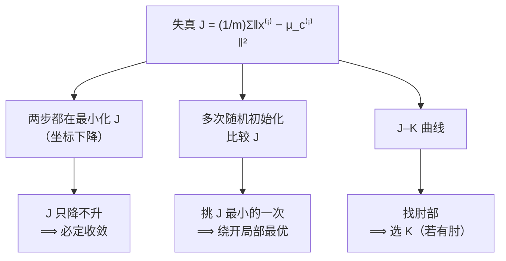

# C4.2 K-means 的优化目标、随机初始化与选 K

> [!abstract] 本讲任务
> [[C4.1 无监督学习与 K-means 算法]] 留下三个问题：K-means 凭什么一定会停？初始化是随机的，换个起点结果不同，哪个才算数？$K$ 到底取几？
>
> 这一讲用同一把钥匙把它们依次打开：**给 K-means 写出一个代价函数 $J$**。有了 $J$，“会不会停”就变成“$J$ 会不会一直降”，“哪个结果算数”就变成“哪个的 $J$ 更小”，“$K$ 取几”就变成“$J$ 随 $K$ 怎么变”。

---

## 1. 先把记号钉死

写代价函数之前，需要三个记号：

| 记号 | 含义 |
|---|---|
| $c^{(i)}$ | 样本 $x^{(i)}$ 当前被分到的簇的编号，取值 $1,\ldots,K$ |
| $\mu_k$ | 第 $k$ 个聚类中心的位置，$\mu_k\in\mathbb{R}^n$，$k\in\{1,\ldots,K\}$ |
| $\mu_{c^{(i)}}$ | 样本 $x^{(i)}$ 所在那个簇的中心 |

前两个上一讲见过，第三个是新的，也是最容易懵的：它是**两层嵌套**——先用 $i$ 查出簇号 $c^{(i)}$，再用这个簇号去取中心 $\mu$。举个数：如果第 $i$ 个样本被分到了第 5 簇，那么 $c^{(i)}=5$，于是 $\mu_{c^{(i)}}=\mu_5$。

简单说，**$\mu_k$ 是按簇点名，$\mu_{c^{(i)}}$ 是按人点名**：前者下标是你指定的簇号，一共 $K$ 个；后者下标是查出来的簇号，$i$ 跑遍 $m$ 个样本，取值会重复。

---

## 2. 失真函数

K-means 想让数据“分得好”。什么叫分得好？**每个点都离自己的中心很近。** 那整体好不好，自然就是把每个点到自己中心的距离加起来取平均。沿用上一讲的习惯用平方：

$$\boxed{\;J(c^{(1)},\ldots,c^{(m)},\mu_1,\ldots,\mu_K)=\frac{1}{m}\sum_{i=1}^{m}\left\lVert x^{(i)}-\mu_{c^{(i)}}\right\rVert^2\;}$$

优化目标是

$$\min_{\substack{c^{(1)},\ldots,c^{(m)}\\ \mu_1,\ldots,\mu_K}} J(c^{(1)},\ldots,c^{(m)},\mu_1,\ldots,\mu_K)$$

这个 $J$ 有个专门的名字，叫**失真 distortion**。

![[C4.2-板书-失真函数.png]]

它有三点值得记住。

第一，**$J$ 的自变量有两组**：$m$ 个整数 $c^{(i)}$，和 $K$ 个向量 $\mu_k$。这和前面的代价函数都不一样——以前的 $J(\theta)$ 只有一组参数。

第二，**几何意义很直观**：每个点和它所在簇的中心连一条线段，$J$ 就是这些线段长度平方的平均。$J$ 小，意味着点都紧紧围在自己的中心周围。

第三，**“失真”这个名字的来历**：它来自信号压缩——你用 $\mu_{c^{(i)}}$ 去“代表”$x^{(i)}$，丢掉的信息就是失真。回想上一讲的 T 恤：用 S、M、L 三个标准身材代替每个人的真实身材，$J$ 就是“平均有多不合身”。

---

## 3. 关键洞察：两步都在最小化 $J$

### 3.1 对上号

把 K-means 算法再摆出来：先随机初始化 $\mu_1,\ldots,\mu_K$，然后重复分配步（对每个 $i$，把 $c^{(i)}$ 设为最近中心的编号）和移动步（对每个 $k$，把 $\mu_k$ 设为该簇点的平均）。

$J$ 有两组变量，算法有两步。对上号了：

- **分配步：固定 $\mu_1,\ldots,\mu_K$ 不动，对 $c^{(1)},\ldots,c^{(m)}$ 最小化 $J$。**
- **移动步：固定 $c^{(1)},\ldots,c^{(m)}$ 不动，对 $\mu_1,\ldots,\mu_K$ 最小化 $J$。**

![[C4.2-板书-两步各自最小化什么.png]]

也就是说，**K-means 的两步都在最小化同一个 $J$，只是轮流针对不同的变量**。在优化里，这种“把变量分组，固定其余、优化一组，轮流进行”的方法叫**坐标下降**或**交替最小化**。K-means 不是凭空拍脑袋想出来的启发式，而是坐标下降在失真函数上的一个具体实例。

### 3.2 验证一下

这句话值得验证，两步都很短。

**分配步是不是最小值？** 固定 $\mu$ 之后，$J$ 是 $m$ 项之和，而第 $i$ 项 $\lVert x^{(i)}-\mu_{c^{(i)}}\rVert^2$ 只依赖 $c^{(i)}$，各项互不干扰。所以整体最小，就等于每一项各自最小，也就是每个 $c^{(i)}$ 各自选让这一项最小的那个簇号——正是“归给最近的中心”。

**移动步是不是最小值？** 固定 $c$ 之后，按簇分组：

$$J=\frac1m\sum_{k=1}^{K}\sum_{i\in S_k}\lVert x^{(i)}-\mu_k\rVert^2$$

各簇互不干扰，只需对每个 $k$ 单独最小化 $\sum_{i\in S_k}\lVert x^{(i)}-\mu_k\rVert^2$。对 $\mu_k$ 求导令其为零：

$$-2\sum_{i\in S_k}(x^{(i)}-\mu_k)=0\;\Longrightarrow\;\mu_k=\frac{1}{|S_k|}\sum_{i\in S_k}x^{(i)}$$

**答案正是均值。** 所以算法里写“取平均”不是随便挑的，它就是那个最小值点。这也顺带解释了 K-means 为什么用距离的平方：如果改用距离本身，最小值点就变成“几何中位数”，没有闭式解，算法就没这么好写了。（拓展）

### 3.3 第一个问题解决了：为什么一定会停

每一步都在最小化同一个 $J$，所以 **$J$ 在整个过程中只降不升**。又因为 $J\ge0$ 有下界，单调不增加上有下界，$J$ 必然收敛。

还能说得更强：归属 $c$ 只有有限多种可能（$K^m$ 种），给定 $c$ 之后 $\mu$ 也被唯一确定，所以算法只能经过有限多种状态，**必定在有限步内停下来**，不会永远横跳。

![[C4-失真函数随迭代单调下降.png]]

（上图是一次实际运行，横轴每一格是半步——分配、移动交替——可以看到 $J$ 每半步都在下降或持平，从不上升。）

这也给了一个很实用的调试手段：自己实现 K-means 时，**把每次迭代的 $J$ 打印出来**。只要看到 $J$ 上升，**代码一定有 bug**——最常见的是移动步用了旧的归属，或者分配步用了更新到一半的中心。

---

## 4. 随机初始化与局部最优

### 4.1 怎么随机

标准的初始化方法是：

1. 要求 $K<m$；
2. 从训练集里**随机挑 $K$ 个样本**；
3. 直接拿它们当初始中心：$\mu_1=x^{(i)}$，$\mu_2=x^{(j)}$，……

也就是说，初始中心不是在空间里乱撒，而是**直接落在某些数据点身上**。这样做有两个好处：一是保证初始中心在数据密集的地方，不会一开始就有簇是空的；二是不用操心每个特征的取值范围有多大。

为什么必须 $K<m$？$K=m$ 时每个点自成一簇，$J=0$，完美但毫无意义；$K>m$ 时连 $K$ 个不同的样本都挑不出来。实践中往往 $K$ 远小于 $m$。

![[C4.2-板书-随机初始化.png]]

### 4.2 同一份数据，三种结局

$J$ 只降不升，保证了会收敛——但**收敛到的不一定是全局最小**。

看一个例子。数据肉眼看分成三团：左下一团、上面一团、右下一团。取 $K=3$，从不同的随机起点出发，可能得到很不一样的结果：

- 运气好，三个中心各落一团，最后恰好停在三团的正中心——这是**好结果**，$J$ 最小；
- 运气不好，两个中心落在了同一团里，把这一团**劈成两半**，而剩下一个中心只好**同时管着另外两团**；
- 或者某个中心被挤到角落里，几乎分不到点。

后两种都是**局部最优**：再迭代下去也不会变，但 $J$ 明显比第一种大。

![[C4.2-板书-局部最优.png]]

原因在于 $J$ 作为 $(c,\mu)$ 的函数**不是凸函数**。回忆 [[C2.2 梯度下降]]：凸函数的好处是局部最小就是全局最小；非凸函数就没有这个保证，坐标下降走到哪个局部最小，完全取决于起点。

### 4.3 第二个问题解决了：跑 100 次，挑最好的

K-means 有一个梯度下降没有的便宜之处：**跑一次很快**。那就多跑几次：

```
for i = 1 to 100 {
    随机初始化 K-means
    运行 K-means，得到 c(1),...,c(m), μ1,...,μK
    计算失真 J(c(1),...,c(m), μ1,...,μK)
}
选 J 最小的那一次的聚类结果
```

“哪一次随机才算数？”——**$J$ 最小的那一次。** 有了 $J$，哪个聚类更好就不再是主观判断，而是一个可以比大小的数字。

跑几次合适？经验上，**$K$ 比较小（2 到 10）时，多次初始化很值得**——不同局部最优差别大，跑 50 到 1000 次常能明显改善；**$K$ 很大（比如几百）时收益就小了**，第一次跑出来的结果通常就不差。（拓展）

---

## 5. $K$ 取几

### 5.1 先承认它确实模糊

看一张图：两团点，各自被圈了起来。$K$ 应该等于 2 吗？可要是每一团内部还能再分成两小撮呢？$K=4$ 是不是也说得通？

**很多时候 $K$ 本来就没有唯一正确答案。** 看同一份数据，说 2 个簇和说 4 个簇的人都不算错。这不是算法的缺陷，而是无监督学习本身的性质：没有 $y$，就没有一个客观的“正确的 $K$”在那儿等你去发现。

### 5.2 方法一：肘部法

把 $K=1,2,3,\ldots$ 都跑一遍（每个 $K$ 都按 4.3 多次初始化取最小 $J$），画出 $J$ 随 $K$ 变化的曲线。

有时候曲线长这样：从 $K=1$ 到 $K=3$ 掉得很快，从 $K=3$ 往后几乎不再下降，整条曲线在 $K=3$ 处拐了个弯，像人的手肘。这个拐点就叫**肘部**，选 $K=3$。解释是：加到第 3 个簇之前，每多一个簇都能大幅减少失真；从第 4 个开始，就是在切分本来完整的一团了，收益寥寥。这叫**肘部法 elbow method**。

可是也经常遇到另一种曲线：从头到尾都平滑地缓慢下降，**根本看不出肘在哪**。$K=3$？$K=4$？$K=5$？说不清。这时肘部法给不出答案。

![[C4.2-板书-肘部法.png]]

用肘部法要注意两点：

- **$J$ 必然随 $K$ 单调下降**：簇越多，每个点离自己的中心越近，$K=m$ 时 $J=0$。所以**不能**选“$J$ 最小的 $K$”，那永远是 $K=m$。肘部法找的是下降速度的**转折**，不是最小值。
- **每个 $K$ 都要多次初始化**。否则曲线会被局部最优搅得坑坑洼洼，到处是假肘子。

### 5.3 方法二：看下游目的

另一条路往往更实用：**聚类通常不是终点，而是后面某件事的中间步骤。那就用后面那件事做得好不好，来评判 $K$。**

还是 T 恤。$K=3$ 做 S、M、L 三个尺码，$K=5$ 做 XS、S、M、L、XL 五个尺码。选哪个？**这个问题在数据里没有答案，在生意里有答案**：

- 选 5 个尺码，每个人都能买到更合身的衣服，顾客满意、退货少；但要多开两条生产线、多备两种库存，成本上升。
- 选 3 个尺码，生产和库存简单，成本低；但有些人只能将就，可能流失顾客。

把“多卖的钱”和“多花的成本”都算出来，哪个净收益高就选哪个。

![[C4.2-板书-按下游目的选K.png]]

两种方法比较：肘部法完全从数据出发，客观但经常失效；看下游目的引入了数据之外的信息，主观但几乎总能给出答案。实践中，**有明确的下游目的就用它，没有才退回肘部法看一眼**。很多时候 $K$ 根本不是“算”出来的，而是被现实约束直接定死的——几个尺码、几个机架、调色板几种颜色。

---

## 6. 小结

这一讲只做了一件事：给 K-means 补上代价函数 $J$。但这一件事同时解决了三个问题：



> [!important] 这一讲的三句话
> 1. **K-means 的代价函数叫失真**：$J(c^{(1)},\ldots,c^{(m)},\mu_1,\ldots,\mu_K)=\frac1m\sum_{i=1}^m\lVert x^{(i)}-\mu_{c^{(i)}}\rVert^2$，它同时是归属 $c$ 和中心 $\mu$ 两组变量的函数；$\mu_{c^{(i)}}$ 读作“先查 $i$ 属于哪个簇，再取那个簇的中心”，例如 $c^{(i)}=5$ 时 $\mu_{c^{(i)}}=\mu_5$。
> 2. **分配步和移动步都在最小化同一个 $J$**：分配步固定 $\mu$ 对 $c$ 最小化，移动步固定 $c$ 对 $\mu$ 最小化（取均值正是求导为零的结果）。因此 $J$ 只降不升、有下界，K-means 必定在有限步内收敛；实现中若 $J$ 上升，一定是 bug。
> 3. **$J$ 非凸，会陷入局部最优**：标准做法是从训练集里随机挑 $K$ 个样本当初始中心（要求 $K<m$），整个过程跑 100 次，选 $J$ 最小的那次。**选 $K$**：肘部法找 $J$–$K$ 曲线的拐点（但曲线常常没有肘），或者按下游目的评判（T 恤 3 个尺码还是 5 个尺码，看成本和收益）。

### 速查表

| 名称 | 内容 |
|---|---|
| 失真函数 | $J=\dfrac1m\sum\limits_{i=1}^m\lVert x^{(i)}-\mu_{c^{(i)}}\rVert^2$ |
| $\mu_{c^{(i)}}$ | 若 $c^{(i)}=5$，则 $\mu_{c^{(i)}}=\mu_5$ |
| 分配步 | 固定 $\mu$，对 $c$ 最小化 $J$ |
| 移动步 | 固定 $c$，对 $\mu$ 最小化 $J$；求导为零得均值 |
| 收敛性 | $J$ 只降不升 + 有下界 + 状态有限 ⟹ 有限步收敛 |
| 调试 | $J$ 上升 ⟹ 代码有 bug |
| 随机初始化 | $K<m$；随机挑 $K$ 个样本作初始中心 |
| 避开局部最优 | 跑 100 次，取 $J$ 最小者 |
| 肘部法 | 找 $J$–$K$ 曲线的拐点；不能直接取 $J$ 最小 |
| 下游目的 | 用后续任务的效果评判 $K$ |

> [!abstract] 下一讲预告
> 聚类问“这些数据分成几堆”。下一章换一个问法：**“这一个新数据，正不正常？”** 一条飞机引擎生产线，上万台正常引擎画在图上是密密一团，新来一台落在了那团外面——外面要多远才算外面？更麻烦的是，坏引擎一共才见过二十来台，个个坏法不同。第 5 章**异常检测**的思路是：不去学“坏”长什么样，而是学出“正常”的概率分布 $p(x)$，看新样本的 $p(x)$ 够不够大。

---

上一讲：[[C4.1 无监督学习与 K-means 算法]]
下一讲：[[C5.1 异常检测的问题设定、高斯分布与参数估计]]
返回：[[机器学习课程 MOC]]
