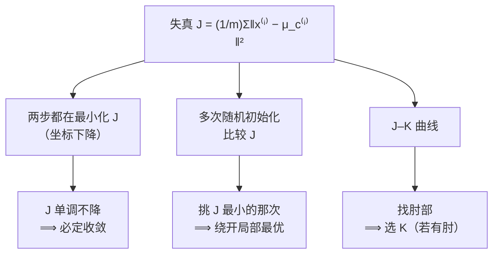

# C4.2 K-means 的优化目标、随机初始化与选 K

> [!abstract] 本讲任务
> [[C4.1 无监督学习与 K-means 算法]] 结尾留了三个问题：
>
> 1. 「Repeat 到不再变化」——**凭什么保证一定会停？**
> 2. 初始化是随机的，**换个种子结果就变，哪个才对？**
> 3. **$K$ 到底取几？**
>
> 这一讲用**同一把钥匙**依次打开这三把锁：给 K-means 写出它的代价函数 $J$（叫 **失真 distortion**）。一旦 $J$ 到手：
> - 「会不会停」变成「$J$ 会不会一直降」；
> - 「哪次随机才算数」变成「哪次的 $J$ 最小」；
> - 「$K$ 怎么选」变成「$J$ 随 $K$ 怎么变」。

---

## 1. 先把记号钉死

写 $J$ 之前，课件专门花了一页把三个记号讲清楚。这三个记号后面每一行公式都会用到，混了就全乱。

| 记号 | 课件原文 | 中文 |
|---|---|---|
| $c^{(i)}$ | index of cluster (1,2,…,$K$) to which example $x^{(i)}$ is currently assigned | **样本 $i$ 当前被分到了第几簇**，是一个 $1\sim K$ 的整数 |
| $\mu_k$ | cluster centroid $k$ ($\mu_k\in\mathbb{R}^n$) | **第 $k$ 个聚类中心的位置**，是一个 $n$ 维向量 |
| $\mu_{c^{(i)}}$ | cluster centroid of cluster to which example $x^{(i)}$ has been assigned | **样本 $i$ 所属那个簇的中心** |

第三个是新的，也是唯一容易懵的一个：它是**两层嵌套**——先用 $i$ 查出簇号 $c^{(i)}$，再用这个簇号去查中心 $\mu$。

> [!note] 课堂板书
> ![[C4.2-板书-失真函数.png]]
>
> 板书用一个具体数字把这层嵌套拆开了，写在 $\mu_{c^{(i)}}$ 那一行下面：
>
> $$x^{(i)}\to 5,\qquad c^{(i)}=5,\qquad \mu_{c^{(i)}}=\mu_5$$
>
> 意思是：假设第 $i$ 个样本被分到了**第 5 簇**，那么 $c^{(i)}$ 这个数就等于 5，于是 $\mu_{c^{(i)}}$ 就是 $\mu_5$。
>
> 另外还写了 $k\in\{1,2,\ldots,K\}$ 并在 $\mu_k$ 的下标 $k$ 上划了线，提醒 $k$ 是**簇的编号**，不是样本编号。

> [!warning] 别把 $\mu_k$ 和 $\mu_{c^{(i)}}$ 搞混
> - $\mu_k$ 的下标是**你指定的簇号**，$k$ 跑遍 $1\ldots K$，一共 $K$ 个。
> - $\mu_{c^{(i)}}$ 的下标是**查出来的簇号**，$i$ 跑遍 $1\ldots m$，一共 $m$ 个（但取值只有 $K$ 种，会重复）。
>
> 一句话：**$\mu_k$ 按簇点名，$\mu_{c^{(i)}}$ 按人点名**。

---

## 2. 失真函数 Distortion

### 2.1 先自己猜一猜

> [!question] 停一下，先自己想
> K-means 想让数据“分得好”。什么叫分得好？**每个点离自己那个中心越近越好**。
>
> 那么“整体分得好不好”这个数，你会怎么写？

自然的写法就是：把**每个点到自己中心的距离**加起来，再取平均。写成平方（理由同 [[C4.1 无监督学习与 K-means 算法]] 3.3）：

$$\boxed{\;J(c^{(1)},\ldots,c^{(m)},\mu_1,\ldots,\mu_K)=\frac{1}{m}\sum_{i=1}^{m}\left\lVert x^{(i)}-\mu_{c^{(i)}}\right\rVert^2\;}$$

优化目标就是

$$\min_{\substack{c^{(1)},\ldots,c^{(m)}\\ \mu_1,\ldots,\mu_K}} J(c^{(1)},\ldots,c^{(m)},\mu_1,\ldots,\mu_K)$$

> [!note] 课堂板书（同一页）
> 见上图。板书在这页做了四件事：
> 1. 把 $\lVert x^{(i)}-\mu_{c^{(i)}}\rVert^2$ 整项**用红框框起来**，并从右侧引箭头指向它——这是全式的核心。
> 2. 在 $\min$ 下方**手写 “Distortion”**（失真）。这个名字课件正文里**没有印**，是课堂补的，但它是这个量的标准叫法，后面 p25 的课件原文就直接用了 `cost function (distortion)`。
> 3. 在 $J(\underline{c^{(1)},\ldots,c^{(m)},\mu_1,\ldots,\mu_K})$ 的整个参数表下面划了一道长线——强调 **$J$ 同时是 $c$ 和 $\mu$ 两组变量的函数**。
> 4. 右下角画了一个小坐标系（$x_1$–$x_2$），上面标出一个点 $x^{(i)}$ 和一个 ✕ $\mu_5$，用粗红线段连起来——**红框里那一项，就是这根线段的长度的平方**。

> [!important] 三个理解要点
> 1. **$J$ 的自变量有两组**：$m$ 个整数 $c^{(i)}$，和 $K$ 个向量 $\mu_k$。这和前面所有代价函数都不同（$J(\theta)$ 只有一组参数）。
> 2. **$J$ 的几何意义**：每个点到自己中心的线段长度的平方，取平均。所以 $J$ 小 = 点都紧紧围在自己中心周围。
> 3. **名字**：**失真 distortion**。这个词来自信号压缩——你用 $\mu_{c^{(i)}}$ 去“代表” $x^{(i)}$，失去的信息就是失真。回想 [[C4.1 无监督学习与 K-means 算法]] 5.3 的 T 恤例子：用 S/M/L 三个标准身材代替每个人的真实身材，$J$ 就是“平均有多不合身”。

---

## 3. 关键洞察：两步各自在最小化什么

### 3.1 再看一眼算法

把 [[C4.1 无监督学习与 K-means 算法]] 的算法原样搬过来：

$$
\begin{aligned}
&\text{随机初始化 } \mu_1,\ldots,\mu_K\in\mathbb{R}^n\\[4pt]
&\textbf{Repeat }\{\\
&\qquad \textbf{for } i=1 \textbf{ to } m:\quad c^{(i)}:=\text{离 } x^{(i)} \text{ 最近的中心编号}\qquad\text{(分配步)}\\[4pt]
&\qquad \textbf{for } k=1 \textbf{ to } K:\quad \mu_k:=\text{簇 }k\text{ 内点的平均}\qquad\qquad\text{(移动步)}\\
&\}
\end{aligned}
$$

> [!question] 停一下，先自己想
> $J$ 有两组变量：$c$ 和 $\mu$。算法有两步。**对上号了吗？**

### 3.2 对上号了

> [!note] 课堂板书（这是全讲最重要的一页）
> ![[C4.2-板书-两步各自最小化什么.png]]
>
> 板书把两个 `for` 各自用蓝框框起来，并在旁边写明它们在干什么：
>
> **第一个 `for`（分配步）：**
> > **Cluster assignment step**
> > Minimize $J(\ldots)$ **w.r.t.** $\underline{c^{(1)},c^{(2)},\ldots,c^{(m)}}$（红框圈出）
> > (holding $\mu_1,\ldots,\mu_K$ **fixed**)
>
> **第二个 `for`（移动步）：**
> > **Move centroid**
> > minimize $J(\ldots)$ **w.r.t.** $\underline{\mu_1,\ldots,\mu_K}$（红框圈出）

这句话值得反复读：

> [!important] K-means 的本质
> **K-means 的两步，都是在最小化同一个 $J$，只是对不同的变量最小化。**
>
> - **分配步**：固定所有 $\mu$，对 $c^{(1)},\ldots,c^{(m)}$ 求 $J$ 的最小值。
> - **移动步**：固定所有 $c$，对 $\mu_1,\ldots,\mu_K$ 求 $J$ 的最小值。
>
> 这在优化里有个名字：**坐标下降 coordinate descent**（交替最小化 alternating minimization）——把变量分成几组，轮流固定其余、优化一组。（**拓展**：这个名字课件没提，但这就是 K-means 在优化理论里的归类。）

### 3.3 为什么这两步真的是最小值——各自验一遍

板书只是断言，我们验一下。

**分配步是不是最小值？** $J=\frac1m\sum_i\lVert x^{(i)}-\mu_{c^{(i)}}\rVert^2$。固定 $\mu$ 之后，这是 $m$ 项之和，而**第 $i$ 项只依赖 $c^{(i)}$，各项互不干扰**。所以整体最小 ⟺ 每一项各自最小 ⟺ 每个 $c^{(i)}$ 各自选让 $\lVert x^{(i)}-\mu_{c^{(i)}}\rVert^2$ 最小的那个簇号 —— 这正是“归给最近的中心”。✔

**移动步是不是最小值？** 固定 $c$ 之后，按簇分组：

$$J=\frac1m\sum_{k=1}^{K}\sum_{i\in S_k}\lVert x^{(i)}-\mu_k\rVert^2$$

各簇也互不干扰，所以只需对每个 $k$ 单独最小化 $\sum_{i\in S_k}\lVert x^{(i)}-\mu_k\rVert^2$。对 $\mu_k$ 求导置零：

$$\frac{\partial}{\partial\mu_k}\sum_{i\in S_k}\lVert x^{(i)}-\mu_k\rVert^2=-2\sum_{i\in S_k}(x^{(i)}-\mu_k)=0
\;\Longrightarrow\;
\mu_k=\frac{1}{|S_k|}\sum_{i\in S_k}x^{(i)}$$

**答案正是均值。**✔ 这就是算法里为什么写“average (mean)”——不是随便挑的，它就是那个最小值点。（**拓展**：这也顺带解释了 K-means 为什么用**平方**距离。若改成普通距离 $\lVert\cdot\rVert$，最小值点会变成**几何中位数**而非均值，那个没有闭式解，算法就没这么好写了。）

### 3.4 于是第一个遗留问题解决了

> [!important] 为什么 K-means 一定会停
> 每一个半步（分配、移动）都在**最小化同一个 $J$**，所以
> $$J\text{ 在整个过程中单调不增（永不上升）}$$
> 而 $J\ge0$ 有下界。**单调不增 + 有下界 ⟹ $J$ 必收敛。**
>
> 更强的一点：$(c,\mu)$ 的可能取值里，$c$ 只有有限种（$K^m$ 种），而给定 $c$ 之后 $\mu$ 被唯一确定。所以**整个算法只能走有限多种状态，必定在有限步内停下**，不会永远横跳。

![[C4-失真函数随迭代单调下降.png]]

（上图是一次真实运行：横轴是半步数，分配、移动交替；可以看到 $J$ 每一个半步都在降或持平，从不上升。）

> [!warning] 诊断用途
> 如果你自己实现 K-means，**打印每次迭代的 $J$**。一旦看到 $J$ 上升，**一定是代码写错了**（最常见的错误：移动步用了旧的归属，或者分配步用了已经更新过一半的中心）。这是 K-means 最好用的调试手段。

---

## 4. 随机初始化与局部最优

### 4.1 该怎么随机

课件 p23 给出了标准做法：

> **Should have $K<m$**
> **Randomly pick $K$ training examples.**
> **Set $\mu_1,\ldots,\mu_K$ equal to these $K$ examples.**

也就是：**不要在空间里乱撒点，而要从训练集里随机挑 $K$ 个样本，直接拿它们当初始中心。**

> [!note] 课堂板书
> ![[C4.2-板书-随机初始化.png]]
>
> 板书内容：
> - 在 $K<m$ 底下划线，旁边写 **$K=2$**（也划了线）作为示例。
> - 在 “Randomly pick $\underline{K}$ training examples” 的 $K$ 下划线。
> - 把做法写成公式：
>   $$\mu_1=x^{(i)},\qquad \mu_2=x^{(j)},\qquad \vdots$$
> - 右侧两张图上，把红 ✕ 和蓝 ✕ **画在数据点上**（而不是空白处），并用箭头指出——形象地说明“中心就落在某个样本身上”。

> [!question] 为什么必须 $K<m$
> 如果 $K=m$，每个点自成一簇，$J=0$——完美但毫无意义。如果 $K>m$，连 $K$ 个不同的样本都挑不出来。所以 $K<m$ 是硬性要求，实践中往往 $K\ll m$。

> [!tip] 为什么从数据点里挑，而不是在空间里乱撒
> 1. **保证初始中心落在数据密集的地方**，不会一上来就有某个簇是空的。
> 2. **免去量纲问题**：你不需要知道每个特征的取值范围有多大。

### 4.2 局部最优：同一份数据，三种答案

$J$ 单调下降保证了会收敛，但**收敛到的不一定是全局最小**。课件 p24 用一页图把这件事展示得很清楚。

> [!note] 课堂板书
> ![[C4.2-板书-局部最优.png]]
>
> 左上角是原始数据：肉眼看是**三团**（左下一团、上面一团、右下一团）。板书用蓝笔把这三团圈了出来，**但同时**在右下那一团上又额外套了一个红圈和一个绿圈——形象地表示“同一堆点被拆成了两个簇”。
>
> 右边三张小图是 $K=3$ 时三次不同随机初始化的**收敛结果**：
> - **右上那张**（板书用箭头指向它）：三个 ✕ 恰好落在三团的中心——这是**好结果**，$J$ 最小。
> - **下面两张**：都把本该是一团的点拆开了，同时把本该分开的两团并在一起。板书在右下那张的孤立红 ✕ 旁画了红箭头——那个中心几乎没分到什么点。
>
> 板书还在左下写出了 $J(c^{(1)},\ldots,c^{(m)},\mu_1,\ldots,\mu_K)$ ——提示：**三张图的差别，就是 $J$ 值的差别**。

> [!important] 为什么会这样
> $J$ 作为 $(c,\mu)$ 的函数**不是凸函数**（回忆 [[C2.2 梯度下降]] 里凸函数的好处：局部最小即全局最小）。坐标下降只保证走到一个**局部最小**——具体走到哪一个，完全由起点决定。
>
> 这和梯度下降在非凸 $J$ 上遇到的困境是同一件事，但 K-means 有一个梯度下降没有的便宜：**它跑一次很快**，所以我们可以**跑很多次，挑最好的**。

### 4.3 解法：跑 100 次，挑 $J$ 最小的

课件 p25 给出了标准做法：

```
For i = 1 to 100 {
    Randomly initialize K-means.
    Run K-means. Get c^(1),...,c^(m), μ_1,...,μ_K.
    Compute cost function (distortion)
        J(c^(1),...,c^(m), μ_1,...,μ_K)
}
Pick clustering that gave lowest cost J(c^(1),...,c^(m), μ_1,...,μ_K)
```

> [!important] 第二个遗留问题解决了
> **“哪次随机才算数？”——$J$ 最小的那次。**
>
> 有了 $J$，“哪个聚类结果更好”就不再是主观判断，而是一个**可以比大小的数字**。这正是为什么要先建立 $J$ 再谈初始化。

> [!tip] 跑几次合适（**拓展**，课件只给了 100）
> 经验规律：
> - **$K$ 小（2–10）时，多次初始化非常值得**——局部最优差别大，跑 50–1000 次常能明显改善。
> - **$K$ 很大（比如几百）时，收益变小**——第一次跑出来的结果通常就已经不差了，而且跑 100 次的代价也变得可观。

---

## 5. $K$ 取几

这是三个遗留问题里最后一个，也是最没有标准答案的一个。

### 5.1 先承认它确实模糊

课件 p27 只画了一张图，标题是 **What is the right value of K?**：图上两团被绿圈圈出的点。

> [!question] 停一下，先自己想
> 这张图上，$K$ 该等于 2 吗？可要是每一团内部还能再分成两小撮呢？$K=4$ 是不是也说得通？

课件没有在这页给答案——这正是它想传达的：**很多时候 $K$ 本来就不唯一**。看同一份数据，说 2 个簇的人和说 4 个簇的人都不算错。

> [!warning] 这不是算法的缺陷，是问题本身的性质
> 回忆 [[C4.1 无监督学习与 K-means 算法]] 1.2：无监督学习**没有标准答案**。既然没有 $y$，就没有一个客观的“正确的 $K$”在等着你去发现。

### 5.2 方法一：肘部法 Elbow method

把 $K=1,2,3,\ldots$ 都跑一遍，画出 $J$ 随 $K$ 的曲线。

> [!note] 课堂板书
> ![[C4.2-板书-肘部法.png]]
>
> 课件 p28 并排放了**两张曲线**，板书只在**左边那张**上做了标注：
> - 在 $K=3$ 处**画了一个圆圈**把拐点圈出来，引一条黑线到旁边，写上 **“Elbow”**（肘部）。
> - 曲线左段（$K=1\to3$）下方画了两个向右的箭头——表示这一段**掉得很快**。
> - 曲线右段末尾（$K=8$ 附近）画了一个波浪记号——表示这一段**几乎是平的**。
> - 左上角还有一个指向起点的箭头。
>
> **右边那张没有任何标注**——因为它压根找不到肘。

**左图**：$J$ 从 $K=1$ 到 $K=3$ 掉得非常快，从 $K=3$ 之后几乎不再下降。这个转折点（$K=3$）形状像手肘，所以叫**肘部**。解释是：**加到第 3 个簇之前，每加一个簇都能大幅减少失真；加到第 4 个开始就是在切分本来就完整的一团了，收益寥寥。**

**右图**：曲线从头到尾都是平滑地缓降，**根本看不出肘在哪**。$K=3$? $K=4$? $K=5$? 说不清。

> [!warning] 肘部法的真实评价
> - **$J$ 必然随 $K$ 单调下降**——$K$ 越大，每个点离自己中心越近，$K=m$ 时 $J=0$。所以**不能**直接取“$J$ 最小的 $K$”，那永远是 $K=m$。肘部法找的是**下降速度的转折**，不是最小值。
> - **肘部经常不存在**（右图就是），这时这个方法给不出答案。
> - 用肘部法时，**每个 $K$ 都要按 4.3 做多次随机初始化取最小 $J$**，否则曲线会被局部最优搅得坑坑洼洼，假肘子满地跑。

### 5.3 方法二：看下游目的（更实用）

课件 p29 给了另一条路，原文：

> Sometimes, you're running K-means to get clusters to use for some later/downstream purpose. **Evaluate K-means based on a metric for how well it performs for that later purpose.**

翻译：**聚类往往不是终点，而是某个后续工作的中间步骤。那就用后续工作的好坏来评判 $K$。**

例子仍然是 T 恤：

> [!note] 课堂板书
> ![[C4.2-板书-按下游目的选K.png]]
>
> 板书在左右两张图上方分别写出方案名，并在图内把每个椭圆标上尺码：
> - **左图**：**$K=3$ → S, M, L**（三个椭圆，从左下到右上标 S / M / L）
> - **右图**：**$K=5$ → XS, S, M, L, XL**（五个椭圆，依次标 XS / S / M / L / XL）

> [!example] 该选 3 还是 5？
> 这个问题**在数据里没有答案**，只能在生意里有答案：
>
> - **选 $K=5$**：每个人都能买到更合身的衣服 → 顾客满意度高、退货率低。但要多开两条生产线、多备两种库存 → 成本上升。
> - **选 $K=3$**：生产和库存简单、成本低。但有些人只能将就 → 可能流失顾客。
>
> **把“多卖的钱”和“多花的成本”都算出来，哪个净收益高就选哪个。** 这才是真正的判据。

> [!important] 两种方法的关系
> - **肘部法**：完全从数据出发，客观但经常失效。
> - **下游指标**：引入数据之外的信息，主观但几乎总能给出答案。
>
> 实践中：**有明确下游目的就用下游指标；没有才退回肘部法看一眼。** 很多时候 $K$ 根本不是“算”出来的，而是被现实约束（几个尺码、几个机架、调色板几色）直接定死的。

---

## 6. 停一下，我们刚才干了什么

这一讲只做了一件事：**给 K-means 补上它的代价函数 $J$**。但这一件事把三个问题一次性解决了：



顺带还得到了两个有用的副产品：

- **调试手段**：$J$ 上升 = 代码有 bug。
- **对算法的重新认识**：K-means 不是一个拍脑袋的启发式，而是坐标下降法在一个特定 $J$ 上的实例。

---

## 7. 这一讲的三句话

> [!important] 三句话
> 1. **K-means 的代价函数叫失真 distortion**：$J(c^{(1)},\ldots,c^{(m)},\mu_1,\ldots,\mu_K)=\frac1m\sum_{i=1}^m\lVert x^{(i)}-\mu_{c^{(i)}}\rVert^2$，它**同时是归属 $c$ 和中心 $\mu$ 两组变量的函数**；$\mu_{c^{(i)}}$ 要读成“先查 $i$ 属于哪簇、再取那个簇的中心”。
> 2. **分配步和移动步都在最小化同一个 $J$**——分配步固定 $\mu$ 对 $c$ 最小化，移动步固定 $c$ 对 $\mu$ 最小化（移动步取均值正是求导置零的结果）。因此 **$J$ 单调不增且有下界，K-means 必定在有限步内收敛**；若实现中 $J$ 上升，一定是 bug。
> 3. **$J$ 非凸，会陷局部最优**：标准对策是**从训练集里随机挑 $K$ 个样本当初始中心（要求 $K<m$），整个过程跑 100 次，选 $J$ 最小的那次**。**$K$ 的选择**用肘部法（找 $J$–$K$ 曲线的转折；但曲线常常没有肘）或**按下游目的评判**（T 恤 $K=3$ 的 S/M/L 还是 $K=5$ 的 XS/S/M/L/XL，看净收益）。

### 速查表

| 名称 | 内容 |
|---|---|
| 失真函数 | $J(c^{(1)},\ldots,c^{(m)},\mu_1,\ldots,\mu_K)=\dfrac1m\sum\limits_{i=1}^m\lVert x^{(i)}-\mu_{c^{(i)}}\rVert^2$ |
| 优化目标 | $\min\limits_{c^{(1)},\ldots,c^{(m)},\,\mu_1,\ldots,\mu_K}J$ |
| $\mu_{c^{(i)}}$ 读法 | 若 $c^{(i)}=5$ 则 $\mu_{c^{(i)}}=\mu_5$（两层嵌套） |
| 分配步 = | 固定 $\mu$，对 $c^{(1)},\ldots,c^{(m)}$ 最小化 $J$ |
| 移动步 = | 固定 $c$，对 $\mu_1,\ldots,\mu_K$ 最小化 $J$ |
| 移动步为何取均值 | $\frac{\partial}{\partial\mu_k}\sum_{i\in S_k}\lVert x^{(i)}-\mu_k\rVert^2=0\Rightarrow\mu_k=\frac{1}{\lvert S_k\rvert}\sum_{i\in S_k}x^{(i)}$ |
| 收敛性 | $J$ 单调不增 + $J\ge0$ + 状态有限 ⟹ 有限步收敛 |
| 调试判据 | $J$ 一旦上升 ⟹ 代码有 bug |
| 随机初始化 | 要求 $K<m$；从训练集里随机挑 $K$ 个样本，令 $\mu_1=x^{(i)},\mu_2=x^{(j)},\ldots$ |
| 避开局部最优 | 重复 100 次，取 $J$ 最小的那次聚类 |
| 何时多次初始化最值得 | $K$ 小（2–10）时收益大；$K$ 很大时收益小（**拓展**） |
| 肘部法 | 画 $J$–$K$ 曲线找转折点；**$J$ 必随 $K$ 单调下降，不能直接取最小** |
| 肘部法的局限 | 曲线常常平滑无肘；每个 $K$ 都要多次初始化否则曲线不可靠 |
| 下游指标法 | 用后续任务的表现评判 $K$；T 恤例：$K=3$（S/M/L）vs $K=5$（XS/S/M/L/XL），看成本与收益 |
| 算法归类（**拓展**） | 坐标下降 / 交替最小化 coordinate descent |

> [!abstract] 下一讲预告
> 聚类问“这些数据分成几堆”。接下来换一个问法：**“这一个新数据，正不正常？”**
>
> 想象一条飞机引擎生产线，每台下线的引擎都测两个数：发热量和振动强度。上万台正常引擎画在图上是密密一团。现在来了一台新的，落在了那团的**外面**——
>
> - 直觉上它可疑，但**“外面”要离多远才算外面？**
> - 更麻烦的是：你手里几乎**全是正常样本**，坏引擎可能一共就见过 20 台，还个个坏法不同。这时候训练一个“好/坏”分类器还靠谱吗？
>
> 第 5 章 **异常检测 Anomaly Detection** 从这里出发。它的思路和聚类不同、和分类也不同：**不去学边界，而是学出“正常长什么样”的概率分布 $p(x)$，然后看新样本的 $p(x)$ 够不够大。** 第 3 章那套概率工具，从这里开始真正派上用场。

---

上一讲：[[C4.1 无监督学习与 K-means 算法]]
下一讲：[[C5.1 异常检测的问题设定、高斯分布与参数估计]]
返回：[[机器学习课程 MOC]]
