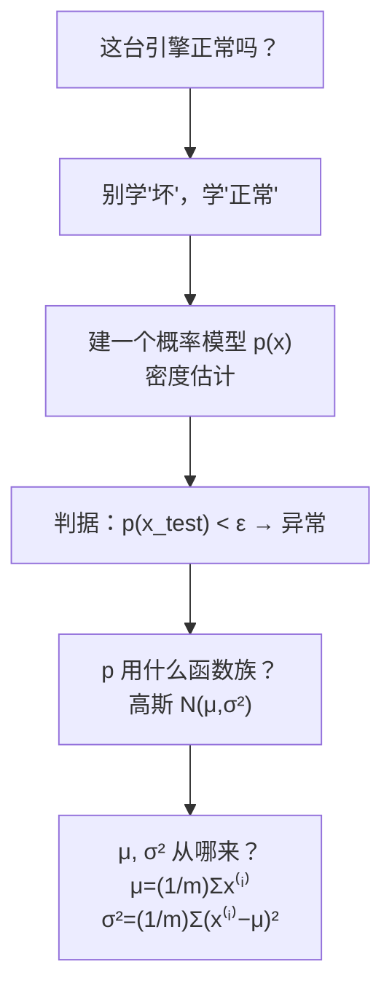

# C5.1 异常检测的问题设定、高斯分布与参数估计

> [!abstract] 本讲任务
> 一条飞机引擎生产线，每台下线的引擎都测两个数：**发热量**和**振动强度**。上万台正常引擎画在图上是密密一团。现在来了一台新的 $x_{test}$——
>
> **它正常吗？**
>
> 这一讲要做三件事：
> 1. 把「正常吗」这个含糊的问题，变成一个**可以计算的判据**；
> 2. 为此需要一个能描述“正常长什么样”的工具：**高斯分布**；
> 3. 高斯分布有两个参数 $\mu,\sigma^2$——**从数据里怎么把它们估出来**。

---

## 1. 从一台可疑的引擎说起

### 1.1 场景

课件 p2：

- **特征**：$x_1=$ heat generated（发热量），$x_2=$ vibration intensity（振动强度），还可以有更多。
- **数据集**：$\{x^{(1)},x^{(2)},\ldots,x^{(m)}\}$ ——历史上下线的 $m$ 台引擎。
- **新引擎**：$x_{test}$。

图上横轴是 $x_1$（heat）、纵轴是 $x_2$（vibration），上万台历史引擎是一片密集的红 ✕。

> [!note] 课堂板书
> ![[C5.1-板书-飞机引擎例.png]]
>
> 板书用**绿笔**在图上标了两个位置：
> - 一个 ✕ 画在**点团正中间**，引线写 **OK**；
> - 另一个 ✕ 画在**远离点团的右下角**，引线写 **anomaly**（异常）。
>
> 同时在 $x_{test}$ 底下画了两道绿线，以及在 $x_1$、$x_2$ 两行左侧各画一个蓝箭头。

> [!question] 停一下，先自己想
> 人眼一看就知道哪个 OK 哪个 anomaly。但**计算机凭什么？** 试着用一句可以写成代码的话说清楚“异常”的定义。

### 1.2 两种朴素尝试，都撞墙

**尝试一：画个框。** 规定 $x_1\in[a_1,b_1]$ 且 $x_2\in[a_2,b_2]$ 才算正常。

撞墙：框的边界怎么定？而且**框是方的、数据团是圆的**——四个角上明明没有任何历史数据，却被判为正常。

**尝试二：当二分类做。** 拿正常引擎当 $y=0$、坏引擎当 $y=1$，训一个逻辑回归（[[C2.5 逻辑回归]]）。

撞墙：**坏引擎一共才见过 20 台**，而且下一台坏引擎的坏法可能和这 20 台都不一样。用 20 个正例去学“坏引擎长什么样”，学不出来。（这个对比在 [[C5.3 异常检测 vs 监督学习与特征选择]] 会展开成一整节。）

### 1.3 换个思路：不学“坏”，学“正常”

> [!important] 异常检测的核心思路
> 别去学边界，**去学“正常”本身的概率分布**。
>
> 用历史数据拟合一个概率模型 $p(x)$——它在正常引擎扎堆的地方值很大，在没人去过的地方值很小。然后：
>
> $$p(x_{test})<\varepsilon\;\Rightarrow\;\textbf{异常}\qquad\qquad p(x_{test})\ge\varepsilon\;\Rightarrow\;\textbf{正常}$$
>
> 这件事叫 **密度估计 Density estimation**。

课件 p3 的标题就是 `Density estimation`，图上画了几圈**同心等高线**——里圈是 $p(x)$ 大的区域，外圈是 $p(x)$ 小的区域。

> [!note] 课堂板书（这页把整章的判据写出来了）
> ![[C5.1-板书-密度估计与阈值判定.png]]
>
> 板书内容：
> - 在 `Is $x_{test}$ anomalous?` 下面写 **Model $\underline{p(x)}$.** ——点明任务是“建一个 $p(x)$ 的模型”。
> - 右侧**手写出判据**：
>   $$p(x_{test})<\varepsilon\;\longrightarrow\;\text{flag anomaly}$$
>   $$p(x_{test})\ge\varepsilon\;\longrightarrow\;\text{OK}$$
> - 绿笔在图上标出两个 ✕ ：一个在最内圈的中心，引线写 **OK**；一个在所有等高线之外的右下角，引线写 **anomaly**。

> [!tip] 为什么等高线的形状比框好
> 等高线是**数据自己的形状**——数据团是斜的、椭的、歪的，等高线就跟着斜、椭、歪。而 $\varepsilon$ 是一个**在概率上统一的阈值**，不需要给每个特征单独定上下限。

### 1.4 还有哪些地方在用

课件 p4 给了三类应用：

| 应用 | $x^{(i)}$ 是什么 | 检出的“异常”是什么 |
|---|---|---|
| **欺诈检测 Fraud detection** | 用户 $i$ 的行为特征（登录频率、访问页面数、发帖数、打字速度……） | 行为模式异常的账号（盗号、机器人、刷单） |
| **制造业 Manufacturing** | 一件产品的各项测量值 | 有缺陷的产品（如飞机引擎） |
| **机房监控 Monitoring computers in a data center** | 机器 $i$ 的运行指标 | 可能出故障、被入侵或配置错误的机器 |

机房监控这个例子课件给了具体特征，后面 [[C5.3 异常检测 vs 监督学习与特征选择]] 还要回来用：

$$x_1=\text{内存占用},\quad x_2=\text{每秒磁盘访问次数},\quad x_3=\text{CPU 负载},\quad x_4=\frac{\text{CPU 负载}}{\text{网络流量}}$$

> [!note] 课堂板书
> ![[C5.1-板书-欺诈检测与机房监控.png]]
>
> 板书内容：
> - 在 Fraud detection 右侧竖着列出 $x_1,x_2,x_3,x_4$，旁边写 $p(x)$ ——强调“把一个用户的若干行为特征，喂给同一个 $p(x)$”。
> - 在 `Identify unusual users by checking which have $p(x)<\varepsilon$` 一行下划线。
> - 在机房监控的 $x_3=$ CPU load、$x_4=$ CPU load/network traffic 下面划线，并在底下再写一遍 **$p(x)<\varepsilon$** ——即**同一个判据适用于所有这些场景**。

> [!important] 注意欺诈检测的一个用法差别（**拓展**）
> 在欺诈检测里，人们经常**不是**只看“$p(x)<\varepsilon$ 就封号”，而是**把所有用户按 $p(x)$ 从小到大排序**，人工审查最可疑的前若干名。这样就不必硬定一个 $\varepsilon$。异常检测天然给出一个**连续的可疑度**，这比二值判断更有用。

---

## 2. 高斯分布

要建 $p(x)$，得先有一个能写出来的分布族。课件选了最常用的：**高斯分布**。

### 2.1 定义

课件 p6 原文：

> Say $x\in\mathbb{R}$. If $x$ is a distributed Gaussian with mean $\mu$, variance $\sigma^2$.

> [!note] 课堂板书（这一页把课件没印全的都补上了）
> ![[C5.1-板书-高斯分布的定义.png]]
>
> 板书写了四样东西：
>
> 1. **记号**：
>    $$x\sim\mathcal{N}(\mu,\sigma^2)$$
>    并在 **$\sim$** 下面用红笔标注 **“distributed as”**（服从……分布）——这个符号不是“约等于”，读作“服从”。$\mathcal{N}$ 取自 **N**ormal。板书还在 $\mu$ 和 $\sigma^2$ 上各画了一个向下的箭头指向括号内的位置。
> 2. **$\sigma$ 的名字**：右侧写 **$\sigma$ standard deviation**（标准差）。注意括号里放的是 $\sigma^2$（方差），而图上量的是 $\sigma$（标准差）。
> 3. **完整密度函数**（课件正文完全没印，整条是手写的）：
>    $$p(x;\mu,\sigma^2)=\frac{1}{\sqrt{2\pi}\,\sigma}\exp\!\left(-\frac{(x-\mu)^2}{2\sigma^2}\right)$$
> 4. **图上的标注**：$\mu$ 标在钟形曲线的正下方（红笔），$\sigma$ 用一段红色双向箭头标在**从峰顶到曲线拐点的水平距离**上；曲线右侧引出蓝箭头指向公式，并再写一遍 $p(x;\mu,\sigma^2)$。

> [!warning] 分号的含义
> $p(x;\mu,\sigma^2)$ 里用的是**分号**不是逗号。读作「**以 $\mu,\sigma^2$ 为参数、关于 $x$ 的概率密度**」——分号左边是随机变量，右边是参数。这和 [[C2.5 逻辑回归]] 里 $h_\theta(x)=P(y=1\mid x;\theta)$ 的写法是同一个约定。

### 2.2 把公式拆开看

$$p(x;\mu,\sigma^2)=\underbrace{\frac{1}{\sqrt{2\pi}\,\sigma}}_{\text{归一化常数}}\cdot\underbrace{\exp\!\left(-\frac{(x-\mu)^2}{2\sigma^2}\right)}_{\text{离 }\mu\text{ 越远越小}}$$

- **指数部分**：$(x-\mu)^2$ 是“离中心有多远”的平方；前面带负号，所以**越远，指数越负，值越小**。除以 $2\sigma^2$ 是在用 $\sigma$ 作为“远”的尺子：同样的物理距离，$\sigma$ 大的时候不算远。
- **前面的常数**：保证 $\int_{-\infty}^{\infty}p(x)\,dx=1$（概率公理，见 [[C3.1 随机变量、事件与概率公理]]）。注意分母有一个 $\sigma$：$\sigma$ 越大，峰越**矮**——因为总面积恒为 1，摊得宽了就必然矮。

> [!important] 峰高的公式
> 令 $x=\mu$，指数部分 $=e^0=1$，于是
> $$p(\mu;\mu,\sigma^2)=\frac{1}{\sqrt{2\pi}\,\sigma}\approx\frac{0.3989}{\sigma}$$
> 所以 $\sigma=1$ 时峰高 $\approx0.399$，$\sigma=0.5$ 时 $\approx0.798$（翻倍），$\sigma=2$ 时 $\approx0.199$（减半）。下一节四张图的峰高正好对上。

### 2.3 四组参数看形状

课件 p7 并排四张图：

| 参数 | 形状 | 峰高（验算） |
|---|---|---|
| $\mu=0,\ \sigma=1$ | 标准正态，中心在 0 | $0.3989$ |
| $\mu=0,\ \sigma=0.5$ | **更瘦更高**（方差小 = 数据更集中） | $0.7979$ |
| $\mu=0,\ \sigma=2$ | **更胖更矮**（方差大 = 数据更分散） | $0.1995$ |
| $\mu=3,\ \sigma=0.5$ | 形状与第二张相同，**整体右移到 3** | $0.7979$ |

> [!note] 课堂板书
> ![[C5.1-板书-高斯分布四组参数.png]]
>
> 板书内容：
> - 在 $\mu=0,\sigma=0.5$ 这一格的 $0.5$ 下面划线，并在右边写 **$\sigma^2=0.25$** ——提醒**参数表里写的是 $\sigma$，公式里用的是 $\sigma^2$，要自己平方一下**。
> - 每张图上用蓝色双向箭头标出 $\sigma$ 的宽度，用向上的箭头标出 $\mu$ 的位置。
> - 第四张图（$\mu=3$）底下用箭头标出 **3** 的位置。

> [!important] 一句话记住两个参数
> **$\mu$ 决定钟摆在哪（左右平移），$\sigma$ 决定钟有多胖（宽窄），而高度被“总面积 = 1”锁死，胖了必然矮。**

---

## 3. 参数估计：从数据里把 $\mu,\sigma^2$ 找出来

### 3.1 问题

课件 p8 的设定：

> Dataset: $\{x^{(1)},x^{(2)},\ldots,x^{(m)}\}$，$x^{(i)}\in\mathbb{R}$

图上是一条数轴，上面散布着一堆红 ✕（数据点），上方罩着一条钟形曲线。

> [!question] 停一下，先自己想
> 给你这一排点，你要画一条最贴合它们的钟形曲线。**峰该放在哪？该画多胖？**

直觉答案：峰放在这堆点的**平均位置**，胖瘦按它们的**离散程度**。写出来就是：

$$\mu=\frac{1}{m}\sum_{i=1}^{m}x^{(i)},\qquad \sigma^2=\frac{1}{m}\sum_{i=1}^{m}\left(x^{(i)}-\mu\right)^2$$

这个直觉是对的——它正是**最大似然估计 MLE** 的结果（见下面 3.3）。

> [!note] 课堂板书
> ![[C5.1-板书-参数估计与m还是m减1.png]]
>
> 板书内容（这一页板书量很大）：
> - 右上角写 **$x^{(i)}\sim\mathcal{N}(\mu,\sigma^2)$** ——点明前提假设：**我们假设每个数据点都是从同一个高斯分布里独立抽出来的**。$\mu$ 和 $\sigma^2$ 下各标了红箭头（这两个就是待估的量）。
> - 在 `Dataset:` 右边补写 **$x^{(i)}\in\mathbb{R}$** 并划线（本页只讲一维）。
> - 左下角红笔写出 $\mu=\frac1m\sum_{i=1}^m x^{(i)}$。
> - 右下角红笔写出 $\sigma^2=\frac1m\sum_{i=1}^m(x^{(i)}-\mu)^2$。
> - **关键**：把 $\sigma^2$ 式子里的 **$\frac1m$ 用粉笔圈了出来**，并在旁边写 **$m-1$** 和 **$\frac{1}{m-1}$**，还画了一个箭头指过来。
> - 图上把 $\mu$ 标在数据点的中间偏左处，$\sigma$ 用双向箭头标在曲线上，并把中间密集的几个 ✕ 用粉圈圈出。

### 3.2 $\frac1m$ 还是 $\frac{1}{m-1}$

板书特地把这件事拎出来，因为这是一个经典的坑。

> [!important] 两个版本都对，用途不同
> - $\hat\sigma^2_{\text{MLE}}=\dfrac1m\sum(x^{(i)}-\mu)^2$ ——**最大似然估计**。它是**有偏的**：平均而言会**略微低估**真实方差。
> - $s^2=\dfrac{1}{m-1}\sum(x^{(i)}-\mu)^2$ ——**无偏估计**（统计学教材里的“样本方差”）。
>
> **为什么会低估？** 因为 $\mu$ 本身是从同一批数据算出来的。数据点围着“自己算出来的平均”总是比围着“真实的平均”更紧一些，于是平方偏差偏小。除以 $m-1$ 正是对这一点的修正（损失了一个自由度）。
>
> **机器学习里用哪个？** 课件正文写的是 $\frac1m$。实际上 **$m$ 通常很大（成千上万），$\frac1m$ 和 $\frac{1}{m-1}$ 的差别可以忽略**。考试按课件写 $\frac1m$；知道 $\frac{1}{m-1}$ 的来历即可。

### 3.3 为什么均值和方差就是最大似然解（**拓展**）

课件没推，但这个推导很短，而且下一章参数估计会正式讲，这里先看一眼。

**似然**：假设各点独立同分布，

$$L(\mu,\sigma^2)=\prod_{i=1}^{m}p(x^{(i)};\mu,\sigma^2)=\prod_{i=1}^m\frac{1}{\sqrt{2\pi}\sigma}\exp\!\left(-\frac{(x^{(i)}-\mu)^2}{2\sigma^2}\right)$$

**取对数**（乘积变求和，见 [[C2.5 逻辑回归]] 里同样的手法）：

$$\ell(\mu,\sigma^2)=-\frac{m}{2}\log(2\pi)-m\log\sigma-\frac{1}{2\sigma^2}\sum_{i=1}^m(x^{(i)}-\mu)^2$$

**对 $\mu$ 求导置零**：

$$\frac{\partial\ell}{\partial\mu}=\frac{1}{\sigma^2}\sum_{i=1}^m(x^{(i)}-\mu)=0\;\Longrightarrow\;\mu=\frac1m\sum_{i=1}^m x^{(i)}$$

**对 $\sigma$ 求导置零**：

$$\frac{\partial\ell}{\partial\sigma}=-\frac{m}{\sigma}+\frac{1}{\sigma^3}\sum_{i=1}^m(x^{(i)}-\mu)^2=0\;\Longrightarrow\;\sigma^2=\frac1m\sum_{i=1}^m(x^{(i)}-\mu)^2$$

**两个直觉公式，就是这么来的。** 注意这里也看出了 $\frac1m$ 的来历——MLE 自然给出的就是 $\frac1m$。

### 3.4 手算一遍

**数据**：$\{1,2,3,4,5\}$，$m=5$。

$$\mu=\frac{1+2+3+4+5}{5}=3$$

$$\sigma^2=\frac{(1-3)^2+(2-3)^2+(3-3)^2+(4-3)^2+(5-3)^2}{5}=\frac{4+1+0+1+4}{5}=\frac{10}{5}=2$$

$$\sigma=\sqrt2\approx1.4142$$

（顺带：无偏版本 $s^2=\frac{10}{4}=2.5$ ——确实比 $2$ 大，印证了“$\frac1m$ 会低估”。）

**用它算几个点的密度**（$p(x)=\frac{1}{\sqrt{2\pi\cdot2}}e^{-(x-3)^2/4}$）：

| $x$ | $p(x)$ |
|---|---|
| $3$（正中） | $0.2821$ |
| $4$ | $0.2197$ |
| $5$ | $0.1038$ |
| $6$ | $0.0297$ |
| $7$ | $0.0052$ |

> [!example] 阈值怎么起作用
> 如果取 $\varepsilon=0.02$：$x=6$ 的 $p=0.0297\ge\varepsilon$ → **正常**；$x=7$ 的 $p=0.0052<\varepsilon$ → **异常**。
>
> 注意 $p(x)$ 掉得有多快——从 $x=5$ 到 $x=7$，只走了两格，密度掉到了 $\frac{1}{20}$。高斯分布的尾巴衰减是 $e^{-(x-\mu)^2}$ 量级的，**平方在指数上**，所以“稍微远一点”就变成“极其不可能”。这正是它适合做异常检测的原因。

---

## 4. 停一下，我们刚才干了什么

我们把一个模糊的工程问题，一路化成了可计算的东西：

但还差一大截：

> [!warning] 遗留问题
> 1. 上面讲的高斯分布是**一维**的（$x\in\mathbb{R}$）。可飞机引擎有**两个**特征，机房监控有**四个**。**多维怎么办？**
> 2. $\varepsilon$ 一直没说怎么定。
> 3. 怎么知道自己做得好不好？异常检测本来就没有多少标签可用。
>
> 下一讲全部处理。

---

## 5. 这一讲的三句话

> [!important] 三句话
> 1. **异常检测不学“异常”，学“正常”**：用历史数据拟合概率模型 $p(x)$（**密度估计**），判据是 **$p(x_{test})<\varepsilon$ ⟹ 标记为异常，$p(x_{test})\ge\varepsilon$ ⟹ 正常**。适用于欺诈检测、制造业质检、机房监控——它们的共同点是**正常样本极多、异常样本极少且花样繁多**。
> 2. **高斯分布 $x\sim\mathcal{N}(\mu,\sigma^2)$**（$\sim$ 读作“服从”）的密度是 $p(x;\mu,\sigma^2)=\frac{1}{\sqrt{2\pi}\sigma}\exp\left(-\frac{(x-\mu)^2}{2\sigma^2}\right)$：$\mu$ 决定左右位置，$\sigma$（**标准差**，注意参数表里常写 $\sigma$、公式里要用 $\sigma^2$）决定宽窄，峰高 $=\frac{1}{\sqrt{2\pi}\sigma}$ 被“总面积 = 1”锁死。
> 3. **参数估计就是取均值和方差**：$\mu=\frac1m\sum_i x^{(i)}$，$\sigma^2=\frac1m\sum_i(x^{(i)}-\mu)^2$——这正是最大似然估计的解。除以 $m$ 是**有偏**的（略微低估），除以 $m-1$ 才**无偏**；$m$ 大时二者无差别，课件与考试用 $\frac1m$。

### 速查表

| 名称 | 公式 / 内容 |
|---|---|
| 异常检测判据 | $p(x_{test})<\varepsilon\Rightarrow$ 异常；$p(x_{test})\ge\varepsilon\Rightarrow$ 正常 |
| 任务名 | 密度估计 Density estimation |
| 高斯记号 | $x\sim\mathcal{N}(\mu,\sigma^2)$，$\sim$ = “distributed as”（服从） |
| 高斯密度 | $p(x;\mu,\sigma^2)=\dfrac{1}{\sqrt{2\pi}\,\sigma}\exp\left(-\dfrac{(x-\mu)^2}{2\sigma^2}\right)$ |
| 峰高 | $p(\mu)=\dfrac{1}{\sqrt{2\pi}\sigma}\approx\dfrac{0.3989}{\sigma}$ |
| 形状口诀 | $\mu$ 管平移，$\sigma$ 管胖瘦；胖了必然矮（面积恒为 1） |
| 参数估计 $\mu$ | $\mu=\dfrac1m\sum\limits_{i=1}^m x^{(i)}$ |
| 参数估计 $\sigma^2$ | $\sigma^2=\dfrac1m\sum\limits_{i=1}^m(x^{(i)}-\mu)^2$ |
| $\frac1m$ vs $\frac{1}{m-1}$ | $\frac1m$ = MLE，有偏（低估）；$\frac{1}{m-1}$ = 无偏。$m$ 大时无差别，课件用 $\frac1m$ |
| 四组参数峰高（课件 p7） | $\sigma=1\to0.3989$；$\sigma=0.5\to0.7979$；$\sigma=2\to0.1995$ |
| 手算例 | $\{1,2,3,4,5\}$：$\mu=3$，$\sigma^2=2$，$\sigma\approx1.4142$；$p(3)=0.2821$、$p(5)=0.1038$、$p(7)=0.0052$ |
| 应用场景 | 欺诈检测、制造业（飞机引擎）、机房监控 |
| 机房监控特征 | $x_1$ 内存、$x_2$ 磁盘访问/秒、$x_3$ CPU 负载、$x_4$ CPU 负载/网络流量 |

> [!abstract] 下一讲预告
> 手上现在只有**一维**的高斯。可引擎有两个特征、机房有四个。
>
> 下一讲第一步就是把它推广到 $n$ 维——用的办法**朴素得有点过分**：假设各个特征**互相独立**，把 $n$ 个一维高斯**直接连乘**起来：
> $$p(x)=\prod_{j=1}^{n}p(x_j;\mu_j,\sigma_j^2)$$
> 然后我们会得到一个完整的三步算法，并用一个数值例子（$\varepsilon=0.02$，两台测试引擎的 $p$ 分别是 $0.0426$ 和 $0.0021$）走完全程。
>
> 之后是更棘手的部分：**这套东西做得好不好，怎么量化？** 异常检测的训练集里全是正常样本，根本没有 $y$ 可比对。课件给出的办法是**借一点标签**——把仅有的那几十个异常样本全部放进交叉验证集和测试集，用 $F_1$ 分数评估，并顺便把 $\varepsilon$ 也一起选出来。

---

上一讲：[[C4.2 K-means 的优化目标、随机初始化与选 K]]
下一讲：[[C5.2 异常检测算法与系统评估]]
返回：[[机器学习课程 MOC]]
