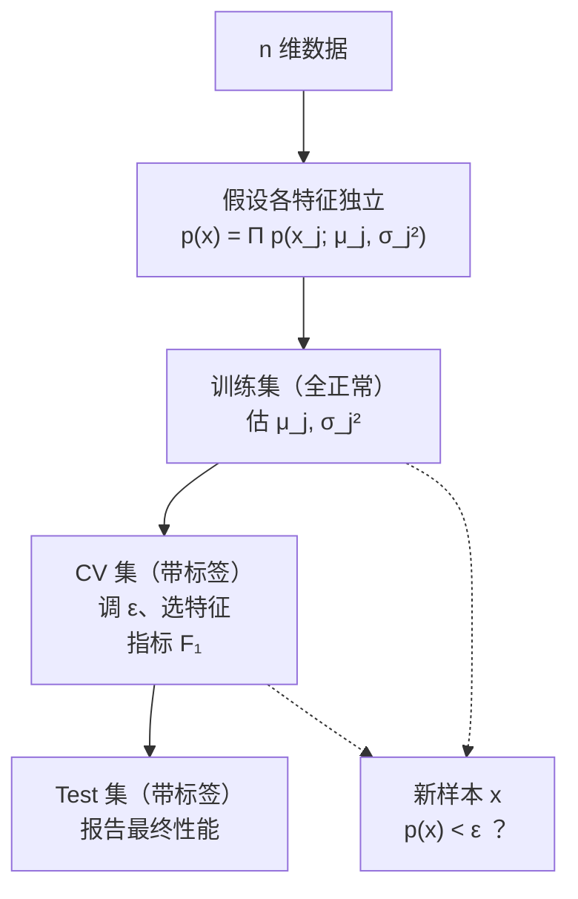

# C5.2 异常检测算法与系统评估

> [!abstract] 本讲任务
> [[C5.1 异常检测的问题设定、高斯分布与参数估计]] 留下三个问题：
>
> 1. 高斯分布只讲了**一维**，可引擎有 2 个特征、机房有 4 个。**多维怎么办？**
> 2. **$\varepsilon$ 怎么定？**
> 3. **怎么知道自己做得好不好？** ——训练集里全是正常样本，根本没有 $y$ 可比对。
>
> 这一讲按顺序解决：先用一个**朴素得有点过分**的假设把高斯推广到 $n$ 维，写出完整的三步算法并跑一个数值例；然后建立一整套评估流程——三集划分、$F_1$ 分数、用交叉验证集顺便把 $\varepsilon$ 选出来。

---

## 1. 从一维到 $n$ 维

### 1.1 问题

课件 p10：

> Training set: $\{x^{(1)},\ldots,x^{(m)}\}$
> Each example is $x\in\mathbb{R}^n$

现在每个样本是一个 $n$ 维向量，比如一台机器的 $(\text{内存},\text{磁盘},\text{CPU},\text{网络})$。我们要的是一个**联合密度** $p(x)=p(x_1,x_2,\ldots,x_n)$。

> [!question] 停一下，先自己想
> 回忆 [[C3.3 联合分布与推断]]：$n$ 个变量的联合分布，一般情况下需要指数多的参数。那时的出路是什么？

出路是**独立性假设**。这里也一样。

### 1.2 朴素但管用的办法：连乘

假设 $n$ 个特征**互相独立**，各自服从自己的一维高斯：

$$x_1\sim\mathcal{N}(\mu_1,\sigma_1^2),\quad x_2\sim\mathcal{N}(\mu_2,\sigma_2^2),\quad\ldots,\quad x_n\sim\mathcal{N}(\mu_n,\sigma_n^2)$$

由独立性（[[C3.3 联合分布与推断]] 3.1：$P(A\wedge B)=P(A)P(B)$），联合密度就是**连乘**：

$$\boxed{\;p(x)=p(x_1;\mu_1,\sigma_1^2)\cdot p(x_2;\mu_2,\sigma_2^2)\cdots p(x_n;\mu_n,\sigma_n^2)=\prod_{j=1}^{n}p(x_j;\mu_j,\sigma_j^2)\;}$$

> [!note] 课堂板书（这一页几乎整页是手写的）
> ![[C5.2-板书-密度估计的连乘.png]]
>
> 板书内容：
> - 右上角逐行写出三个特征的分布假设：
>   $$x_1\sim\mathcal{N}(\mu_1,\sigma_1^2),\qquad x_2\sim\mathcal{N}(\mu_2,\sigma_2^2),\qquad x_3\sim\mathcal{N}(\mu_3,\sigma_3^2)$$
> - 中间用粉框框住**展开形式**：
>   $$p(x)=p(x_1;\mu_1,\sigma_1^2)\,p(x_2;\mu_2,\sigma_2^2)\,p(x_3;\mu_3,\sigma_3^2)\cdots p(x_n;\mu_n,\sigma_n^2)$$
> - 下面写出**紧凑形式**，并把 $\prod$ 符号框了起来：
>   $$=\prod_{j=1}^{n}p(x_j;\mu_j,\sigma_j^2)$$
> - **右下角专门解释了 $\Sigma$ 和 $\Pi$ 的区别**（因为这是课上第一次用连乘号）：
>   $$\sum_{i=1}^{n}i=1+2+3+\cdots+n,\qquad\qquad \prod_{i=1}^{n}i=1\times2\times3\times\cdots\times n$$
>   —— **$\Sigma$ 是连加，$\Pi$ 是连乘**。$\Pi$ 是希腊字母 Pi 的大写，取自 **P**roduct。

> [!warning] 这个独立性假设站得住吗
> **基本上站不住。** CPU 负载高的机器，网络流量多半也高；引擎发热多，振动往往也大。特征之间几乎总有相关性。
>
> **但它照样管用。** 理由有二：
> 1. 参数量从 $O(n^2)$ 降到 $O(n)$ ——每个特征只需两个数 $\mu_j,\sigma_j^2$，一共 $2n$ 个。$n$ 上万也扛得住。
> 2. 就算相关性被忽略，**极端值仍然会被抓住**：某个 $x_j$ 离 $\mu_j$ 很远，它那一项的 $p$ 就极小，连乘之后整体的 $p(x)$ 照样塌下去。
>
> 这类“明知独立性不成立、仍然假设独立”的模型有个统称：**朴素 naive**（例如朴素贝叶斯）。代价是**抓不住“每项单看都正常、组合起来却诡异”的异常**——这个缺口正是 [[C5.4 多元高斯分布与它的异常检测]] 要补的。

---

## 2. 完整算法

课件 p11 把算法写成三步：

> [!note] 课堂板书
> ![[C5.2-板书-异常检测算法三步.png]]
>
> 板书在这页做了三件事：
> - 用蓝框把 $\mu_j$ 和 $\sigma_j^2$ 两个公式框在一起（“这两个是一组，一起算”）。
> - 右侧把 $\mu$ 写成**向量形式**：
>   $$\mu_1,\mu_2,\ldots,\mu_n\;\Longrightarrow\;\mu=\begin{bmatrix}\mu_1\\\mu_2\\\vdots\\\mu_n\end{bmatrix}=\frac1m\sum_{i=1}^{m}x^{(i)}$$
>   —— 即 **$n$ 个 $\mu_j$ 可以一次算完：直接对所有样本向量求平均**，第 $j$ 个分量自动就是 $\mu_j$。这在写代码时很重要（一行向量化代码搞定）。
> - 在 $p(x_j;\mu_j,\sigma_j^2)$ 下方用粉笔把 $\mu_j$、$\sigma_j^2$ 逐个标出箭头，并在第 3 步的连乘式下划线。
> - 第 1 步右侧补写 $\{x^{(1)},\ldots,x^{(m)}\}$。

### 算法

**第 1 步：选特征。** 选那些**你认为异常发生时会取到异常大或异常小的值**的特征 $x_j$。（怎么选是 [[C5.3 异常检测 vs 监督学习与特征选择]] 的话题。）

**第 2 步：拟合参数。** 对每个 $j=1,\ldots,n$：

$$\mu_j=\frac1m\sum_{i=1}^{m}x_j^{(i)},\qquad \sigma_j^2=\frac1m\sum_{i=1}^{m}\left(x_j^{(i)}-\mu_j\right)^2$$

向量形式：$\mu=\frac1m\sum_{i=1}^m x^{(i)}$。

**第 3 步：判定新样本。** 给定新的 $x$，算

$$p(x)=\prod_{j=1}^{n}p(x_j;\mu_j,\sigma_j^2)=\prod_{j=1}^{n}\frac{1}{\sqrt{2\pi}\,\sigma_j}\exp\!\left(-\frac{(x_j-\mu_j)^2}{2\sigma_j^2}\right)$$

$$\textbf{Anomaly if } p(x)<\varepsilon$$

> [!warning] 上下标别搞混
> - $x_j^{(i)}$：**第 $i$ 个样本的第 $j$ 个特征**。上标括号里是样本号（$1\ldots m$），下标是特征号（$1\ldots n$）。
> - $\mu_j$ 对 $i$ 求和（跑遍所有样本），对 $j$ **不**求和（每个特征一个 $\mu$）。

---

## 3. 数值例：两台测试引擎

课件 p12 给了一个完整的数值例，把整个算法走了一遍。

> [!note] 课堂板书（几乎全页手写）
> ![[C5.2-板书-数值例.png]]
>
> 板书内容：
> - **中间用蓝框框出拟合好的参数**：
>   $$\mu_1=5,\;\underline{\sigma_1=2},\qquad \mu_2=3,\;\underline{\sigma_2=1}$$
>   并在框外补写 $\sigma_1^2,\sigma_2^2$ 并标注 **$=4$** ——再次提醒**图上写的是 $\sigma$，公式里要用 $\sigma^2$**（$\sigma_1=2\Rightarrow\sigma_1^2=4$）。
> - 右上角写出模型形式：$p(x)=p(x_1;\mu_1,\sigma_1^2)\times p(x_2;\mu_2,\sigma_2^2)$，并用上下箭头把它和右边两张一维密度曲线（$p(x_1;\mu_1,\sigma_1^2)$ 与 $p(x_2;\mu_2,\sigma_2^2)$）连起来。
> - **写出阈值与两个结果**：
>   $$\varepsilon=0.02$$
>   $$p(x_{test}^{(1)})=0.0426\;\ge\;\varepsilon$$
>   $$p(x_{test}^{(2)})=0.0021\;<\;\varepsilon$$
> - 左上图用绿笔标出 $x_{test}^{(1)}$（在点团内）和 $x_{test}^{(2)}$（在点团外、被单独圈出），粉笔画出等高线；左下的 3D 曲面图标注 $p(x)$。

### 自己验算一遍

**模型**：$\mu_1=5,\sigma_1^2=4$；$\mu_2=3,\sigma_2^2=1$。于是

$$p(x)=\frac{1}{\sqrt{2\pi}\cdot2}e^{-\frac{(x_1-5)^2}{8}}\cdot\frac{1}{\sqrt{2\pi}\cdot1}e^{-\frac{(x_2-3)^2}{2}}$$

**峰值**（$x=(5,3)$）：$0.19947\times0.39894=0.07958$。这是 $p(x)$ 能取到的最大值。

**第一台测试引擎** $x_{test}^{(1)}=(6,4)$：

$$p(6;5,4)=0.19947\cdot e^{-1/8}=0.19947\times0.88250=0.17604$$
$$p(4;3,1)=0.39894\cdot e^{-1/2}=0.39894\times0.60653=0.24197$$
$$p(x_{test}^{(1)})=0.17604\times0.24197=\mathbf{0.04260}\;\ge\;0.02\;\Rightarrow\;\textbf{正常}$$

**第二台测试引擎** $x_{test}^{(2)}=(7,0.5)$：

$$p(7;5,4)=0.19947\cdot e^{-4/8}=0.19947\times0.60653=0.12098$$
$$p(0.5;3,1)=0.39894\cdot e^{-6.25/2}=0.39894\times0.043937=0.017527$$
$$p(x_{test}^{(2)})=0.12098\times0.017527=\mathbf{0.002121}\;<\;0.02\;\Rightarrow\;\textbf{异常}$$

两个结果与课件板书上的 $0.0426$ 和 $0.0021$ 完全吻合。

> [!important] 从这个例子看出三件事
> 1. **第二台引擎在两个维度上都不算特别离谱**（$x_1=7$ 只离 $\mu_1$ 一个 $\sigma$，$x_2=0.5$ 离 $\mu_2$ 两个半 $\sigma$），但**连乘之后 $p$ 塌了 20 倍**。这就是连乘的威力：多个维度上的“有点不对”会**相乘放大**。
> 2. **$p(x)$ 是个很小的数**，$n$ 越大越小（$n$ 个小于 1 的数相乘）。所以 $\varepsilon$ 不能凭感觉拍，必须**按数据量级选**——见下面第 5 节。
> 3. **$\varepsilon=0.02$ 落在 $0.0021$ 和 $0.0426$ 之间**，恰好把这两台分开。换个 $\varepsilon$ 结论就变。这说明 $\varepsilon$ 是个**必须认真调的超参数**。

> [!warning] 工程实践：改用对数（**拓展**）
> $n$ 大时连乘会**下溢**（$n=100$ 时 $p(x)$ 可能是 $10^{-200}$ 量级，浮点数直接变成 0）。实践中一律改算
> $$\log p(x)=\sum_{j=1}^{n}\log p(x_j;\mu_j,\sigma_j^2)=\sum_{j=1}^n\left[-\log(\sqrt{2\pi}\sigma_j)-\frac{(x_j-\mu_j)^2}{2\sigma_j^2}\right]$$
> 判据相应变成 $\log p(x)<\log\varepsilon$。$\log$ 单调，判断结果完全一致。这和 [[C2.5 逻辑回归]] 里把似然取对数是同一个手法。

---

## 4. 怎么知道做得好不好

算法有了，但下一个问题更棘手。

### 4.1 为什么必须有一个“数”

课件 p14 标题：**The importance of real-number evaluation**（单一实数评估的重要性）。原文：

> When developing a learning algorithm (choosing features, etc.), making decisions is much easier if we have a way of evaluating our learning algorithm.

> [!question] 停一下，先自己想
> 你在做机房异常检测，想知道“要不要加一个新特征 $x_5=\frac{\text{CPU负载}}{\text{网络流量}}$”。
>
> **加之前和加之后，你拿什么比？**

如果没有一个**数**，你只能凭感觉——“好像抓到的异常多了点？”。有了一个数，决策就变成比大小，几秒钟搞定。这在 [[C1.4 过拟合与剪枝]] 讨论剪枝时是同一个道理。

### 4.2 借一点标签

> [!important] 关键妥协
> 异常检测本质上是**无监督**的——训练时不用 $y$。但**为了评估，我们假设手上有少量带标签的数据**：
> $$y=0\;\text{表示正常（normal）},\qquad y=1\;\text{表示异常（anomalous）}$$
>
> 注意这不矛盾：**训练时不用标签，评估时才用。**

课件给出的三集划分：

| 集合 | 内容 | 用途 |
|---|---|---|
| **训练集 Training set** | $x^{(1)},x^{(2)},\ldots,x^{(m)}$ ——**假设全是正常样本**（assume normal examples / not anomalous） | 拟合 $\mu_j,\sigma_j^2$，得到 $p(x)$ |
| **交叉验证集 CV set** | $(x_{cv}^{(1)},y_{cv}^{(1)}),\ldots,(x_{cv}^{(m_{cv})},y_{cv}^{(m_{cv})})$ ——**正常 + 少量异常，带标签** | 选 $\varepsilon$、选特征 |
| **测试集 Test set** | $(x_{test}^{(1)},y_{test}^{(1)}),\ldots$ ——**正常 + 少量异常，带标签** | 最终报告性能 |

> [!note] 课堂板书
> ![[C5.2-板书-三集划分.png]]
>
> 板书在 `non-anomalous`、训练集的 $x^{(1)},\ldots,x^{(m)}$、以及测试集那一行下面各画了下划线，并在测试集下方写 **$y=1$** ——强调**测试集里必须含有 $y=1$ 的异常样本**，否则没法算召回率。三行（Training / CV / Test）左侧各有一个箭头。

> [!tip] 训练集里混进几个异常怎么办
> 课件说的是“assume”全是正常。实践中不可能保证。**好消息是：只要异常占比极低（比如 0.1%），对 $\mu_j,\sigma_j^2$ 的影响很小，算法照样能用。** 这也是异常检测比监督学习省事的地方之一。

### 4.3 具体怎么分：飞机引擎的例子

课件 p15 给了一个**具体到数字**的划分方案。

**原始数据**：10000 台正常引擎（$y=0$），20 台有缺陷的引擎（$y=1$）。

**推荐方案**：

| 集合 | 正常 | 异常 |
|---|---|---|
| Training set | 6000 | 0 |
| CV | 2000（$y=0$） | 10（$y=1$） |
| Test | 2000（$y=0$） | 10（$y=1$） |

**另一种方案（Alternative）**：

| 集合 | 正常 | 异常 |
|---|---|---|
| Training set | 6000 | 0 |
| CV | 4000（$y=0$） | 10（$y=1$） |
| Test | 4000（$y=0$） | 10（$y=1$） |

> [!note] 课堂板书
> ![[C5.2-板书-飞机引擎数据怎么分.png]]
>
> 板书内容：
> - **10000** 和 **20** 用粉/红框各自框出，并在 **20** 右边写 **2-50** ——即**实践中异常样本数通常就在 2 到 50 这个量级**。这个数字课件正文没有，是课堂补充的经验值，值得记。
> - 右上角写 **$y=1$**。
> - Training set 一行旁边写 **$(y=0)$**，上方用粉笔写出它要估的东西：$\mu_1,\sigma_1^2,\ldots,\mu_n,\sigma_n^2$。
> - 更右边写出模型：$p(x)=p(x_1;\mu_1,\sigma_1^2)\cdots p(x_n;\mu_n,\sigma_n^2)$。
> - 所有的 6000 / 2000 / 4000 用粉框框出，所有的 **10** 用红框框出；CV 与 Test 两行用大括号括在一起。

> [!warning] 第二种方案的隐患
> `Alternative` 把同样的 4000 个正常样本既放进 CV 又放进 Test（$6000+4000+4000=14000>10000$，说明**有重复使用**）。
>
> 这样做的好处是每个集合样本更多、估计更稳；坏处是 **CV 和 Test 不再独立，测试集上报出来的性能会偏乐观**。课件并列给出两种方案而未表态；**首选第一种**。

> [!important] 为什么异常样本要分给 CV 和 Test，而不是训练集
> 训练的任务是**估计“正常”的分布**。混进异常样本只会把 $\mu,\sigma^2$ 带偏。异常样本的价值在于**当考卷用**——检验模型有没有把它们的 $p$ 算得足够小。

---

## 5. 评估指标与选 $\varepsilon$

### 5.1 预测规则

课件 p16：拿训练集拟合出 $p(x)$ 后，对 CV 或 Test 里的样本 $x$ 预测

$$y=\begin{cases}1 & \text{if } p(x)<\varepsilon\quad(\text{anomaly})\\[4pt] 0 & \text{if } p(x)\ge\varepsilon\quad(\text{normal})\end{cases}$$

> [!note] 课堂板书
> ![[C5.2-板书-算法评估与选阈值.png]]
>
> 板书内容：
> - **$\varepsilon$ 被红圈反复圈出**（在预测规则里两次、在最后一行一次）——这一页的主角就是 $\varepsilon$。
> - 右上角写 $(x_{test}^{(i)},y_{test}^{(i)})$ 并画箭头指向“cross validation/test example”。
> - 在 `0 if p(x) ≥ ε (normal)` 右边写 **$y=0$**。
> - 在 **$F_1$-score** 右边画红箭头（重点），并在旁边写 **CV / Test set.** ——即**这些指标是在 CV / 测试集上算的**。
> - 最后一行 `Can also use cross validation set to choose parameter ε` 里的 $\varepsilon$ 被圈出并加箭头。

### 5.2 为什么不能用准确率

> [!question] 停一下，先自己想
> CV 集里 2000 个正常 + 10 个异常。如果我写一个算法，**对所有样本一律预测“正常”**，准确率是多少？

$$\frac{2000}{2010}=99.50\%$$

**一个什么都不做的算法拿到 99.5% 的准确率。** 而真正有用的算法很可能准确率更低（因为它会误报一些正常样本）。

> [!important] 偏斜类 Skewed Classes
> 当正负样本比例极端失衡（这里是 200:1）时，**准确率完全失效**。异常检测天生就是极端偏斜的——这正是必须换指标的原因。

### 5.3 四格表与三个指标

课件列出的可选指标：

> - True positive, false positive, false negative, true negative
> - Precision/Recall
> - $F_1$-score

**四格表**（以 $y=1$ = 异常为“正类”）：

|  | 实际异常 $y=1$ | 实际正常 $y=0$ |
|---|---|---|
| **预测异常** | **TP** 真正例 | **FP** 假正例（误报） |
| **预测正常** | **FN** 假负例（漏报） | **TN** 真负例 |

**精确率 Precision**：我报出来的异常里，有多少是真的？

$$P=\frac{TP}{TP+FP}$$

**召回率 Recall**：真正的异常里，有多少被我抓到了？

$$R=\frac{TP}{TP+FN}$$

**$F_1$ 分数**：两者的调和平均。

$$F_1=\frac{2PR}{P+R}$$

> [!tip] 为什么 $F_1$ 用调和平均而不是算术平均
> 因为 **$P$ 和 $R$ 可以互相作弊**：
> - 把 $\varepsilon$ 调到极大 → 什么都报异常 → $R=1$，但 $P$ 极低。
> - 把 $\varepsilon$ 调到极小 → 只报最离谱的那一个 → $P$ 可能 $=1$，但 $R$ 极低。
>
> 算术平均 $\frac{P+R}{2}$ 对这两种作弊是纵容的（$P=1,R=0.01$ 得 $0.505$，看着还行）。**调和平均则会被小的那个拖死**（$F_1=\frac{2\times1\times0.01}{1.01}=0.0198$）。**只有 $P$ 和 $R$ 都高，$F_1$ 才高。**

### 5.4 手算一遍

CV 集：2000 个正常，10 个异常。某个 $\varepsilon$ 下的结果：

- 10 个异常里抓到 8 个 → $TP=8$，$FN=2$
- 2000 个正常里误报 40 个 → $FP=40$，$TN=1960$

$$P=\frac{8}{8+40}=\frac{8}{48}=0.1667$$
$$R=\frac{8}{8+2}=\frac{8}{10}=0.80$$
$$F_1=\frac{2\times0.1667\times0.80}{0.1667+0.80}=\frac{0.26667}{0.96667}=0.2759$$

作为对照，这个算法的**准确率**是 $\frac{8+1960}{2010}=97.91\%$ ——**比“全报正常”的 99.50% 还低**。

> [!important] 这组数字说明的事
> 准确率 97.91% 和 $F_1=0.276$ 描述的是同一个算法。**前者让你以为它很棒，后者告诉你它其实一般**（精确率只有 17%，报 6 次错 5 次）。
>
> 在偏斜类问题上，**只看 $F_1$**。

### 5.5 选 $\varepsilon$

课件最后一行：

> Can also use cross validation set to choose parameter $\varepsilon$.

做法很直接：

```
候选 ε 取一串值（通常按对数网格，如 p(x) 在 CV 上取值的各个分位点）
for 每个候选 ε:
      在 CV 集上按 p(x) < ε 预测
      算 F1
选 F1 最大的那个 ε
```

![[C5-阈值epsilon的权衡.png]]

（上图是一次模拟：横轴是 $\varepsilon$。$\varepsilon$ 越大越敢报异常，于是**召回率单调上升、精确率单调下降**；$F_1$ 在中间取到峰值，那个峰对应的就是该选的 $\varepsilon$。）

> [!warning] 三条实践要点
> 1. **$\varepsilon$ 必须在 CV 集上选，在 Test 集上报成绩。** 在测试集上挑 $\varepsilon$ 再报测试集成绩，是自欺欺人——这和 [[C1.5 学习理论视角与决策树扩展]] 里“不能拿测试集调参”是同一条纪律。
> 2. **候选值不要等距取。** $p(x)$ 的量级可能跨越很多个数量级，$\varepsilon$ 应该按**对数网格**取，或者直接取 CV 集上 $p(x)$ 的若干分位点。
> 3. **$F_1$ 不是唯一选择。** 如果漏报的代价远大于误报（比如漏掉一台坏引擎会出人命），可以**偏向召回率**：用 $F_\beta=\frac{(1+\beta^2)PR}{\beta^2P+R}$，取 $\beta>1$。（**拓展**）

---

## 6. 停一下，我们刚才干了什么

这一讲把一个能跑的系统搭完整了：



关键在于第二个箭头之后那条**评估回路**：正因为有了 $F_1$ 这个单一实数，“要不要加这个特征”、“$\varepsilon$ 取多少”才从玄学变成了比大小。

> [!warning] 遗留问题
> 1. **第 1 步“选特征”一直被跳过。** 选什么特征？特征不服从高斯分布怎么办？算法抓不到某个异常时怎么改进？
> 2. **既然要借标签，为什么不干脆做监督学习？** 什么时候该用异常检测、什么时候该用逻辑回归？
> 3. **独立性假设的缺口**：两个特征各自都正常、组合起来却反常的异常，这套方法抓不到。
>
> 前两个是 [[C5.3 异常检测 vs 监督学习与特征选择]]，第三个是 [[C5.4 多元高斯分布与它的异常检测]]。

---

## 7. 这一讲的三句话

> [!important] 三句话
> 1. **多维密度用连乘**：假设 $n$ 个特征互相独立、各服从 $\mathcal{N}(\mu_j,\sigma_j^2)$，则 $p(x)=\prod_{j=1}^{n}p(x_j;\mu_j,\sigma_j^2)$。算法三步——**选特征 → 用训练集估 $\mu_j=\frac1m\sum_i x_j^{(i)}$、$\sigma_j^2=\frac1m\sum_i(x_j^{(i)}-\mu_j)^2$（向量形式 $\mu=\frac1m\sum_i x^{(i)}$）→ 新样本算 $p(x)$，$p(x)<\varepsilon$ 判为异常**。独立性假设几乎总不成立，但参数量只有 $2n$ 且极端值照样抓得住。
> 2. **评估要靠借来的少量标签和三集划分**：训练集全用正常样本（无标签）拟合 $p(x)$；CV 与 Test 各含正常样本 + 一半的异常样本（$y=1$）。飞机引擎例：10000 正常 + 20 异常 → 6000 / (2000+10) / (2000+10)；实践中异常样本通常只有 **2–50** 个。
> 3. **偏斜类下准确率失效，要用 $F_1$**：$P=\frac{TP}{TP+FP}$、$R=\frac{TP}{TP+FN}$、$F_1=\frac{2PR}{P+R}$（调和平均，$P$ 和 $R$ 有一个低就被拖死）。**$\varepsilon$ 在 CV 集上按最大化 $F_1$ 来选**，最终性能在 Test 集上报告。

### 速查表

| 名称 | 公式 / 内容 |
|---|---|
| 多维密度（独立假设） | $p(x)=\prod\limits_{j=1}^{n}p(x_j;\mu_j,\sigma_j^2)$ |
| 展开式 | $p(x)=\prod\limits_{j=1}^n\dfrac{1}{\sqrt{2\pi}\sigma_j}\exp\left(-\dfrac{(x_j-\mu_j)^2}{2\sigma_j^2}\right)$ |
| $\Sigma$ vs $\Pi$ | $\sum_{i=1}^n i=1+2+\cdots+n$；$\prod_{i=1}^n i=1\times2\times\cdots\times n$ |
| 参数估计 | $\mu_j=\frac1m\sum_i x_j^{(i)}$；$\sigma_j^2=\frac1m\sum_i(x_j^{(i)}-\mu_j)^2$；向量式 $\mu=\frac1m\sum_i x^{(i)}$ |
| 判据 | Anomaly if $p(x)<\varepsilon$ |
| 数值例（课件 p12） | $\mu_1=5,\sigma_1=2\,(\sigma_1^2=4)$；$\mu_2=3,\sigma_2=1$；$\varepsilon=0.02$ |
| 数值例结果 | $x^{(1)}_{test}=(6,4)$：$p=0.0426\ge\varepsilon$ 正常；$x^{(2)}_{test}=(7,0.5)$：$p=0.0021<\varepsilon$ 异常 |
| 峰值 | $p(5,3)=0.19947\times0.39894=0.07958$ |
| 防下溢（**拓展**） | 改算 $\log p(x)=\sum_j\log p(x_j;\mu_j,\sigma_j^2)$，判据 $\log p(x)<\log\varepsilon$ |
| 标签约定 | $y=0$ 正常，$y=1$ 异常 |
| 三集划分 | 训练集全正常（无标签）；CV / Test 各含正常 + 一半异常（带标签） |
| 飞机引擎划分 | 10000 正常 + 20 异常 → 训练 6000 / CV 2000+10 / Test 2000+10 |
| 异常样本典型数量 | **2–50**（课堂板书补充） |
| 预测规则 | $y=1$ if $p(x)<\varepsilon$；$y=0$ if $p(x)\ge\varepsilon$ |
| 精确率 | $P=\dfrac{TP}{TP+FP}$ |
| 召回率 | $R=\dfrac{TP}{TP+FN}$ |
| $F_1$ | $F_1=\dfrac{2PR}{P+R}$（调和平均） |
| 为什么不用准确率 | 偏斜类：2000 正常 + 10 异常时，全报正常就有 99.50% 准确率 |
| 手算例 | $TP=8,FN=2,FP=40,TN=1960$：$P=0.1667$，$R=0.80$，$F_1=0.2759$，准确率 $97.91\%$ |
| 选 $\varepsilon$ | 在 **CV 集**上取一串候选（对数网格），选 $F_1$ 最大的；Test 集只用于最终报告 |
| 偏向召回（**拓展**） | $F_\beta=\dfrac{(1+\beta^2)PR}{\beta^2P+R}$，$\beta>1$ 更看重召回率 |

> [!abstract] 下一讲预告
> 算法里的第 1 步——**“选那些你认为异常时会取到异常大或异常小的值的特征”**——一直被我们跳过。下一讲正面处理它，同时回答一个更根本的问题：
>
> **既然评估时都得借标签了，为什么不干脆做监督学习？**
>
> 答案藏在一个判据里：**异常有多少种“长法”**。如果未来的异常大概率和见过的异常相似，用监督学习；如果每次异常都是新花样，只能用异常检测。课件为此专门列了一张对照表，还给出了两边各三个典型任务。
>
> 之后是三个实操技巧：特征不服从高斯分布时怎么用 $\log$、$\sqrt{\ }$ 变换掰过来；算法漏掉某个异常时怎么做误差分析；以及怎么**造**出新特征——比如用 $\frac{\text{CPU 负载}}{\text{网络流量}}$ 抓住“CPU 忙得要死却没有网络流量”这种单看每个指标都正常的诡异状态。

---

上一讲：[[C5.1 异常检测的问题设定、高斯分布与参数估计]]
下一讲：[[C5.3 异常检测 vs 监督学习与特征选择]]
返回：[[机器学习课程 MOC]]
