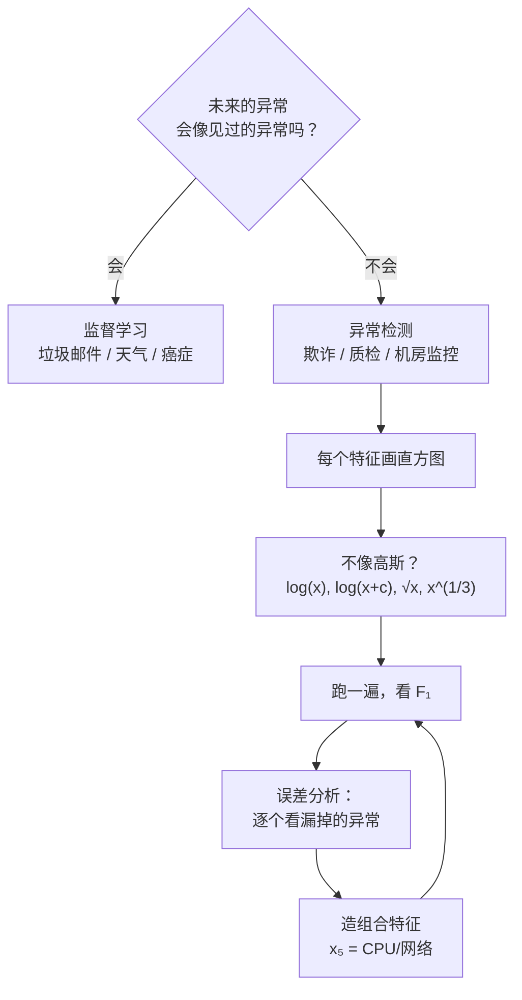

# C5.3 异常检测 vs 监督学习与特征选择

> [!abstract] 本讲任务
> 这一讲回答两组问题。
>
> **第一组（选路）**：[[C5.2 异常检测算法与系统评估]] 里为了评估，我们已经借了一批带标签的数据。既然标签都有了，**为什么不干脆训一个分类器？** 什么时候该用异常检测、什么时候该用监督学习？
>
> **第二组（选料）**：算法第 1 步「选特征」一直被跳过。具体怎么选？
> - 特征**不服从高斯分布**怎么办？
> - 算法**漏掉了一个异常**，下一步该干什么？
> - 怎么**造**出原始数据里没有的特征？

---

## 1. 异常检测 vs 监督学习

### 1.1 先自己想

> [!question] 停一下，先自己想
> 两个任务：
>
> **A.** 飞机引擎质检：10000 台正常、20 台有缺陷。
> **B.** 垃圾邮件分类：10 万封正常邮件、10 万封垃圾邮件。
>
> 你会分别用哪种方法？**判断依据是什么？**

### 1.2 课件的对照表

课件 p18 用一张左右对照表回答：

| | **异常检测 Anomaly detection** | **监督学习 Supervised learning** |
|---|---|---|
| **正例数量** | **极少**（$y=1$），**0–20 个是常态** | 正负例**都很多** |
| **负例数量** | **极多**（$y=0$） | —— |
| **正例的“长法”** | **异常有很多种类型**。算法很难从这么少的正例里学出“异常长什么样”；**未来的异常可能和见过的任何一个都不像** | 正例**足够多**，算法能学出“正例长什么样”；**未来的正例大概率和训练集里的相似** |

> [!note] 课堂板书
> ![[C5.3-板书-异常检测vs监督学习.png]]
>
> 板书内容：
> - 左栏 `(y=1)` 和 `(0-20 is common)` 底下各划线——**“0 到 20 个正例”是这一列的门槛**。
> - 左栏 `Large number of negative (y=0) examples.` 旁边**用粉框写出 $p(x)$ 并加箭头**——即：负例多，正是用来建 $p(x)$ 的。
> - 左栏 `Many different "types" of anomalies` 底下重重划线——**这是全表最关键的一行**。
> - 右栏用一个大蓝括号把 `Enough positive examples ... similar to ones in training set.` 整段框起来，并在三处加箭头。
> - 右栏底下手写 **Spam ←** ——垃圾邮件是监督学习那一侧的典型代表。

### 1.3 真正的判据

表里的三行不是并列的，有主有次：

> [!important] 一句话判据
> **问自己：未来的正例，会不会长得像我见过的正例？**
>
> - **会** → 监督学习。算法可以从正例里学出规律，并把它外推到未来。
> - **不会** → 异常检测。正例没有规律可学，只能反过来学“正常长什么样”，凡是不像正常的就报出来。
>
> 正例数量少只是**表象**；**“异常的种类多到学不完”才是根因**。

> [!example] 用这把尺子量一量
> - **垃圾邮件**：垃圾邮件的套路是有限的——中奖通知、钓鱼链接、药品广告。明天收到的垃圾邮件和今天的大同小异。→ **监督学习**。
> - **飞机引擎**：引擎可能因为裂纹坏、因为轴承坏、因为材料杂质坏、因为某个从没出现过的原因坏。你见过的 20 种坏法，完全不能代表第 21 种。→ **异常检测**。
>
> 注意这个判断**和数据量无关**：哪怕你有 10 万台坏引擎，只要下一台的坏法可能是全新的，异常检测依然更稳。

### 1.4 两边的典型任务

课件 p19 各列三个：

| 异常检测 | 监督学习 |
|---|---|
| **欺诈检测 Fraud detection** | **垃圾邮件分类 Email spam classification** |
| **制造业**（如飞机引擎） | **天气预报**（晴/雨/…） |
| **机房机器监控** | **癌症分类 Cancer classification** |

> [!note] 课堂板书
> ![[C5.3-板书-两类任务的例子.png]]
>
> 板书在 **Fraud detection** 下面划线、写 **$y=1$**，并**画一条长长的箭头从左栏的 Fraud detection 穿过中线指向右栏**。
>
> 这一笔很重要：它表示**欺诈检测是可以从左边搬到右边的**——见下面的注记。

> [!important] 欺诈检测为什么会“换边”（这一笔的含义）
> 一家刚起步的公司，抓到的欺诈账号可能只有几十个，而且骗子花样天天翻新 → **异常检测**。
>
> 但同一家公司做到足够大之后，每天能抓到成千上万个欺诈样本，欺诈的主流手法也被摸清了 → 这时**就该转成监督学习**了，因为正例已经多到能学出规律。
>
> **所以左右两栏不是永久的标签，而是随数据规模迁移的。** 同一个业务，在不同阶段可能属于不同一侧。

> [!question] 癌症分类为什么在监督学习那一侧
> 乍看它也很“偏斜”（健康人远多于患者）。但关键在于：**同一种癌症的影像/指标特征是有共性的**——未来的患者和训练集里的患者相似。所以它符合“正例可学”的条件。
>
> 反过来，如果任务是“检测这份体检报告里有没有**任何**说不清楚的毛病”，那就是异常检测了。**任务的措辞决定了它属于哪一侧。**

---

## 2. 选特征（一）：把特征掰成高斯形状

### 2.1 问题

我们的模型假设每个 $x_j\sim\mathcal{N}(\mu_j,\sigma_j^2)$。但真实特征经常**根本不是钟形**——比如响应时间、交易金额、文件大小，往往是**右偏的长尾分布**（大部分很小，少数极大）。

### 2.2 第一步：先画直方图

课件 p21 左上角就是一张直方图，形状漂亮的钟形——**这就是理想情况**。左下角另一张直方图则明显右偏（峰挤在左边，尾巴拖向右）。

> [!important] 操作纪律
> **上手第一件事：对每个特征 `hist(x)` 画一张直方图。** 长什么样一目了然，比任何统计检验都快。

### 2.3 第二步：用变换掰过来

课件给出的办法是**对特征做单调变换**，把长尾压回钟形。图上画的是：右偏的直方图 —— $\log(x)$ 变换 ——→ 漂亮的钟形。

> [!note] 课堂板书（变换清单全在板书上）
> ![[C5.3-板书-非高斯特征的变换.png]]
>
> 板书用**红圈把整份清单圈了起来**，逐条是：
>
> $$x_1\leftarrow\log(x_1)$$
> $$x_2\leftarrow\log(x_2+1)\qquad\text{或更一般地}\qquad x_2\leftarrow\log(x_2+c)$$
> $$x_3\leftarrow\sqrt{x_3}=x_3^{1/2}$$
> $$x_4\leftarrow x_4^{1/3}$$
>
> 其中 $\frac12$ 和 $\frac13$ 两个指数被红圈单独圈出，$\log(x_2+c)$ 里的 **$c$** 也被圈出。
>
> 板书还在左上角写 $p(x_i;\mu_i,\sigma_i^2)$（提醒变换的目的是让这一项的高斯假设成立），在两张直方图旁写 **hist**，在中间的箭头上写 **$\log(x)$**。

**为什么这些变换有效：** $\log$、$\sqrt{\ }$、$x^{1/3}$ 都是**凹函数**——它们把大数压得多、把小数压得少，于是右边长长的尾巴被拉回来，分布向对称靠拢。

**指数的强度排序**（压缩力度由强到弱）：

$$\log(x)\;>\;x^{1/3}\;>\;x^{1/2}=\sqrt{x}\;>\;x$$

> [!tip] $+c$ 是干什么的
> $\log(0)=-\infty$。如果特征里可能出现 0（比如“错误次数”），直接取 $\log$ 会爆。加一个小常数 $c$（最常见的是 $c=1$，因为 $\log(1)=0$）就避开了这个洞。
>
> $c$ 也可以当成一个**超参数来调**：试几个值，看哪个让直方图最像钟形。板书专门把 $c$ 圈出来，就是在强调这一点。

> [!warning] 别忘了对新样本做同样的变换
> 训练时对 $x_3$ 开了根号，**预测时也必须对新样本的 $x_3$ 开根号**，否则参数 $\mu_3,\sigma_3^2$ 完全对不上。这和 [[C2.3 多变量线性回归与梯度下降实践]] 里特征缩放的纪律是同一条。

> [!question] 不做变换会怎样
> 也不会立刻崩。高斯模型套在非高斯数据上，$\mu$ 和 $\sigma^2$ 照样能算出来，$p(x)$ 照样能给出一个数。
>
> 但后果是**长尾一侧的正常样本会被大量误报**——右偏分布的右尾上本来就有很多正常样本，可高斯模型认为那里“不该有人”，于是给它们极小的 $p(x)$。**误报率飙升，精确率崩盘。**

---

## 3. 选特征（二）：算法出错了怎么办

### 3.1 我们到底想要什么

课件 p22：

> Want $p(x)$ **large** for normal examples $x$.
> Want $p(x)$ **small** for anomalous examples $x$.

**最常见的问题（Most common problem）**：

> $p(x)$ is **comparable** (say, both large) for normal and anomalous examples.

也就是：**异常样本的 $p(x)$ 和正常样本差不多大**，于是无论 $\varepsilon$ 怎么调都分不开——调小了漏报，调大了误报满天飞。

### 3.2 误差分析的做法

> [!important] 异常检测的误差分析
> 1. 在 CV 集上跑一遍，**找出被漏掉的那些异常样本**（$y=1$ 但 $p(x)\ge\varepsilon$）。
> 2. **一个一个地人工看**：这台机器/这个账号到底哪里不对劲？
> 3. 问：**现有的特征里，有没有哪一个能把这件“不对劲”表达出来？** 如果没有——**造一个新特征。**
> 4. 加上新特征，重跑，看 $F_1$ 有没有涨（这就是 [[C5.2 异常检测算法与系统评估]] 4.1 强调“必须有一个数”的用处）。

这和 [[C1.4 过拟合与剪枝]] 里“看错分样本再决定怎么改”的思路一脉相承。

### 3.3 课件的插图说明了什么

课件 p22 下方两张图，课堂用绿笔做了标注：

> [!note] 课堂板书
> ![[C5.3-板书-误差分析.png]]
>
> 板书内容：
> - 左图（**一维**）：一条高斯曲线，下面一排红 ✕ 是数据。绿笔画了一个**向下的粗箭头**指向**正落在数据密集区正中**的一个点，引线写 **anomaly**（异常）。
> - 换句话说：**这个异常点，在 $x_1$ 这一个维度上看起来完全正常**——它就混在正常样本堆里。这时 $p(x_1)$ 很大，异常检测抓不到它。
> - 右图（**二维**）：同样的数据画在 $x_1$–$x_2$ 平面上，粉笔画出等高线。绿笔在**左上角远离所有等高线的地方**画了一个 ✕ 并用粉箭头指向它。
> - 也就是说：**一旦加上第二个特征 $x_2$，同一个点立刻跳到了等高线之外**——$p(x_1,x_2)$ 变得极小，抓到了。
> - 板书还在 $x_2$ 轴旁写 **$x_2$** 并加箭头，强调“新加的就是这一维”。

> [!important] 这两张图的教训
> **漏报不一定是算法不好，很可能是特征不够。**
>
> 同一个异常，在一维里藏得住，在二维里藏不住。误差分析的产出往往不是“换个模型”，而是**“再加一个特征”**。

---

## 4. 选特征（三）：造出新特征

### 4.1 原始特征

课件 p23，机房监控：

> Choose features that might take on **unusually large or small values** in the event of an anomaly.

$$x_1=\text{内存占用},\quad x_2=\text{每秒磁盘访问次数},\quad x_3=\text{CPU 负载},\quad x_4=\text{网络流量}$$

> [!important] 选特征的总原则
> **选那些“出事时会变得异常大或异常小”的量。** 一个在正常和异常时都差不多的量（比如机器的序列号、机架编号），加进去只会稀释信号。

### 4.2 组合特征

> [!question] 停一下，先自己想
> 一台机器陷入了**死循环**：CPU 100% 满载，但因为卡在本地计算上，**网络流量几乎为零**。
>
> 单看 $x_3$（CPU 负载）：100% 很高，但机房里本来就有跑满载的计算任务，不算异常。
> 单看 $x_4$（网络流量）：接近 0 也不稀奇，很多机器就是闲着。
>
> **$p(x_3)$ 和 $p(x_4)$ 都不小，连乘起来 $p(x)$ 也不小——这台死循环的机器逃掉了。怎么办？**

> [!note] 课堂板书（答案在板书上，课件正文没印）
> ![[C5.3-板书-机房监控的组合特征.png]]
>
> 板书在四个原始特征下面，**手写出两个新造的特征**：
>
> $$x_5=\frac{\text{CPU load}}{\text{network traffic}}$$
>
> $$x_6=\frac{(\text{CPU load})^2}{\text{network traffic}}$$
>
> 两条式子底下都划了线。板书还在 $x_3=$ CPU load 和 $x_4=$ network traffic 右侧各画了一个指向左的箭头——**指出新特征就是由这两个组合出来的**。

**为什么 $x_5$ 能抓到死循环**：死循环时分子大、分母接近 0，$x_5$ 变得**异常大**——远远超出它在正常机器上的取值范围。于是 $p(x_5)$ 极小，连乘之后 $p(x)$ 塌下去，**抓到了**。

**$x_6$ 为什么要平方**：$(\text{CPU load})^2$ 让分子对 CPU 负载更敏感。CPU 从 50% 升到 100% 时，$x_5$ 翻一倍，$x_6$ 翻四倍。**当你希望某个维度的偏离被放大时，就给它加个指数。**

> [!important] 组合特征的本质
> 回忆 [[C5.2 异常检测算法与系统评估]] 1.2 指出的缺口：独立性假设让模型**看不见特征之间的关系**。
>
> $x_5=\frac{x_3}{x_4}$ 正是**手工把那个关系塞进一个新的单变量里**——原本要靠“$x_3$ 和 $x_4$ 的联合行为”才能发现的异常，现在变成了“$x_5$ 单独的极端值”，而单变量极端值恰恰是这个模型最擅长抓的东西。
>
> 这条路能走通，但要**靠人的领域知识去想出每一个组合**。有没有办法让算法自动发现这些关系？—— 有，那就是 [[C5.4 多元高斯分布与它的异常检测]]。

> [!tip] 常见的组合模式（**拓展**）
> - **比值**：$\frac{a}{b}$ ——抓“本该同步变化的两个量脱钩了”。
> - **差值**：$a-b$ ——抓“本该相等的两个量对不上”（如收到的包数 vs 发出的包数）。
> - **加权比**：$\frac{a^k}{b}$ ——想让 $a$ 的偏离被放大就调大 $k$。
> - **速率**：$\frac{\Delta a}{\Delta t}$ ——抓“变化太快”。
>
> 做比值时要防分母为零：常用 $\frac{a}{b+c}$（$c$ 是一个小常数），和 3.3 节 $\log(x+c)$ 里的 $c$ 是同一招。

---

## 5. 停一下，我们刚才干了什么

这一讲全是**做事的方法**，没有新公式。串起来是一条工作流：

注意这是一个**循环**：造特征 → 看 $F_1$ → 误差分析 → 再造特征。异常检测的工程量绝大部分花在这个循环上，而不是在模型本身（模型只有两行公式）。

---

## 6. 这一讲的三句话

> [!important] 三句话
> 1. **异常检测还是监督学习，看“未来的正例像不像见过的正例”**：异常有很多种类型、正例极少（**0–20 个是常态**）、未来的异常可能和见过的都不像 → **异常检测**（欺诈检测、制造业、机房监控）；正负例都很多、正例有共性、未来的正例与训练集相似 → **监督学习**（垃圾邮件、天气预报、癌症分类）。**正例少只是表象，“种类多到学不完”才是根因**；欺诈检测会随数据规模增长从左侧迁移到右侧。
> 2. **特征不是高斯的就掰成高斯的**：先 `hist` 画直方图，再用**单调凹变换**压长尾——$\log(x)$、$\log(x+c)$（$c$ 防 $\log 0$、可当超参数调）、$\sqrt{x}=x^{1/2}$、$x^{1/3}$，压缩力度 $\log>x^{1/3}>x^{1/2}$。**新样本必须做同样的变换**；不做变换的后果是长尾侧正常样本被大量误报。
> 3. **最常见的失败是“异常和正常的 $p(x)$ 差不多大”，对策是做误差分析、造新特征**：把 CV 上漏掉的异常逐个人工看，问“哪个量能把这份不对劲表达出来”；选特征的原则是**“出事时会异常大或异常小”**；组合特征（机房例：$x_5=\frac{\text{CPU 负载}}{\text{网络流量}}$、$x_6=\frac{(\text{CPU 负载})^2}{\text{网络流量}}$）能把“特征之间的关系”翻译成“单个特征的极端值”，从而绕过独立性假设的缺口。

### 速查表

| 名称 | 内容 |
|---|---|
| 选路判据 | 未来的正例会不会像见过的正例？会 → 监督学习；不会 → 异常检测 |
| 异常检测一侧特征 | 正例极少（**0–20 常见**）、负例极多、异常**种类繁多**且未来的异常可能全新 |
| 监督学习一侧特征 | 正负例都多、正例有共性、未来正例与训练集相似 |
| 异常检测典型任务 | 欺诈检测、制造业（飞机引擎）、机房机器监控 |
| 监督学习典型任务 | 垃圾邮件分类、天气预报、癌症分类 |
| 可迁移的例子 | **欺诈检测**：数据少时用异常检测，规模做大后转监督学习 |
| 第一步操作 | 对每个特征画直方图 `hist(x)` |
| 变换清单 | $x_1\leftarrow\log(x_1)$；$x_2\leftarrow\log(x_2+1)$ 或 $\log(x_2+c)$；$x_3\leftarrow\sqrt{x_3}=x_3^{1/2}$；$x_4\leftarrow x_4^{1/3}$ |
| 压缩力度排序 | $\log(x)>x^{1/3}>x^{1/2}>x$ |
| $+c$ 的作用 | 避开 $\log 0=-\infty$；$c$ 可当超参数调（常取 1） |
| 纪律 | 新样本必须做与训练时相同的变换 |
| 最常见的失败 | $p(x)$ 对正常和异常样本**大小相当**（both large），怎么调 $\varepsilon$ 都分不开 |
| 误差分析步骤 | 找漏掉的异常 → 人工逐个看 → 问“哪个量能表达这份不对劲” → 造特征 → 看 $F_1$ 是否提升 |
| 选特征原则 | 选出事时**取值异常大或异常小**的量 |
| 机房原始特征 | $x_1$ 内存、$x_2$ 磁盘访问/秒、$x_3$ CPU 负载、$x_4$ 网络流量 |
| 机房组合特征 | $x_5=\dfrac{\text{CPU 负载}}{\text{网络流量}}$，$x_6=\dfrac{(\text{CPU 负载})^2}{\text{网络流量}}$ |
| 组合特征的本质 | 把“特征之间的关系”翻译成“单个特征的极端值”，绕过独立性假设 |
| 常见组合模式（**拓展**） | 比值 $\frac ab$、差值 $a-b$、加权比 $\frac{a^k}{b}$、速率 $\frac{\Delta a}{\Delta t}$；防零用 $\frac{a}{b+c}$ |

> [!abstract] 下一讲预告
> 上面造组合特征的办法有个硬伤：**每一个组合都得靠人想出来**。CPU 和网络的关系你想到了，可内存和磁盘之间呢？四个特征两两组合有 6 对，十个特征有 45 对，还有三元组合……人是想不过来的。
>
> 下一讲换一条路：**不再假设特征独立，直接用一个能容纳相关性的分布**——**多元高斯分布 Multivariate Gaussian**：
> $$p(x;\mu,\Sigma)=\frac{1}{(2\pi)^{n/2}|\Sigma|^{1/2}}\exp\!\left(-\frac12(x-\mu)^T\Sigma^{-1}(x-\mu)\right)$$
> 那个 $\Sigma$ 叫**协方差矩阵**（[[C3.4 期望、方差、协方差与相关系数]] 里已经见过它），它的**非对角元素**装的正是特征之间的相关性。等高线不再只能是正椭圆，而可以**自动斜过来**贴合数据。
>
> 你还会看到一个漂亮的事实：**这一讲用的原模型，其实就是多元高斯在 $\Sigma$ 为对角矩阵时的特例。** 但天下没有免费的午餐——代价是计算贵得多，而且必须满足 $m>n$（实践中要 $m\ge10n$），否则 $\Sigma$ 不可逆。

---

上一讲：[[C5.2 异常检测算法与系统评估]]
下一讲：[[C5.4 多元高斯分布与它的异常检测]]
返回：[[机器学习课程 MOC]]
