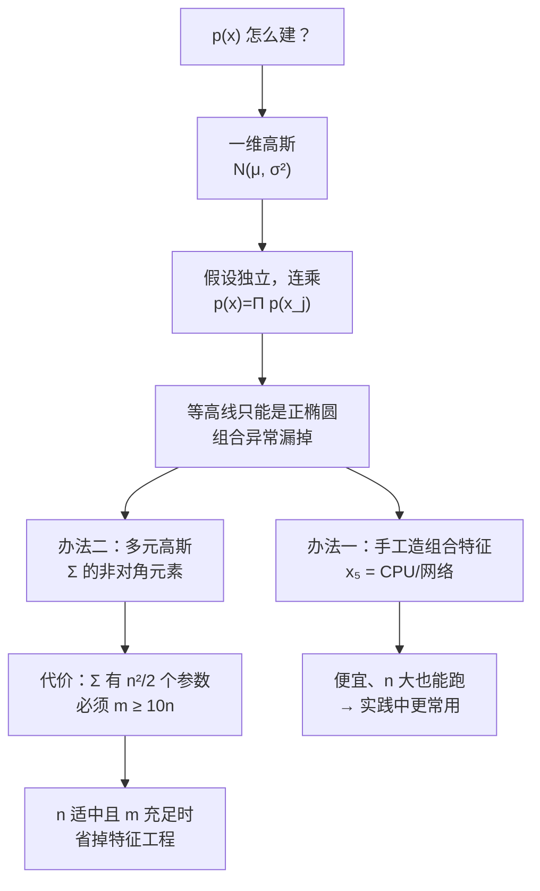

# C5.4 多元高斯分布与它的异常检测

> [!abstract] 本讲任务
> [[C5.3 异常检测 vs 监督学习与特征选择]] 结尾留下的硬伤：**组合特征得靠人一个一个想出来**。四个特征有 6 对组合，十个特征有 45 对，还有三元的……人想不过来。
>
> 这一讲换路：**不再假设特征独立**，直接用一个能容纳相关性的分布——**多元高斯分布**。读完你应当能回答：
>
> 1. 独立性假设到底漏掉了什么？（一张图就能看明白）
> 2. 多元高斯长什么样？**协方差矩阵 $\Sigma$** 的每个位置控制图形的哪个方面？
> 3. 怎么用它做异常检测？
> 4. 它和上一节的“原模型”是什么关系？
> 5. 代价是什么？什么时候**不能**用？

---

## 1. 独立性假设漏掉了什么

### 1.1 一张图说明问题

课件 p25 标题：**Motivating example: Monitoring machines in a data center**（动机例子：机房机器监控）。

图分左右：

- **左边**：$x_1$（CPU Load）对 $x_2$（Memory Use）的散点图。红 ✕ 是历史数据，明显沿着一条**从左下到右上的斜带**分布——CPU 忙的机器，内存用得也多，**两者正相关**。
- **右边**：两张一维密度图，分别是 $p(x_1;\mu_1,\sigma_1^2)$ 和 $p(x_2;\mu_2,\sigma_2^2)$ ——也就是原模型实际在用的两个分布。

> [!note] 课堂板书
> ![[C5.4-板书-机房监控的动机例子.png]]
>
> 板书内容：
> - 右边两张一维图旁边分别绿笔写出 $p(x_1;\mu_1,\sigma_1^2)$ 和 $p(x_2;\mu_2,\sigma_2^2)$ 并划线——点明**原模型只看这两条曲线**。
> - **绿笔在左图上标出一个 ✕**，位置在**左上方**（CPU 低、内存高），并从它引绿线到右边两张一维图上对应的位置。
> - **关键在于**：那个绿 ✕ 在左图上明显在斜带**之外**，但它投影到 $x_1$ 轴上落在正常范围、投影到 $x_2$ 轴上也落在正常范围——**绿色的椭圆把两张一维图上“正常的取值区间”都圈了出来，而那个点都在圈内**。
> - 粉笔在左图上画出**正椭圆的等高线**（原模型给出的），蓝笔画出**斜椭圆**（数据实际的形状）——两者明显对不上。

> [!important] 缺口就在这里
> 这个点：**CPU 负载很低、内存占用很高**。
>
> - 单看 $x_1$：低 CPU 很常见，$p(x_1)$ 不小。
> - 单看 $x_2$：高内存也很常见，$p(x_2)$ 不小。
> - **连乘**：$p(x)=p(x_1)p(x_2)$ 依然不小 → **判为正常，漏掉了。**
>
> 可实际上，「CPU 闲着但内存吃满」在这个机房里**从来没发生过**——它就在斜带之外。这是一个**组合异常**：每一维单看都正常，**组合起来反常**。
>
> **原因**：原模型的等高线永远是**轴对齐的正椭圆**（因为 $p(x)=p(x_1)p(x_2)$，形状只由 $\sigma_1,\sigma_2$ 决定），而数据的真实形状是**斜的**。正椭圆盖不住斜带，就会在斜带外的“角落”里误判。

---

## 2. 多元高斯分布

### 2.1 定义

课件 p26：

> $x\in\mathbb{R}^n$. **Don't model $p(x_1),p(x_2),\ldots$ etc. separately.**
> **Model $p(x)$ all in one go.**
> Parameters: $\mu\in\mathbb{R}^n$, $\Sigma\in\mathbb{R}^{n\times n}$ (covariance matrix)
> $x\in\mathbb{R}^n$。不要分别对$p(x_1),p(x_2),\dots$等单独建模。
一次性对$p(x)$整体建模。
参数：$\mu\in\mathbb{R}^n$，$\Sigma\in\mathbb{R}^{n\times n}$（协方差矩阵）

> [!note] 课堂板书（密度函数整条是手写的，课件正文没印）
> ![[C5.4-板书-多元高斯的定义.png]]
>
> 板书写出：
>
> $$p(x;\mu,\Sigma)=\frac{1}{(2\pi)^{n/2}\,|\Sigma|^{1/2}}\exp\!\left(-\frac12(x-\mu)^T\Sigma^{-1}(x-\mu)\right)$$
>
> 并在下面用粉笔特别注明：
>
> > **$|\Sigma|$ = determinant of $\Sigma$**（$\Sigma$ 的**行列式**）　　|　　**det(Sigma)**
>
> 这一条注解很必要——$|\cdot|$ 用在矩阵上是行列式，不是绝对值、也不是范数。MATLAB/Octave 里就是 `det(Sigma)`。
>
> 板书还把 $\Sigma\in\mathbb{R}^{n\times n}$ 用粉框框出，把 $|\Sigma|^{1/2}$ 用粉圈圈出，在 $\Sigma^{-1}$ 下画箭头，并在 $p(x_1),p(x_2)$ 和 $p(x)$ 底下划线。

### 2.2 把它和一维版本对照着读

| | 一维 $\mathcal{N}(\mu,\sigma^2)$ | $n$ 维 $\mathcal{N}(\mu,\Sigma)$ |
|---|---|---|
| 中心 | $\mu\in\mathbb{R}$ | $\mu\in\mathbb{R}^n$（向量） |
| 离散程度 | $\sigma^2\in\mathbb{R}$ | $\Sigma\in\mathbb{R}^{n\times n}$（矩阵） |
| 指数里的“距离” | $\dfrac{(x-\mu)^2}{\sigma^2}$ | $(x-\mu)^T\Sigma^{-1}(x-\mu)$ |
| 归一化常数 | $\dfrac{1}{(2\pi)^{1/2}(\sigma^2)^{1/2}}$ | $\dfrac{1}{(2\pi)^{n/2}|\Sigma|^{1/2}}$ |

> [!important] 一一对应
> 把上表的右列和左列逐格比对，会发现**多元版本就是把一维版本里的每个标量换成对应的矩阵运算**：
> - 除以 $\sigma^2$ → **乘以 $\Sigma^{-1}$**（矩阵的“除法”就是乘逆）
> - $(x-\mu)^2$ → **$(x-\mu)^T(\cdots)(x-\mu)$**（向量的“平方”是二次型）
> - $(\sigma^2)^{1/2}$ → **$|\Sigma|^{1/2}$**（矩阵的“大小”是行列式）
> - 指数 $\frac12\to\frac n2$（$n$ 个维度各贡献一个 $\sqrt{2\pi}$）
>
> 所以这个公式不需要死记，**照着一维版本翻译一遍就出来了**。

> [!tip] $(x-\mu)^T\Sigma^{-1}(x-\mu)$ 叫马氏距离（**拓展**）
> 这个量的平方根叫 **马氏距离 Mahalanobis distance**。它和欧氏距离的区别是：**它按数据自己的分散方向来量远近**。
>
> 沿着数据拉伸的方向走一段，马氏距离算得短；垂直于那个方向走同样一段，马氏距离算得长。这正是“斜椭圆等高线”的数学表述。

### 2.3 $\Sigma$ 装的是什么

$\Sigma$ 就是 [[C3.4 期望、方差、协方差与相关系数]] 里的**协方差矩阵**：

$$\Sigma=\begin{bmatrix}
\mathrm{Var}(x_1) & \mathrm{Cov}(x_1,x_2) & \cdots\\
\mathrm{Cov}(x_2,x_1) & \mathrm{Var}(x_2) & \cdots\\
\vdots & \vdots & \ddots
\end{bmatrix}
=\begin{bmatrix}
\sigma_1^2 & \sigma_{12} & \cdots\\
\sigma_{21} & \sigma_2^2 & \cdots\\
\vdots & \vdots & \ddots
\end{bmatrix}$$

> [!important] 两类位置，两种作用
> - **对角线** $\Sigma_{jj}=\sigma_j^2$：第 $j$ 个特征自己的**方差**（这一维有多宽）。
> - **非对角线** $\Sigma_{jk}=\mathrm{Cov}(x_j,x_k)$：第 $j$ 和第 $k$ 个特征之间的**协方差**（它们是否同向变动）。
>
> **原模型丢掉的，正是非对角线那一半。** 这就是上一节那个组合异常漏掉的全部原因。
>
> 另外由 $\mathrm{Cov}(x_j,x_k)=\mathrm{Cov}(x_k,x_j)$，**$\Sigma$ 一定是对称矩阵**。

---

## 3. 六组例子：$\Sigma$ 怎么改变图形

课件用**六整页**（p27–p32）只干一件事：改 $\mu$ 和 $\Sigma$，看图形怎么变。每页三列，**最左边一列永远是基准 $\mu=\begin{bmatrix}0\\0\end{bmatrix},\Sigma=\begin{bmatrix}1&0\\0&1\end{bmatrix}$**，右边两列是变化后的结果。每页上下两行：上面是 3D 曲面，下面是俯视的等高线图。

### 3.1 例子 1：等比缩放 $\Sigma$

$$\Sigma=\begin{bmatrix}1&0\\0&1\end{bmatrix}\;\to\;\begin{bmatrix}0.6&0\\0&0.6\end{bmatrix}\;\to\;\begin{bmatrix}2&0\\0&2\end{bmatrix}$$

> [!note] 课堂板书
> ![[C5.4-板书-多元高斯例子1-等比缩放.png]]
>
> 板书把三组参数分别用粉框、蓝框框出，在第一张 3D 图上标注 **$p(x)$** 并画粉色双向箭头标出宽度，各图旁画箭头指出峰的高低变化。

**结果**：等高线始终是**正圆**，只是**大小变**。$\Sigma$ 整体乘 0.6 → 圆变小、峰变高；乘 2 → 圆变大、峰变矮。

> [!tip] 和一维完全同理
> 这就是 [[C5.1 异常检测的问题设定、高斯分布与参数估计]] 2.3 里“$\sigma$ 大则胖而矮”在二维的版本——总体积恒为 1，摊得宽了必然矮。

### 3.2 例子 2：只改 $\sigma_1^2$

$$\Sigma=\begin{bmatrix}1&0\\0&1\end{bmatrix}\;\to\;\begin{bmatrix}0.6&0\\0&1\end{bmatrix}\;\to\;\begin{bmatrix}2&0\\0&1\end{bmatrix}$$

> [!note] 课堂板书
> ![[C5.4-板书-多元高斯例子2-只改x1方差.png]]
>
> 板书**把变动的那个数字圈出来**（0.6 和 2 各画一个蓝圈），同时把没变的 1 也圈出来作对照，并加箭头。在第二张的等高线图上把坐标轴标签 $x_1$、$x_2$ 各圈了一次——提醒看清哪个轴在变窄/变宽。第三张 3D 图上画了粉色的横向双箭头。

**结果**：等高线从圆变成**沿 $x_1$ 方向压扁或拉长的椭圆**，但**长短轴仍然和坐标轴平行**。

### 3.3 例子 3：只改 $\sigma_2^2$

$$\Sigma=\begin{bmatrix}1&0\\0&1\end{bmatrix}\;\to\;\begin{bmatrix}1&0\\0&0.6\end{bmatrix}\;\to\;\begin{bmatrix}1&0\\0&2\end{bmatrix}$$

> [!note] 课堂板书
> ![[C5.4-板书-多元高斯例子3-只改x2方差.png]]
>
> 板书同样把变动的 0.6 和 2 圈出，并在下排等高线图上用**绿色的竖直双箭头**量出 $x_2$ 方向的宽度变化。

**结果**：与例子 2 对称——这次椭圆沿 **$x_2$ 方向**压扁或拉长。

> [!important] 例子 1–3 的共同结论
> **只要 $\Sigma$ 是对角矩阵（非对角线为 0），等高线的轴就永远和坐标轴平行。** 你能做的只有“沿 $x_1$ 拉伸”和“沿 $x_2$ 拉伸”，**斜不过来**。
>
> 这三页一起在回答第 1 节那个问题：**原模型能画出的所有形状，就是这三页里的所有形状。** 它画不出斜的。

### 3.4 例子 4：正相关

$$\Sigma=\begin{bmatrix}1&0\\0&1\end{bmatrix}\;\to\;\begin{bmatrix}1&0.5\\0.5&1\end{bmatrix}\;\to\;\begin{bmatrix}1&0.8\\0.8&1\end{bmatrix}$$

> [!note] 课堂板书
> ![[C5.4-板书-多元高斯例子4-正相关.png]]
>
> 板书用蓝圈把**两个非对角位置的 0.5**（以及 0.8）各圈出来并加箭头——强调这两个数是对称出现的。在下排等高线上用**粉笔描出斜椭圆的长轴**，在 3D 图上沿脊线画粉线。

**结果**：等高线**斜成了 45° 方向的椭圆**，沿 $x_1=x_2$ 这条线拉长。非对角元素从 0.5 加到 0.8，椭圆**更细更长**——相关性越强，数据越贴近一条直线。

> [!important] 这正是我们要的
> 第 1 节那张机房图上，CPU 和内存**正相关**，数据是一条从左下到右上的斜带。**这里的 $\Sigma=\begin{bmatrix}1&0.8\\0.8&1\end{bmatrix}$ 画出的形状，正好就是那条斜带。**
>
> 于是“CPU 低但内存高”那个点会落在斜椭圆**之外**，$p(x)$ 极小——**抓到了**。

### 3.5 例子 5：负相关

$$\Sigma=\begin{bmatrix}1&0\\0&1\end{bmatrix}\;\to\;\begin{bmatrix}1&-0.5\\-0.5&1\end{bmatrix}\;\to\;\begin{bmatrix}1&-0.8\\-0.8&1\end{bmatrix}$$

> [!note] 课堂板书
> ![[C5.4-板书-多元高斯例子5-负相关.png]]
>
> 板书把两个 $-0.5$（$-0.8$）圈出，并用粉笔在等高线上描出**朝另一个方向斜的椭圆**。第一张图上还有一个指向 $\Sigma=$ 的蓝箭头。

**结果**：椭圆斜向**另一边**（沿 $x_1=-x_2$ 方向）。$-0.8$ 比 $-0.5$ 更细长。

> [!example] 什么时候是负相关
> 一台机器的**空闲内存**和**已用内存**——一个多另一个必然少。或者**缓存命中率**和**磁盘读取次数**。

### 3.6 例子 6：移动 $\mu$

$$\mu=\begin{bmatrix}0\\0\end{bmatrix}\;\to\;\begin{bmatrix}0\\0.5\end{bmatrix}\;\to\;\begin{bmatrix}1.5\\-0.5\end{bmatrix}$$（$\Sigma$ 保持单位阵）

> [!note] 课堂板书
> ![[C5.4-板书-多元高斯例子6-移动均值.png]]
>
> 板书把三组 $\mu$ 分别用蓝框、粉框框出，并在各图的坐标轴上用蓝/绿箭头标出**峰的位置移到了哪里**。

**结果**：**形状完全不变，只是整体平移。** $\mu$ 管位置，$\Sigma$ 管形状——和一维完全一致。

### 3.7 六页总结成一张表

> [!important] $\Sigma$ 的读图字典
> | 你改了 | 图形怎么变 |
> |---|---|
> | $\mu$ | **平移**，形状不变 |
> | $\Sigma$ 整体乘一个数 | 等高线**等比放大/缩小**（峰随之矮/高） |
> | $\Sigma_{11}$（左上） | 沿 **$x_1$** 方向拉伸/压缩 |
> | $\Sigma_{22}$（右下） | 沿 **$x_2$** 方向拉伸/压缩 |
> | $\Sigma_{12}=\Sigma_{21}>0$ | 等高线**斜向右上**（正相关），值越大越细长 |
> | $\Sigma_{12}=\Sigma_{21}<0$ | 等高线**斜向左上**（负相关） |
>
> 一句话：**对角线管“胖瘦”，非对角线管“歪不歪”，$\mu$ 管“在哪”。**

---

## 4. 用多元高斯做异常检测

### 4.1 参数拟合

课件 p34：

> [!note] 课堂板书
> ![[C5.4-板书-多元高斯的参数拟合.png]]
>
> 板书在 `Parameters μ, Σ` 上方补写两者的**维度**：
> $$\mu\in\mathbb{R}^n,\qquad \Sigma\in\mathbb{R}^{n\times n}$$
> 在训练集 $\{x^{(1)},\ldots,x^{(m)}\}$ 右边补写 $x\in\mathbb{R}^n$，并把公式里的 $\mu$ 和 $\Sigma$ 各用蓝框框出、加箭头。三张 3D 小图前面也各有一个箭头。

**参数拟合公式**（课件正文有印）：

$$\mu=\frac1m\sum_{i=1}^{m}x^{(i)},\qquad \Sigma=\frac1m\sum_{i=1}^{m}\left(x^{(i)}-\mu\right)\left(x^{(i)}-\mu\right)^T$$

> [!tip] 看懂 $\Sigma$ 那个公式的维度
> $(x^{(i)}-\mu)$ 是 $n\times1$ 的列向量，$(x^{(i)}-\mu)^T$ 是 $1\times n$ 的行向量。**列 × 行 = $n\times n$ 矩阵**（这叫**外积**，不是内积）。$m$ 个这样的矩阵求平均，还是 $n\times n$。
>
> 对照一维：$\sigma^2=\frac1m\sum(x^{(i)}-\mu)^2$ ——**标量的平方，在向量里就是外积。** 又一次一一对应。

### 4.2 算法

课件 p35：

**1. 拟合模型**：按上面两式算出 $\mu$ 和 $\Sigma$。

**2. 判定新样本**：算

$$p(x)=\frac{1}{(2\pi)^{n/2}|\Sigma|^{1/2}}\exp\!\left(-\frac12(x-\mu)^T\Sigma^{-1}(x-\mu)\right)$$

$$\textbf{Flag an anomaly if } p(x)<\varepsilon$$

> [!note] 课堂板书
> ![[C5.4-板书-用多元高斯做异常检测.png]]
>
> 板书用蓝色大括号把第 1 步的两条公式括在一起、把第 2 步的密度公式也括起来，并在 `p(x) < ε` 底下划线。
>
> 右上角的散点图上，讲者用**绿笔圈出一个落在所有等高线之外、左上角的点**并画箭头——就是第 1 节那个「CPU 低、内存高」的组合异常。**用多元高斯之后，它落在了等高线外面。**

> [!important] 注意流程完全没变
> 三集划分、用 CV 选 $\varepsilon$、用 $F_1$ 评估——[[C5.2 异常检测算法与系统评估]] 那一整套照搬。**换的只是 $p(x)$ 的写法。**

### 4.3 数值对比：同一个点，两个模型

为了把差别看得更清楚，下面用一组自造的数据做对比。

**设定**：$\mu=(1,1)$，真实协方差 $\Sigma=\begin{bmatrix}0.25&0.20\\0.20&0.25\end{bmatrix}$（强正相关，$\rho=0.8$）。测试点 $x_{test}=(1.75,\,0.35)$ ——$x_1$ 偏高、$x_2$ 偏低，**恰好是正相关数据里“不该出现”的组合**。

![[C5-原模型与多元高斯的等高线对比.png]]

**原模型**（等价于把 $\Sigma$ 的非对角元素抹成 0，即 $\Sigma_{\text{diag}}=\begin{bmatrix}0.25&0\\0&0.25\end{bmatrix}$）：

$$p(x_{test})=0.0888$$

**多元高斯**（用完整的 $\Sigma$）：

$$p(x_{test})=0.000059$$

> [!important] 差了 1500 倍
> 同一个点，同一批数据。原模型给 $0.0888$ ——在它的正椭圆里，这个点离中心不算远，**判为正常**；多元高斯给 $0.000059$ ——它落在斜椭圆的**外面**，**判为异常**。
>
> 任何一个落在 $0.000059$ 和 $0.0888$ 之间的 $\varepsilon$，都会让这两个模型给出**相反**的结论。左图里那个绿色五角星在等高线**内**，右图里它在等高线**外**——一张图就说清了这一节的全部价值。

---

## 5. 和原模型的关系

### 5.1 原模型是特例

课件 p36 标题：**Relationship to original model**。

**原模型**：

$$p(x)=p(x_1;\mu_1,\sigma_1^2)\times p(x_2;\mu_2,\sigma_2^2)\times\cdots\times p(x_n;\mu_n,\sigma_n^2)$$

**对应于多元高斯**：

$$p(x;\mu,\Sigma)=\frac{1}{(2\pi)^{n/2}|\Sigma|^{1/2}}\exp\!\left(-\frac12(x-\mu)^T\Sigma^{-1}(x-\mu)\right)$$

**其中（where）**：

$$\Sigma=\begin{bmatrix}
\sigma_1^2 & 0 & \cdots & 0\\
0 & \sigma_2^2 & \cdots & 0\\
\vdots & \vdots & \ddots & \vdots\\
0 & 0 & \cdots & \sigma_n^2
\end{bmatrix}$$

> [!note] 课堂板书（课件的 `where` 后面是空白，$\Sigma$ 整个是手写的）
> ![[C5.4-板书-与原模型的关系.png]]
>
> 板书内容：
> - 把 `Original model:` 那一整行用蓝框框住，并把每一项里的 $\sigma_1^2,\sigma_2^2,\sigma_n^2$ 各用粉圈圈出。
> - `Corresponds to multivariate Gaussian` 下面的整条公式用蓝框框住。
> - **`where` 后面手写画出矩阵**：一个大的方括号，**主对角线上依次写 $\sigma_1^2,\sigma_2^2,\ldots,\sigma_n^2$（各用粉圈圈出），非对角位置画 0**，中间用省略号。
> - 右侧对着第三张图（斜椭圆那张）写出 $\Sigma=\begin{bmatrix}1&0.8\\0.8&1\end{bmatrix}$ 并框起来——**这是原模型画不出来的那一种**。
> - 中间三张图下面用粉箭头指出前两张是轴对齐的（原模型能画），第三张是斜的（原模型不能画）。

> [!important] 一句话
> **原模型 = 多元高斯 + “强制 $\Sigma$ 为对角矩阵”。**
>
> 反过来说：多元高斯是原模型的**推广**——它把那些被抹成 0 的非对角元素放开了。

### 5.2 验算一遍（**拓展**）

课件只说“corresponds to”，我们验一下。设 $\Sigma=\mathrm{diag}(\sigma_1^2,\ldots,\sigma_n^2)$，则：

**行列式**（对角阵的行列式 = 对角元素之积）：

$$|\Sigma|=\prod_{j=1}^{n}\sigma_j^2\;\Longrightarrow\;|\Sigma|^{1/2}=\prod_{j=1}^{n}\sigma_j$$

**逆**（对角阵的逆 = 每个对角元素取倒数）：

$$\Sigma^{-1}=\mathrm{diag}\!\left(\tfrac{1}{\sigma_1^2},\ldots,\tfrac{1}{\sigma_n^2}\right)$$

**二次型**（对角阵夹在中间，交叉项全为 0）：

$$(x-\mu)^T\Sigma^{-1}(x-\mu)=\sum_{j=1}^{n}\frac{(x_j-\mu_j)^2}{\sigma_j^2}$$

**代回去**：

$$p(x;\mu,\Sigma)=\frac{1}{(2\pi)^{n/2}\prod_j\sigma_j}\exp\!\left(-\frac12\sum_{j=1}^n\frac{(x_j-\mu_j)^2}{\sigma_j^2}\right)
=\prod_{j=1}^{n}\underbrace{\frac{1}{\sqrt{2\pi}\,\sigma_j}\exp\!\left(-\frac{(x_j-\mu_j)^2}{2\sigma_j^2}\right)}_{=\,p(x_j;\mu_j,\sigma_j^2)}$$

（最后一步用了 $e^{-\sum a_j}=\prod e^{-a_j}$。）**恰好就是原模型。**✔

---

## 6. 两个模型怎么选

课件 p37 是一张完整的对照表，课堂在上面写了大量补充。

> [!note] 课堂板书（这页板书信息量最大）
> ![[C5.4-板书-原模型vs多元高斯.png]]

| | **原模型 Original model** | **多元高斯 Multivariate Gaussian** |
|---|---|---|
| 公式 | $p(x_1;\mu_1,\sigma_1^2)\times\cdots\times p(x_n;\mu_n,\sigma_n^2)$ | $\dfrac{1}{(2\pi)^{n/2}\lvert\Sigma\rvert^{1/2}}\exp\left(-\frac12(x-\mu)^T\Sigma^{-1}(x-\mu)\right)$ |
| **相关性** | **手工造组合特征**来捕捉 $x_1,x_2$ 取到异常组合的情形 | **自动捕捉**特征之间的相关性 |
| **计算代价** | **便宜**，能扩展到很大的 $n$ | **贵** |
| **对 $m$ 的要求** | **$m$ 小也没关系** | **必须 $m>n$**，否则 $\Sigma$ 不可逆 |

板书逐条的补充：

**关于组合特征**：板书在左栏写出并用蓝框框住

$$x_3=\frac{x_1}{x_2}=\frac{\text{CPU load}}{\text{memory}}$$

（与 [[C5.3 异常检测 vs 监督学习与特征选择]] 4.2 里的 $x_5=\frac{\text{CPU 负载}}{\text{网络流量}}$ 是同一种手法，只是这里配的是内存。）同时在 $x_1,x_2$ 底下各划了红线。

**关于计算代价**：板书在左栏写出两个规模

$$n=10{,}000,\qquad n=100{,}000$$

（$n=100{,}000$ 还划了线）——**原模型在这两个规模下都跑得动**。右栏则写出

$$\Sigma\;\sim\;\frac{n^2}{2}$$

并用粉箭头指向 $\Sigma^{-1}$（$\Sigma^{-1}$ 在右栏被单独写出并划线，公式里的 $\Sigma^{-1}$ 也被粉圈圈出）。

> [!important] $\frac{n^2}{2}$ 是怎么来的
> $\Sigma$ 是 $n\times n$ 的**对称**矩阵，独立参数个数是
> $$\frac{n(n+1)}{2}\approx\frac{n^2}{2}$$
> - $n=100$ → 约 5050 个参数，可以接受。
> - $n=10{,}000$ → 约 **5000 万**个参数。光存 $\Sigma$ 就要几百 GB，还要对它**求逆**（$O(n^3)$）。**做不到。**
>
> 这就是为什么 $n$ 很大时只能用原模型：它的参数量是 $2n$，**线性**的。

**关于 $m>n$**：板书把 `Must have $m>n$` 里的 **$m>n$ 用蓝框框出**，并在下面用粉笔写出更实用的经验值：

$$\boxed{m\ \ge\ 10n}$$

> [!important] 为什么 $m>n$ 还不够，要 $m\ge10n$
> $m>n$ 只是 $\Sigma$ **在数学上可逆**的必要条件。但 $m$ 刚过 $n$ 时，$\Sigma$ 虽然可逆却**接近奇异**——数值上极不稳定，$\Sigma^{-1}$ 的元素会爆炸，$p(x)$ 算出来毫无意义。
>
> **$m\ge10n$ 是实践中的安全线。** 记住这个数：它直接决定了“我的数据量够不够用多元高斯”。

**关于 $\Sigma$ 不可逆的另一个原因**：板书在右栏下方写了两行并**用红叉划掉**：

$$x_1=x_2\qquad\qquad x_3=x_4+x_5$$

> [!warning] 冗余特征也会让 $\Sigma$ 奇异
> 即使 $m\gg n$，只要特征之间存在**线性相关**，$\Sigma$ 照样不可逆：
> - $x_1=x_2$（两个特征完全重复，比如同一个量用了两种单位）
> - $x_3=x_4+x_5$（一个特征是另外两个的线性组合，比如“总流量 = 入流量 + 出流量”）
>
> 板书把它们划掉，意思是：**碰到 $\Sigma$ 不可逆，先去查有没有这种冗余特征，把多余的删掉。** 这和 [[C2.4 多项式回归与正规方程]] 里正规方程 $X^TX$ 不可逆的排查思路完全一样——同一个病因。

### 6.1 决策规则

> [!important] 什么时候用哪个
> **用原模型**，当：
> - $n$ 很大（上万），或
> - $m$ 不够大（$m<10n$），或
> - 计算资源紧张
>
> **用多元高斯**，当：
> - $n$ 适中（几十到几百），**且**
> - $m\ge10n$，**且**
> - 你相信特征之间有重要的相关性，而且**懒得/来不及手工造组合特征**
>
> **实践中原模型用得更多**——因为它便宜、稳、$m$ 小也能跑，而相关性可以靠人工造几个组合特征补上。多元高斯是“数据足够、维度不高、又想省掉特征工程”时的选择。

---

## 7. 停一下，我们刚才干了什么

整个第 5 章走完了，回头看是一条很清晰的线：

> [!important] 这一章最值得带走的一句话
> **异常检测的难点从来不在模型，而在特征。**
>
> 模型只有两行公式（$\mu$、$\sigma^2$ 或 $\mu$、$\Sigma$）。真正决定成败的是：选了哪些特征、有没有掰成高斯形状、有没有造出能表达“组合反常”的特征。多元高斯的价值，恰恰是**把最后那一项工作自动化了一部分**——代价是数据量和算力。

---

## 8. 这一讲的三句话

> [!important] 三句话
> 1. **多元高斯把 $\sigma^2$ 换成协方差矩阵 $\Sigma$**：$p(x;\mu,\Sigma)=\frac{1}{(2\pi)^{n/2}|\Sigma|^{1/2}}\exp\left(-\frac12(x-\mu)^T\Sigma^{-1}(x-\mu)\right)$，其中 $|\Sigma|$ 是**行列式** `det(Sigma)`。$\mu\in\mathbb{R}^n$ 管位置，$\Sigma\in\mathbb{R}^{n\times n}$ 管形状：**对角线管胖瘦、非对角线管歪不歪**（正值斜向右上、负值斜向左上、绝对值越大越细长）。参数拟合 $\mu=\frac1m\sum_i x^{(i)}$，$\Sigma=\frac1m\sum_i(x^{(i)}-\mu)(x^{(i)}-\mu)^T$（**外积**）。
> 2. **原模型是多元高斯在 $\Sigma$ 为对角矩阵 $\mathrm{diag}(\sigma_1^2,\ldots,\sigma_n^2)$ 时的特例**——代入行列式、逆和二次型即可验证等价。所以原模型的等高线**永远轴对齐**，画不出斜椭圆，于是漏掉「每一维单看都正常、组合起来反常」的异常（机房例：CPU 低但内存高）。多元高斯**自动捕捉相关性**，把这类异常抓回来。
> 3. **代价是算力和数据量**：$\Sigma$ 有 $\frac{n(n+1)}{2}\approx\frac{n^2}{2}$ 个参数还要求逆，$n$ 上万时做不到（原模型只要 $2n$，$n=100{,}000$ 也跑得动）；且**必须 $m>n$，实践中要 $m\ge10n$**，否则 $\Sigma$ 不可逆或数值不稳。此外**冗余特征**（$x_1=x_2$、$x_3=x_4+x_5$）也会让 $\Sigma$ 奇异，要先排查删除。**实践中原模型用得更多**，相关性靠手工组合特征（$x_3=\frac{\text{CPU 负载}}{\text{内存}}$）补上。

### 速查表

| 名称 | 公式 / 内容 |
|---|---|
| 多元高斯密度 | $p(x;\mu,\Sigma)=\dfrac{1}{(2\pi)^{n/2}\lvert\Sigma\rvert^{1/2}}\exp\left(-\frac12(x-\mu)^T\Sigma^{-1}(x-\mu)\right)$ |
| 参数 | $\mu\in\mathbb{R}^n$，$\Sigma\in\mathbb{R}^{n\times n}$（协方差矩阵，对称） |
| $\lvert\Sigma\rvert$ | **行列式** determinant，`det(Sigma)`——不是绝对值 |
| 与一维的对照 | $\sigma^2\to\Sigma$；$\div\sigma^2\to\times\Sigma^{-1}$；$(x-\mu)^2\to(x-\mu)^T(\cdot)(x-\mu)$；$(\sigma^2)^{1/2}\to\lvert\Sigma\rvert^{1/2}$ |
| 二次型的名字（**拓展**） | 马氏距离 Mahalanobis distance 的平方 |
| 参数拟合 | $\mu=\frac1m\sum_i x^{(i)}$；$\Sigma=\frac1m\sum_i(x^{(i)}-\mu)(x^{(i)}-\mu)^T$（列×行 = 外积，$n\times n$） |
| 判据 | Flag anomaly if $p(x)<\varepsilon$（三集划分、选 $\varepsilon$、$F_1$ 一律照搬 [[C5.2 异常检测算法与系统评估]]） |
| $\mu$ 的作用 | 平移，形状不变 |
| $\Sigma$ 对角线 | $\Sigma_{11}$ 管 $x_1$ 方向胖瘦，$\Sigma_{22}$ 管 $x_2$ 方向 |
| $\Sigma$ 非对角线 | $>0$ 斜向右上（正相关）；$<0$ 斜向左上（负相关）；绝对值越大越细长 |
| $\Sigma$ 整体缩放 | 等高线等比放大/缩小，峰随之矮/高 |
| 原模型 = 特例 | $\Sigma=\mathrm{diag}(\sigma_1^2,\ldots,\sigma_n^2)$ 时两者完全等价 |
| 等价性验算 | $\lvert\Sigma\rvert=\prod\sigma_j^2$；$\Sigma^{-1}=\mathrm{diag}(1/\sigma_j^2)$；二次型 $=\sum_j\frac{(x_j-\mu_j)^2}{\sigma_j^2}$ |
| $\Sigma$ 参数个数 | $\dfrac{n(n+1)}{2}\approx\dfrac{n^2}{2}$（$n=10{,}000$ 时约 5000 万） |
| 原模型参数个数 | $2n$（线性），$n=100{,}000$ 也跑得动 |
| 数据量要求 | $m>n$ 是必要条件；**实践安全线 $m\ge10n$** |
| $\Sigma$ 不可逆的两大原因 | ① $m\le n$；② **冗余特征**：$x_1=x_2$、$x_3=x_4+x_5$（排查思路同 [[C2.4 多项式回归与正规方程]] 的 $X^TX$ 不可逆） |
| 组合特征（板书例） | $x_3=\dfrac{x_1}{x_2}=\dfrac{\text{CPU 负载}}{\text{内存}}$ |
| 选型 | $n$ 大 / $m<10n$ / 算力紧 → 原模型；$n$ 适中且 $m\ge10n$ 且想省特征工程 → 多元高斯。**实践中原模型更常用** |
| 数值对比例 | $\mu=(1,1)$、$\Sigma=\begin{bmatrix}0.25&0.20\\0.20&0.25\end{bmatrix}$、$x_{test}=(1.75,0.35)$：原模型 $p=0.0888$（正常），多元高斯 $p=0.000059$（异常），差约 1500 倍 |

> [!abstract] 下一讲预告
> 第 4、5 两章都属于**无监督学习**：聚类问“数据分成几堆”，异常检测问“这一个正不正常”。
>
> 学了这么多算法，下一个问题更偏工程：**真要做一个能用的系统，时间该花在哪儿？** 以垃圾邮件分类器为例，可以去收集更多数据、可以设计邮件头特征、可以检测故意拼错的词……每条路都要花几周。第 6 章 **机器学习系统设计** 给出一套决策方法：先快速做一个粗糙版本，再用**误差分析**和**单一数值指标**决定下一步——并且会看到，在类别极不平衡时（比如癌症诊断），连“错误率”这个指标都会骗人，需要本章已经用过的**精确率、召回率与 $F_1$**。
>
> （概率模型的参数从哪来——**最大似然估计 MLE / 最大后验估计 MAP**——这个问题仍然挂着，等相应课件发下来再系统整理。）

---

上一讲：[[C5.3 异常检测 vs 监督学习与特征选择]]
下一讲：[[C6.1 系统设计的起点：垃圾邮件分类与误差分析]]
返回：[[机器学习课程 MOC]]
