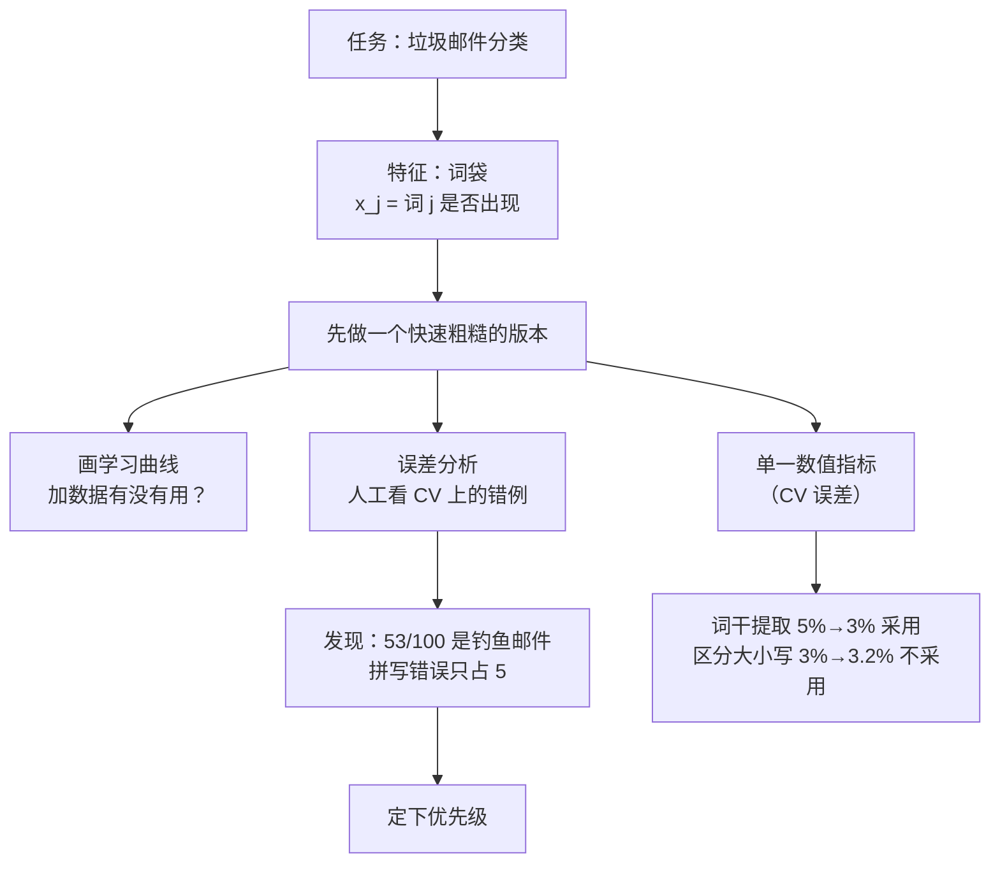

# C6.1 系统设计的起点：垃圾邮件分类与误差分析

> [!abstract] 本讲任务
> 前五章学的都是**算法**：线性回归、逻辑回归、K-means、异常检测……但真要做出一个能用的系统，最难的往往不是“选哪个算法”，而是：
>
> **时间有限，下一步该干什么？**
>
> 这一章换个视角，讲**怎么做机器学习项目**。这一讲回答：
> 1. 一个垃圾邮件分类器，特征 $x$ 怎么从一封邮件里造出来？
> 2. 能改进的方向有一大堆，**先做哪个？**
> 3. **误差分析**具体怎么做？
> 4. 为什么一定要有一个**单一的数值指标**？

---

## 1. 一个具体的任务：垃圾邮件分类

### 1.1 两封邮件

课件 p2 放了两封邮件并排：

| 左边 | 右边 |
|---|---|
| From: cheapsales@buystufffromme.com Subject: Buy now! Deal of the week! Buy now! Rolex **w4tchs** - \$100 **Med1cine** (any kind) - \$50 Also low cost **M0rgages** available. | From: Alfred Ng Subject: Christmas dates? Hey Andrew, Was talking to Mom about plans for Xmas. When do you get off work. Meet Dec 22? Alf |

> [!note] 课堂板书
> ![[C6.1-板书-垃圾邮件与正常邮件.png]]
>
> 板书在左边写 **Spam (1)**，右边写 **Non-spam (0)**——即标签 $y=1$ 表示垃圾邮件、$y=0$ 表示正常邮件。并把左边的 **w4tchs**、**Med1cine**（其中的 “1” 还单独框了出来）、**M0rgages** 逐个划线：这些是**故意拼错**的词，用来绕过关键词过滤。后面误差分析会用到这一点。

### 1.2 把一封邮件变成向量 $x$

课件 p3：

> Supervised learning. $x$ = features of email. $y$ = spam (1) or not spam (0).
> Features $x$: Choose 100 words indicative of spam/not spam.

> [!note] 课堂板书（特征的构造方法整个是手写的）
> ![[C6.1-板书-词袋特征向量.png]]
>
> 板书写了三样：
> 1. 候选词举例：**E.g. deal, buy, discount, andrew, now, …**
> 2. 特征的定义：
>    $$x_j=\begin{cases}1 & \text{if word } j \text{ appears in email}\\ 0 & \text{otherwise}\end{cases}$$
> 3. 对右边那封垃圾邮件，写出它的特征向量（词表按字母序排）：
>    $$x=\begin{bmatrix}0\\1\\1\\0\\\vdots\\1\\\vdots\end{bmatrix}\begin{matrix}\text{andrew}\\\text{buy}\\\text{deal}\\\text{discount}\\\vdots\\\text{now}\\\vdots\end{matrix}\qquad x\in\mathbb{R}^{100}$$
>    同时在邮件原文里把 **Buy**、**Deal**、**now** 划了线——出现了，所以对应位置是 1；**andrew** 没出现，是 0。

这种表示法叫**词袋模型 bag-of-words**（**拓展**：课件没给名字）：只记“某个词在不在”，不管词序、不管出现几次。

> [!warning] 课件的补充说明（p3 最后一行）
> **Note: In practice, take most frequently occurring $n$ words (10,000 to 50,000) in training set, rather than manually pick 100 words.**
>
> 实际做的时候**不要手挑 100 个词**，而是把训练集里**出现最频繁的 $n$ 个词**（$n$ 在一万到五万）直接当词表。手挑的词表带着人的偏见，而且太小。

> [!question] 为什么 “andrew” 也在候选词里
> “andrew” 是收件人的名字。**垃圾邮件群发，一般不知道你叫什么；认识你的人才会写 “Hey Andrew”。**所以“出现收件人名字”是一个指向**正常邮件**的信号。特征不一定都要指向 $y=1$，指向 $y=0$ 的同样有用——逻辑回归会给它学一个负的权重。

---

## 2. 时间该花在哪儿

### 2.1 一堆看起来都有道理的方向

课件 p4：**How to spend your time to make it have low error?**

- **收集大量数据**——例如 “honeypot”（蜜罐）项目：故意注册一批假邮箱地址放出去，专门吸引垃圾邮件，从而批量拿到带标签的垃圾邮件样本。
- **基于邮件路由信息（邮件头）开发复杂特征**——垃圾邮件常用伪造的发件服务器、经过奇怪的中转路径。
- **针对正文开发复杂特征**——例如 “discount” 和 “discounts” 应该当成同一个词吗？“deal” 和 “Dealer” 呢？标点符号能不能当特征？
- **开发检测故意拼写错误的算法**——如 m0rtgage、med1cine、w4tches。

> [!question] 停一下，先自己想
> 四个方向，每个都要花几周甚至几个月。**你会先做哪个？凭什么？**

最常见的做法是**凭直觉挑一个**，然后一头扎进去干三个月。这一讲的全部内容就是为了**避免这种赌博**。

---

## 3. 推荐的做法

课件 p6 **Recommended approach** 三条：

> [!important] 三步走
> 1. **先做一个简单、能快速实现的算法**，实现它，并在交叉验证集上测试。
>    （Start with a simple algorithm that you can implement quickly. Implement it and test it on your cross-validation data.）
> 2. **画学习曲线**，判断更多数据、更多特征等**是否可能有帮助**。
>    （Plot learning curves to decide if more data, more features, etc. are likely to help.）
> 3. **误差分析**：人工检查算法在**交叉验证集**上犯错的样本，看能不能发现它**在哪一类样本上系统性地出错**。
>    （Manually examine the examples (in cross validation set) that your algorithm made errors on. See if you spot any systematic trend in what type of examples it is making errors on.）

> [!tip] 为什么先做“简单”的
> 一个“快速粗糙”的版本（一天就能跑起来）的价值不在于它的准确率，而在于**它能告诉你错在哪里**。没有它，你连“该改进什么”都只能靠猜。**过早优化是万恶之源**——这句程序员格言在机器学习里同样成立。

> [!note] 关于“学习曲线”（**拓展**）
> 第 2 条提到的学习曲线，是把训练误差 $J_{train}$ 和交叉验证误差 $J_{cv}$ 画成**训练集大小 $m$ 的函数**。它的读法在 [[C8.1 大数据集与随机梯度下降]] 1.2 里有一张课件原图：
> - 两条曲线**之间还有很大的缝**（高方差 / 过拟合）→ **加数据有用**；
> - 两条曲线**早早贴在一起、而且都很高**（高偏差 / 欠拟合）→ 加数据没用，该加特征或换更复杂的模型。
>
> 偏差与方差的概念见 [[C2.7 过拟合与正则化]]。

---

## 4. 误差分析：一个完整的例子

课件 p7 给了一组具体数字。

### 4.1 设定

- 交叉验证集 $m_{CV}=500$ 封邮件
- 算法**错分了 100 封**
- **人工检查这 100 封**，按两个维度分类：
  - **(i) 这是什么类型的邮件**
  - **(ii) 哪些线索（特征）本可以帮算法分对**

> [!note] 课堂板书（所有计数都是手写的，课件正文只有类别名）
> ![[C6.1-板书-误差分析分类计数.png]]
>
> 板书在 “What type of email it is” 后面补写了例子：**pharma, replica, steal passwords, …**，然后在两栏里逐一填上计数：
>
> | (i) 邮件类型 | 数量 | | (ii) 能帮上忙的线索 | 数量 |
> |---|---|---|---|---|
> | Pharma（卖药） | **12** | | Deliberate misspellings 故意拼错（m0rgage, med1cine…） | **5** |
> | Replica/fake（仿冒品） | **4** | | Unusual email routing 异常路由 | **16** |
> | **Steal passwords（盗号 / 钓鱼）** | **53** | | **Unusual (spamming) punctuation 异常标点** | **32** |
> | Other（其他） | **31** | | ⋮ | |
>
> “Steal passwords” 前面画了**红色箭头**；右栏的 “Deliberate misspellings” 和 “Unusual punctuation” 前面画了粉色箭头。

### 4.2 从这张表读出什么

**左栏（类型）**：$12+4+53+31=100$，加起来正好是错分的总数。**超过一半（53 封）是盗号 / 钓鱼邮件**。

> [!important] 结论一：该把力气花在钓鱼邮件上
> 算法对卖药、仿冒品的广告邮件问题不大，**真正的短板是钓鱼邮件**。下一步应该专门研究钓鱼邮件有什么特征——比如链接指向的域名和显示的文字不符、要求“验证账户”之类——并为它们设计特征。
>
> 反过来，**卖药邮件只错了 12 封**。就算你花一个月把卖药邮件的错误全消灭，错误率也最多从 $\frac{100}{500}=20\%$ 降到 $\frac{88}{500}=17.6\%$。

**右栏（线索）**：三类线索**可以重叠**（一封邮件可能既拼错词又用了怪标点），所以不必加起来等于 100。

> [!important] 结论二：故意拼错这件事，不值得先做
> 第 2 节列出的第 4 个方向——“开发检测拼写错误的算法”——**只能帮到 5 封**。它听上去很酷，但**数据说它的优先级最低**。
>
> 相比之下，**异常标点能帮到 32 封**，异常路由 16 封。**先做标点特征。**

> [!tip] 这就是误差分析的全部价值
> 不看数据，四个方向**看起来一样重要**。看了 100 个错例、花了一个下午，**优先级立刻清清楚楚**。这比盲目地挑一个方向做三个月要划算得多。

---

## 5. 为什么必须有一个数值指标

### 5.1 误差分析不是万能的

课件 p8 用“词干提取”举例。

> Should **discount / discounts / discounted / discounting** be treated as the same word?
> Can use **“stemming”** software (E.g. “Porter stemmer”)

**词干提取 stemming**：把一个词的各种屈折形式砍成同一个词干。四个 discount 家族的词都变成 “discount”，于是它们在特征向量里共用一个位置。

但它也会**误伤**：课件接着写了 **universe / university**——Porter stemmer 会把这两个完全不相干的词都砍成 “univers”，硬说它们是同一个词。

> [!note] 课堂板书
> ![[C6.1-板书-词干提取的数值评估.png]]
>
> 板书在 discount / discounts / discounted / discounting 四个词里都把共同的词干 “**discou**” 划了线；在 universe / university 里把共同的 “**univer**” 划了线——直观地展示了“砍词干”会把什么合到一起、也会把什么**错误地**合到一起。

> [!important] 课件原话
> **Error analysis may not be helpful for deciding if this is likely to improve performance. Only solution is to try it and see if it works.**
>
> 误差分析**回答不了**“要不要用词干提取”这个问题——它有好处也有坏处，好坏各占多少，看错例是看不出来的。**唯一的办法是：试一下，看结果。**

### 5.2 “看结果”要看什么

> **Need numerical evaluation (e.g., cross validation error) of algorithm's performance with and without stemming.**

必须有一个**单一的数字**（例如交叉验证误差），在“用”和“不用”两种情况下各算一次，直接比大小。

> [!note] 课堂板书（数值全是手写的）
> 板书在课件留空的地方填上了一组示例结果：
>
> | 方案 | 交叉验证误差 |
> |---|---|
> | Without stemming（不做词干提取） | **5%** |
> | With stemming（做词干提取） | **3%** |
> | Distinguish upper vs. lower case（再区分大小写，Mom / mom） | **3.2%** |

**读法**：

- 词干提取：$5\%\to3\%$，**降了，采用**。
- 在词干提取的基础上再区分大小写：$3\%\to3.2\%$，**升了，不采用**。

> [!important] 一个数字把争论变成了比大小
> 没有这个数字，“要不要区分大小写”可以争一下午（“Mom 大写是称呼、小写可能是别的意思……”）。有了它，**几秒钟就决定了**：3.2% > 3%，不要。
>
> 这正是 [[C5.2 异常检测算法与系统评估]] 4.1 讲过的 **real-number evaluation**：**先定一个单一实数指标，然后所有决策都变成比大小。**

> [!warning] 在交叉验证集上比，不要在测试集上比
> 这些“试一下”的决策都是在**调模型**，必须用交叉验证集。如果用测试集来挑选方案，测试集就被“用过”了，最后报出来的测试误差会偏乐观。（同 [[C5.2 异常检测算法与系统评估]] 5.5 的纪律。）

---

## 6. 停一下，我们刚才干了什么

两个工具各管一件事：

- **误差分析**：告诉你**往哪个方向**使劲（定性）。
- **数值指标**：告诉你**这一步有没有用**（定量）。

---

## 7. 这一讲的三句话

> [!important] 三句话
> 1. **垃圾邮件分类的特征用词袋**：选一个词表，$x_j=1$ 当且仅当第 $j$ 个词出现在邮件中，$x\in\mathbb{R}^{n}$；实践中不手挑词，而是取训练集中**最常出现的 $n$ 个词（一万到五万）**。标签 $y=1$ 为垃圾邮件、$y=0$ 为正常邮件。
> 2. **推荐的做法：先快速做一个简单版本并在 CV 上测试 → 画学习曲线看加数据 / 加特征是否有用 → 做误差分析**。误差分析即人工检查 CV 上的错例，按**邮件类型**和**能帮上忙的线索**分类计数。课件例：500 封中错 100 封，其中**钓鱼邮件 53 封**（最大短板），而“故意拼错”只能帮到 5 封（优先级最低）、异常标点能帮到 32 封。
> 3. **误差分析回答不了“某个改动有没有用”，这要靠单一数值指标**（如 CV 误差）：词干提取把误差从 **5% 降到 3%**，采用；再区分大小写升到 **3.2%**，不采用。比较一律在**交叉验证集**上做。

### 速查表

| 名称 | 内容 |
|---|---|
| 标签 | $y=1$ spam，$y=0$ non-spam |
| 词袋特征 | $x_j=1$ 若词 $j$ 出现，否则 0；$x\in\mathbb{R}^{100}$（课件示例） |
| 实践词表 | 训练集中最常出现的 $n$ 个词，$n=10{,}000\sim50{,}000$ |
| 可能的改进方向 | 多收集数据（honeypot）、邮件头路由特征、正文特征（同义词 / 标点）、拼写错误检测 |
| 推荐做法 | ① 快速实现简单算法并在 CV 上测 ② 画学习曲线 ③ 误差分析 |
| 误差分析两个维度 | (i) 邮件类型 (ii) 能帮助分对的线索 |
| 课件计数 | $m_{CV}=500$，错 100：Pharma 12 / Replica 4 / **Steal passwords 53** / Other 31；拼错 5 / 路由 16 / 标点 32 |
| 词干提取 | stemming，如 Porter stemmer；discount 家族合并，但会误合 universe / university |
| 数值评估例 | 无词干提取 5% → 有 3%（采用）→ 再区分大小写 3.2%（不采用） |
| 纪律 | 误差分析定方向，数值指标定取舍；比较在 CV 集上做 |

> [!abstract] 下一讲预告
> 上面这套方法依赖一个前提：**有一个靠得住的数值指标**。“交叉验证误差”听上去理所当然——但它有时会**骗人**。
>
> 设想一个癌症诊断模型，测试集上只错了 1%，听起来很棒。可是如果人群里本来只有 0.5% 的人得癌症，那么一个**什么都不看、一律回答“没得癌症”的程序**，错误率只有 0.5%——比你的模型还低一半。
>
> 下一讲专门处理这种**偏斜类 skewed classes** 的情形：为什么准确率会失效，用什么代替（**精确率、召回率**），两者冲突时怎么权衡（**调阈值**），以及怎么把两个数合成一个数（**$F_1$ 分数**）。

---

上一讲：[[C5.4 多元高斯分布与它的异常检测]]
下一讲：[[C6.2 偏斜类的评估：精确率、召回率与 F1]]
返回：[[机器学习课程 MOC]]
