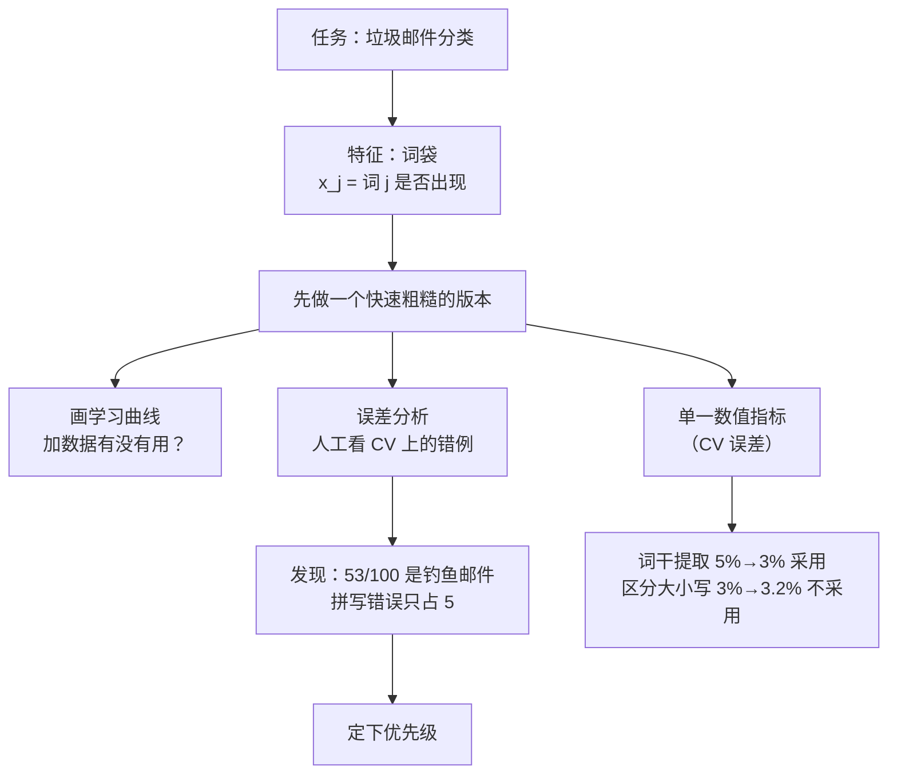

# 第 6 章 · 第 1 讲　系统设计的起点：垃圾邮件分类与误差分析（课堂讲授版）

> [!quote] 本讲开场
> 同学们好。从第 1 章到第 5 章，我们学了决策树、线性回归、逻辑回归、K-means、异常检测……算法学了一堆。可是你有没有停下来想过一个问题：**真到做一个机器学习项目的时候，最难的到底是什么？**
>
> 不是"选哪个算法"。做项目的人最常卡住的是另一件事——**时间有限，下一步我到底该干什么？**
>
> 今天这一讲，我们就用"垃圾邮件分类"这个最经典的系统设计例子，把"怎么做机器学习项目"这件事讲明白。这一讲结束，你要能回答四个问题：
> 1. 一封邮件，怎么变成算法能吃的特征向量 $x$？
> 2. 改进方向一大堆，**先做哪个、凭什么**？
> 3. **误差分析（error analysis）**具体怎么操作？
> 4. 为什么项目里一定要有一个**单一的数值指标**？

好，我们开始。

---

## 一、任务设定：一封邮件怎么变成数据

### 1.1 先看两封邮件

我们先从任务本身说起。课件第 2 页并排放了两封邮件，左边一封、右边一封。大家先别急着看公式，就把自己当成一个要写垃圾邮件过滤器的人，看看这两封邮件长什么样。

左边这封（垃圾邮件）：

> From: cheapsales@buystufffromme.com
> Subject: Buy now!
> Deal of the week! Buy now!
> Rolex **w4tchs** - \$100
> **Med1cine** (any kind) - \$50
> Also low cost **M0rgages** available.

右边这封（正常邮件）：

> From: Alfred Ng
> Subject: Christmas dates?
> Hey Andrew,
> Was talking to Mom about plans for Xmas. When do you get off work. Meet Dec 22?
> Alf

大家看，这两封邮件长得完全不一样。做监督学习，第一件事就是**定标签**：左边这种垃圾邮件记作 $y=1$（spam），右边这种正常邮件记作 $y=0$（non-spam）。这个约定全场通用，大家记下来：**$y=1$ 永远是"垃圾邮件"这一边。**

> [!note] 大家看这张课堂板书
> ![[C6.1-板书-垃圾邮件与正常邮件.png]]
> 老师在板书上给左边标了 **Spam (1)**、右边标了 **Non-spam (0)**，并且把左边邮件里的 **w4tchs**、**Med1cine**、**M0rgages** 三个词逐个划了线。注意看：这三个词都是**故意拼错**的——Rolex 拼成 w4tchs，Medicine 拼成 Med1cine（中间的 "1" 还被单独框了出来），Mortgage 拼成 M0rgages。
>
> 为什么要故意拼错？因为早期的垃圾邮件过滤器靠"关键词黑名单"，看到 "medicine" 就拦截。发垃圾邮件的人也不笨：你把 "medicine" 拉黑，我就写成 "med1cine"，照样绕过去。**记住这一点，后面误差分析还会用到**——"检测拼写错误"会是我们第 2 节要讨论的候选改进方向之一。

### 1.2 把一封邮件变成特征向量 $x$：词袋模型

好，标签有了。但算法吃不了"邮件文本"——它只能吃数字。所以第二步：**把一封邮件表示成一个特征向量 $x$。**

课件 p3 的原话是：

> Supervised learning. $x$ = features of email. $y$ = spam (1) or not spam (0).
> Features $x$: Choose 100 words indicative of spam/not spam.

特征怎么构造？这里有一个非常朴素、但特别实用的方法，大家看板书（下图）：

> [!note] 特征构造方法（整块都是老师手写的）
> ![[C6.1-板书-词袋特征向量.png]]
> 1. 先选一批候选词，比如 **deal、buy、discount、andrew、now……**；
> 2. 定义特征：
>    $$x_j=\begin{cases}1 & \text{如果词 } j \text{ 出现在这封邮件里}\\ 0 & \text{否则}\end{cases}$$
> 3. 对左边那封垃圾邮件，把词表按字母序排好，写出它的特征向量：
>    $$x=\begin{bmatrix}0\\1\\1\\0\\\vdots\\1\\\vdots\end{bmatrix}\begin{matrix}\text{andrew}\\\text{buy}\\\text{deal}\\\text{discount}\\\vdots\\\text{now}\\\vdots\end{matrix}\qquad x\in\mathbb{R}^{100}$$
>    老师在邮件原文里把 **Buy**、**Deal**、**now** 划了线——这三个词出现了，所以对应位置是 1；**andrew** 没出现，所以是 0。

这个做法有一个名字，叫**词袋模型 bag-of-words**（课件没给名字，但这是行业标准叫法，**拓展**）。它的思想就一句话：**只问"这个词在不在"，不问词序、不问出现几次。**

大家想想，为什么"不问词序"也能行？因为对判断垃圾邮件来说，"Buy now" 和 "now buy" 其实没啥区别——**关键词有没有出现，比它们怎么排列，携带的信息量大得多**。词袋模型牺牲掉词序信息，换来的是极其简单、极其好算的表示。这在文本分类里是最常用的起点。

课件 p3 最后还有一行小字，非常关键，我念给大家：

> **Note: In practice, take most frequently occurring $n$ words (10,000 to 50,000) in training set, rather than manually pick 100 words.**

**实际做的时候，不要手挑 100 个词！** 正确做法是：把训练集里**出现最频繁的 $n$ 个词**（$n$ 在一万到五万之间）直接拿来当词表。为什么？手挑的词表带着人的偏见——你觉得重要的词，未必是数据里真正有区分力的词；而且 100 个词太少了，词表至少得上万，才能覆盖真实邮件里的各种说法。

> [!question] 有个地方大家可能没想通：为什么 "andrew" 也在候选词里？
> "andrew" 是收件人的名字。你想：垃圾邮件是群发的，发垃圾邮件的人**根本不知道你叫什么**；反过来，认识你的人写邮件才会写 "Hey Andrew"。
>
> 所以"邮件里出现了收件人的名字"是一个指向**正常邮件**的信号。这提醒大家一个观念：**特征不一定要指向 $y=1$，指向 $y=0$ 的特征同样有价值**——逻辑回归会给它自动学出一个负的权重：出现 andrew 时，降低这封邮件是垃圾邮件的概率。

好，特征问题解决了。任务设定完成：**输入一封邮件 → 词袋特征向量 $x\in\mathbb{R}^n$ → 分类器输出 $y=1$（垃圾）或 $y=0$（正常）。**

---

## 二、时间该花在哪儿：一堆看起来都对的方向

接下来是这一讲真正的主题：**项目决策。**

假设现在你拿到一个任务：把垃圾邮件分类器做好。课件 p4 问了这样一个问题：**How to spend your time to make it have low error?**——时间有限，怎么花，才能把错误率降下来？

你面前摆着四个候选方向，每一个听起来都有道理：

1. **收集大量数据。** 比如搞一个 "honeypot"（蜜罐）项目：故意注册一批假邮箱地址放出去，专门用来"钓鱼"，把收到的垃圾邮件批量收集起来，就有了大量带标签的垃圾邮件样本。
2. **基于邮件路由信息（邮件头）开发复杂特征。** 垃圾邮件常常用伪造的发件服务器、经过奇怪的中转路径——这些信息在邮件头里，也许能当特征。
3. **针对正文开发复杂特征。** 比如 "discount" 和 "discounts" 该不该当成同一个词？"deal" 和 "Dealer" 呢？标点符号能不能当特征？
4. **开发检测故意拼写错误的算法。** 还记得 m0rtgage、med1cine、w4tches 吗？专门写个算法把它们揪出来。

> [!question] 停一下，先自己想
> 这四个方向，每个都要花几周甚至几个月。**你会先做哪个？凭什么？**

我猜大多数同学的做法是：凭直觉挑一个看起来最酷的，一头扎进去干三个月。这一讲的全部内容，就是为了**避免这种赌博**。

凭直觉选方向为什么危险？因为**你没有任何证据**说明这个方向能降低错误率。方向 4（检测拼写错误）听起来很酷——"哇，我能识别故意拼错的词"——但它到底能帮上多大忙？可能只能救回 5 封邮件。不先做调查，你根本不知道。

---

## 三、推荐的做法：三步走

那正确的做法是什么？课件 p6 给了 **Recommended approach**，三步：

> [!important] 三步走（老师强烈建议大家背下来）
> 1. **先做一个简单、能快速实现的算法**，实现它，并在交叉验证集上测试。
>    （Start with a simple algorithm that you can implement quickly. Implement it and test it on your cross-validation data.）
> 2. **画学习曲线**，判断更多数据、更多特征等**是否可能有帮助**。
>    （Plot learning curves to decide if more data, more features, etc. are likely to help.）
> 3. **误差分析**：人工检查算法在**交叉验证集**上犯错的样本，看能不能发现它**在哪一类样本上系统性地出错**。
>    （Manually examine the examples (in cross validation set) that your algorithm made errors on. See if you spot any systematic trend in what type of examples it is making errors on.）

大家注意，第一步是"**简单**、能**快速**实现"的算法。为什么？

一个一天就能跑起来的粗糙版本，准确率可能不怎么样——但它的价值**根本不在于准确率**，而在于：**它能告诉你错在哪里。** 有了它，你才有"该改进什么"的线索；没有它，你连该往哪儿使劲都只能靠猜。

程序员的格言在这里完全成立：**过早优化是万恶之源。** 机器学习里也一样——先让系统跑起来，再用数据决定往哪改进，而不是先花三个月猜一个方向。

> [!note] 关于第 2 步"学习曲线"（**拓展**）
> 第 2 步提到的学习曲线，是把训练误差 $J_{train}$ 和交叉验证误差 $J_{cv}$ 画成**训练集大小 $m$ 的函数**。怎么读它，[[C8.1 大数据集与随机梯度下降]] 里有课件原图，这里先剧透结论：
> - 两条曲线**之间还有很大的缝**（高方差 / 过拟合）→ **加数据有用**；
> - 两条曲线**早早贴在一起、而且都很高**（高偏差 / 欠拟合）→ 加数据没用，该加特征或换更复杂的模型。
>
> 偏差与方差的概念见 [[C2.7 过拟合与正则化]]。这一讲先记住"画学习曲线"这个动作，第 8 章会专门用一整讲讲它在大数据场景下的用法。

---

## 四、误差分析：一个完整的例子

三步走里，**误差分析**是这一讲的重点，我们完整地走一遍。课件 p7 给了一组具体数字。

### 4.1 设定

- 交叉验证集有 $m_{CV}=500$ 封邮件；
- 算法**错分了其中 100 封**；
- 现在，**人工检查这 100 封**，按两个维度分类：
  - **(i) 这是什么类型的邮件？**（What type of email it is）
  - **(ii) 哪些线索（特征）本可以帮算法分对？**（What cues/features could have helped）

大家注意一个细节：交叉验证集一共 500 封，错误率是 $100/500=20\%$。100 封错例不算多，人工一封一封看，一个下午就能看完。**这个成本完全值得。**

### 4.2 计数结果

老师把 100 封错例看完，做了两张计数表（见下图，所有数字都是老师手写的）：

> [!note] 课堂板书：误差分析的分类计数
> ![[C6.1-板书-误差分析分类计数.png]]
> 左栏按"邮件类型"计数：
>
> | (i) 邮件类型 | 数量 |
> |---|---|
> | Pharma（卖药） | **12** |
> | Replica/fake（仿冒品） | **4** |
> | **Steal passwords（盗号 / 钓鱼）** | **53** |
> | Other（其他） | **31** |
>
> 右栏按"能帮上忙的线索"计数：
>
> | (ii) 能帮上忙的线索 | 数量 |
> |---|---|
> | Deliberate misspellings 故意拼错（m0rgage, med1cine…） | **5** |
> | Unusual email routing 异常路由 | **16** |
> | **Unusual (spamming) punctuation 异常标点** | **32** |
> | ⋮ | |
>
> 板书上，"Steal passwords" 前面画了**红色箭头**；右栏的 "Deliberate misspellings" 和 "Unusual punctuation" 前面画了粉色箭头。

### 4.3 从这张表里读出结论

先看**左栏（类型）**。大家自己加一下：$12+4+53+31=100$，正好是错分的总数，说明分类是完备的——每一封错例都归了类。而其中**超过一半（53 封）是盗号 / 钓鱼邮件**。

> [!important] 结论一：力气该花在钓鱼邮件上
> 算法对卖药邮件、仿冒品邮件问题不大，**真正的短板是钓鱼邮件**。下一步应该专门研究钓鱼邮件有什么特征——比如链接指向的域名和显示的文字不符、要求"验证账户"之类——并为它们设计特征。
>
> 反过来看卖药邮件：只错了 12 封。就算你花一个月把卖药邮件的错误**全部消灭**，错误率最多从 $\frac{100}{500}=20\%$ 降到 $\frac{88}{500}=17.6\%$。**性价比一目了然。**

再看**右栏（线索）**。大家注意，右栏三类线索**可以重叠**——一封邮件可能既拼错词又用了怪标点，所以右栏的数字**不必**加起来等于 100。

> [!important] 结论二：故意拼错这件事，不值得先做
> 还记得第 2 节那四个候选方向吗？第 4 个方向——"开发检测拼写错误的算法"——**只能帮到 5 封邮件**。它听上去最酷，但数据说它的优先级**最低**。
>
> 相比之下，**异常标点能帮到 32 封**，异常路由能帮到 16 封。**所以先做标点特征。**

> [!tip] 这就是误差分析的全部价值
> 不看数据的时候，四个方向看起来一样重要；看了这 100 个错例、花了一个下午，优先级**立刻清清楚楚**。这比盲目地挑一个方向做三个月，划算太多了。

---

## 五、为什么必须有一个数值指标

误差分析能告诉你"往哪个方向使劲"，但它不是万能的。课件 p8 用"词干提取"举例。

### 5.1 一个误差分析回答不了的问题

> Should **discount / discounts / discounted / discounting** be treated as the same word?
> Can use **"stemming"** software (E.g. "Porter stemmer")

**词干提取 stemming**：把一个词的各种屈折形式砍成同一个词干。比如 discount、discounts、discounted、discounting 四个词，全都砍成 "discount"——于是它们在特征向量里共用一个位置。这样一来，"discount" 这个信号就不会因为拼写形式不同而分散到四个位置。

听上去很好，对不对？但词干提取也会**误伤**。课件接着写了 **universe / university**——Porter stemmer 会把这两个完全不相干的词都砍成 "univers"，硬说它们是同一个词。一个讲宇宙（universe）的邮件和一个讲大学（university）的邮件，被算法当成了一回事。

> [!note] 课堂板书：词干提取的"合并"与"误伤"
> ![[C6.1-板书-词干提取的数值评估.png]]
> 老师在 discount / discounts / discounted / discounting 四个词里把共同的词干 "**discou**" 划了线；在 universe / university 里把共同的 "**univer**" 划了线——直观地展示了"砍词干"会把什么合到一起（好处）、也会把什么**错误地**合到一起（坏处）。

现在问题来了：**到底要不要用词干提取？** 它有好处（同义形式合并），也有坏处（误合并不相干的词）。误差分析能回答吗？

课件 p8 的原话非常直接：

> **Error analysis may not be helpful for deciding if this is likely to improve performance. Only solution is to try it and see if it works.**

**误差分析回答不了"要不要用词干提取"这个问题。** 好坏各占多少，看错例是看不出来的——你没法从 100 封错例里数出"词干提取能救回几封、又会害了哪几封"。**唯一的办法是：试一下，看结果。**

### 5.2 "看结果"要看什么：一个单一的数字

> **Need numerical evaluation (e.g., cross validation error) of algorithm's performance with and without stemming.**

必须有一个**单一的数字**（比如交叉验证误差），在"用词干提取"和"不用词干提取"两种情况下各算一次，直接比大小。老师当场填了一组示例结果（课件这一处本来是留空的）：

> [!note] 课堂板书：数值评估示例
> ![[C6.1-板书-词干提取的数值评估.png]]
>
> | 方案 | 交叉验证误差 |
> |---|---|
> | Without stemming（不做词干提取） | **5%** |
> | With stemming（做词干提取） | **3%** |
> | Distinguish upper vs. lower case（再区分大小写，Mom / mom） | **3.2%** |

大家会读了吧？

- 词干提取：误差从 $5\%$ 降到 $3\%$——**降了，采用**。
- 在词干提取的基础上再区分大小写：从 $3\%$ 涨到 $3.2\%$——**升了，不采用**。

> [!important] 一个数字把争论变成了比大小
> 没有这个数字，"要不要区分大小写"可以争一下午（"Mom 大写是称呼、小写可能是别的意思……"）；有了它，**几秒钟就决定了**：3.2% > 3%，不要。
>
> 这正是 [[C5.2 异常检测算法与系统评估]] 4.1 讲过的 **real-number evaluation**：**先定一个单一实数指标，然后所有决策都变成比大小。**

> [!warning] 一个纪律：在交叉验证集上比，不要在测试集上比
> 这些"试一下"的决策都是在**调模型**，必须用交叉验证集。如果用测试集来挑选方案，测试集就被"用过"了——你是在用测试集调参，最后报出来的测试误差会偏乐观，不能真实反映模型在没见过的数据上的表现。（同 [[C5.2 异常检测算法与系统评估]] 5.5 的纪律，考试可能会问。）

---

## 六、停一下：今天这节课，我们到底干了什么

我们把这一讲的逻辑串一遍：

这一讲给了我们两个工具，它们各管一件事：

- **误差分析**：告诉你**往哪个方向**使劲（定性）。
- **数值指标**：告诉你**这一步有没有用**（定量）。

---

## 本讲小结：今天要记住的三件事

> [!important] 三句话
> 1. **垃圾邮件分类的特征用词袋**：选一个词表，$x_j=1$ 当且仅当第 $j$ 个词出现在邮件中，$x\in\mathbb{R}^{n}$；实践中**不手挑词**，而是取训练集中**最常出现的 $n$ 个词（一万到五万）**。标签 $y=1$ 为垃圾邮件、$y=0$ 为正常邮件；"出现收件人名字"这类指向 $y=0$ 的特征同样有用。
> 2. **推荐的做法是三步走**：先快速做一个简单版本并在 CV 上测试 → 画学习曲线看加数据 / 加特征是否有用 → 做误差分析。误差分析即人工检查 CV 上的错例，按**邮件类型**和**能帮上忙的线索**分类计数。课件例：500 封中错 100 封，其中**钓鱼邮件 53 封**（最大短板，优先做），而"故意拼错"只能帮到 5 封（优先级最低）、异常标点能帮到 32 封。
> 3. **误差分析回答不了"某个改动有没有用"，这要靠单一数值指标**（如 CV 误差）：词干提取把误差从 **5% 降到 3%**，采用；再区分大小写升到 **3.2%**，不采用。比较一律在**交叉验证集**上做。

### 速查表（考试前扫一眼）

| 名称 | 内容 |
|---|---|
| 标签 | $y=1$ spam，$y=0$ non-spam |
| 词袋特征 | $x_j=1$ 若词 $j$ 出现，否则 0；$x\in\mathbb{R}^{100}$（课件示例） |
| 实践词表 | 训练集中最常出现的 $n$ 个词，$n=10{,}000\sim50{,}000$ |
| 可能的改进方向 | 多收集数据（honeypot）、邮件头路由特征、正文特征（同义词 / 标点）、拼写错误检测 |
| 推荐做法 | ① 快速实现简单算法并在 CV 上测 ② 画学习曲线 ③ 误差分析 |
| 误差分析两个维度 | (i) 邮件类型 (ii) 能帮助分对的线索 |
| 课件计数 | $m_{CV}=500$，错 100：Pharma 12 / Replica 4 / **Steal passwords 53** / Other 31；拼错 5 / 路由 16 / 标点 32 |
| 词干提取 | stemming，如 Porter stemmer；discount 家族合并，但会误合 universe / university |
| 数值评估例 | 无词干提取 5% → 有 3%（采用）→ 再区分大小写 3.2%（不采用） |
| 纪律 | 误差分析定方向，数值指标定取舍；比较在 CV 集上做 |

## 下一讲预告

上面这套方法依赖一个前提：**有一个靠得住的数值指标**。"交叉验证误差"听上去理所当然——但它有时会**骗人**。

设想一个癌症诊断模型，测试集上只错了 1%，听起来很棒。可是如果人群里本来只有 0.5% 的人得癌症，那么一个**什么都不看、一律回答"没得癌症"**的程序，错误率只有 0.5%——比你的模型还低一半。你的 1% 错误率，还不如一个啥都不干的笨程序。

下一讲我们专门处理这种**偏斜类 skewed classes** 的情形：为什么准确率会失效，用什么代替（**精确率、召回率**），两者冲突时怎么权衡（**调阈值**），以及怎么把两个数合成一个数（**$F_1$ 分数**）。

---
上一讲：[[C5.4 多元高斯分布与它的异常检测]]
下一讲：[[C6.2 偏斜类的评估：精确率、召回率与 F1（讲授版）]]
返回：[[机器学习课程 MOC]]
