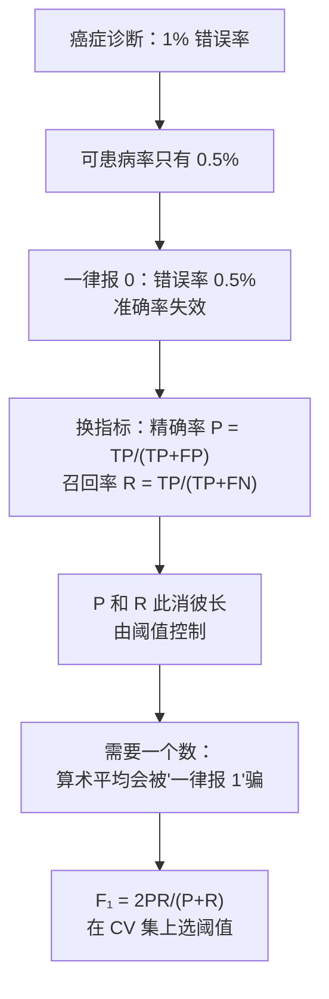

# C6.2 偏斜类的评估：精确率、召回率与 F1

> [!abstract] 本讲任务
> [[C6.1 系统设计的起点：垃圾邮件分类与误差分析]] 说：所有决策都靠一个**单一数值指标**比大小。可如果这个指标本身就会骗人呢？
>
> 这一讲回答：
> 1. 为什么在**偏斜类**上，“错误率 / 准确率”会骗人？
> 2. 用什么代替？——**精确率 Precision** 和 **召回率 Recall**
> 3. 两者冲突时怎么办？——**调阈值**
> 4. 两个数怎么合成一个数？——**$F_1$ 分数**，以及为什么**不能用算术平均**
>
> 这些概念在 [[C5.2 异常检测算法与系统评估]] 5.3 已经用过一次。这一讲是它们在**监督学习**里的正式出场，课件从头讲了一遍，并补上了“调阈值”这一块。

---

## 1. 准确率为什么会骗人

### 1.1 一个听起来很棒的模型

课件 p10：

> Train logistic regression model $h_\theta(x)$. ($y=1$ if cancer, $y=0$ otherwise)
> Find that you got **1% error** on test set. (**99%** correct diagnoses)

99% 的诊断都对了。听起来可以上线了。

> [!question] 停一下，先自己想
> 课件下一句是：**Only 0.50% of patients have cancer.**（只有 0.5% 的病人真的得了癌症。）
>
> 知道这个之后，1% 的错误率还好吗？

### 1.2 一个什么都不做的“模型”

课件紧接着给了一段代码：

```matlab
function y = predictCancer(x)
  y = 0;  %ignore x!
return
```

**无论输入什么，一律预测“没得癌症”。** 它连 $x$ 都不看。

它的错误率是多少？它只会在真正得癌症的人身上出错，而这些人只占 0.5%。所以

$$\text{错误率}=0.5\%$$

**比我们辛辛苦苦训练的逻辑回归（1%）还低一半。**

> [!note] 课堂板书
> ![[C6.2-板书-癌症分类与偏斜类.png]]
>
> 板书内容：
> - 把 **1% error** 框出来，把 **99%**、**0.50%** 划线。
> - 在 0.50% 下面引出箭头写 **skewed classes**（偏斜类）——这是本讲的主角。
> - 把 `y = 0; %ignore x!` 那一行用红括号括起，引出箭头写 **0.5% error**。
> - 下面写了两行对比：
>   - → **99.2% accuracy（0.8% error）**
>   - → **99.5% accuracy（0.5% error）**

> [!important] 板书那两行的意思
> 假设你改进了算法，准确率从 **99.2% 提升到 99.5%**。**这是真的进步吗？**
>
> 不一定。从 99.2% 到 99.5%，可能只是你的算法**变得更倾向于预测 $y=0$** 了——越来越接近那个“一律说没病”的笨程序。准确率涨了，但它**抓到的癌症病人可能反而变少了**。
>
> **在偏斜类上，准确率的提升不代表模型变好。**

> [!important] 偏斜类 Skewed Classes 的定义
> 某一类（通常是我们关心的 $y=1$）的样本**远远少于**另一类。癌症 0.5%、欺诈交易、罕见故障、垃圾邮件在某些场景下……都是偏斜类。
>
> 在这种情形下，“永远预测多数类”就能拿到很高的准确率，所以**准确率失去了区分力**。

---

## 2. 精确率与召回率

### 2.1 约定

课件 p11 第一句：

> **$y=1$ in presence of rare class that we want to detect.**

**把我们想检测的那个稀有类记作 $y=1$**（正类）。在癌症例子里，$y=1$ 就是“得了癌症”。这个约定很重要，因为下面所有公式都是围绕 $y=1$ 写的。

### 2.2 四格表

> [!note] 课堂板书（四格表整个是手写的）
> ![[C6.2-板书-混淆矩阵与精确率召回率.png]]
>
> 板书画出了下面这张表（列是真实类别 Actual class，行是预测类别 Predicted class），四格分别用不同颜色写：
>
> | | **实际 1** | **实际 0** |
> |---|---|---|
> | **预测 1** | **True positive**（蓝，真正例） | **False positive**（红，假正例） |
> | **预测 0** | **False negative**（粉，假负例） | **True negative**（绿，真负例） |
>
> 然后在右边把精确率和召回率**用四格表里的名字重写了一遍**，颜色与四格一一对应（见下）。
>
> 左下角还用红笔写了：**$y=0$，recall $=0$** ——即那个“一律预测 0”的笨程序，召回率是 0。

这张表叫**混淆矩阵 confusion matrix**（**拓展**：课件没给名字）。命名规则：

- 第二个词（positive / negative）= **你预测的是什么**
- 第一个词（true / false）= **你预测得对不对**

所以 “False positive” = 你预测了 positive（$y=1$），但预测错了（其实是 0）= **误报**；“False negative” = 你预测了 negative，但预测错了 = **漏报**。

### 2.3 两个定义

**精确率 Precision**

> Of all patients where we predicted $y=1$, what fraction actually has cancer?
> （在所有我们**预测**为患癌的病人中，有多少比例**真的**患癌？）

$$P=\frac{\text{True positives}}{\#\text{predicted positive}}=\frac{TP}{TP+FP}$$

**召回率 Recall**

> Of all patients that actually have cancer, what fraction did we correctly detect as having cancer?
> （在所有**真正**患癌的病人中，我们**正确检出**了多少比例？）

$$R=\frac{\text{True positives}}{\#\text{actual positives}}=\frac{TP}{TP+FN}$$

> [!tip] 一对好记的问法
> - **精确率问“报得准不准”**：我说有病的，有几个真有病？分母是**我报出来的**。
> - **召回率问“找得全不全”**：真有病的，我找出了几个？分母是**真实存在的**。
>
> 两者分子一样（都是 TP），**只差在分母**：精确率除以“预测为正的”（一行），召回率除以“实际为正的”（一列）。

### 2.4 笨程序被当场识破

对“一律预测 $y=0$”的程序：它**从不预测 1**，所以 $TP=0$。

$$R=\frac{0}{0+FN}=0$$

召回率为 0——它一个癌症病人都没找到。（精确率是 $\frac00$，无定义。）**准确率说它 99.5% 好，召回率说它毫无用处。**这就是板书左下角那句 “$y=0$，recall $=0$” 的意思。

> [!important] 为什么两个指标能防住作弊
> 一个分类器想同时拿到**高精确率和高召回率**，就必须**真的**把正类和负类分开。任何“偷懒”的策略——一律报 0、一律报 1——都会让其中一个指标崩掉。

---

## 3. 精确率和召回率的权衡

### 3.1 阈值在哪里

回忆 [[C2.5 逻辑回归]]：逻辑回归输出 $0\le h_\theta(x)\le1$，表示 $P(y=1\mid x;\theta)$。默认的决策规则是

$$\text{Predict 1 if } h_\theta(x)\ge0.5,\qquad \text{Predict 0 if } h_\theta(x)<0.5$$

那个 **0.5 不是天经地义的**。课件 p13 的主题就是：**动这个阈值，精确率和召回率会此消彼长。**

### 3.2 两种需求

> [!note] 课堂板书
> ![[C6.2-板书-调阈值权衡.png]]
>
> 板书在 “Predict 1 if $h_\theta(x)\ge$ **0.5**” 的 0.5 上**连续划掉、改写了三次**：0.5 → **0.7** → **0.9**（这两个都被划掉） → **0.3**（红笔，保留）。“Predict 0 if” 那一行同步改写。
>
> 然后在两种需求下面分别写出结论：
> - Suppose we want to predict $y=1$ (cancer) **only if very confident** → **Higher precision, lower recall.**
> - Suppose we want to **avoid missing too many cases of cancer** (avoid false negatives) → **Higher recall, lower precision.**
>
> 右边的精确率—召回率曲线上，左上端点标 **threshold $=0.99$**，右下端点标 **threshold $=0.01$**。最后一行 “More generally: Predict 1 if $h_\theta(x)\ge$ threshold” 被蓝框框出、加了红箭头。

**需求一：只在非常有把握时才说“你得了癌症”**

误诊一个健康人为癌症，会给他带来巨大的心理压力和不必要的治疗。所以只在很有把握时才报。

→ **阈值调高**（0.7、0.9）→ 报得少、报得准 → **精确率高、召回率低**。

**需求二：尽量别漏掉癌症病人**

漏诊一个癌症病人，他可能错过最佳治疗时机。宁可多报几个让他们去复查。

→ **阈值调低**（0.3）→ 报得多、找得全 → **召回率高、精确率低**。

> [!important] 一般形式
> $$\text{Predict 1 if } h_\theta(x)\ge\text{threshold}$$
> **threshold 是一个你要根据业务需求选的数**，不是固定的 0.5。它控制着精确率和召回率之间的交换。

### 3.3 精确率—召回率曲线

把阈值从 0.99 一路调到 0.01，每个阈值算一对 $(R,P)$，画出来就是**精确率—召回率曲线**。

- **左上端**（threshold $\approx0.99$）：几乎只报最有把握的 → $P$ 高、$R$ 低。
- **右下端**（threshold $\approx0.01$）：几乎全报 → $R$ 高、$P$ 低。

课件图里画了三条形状不同的曲线（蓝、红、粉），说明**曲线的具体形状取决于模型和数据**，可能凸、可能凹、可能接近直线。

![[C6-阈值与精确率召回率.png]]

（上图是一次模拟：5000 个样本中只有 25 个正例（0.5%），逻辑回归式的得分。左图横轴是阈值：阈值越高，精确率越高、召回率越低，$F_1$ 在中间取到峰值；右图是同一组数据的精确率—召回率曲线。）

> [!question] 能不能自动选阈值？
> 能。这就引出下一节：先把 $P$ 和 $R$ 合成**一个数**，然后在交叉验证集上**选让这个数最大的阈值**。

---

## 4. $F_1$ 分数

### 4.1 问题：三个算法，选哪个？

课件 p14：**How to compare precision/recall numbers?**

| | Precision (P) | Recall (R) |
|---|---|---|
| Algorithm 1 | 0.5 | 0.4 |
| Algorithm 2 | 0.7 | 0.1 |
| Algorithm 3 | 0.02 | 1.0 |

两个指标意味着**两个数**，而 [[C6.1 系统设计的起点：垃圾邮件分类与误差分析]] 说过，决策需要**一个数**。

### 4.2 朴素尝试：算术平均

$$\text{Average}=\frac{P+R}{2}$$

| | $P$ | $R$ | $\frac{P+R}{2}$ |
|---|---|---|---|
| Algorithm 1 | 0.5 | 0.4 | 0.45 |
| Algorithm 2 | 0.7 | 0.1 | 0.40 |
| **Algorithm 3** | 0.02 | 1.0 | **0.51** ← 最高 |

算术平均选中了 **Algorithm 3**。

> [!note] 课堂板书
> ![[C6.2-板书-F1分数.png]]
>
> 板书在 Algorithm 3 那一行旁边写：**Predict $y=1$ all the time**（一律预测 $y=1$）——并**用红笔把 $\frac{P+R}{2}$ 整个打叉划掉**，旁边又画了一个大红叉。

> [!warning] Algorithm 3 就是个笨程序
> $R=1.0$、$P=0.02$：它**把所有人都报成癌症**。召回率当然是 100%（一个没漏），精确率就是患病率本身（这里约 2%）。
>
> 这和第 1 节“一律报 0”是**同一种作弊**，只是方向反过来。**算术平均被它骗了**，因为 $R=1.0$ 这个大数可以把 $P=0.02$ 的惨状“平均掉”。

### 4.3 $F_1$ 分数

$$\boxed{\;F_1=2\,\frac{PR}{P+R}\;}$$

它是 $P$ 和 $R$ 的**调和平均**：$F_1=\dfrac{2}{\frac1P+\frac1R}$。

| | $P$ | $R$ | $\frac{P+R}{2}$ | $F_1$ |
|---|---|---|---|---|
| **Algorithm 1** | 0.5 | 0.4 | 0.45 | **0.444** ← 最高 |
| Algorithm 2 | 0.7 | 0.1 | 0.40 | 0.175 |
| Algorithm 3 | 0.02 | 1.0 | 0.51 | 0.039 |

$F_1$ 选中了 **Algorithm 1**——$P$ 和 $R$ 都不算高，但**两个都不差**。

验算 Algorithm 1：$F_1=2\times\frac{0.5\times0.4}{0.5+0.4}=2\times\frac{0.2}{0.9}=0.444$。

> [!note] 课堂板书（同一页）
> 板书把分子 **$PR$ 圈了出来**，并在右侧写出 $F_1$ 的两个端点性质：
>
> $$P=0\ \text{or}\ R=0\;\Rightarrow\;F\text{-score}=0$$
> $$P=1\ \text{and}\ R=1\;\Rightarrow\;F\text{-score}=1$$

> [!important] 为什么把 $PR$ 圈出来
> 分子是**乘积** $PR$。**只要有一个是 0，乘积就是 0**，整个 $F_1$ 就是 0——不管另一个多大。这就是它能识破“一律报 1 / 一律报 0”的原因：这两种作弊都会让 $P$ 或 $R$ 趋近于 0。
>
> 反过来，只有 $P$ 和 $R$ **都等于 1**，$F_1$ 才能到 1。**$F_1$ 的取值范围是 $[0,1]$，而且它会被 $P,R$ 中较小的那个拖住。**

### 4.4 怎么用

课件标题里写的是 **$F_1$ Score (F score)**。实践流程：

1. 训练好模型 $h_\theta(x)$。
2. 在**交叉验证集**上，对一串候选阈值（如 0.1, 0.2, …, 0.9）分别算 $P$、$R$、$F_1$。
3. **选 $F_1$ 最大的那个阈值。**
4. 在测试集上报告最终性能。

这和 [[C5.2 异常检测算法与系统评估]] 5.5 用 CV 集选 $\varepsilon$ 完全是同一个流程——那里的 $\varepsilon$ 就是这里的 threshold。

> [!tip] $F_1$ 不是唯一选择（**拓展**）
> 如果漏报的代价远大于误报（癌症诊断），可以用 $F_\beta=\dfrac{(1+\beta^2)PR}{\beta^2P+R}$，$\beta>1$ 时更看重召回率（$\beta=2$ 常见）；反之 $\beta<1$ 更看重精确率。$F_1$ 就是 $\beta=1$、两者同等重要的特例。

---

## 5. 停一下，我们刚才干了什么



---

## 6. 这一讲的三句话

> [!important] 三句话
> 1. **偏斜类上准确率会骗人**：只有 0.5% 的人患癌时，一个无视输入、一律预测 $y=0$ 的程序错误率就只有 0.5%，比 1% 错误率的逻辑回归还“好”；准确率从 99.2% 升到 99.5% 也可能只是模型更偏向预测 0。
> 2. **把稀有类记为 $y=1$，用精确率与召回率评估**：$P=\frac{TP}{TP+FP}$（报出来的有多少是真的）、$R=\frac{TP}{TP+FN}$（真的有多少被报出来）；“一律报 0”的召回率为 0。二者由**阈值**控制此消彼长——**阈值调高 → 精确率高、召回率低**（只在很有把握时报）；**阈值调低 → 召回率高、精确率低**（不愿漏报）。一般形式：Predict 1 if $h_\theta(x)\ge$ threshold。
> 3. **用 $F_1=2\frac{PR}{P+R}$ 把两个数合成一个**：它是调和平均，$P$ 或 $R$ 为 0 则 $F_1=0$，二者都为 1 才等于 1。**不能用算术平均**——课件例中“一律报 1”的算法（$P=0.02,R=1.0$）算术平均 0.51 最高，$F_1$ 只有 0.039；$F_1$ 选中的是 $P=0.5,R=0.4$ 的算法（0.444）。在 CV 集上选 $F_1$ 最大的阈值。

### 速查表

| 名称 | 内容 |
|---|---|
| 偏斜类 | 一类样本远少于另一类；准确率失效 |
| 课件例 | 测试误差 1%，患病率 0.5%；`y=0` 程序误差 0.5% |
| 约定 | 稀有的、想检测的类记为 $y=1$ |
| 混淆矩阵 | 预测 1 实际 1 = TP；预测 1 实际 0 = FP（误报）；预测 0 实际 1 = FN（漏报）；预测 0 实际 0 = TN |
| 精确率 | $P=\dfrac{TP}{\#\text{predicted positive}}=\dfrac{TP}{TP+FP}$ |
| 召回率 | $R=\dfrac{TP}{\#\text{actual positive}}=\dfrac{TP}{TP+FN}$ |
| 一律报 0 | $R=0$ |
| 一律报 1 | $R=1$，$P=$ 正类比例 |
| 阈值规则 | Predict 1 if $h_\theta(x)\ge$ threshold |
| 阈值调高 | 精确率↑ 召回率↓（只在很有把握时预测癌症） |
| 阈值调低 | 召回率↑ 精确率↓（避免漏诊） |
| PR 曲线端点 | threshold 0.99 → 左上（高 P 低 R）；threshold 0.01 → 右下（高 R 低 P） |
| $F_1$ | $F_1=2\dfrac{PR}{P+R}=\dfrac{2}{1/P+1/R}$ |
| $F_1$ 端点 | $P=0$ 或 $R=0\Rightarrow F_1=0$；$P=R=1\Rightarrow F_1=1$ |
| 课件三算法 | (0.5,0.4)：平均 0.45，$F_1$ **0.444**；(0.7,0.1)：0.40，0.175；(0.02,1.0)：**0.51**，0.039 |
| 选阈值 | 在 CV 集上取 $F_1$ 最大者 |
| $F_\beta$（**拓展**） | $\dfrac{(1+\beta^2)PR}{\beta^2P+R}$，$\beta>1$ 偏重召回率 |

> [!abstract] 下一讲预告
> 前两讲讲的是“怎么决定下一步做什么”和“怎么量化做得好不好”。第三个问题是：**要不要花大力气去收集更多数据？**
>
> 课件引了一项 2001 年的研究：四种完全不同的算法，在“区分 to / two / too”这个任务上，随着训练数据从十万增加到十亿，**全都越来越准，而且到最后谁都差不多**。于是有了那句名言：
>
> **“It's not who has the best algorithm that wins. It's who has the most data.”**
>
> 但这句话**不是无条件成立的**。下一讲会讲清楚它什么时候对、什么时候错，并给出一个一句话的判别测试。然后是一个实用技巧：数据不够时，**自己造**——人工数据合成。

---

上一讲：[[C6.1 系统设计的起点：垃圾邮件分类与误差分析]]
下一讲：[[C6.3 数据的力量与人工数据合成]]
返回：[[机器学习课程 MOC]]
