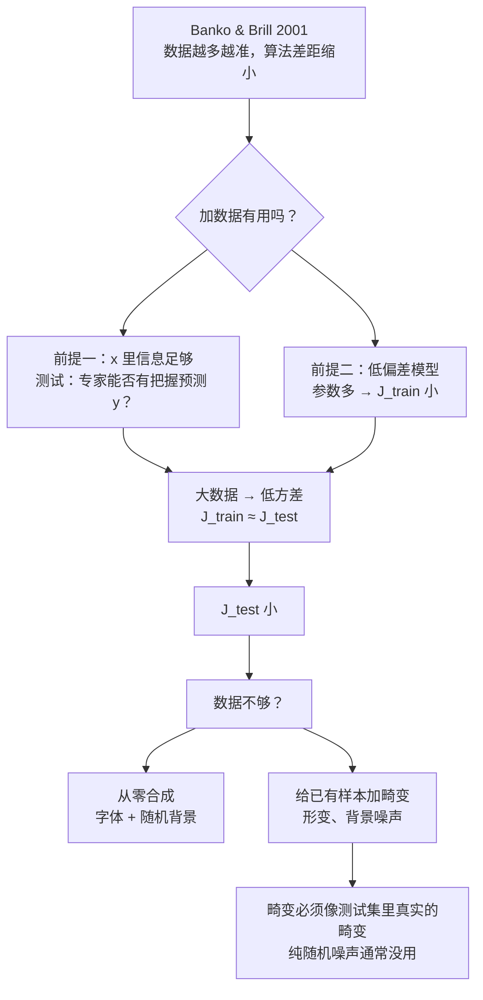

# 第 6 章 · 第 3 讲　数据的力量与人工数据合成（课堂讲授版）

> [!quote] 本讲开场
> 同学们好。系统设计的前两个问题我们已经解决了：**下一步往哪使劲**（误差分析）、**这一步有没有用**（数值指标 / $F_1$）。今天问第三个问题：
>
> **要不要花几个月去收集更多数据？**
>
> 这可能是项目决策里最贵的单选题——收集数据要花时间、花钱、花人力。今天这一讲回答三件事：
> 1. 有什么证据说明"数据比算法更重要"？
> 2. 这句话**在什么条件下**才成立？——两个条件，外加一个一句话的判别测试
> 3. 数据不够时，怎么**自己造数据**？造的时候有什么讲究？

我们开始。

---

## 一、一个著名的实验

### 1.1 任务：易混词

课件 p16 的标题是 **Designing a high accuracy learning system**（设计高精度学习系统）。它给的任务非常有意思：

> E.g. Classify between confusable words. {to, two, too}, {then, than}.
> For breakfast I ate ______ eggs.

给一个句子挖掉一个词，让算法从 {to, two, too} 里选一个填进去。这里答案显然是 **two**——"我早饭吃了**两个**鸡蛋"，语法上、语义上都只能是 two。

> [!note] 课堂板书：易混词实验
> ![[C6.3-板书-易混词实验.png]]
> 老师在空格里填上 **two**，把 {to, two, too} 和 {then, than} 两组各用蓝框框起来，并在四个算法名称前逐个加箭头。右边图的横轴两端（0.1 和 1000）各画了一个向上箭头，右侧用括号把四条曲线在最右端的汇合处括起来。左下角用箭头指向出处 **[Banko and Brill, 2001]**。

### 1.2 实验结果

研究者拿了四种**完全不同**的算法来做这个任务：

- Perceptron（感知机，本质上接近逻辑回归）
- Winnow
- Memory-based（基于记忆的方法，如近邻法）
- Naïve Bayes（朴素贝叶斯）

横轴是**训练集大小**——从 0.1 百万到 1000 百万（也就是十万到十亿，对数刻度），纵轴是**准确率**。

实验结果有四个观察，大家一条条看：

1. **四条曲线都随数据量单调上升**——数据越多越准，没有例外；
2. **最右端（十亿样本），四个算法的准确率挤在一起**（约 0.94–0.97）——**算法之间的差距被数据抹平了**；
3. 在**最左端**，算法之间的差距反而比较大（约 0.75–0.83）；
4. 一个非常反直觉的推论：**数据少时表现最差的算法，给它足够多数据，可以超过数据少时表现最好的算法。**

> [!important] 课件的结论
> **"It's not who has the best algorithm that wins. It's who has the most data."**
> （赢的不是算法最好的人，而是数据最多的人。）

这句话在机器学习圈子里非常有名，很多人把它当口号喊。但大家注意：**它不是一个无条件成立的定律，而是一个有条件成立的经验规律。** 下一节，我们把条件说清楚。

---

## 二、"数据为王"的两个前提

### 2.1 前提一：特征里有足够的信息

课件 p17：

> **Assume feature $x\in\mathbb{R}^{n+1}$ has sufficient information to predict $y$ accurately.**

（假设特征 $x$ 含有足够的信息，能准确预测 $y$。）

> [!note] 课堂板书：大数据的前提
> ![[C6.3-板书-大数据的前提.png]]
> 老师在 "For breakfast I ate ___ eggs." 的空格上填 **two**，在上方把另外两个候选 **to**、**too** 用红叉划掉；句子的前半截 "For breakfast I ate" 和后面的 "eggs" 划了线。第一句话被蓝色大括号括起，右边画了个箭头指向 "sufficient information"。

我们用两个例子把"信息足够"这个词讲透。

**正例：易混词。** 看到 "For breakfast I ate ___ eggs." 这几个词，**信息就足够**判断答案是 two——前后文把答案锁死了。所以只要数据够多，算法迟早能学会这个规律。

**反例：** 课件原文——

> Counterexample: Predict housing price from **only size** (feet²) and no other features.

只知道房子的面积，要预测房价。大家想想：**同样是 100 平米，在市中心和在郊区能差十倍**；新房和老房、有没有学区、几层楼、朝向……这些信息全都没有。**不管给多少数据，都不可能从"面积"一个数准确预测房价**——因为答案根本不在 $x$ 里。加再多数据，也只是在一堆信息不足的样本里反复拟合。

> [!important] 一句话判别测试（课件原文，考试常考）
> **Useful test: Given the input $x$, can a human expert confidently predict $y$?**
> （给定输入 $x$，一个**人类专家**能不能**有把握地**预测出 $y$？）
>
> - 给一个英语好的人看 "For breakfast I ate ___ eggs."——能，毫不犹豫说 two。→ 特征信息充分。
> - 给一个资深房产经纪人看"这套房子 100 平米"——不能，他会反问"在哪儿？几年的房子？"→ 特征信息不足。
>
> **如果专家都做不到，就别指望加数据能让算法做到。** 这时该做的是**加特征**，而不是加数据。这个测试一句话、零成本，但能帮你避免花几个月收集一堆没用的数据。

### 2.2 前提二：模型要"装得下"

课件 p18：

> **Use a learning algorithm with many parameters** (e.g. logistic regression / linear regression with many features; neural network with many hidden units).

（用参数多的学习算法，比如多特征的逻辑回归 / 线性回归，或者多隐藏单元的神经网络。）

> [!note] 课堂板书：低偏差 + 大数据（推理链全是手写的）
> ![[C6.3-板书-低偏差加大数据.png]]
> 老师把这一页的论证写成了一个完整的推理链：
>
> 1. "many parameters"、"neural network with many hidden units" 下划线，右边写 **low bias algorithms**（低偏差算法）。
>    → **$J_{train}(\theta)$ will be small.**（训练误差会很小）
> 2. "Use a **very large training set** (**unlikely to overfit**)" 下划线，右边写 **low variance**（低方差）。
>    → **$J_{train}(\theta)\approx J_{test}(\theta)$**（训练误差约等于测试误差）
> 3. 用粉色箭头把上面两条汇合起来：
>    → **$J_{test}(\theta)$ will be small**（测试误差会很小）

这个推理链是整个论证的精华，我把它拆开，一步一步讲给大家。

**第一步：模型参数多 → 低偏差 → $J_{train}$ 小。**

参数多的模型表达能力（容量）强，能把训练集拟合得很好，不会出现 [[C2.7 过拟合与正则化]] 里说的**欠拟合（高偏差）**——也就是"模型太简单，学不动数据里的规律"。用机器学习的行话说：**容量够，训练误差能压得很低。**

**第二步：训练集极大 → 低方差 → $J_{train}\approx J_{test}$。**

参数多的模型本来容易**过拟合（高方差）**——把训练集背下来但泛化不了。但注意，过拟合的前提是"数据少到能被背下来"。如果训练集**大到**模型根本背不下来，它就只能去学数据里真正的、稳定的规律，于是**训练误差和测试误差会很接近**。

**合起来：$J_{test}\approx J_{train}$，而 $J_{train}$ 小 ⟹ $J_{test}$ 小。**

> [!important] 两个前提缺一不可
> | 情形 | 加数据有没有用 |
> |---|---|
> | 特征信息不足（专家也猜不出） | **没用**。先加特征 |
> | 特征够，但模型太简单（高偏差，如只用一次线性函数） | **没用**。$J_{train}$ 本身就高，数据再多 $J_{test}$ 也只能贴着高 $J_{train}$ |
> | 特征够，模型也复杂（低偏差） | **有用**。加数据压方差，$J_{test}$ 一路下降 |
>
> 回到 1.2 的实验：易混词任务**特征信息充分**（前提一满足），四个算法**都有大量参数**——基于词和上下文的特征成千上万个（前提二满足）。两个前提都满足，所以加数据一路涨。

> [!tip] 和第 8 章的呼应
> "低偏差 + 大数据"这个组合，是现代机器学习（尤其深度学习）的基本打法。但大家想想：十亿个样本怎么训练得动？普通梯度下降每走一步都要把十亿个样本扫一遍。**这正是 [[C8.1 大数据集与随机梯度下降]] 要解决的问题。** 这一讲埋了个伏笔，第 8 章来收。

---

## 三、数据不够？自己造

前提满足了，可现实往往是：**手上根本没有那么多数据。** 这一节教大家一个"作弊"技巧——人工数据合成（artificial data synthesis）。

### 3.1 场景：照片 OCR

课件 p20：**Artificial data synthesis for photo OCR**。一张纽约时代广场的夜景照片，上面每一块广告牌、招牌上的文字都用红框框出——任务是从**自然场景照片**里读出文字（Photo OCR，照片光学字符识别）。

![[C6.3-照片OCR.png]]

大家想想这个任务难在哪：不是字体问题，而是**光照、角度、模糊、遮挡**——同一块广告牌在白天黑夜、正面侧面看完全不一样。其中一个子任务是**单字符识别**：给一个切出来的小方块图，判断里面是哪个字母。

问题来了：要训练一个字符识别器，你需要海量"照片里的字符"样本——可这些东西得一张张从照片里抠、一个个手工标注，成本高得吓人。**怎么办？自己造。**

### 3.2 方法一：从零合成

课件 p21 左边是**真实数据**：从照片里切出的字符小图，字体、颜色、光照、模糊程度千变万化。右边是同一串字母 "Abcdefg" 用**五种不同字体**写出来。

思路是：电脑里有成百上千种字体，它们是**免费且带标签**的。

1. 选一种字体，渲染出一个字母；
2. 贴到一张**随机背景**上；
3. 加一点模糊、旋转、缩放、仿射变换。

**重复这个过程，就能造出无限多带标签的训练样本**——注意，标签是免费的：字母是你自己渲染的，你当然知道它是 "A" 还是 "g"。

![[C6.3-真实数据与合成数据.png]]

（课件 p22：左为真实数据，右为合成数据。两边**看上去非常像**——大家注意，这是合成数据有用的前提。课堂用红框在两边各圈出了几个样本作对照。）

### 3.3 方法二：给已有样本加畸变

课件 p23：**Synthesizing data by introducing distortions**（通过引入畸变合成数据）。

有时候你连"从零渲染"的素材都没有，但手里已经有**少量真实样本**。没关系——拿**一个**真实的字母 "A"（网格化的小图），对它施加各种**弹性形变**（拉伸、扭曲、局部挤压），一张图就变成了 16 张。

> [!note] 课堂板书：引入畸变合成数据
> ![[C6.3-板书-引入畸变合成数据.png]]
> 老师用红框框出左边那一个原始的 "A"，并画箭头指向它——强调**只需要一个原始样本**，就能生成右边一整片训练数据。

**语音识别也有同样的例子**（课件 p24）：

- 原始音频：一个人从 0 数到 5；
- 加机器背景噪声；
- 加人群嘈杂背景噪声；
- 模拟信号很差的手机通话。

一段干净录音 → 四段训练数据。零成本放大四倍。

### 3.4 畸变要"像真的"：一条关键原则

方法二听起来很美好，但大家注意，**不是随便加噪声就有用**。课件 p25 给出了这条关键原则：

> **Distortion introduced should be representation of the type of noise / distortions in the test set.**
> （引入的畸变，应当代表测试集里真实会出现的噪声 / 畸变类型。）
>
> **Usually does not help to add purely random / meaningless noise to your data.**
> （给数据加纯随机的、无意义的噪声，通常没用。）

> [!note] 课堂板书：畸变要有代表性
> ![[C6.3-板书-畸变要有代表性.png]]
> 老师在形变后的 "A" 旁边、在音频那一栏的 "Background noise" 旁边各画了箭头（**好的畸变**：真实照片里的字母确实会变形，真实录音里确实有背景噪声）。
>
> 在下面那组**加了随机噪点**的 "A" 旁边画了箭头，并把这种做法的公式划线：
> $$x_i=\text{intensity (brightness) of pixel } i,\qquad x_i\leftarrow x_i+\text{random noise}$$
> ——**这是坏的畸变**：真实照片里的字母不会长满均匀随机的噪点。

> [!important] 判断标准：问自己一句"测试时真的会遇到这种畸变吗？"
> - 手写 / 拍照的字母会扭曲变形 → **会** → 加弹性形变有用；
> - 用户在地铁里、在马路边打电话 → **会** → 加背景噪声有用；
> - 每个像素独立地加一点随机亮度 → **不会**（现实中的噪声不长这样）→ 基本没用，只是在浪费算力。
>
> 一句话：**合成数据的质量，取决于它和真实测试分布有多像，而不是它有多"花哨"。**

### 3.5 造数据之前先想清楚（**拓展**）

课件在这一段结束了，老师补两条实践要点（来自同一套课程体系的常规建议）：

1. **先确认你的模型是低偏差的。** 回到第 2 节：高偏差的模型加数据没用。画一下学习曲线，确认两条线之间确实还有缝，再去造数据——否则造了也白造。
2. **问一句"要得到 10 倍数据，需要多少工作量？"** 很多时候答案出乎意料地小——写一个合成脚本一天、或者自己坐下来标注几天。在决定"数据不够、没办法"之前，先把这笔账算清楚。

> [!tip] 今天的名字
> 这一节讲的内容，今天通常叫**数据增强 data augmentation**。图像领域的随机裁剪、翻转、颜色抖动，语音领域的加噪、变速，都是同一个思路。原则也完全一样：**增强要模拟真实会遇到的变化。** 大家以后看深度学习的内容会天天见到它。

---

## 四、停一下：第 6 章到这里，我们的工具箱齐了

第 6 章三讲合起来，是一个完整的**项目决策工具箱**，我给大家摆在一起：

| 问题 | 工具 |
|---|---|
| 下一步往哪使劲？ | **误差分析**（[[C6.1 系统设计的起点：垃圾邮件分类与误差分析（讲授版）]]） |
| 这一步有没有用？ | **单一数值指标**；偏斜类用 **$F_1$**（[[C6.2 偏斜类的评估：精确率、召回率与 F1（讲授版）]]） |
| 要不要加数据？ | **专家测试 + 低偏差判断**；数据不够就**合成**（本讲） |

---

## 本讲小结：今天要记住的三件事

> [!important] 三句话
> 1. **"不是算法最好的赢，而是数据最多的赢"**：Banko & Brill（2001）在易混词任务（{to, two, too}、{then, than}）上用感知机、Winnow、基于记忆的方法、朴素贝叶斯四种算法，训练集从十万增到十亿，全部单调变准，最终差距很小。
> 2. **这句话有两个前提**：① **特征 $x$ 包含足够预测 $y$ 的信息**——判别测试是"**给定 $x$，人类专家能否有把握地预测 $y$**"（易混词可以；只凭面积预测房价不行）；② **用参数多的低偏差算法**（多特征的线性 / 逻辑回归、多隐藏单元的神经网络），使 $J_{train}$ 小，再用**极大的训练集**压住方差使 $J_{train}\approx J_{test}$，于是 $J_{test}$ 小。任一前提不满足，加数据都没用。
> 3. **人工数据合成**两条路：**从零合成**（照片 OCR：多种字体 + 随机背景渲染字符）和**给真实样本加畸变**（字母加弹性形变、语音加背景噪声 / 差信号）。关键原则：**畸变要代表测试集中真实会出现的噪声类型**，给像素加纯随机噪声 $x_i\leftarrow x_i+\text{random noise}$ 通常没用。

### 速查表（考试前扫一眼）

| 名称 | 内容 |
|---|---|
| 实验 | Banko & Brill 2001，易混词分类，训练集 0.1M–1000M |
| 四种算法 | Perceptron（≈逻辑回归）、Winnow、Memory-based、Naïve Bayes |
| 结论 | 数据越多越准；数据足够大时算法差距缩小 |
| 名言 | "It's not who has the best algorithm that wins. It's who has the most data." |
| 前提一 | $x\in\mathbb{R}^{n+1}$ 有足够信息预测 $y$ |
| 专家测试 | Given the input $x$, can a human expert confidently predict $y$? |
| 正例 / 反例 | For breakfast I ate **two** eggs（可以） / 只凭面积预测房价（不行） |
| 前提二 | 参数多的算法 → 低偏差 → $J_{train}$ 小 |
| 大训练集 | 不易过拟合 → 低方差 → $J_{train}\approx J_{test}$ |
| 合起来 | $J_{test}$ 小 |
| 从零合成 | 字体库 + 随机背景 + 模糊 / 旋转 / 仿射 |
| 加畸变 | 图像：弹性形变；语音：机器噪声、人群噪声、差信号通话 |
| 原则 | 畸变应代表测试集中真实的噪声类型；纯随机噪声通常无用 |
| 今天的叫法（**拓展**） | 数据增强 data augmentation |

## 下一讲预告

第 6 章讲的是"怎么把一个机器学习项目做对"。接下来换到一个具体而且极其常见的应用：**推荐系统**。

你在视频网站看完一部电影，页面下方立刻冒出"你可能还喜欢"；电商首页、音乐 App、新闻客户端全在做同一件事。这背后的问题可以写得非常干净：一张"用户 × 电影"的评分表，**大部分格子是空的**——怎么把空格填上？

我们会先用已经会的**线性回归**做一版（假设每部电影有"浪漫程度""动作程度"之类的标签），然后发现这些标签往往根本没人给你——于是引出一个漂亮的想法：**让算法自己学出电影的特征**。这就是**协同过滤**。

---
上一讲：[[C6.2 偏斜类的评估：精确率、召回率与 F1（讲授版）]]
下一讲：[[C7.1 推荐问题与基于内容的推荐（讲授版）]]
返回：[[机器学习课程 MOC]]
