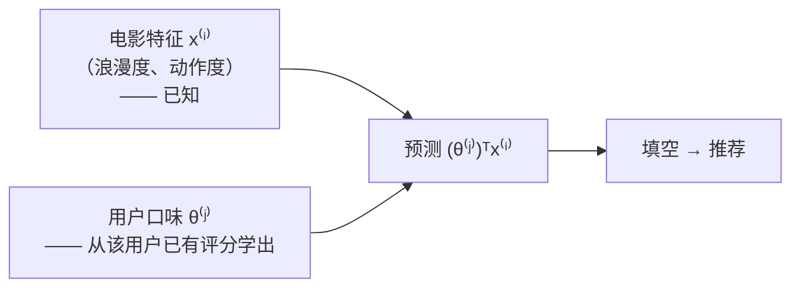

# 第 7 章 · 第 1 讲　推荐问题与基于内容的推荐（课堂讲授版）

> [!quote] 本讲开场
> 同学们好，我们进入第 7 章。这一章讲一个你天天都在用的东西——**推荐系统**。
>
> 你在视频网站看完一部电影，页面下方立刻冒出"你可能还喜欢"；电商首页、音乐 App、新闻客户端全在做同一件事。背后是同一个数学问题，可以写得非常干净：
>
> **一张"电影 × 用户"的评分表，大部分格子是空的。把空格填上。**
>
> 这一讲做三件事：
> 1. 把这个问题写成数学：四个记号 $n_u,n_m,r(i,j),y^{(i,j)}$；
> 2. 先做**最朴素的一版**：假设每部电影已经有了"浪漫程度""动作程度"等特征 → 每个用户各做一个**线性回归**；
> 3. 写出代价函数和梯度下降。
>
> 提前给大家吃个定心丸：这一讲**没有任何新算法**，就是 [[C2.1 单变量线性回归与代价函数]] + [[C2.7 过拟合与正则化]] 换了个场景。真正的新东西在下一讲。

好，我们从那张评分表开始。

---

## 一、问题设定

### 1.1 一张评分表

课件 p2：**Example: Predicting movie ratings**。用户用星级给电影打分。这是我们的例子：

| 电影 | Alice (1) | Bob (2) | Carol (3) | Dave (4) |
|---|---|---|---|---|
| Love at last | 5 | 5 | 0 | 0 |
| Romance forever | 5 | ? | ? | 0 |
| Cute puppies of love | ? | 4 | 0 | ? |
| Nonstop car chases | 0 | 0 | 5 | 4 |
| Swords vs. karate | 0 | 0 | 5 | ? |

"?" 表示这个用户**没看过 / 没评过**这部电影。**推荐系统的任务：预测每个 "?" 的值**，然后把预测分高的电影推荐给这个用户。

> [!note] 课堂板书：电影评分问题与记号
> ![[C7.1-板书-电影评分问题与记号.png]]
> 板书内容：
> - 课件原文写的是 "User rates movies using **one** to five stars"，老师把 **one 划掉改成 zero**——即评分范围是 **0 到 5 星**（大家看表里确实有 0 分）。右下角也写了 $y^{(i,j)}\in\{0,\ldots,5\}$。
> - 用**绿框**把前三部电影（爱情片）和 Alice、Bob 的评分框在一起，用**绿框**把前三部和 Carol、Dave 框在一起；用**红框**把后两部（动作片）分别和两组用户框在一起。——**一眼就能看出结构**：Alice 和 Bob 喜欢爱情片、不喜欢动作片；Carol 和 Dave 正相反。
> - 把每个 "?" 用粉圈圈出，并在旁边**填上凭直觉猜的值**：Bob 对 Romance forever **4.5**、Carol 对 Romance forever **0**、Alice 对 Cute puppies **5**、Dave 对 Cute puppies **0**、Dave 对 Swords vs. karate **4**。
> - 底下写出 $n_u=4$，$n_m=5$。

> [!question] 停一下，先自己想
> 老师填的那些猜测，**你是怎么猜出来的？**
>
> 你大概是这么想的："Alice 给两部爱情片都打了 5 分，Cute puppies of love 听名字也是爱情片，所以她应该也给 5 分。"——你用到了两样信息：**这部电影是什么类型的**，和**这个用户喜欢什么类型**。
>
> 这一讲和下一讲，就是把这个直觉变成算法。大家记住这个"直觉配方"：**电影的类型 × 用户的口味 = 预测评分**。

### 1.2 四个记号

课件 p2 右侧给了四个记号，这是整章的地基，必须一字不差记住：

| 记号 | 含义 |
|---|---|
| $n_u$ | 用户数（number of **u**sers）。本例 $n_u=4$ |
| $n_m$ | 电影数（number of **m**ovies）。本例 $n_m=5$ |
| $r(i,j)$ | **$=1$ 当且仅当用户 $j$ 给电影 $i$ 评过分** |
| $y^{(i,j)}$ | 用户 $j$ 给电影 $i$ 的评分（**只有 $r(i,j)=1$ 时才有定义**） |

> [!warning] 下标顺序最容易搞混，大家多念几遍
> 这和前面章节"$i$ 是样本编号、$j$ 是特征编号"的习惯**不一样**！在推荐系统这两章里，约定是：
> - **$i$ ↔ 电影**（表的行），$i=1,\ldots,n_m$
> - **$j$ ↔ 用户**（表的列），$j=1,\ldots,n_u$
>
> 所以 $y^{(i,j)}$ 就是表里**第 $i$ 行、第 $j$ 列**那一格。例：$y^{(4,3)}=5$（Carol 给 Nonstop car chases 打了 5 分）；$r(2,2)=0$（Bob 没评 Romance forever）。**考试写公式时下标写反，整个式子就全错了，务必小心。**

---

## 二、基于内容的推荐

### 2.1 假设电影有特征

课件 p4：**Content-based recommender systems**。假设每部电影有两个特征：

| 电影 | $x_1$ (romance 浪漫程度) | $x_2$ (action 动作程度) |
|---|---|---|
| Love at last | 0.9 | 0 |
| Romance forever | 1.0 | 0.01 |
| Cute puppies of love | 0.99 | 0 |
| Nonstop car chases | 0.1 | 1.0 |
| Swords vs. karate | 0 | 0.9 |

（这张表在课件 p4 被板书的框遮住了，数值取自课件文字层，与 p9 的同一张表一致。）

加上我们熟悉的约定 $x_0=1$（截距项，同 [[C2.3 多变量线性回归与梯度下降实践]]），每部电影 $i$ 就有一个特征向量 $x^{(i)}\in\mathbb{R}^{n+1}$。这里 $n=2$，所以 $x^{(i)}\in\mathbb{R}^3$。例如

$$x^{(1)}=\begin{bmatrix}1\\0.9\\0\end{bmatrix}\quad(\text{Love at last}),\qquad x^{(3)}=\begin{bmatrix}1\\0.99\\0\end{bmatrix}\quad(\text{Cute puppies of love})$$

"基于内容"这个名字就来自这里：**我们用的是电影本身的内容特征**——它有多浪漫、多动作。

### 2.2 每个用户一个线性回归

课件原文：

> **For each user $j$, learn a parameter $\theta^{(j)}\in\mathbb{R}^3$. Predict user $j$ as rating movie $i$ with $(\theta^{(j)})^Tx^{(i)}$ stars.**

> [!important] 核心想法：把每个用户当成一个独立的线性回归问题
> - 输入：电影的特征 $x^{(i)}$
> - 输出：这个用户给这部电影的评分
> - 参数：$\theta^{(j)}$ ——描述**这个用户的口味**
>
> $$\text{预测评分}=(\theta^{(j)})^Tx^{(i)}$$
>
> $\theta^{(j)}$ 的每个分量可以理解为"这个用户有多看重对应的特征"：$\theta^{(j)}_1$ 大 = 喜欢浪漫，$\theta^{(j)}_2$ 大 = 喜欢动作。**电影的特征是"客观属性"，用户的参数是"主观口味"，两者点乘就是"这部电影合不合这个用户胃口"。**

### 2.3 手算一遍

> [!note] 课堂板书：基于内容的推荐（这一页的算例全是手写的）
> ![[C7.1-板书-基于内容的推荐.png]]
> 板书内容：
> - 右上写 $n_u=4,\ n_m=5$，并圈出 **$x_0=1$**；右下写 **$n=2$**。
> - 左侧给五部电影标上 $x^{(1)},\ldots,x^{(5)}$，给四个用户标上 $\theta^{(1)},\ldots,\theta^{(4)}$。
> - 在 $\theta^{(j)}\in\mathbb{R}^3$ 下面补写 **$\theta^{(j)}\in\mathbb{R}^{n+1}$**（一般形式）。
> - 右上角写出 $x^{(1)}=\begin{bmatrix}1\\0.9\\0\end{bmatrix}$。
> - **底部算出 Alice 对 Cute puppies of love 的预测评分**：
>   $$x^{(3)}=\begin{bmatrix}1\\0.99\\0\end{bmatrix},\qquad \theta^{(1)}=\begin{bmatrix}0\\5\\0\end{bmatrix}$$
>   $$(\theta^{(1)})^Tx^{(3)}=0\times1+5\times0.99+0\times0=5\times0.99=4.95$$
> - 并把 **4.95** 填进表里 Alice / Cute puppies 那个 "?" 的位置。

**解读 $\theta^{(1)}=[0,5,0]^T$**：截距 0，浪漫权重 5，动作权重 0——**Alice 只在乎浪漫程度，浪漫满分就给 5 分，动作片完全不感兴趣**。代入 Cute puppies（浪漫 0.99）得 4.95 分，和我们直觉猜的 5 分几乎一样。**看，直觉变成了算术。**

> [!question] $\theta^{(1)}=[0,5,0]^T$ 是从哪来的？
> 课件这一页是"假设已经知道了"。真正的 $\theta^{(j)}$ 要从 Alice **已有的评分**里学出来——下一节就讲怎么学。

---

## 三、怎么学出 $\theta^{(j)}$

### 3.1 一个用户

课件 p5 **Problem formulation**，先摆记号：

| 记号 | 含义 |
|---|---|
| $\theta^{(j)}$ | 用户 $j$ 的参数向量 |
| $x^{(i)}$ | 电影 $i$ 的特征向量 |
| $(\theta^{(j)})^T(x^{(i)})$ | 用户 $j$ 对电影 $i$ 的预测评分 |
| $m^{(j)}$ | 用户 $j$ 评过分的电影数 |

**学习 $\theta^{(j)}$**：就是一个**带正则化的线性回归**，只不过训练集是"用户 $j$ 评过的那些电影"。

$$\min_{\theta^{(j)}}\;\frac{1}{2}\sum_{i:\,r(i,j)=1}\left((\theta^{(j)})^Tx^{(i)}-y^{(i,j)}\right)^2+\frac{\lambda}{2}\sum_{k=1}^{n}\left(\theta^{(j)}_k\right)^2$$

> [!note] 课堂板书：单用户代价函数（课件这一页的代价函数是空的，整条手写）
> ![[C7.1-板书-单用户代价函数.png]]
> 老师写出上面这条式子，并做了三处标记：
> - 求和下标 **$i:r(i,j)=1$** 用红线划出——**只对这个用户评过分的电影求和**；
> - 平方误差项 $\left((\theta^{(j)})^Tx^{(i)}-y^{(i,j)}\right)^2$ 用红线划出；
> - **老师先写了 $\frac{1}{2m^{(j)}}$ 和 $\frac{\lambda}{2m^{(j)}}$，然后把两处的 $m^{(j)}$ 都用红叉划掉了**，变成 $\frac12$ 和 $\frac{\lambda}{2}$；
> - 正则项的求和下标 $k=1$ 加了箭头，旁边补写 $\theta^{(j)}\in\mathbb{R}^{n+1}$。

> [!important] 为什么可以把 $m^{(j)}$ 划掉？这个点大家一定要想明白
> 在 [[C2.7 过拟合与正则化]] 里，正则化线性回归写的是 $\frac{1}{2m}[\cdots]$。这里 $\frac{1}{m^{(j)}}$ 是一个**常数**——对于固定的用户 $j$，他评过几部电影是定死的。**给目标函数整体乘一个正常数，不改变最小值点的位置。**（想想看：$\min f(x)$ 和 $\min 5f(x)$ 的最优 $x$ 是完全一样的。）
>
> 所以 $\frac{1}{2m^{(j)}}$ 可以换成 $\frac12$，最优的 $\theta^{(j)}$ 完全不变。去掉它的好处是下一步把所有用户加起来时，式子更干净。

> [!warning] 正则项从 $k=1$ 开始
> 和 [[C2.7 过拟合与正则化]] 一样：**不惩罚截距项 $\theta^{(j)}_0$**。正则项求和 $\sum_{k=1}^n$，不含 $k=0$。这是老规矩：截距只是个基线，不该被罚。

### 3.2 所有用户一起

课件 p6：每个用户的问题是独立的，把 $n_u$ 个目标函数**加起来**一起最小化，结果和分别最小化完全一样：

$$\min_{\theta^{(1)},\ldots,\theta^{(n_u)}}\;\frac12\sum_{j=1}^{n_u}\sum_{i:\,r(i,j)=1}\left((\theta^{(j)})^Tx^{(i)}-y^{(i,j)}\right)^2+\frac{\lambda}{2}\sum_{j=1}^{n_u}\sum_{k=1}^{n}\left(\theta^{(j)}_k\right)^2$$

> [!note] 课堂板书：所有用户代价函数
> ![[C7.1-板书-所有用户代价函数.png]]
> 老师把上下两个式子各用大括号括起；在 "To learn $\theta^{(1)},\theta^{(2)},\ldots,\theta^{(n_u)}$" 的每个 $\theta$ 下面划线；把新加的最外层求和 **$\sum_{j=1}^{n_u}$ 框了出来**并加箭头；最后用一条大弧线把下式的正则项连回上式的正则项——**下式就是把上式对所有 $j$ 求和**。

> [!tip] 为什么加起来和分开做一样
> $\theta^{(1)}$ 只出现在 $j=1$ 的那些项里，$\theta^{(2)}$ 只出现在 $j=2$ 的项里……各用户的参数**互不耦合**。对 $\theta^{(1)}$ 求偏导时，其他用户的项全是常数、导数为 0。所以加总后的最小化，**等价于**对每个用户各自最小化。
>
> 写成一个总目标的意义在于：它可以**一次性**交给梯度下降或高级优化器（[[C2.6 高级优化算法与多分类]]）处理——你只要写一个目标函数，优化器就自动帮你把所有人的 $\theta$ 一起调好。

### 3.3 梯度下降

课件 p7：把上面那个总目标记为 $J(\theta^{(1)},\ldots,\theta^{(n_u)})$。

$$\theta^{(j)}_k:=\theta^{(j)}_k-\alpha\sum_{i:\,r(i,j)=1}\left((\theta^{(j)})^Tx^{(i)}-y^{(i,j)}\right)x^{(i)}_k\qquad(k=0)$$

$$\theta^{(j)}_k:=\theta^{(j)}_k-\alpha\left(\sum_{i:\,r(i,j)=1}\left((\theta^{(j)})^Tx^{(i)}-y^{(i,j)}\right)x^{(i)}_k+\lambda\theta^{(j)}_k\right)\qquad(k\ne0)$$

> [!note] 课堂板书：梯度下降更新
> ![[C7.1-板书-梯度下降更新.png]]
> 板书内容：
> - 在总目标下面用大括号写 **$J(\theta^{(1)},\ldots,\theta^{(n_u)})$**；
> - 在第二条更新式括号内那一大块下面用大括号写 **$\dfrac{\partial}{\partial\theta^{(j)}_k}J(\theta^{(1)},\ldots,\theta^{(n_u)})$**——**括号里的东西就是偏导数**；
> - 在 $\alpha$ 后面用粉笔写了 $\frac{1}{m^{(j)}}$ 并**用红叉划掉**——和 3.1 一样，常数 $\frac{1}{m^{(j)}}$ 被去掉了（它被吸收进学习率 $\alpha$ 里）；
> - "(for $k=0$)" 和 "(for $k\neq0$)" 都划了线，$\lambda\theta^{(j)}_k$ 也划了线。

> [!important] 和线性回归的梯度下降逐项对照：其实没有任何新东西
> 这就是 [[C2.7 过拟合与正则化]] 里正则化线性回归的梯度下降，只改了三处：
> 1. 求和范围从"所有样本"变成"**这个用户评过的电影** $i:r(i,j)=1$"；
> 2. 去掉了 $\frac1m$（吸收进 $\alpha$）；
> 3. $k=0$（截距）**不加** $\lambda\theta_k$ 项，$k\ne0$ 加。
>
> 大家把这一讲和 [[C2.1 单变量线性回归与代价函数]]、[[C2.7 过拟合与正则化]] 对照着看，会发现**每一步你都会**。推荐系统的第一讲，就是旧知识换新场景。

### 3.4 用真实数据学一次（**拓展**：验算）

对 Alice 用课件表里的特征、她已评的 4 部电影做正则化线性回归（$\lambda=0.01$），学到

$$\theta^{(1)}\approx\begin{bmatrix}2.75\\2.36\\-3.01\end{bmatrix}$$

它和板书假设的 $[0,5,0]^T$ **长得不一样**，但预测效果几乎一样：对 Cute puppies of love 预测 **5.09 分**（板书用 $[0,5,0]^T$ 算的是 4.95）。

> [!tip] 为什么 $\theta$ 不唯一
> Alice 只评了 4 部电影，而 $\theta^{(1)}$ 有 3 个参数，数据刚刚够。而且她评过的电影要么"高浪漫低动作"、要么"低浪漫高动作"，**浪漫和动作几乎是此消彼长的**——于是"截距 + 浪漫权重"和"截距 − 动作权重"可以互相替代。只要在**数据覆盖的区域**里预测一致，$\theta$ 长什么样并不重要。
>
> 这个现象以后还会反复出现：**参数不唯一没关系，预测唯一就行。**

---

## 四、停一下：我们刚才干了什么

我们把推荐问题拆成了 $n_u$ 个**各自独立的**正则化线性回归：

但这个看起来很顺的方法，有一个**致命前提**：**每部电影的特征 $x^{(i)}$ 必须事先已知。**

> [!warning] 这个前提在现实中几乎不成立
> 谁来给几十万部电影逐一打"浪漫度 0.9、动作度 0.01"这样的分数？
> - 请人来标：贵、慢、主观；
> - 而且"浪漫""动作"两个维度远远不够——喜剧、悬疑、文艺、特效、导演风格、演员……**到底该用哪些特征，本身就不知道。**
>
> 下一讲的问题就是：**能不能连电影特征 $x^{(i)}$ 也一起学出来？** 提前预告：答案是可以，而且方法漂亮得让人拍案——这就是下一讲的协同过滤。

---

## 本讲小结：今天要记住的三件事

> [!important] 三句话
> 1. **推荐问题 = 填补评分矩阵的空格**：$n_u$ 个用户、$n_m$ 部电影；$r(i,j)=1$ 表示用户 $j$ 评过电影 $i$，此时 $y^{(i,j)}$ 为评分（0–5 星，老师把课件的 "one to five" 改成了 "zero to five"）。**$i$ 是电影（行），$j$ 是用户（列）**。
> 2. **基于内容的推荐 = 每个用户一个线性回归**：已知电影特征 $x^{(i)}\in\mathbb{R}^{n+1}$（$x_0=1$），为每个用户学一个 $\theta^{(j)}\in\mathbb{R}^{n+1}$，预测评分 $(\theta^{(j)})^Tx^{(i)}$。课件例：$x^{(3)}=[1,0.99,0]^T$、$\theta^{(1)}=[0,5,0]^T$ ⟹ Alice 对 Cute puppies of love 预测 **4.95** 分。
> 3. **学 $\theta$ 就是正则化线性回归，只对该用户评过的电影求和**：$\min\frac12\sum_{j}\sum_{i:r(i,j)=1}((\theta^{(j)})^Tx^{(i)}-y^{(i,j)})^2+\frac\lambda2\sum_j\sum_{k=1}^n(\theta^{(j)}_k)^2$；常数 $\frac1{m^{(j)}}$ 可以去掉（不改变最优解，老师用红叉划掉）；正则项不含 $k=0$。梯度下降时 $k=0$ 不加 $\lambda\theta_k$，$k\ne0$ 加。**前提是电影特征已知——而这在现实中几乎不成立。**

### 速查表（考试前扫一眼）

| 名称 | 公式 / 内容 |
|---|---|
| 记号 | $n_u$ 用户数，$n_m$ 电影数，$r(i,j)\in\{0,1\}$，$y^{(i,j)}\in\{0,\ldots,5\}$ |
| 下标约定 | $i$ = 电影（行），$j$ = 用户（列） |
| 电影特征 | $x^{(i)}\in\mathbb{R}^{n+1}$，$x_0=1$；课件 $n=2$（romance, action） |
| 用户参数 | $\theta^{(j)}\in\mathbb{R}^{n+1}$ |
| 预测 | $(\theta^{(j)})^Tx^{(i)}$ |
| 课件算例 | $(\theta^{(1)})^Tx^{(3)}=[0,5,0]\cdot[1,0.99,0]=4.95$ |
| 单用户目标 | $\min\limits_{\theta^{(j)}}\frac12\sum\limits_{i:r(i,j)=1}((\theta^{(j)})^Tx^{(i)}-y^{(i,j)})^2+\frac\lambda2\sum\limits_{k=1}^n(\theta^{(j)}_k)^2$ |
| 全体用户目标 | 对 $j=1..n_u$ 求和；各用户参数不耦合，等价于分别求解 |
| 去掉 $\frac1{m^{(j)}}$ | 常数因子不改变最优解 |
| 梯度下降 $k=0$ | $\theta^{(j)}_k:=\theta^{(j)}_k-\alpha\sum_{i:r(i,j)=1}((\theta^{(j)})^Tx^{(i)}-y^{(i,j)})x^{(i)}_k$ |
| 梯度下降 $k\ne0$ | 括号内再加 $\lambda\theta^{(j)}_k$ |
| 致命前提 | 电影特征 $x^{(i)}$ 必须事先已知 |

## 下一讲预告

把问题反过来问：如果**用户的口味 $\theta^{(j)}$ 已知**（比如 Alice 亲口告诉你"我只喜欢爱情片"），能不能**反推出电影的特征 $x^{(i)}$**？

能——而且方法和这一讲完全对称，只是把 $\theta$ 和 $x$ 的角色互换。

于是出现了一个"鸡生蛋、蛋生鸡"的局面：知道 $x$ 能学 $\theta$，知道 $\theta$ 能学 $x$，可两个都不知道。解法是：**随便猜一个，然后轮流学**——或者更好，**把两者写进同一个目标函数里一起学**。这就是**协同过滤 collaborative filtering**。"协同"二字的含义是：**每个用户的评分，都在帮算法学出更好的电影特征；更好的电影特征，又让所有用户的预测更准。**

---
上一讲：[[C6.3 数据的力量与人工数据合成（讲授版）]]
下一讲：[[C7.2 协同过滤（讲授版）]]
返回：[[机器学习课程 MOC]]
