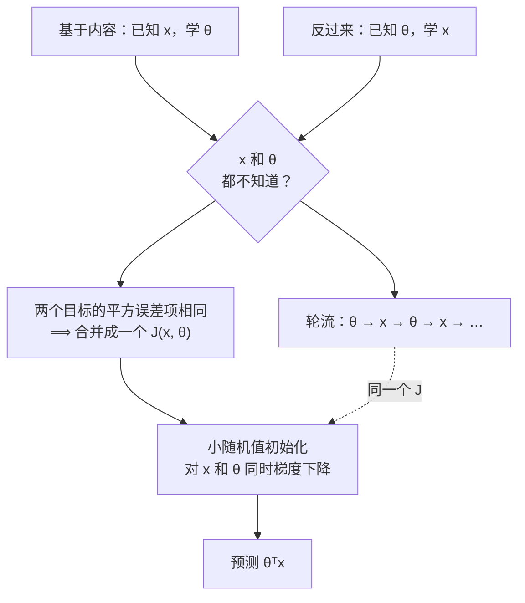

# 第 7 章 · 第 2 讲　协同过滤（课堂讲授版）

> [!quote] 本讲开场
> 同学们好。上一讲我们留了一个悬念：基于内容的推荐有个**致命前提**——每部电影的特征 $x^{(i)}$ 必须事先已知。可几十万部电影，谁来给每部打"浪漫度""动作度"？而且到底该用哪些维度都说不清。
>
> 今天这一讲，把这个前提**拆掉**。三件事：
> 1. 反过来——**已知用户口味 $\theta$，能不能学出电影特征 $x$？**
> 2. 两个都不知道时怎么办？——轮流学，或者**一起学**
> 3. 写出**协同过滤**的联合目标函数和完整算法
>
> 读完这一讲你会发现：这是机器学习课程里第一次出现"**连特征都自己学**"——这一步的份量，大家学完之后体会一下。

好，开始。

---

## 一、把问题反过来

### 1.1 这一次，特征是问号

课件 p9 **Problem motivation**，表还是那张表，但右边两列特征的状态变了：

| 电影 | Alice | Bob | Carol | Dave | $x_1$ (romance) | $x_2$ (action) |
|---|---|---|---|---|---|---|
| Love at last | 5 | 5 | 0 | 0 | **?** | **?** |
| Romance forever | 5 | ? | ? | 0 | **?** | **?** |
| Cute puppies of love | ? | 4 | 0 | ? | **?** | **?** |
| Nonstop car chases | 0 | 0 | 5 | 4 | **?** | **?** |
| Swords vs. karate | 0 | 0 | 5 | ? | **?** | **?** |

（课件 p9 仍印着上一讲的特征值；p10 把它们全部换成了 "?"。）

但这一次，**假设每个用户的口味已知**——比如用户注册时自己勾选了"喜欢爱情片 / 喜欢动作片"：

$$\theta^{(1)}=\begin{bmatrix}0\\5\\0\end{bmatrix},\quad\theta^{(2)}=\begin{bmatrix}0\\5\\0\end{bmatrix},\quad\theta^{(3)}=\begin{bmatrix}0\\0\\5\end{bmatrix},\quad\theta^{(4)}=\begin{bmatrix}0\\0\\5\end{bmatrix}$$

读法：Alice、Bob 只看重浪漫（第二个分量是 5），Carol、Dave 只看重动作（第三个分量是 5）。

### 1.2 反推一部电影的特征

> [!question] 停一下，先自己想
> 已知 Alice、Bob 给 Love at last 打了 5 分，Carol、Dave 打了 0 分；又已知 Alice、Bob 只爱浪漫、Carol、Dave 只爱动作。
>
> **Love at last 的特征 $x^{(1)}=[1,x_1,x_2]^T$ 应该是多少？**

> [!note] 课堂板书：已知用户偏好，反推电影特征
> ![[C7.2-板书-已知用户偏好反推电影特征.png]]
> 老师的推理：
> - 把 Love at last 那一行划掉（标 $x^{(1)}$），四个评分 5、5、0、0 各打一个箭头，右边两格特征填成 **1.0** 和 **0.0**，并在上方补写 **$x_0=1$**；
> - 右侧写出 $x^{(1)}=\begin{bmatrix}1\\1.0\\0.0\end{bmatrix}$；
> - 再下面写出它必须满足的四个条件：
>   $$(\theta^{(1)})^Tx^{(1)}\approx5,\quad(\theta^{(2)})^Tx^{(1)}\approx5,\quad(\theta^{(3)})^Tx^{(1)}\approx0,\quad(\theta^{(4)})^Tx^{(1)}\approx0$$
> - 四个 $\theta^{(j)}$ 分别用蓝框框起，把关键的 5 和 0 圈出。

大家跟着我验算：$x^{(1)}=[1,1.0,0.0]^T$ 时——

- $(\theta^{(1)})^Tx^{(1)}=0+5\times1.0+0=5$ ✓（Alice 给了 5）
- $(\theta^{(3)})^Tx^{(1)}=0+0+5\times0.0=0$ ✓（Carol 给了 0）

**四个方程恰好都满足。** 换句话说，**评分本身就在告诉你这部电影是什么类型**：爱浪漫的人都打高分、爱动作的人都打低分——那它就是一部浪漫片。

> [!important] 关键转念（这是今天第一个要转过弯来的地方）
> - 上一讲：**已知电影长什么样 → 推出用户爱什么**；
> - 这一讲：**已知用户爱什么 → 推出电影长什么样**。
>
> 这两件事**结构完全对称**：都是"$(\theta^{(j)})^Tx^{(i)}\approx y^{(i,j)}$，已知一边求另一边"。上一讲是"按用户列求和学 $\theta$"，这一讲是"按电影行求和学 $x$"。

---

## 二、学电影特征的目标函数

课件 p11 **Optimization algorithm**。

### 2.1 一部电影

给定 $\theta^{(1)},\ldots,\theta^{(n_u)}$，学 $x^{(i)}$：

$$\min_{x^{(i)}}\;\frac12\sum_{j:\,r(i,j)=1}\left((\theta^{(j)})^Tx^{(i)}-y^{(i,j)}\right)^2+\frac\lambda2\sum_{k=1}^{n}\left(x^{(i)}_k\right)^2$$

### 2.2 所有电影

给定 $\theta^{(1)},\ldots,\theta^{(n_u)}$，学 $x^{(1)},\ldots,x^{(n_m)}$：

$$\min_{x^{(1)},\ldots,x^{(n_m)}}\;\frac12\sum_{i=1}^{n_m}\sum_{j:\,r(i,j)=1}\left((\theta^{(j)})^Tx^{(i)}-y^{(i,j)}\right)^2+\frac\lambda2\sum_{i=1}^{n_m}\sum_{k=1}^{n}\left(x^{(i)}_k\right)^2$$

> [!note] 课堂板书：学习电影特征的目标
> ![[C7.2-板书-学习电影特征的目标.png]]
> 老师把上式里的 **$j:r(i,j)=1$** 划线、**$y^{(i,j)}$** 划线、平方误差项整体划线、正则项整体划线，在 $x^{(i)}$ 上加了箭头；下式两个 $\sum_{i=1}^{n_m}$ 下面各画了一个向上箭头——**标出下式比上式多出来的那层求和**。

> [!important] 和上一讲的目标函数逐项对照
> | | 学用户参数 $\theta$（[[C7.1 推荐问题与基于内容的推荐（讲授版）]]） | 学电影特征 $x$（本讲） |
> |---|---|---|
> | 已知 | 所有 $x^{(i)}$ | 所有 $\theta^{(j)}$ |
> | 对谁优化 | $\theta^{(j)}$ | $x^{(i)}$ |
> | 内层求和 | $\sum_{i:r(i,j)=1}$（**该用户**评过的电影） | $\sum_{j:r(i,j)=1}$（**评过该电影的**用户） |
> | 正则项 | $\sum_k(\theta^{(j)}_k)^2$ | $\sum_k(x^{(i)}_k)^2$ |
>
> **平方误差那一项一字不差**，只是求和的方向换了——一个是"按列（用户）求和"，一个是"按行（电影）求和"。大家把这张对照表抄一遍，就掌握了一半的协同过滤。

---

## 三、鸡生蛋，蛋生鸡

### 3.1 两个都不知道怎么办

课件 p12 把两件事并排写：

> Given $x^{(1)},\ldots,x^{(n_m)}$ (and movie ratings), can estimate $\theta^{(1)},\ldots,\theta^{(n_u)}$.
>
> Given $\theta^{(1)},\ldots,\theta^{(n_u)}$, can estimate $x^{(1)},\ldots,x^{(n_m)}$.

可现实是：**$x$ 和 $\theta$ 都不知道**，手上只有评分 $r(i,j)$、$y^{(i,j)}$。

> [!note] 课堂板书：鸡生蛋蛋生鸡
> ![[C7.2-板书-鸡生蛋蛋生鸡.png]]
> 老师在右上写 $r(i,j)$、$y^{(i,j)}$（**手上真正有的只是这两样**），然后在底下写：
>
> $$\text{Guess}\quad\theta\to x\to\theta\to x\to\theta\to x\to\cdots$$

**解法：先随便猜一个 $\theta$，然后轮流：**

1. 用当前的 $\theta$ 学出 $x$；
2. 用刚学出的 $x$ 学出新的 $\theta$；
3. 用新的 $\theta$ 学出新的 $x$；
4. ……

每一轮都在降低同一个误差（下一节会看到那个共同的目标），反复做下去，$x$ 和 $\theta$ 会收敛到一组合理的值。

> [!tip] 似曾相识
> 这就是 [[C4.2 K-means 的优化目标、随机初始化与选 K]] 里 K-means 的套路：**两组变量，固定一组优化另一组，轮流进行**——坐标下降 / 交替最小化。K-means 轮流更新"归属 $c$"和"中心 $\mu$"，这里轮流更新"用户口味 $\theta$"和"电影特征 $x$"。**同一个套路，换了两个角色。**

### 3.2 "协同"二字从哪来

> [!important] 协同过滤 Collaborative Filtering 的含义
> 每个用户给几部电影打分，就**为这些电影的特征学习贡献了一点信息**；学出更好的电影特征，又让**所有其他用户**的预测变准。
>
> **所有用户在不知不觉中协作**，一起把电影特征"标注"了出来——没有任何人需要去手工打"浪漫度 0.9"。这就是"协同"的意思：**你的评分帮别人获得更好的推荐，别人的评分也帮你。** 大家想想，这正是推荐系统能在真实世界运转起来的根本机制。

---

## 四、联合目标函数

来回轮流可以，但有更干脆的办法——**把两个问题合并成一个。**

### 4.1 发现：两个目标里有一模一样的一项

课件 p14 **Collaborative filtering optimization objective**，把两个目标并排：

**给定 $x$，求 $\theta$：**
$$\min_{\theta^{(1)},\ldots,\theta^{(n_u)}}\;\underbrace{\frac12\sum_{j=1}^{n_u}\sum_{i:\,r(i,j)=1}\left((\theta^{(j)})^Tx^{(i)}-y^{(i,j)}\right)^2}_{\text{平方误差}}+\frac\lambda2\sum_{j=1}^{n_u}\sum_{k=1}^n\left(\theta^{(j)}_k\right)^2$$

**给定 $\theta$，求 $x$：**
$$\min_{x^{(1)},\ldots,x^{(n_m)}}\;\underbrace{\frac12\sum_{i=1}^{n_m}\sum_{j:\,r(i,j)=1}\left((\theta^{(j)})^Tx^{(i)}-y^{(i,j)}\right)^2}_{\text{平方误差}}+\frac\lambda2\sum_{i=1}^{n_m}\sum_{k=1}^n\left(x^{(i)}_k\right)^2$$

> [!question] 停一下，先自己想
> 两个"平方误差"项，一个先对 $j$ 求和再对 $i$，一个先对 $i$ 求和再对 $j$。**它们是不是同一个东西？**

**是的。** 两者都是"**对所有被评过分的 $(i,j)$ 格子**，把 $((\theta^{(j)})^Tx^{(i)}-y^{(i,j)})^2$ 加起来"——只是先按列加还是先按行加的区别，结果一样。可以统一写成

$$\frac12\sum_{(i,j):\,r(i,j)=1}\left((\theta^{(j)})^Tx^{(i)}-y^{(i,j)}\right)^2$$

### 4.2 合并成一个

**Minimizing $x^{(1)},\ldots,x^{(n_m)}$ and $\theta^{(1)},\ldots,\theta^{(n_u)}$ simultaneously：**

$$\boxed{\;J(x^{(1)},\ldots,x^{(n_m)},\theta^{(1)},\ldots,\theta^{(n_u)})=\frac12\sum_{(i,j):\,r(i,j)=1}\left((\theta^{(j)})^Tx^{(i)}-y^{(i,j)}\right)^2+\frac\lambda2\sum_{i=1}^{n_m}\sum_{k=1}^n\left(x^{(i)}_k\right)^2+\frac\lambda2\sum_{j=1}^{n_u}\sum_{k=1}^n\left(\theta^{(j)}_k\right)^2\;}$$

$$\min_{\substack{x^{(1)},\ldots,x^{(n_m)}\\\theta^{(1)},\ldots,\theta^{(n_u)}}}J(x^{(1)},\ldots,x^{(n_m)},\theta^{(1)},\ldots,\theta^{(n_u)})$$

> [!note] 课堂板书：协同过滤联合目标（这页板书色彩最丰富，大家对着图看）
> ![[C7.2-板书-协同过滤联合目标.png]]
> 老师用三种颜色的框把各部分对应起来：
> - **粉框**：两个子问题里的平方误差项，以及联合目标里的平方误差项——三个粉框**是同一个东西**。两个子问题里的求和下标（$j=1$ 与 $i:r(i,j)=1$；$i=1$ 与 $j:r(i,j)=1$）各用小粉框标出，联合目标的 $(i,j):r(i,j)=1$ 也用粉色箭头指出。顶部写 **$(i,j):r(i,j)=1$**。
> - **青色框**：学 $x$ 时的正则项 ↔ 联合目标的第二项；$J$ 的参数表里 $x^{(1)},\ldots,x^{(n_m)}$ 也用青色大括号标出。
> - **红框**：学 $\theta$ 时的正则项 ↔ 联合目标的第三项。
> - 最底下的 $\min J$ 被红框框出，旁边写 **$\theta\to x\to\theta\to x\to\cdots$**，青色和红色箭头分别指回第二、三项——**轮流更新就是在对这个 $J$ 做交替最小化**。
> - **右上角的关键修改**：把 **$x_0=1$ 划掉**，把 $\theta_0$ 划掉，把 $x\in\mathbb{R}^{n+1}$ 划掉，改写为
>   $$x\in\mathbb{R}^n,\qquad \theta\in\mathbb{R}^n$$
>   并在旁边写 **$x_1=1$**。

### 4.3 为什么去掉 $x_0=1$

> [!important] 板书右上角那组修改的含义，我给大家讲透
> 在基于内容的推荐里，$x^{(i)}$ 是人给的，所以要人为加一个 $x_0=1$ 来提供截距。
>
> 但在协同过滤里，**$x^{(i)}$ 的每个分量都是学出来的**。如果算法真的需要一个"恒等于 1"的特征，它**自己就能学出来**——比如把 $x_1$ 学成对所有电影都约等于 1（这就是板书那句 "$x_1=1$" 的意思）。既然算法自己能学会，我们就不需要再人为规定 $x_0=1$ 了。
>
> 所以协同过滤里**不再特别处理截距**：
> $$x^{(i)}\in\mathbb{R}^n,\qquad\theta^{(j)}\in\mathbb{R}^n$$
> 所有分量平等对待、都被正则化，梯度下降也**不再区分 $k=0$ 和 $k\ne0$**。**这是本讲最重要的记号变化，考试写维度时别写错。**

---

## 五、协同过滤算法

课件 p15 **Collaborative filtering algorithm**：

> **1.** Initialize $x^{(1)},\ldots,x^{(n_m)},\theta^{(1)},\ldots,\theta^{(n_u)}$ to **small random values**.
>
> **2.** Minimize $J(x^{(1)},\ldots,x^{(n_m)},\theta^{(1)},\ldots,\theta^{(n_u)})$ using gradient descent (or an advanced optimization algorithm). E.g. for every $j=1,\ldots,n_u$, $i=1,\ldots,n_m$:
>
> $$x^{(i)}_k:=x^{(i)}_k-\alpha\left(\sum_{j:\,r(i,j)=1}\left((\theta^{(j)})^Tx^{(i)}-y^{(i,j)}\right)\theta^{(j)}_k+\lambda x^{(i)}_k\right)$$
>
> $$\theta^{(j)}_k:=\theta^{(j)}_k-\alpha\left(\sum_{i:\,r(i,j)=1}\left((\theta^{(j)})^Tx^{(i)}-y^{(i,j)}\right)x^{(i)}_k+\lambda\theta^{(j)}_k\right)$$
>
> **3.** For a user with parameters $\theta$ and a movie with (learned) features $x$, predict a star rating of $\theta^Tx$.

> [!note] 课堂板书：协同过滤算法
> ![[C7.2-板书-协同过滤算法.png]]
> 老师在右上角**再次**写明 **$x_0=1$ 划掉**、$x\in\mathbb{R}^n$、$\theta\in\mathbb{R}^n$，并把 $\theta$ 的分量列成 $\theta_0$（划掉）、$\theta_1,\ldots,\theta_n$。在第一条更新式的括号下面写 $\dfrac{\partial}{\partial x^{(i)}_k}J(\ldots)$。第 3 步的 $\theta$、$x$、$\theta^Tx$ 下划线，并补写成带上标的完整形式 $(\theta^{(j)})^T(x^{(i)})$。

### 5.1 两个更新式怎么来的

大家别怕这两条式子，它们的来源很干净。对 $J$ 求 $x^{(i)}_k$ 的偏导：$J$ 里含 $x^{(i)}$ 的只有两部分——

- 平方误差项中 **第 $i$ 部电影**的那些格子：$\frac12\sum_{j:r(i,j)=1}((\theta^{(j)})^Tx^{(i)}-y^{(i,j)})^2$，对 $x^{(i)}_k$ 求导得 $\sum_{j:r(i,j)=1}((\theta^{(j)})^Tx^{(i)}-y^{(i,j)})\,\theta^{(j)}_k$（链式法则：$\frac{\partial}{\partial x^{(i)}_k}(\theta^{(j)})^Tx^{(i)}=\theta^{(j)}_k$）；
- 正则项 $\frac\lambda2(x^{(i)}_k)^2$，求导得 $\lambda x^{(i)}_k$。

两者相加就是第一条更新式括号里的内容。对 $\theta^{(j)}_k$ 完全对称，只是把 $\theta^{(j)}_k$ 换成 $x^{(i)}_k$。

> [!important] 注意两处对称，别记串了
> - **$x$ 的更新里乘的是 $\theta^{(j)}_k$**，**$\theta$ 的更新里乘的是 $x^{(i)}_k$**——都是**对方**的分量；
> - **$x$ 的更新对"评过这部电影的用户 $j$"求和**，**$\theta$ 的更新对"这个用户评过的电影 $i$"求和**。
>
> 大家记住一个口诀：**"求谁导谁，乘对方；行对用户，列对电影。"**

> [!tip] 和"来回轮流"的区别
> 第 3 节是"**先把 $x$ 全部学好，再把 $\theta$ 全部学好**"（交替最小化）；这里是"**每一步同时对 $x$ 和 $\theta$ 各走一小步**"（联合梯度下降）。后者通常更简单、也收敛得更顺。两者最小化的是**同一个 $J$**——殊途同归。

### 5.2 为什么要"小的随机值"初始化（**拓展**）

课件只说 "small random values"，没解释为什么。老师给大家补全理由：

- **不能全初始化为 0。** 若所有 $x$、$\theta$ 都是 0，那么每个预测 $(\theta^{(j)})^Tx^{(i)}=0$，而 $x$ 的梯度里乘的是 $\theta^{(j)}_k=0$、$\theta$ 的梯度里乘的是 $x^{(i)}_k=0$ ——**只剩正则项，梯度全是 0，算法根本动不了。** 这就是个死局。
- **不能初始化成一样的值。** 若所有特征分量初始值相同，它们收到的梯度也相同，**永远保持相同**——学出来的 $n$ 个特征其实是同一个特征复制了 $n$ 遍。**随机初始化是为了打破这种对称性。**
- **要"小"**，是为了避免一开始预测值就离谱，导致梯度过大。

（同样的道理，以后在神经网络的权重初始化里会再次出现。现在先记住"随机 + 小"。）

### 5.3 在课件的表上真跑一次（**拓展**：验算）

对课件那张 5×4 表，取 $n=2$、$\lambda=0.1$，从小随机值出发跑梯度下降，得到的预测评分矩阵 $X\Theta^T$：

![[C7-协同过滤补全评分矩阵.png]]

（左：原始评分，"?" 为缺失；右：协同过滤的预测，**红字**是原本缺失的格子。）

| 缺失的格子 | 预测 | 板书直觉猜测（[[C7.1 推荐问题与基于内容的推荐（讲授版）]]） |
|---|---|---|
| Alice × Cute puppies of love | **3.95** | 5 |
| Bob × Romance forever | **4.88** | 4.5 |
| Carol × Romance forever | **0.00** | 0 |
| Dave × Cute puppies of love | **0.00** | 0 |
| Dave × Swords vs. karate | **3.86** | 4 |

**算法完全没有被告知"浪漫""动作"这两个概念**，只看评分，就学出了"Alice、Bob 一伙，Carol、Dave 一伙；前三部一类，后两部一类"的结构，填出的空和人的直觉基本一致。**这就是特征学习的威力——特征不是人给的，是数据自己长出来的。**

> [!warning] 学出的特征不一定"可解释"
> 这次运行学出的电影特征是
> $$x^{(\text{Love at last})}\approx[-2.05,\;0.35],\qquad x^{(\text{Nonstop car chases})}\approx[-0.36,\;-2.09]$$
> 它们**不是** "[浪漫度, 动作度]"——两个轴被旋转、缩放、甚至取了负号。原因是 $(\theta^{(j)})^Tx^{(i)}$ 对"$x$ 乘一个可逆矩阵、$\theta$ 乘它的逆转置"保持不变，所以**只有预测值是确定的，特征的具体坐标并不唯一**。
>
> 实践中这没关系：我们关心的是**预测准不准**，以及**两部电影的特征离得近不近**（下一讲用这个来找相似电影）。

---

## 六、停一下：我们刚才干了什么

从机器学习的角度看，这一讲最重要的一步是：**特征不再由人设计，而是由算法从数据里学出来。** 这是 [[C1.1 机器学习概述与课程导航]] 以来第一次出现"特征学习"——它把推荐系统从"需要人工标注电影属性"的泥潭里彻底解救了出来。

---

## 本讲小结：今天要记住的三件事

> [!important] 三句话
> 1. **问题可以反过来**：已知用户口味 $\theta^{(j)}$，可以从评分反推电影特征 $x^{(i)}$。课件例：Alice、Bob 的 $\theta=[0,5,0]^T$，Carol、Dave 的 $\theta=[0,0,5]^T$，四人对 Love at last 评 5、5、0、0 ⟹ $x^{(1)}=[1,1.0,0.0]^T$。学 $x$ 的目标与学 $\theta$ 的目标**结构对称**，只是内层求和从"该用户评过的电影"换成"评过该电影的用户"。
> 2. **两者都未知时**，可以猜一个 $\theta$ 再轮流学 $\theta\to x\to\theta\to\cdots$；更好的做法是注意到两个目标的平方误差项**完全相同**，合并成联合目标
>    $J=\frac12\sum_{(i,j):r(i,j)=1}((\theta^{(j)})^Tx^{(i)}-y^{(i,j)})^2+\frac\lambda2\sum_i\sum_k(x^{(i)}_k)^2+\frac\lambda2\sum_j\sum_k(\theta^{(j)}_k)^2$，
>    对 $x$ 和 $\theta$ **同时**最小化。"协同"指所有用户的评分共同帮算法学出电影特征。
> 3. **协同过滤算法**：① 把所有 $x,\theta$ **初始化为小随机值**（全 0 则梯度为 0 动不了，相同值则无法打破对称）；② 梯度下降——$x^{(i)}_k$ 的梯度是 $\sum_{j:r(i,j)=1}(\text{误差})\theta^{(j)}_k+\lambda x^{(i)}_k$，$\theta^{(j)}_k$ 的梯度是 $\sum_{i:r(i,j)=1}(\text{误差})x^{(i)}_k+\lambda\theta^{(j)}_k$；③ 预测 $\theta^Tx$。**不再使用 $x_0=1$**，$x,\theta\in\mathbb{R}^n$，所有分量同等正则化——需要截距时算法会自己学出一个近似恒为 1 的特征。

### 速查表（考试前扫一眼）

| 名称 | 公式 / 内容 |
|---|---|
| 学 $x^{(i)}$（给定 $\theta$） | $\min\limits_{x^{(i)}}\frac12\sum\limits_{j:r(i,j)=1}((\theta^{(j)})^Tx^{(i)}-y^{(i,j)})^2+\frac\lambda2\sum\limits_{k=1}^n(x^{(i)}_k)^2$ |
| 课件反推例 | $\theta^{(1,2)}=[0,5,0]^T$，$\theta^{(3,4)}=[0,0,5]^T$，评分 5,5,0,0 ⟹ $x^{(1)}=[1,1.0,0.0]^T$ |
| 轮流法 | Guess $\theta\to x\to\theta\to x\to\cdots$ |
| 联合目标 | $J=\frac12\sum\limits_{(i,j):r(i,j)=1}((\theta^{(j)})^Tx^{(i)}-y^{(i,j)})^2+\frac\lambda2\sum\limits_{i=1}^{n_m}\sum\limits_{k=1}^n(x^{(i)}_k)^2+\frac\lambda2\sum\limits_{j=1}^{n_u}\sum\limits_{k=1}^n(\theta^{(j)}_k)^2$ |
| 维度 | $x^{(i)}\in\mathbb{R}^n$，$\theta^{(j)}\in\mathbb{R}^n$（**去掉 $x_0=1$**） |
| 初始化 | 小随机值（全 0 或全等都不行） |
| $x$ 的更新 | $x^{(i)}_k:=x^{(i)}_k-\alpha\left(\sum_{j:r(i,j)=1}((\theta^{(j)})^Tx^{(i)}-y^{(i,j)})\theta^{(j)}_k+\lambda x^{(i)}_k\right)$ |
| $\theta$ 的更新 | $\theta^{(j)}_k:=\theta^{(j)}_k-\alpha\left(\sum_{i:r(i,j)=1}((\theta^{(j)})^Tx^{(i)}-y^{(i,j)})x^{(i)}_k+\lambda\theta^{(j)}_k\right)$ |
| 预测 | $(\theta^{(j)})^Tx^{(i)}$ |
| 与 K-means 的联系 | 同为两组变量的交替最小化 |
| 验算（**拓展**） | 5×4 表、$n=2$：Alice×Cute puppies 3.95，Bob×Romance forever 4.88，Dave×Swords 3.86，其余缺失约 0 |
| 特征的可解释性 | 不保证；坐标可被旋转 / 缩放，只有 $\theta^Tx$ 确定 |

## 下一讲预告

协同过滤能跑了，但还有三件事没交代：

1. **怎么写得快？** 上面的更新式是一个格子一个格子地循环。把所有预测评分排成一个矩阵，会发现它可以写成**两个瘦长矩阵的乘积** $X\Theta^T$——这叫**低秩矩阵分解**，一行向量化代码就能算完。
2. **学出来的特征除了预测评分还能干什么？** ——"看过这部电影的人还喜欢……"：两部电影的特征向量**离得近**，就说明它们相似。
3. **一个新用户一部电影都没评过，算法会给他预测什么？** 答案是**全 0 分**——这显然荒谬。修复办法叫**均值归一化**。

---
上一讲：[[C7.1 推荐问题与基于内容的推荐（讲授版）]]
下一讲：[[C7.3 低秩矩阵分解、相似推荐与均值归一化（讲授版）]]
返回：[[机器学习课程 MOC]]
