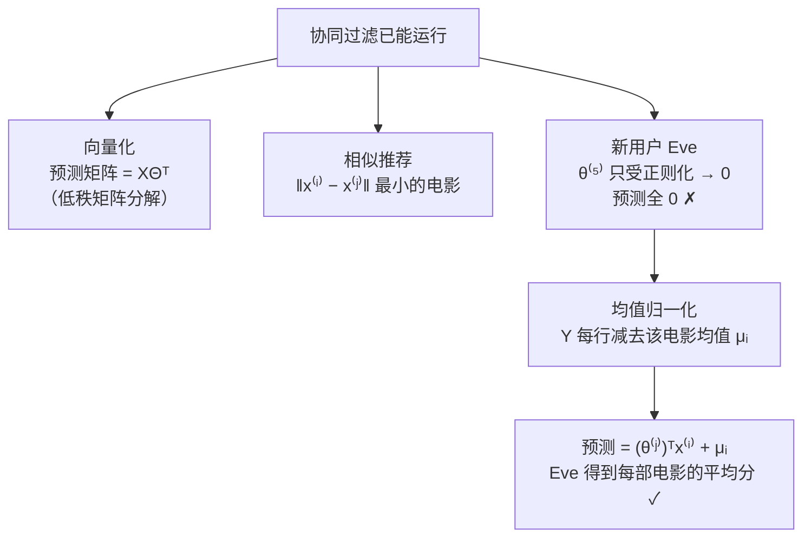

# 第 7 章 · 第 3 讲　低秩矩阵分解、相似推荐与均值归一化（课堂讲授版）

> [!quote] 本讲开场
> 同学们好。上一讲，协同过滤跑起来了——特征自己学，评分能预测。但一个算法能跑，离"能用"还差三件实用的收尾工作，今天全部补齐：
> 1. **向量化**：所有预测评分能写成 $X\Theta^T$ 一个矩阵乘法——这就是"低秩矩阵分解"，也是这一章名字的由来；
> 2. **相似推荐**：学出的电影特征怎么用来找"相似的电影"——"看过这部的人还看了……"；
> 3. **均值归一化**：一个没评过任何电影的新用户，算法会给他预测**全 0 分**——这显然荒谬，怎么修。
>
> 前两讲解决"会不会做"，这一讲解决"做得好不好、用不用得上"。我们开始。

---

## 一、向量化：低秩矩阵分解

### 1.1 把评分表写成矩阵

课件 p17：把评分表直接写成一个 $n_m\times n_u$ 的矩阵 $Y$，第 $i$ 行第 $j$ 列就是 $y^{(i,j)}$：

$$Y=\begin{bmatrix}5&5&0&0\\5&?&?&0\\?&4&0&?\\0&0&5&4\\0&0&5&0\end{bmatrix}$$

> [!note] 课堂板书：评分矩阵 Y
> ![[C7.3-板书-评分矩阵Y.png]]
> 老师在右上写 $n_m=5,\ n_u=4$；在表下对每个用户列画一个向上箭头；在 $Y$ 的第一列和最后一列下方画箭头，引出 **$y^{(i,j)}$**——**$Y$ 的每一列是一个用户，每一行是一部电影**。

> [!warning] 课件的一处不一致，大家注意（后面均值归一化会用到）
> 仔细对照会发现：课件表格里 **Dave 对 Swords vs. karate 是 "?"**（没评过），但写成矩阵 $Y$ 时**最后一行最后一列却成了 0**。这个不一致在 p17、p18、p21、p22 的 $Y$ 里都存在，并且影响了第 3 节均值归一化的一个数字（见 3.3 的更正）。**以表格为准，那一格应是 "?"。**

### 1.2 预测评分矩阵

协同过滤对每一格的预测是 $(\theta^{(j)})^Tx^{(i)}$。把它们也排成矩阵：

$$\text{Predicted ratings}=\begin{bmatrix}
(\theta^{(1)})^T(x^{(1)}) & (\theta^{(2)})^T(x^{(1)}) & \cdots & (\theta^{(n_u)})^T(x^{(1)})\\
(\theta^{(1)})^T(x^{(2)}) & (\theta^{(2)})^T(x^{(2)}) & \cdots & (\theta^{(n_u)})^T(x^{(2)})\\
\vdots & \vdots & \ddots & \vdots\\
(\theta^{(1)})^T(x^{(n_m)}) & (\theta^{(2)})^T(x^{(n_m)}) & \cdots & (\theta^{(n_u)})^T(x^{(n_m)})
\end{bmatrix}$$

第 $(i,j)$ 格就是用户 $j$ 对电影 $i$ 的预测。

> [!note] 课堂板书：低秩矩阵分解（$X$、$\Theta$ 的定义与这个名字都是手写的）
> ![[C7.3-板书-低秩矩阵分解.png]]
> 板书内容：
> - 用粉圈把 $Y$ 左上角的 5 和预测矩阵左上角的 $(\theta^{(1)})^T(x^{(1)})$ 圈在一起；用绿圈把 $Y$ 里第 2 行第 2 列的 "?" 和预测矩阵里的 $(\theta^{(2)})^T(x^{(2)})$ 圈在一起——**逐格对应**。旁边写 $(i,j)\to(\theta^{(j)})^T(x^{(i)})$。
> - 在预测矩阵上方写 **$X\Theta^T$**，箭头指向整个矩阵。
> - 下面定义两个矩阵：
>   $$X=\begin{bmatrix}-\,(x^{(1)})^T\,-\\-\,(x^{(2)})^T\,-\\\vdots\\-\,(x^{(n_m)})^T\,-\end{bmatrix},\qquad \Theta=\begin{bmatrix}-\,(\theta^{(1)})^T\,-\\-\,(\theta^{(2)})^T\,-\\\vdots\\-\,(\theta^{(n_u)})^T\,-\end{bmatrix}$$
> - 最下面写 **→ Low rank matrix factorization**（低秩矩阵分解）并划线。

### 1.3 为什么是 $X\Theta^T$

大家跟着我算一遍矩阵形状：

- $X$ 的第 $i$ 行是 $(x^{(i)})^T$，形状 $n_m\times n$；
- $\Theta$ 的第 $j$ 行是 $(\theta^{(j)})^T$，形状 $n_u\times n$；所以 $\Theta^T$ 的第 $j$ **列**是 $\theta^{(j)}$，形状 $n\times n_u$；
- 矩阵乘法 $X\Theta^T$ 的 $(i,j)$ 元素 = $X$ 的第 $i$ 行 · $\Theta^T$ 的第 $j$ 列 = $(x^{(i)})^T\theta^{(j)}=(\theta^{(j)})^Tx^{(i)}$。✓

$$\underbrace{X\Theta^T}_{n_m\times n_u}=\underbrace{X}_{n_m\times n}\;\underbrace{\Theta^T}_{n\times n_u}$$

**所有预测，一次矩阵乘法算完。** 这就是"向量化 vectorization"——和第 2 章里用 $\theta^Tx$ 代替逐项求和是同一个思路：**能用矩阵运算，就别写循环。**

### 1.4 "低秩"是什么意思

> [!important] 为什么叫低秩矩阵分解（**秩的概念属线性代数拓展**，但名字必须懂）
> $X\Theta^T$ 是一个 $n_m\times n_u$ 的矩阵，但它是两个"瘦长"矩阵（宽度只有 $n$）的乘积，所以它的**秩最多是 $n$**。
>
> 现实中 $n_m$、$n_u$ 可能是几十万、几百万，而 $n$ 通常只取几十到几百。于是一个**巨大的评分矩阵**被**分解**成两个小矩阵的乘积——这就是"低秩矩阵分解"。
>
> 直觉上：**用户的口味和电影的类型只有少数几个主要维度。** 几百万个用户，并不是几百万种完全独立的口味；它们可以用几十个"口味分量"的组合来近似。**世界是低秩的**——这正是推荐系统能工作的根本原因。

> [!tip] 协同过滤 = 只在已知格子上拟合的低秩分解
> 协同过滤的目标 $J$，就是**让 $X\Theta^T$ 在 $r(i,j)=1$ 的格子上尽量接近 $Y$**（加上对 $X$、$\Theta$ 的正则化）。未知格子不参与拟合——它们正是我们要预测的。**拟合已知、预测未知，就这么简单。**

---

## 二、找相似的电影

课件 p19 **Finding related movies**。

> For each product $i$, we learn a feature vector $x^{(i)}\in\mathbb{R}^n$.
> How to find movies $j$ related to movie $i$?

> [!note] 课堂板书：找相似电影
> ![[C7.3-板书-找相似电影.png]]
> 老师写了两行：
> - 学出的特征可能对应 **$x_1=$ romance，$x_2=$ action，$x_3=$ comedy，$x_4=\ldots$**
> - **small $\lVert x^{(i)}-x^{(j)}\rVert$ → movie $j$ and $i$ are "similar"**（特征向量距离小 ⟹ 两部电影相似）
>
> 并在 "movies $j$" 和 "movie $i$" 下面各划线、画箭头。

**做法**：

$$\text{与电影 } i \text{ 最相似的 5 部电影} = \text{使 } \lVert x^{(i)}-x^{(j)}\rVert \text{ 最小的 5 个 } j$$

> [!important] 为什么这样可行
> 协同过滤学出的 $x^{(i)}$ 概括了"**什么样的人喜欢这部电影**"。两部电影的特征向量接近，意味着**同一批人倾向于同时喜欢（或同时不喜欢）它们**——这正是"看过这部的人还看了……"的含义。
>
> 注意上一讲 5.3 讲过特征坐标不一定可解释，但**距离是可靠的**：旋转、缩放、取负都不改变两点之间的欧氏距离。**坐标可以漂移，距离稳如泰山。**

> [!tip] 与 K-means 的联系
> 这里用的"距离近 = 相似"，就是 [[C4.1 无监督学习与 K-means 算法]] 里 K-means 分配步用的判据。实际上，可以对学出的 $x^{(i)}$ 跑一遍 K-means，把电影自动聚成若干"类型"。（**拓展**）

---

## 三、均值归一化

### 3.1 一个新用户

课件 p21 **Users who have not rated any movies**：来了第 5 个用户 Eve，**一部电影都没评过**。

| 电影 | Alice | Bob | Carol | Dave | **Eve (5)** |
|---|---|---|---|---|---|
| Love at last | 5 | 5 | 0 | 0 | **?** |
| Romance forever | 5 | ? | ? | 0 | **?** |
| Cute puppies of love | ? | 4 | 0 | ? | **?** |
| Nonstop car chases | 0 | 0 | 5 | 4 | **?** |
| Swords vs. karate | 0 | 0 | 5 | ? | **?** |

> [!question] 停一下，先自己想
> 协同过滤会给 Eve 学出什么样的 $\theta^{(5)}$？进而给她预测什么评分？
>
> 提示：看联合目标里，哪些项含有 $\theta^{(5)}$。

### 3.2 算法给 Eve 的答案：全 0

看联合目标

$$\min\;\frac12\sum_{(i,j):r(i,j)=1}\left((\theta^{(j)})^Tx^{(i)}-y^{(i,j)}\right)^2+\frac\lambda2\sum_i\sum_k\left(x^{(i)}_k\right)^2+\frac\lambda2\sum_j\sum_k\left(\theta^{(j)}_k\right)^2$$

里哪些项含有 $\theta^{(5)}$：

- **第一项（平方误差）**：只对 $r(i,j)=1$ 的格子求和。Eve 一格都没有，所以**第一项里根本没有 $\theta^{(5)}$**；
- **第三项（正则化）**：含有 $\frac\lambda2\left[(\theta^{(5)}_1)^2+(\theta^{(5)}_2)^2\right]$。

**$\theta^{(5)}$ 唯一受到的"力"就是正则化**，而正则化想把参数压向 0。所以

$$\theta^{(5)}=\begin{bmatrix}0\\0\end{bmatrix}\quad\Longrightarrow\quad(\theta^{(5)})^Tx^{(i)}=0\quad\text{对所有电影 }i$$

> [!note] 课堂板书：没评过分的用户（推理链全是手写的）
> ![[C7.3-板书-没评过分的用户.png]]
> 板书内容：
> - 在 Eve 那一列所有 "?" 旁边用粉笔写 **0**——算法的预测结果；Eve 的列在表和 $Y$ 里都被蓝框框出；
> - 在平方误差项下方加箭头（Eve 不在这一项里）；
> - 写出 **$n=2$**，**$\theta^{(5)}\in\mathbb{R}^2$**；
> - 把正则项里属于 Eve 的部分单独写出来：**$\frac\lambda2\left[(\theta^{(5)}_1)^2+(\theta^{(5)}_2)^2\right]$**，加箭头；
> - 结论：**$\theta^{(5)}=\begin{bmatrix}0\\0\end{bmatrix}$**，**$(\theta^{(5)})^Tx^{(i)}=0$**；
> - 左侧给 Love at last 和 Swords vs. karate 各画了粉箭头，在 Alice、Bob 对 Love at last 的 5 分和 Carol 对 Swords 的 5 分下面划线——**明明有这么多人给了高分，却给 Eve 预测 0 分。**

> [!warning] 这个结果很荒谬
> 预测 Eve 给**每一部**电影打 0 分，意味着**什么都不推荐给她**。可 Love at last 有两人打了 5 分、Swords vs. karate 也有人打了 5 分——**给新用户推荐"大家普遍喜欢的电影"才是合理的默认行为。**
>
> 这个问题有个名字叫**冷启动 cold start**（**拓展**：课件没给名字）——新用户、新电影缺少数据时怎么推荐。**任何推荐系统上线第一天都会遇到这个问题。**

### 3.3 修复：先减去每部电影的平均分

课件 p22 **Mean Normalization**（均值归一化）。做法四步：

**第 1 步**：对每部电影（$Y$ 的每一行），只用**已评过的**分数算平均，得到向量 $\mu$：

$$\mu=\begin{bmatrix}2.5\\2.5\\2\\2.25\\1.25\end{bmatrix}$$

**第 2 步**：从每个已知评分中减去它那部电影的平均分，得到新的 $Y$：

$$Y=\begin{bmatrix}2.5&2.5&-2.5&-2.5&?\\2.5&?&?&-2.5&?\\?&2&-2&?&?\\-2.25&-2.25&2.75&1.75&?\\-1.25&-1.25&3.75&-1.25&?\end{bmatrix}$$

**第 3 步**：用这个归一化后的 $Y$ **学 $\theta^{(j)}$ 和 $x^{(i)}$**（协同过滤本身一个字都不用改）。

**第 4 步**：预测时**把平均分加回去**：

$$\boxed{\;\text{用户 } j \text{ 对电影 } i \text{ 的预测}=(\theta^{(j)})^Tx^{(i)}+\mu_i\;}$$

> [!note] 课堂板书：均值归一化
> ![[C7.3-板书-均值归一化.png]]
> 板书内容：
> - 在原 $Y$ 每一行右侧的 "?" 旁用粉笔写出该行均值：**2.5、2.5、2、…**；第一行的 5、5、0、0 各自圈出（算均值用的就是它们）；最后一行 **0 0 5 0 用红框框出**，并圈出 Eve 的 "?"；
> - $\mu$ 的第一个元素 2.5 圈出、最后一个 1.25 红框框出；
> - 归一化后的 $Y$ 整体用蓝框框住，第一行的 2.5、2.5、−2.5、−2.5 圈出，最后一行 −1.25、−1.25、3.75、−1.25 红框框出。下面写 **learn $\theta^{(j)},x^{(i)}$**；
> - 左下写出预测公式 **$(\theta^{(j)})^T(x^{(i)})+\mu_i$**；
> - 最后一行写 **User 5 (Eve)：$\theta^{(5)}=\begin{bmatrix}0\\0\end{bmatrix}$**，于是
>   $$\underbrace{(\theta^{(5)})^T(x^{(i)})}_{=0}+\boxed{\mu_i}$$

**Eve 现在得到什么预测？** 她的 $\theta^{(5)}$ 仍然被正则化压成 0，所以 $(\theta^{(5)})^Tx^{(i)}=0$，但加上 $\mu_i$ 之后：

$$\text{Eve 对电影 } i \text{ 的预测}=0+\mu_i=\mu_i$$

**她对每部电影的预测就是这部电影的平均分。** Love at last 预测 2.5 分，Swords vs. karate 预测 1.25 分（或更正后的 1.67 分，见下）。**这就是"给新用户推荐大家普遍喜欢的电影"——一个朴素但完全合理的默认策略。**

> [!warning] 更正：$\mu_5$ 应为 $\frac53\approx1.67$，不是 1.25（考试可能埋坑）
> 课件 $\mu$ 的最后一个元素 1.25 是按 $Y$ 最后一行 $[0,0,5,0]$ 算的：$\frac{0+0+5+0}{4}=1.25$。
>
> 但按课件**表格**，Dave 对 Swords vs. karate 是 "?"（见 1.1 的警示）。均值归一化要求**只对已评过的分数求平均**，所以应是
> $$\mu_5=\frac{0+0+5}{3}=\frac53\approx1.667$$
> 相应地，归一化后最后一行应为 $[-1.67,\;-1.67,\;3.33,\;?]$。其余四行 $\mu_1\ldots\mu_4=2.5,2.5,2,2.25$ 无误（已程序复算）。
>
> **考试时**：如果题目给的是矩阵 $Y$，按矩阵算（最后一格是 0 就当 0）；如果给的是带 "?" 的表，**"?" 不参与求平均**。两种口径老师都认，但你要说清楚自己用的是哪个。

### 3.4 验算（**拓展**）

在课件的 5×5 表（含 Eve）上跑协同过滤：

| | Eve 的预测（5 部电影） |
|---|---|
| **不做**均值归一化 | $[0,\;0,\;0,\;0,\;0]$ |
| **做**均值归一化 | $[2.5,\;2.5,\;2.0,\;2.25,\;1.667]$ |

与上面的分析完全一致（最后一项按表格 "?" 计算为 $\frac53$）。

> [!tip] 为什么减均值而不是除以标准差
> [[C2.3 多变量线性回归与梯度下降实践]] 里的均值归一化是 $\frac{x-\mu}{s}$，既平移又缩放。这里**只平移不缩放**，因为所有评分本来就在同一个 0–5 的尺度上，不存在"某个特征的量级大得多"的问题。
>
> 减均值的作用是**把"默认预测"从 0 挪到平均分**：正则化把 $\theta$ 压向 0 时，预测就退化成 $\mu_i$，而不是退化成 0。**一个常数的移动，救活了冷启动问题。**

> [!question] 如果是一部没人评过的新电影呢？（**拓展**）
> 对称的问题：一部**没人评过**的电影，它的 $x^{(i)}$ 同样会被正则化压成 0，预测全是 $\mu_i$——可 $\mu_i$ 本身也没法算（没有评分可平均）。
>
> 这时可以**对列做归一化**（减去每个用户的平均分），但通常认为：**没人评过的电影本来就不该被推荐**，所以按行归一化（本讲的做法）更常用。大家体会一下这个不对称：新用户要给默认推荐，新电影不该被推。

---

## 四、停一下：第 7 章三讲的主线

把第 7 章三讲放一起，主线非常清楚：

| 讲 | 已知 | 学什么 | 关键式 |
|---|---|---|---|
| [[C7.1 推荐问题与基于内容的推荐（讲授版）]] | 电影特征 $x$ | 用户口味 $\theta$ | 每用户一个线性回归 |
| [[C7.2 协同过滤（讲授版）]] | 只有评分 | $x$ 和 $\theta$ 一起学 | 联合目标 $J(x,\theta)$ |
| 本讲 | — | 实现与细节 | $X\Theta^T$；$\lVert x^{(i)}-x^{(j)}\rVert$；$+\mu_i$ |

**从"假设特征已知"到"特征自己学"到"工程上能落地"**——推荐系统这一章是一个完整的递进。大家学完三讲，应该能自己从头把这个故事讲一遍。

---

## 本讲小结：今天要记住的三件事

> [!important] 三句话
> 1. **低秩矩阵分解**：把评分写成 $n_m\times n_u$ 矩阵 $Y$（行 = 电影，列 = 用户），所有预测评分就是 $X\Theta^T$，其中 $X$ 的第 $i$ 行是 $(x^{(i)})^T$（$n_m\times n$），$\Theta$ 的第 $j$ 行是 $(\theta^{(j)})^T$（$n_u\times n$）；因为 $n$ 远小于 $n_m,n_u$，这个乘积的秩至多为 $n$，故名"低秩矩阵分解"。协同过滤就是只在已知格子上拟合这个分解。
> 2. **相似推荐**：学出的特征 $x^{(i)}\in\mathbb{R}^n$ 概括了"什么样的人喜欢它"，**$\lVert x^{(i)}-x^{(j)}\rVert$ 小即两部电影相似**；与电影 $i$ 最相似的 5 部就是距离最小的 5 个 $j$。
> 3. **均值归一化解决新用户问题**：未评过任何电影的用户，其 $\theta$ 只受正则化作用而为 $\mathbf{0}$，预测全为 0。修复：每部电影只用**已有评分**求均值 $\mu_i$，从 $Y$ 中减去后学 $\theta,x$，预测时用 $(\theta^{(j)})^Tx^{(i)}+\mu_i$，新用户得到的就是每部电影的平均分。课件 $\mu=[2.5,2.5,2,2.25,1.25]^T$，其中**最后一项应为 $\frac53\approx1.67$**（课件矩阵把表格中 Dave 的 "?" 误写成了 0）。

### 速查表（考试前扫一眼）

| 名称 | 公式 / 内容 |
|---|---|
| 评分矩阵 | $Y\in\mathbb{R}^{n_m\times n_u}$，$Y_{ij}=y^{(i,j)}$ |
| 特征矩阵 | $X=\begin{bmatrix}(x^{(1)})^T\\\vdots\\(x^{(n_m)})^T\end{bmatrix}\in\mathbb{R}^{n_m\times n}$ |
| 参数矩阵 | $\Theta=\begin{bmatrix}(\theta^{(1)})^T\\\vdots\\( \theta^{(n_u)})^T\end{bmatrix}\in\mathbb{R}^{n_u\times n}$ |
| 预测矩阵 | $X\Theta^T$，第 $(i,j)$ 元 $=(\theta^{(j)})^Tx^{(i)}$ |
| 低秩 | $\mathrm{rank}(X\Theta^T)\le n\ll n_m,n_u$ |
| 相似电影 | $\lVert x^{(i)}-x^{(j)}\rVert$ 小 ⟹ 相似；取距离最小的 5 个 |
| 新用户问题 | $r(i,5)=0\ \forall i$ ⟹ $\theta^{(5)}$ 只受正则化 ⟹ $\theta^{(5)}=\mathbf 0$ ⟹ 预测全 0 |
| 均值 | $\mu_i=$ 电影 $i$ 所有**已有**评分的平均 |
| 归一化 | $y^{(i,j)}\leftarrow y^{(i,j)}-\mu_i$（仅对 $r(i,j)=1$） |
| 预测 | $(\theta^{(j)})^Tx^{(i)}+\mu_i$ |
| 新用户的预测 | $\mu_i$（每部电影的平均分） |
| 课件 $\mu$ | $[2.5,\;2.5,\;2,\;2.25,\;1.25]^T$；**更正：$\mu_5=5/3\approx1.67$** |
| 课件的不一致 | 表格 Dave×Swords vs. karate 为 "?"，矩阵 $Y$ 中写成 0 |
| 冷启动（**拓展**） | 新用户 / 新物品缺少数据时的推荐问题 |

## 下一讲预告

推荐系统动辄几百万用户、几亿条评分。[[C6.3 数据的力量与人工数据合成（讲授版）]] 也说过：**数据越多越好**。

可数据一多，问题来了。回忆梯度下降（[[C2.2 梯度下降]]）：**每走一步，都要把全部 $m$ 个样本扫一遍**，算出 $\sum_{i=1}^m$。如果 $m=3$ 亿，走一步就要算 3 亿次，走一千步就是三千亿次——训练一次要好几天。

第 8 章讲怎么对付这种规模：
- **随机梯度下降**：每一步**只看一个样本**，立刻更新；
- **小批量梯度下降**：每一步看 10 个或 100 个；
- **在线学习**：数据像流水一样源源不断地来，来一个学一个，学完就扔；
- **MapReduce**：把求和拆给 100 台机器同时算。

---
上一讲：[[C7.2 协同过滤（讲授版）]]
下一讲：[[C8.1 大数据集与随机梯度下降（讲授版）]]
返回：[[机器学习课程 MOC]]
