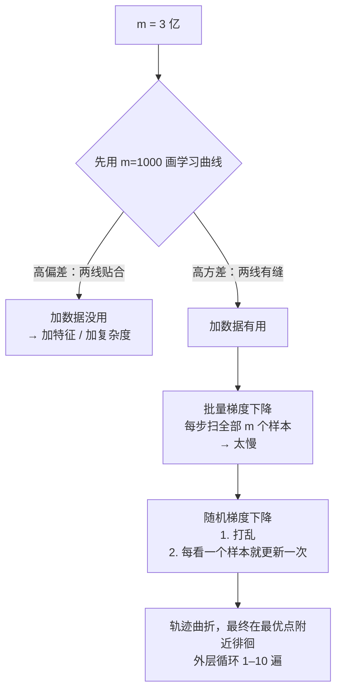

# C8.1 大数据集与随机梯度下降

> [!abstract] 本讲任务
> [[C6.3 数据的力量与人工数据合成]] 说：低偏差模型 + 海量数据 = 好结果。可“海量”到底有多大？课件的例子是 **$m=3$ 亿**。
>
> 这一讲回答：
> 1. **动手之前**：怎么判断加数据到底有没有用？（别花一周训练一个 1 亿样本的模型，才发现 1000 个样本效果一样）
> 2. 普通梯度下降在 $m=3$ 亿时**卡在哪里**？
> 3. **随机梯度下降 SGD**：每一步只看**一个**样本——它怎么做到的、代价是什么？

---

## 1. 先确认：真的需要大数据吗

### 1.1 数据确实有用

课件 p2 重温了 [[C6.3 数据的力量与人工数据合成]] 里的 Banko & Brill 实验：易混词分类（“For breakfast I ate **two** eggs.”），四种算法随训练集从十万增到十亿全都越来越准。

> **“It's not who has the best algorithm that wins. It's who has the most data.”**

![[C8.1-板书-数据决定上限.png]]

### 1.2 但要先用学习曲线检查

课件 p3 **Learning with large datasets**。

> [!note] 课堂板书
> ![[C8.1-板书-用学习曲线判断要不要大数据.png]]
>
> 板书在左边写 **$m=100{,}000{,}000$**，右边写 **$m=1{,}000$?**，中间用一条竖线隔开。两张图的曲线旁分别写 **$J_{cv}(\theta)$**（红）和 **$J_{train}(\theta)$**（蓝）。一条粉色箭头从右图指向左图。

两张图都是**学习曲线**：横轴是训练集大小 $m$，纵轴是误差。

**左图**：$J_{train}$ 很低，$J_{cv}$ 很高，**两条线之间有一道大缝**，而且随着 $m$ 增大，缝在慢慢收窄。

→ 这是**高方差（过拟合）**。模型把训练集记住了但泛化不好。**加数据能把缝压小——值得用 1 亿个样本。**

**右图**：两条曲线**很快就贴在一起了**，而且都停在一个比较高的位置。

→ 这是**高偏差（欠拟合）**。模型太简单，数据再多也没用——它早就“学到头了”。

> [!important] 板书 “$m=1{,}000$?” 的含义：先做一个便宜的检查
> 在花大把时间训练 1 亿样本的模型之前，**先随机抽 1000 个样本**训练一下，画出学习曲线：
> - 如果是**右图**（高偏差）：**加数据没用**。1000 个样本和 1 亿个样本效果差不多，省下这笔算力。正确的方向是**给模型加特征 / 加隐藏单元**，把它变成低偏差模型，然后再回来看。
> - 如果是**左图**（高方差）：**加数据有用**，放心上大数据。
>
> 这就是 [[C6.1 系统设计的起点：垃圾邮件分类与误差分析]] 推荐做法第二步“画学习曲线”在大数据场景下的具体用法。偏差 / 方差的概念见 [[C2.7 过拟合与正则化]]。

---

## 2. 批量梯度下降卡在哪里

### 2.1 回顾

课件 p5 **Linear regression with gradient descent**（同 [[C2.3 多变量线性回归与梯度下降实践]]）：

$$h_\theta(x)=\sum_{j=0}^{n}\theta_jx_j$$

$$J_{train}(\theta)=\frac{1}{2m}\sum_{i=1}^{m}\left(h_\theta(x^{(i)})-y^{(i)}\right)^2$$

$$\text{Repeat}\ \{\quad\theta_j:=\theta_j-\alpha\frac1m\sum_{i=1}^{m}\left(h_\theta(x^{(i)})-y^{(i)}\right)x_j^{(i)}\qquad(\text{for every } j=0,\ldots,n)\quad\}$$

$J$ 是一个碗状的凸函数（课件右边的 3D 图），梯度下降一步步滑到碗底。

![[C8.1-板书-线性回归的批量梯度下降.png]]

### 2.2 问题出在求和号

> [!note] 课堂板书
> ![[C8.1-板书-批量梯度下降的代价.png]]
>
> 板书用蓝框把更新式里的 **$\frac1m\sum_{i=1}^m(\ldots)$ 整个框起来**，并在 $m$ 上加箭头；下面写
> **$m=300{,}000{,}000$**
> **Batch gradient descent**（批量梯度下降）
>
> 右边的等高线图上，用红线画出梯度下降的轨迹：一步一步、平稳地从右下向中心的最优点前进。

**每走一步**，都要对 **3 亿个样本**计算 $(h_\theta(x^{(i)})-y^{(i)})x_j^{(i)}$ 并求和。

- 3 亿个样本通常**装不进内存**，要从硬盘一批批读进来，算完再读下一批——光读一遍就很慢。
- 读完一遍、求完和，**只能走一小步**。
- 要走几百上千步才能收敛。

> [!important] 名字的由来
> 这种“每一步都用**全部** $m$ 个样本”的梯度下降叫**批量梯度下降 batch gradient descent**——“batch”指每次用一整批（全部）数据。之前所有章节里的梯度下降都是它。

---

## 3. 随机梯度下降

### 3.1 换一个角度看代价函数

课件 p7 左右对比。关键一步是把代价函数**拆成单个样本的代价之和**：

$$\text{cost}\left(\theta,(x^{(i)},y^{(i)})\right)=\frac12\left(h_\theta(x^{(i)})-y^{(i)}\right)^2$$

$$J_{train}(\theta)=\frac1m\sum_{i=1}^{m}\text{cost}\left(\theta,(x^{(i)},y^{(i)})\right)$$

$\text{cost}(\theta,(x^{(i)},y^{(i)}))$ 衡量的是：**模型在第 $i$ 个样本上表现得多差**。$J_{train}$ 就是它们的平均。

### 3.2 算法

> [!note] 课堂板书（这一页的 SGD 算法整个是手写的）
> ![[C8.1-板书-批量vs随机梯度下降.png]]
>
> **左栏（批量梯度下降）**：把 $\frac1m\sum_{i=1}^m(h_\theta(x^{(i)})-y^{(i)})x_j^{(i)}$ 用红框框出，下面粉笔写 **$\frac{\partial}{\partial\theta_j}J_{train}(\theta)$**，并在底下写 $m=300{,}000{,}000$ 加箭头指向求和。
>
> **右栏（随机梯度下降）**：在 $\text{cost}(\theta,(x^{(i)},y^{(i)}))$ 下划线，用蓝色双向箭头把左边的 $J_{train}$ 和右边的 $J_{train}$ 连起来（**是同一个东西**）。然后手写了完整算法：
>
> **1. Randomly shuffle dataset.**（红箭头）
> **2. Repeat {**
> 　　**for $i=1,\ldots,m$ {**
> 　　　　$\theta_j:=\theta_j-\alpha\left(h_\theta(x^{(i)})-y^{(i)}\right)\cdot x_j^{(i)}$　（红框）
> 　　　　(for $j=0,\ldots,n$)
> 　　**}**
> **}**
>
> 红框里的项用粉色箭头引出，写 **$\dfrac{\partial}{\partial\theta_j}\text{cost}\left(\theta,(x^{(i)},y^{(i)})\right)$**。最下面粉笔写 $(x^{(1)},y^{(1)}),(x^{(2)},y^{(2)}),(x^{(3)},y^{(3)}),\ldots$ ——**逐个样本地过**。

课件 p8 给出了正式版本：

$$
\begin{aligned}
&\textbf{1. } \text{Randomly shuffle (reorder) training examples}\\
&\textbf{2. } \text{Repeat}\ \{\\
&\qquad\text{for } i:=1,\ldots,m\ \{\\
&\qquad\qquad\theta_j:=\theta_j-\alpha\left(h_\theta(x^{(i)})-y^{(i)}\right)x_j^{(i)}\qquad(\text{for every } j=0,\ldots,n)\\
&\qquad\}\\
&\}
\end{aligned}
$$

### 3.3 逐项对比

| | 批量梯度下降 | 随机梯度下降 |
|---|---|---|
| 每步用几个样本 | 全部 $m$ 个 | **1 个** |
| 每步的更新量 | $\frac1m\sum_{i=1}^m(h_\theta(x^{(i)})-y^{(i)})x_j^{(i)}$ | $(h_\theta(x^{(i)})-y^{(i)})x_j^{(i)}$ |
| 更新量是什么的导数 | $\frac{\partial}{\partial\theta_j}J_{train}(\theta)$ | $\frac{\partial}{\partial\theta_j}\text{cost}(\theta,(x^{(i)},y^{(i)}))$ |
| 扫一遍数据走几步 | **1 步** | **$m$ 步** |

> [!important] 核心想法
> 批量梯度下降：看完**所有**样本，才走**一**步。
> 随机梯度下降：**每看一个**样本，就立刻走一步——“让参数稍微更适合这一个样本”。
>
> 扫一遍 3 亿个样本，批量法只走了 1 步，SGD 已经走了 3 亿步。

**为什么“只看一个样本”也能行？** 单个样本的梯度 $\frac{\partial}{\partial\theta_j}\text{cost}(\theta,(x^{(i)},y^{(i)}))$ 是整体梯度 $\frac{\partial}{\partial\theta_j}J_{train}$ 的一个**有噪声的估计**——若 $i$ 是随机抽的，它的**期望**恰好等于整体梯度（因为 $J_{train}$ 就是所有 cost 的平均）。所以平均来说，SGD 每一步都在往正确的方向走，只是每一步都带着噪声。（**拓展**：课件没写“期望相等”这句，但这是 SGD 成立的理由。）

### 3.4 为什么要先随机打乱

> [!warning] 第 1 步 “Randomly shuffle” 不能省
> 数据集常常是**有序的**：比如按时间排、按类别排（前 1 亿个都是正例、后 2 亿个都是负例）。
>
> 如果不打乱，SGD 会先连着看 1 亿个正例——参数被一路拽向“全部预测正”；然后再连着看负例——又被拽回来。**每一步不再是整体梯度的无偏估计**，轨迹会剧烈地系统性摆动。
>
> 打乱之后，每个样本都像是随机抽的，3.3 那条“期望等于整体梯度”才成立。

### 3.5 SGD 的轨迹长什么样

> [!note] 课堂板书
> ![[C8.1-板书-随机梯度下降的轨迹.png]]
>
> 板书在 “Repeat” 旁写 **1–10×**，在 “for $i:=1,\ldots,m$” 下划线，用大括号把内层循环括起，底下写 **$m=300{,}000{,}000$**（红线）。
>
> 右边等高线图上用**粉笔画出 SGD 的轨迹**：从右下角出发，**弯弯曲曲、来回折返地**向中心走；到了中心附近并不停下，而是**在最优点周围一小块区域里打转**（粉色和红色的乱线团，外面画了一个粉圈）。旁边还有一个小红圈标出一次偏离。

![[C8-三种梯度下降的轨迹.png]]

（上图是一次模拟，同一个线性回归问题：**红线**是批量梯度下降，步子大、平稳、直奔最优点；**紫线**是随机梯度下降，每步都有随机抖动，路线曲折，最终在最优点附近徘徊；**橙线**是下一讲的小批量梯度下降，介于两者之间。）

> [!important] 两个特征
> 1. **整体趋势对，每一步不一定对**：某一个样本可能把参数往错误的方向拽一下，但大多数样本都往正确方向拽，所以宏观上在朝最优点走。
> 2. **不会精确收敛到最小值**：到了最优点附近，每个样本仍会把参数往各自的方向推一下，于是参数**在最小值附近一小块区域里持续徘徊**。
>
> 第 2 点在实践中通常**可以接受**——那一小块区域里的参数都已经很好了。如果一定要收敛，下一讲给出办法（让学习率 $\alpha$ 逐渐减小）。

### 3.6 外层循环跑几遍

板书在 “Repeat” 旁写的 **1–10×**：外层循环（把整个数据集完整过一遍，今天常称为一个 epoch——**拓展**）通常跑 **1 到 10 遍**就够了。

> [!tip] 当 $m$ 非常大时，一遍可能就够了
> 如果 $m=3$ 亿，**过一遍就已经做了 3 亿次更新**。很可能在过完前一千万个样本时参数就已经很好了，后面的只是在最优点附近打转。所以大数据下 SGD 常常**只需要一遍**——而批量梯度下降一遍只走了一步。

---

## 4. 停一下，我们刚才干了什么

---

## 5. 这一讲的三句话

> [!important] 三句话
> 1. **上大数据之前先画学习曲线**：用一个小样本（如 $m=1000$）训练，若 $J_{train}$ 与 $J_{cv}$ 之间有大缝（**高方差**），加数据有用；若两线早早贴合且都高（**高偏差**），加数据没用，应先加特征 / 加模型复杂度。
> 2. **批量梯度下降每一步都要对全部 $m$ 个样本求和**（$m=3$ 亿时每步 3 亿次计算），太慢。**随机梯度下降**把代价拆成单样本代价 $\text{cost}(\theta,(x^{(i)},y^{(i)}))=\frac12(h_\theta(x^{(i)})-y^{(i)})^2$、$J_{train}=\frac1m\sum_i\text{cost}$，然后：**① 随机打乱数据；② Repeat { for $i=1..m$：$\theta_j:=\theta_j-\alpha(h_\theta(x^{(i)})-y^{(i)})x_j^{(i)}$ }**——每看一个样本就更新一次，扫一遍数据走 $m$ 步。
> 3. **SGD 的轨迹曲折但总体朝向最优点，最终在最优点附近徘徊而不精确收敛**（通常可接受）；外层循环一般 **1–10 遍**，$m$ 极大时一遍即可。打乱数据不能省，否则有序数据会让参数被系统性地来回拽动。

### 速查表

| 名称 | 公式 / 内容 |
|---|---|
| 学习曲线（高方差） | $J_{train}$ 低、$J_{cv}$ 高、之间有缝 → 加数据有用 |
| 学习曲线（高偏差） | 两线很快贴合且都高 → 加数据没用 |
| 便宜的检查 | 先用 $m=1000$ 画学习曲线，再决定要不要上 1 亿 |
| 线性回归假设 | $h_\theta(x)=\sum_{j=0}^n\theta_jx_j$ |
| 训练代价 | $J_{train}(\theta)=\frac{1}{2m}\sum_{i=1}^m(h_\theta(x^{(i)})-y^{(i)})^2$ |
| 批量梯度下降 | $\theta_j:=\theta_j-\alpha\frac1m\sum_{i=1}^m(h_\theta(x^{(i)})-y^{(i)})x_j^{(i)}$，每步用全部 $m$ 个 |
| 单样本代价 | $\text{cost}(\theta,(x^{(i)},y^{(i)}))=\frac12(h_\theta(x^{(i)})-y^{(i)})^2$ |
| 关系 | $J_{train}(\theta)=\frac1m\sum_{i=1}^m\text{cost}(\theta,(x^{(i)},y^{(i)}))$ |
| SGD 第 1 步 | Randomly shuffle training examples |
| SGD 第 2 步 | Repeat { for $i=1..m$：$\theta_j:=\theta_j-\alpha(h_\theta(x^{(i)})-y^{(i)})x_j^{(i)}$ } |
| SGD 更新量 | $=\frac{\partial}{\partial\theta_j}\text{cost}(\theta,(x^{(i)},y^{(i)}))$ |
| 扫一遍走几步 | 批量 1 步；SGD $m$ 步 |
| 外层循环 | 1–10 遍；$m$ 极大时 1 遍即可 |
| SGD 轨迹 | 曲折，最终在最优点附近徘徊 |
| 为什么可行（**拓展**） | 随机样本的梯度期望 = 整体梯度 |

> [!abstract] 下一讲预告
> 批量梯度下降一步看 $m$ 个，SGD 一步看 1 个。**中间呢？** 一步看 10 个——这叫**小批量梯度下降 mini-batch**，它在现代机器学习里是事实上的标准，原因是它能利用**向量化**同时算 10 个样本，速度往往比 SGD 还快。
>
> 另一个问题：SGD 一直在抖，**怎么知道它收敛了没有？** 批量梯度下降可以每步算一次 $J_{train}$ 画曲线——但 SGD 要是每步都算 3 亿个样本的 $J_{train}$，就白省了。课件给出的办法是：**每 1000 步，画一次最近 1000 个样本的平均 cost**。下一讲会看到四种典型曲线形状各自说明什么，以及“让学习率 $\alpha$ 随时间减小”这个让 SGD 真正收敛的技巧。

---

上一讲：[[C7.3 低秩矩阵分解、相似推荐与均值归一化]]
下一讲：[[C8.2 小批量梯度下降与 SGD 的收敛]]
返回：[[机器学习课程 MOC]]
