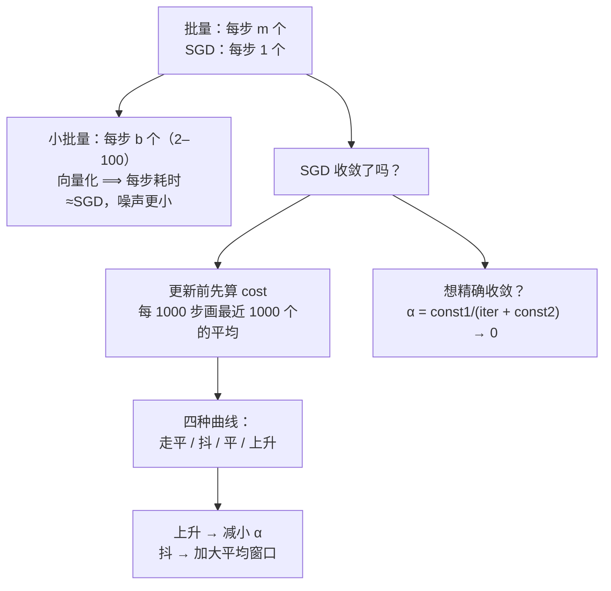

# C8.2 小批量梯度下降与 SGD 的收敛

> [!abstract] 本讲任务
> [[C8.1 大数据集与随机梯度下降]] 给了两个极端：批量梯度下降每步看 $m$ 个样本，SGD 每步看 1 个。这一讲：
> 1. **中间路线**：每步看 $b$ 个——**小批量梯度下降**。为什么它常常比 SGD 还快？
> 2. **SGD 收敛了没有？** 怎么在不重新扫一遍 3 亿个样本的前提下画出学习曲线
> 3. 四种典型曲线各说明什么、该怎么调
> 4. **让 SGD 真正收敛**的技巧：学习率随时间减小

---

## 1. 小批量梯度下降

### 1.1 三种做法

课件 p10：

| 方法 | 每次迭代用多少样本 |
|---|---|
| **批量梯度下降** Batch gradient descent | 全部 $m$ 个（Use **all** $m$ examples in each iteration） |
| **随机梯度下降** Stochastic gradient descent | **1** 个（Use **1** example in each iteration） |
| **小批量梯度下降** Mini-batch gradient descent | **$b$** 个（Use $b$ examples in each iteration） |

> [!note] 课堂板书（$b$ 的取值和更新式都是手写的）
> ![[C8.2-板书-小批量梯度下降.png]]
>
> 板书写出：
> - **$b=$ mini-batch size**（小批量大小）。**$b=10$**，常用范围 **2–100**。
> - Get $\boxed{b=10}$ examples $(x^{(i)},y^{(i)}),\ldots,(x^{(i+9)},y^{(i+9)})$
> - 更新式：
>   $$\theta_j:=\theta_j-\alpha\frac{1}{\boxed{10}}\sum_{k=i}^{\boxed{i+9}}\left(h_\theta(x^{(k)})-y^{(k)}\right)x_j^{(k)}$$
>   （$\frac1{10}$ 和上限 $i+9$ 用粉框标出，粉色箭头从“$b=10$”指向上限 $i+9$）
> - 左边一个回环箭头：**$i:=i+10$** ——下一批从第 11 个开始。

### 1.2 算法

课件 p11，以 $b=10$、$m=1000$ 为例：

$$
\begin{aligned}
&\text{Say } b=10,\ m=1000.\\
&\text{Repeat}\ \{\\
&\qquad\text{for } i=1,11,21,31,\ldots,991\ \{\\
&\qquad\qquad\theta_j:=\theta_j-\alpha\frac{1}{10}\sum_{k=i}^{i+9}\left(h_\theta(x^{(k)})-y^{(k)}\right)x_j^{(k)}\qquad(\text{for every } j=0,\ldots,n)\\
&\qquad\}\\
&\}
\end{aligned}
$$

内层循环 $i$ 取 $1,11,21,\ldots,991$，一共 $\frac{1000}{10}=100$ 个值——**扫一遍数据走 100 步**。（批量法走 1 步，SGD 走 1000 步。）

> [!note] 课堂板书
> ![[C8.2-板书-小批量的循环写法.png]]
>
> 板书把 $b=10$ 粉框、$m=1000$ 红框、$991$ 红框（最后一批的起点）；把更新式整体蓝框框起。右上写：
> - → **$b$ examples**（小批量）
> - → **1 example**（SGD）
> - **Vectorization**（划线）
>
> 底下写 $m=300{,}000{,}000$ 和 $b=10$，各加箭头。

### 1.3 为什么小批量可能比 SGD 还快

> [!question] 停一下，先自己想
> SGD 每步只算 1 个样本，小批量每步要算 10 个。**小批量每步的计算量是 SGD 的 10 倍，怎么会更快？**

答案就是板书右上角那个词：**Vectorization（向量化）**。

> [!important] 向量化的威力
> 10 个样本的梯度 $\sum_{k=i}^{i+9}(h_\theta(x^{(k)})-y^{(k)})x_j^{(k)}$ 可以写成一次**矩阵运算**：把这 10 个样本排成一个 $10\times(n+1)$ 的矩阵 $X_b$，梯度就是 $X_b^T(X_b\theta-y_b)$。
>
> 现代 CPU / GPU 的线性代数库对矩阵运算高度优化（并行、缓存、SIMD 指令）。**算一个 $10\times(n+1)$ 的矩阵乘法，花的时间往往和算 1 个样本差不多**，远不到 10 倍。
>
> 于是：**小批量每步的耗时 ≈ SGD，但每步的梯度估计噪声小得多**（10 个样本的平均比 1 个样本稳定）→ 走得更稳、更快收敛。

> [!warning] 代价：多了一个超参数 $b$
> $b$ 要选。太小（接近 1）失去向量化的好处；太大（接近 $m$）又变回批量梯度下降。课件给的 2–100 是经验范围；今天在 GPU 上训练神经网络时，32、64、128、256 很常见。（**拓展**）

![[C8-三种梯度下降的轨迹.png]]

（回顾 [[C8.1 大数据集与随机梯度下降]] 的这张图：**橙线**是小批量，抖动比 SGD（紫线）小，每步又比批量法（红线）便宜。）

---

## 2. SGD 收敛了没有

### 2.1 批量法怎么检查

课件 p13：

> Batch gradient descent: Plot $J_{train}(\theta)$ as a function of the number of iterations of gradient descent.

$$J_{train}(\theta)=\frac{1}{2m}\sum_{i=1}^{m}\left(h_\theta(x^{(i)})-y^{(i)}\right)^2$$

每走一步算一次 $J_{train}$，画成“迭代次数—$J$”曲线，看它是否在下降、是否走平（同 [[C2.3 多变量线性回归与梯度下降实践]] 诊断 $\alpha$ 的方法）。

> [!note] 课堂板书
> ![[C8.2-板书-检查收敛.png]]
>
> 板书把 $J_{train}(\theta)$ 红框框出，把 $\sum_{i=1}^m$ 蓝框框出，旁边写 **$m=300{,}000{,}000$**（红线）——**对 SGD 来说，每步都算一次这个求和，等于把 SGD 省下的时间全部还回去**。

### 2.2 SGD 的检查办法

课件原文：

> **Stochastic gradient descent:**
> $\text{cost}(\theta,(x^{(i)},y^{(i)}))=\frac12(h_\theta(x^{(i)})-y^{(i)})^2$
> During learning, **compute $\text{cost}(\theta,(x^{(i)},y^{(i)}))$ before updating $\theta$ using $(x^{(i)},y^{(i)})$.**
> **Every 1000 iterations** (say), plot $\text{cost}(\theta,(x^{(i)},y^{(i)}))$ **averaged over the last 1000 examples** processed by algorithm.

两个要点：

1. **在用 $(x^{(i)},y^{(i)})$ 更新 $\theta$ 之前**，先算一下当前 $\theta$ 在这个样本上的 cost。
2. 每 1000 次迭代，把最近 1000 个 cost 取平均，画一个点。

> [!important] 为什么一定要“在更新之前”算
> 如果**先**用这个样本更新 $\theta$，**再**算它的 cost——$\theta$ 刚刚被“专门调整过来适应这个样本”，cost 自然偏小，**这是作弊**。
>
> 在更新**之前**算，相当于**用一个模型还没见过的样本去测它**——这是一个诚实的“测试误差”估计。而且这个 cost 在更新时反正要算（梯度里就有 $h_\theta(x^{(i)})-y^{(i)}$），**几乎是免费的**。

> [!tip] 为什么要取平均
> 单个样本的 cost 噪声极大（有的样本本来就难，cost 高；有的简单，cost 低）。平均 1000 个，噪声就被压下去，曲线才能看出趋势。

### 2.3 四种典型曲线

课件 p14 给了四张图，横轴都是迭代次数，纵轴是“最近 1000 个样本的平均 cost”。

> [!note] 课堂板书
> ![[C8.2-板书-四种收敛曲线.png]]
>
> 板书在四张图上各画了对比曲线。

**① 左上：正常下降并趋于平稳（蓝线）。** 板书用**红线**画了一条“换用更小 $\alpha$”之后的曲线：开始下降得**更慢**，但最终停在**略低**一点的位置（右端的双向箭头标出差距）。

→ 解读：更小的学习率让 SGD 在最优点附近徘徊的范围**更小**（见 [[C8.1 大数据集与随机梯度下降]] 3.5），所以最终 cost 略低；代价是下降得慢。

**② 右上：平均 1000 个时曲线抖动明显（蓝线）。** 板书在上方写 **5000**（红框、粉框各一次），并画出**红线**——改为平均 5000 个之后的曲线：**更平滑**，但点更稀疏、反应更迟钝。

→ 解读：平均窗口越大，曲线越平滑，但你要等更久才能看到一个点，而且看到的是“更早以前”的状态。

**③ 左下：蓝线几乎是一条抖动的水平线，看不出在不在下降。** 板书画了两条对比线：
- **红线**（加大平均窗口后）：显现出一个**缓慢下降**的趋势 → 算法其实在学，只是被噪声盖住了；
- **粉线**（加大平均窗口后）：**仍然是平的** → 算法确实没在学。

→ 解读：先加大平均窗口看清趋势。若确实是平的，说明**算法没在学**——需要调整学习率、换特征，或者检查代码。

**④ 右下：曲线一路上升（发散）。** 板书写 **Use smaller $\alpha$.**

→ 解读：学习率太大，每步都冲过头。**减小 $\alpha$**。

![[C8-SGD收敛曲线的平均窗口.png]]

（上图是一次模拟：同一次 SGD 运行，分别每 100、1000、5000 次迭代取一次平均。窗口越大越平滑，但点越少、越滞后。）

> [!important] 四种情形速记
> | 曲线 | 含义 | 动作 |
> |---|---|---|
> | 下降后走平 | 正常收敛 | 想更低可试更小 $\alpha$（慢但终点略低） |
> | 抖得看不清 | 平均窗口太小 | 1000 → 5000 |
> | 平的 | 放大窗口后若仍平：没在学 | 调 $\alpha$ / 换特征 / 查代码 |
> | 上升 | 发散 | **减小 $\alpha$** |

---

## 3. 让 SGD 真正收敛

### 3.1 学习率一般保持常数

课件 p15 重写了一遍 SGD：

$$\text{cost}\left(\theta,(x^{(i)},y^{(i)})\right)=\frac12\left(h_\theta(x^{(i)})-y^{(i)}\right)^2$$

$$J_{train}(\theta)=\frac{1}{2m}\sum_{i=1}^{m}\text{cost}\left(\theta,(x^{(i)},y^{(i)})\right)$$

1. Randomly shuffle dataset.
2. Repeat { for $i:=1,\ldots,m$ { $\theta_j:=\theta_j-\alpha(h_\theta(x^{(i)})-y^{(i)})x_j^{(i)}$ (for $j=0,\ldots,n$) } }

> [!warning] 课件笔误：$J_{train}$ 多了一个 $\frac12$
> 课件 p15、p16 写的 $J_{train}(\theta)=\frac{1}{\boldsymbol{2}m}\sum_{i=1}^m\text{cost}(\ldots)$。
>
> 但 $\text{cost}$ 本身已经带了 $\frac12$。代入会得到 $\frac{1}{4m}\sum(h-y)^2$，与 p5 的定义 $J_{train}=\frac{1}{2m}\sum(h-y)^2$ 不符。**正确写法是 $J_{train}=\frac1m\sum\text{cost}$**——课件 p7 写的正是这个。
>
> 这个多出来的常数**不影响最优解**，也不影响 SGD 的更新式（更新式直接用 cost 的导数）；但考试写定义时，请写 $\frac1m\sum\text{cost}$。

> **Learning rate $\alpha$ is typically held constant.**（学习率通常保持为常数。）

> [!note] 课堂板书
> ![[C8.2-板书-学习率保持常数.png]]
>
> 板书在 “Learning rate $\alpha$ is typically held constant” 下划线；右边等高线图上用红笔画出 SGD 轨迹：**曲折地接近中心，然后在中心附近绕圈，不停下来**，并用红箭头指向那团打转的轨迹。公式里的 const1、const2 被红圈圈出。

这就是 [[C8.1 大数据集与随机梯度下降]] 3.5 说的“在最优点附近徘徊”。大多数时候可以接受。

### 3.2 如果一定要收敛：让 $\alpha$ 逐渐变小

> **Can slowly decrease $\alpha$ over time if we want $\theta$ to converge.**

$$\alpha=\frac{\text{const1}}{\text{iterationNumber}+\text{const2}}$$

> [!note] 课堂板书
> ![[C8.2-板书-学习率逐渐减小.png]]
>
> 板书把分母里的 **iterationNumber 用红框框出**，在式子右边写 **$\alpha\to0$**。右边等高线图上的红色轨迹：前半段仍然曲折，但**越接近中心，折返越小**，最后收敛到中心的一个**红点**上（外面画了一个红圈）。

**为什么这样能收敛**：iterationNumber（迭代次数）一直在增长，分母越来越大，$\alpha$ 越来越小，最终 $\alpha\to0$。每一步的“步长”越来越小，于是在最优点附近的抖动**越来越小**，最终停在最优点上。

- **const2** 的作用：防止一开始 iterationNumber 很小时 $\alpha$ 过大（例如第 1 步时 $\alpha=\frac{\text{const1}}{1+\text{const2}}$，而不是 $\frac{\text{const1}}{1}$）。
- **const1** 控制整体的步长量级。

> [!warning] 为什么“通常不这么做”
> 课件说 $\alpha$ **typically held constant**。原因是：
> 1. **多了两个超参数**（const1、const2）要调，而调它们本身就很费时。
> 2. 在最优点附近徘徊的那些参数**已经足够好**，精确收敛带来的提升往往很小。
>
> 所以这是一个“需要时才用”的技巧。（**拓展**：今天训练深度网络时，学习率衰减 learning rate decay / schedule 其实非常普遍，形式有阶梯衰减、余弦衰减等，思想都是这里的“先大步走、后小步收”。）

---

## 4. 停一下，我们刚才干了什么

---

## 5. 这一讲的三句话

> [!important] 三句话
> 1. **小批量梯度下降**每次迭代用 $b$ 个样本（$b$ 常取 **2–100**，课件例 $b=10$）：$\theta_j:=\theta_j-\alpha\frac1b\sum_{k=i}^{i+b-1}(h_\theta(x^{(k)})-y^{(k)})x_j^{(k)}$，然后 $i:=i+b$。$b=10,m=1000$ 时 $i=1,11,\ldots,991$，扫一遍走 100 步。它能用**向量化**一次算完 $b$ 个样本，每步耗时接近 SGD、梯度噪声却小得多，所以常常比 SGD 更快。
> 2. **检查 SGD 收敛**：每个样本**在用它更新 $\theta$ 之前**先算 $\text{cost}(\theta,(x^{(i)},y^{(i)}))$（诚实且几乎免费），**每 1000 次迭代画一次最近 1000 个 cost 的平均**。曲线太抖 → 加大平均窗口（如 5000）；放大后仍平 → 算法没在学；上升 → **减小 $\alpha$**；更小的 $\alpha$ 下降慢但最终略低。
> 3. **学习率通常保持常数**，SGD 于是在最优点附近徘徊；若想让 $\theta$ 真正收敛，可让 $\alpha=\frac{\text{const1}}{\text{iterationNumber}+\text{const2}}\to0$，代价是多两个超参数。（课件 p15–16 把 $J_{train}$ 写成 $\frac{1}{2m}\sum\text{cost}$ 是笔误，应为 $\frac1m\sum\text{cost}$。）

### 速查表

| 名称 | 公式 / 内容 |
|---|---|
| 三种梯度下降 | 批量：$m$ 个 / 步；SGD：1 个 / 步；小批量：$b$ 个 / 步 |
| $b$ 的范围 | 2–100（课件）；例 $b=10$ |
| 小批量更新 | $\theta_j:=\theta_j-\alpha\frac1{10}\sum_{k=i}^{i+9}(h_\theta(x^{(k)})-y^{(k)})x_j^{(k)}$，$i:=i+10$ |
| 课件例 | $b=10,m=1000$：$i=1,11,21,\ldots,991$，每遍 100 步 |
| 小批量的优势 | 向量化，每步耗时≈SGD，噪声小 |
| 批量法收敛检查 | 每步画 $J_{train}(\theta)$ vs 迭代次数 |
| SGD 收敛检查 | 更新 **前** 算 cost；每 1000 次迭代画最近 1000 个 cost 的平均 |
| 曲线：下降走平 | 正常；更小 $\alpha$ → 慢但终点略低 |
| 曲线：太抖 | 加大平均窗口（1000 → 5000），更平滑但更滞后 |
| 曲线：平的 | 放大窗口后仍平 → 没在学（调 $\alpha$ / 换特征） |
| 曲线：上升 | 发散 → 减小 $\alpha$ |
| 学习率 | 通常保持常数（SGD 在最优点附近徘徊） |
| 学习率衰减 | $\alpha=\dfrac{\text{const1}}{\text{iterationNumber}+\text{const2}}\to0$，使 $\theta$ 收敛 |
| 课件笔误 | p15–16 $J_{train}=\frac{1}{2m}\sum\text{cost}$ 应为 $\frac1m\sum\text{cost}$ |

> [!abstract] 下一讲预告
> 前两讲的数据都是“一个固定的大数据集”。可有些场景下，数据**根本不会停下来**：
>
> 一个快递网站，每分钟都有用户来询价、决定用或不用；一个购物网站，每秒钟都有人搜索、点击或不点击。数据像**流水**一样源源不断——没法“先收集好再训练”。
>
> 下一讲的**在线学习 online learning** 就是 SGD 在这种场景下的自然延伸：**来一个样本，用它更新一次，然后扔掉**。它还有一个意外的好处：**能跟上用户偏好的变化**。
>
> 最后是另一条路：一台机器算不完 3 亿个样本的求和，**那就拆给 100 台机器**——**MapReduce**。

---

上一讲：[[C8.1 大数据集与随机梯度下降]]
下一讲：[[C8.3 在线学习与 MapReduce]]
返回：[[机器学习课程 MOC]]
