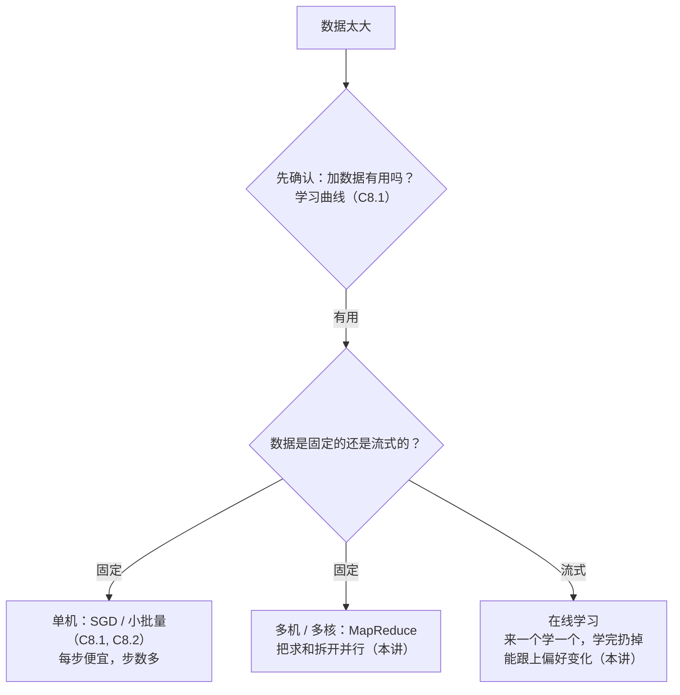

# 第 8 章 · 第 3 讲　在线学习与 MapReduce（课堂讲授版）

> [!quote] 本讲开场
> 同学们好，这是第 8 章也是"大规模机器学习"的最后一讲。今天补上两个工具：
> 1. **在线学习**：数据像流水一样源源不断——来一个学一个，学完就扔。它和 SGD 什么关系？有什么额外的好处？
> 2. **MapReduce / 数据并行**：一台机器算不完的求和，拆给多台机器（或多个 CPU 核）同时算。什么样的算法能这样拆？
>
> 一个是"数据停不下来怎么办"，一个是"一台机器不够用怎么办"。两个都是真实世界的日常问题。我们开始。

---

## 一、在线学习

### 1.1 场景：快递网站定价

课件 p18：

> Shipping service website where user comes, specifies origin and destination, you offer to ship their package for some asking price, and users sometimes choose to use your shipping service ($y=1$), sometimes not ($y=0$).
>
> Features $x$ capture properties of user, of origin/destination and asking price. We want to learn $p(y=1\mid x;\theta)$ to optimize price.

翻译成大白话：

- 用户来到网站，输入**起点和终点**；
- 你**报一个价**；
- 用户**接受**（$y=1$）或**离开**（$y=0$）；
- 特征 $x$ 包括：用户的属性、起点终点的属性、**你报的价格**；
- 要学的是 $p(y=1\mid x;\theta)$ ——"在这个价格下，这个用户会接受的概率"——用来**优化定价**。

> [!note] 课堂板书：在线学习快递定价（算法是整个手写的）
> ![[C8.3-板书-在线学习快递定价.png]]
> 老师在 $p(y=1\mid x;\theta)$ 下方引出箭头写 **price**（$x$ 里包含价格），右边写 **logistic regression**——这就是一个逻辑回归问题。然后写出算法：
>
> **Repeat forever {**
> 　　Get $\boxed{(x,y)}$ corresponding to user.
> 　　Update $\theta$ using $\boxed{(x,y)}$:
> 　　　　$\theta_j:=\theta_j-\alpha\left(h_\theta(x)-y\right)\cdot x_j\qquad(j=0,\ldots,n)$
> **}**
>
> 两个 $(x,y)$ 用粉框框出，并在旁边写了 $(x^{(i)},y^{(i)})$ 然后**用红叉划掉**。最下面写：**→ Can adapt to changing user preference.**

### 1.2 算法

$$
\begin{aligned}
&\textbf{Repeat forever}\ \{\\
&\qquad\text{获取当前用户对应的 } (x,y)\\
&\qquad\text{用 } (x,y) \text{ 更新 } \theta:\quad\theta_j:=\theta_j-\alpha\left(h_\theta(x)-y\right)x_j\qquad(j=0,\ldots,n)\\
&\}
\end{aligned}
$$

其中 $h_\theta(x)=\frac{1}{1+e^{-\theta^Tx}}$ 是逻辑回归（[[C2.5 逻辑回归]]）。

> [!important] 和 SGD 对比：更新式一字不差，区别在数据从哪来
> 这个更新式和 [[C8.1 大数据集与随机梯度下降（讲授版）]] 的 SGD **一字不差**（逻辑回归的梯度形式与线性回归相同，见 [[C2.5 逻辑回归]]）。区别只在于**数据从哪来**：
>
> | | SGD | 在线学习 |
> |---|---|---|
> | 数据 | 一个**固定的**训练集，$m$ 个样本 | **源源不断的数据流** |
> | 循环 | `for i = 1..m`，外面再套几遍 | `Repeat forever` |
> | 样本编号 | $(x^{(i)},y^{(i)})$ | $(x,y)$——**没有编号** |
> | 用完之后 | 留着，下一遍还会再用 | **扔掉，永不再用** |
>
> **为什么老师划掉了 $(x^{(i)},y^{(i)})$**：在线学习里**没有"第 $i$ 个样本"这个概念**。样本不存储、不编号、不重复使用——用户来了，学一下，就过去了。这就是"在线"的含义：**学习发生在数据到达的那一刻，而不是在数据收集完之后。**

> [!tip] 什么时候适合在线学习
> **数据流足够大**时。一个大型网站每天有成千上万的用户，数据多到根本不需要重复使用旧样本——新数据永远比旧数据多。如果用户很少（一天几个），就不如把数据存下来，用普通方法训练。**在线学习是"数据取之不尽"场景的专属武器。**

### 1.3 意外的好处：能跟上变化

板书最后一句：**Can adapt to changing user preference.**（能适应用户偏好的变化。）

> [!important] 为什么在线学习能"与时俱进"
> 用户偏好会变：经济好的时候人们对价格不敏感，经济差时就很敏感；竞争对手降价了，你的报价就显得贵了；节假日前大家更愿意付加急费……
>
> 在线学习**一直在用最新的数据更新 $\theta$**，而旧数据的影响会被新数据逐渐"冲淡"。所以 $\theta$ 会**自动跟着用户偏好漂移**。
>
> 一个在去年数据上训练好就不再更新的模型，做不到这一点。**固定模型会过期，在线模型不会。**

> [!question] 学到了 $p(y=1\mid x;\theta)$，怎么用它定价？（**拓展**）
> 假设运一单的成本是 $c$。对报价 $\text{price}$，期望利润是
> $$\mathbb{E}[\text{利润}]=p(y=1\mid x,\text{price};\theta)\times(\text{price}-c)$$
> 价格定高了，每单利润多但接受概率低；定低了反之。对每个用户，**枚举几个候选价格，选期望利润最大的那个报出去**。课件说的 "optimize price" 指的就是这一步。**学到的概率不是终点，用它做决策才是终点。**

### 1.4 另一个例子：商品搜索

课件 p19 **Product search (learning to search)**：

> [!note] 课堂板书：在线学习商品搜索
> ![[C8.3-板书-在线学习商品搜索.png]]
> 老师把几乎每一句都划了线：搜索词 "**Android phone 1080p camera**"、**100** phones in store、**Will return 10 results**（红线）；$x$ 的三类特征各自划线；在 "Learn $p(y=1\mid x;\theta)$" 旁写 **predicted CTR**；右侧写 $(x,y)$ 并加红箭头；最后一段的 special offers、news articles、product recommendation 都划了线。

**设定**：

- 用户搜索 "Android phone 1080p camera"；
- 店里有 **100** 款手机，要**返回 10 个**结果；
- $x$ = 手机的特征、搜索词和**手机名称**有几个词匹配、搜索词和**手机描述**有几个词匹配，等等；
- $y=1$ 如果用户**点击了**这个链接，$y=0$ 否则；
- 学习 $p(y=1\mid x;\theta)$——这叫**预测点击率 predicted CTR**（Click-Through Rate）；
- 用它**给用户展示最可能被点击的 10 款手机**。

**在线学习怎么发生**：每次展示 10 个结果，用户点了其中某些、没点其他的——**一次搜索就产生 10 个 $(x,y)$ 样本**。每个都拿来更新一次 $\theta$，然后扔掉。**用户在无意识中成了你的标注员，数据免费且无限。**

**其他例子**（课件原文）：
- 选择给用户展示哪些**特惠 special offers**；
- **新闻文章**的个性化选择；
- **商品推荐**（→ 这正是 [[C7.1 推荐问题与基于内容的推荐（讲授版）]] 的场景，推荐系统天然适合在线学习）。

---

## 二、MapReduce 与数据并行

### 2.1 想法：把求和拆开

课件 p21 **Map-reduce**。回到批量梯度下降：

$$\theta_j:=\theta_j-\alpha\frac{1}{400}\sum_{i=1}^{400}\left(h_\theta(x^{(i)})-y^{(i)}\right)x_j^{(i)}$$

（为了好算，假设 $m=400$。真实场景是 4 亿，道理一样。）这个求和有 400 项。**把它拆成 4 份，交给 4 台机器同时算**：

| 机器 | 用哪些样本 | 算什么 |
|---|---|---|
| Machine 1 | $(x^{(1)},y^{(1)}),\ldots,(x^{(100)},y^{(100)})$ | $\text{temp}_j^{(1)}=\sum_{i=1}^{100}(h_\theta(x^{(i)})-y^{(i)})\cdot x_j^{(i)}$ |
| Machine 2 | $(x^{(101)},y^{(101)}),\ldots,(x^{(200)},y^{(200)})$ | $\text{temp}_j^{(2)}=\sum_{i=101}^{200}(\ldots)$ |
| Machine 3 | $(x^{(201)},y^{(201)}),\ldots,(x^{(300)},y^{(300)})$ | $\text{temp}_j^{(3)}=\sum_{i=201}^{300}(\ldots)$ |
| Machine 4 | $(x^{(301)},y^{(301)}),\ldots,(x^{(400)},y^{(400)})$ | $\text{temp}_j^{(4)}=\sum_{i=301}^{400}(\ldots)$ |

**Combine（合并）**：

$$\theta_j:=\theta_j-\alpha\frac{1}{400}\left(\text{temp}_j^{(1)}+\text{temp}_j^{(2)}+\text{temp}_j^{(3)}+\text{temp}_j^{(4)}\right)\qquad(j=0,\ldots,n)$$

> [!note] 课堂板书：MapReduce 拆分求和
> ![[C8.3-板书-MapReduce拆分求和.png]]
> 板书内容：
> - 顶部写 **$m=400$**（框出）和 **$m=400{,}000{,}000$**——例子用 400 是为了好算，真实场景是 4 亿；
> - 原更新式整体粉框；$\alpha\frac1{400}$ 绿圈；$\sum_{i=1}^{400}(\ldots)$ 绿框、上限 400 蓝框；求和项下划红线；
> - 左边画了一个竖条代表训练集，用红线切成四段，上下标 $(x^{(1)},y^{(1)})$ 和 $(x^{(m)},y^{(m)})$，四个箭头分别指向四台机器；
> - **Machine 1 的 temp 公式是手写的**（课件只印了后三台的）：$\text{temp}_j^{(1)}=\sum_{i=1}^{100}(h_\theta(x^{(i)})-y^{(i)})\cdot x_j^{(i)}$，绿框；
> - 四个 $\text{temp}_j$ 都用红线标出上标，绿框框起，蓝箭头汇集到右边；
> - 右边**手写 Combine 步骤**（粉框）：$\theta_j:=\theta_j-\alpha\frac{1}{400}(\text{temp}_j^{(1)}+\text{temp}_j^{(2)}+\text{temp}_j^{(3)}+\text{temp}_j^{(4)})$，$(j=0,\ldots,n)$；$\alpha\frac1{400}$ 绿圈；
> - 左下角出处 **[Jeffrey Dean and Sanjay Ghemawat]** 加了箭头。

> [!important] 为什么这样算是对的：这不是近似，是精确相等
> $$\sum_{i=1}^{400}=\sum_{i=1}^{100}+\sum_{i=101}^{200}+\sum_{i=201}^{300}+\sum_{i=301}^{400}$$
> **求和可以任意拆分、分别计算、最后相加**（加法结合律）。合并后的结果和一台机器算出来的**完全相同**——不是近似，是**精确相等**。
>
> 理想情况下，4 台机器能把计算提速接近 **4 倍**（实际会略少，因为要把数据分发出去、把结果收回来，有网络通信开销）。**这个方案没有任何精度损失，纯粹的并行红利。**

### 2.2 名字

- **Map（映射）**：把任务分发给各台机器，各自对自己那份数据做同样的计算（每台算一个 $\text{temp}_j$）；
- **Reduce（归约）**：把各台的结果汇总成一个（把四个 $\text{temp}_j$ 加起来）。

课件 p22 用一张图画出了这个流程：Training set 切成四块 → Computer 1–4 → Combine results。

![[C8.3-板书-MapReduce示意.png]]

（板书在右上写了 $\sum_{i=1}^{400}(\ldots)$ 和 $\sum_{i=1}^{m}(\ldots)$——**被拆的就是这个求和**。）

MapReduce 这个框架出自 Google 的 Jeffrey Dean 和 Sanjay Ghemawat（2004），开源实现是 Hadoop。（**拓展**——考试不考出处，但当谈资很好用。）

### 2.3 什么样的算法能 MapReduce

课件 p23：

> **Many learning algorithms can be expressed as computing sums of functions over the training set.**
> （很多学习算法都可以表达为"在训练集上对某些函数求和"。）

> [!important] 判断标准：一句问话
> 问自己：**算法里最耗时的那部分，是不是一个"对训练集求和"？**
> - 是 → 可以 MapReduce；
> - 否 → 不行（或者不容易）。
>
> **能拆的前提是"求和"——乘法、除法、非线性变换都不能随便拆，但求和可以。** 记住这一条，以后判断任何算法能不能并行，都用它。

**例子**：用**高级优化算法**（[[C2.6 高级优化算法与多分类]] 的 fminunc、L-BFGS 等）训练逻辑回归时，每一步需要提供两样东西：

$$J_{train}(\theta)=-\frac1m\sum_{i=1}^{m}\left[y^{(i)}\log h_\theta(x^{(i)})+(1-y^{(i)})\log\left(1-h_\theta(x^{(i)})\right)\right]$$

$$\frac{\partial}{\partial\theta_j}J_{train}(\theta)=\frac1m\sum_{i=1}^{m}\left(h_\theta(x^{(i)})-y^{(i)}\right)\cdot x_j^{(i)}$$

**两个都是对训练集求和**。所以每台机器可以各算一份：$\text{temp}^{(k)}$（代价的部分和）和 $\text{temp}_j^{(k)}$（梯度的部分和），汇总后交给优化器。

> [!note] 课堂板书：求和形式的算法
> ![[C8.3-板书-求和形式的算法.png]]
> 老师在两个求和号下方各画了一个弯箭头，并分别写 **$\text{temp}^{(i)}$** 和 **$\text{temp}_j^{(i)}$**——**代价函数和梯度都可以拆成若干个 temp 的和**。

> [!warning] 课件笔误：$J_{train}$ 的符号（考试注意）
> 课件 p23 印的是
> $$J_{train}(\theta)=-\frac1m\sum_{i=1}^m y^{(i)}\log h_\theta(x^{(i)})\;\boldsymbol{-}\;(1-y^{(i)})\log(1-h_\theta(x^{(i)}))$$
> 中间是**减号**，并且缺了方括号。按这个写法，第二项的符号是反的。
>
> 正确的对数损失（[[C2.5 逻辑回归]]）是
> $$J(\theta)=-\frac1m\sum_{i=1}^m\Big[y^{(i)}\log h_\theta(x^{(i)})\;\boldsymbol{+}\;(1-y^{(i)})\log\big(1-h_\theta(x^{(i)})\big)\Big]$$
> 两项都是负的对数，都要被最小化。**考试按加号 + 方括号写。** 梯度那一行无误。

> [!question] 为什么 SGD 不太适合 MapReduce？（**拓展**）
> SGD 每一步只用**一个**样本，根本没有"对训练集求和"——没东西可拆。而且每一步都依赖上一步的 $\theta$，**天然是串行的**。
>
> 所以大规模场景下常见两种路线：**单机 SGD / 小批量**（每步便宜，步数多），或**多机 MapReduce + 批量法**（每步贵但可并行）。小批量梯度下降也可以把一个 batch 拆给多个核算，介于两者之间。**并行和串行各有地盘，选对场景才是关键。**

### 2.4 多核：一台机器上的 MapReduce

课件 p24 **Multi-core machines**：同样的图，只是把 Computer 1–4 换成了 **Core 1–4**。

![[C8.3-多核并行.png]]

今天一台普通电脑就有 4–16 个 CPU 核。**不需要多台机器，一台机器上的多个核就能做数据并行。**

> [!tip] 多核比多机的好处
> **没有网络通信开销**——各个核共享内存，数据不用在机器之间传来传去。所以多核并行的实际加速比往往比多机更接近理想值。
>
> 更进一步：很多线性代数库在做**向量化运算**时，**已经自动用了多核**。这时你只要把代码写成向量化形式（[[C8.2 小批量梯度下降与 SGD 的收敛（讲授版）]] 1.3），并行就自动发生了，连 MapReduce 都不用手写。（**拓展**）**最好的并行，是你感觉不到它的并行。**

---

## 三、停一下：整个第 8 章是一张工具箱

| 方法 | 每步用多少数据 | 能否并行 | 适合 |
|---|---|---|---|
| 批量梯度下降 | 全部 $m$ | **能**（MapReduce） | $m$ 不太大，或有集群 |
| 随机梯度下降 | 1 | 基本不能 | 单机、$m$ 极大 |
| 小批量梯度下降 | $b$ | 批内可向量化 / 多核 | 最常用的折中 |
| 在线学习 | 1（来一个用一个） | — | 数据流、偏好会变 |

**大家把这张表记下来，第 8 章就是"数据太大怎么办"的四选一：** 先问加数据有没有用，再问数据是固定还是流式，然后按场景选武器。

---

## 本讲小结：今天要记住的三件事

> [!important] 三句话
> 1. **在线学习**：数据源源不断时，`Repeat forever { 获取当前用户的 (x,y)；用它更新 θ：θ_j := θ_j − α(h_θ(x) − y)x_j }`——更新式与 SGD 相同，但**没有固定训练集、样本不编号、用完即扔**（老师划掉了 $(x^{(i)},y^{(i)})$），并且**能适应用户偏好的变化**。课件例：快递网站学 $p(y=1\mid x;\theta)$（$x$ 含报价）以优化定价；商品搜索学**预测点击率 CTR** 以决定展示哪 10 款手机；还可用于特惠选择、新闻推荐、商品推荐。
> 2. **MapReduce**：把批量梯度下降中的求和拆给多台机器——$m=400$、4 台机器时，各算 $\text{temp}_j^{(k)}=\sum_{i\in\text{第}k\text{份}}(h_\theta(x^{(i)})-y^{(i)})x_j^{(i)}$，再合并 $\theta_j:=\theta_j-\alpha\frac1{400}(\text{temp}_j^{(1)}+\cdots+\text{temp}_j^{(4)})$；结果与单机**精确相等**，理想提速接近机器数（实际受通信开销影响）。
> 3. **能否 MapReduce 看"最耗时的部分是不是对训练集求和"**：用高级优化器训练逻辑回归时，代价 $J_{train}$ 与梯度 $\frac{\partial J}{\partial\theta_j}$ 都是求和，都可拆成 $\text{temp}^{(k)}$、$\text{temp}_j^{(k)}$。同样的思路可用在**单机多核**上，无网络开销。（课件 p23 的 $J_{train}$ 中间应为加号并加方括号。）

### 速查表（考试前扫一眼）

| 名称 | 公式 / 内容 |
|---|---|
| 在线学习循环 | Repeat forever { Get $(x,y)$；$\theta_j:=\theta_j-\alpha(h_\theta(x)-y)x_j$ } |
| 与 SGD 的区别 | 数据流、无编号、用完即扔、无外层"遍数" |
| 在线学习的好处 | 适应变化的用户偏好 |
| 快递例 | $y=1$ 接受报价；$x$ 含用户、起终点、**价格**；学 $p(y=1\mid x;\theta)$ 优化价格 |
| 期望利润（**拓展**） | $p(y=1\mid x,\text{price})\times(\text{price}-c)$，选最大者 |
| 商品搜索例 | 100 款手机返回 10 个；$y=1$ 点击；学 predicted **CTR** |
| 其他应用 | 特惠选择、新闻推荐、商品推荐 |
| MapReduce 拆分 | $\text{temp}_j^{(k)}=\sum_{i\in\text{第 }k\text{ 份}}(h_\theta(x^{(i)})-y^{(i)})x_j^{(i)}$ |
| MapReduce 合并 | $\theta_j:=\theta_j-\alpha\frac1m\sum_k\text{temp}_j^{(k)}$ |
| 课件例 | $m=400$，4 台机器各 100 个样本 |
| 为什么精确 | 求和可任意拆分再相加 |
| 适用判据 | 主要计算是否为"对训练集求和" |
| 逻辑回归代价（正确式） | $J=-\frac1m\sum[y\log h+(1-y)\log(1-h)]$（课件 p23 中间误为减号） |
| 逻辑回归梯度 | $\frac1m\sum(h_\theta(x^{(i)})-y^{(i)})x_j^{(i)}$ |
| 多核 | 同样的数据并行，无网络开销 |
| 出处 | MapReduce：Jeffrey Dean & Sanjay Ghemawat |

## 下一讲预告

到这里，第 6、7、8 章分别回答了三个工程问题：**项目怎么做**（系统设计）、**一个典型应用怎么做**（推荐系统）、**数据太大怎么做**（大规模机器学习）。

回头看，还有一个问题从 [[C3.4 期望、方差、协方差与相关系数]] 起就一直挂着：**概率模型的参数到底从哪儿来？** 这一路上我们用过的 $\mu=\frac1m\sum x^{(i)}$、$\sigma^2=\frac1m\sum(x^{(i)}-\mu)^2$，以及逻辑回归的对数损失，背后都是同一个原理——**最大似然估计 MLE**。等相应课件发下来再系统整理。

---
上一讲：[[C8.2 小批量梯度下降与 SGD 的收敛（讲授版）]]
返回：[[机器学习课程 MOC]]
