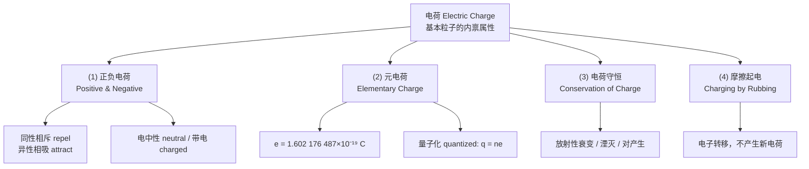
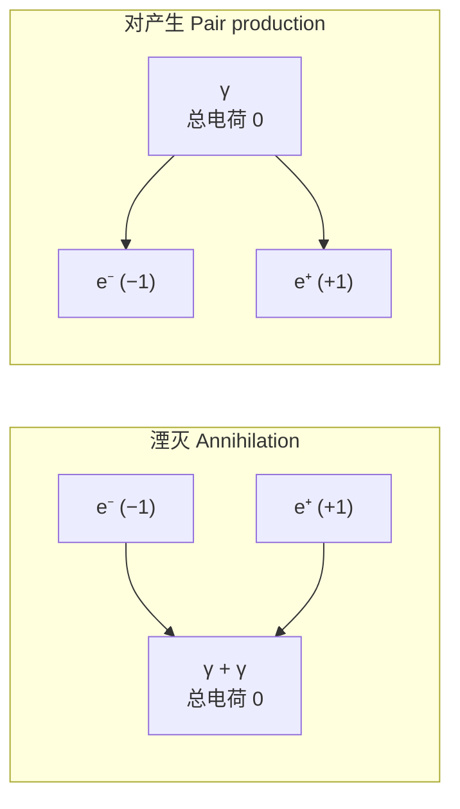

# C21.1 电荷 Electric Charge

## 本节结构总览

## 0 章节导航与作业

第 21 章共三节：

1. Electric Charge 电荷 → 本篇
2. Conductors and Insulators 导体和绝缘体 → [[C21.2 导体与绝缘体]]
3. Coulomb's Law 库仑定律 → [[C21.3 库仑定律]]

> [!important] 课后作业（课件原文）
> **Problems: 21，23，32，42**

**Keywords（课件列出的本章关键词，务必能用英文说出）**

- Electric Charge, Elementary Charge, Positive & Negative
- Charged Particles, Electron, Proton
- Electrically Neutral, Excess Charge, Charging, Discharging
- Conservation of Charge
- Conductor, Insulator, Semiconductor, Superconductor
- Electrostatic Force
- Coulomb's Law, Coulomb Constant, Permittivity

> [!note] "What Is Physics?" 那一页
> 课件用一整页贴了手机、步进电机、硬盘、风力发电机、微波炉、磁悬浮/高铁、话筒、过山车、天线、集成电路板、扬声器、冰箱贴、磁性传感器、卫星、金属晶格模型共 15 张图。这一页要传达的是：**这一整册电磁学不是抽象数学，上面每一件东西的工作原理都要用到接下来 12 章的内容**——扬声器/话筒是安培力与电磁感应（Ch28/30），硬盘是磁化与磁记录（Ch28），微波炉是电磁波（Ch32），电路板是电流、电阻、电容与电路（Ch25–27），磁悬浮是感应涡流。图本身不含公式，不必背，理解"电磁学 = 现代电子技术的底层"即可。

## 1 学习目标 Learning objectives（课件原文）

- **01** 区分电中性 (electrically neutral)、带负电、带正电，识别**净余电荷 excess charge**。
- **02** 同号电荷相斥 (**repel**)、异号电荷相吸 (**attract**)。
- **03** 认识**元电荷 elementary charge**。
- **04** 任何粒子或物体的电荷量必须是元电荷的**正负整数倍**。
- **05** 任何孤立物理过程中净电荷不变：**电荷守恒 Conservation of Charge**。
- **06** 认识粒子的**湮灭过程 annihilation process** 与**对产生 pair production**。

## 2 (1) 正电荷与负电荷 Positive and negative charges

> [!important] 定义
> 电荷是**基本粒子的内禀属性 (an intrinsic characteristic of the fundamental particles)**。电荷分**正 (positive)** 与**负 (negative)** 两种。
> **同性相斥，异性相吸**：Charges with the same electrical sign **repel** each other, opposite electrical signs **attract** each other.

- 正电荷数与负电荷数**相等** → 物体**电中性 electrically neutral**
- 正电荷数与负电荷数**不相等** → 物体**带电 charged**

![[C21-摩擦起电与同异性电荷受力.png]]

> [!note] "内禀属性"是什么意思——老师会补的一段
> 内禀 (intrinsic) 指这个属性和质量、自旋一样，是粒子**自带的、不能被剥离也不能被改变**的标签，不是外界加上去的状态。一个电子无论静止、运动、在原子里还是在真空中，电荷永远是 $-e$。
> 这跟"温度""压强"这类**集体统计量**形成对比——那些量对单个粒子没有意义，而电荷对单个粒子完全有意义。
>
> **"正""负"只是人为约定。** 富兰克林规定丝绸摩擦过的玻璃棒带"正电"，于是电子被定成了负的。这个历史约定带来一个后果：**金属中真正移动的载流子是电子，方向与我们定义的"电流方向"相反**——这是 Ch26（电流与电阻）里的第一个大坑，现在先埋个伏笔。

> [!warning] 易错点：中性 ≠ 没有电荷
> 一杯水是电中性的，但它包含约 $10^{25}$ 个质子和同样多的电子。中性指的是**代数和为零**，不是"不含电荷"。所以中性导体照样能被带电体吸引（见 [[C21.2 导体与绝缘体]] 的静电感应）。

## 3 (2) 元电荷 Elementary charge 元电荷

> [!important] 定义与数值
> 任何电荷都是某个**元电荷 (elementary charge)** 的整数倍。定义**一个电子或一个质子所带电荷量的大小**为元电荷：
> $$e = 1.602\ 176\ 487\times10^{-19}\ \mathrm{C}$$
> （课件标注 approximate value 近似值）

> [!important] 量子化 Quantized 量子化
> 一个物理量只能取**分立值 (discrete values)**，称为量子化。电荷量子化表述为：
> $$q=ne,\qquad n=\pm1,\ \pm2,\ \pm3\cdots$$

### 标准模型中的电荷（课件贴的粒子表）

![[C21-标准模型基本粒子电荷表.png]]

课件在图旁写的四行结论：

- **夸克 (quark) 带电** $+\tfrac23$ 或 $-\tfrac13$（以 $e$ 为单位）
- **质子 (proton) 带电** $+1$
- **中子 (neutron) 不带电** $0$
- **电子 (electron) 带电** $-1$

表格结构（左侧**费米子 fermions**，三代物质；右侧**玻色子 bosons**，传递相互作用）：

| 类别 | 第 I 代 | 第 II 代 | 第 III 代 | 电荷 |
|---|---|---|---|---|
| **夸克 Quarks** | u (up) | c (charm) | t (top) | $+2/3$ |
| | d (down) | s (strange) | b (bottom) | $-1/3$ |
| **轻子 Leptons** | $\nu_e$ 电子中微子 | $\nu_\mu$ | $\nu_\tau$ | $0$ |
| | e 电子 | $\mu$ 缪子 | $\tau$ 陶子 | $-1$ |
| **玻色子 Bosons** | $\gamma$ 光子（电磁） | g 胶子（强） | $Z^0$、$W^\pm$（弱） | $0$；$W^\pm$ 为 $\pm1$ |

> [!note] 课件没讲透的：分数电荷与"元电荷"矛盾吗？
> 不矛盾。夸克带 $\pm\frac13,\pm\frac23$ 的分数电荷，但由于**夸克禁闭 (color confinement)**，夸克无法单独存在，只能组成整体电荷为整数倍 $e$ 的强子。
> 验算一下：
> - 质子 = uud：$\tfrac23+\tfrac23-\tfrac13=+1$ ✓
> - 中子 = udd：$\tfrac23-\tfrac13-\tfrac13=0$ ✓
>
> 所以**可自由观测的自由粒子**电荷仍严格量子化为 $e$ 的整数倍，$q=ne$ 在本课程范围内永远成立。

> [!note] 密立根油滴实验（这个结论怎么来的）
> 课件只给结论。$e$ 的值是 Millikan 1909 年油滴实验测出来的：带电油滴在竖直电场中平衡时 $qE=mg$，改变电压使不同油滴平衡，发现所有测得的 $q$ 都是同一个最小值的整数倍——这正是"电荷量子化"的实验证据，也直接给出了 $e$。

> [!warning] 易错点：$10^{-19}$ 有多小
> $1\ \mathrm{C}$ 相当于约 $6.24\times10^{18}$ 个元电荷。所以宏观题目里 $q=1\ \mathrm{nC}$ 已经是 $6\times10^9$ 个电子，$n$ 大到完全可以当连续量处理——**量子化在宏观静电学题里从不显现**，但在半导体单电子器件、纳米尺度中就是主角。

## 4 (3) 电荷守恒 Conservation of charges 电荷守恒

> [!important] 表述
> **电荷不可产生也不可消灭 (Charge is neither created nor destroyed)，但可以从一个物体转移到另一个物体 (it can be transferred from one body to the other)。**
> 在任何过程中，电荷量的**代数和 (algebraic sum) 保持常量**。

课件给的三个例子：

**① 放射性衰变 Radioactive decay 放射性衰变**

$$^{238}_{\ 92}\mathrm{U}\ \longrightarrow\ ^{234}_{\ 90}\mathrm{Th}\ +\ ^{4}_{2}\mathrm{He}$$

质子数守恒：$92 = 90 + 2$ ✓

**② 正负电子湮灭 Annihilation of positron and electron 正负电子湮灭**

$$e^- + e^+ \longrightarrow \gamma + \gamma$$

电荷守恒：$-1 + 1 = 0$ ✓

**③ 正负电子对产生 Pair production 正负电子对产生**

$$\gamma \longrightarrow e^- + e^+$$

电荷守恒：$0 = -1 + 1$ ✓

> [!note] 课件没写但老师一定会点的三件事
> 1. **湮灭时电荷守恒，质量不守恒。** 电子与正电子的静质量全部变成光子能量，$E=2m_ec^2\approx1.022\ \mathrm{MeV}$，两个光子各 $0.511\ \mathrm{MeV}$，反向飞出（动量守恒要求）。守恒的是**能量-动量**与**电荷**，不是"质量"。
> 2. **对产生不能凭空发生在真空中。** 单个光子在真空里无法变成 $e^+e^-$，因为无法同时满足能动量守恒；必须在原子核附近（核吸收反冲动量），且光子能量 $\ge 1.022\ \mathrm{MeV}$（阈值）。课件只写 $\gamma\to e^-+e^+$ 是简写。
> 3. **电荷守恒是"定域"的。** 不只是宇宙总电荷不变，而是任一闭合曲面内电荷的变化率等于流出该面的电流——写成微分形式就是连续性方程 $\nabla\cdot\vec J+\dfrac{\partial\rho}{\partial t}=0$。这条会在 **Ch32 麦克斯韦方程组** 里再出现，正是它逼出了位移电流项。

> [!note] 前后联系
> 电荷守恒 → Ch23 高斯定律（闭合面内电荷决定通量）→ Ch26 电流连续性 → Ch32 位移电流。整条线索都是同一条守恒律的不同外衣。

## 5 (4) 摩擦起电 Charging by rubbing 摩擦起电

> [!important] 机理
> **Electrons are transferred from one material to another.** 电子从一种材料转移到另一种材料——**没有任何新电荷被创造**，只是原有电子换了主人。

课件两个标准实验：

| 摩擦对 | 得电子（带负电） | 失电子（带正电） |
|---|---|---|
| 丝绸 (Silk) + 玻璃 (Glass) | 丝绸 Silk | 玻璃 Glass |
| 皮毛 (Fur) + 塑料 (Plastic) | 塑料 Plastic | 皮毛 Fur |

右侧两幅悬挂棒实验（课件图 (a)(b)）：

- **(a)** 两根都被丝绸摩擦过的玻璃棒 → 都带正电 → **互相排斥**（$\vec F$ 与 $-\vec F$ 背向）
- **(b)** 带正电的玻璃棒与带负电的塑料棒 → **互相吸引**（$\vec F$ 与 $-\vec F$ 相向）

> [!note] 摩擦起电序列 (triboelectric series)——课件省掉的规律
> 谁得电子谁失电子不是随机的，材料可以排成一条序列，越靠"正端"的越容易失电子：
> 皮毛 → 玻璃 → 头发 → 尼龙 → 羊毛 → 丝绸 → 纸 → 棉 → 木 → 硬橡胶 → 聚酯 → 聚乙烯 → 聚氯乙烯 → 特氟龙
> 序列中位置**越靠前的越带正电**。玻璃在丝绸前面 → 玻璃带正；皮毛在塑料前面 → 皮毛带正。两条实验结论都能被这一条规律覆盖，不用死记。

> [!warning] 易错点
> 摩擦起电只在**绝缘体**上能保住电荷。用手直接握着金属棒去摩擦，电荷会经人体导走（**放电 discharging**），看不到现象——这一点直接连到下一节的导体/绝缘体。

> [!note] 和你专业的关联
> 静电放电 (ESD) 是电子器件的头号杀手：人体走过地毯可积累几千伏静电，直接触碰芯片引脚会击穿栅氧。实验室的防静电手环、防静电台垫，本质就是给"净余电荷"一条低阻抗泄放通路，让它在**可控的慢速率**下走掉，而不是在触碰瞬间以放电脉冲形式冲进芯片。

---

## 本节自测 Self-Test

> [!question] 1. 元电荷 $e$ 的定义、数值与单位？
> 一个质子（或一个电子电荷的绝对值）所带的电荷量，$e=1.602\ 176\ 487\times10^{-19}\ \mathrm{C}$。

> [!question] 2. 夸克带分数电荷，为什么不违背电荷量子化 $q=ne$？
> 夸克禁闭，不能单独存在；组成的强子总电荷必为 $e$ 的整数倍（uud = +1，udd = 0）。可自由观测的粒子电荷仍严格量子化。

> [!question] 3. $\gamma\to e^-+e^+$ 中什么守恒、什么不守恒？
> 电荷守恒（$0=-1+1$）、能量与动量守恒；质量不守恒（光子无静质量，产物有）。且必须在原子核场中发生，光子能量 $\ge1.022$ MeV。

> [!question] 4. 用丝绸摩擦玻璃棒后，玻璃棒带什么电？丝绸呢？为什么？
> 玻璃带正、丝绸带负。因为电子从玻璃转移到丝绸；摩擦起电只是电子转移，总电荷仍为零。

> [!question] 5. "电中性"和"不带电荷"有区别吗？
> 有。电中性指正负电荷代数和为零，物体内部仍含大量电荷；这正是中性导体能被带电体吸引的前提。

---

上一节 ← [[C21.0 开篇回顾 热学遗留]] ｜ 下一节 → [[C21.2 导体与绝缘体]]
索引 → [[电磁学 MOC]]
