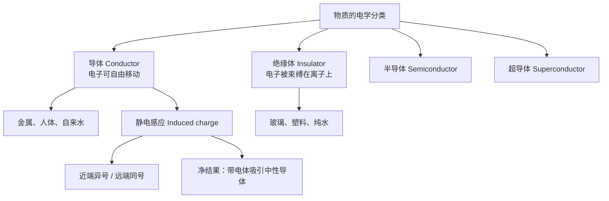
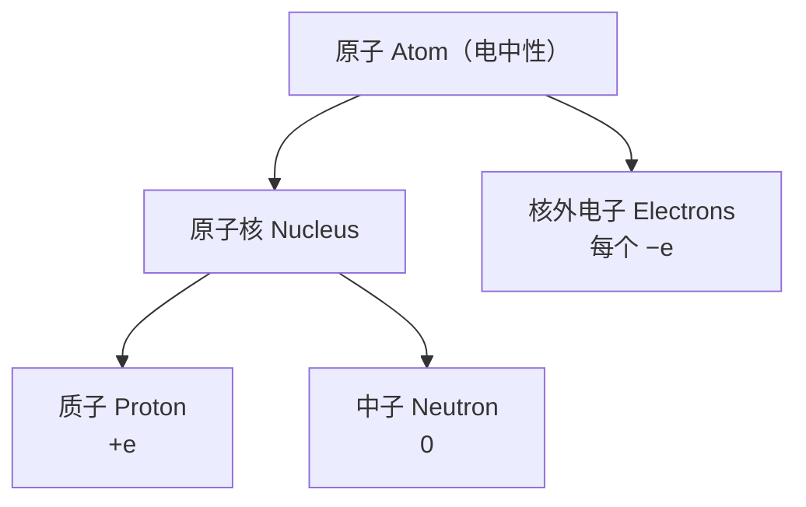
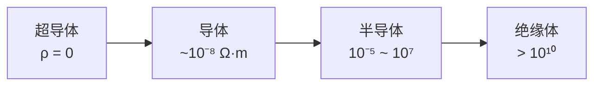
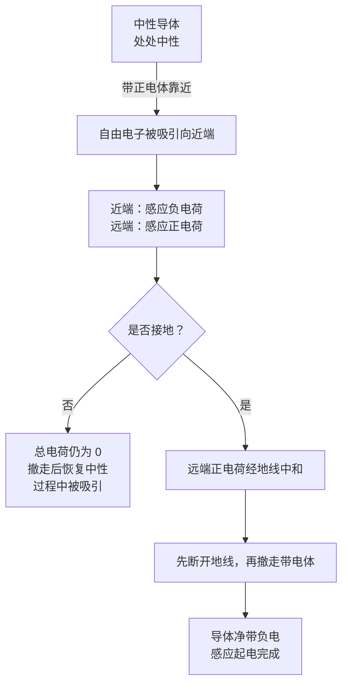

# C21.2 导体与绝缘体 Conductors and Insulators

## 本节结构总览

## 1 学习目标 Learning objectives（课件原文）

- **01** 区分**导体 (conductors)** 与**绝缘体 (insulators)**。
- **02** 描述原子内部各种粒子的**电学性质 (electrical properties)**。
- **03** 认识**传导电子 (conduction electrons)**，解释它们如何使导体带正电或带负电。
- **04** 解释带电体如何在另一物体上产生**感应电荷 (induced charge)**。

## 2 原子的电学结构

> [!important] 原子是电中性的 (Atoms are electrically neutral)
> - **原子核 Nucleus**：**质子 protons**（带 $+e$）+ **中子 neutrons**（不带电）
> - **核外电子 Electrons**：每个带 $-e$
> - 中性原子中电子数 = 质子数，故净电荷为零。

> [!note] 课件没说但很关键：为什么起电只搬电子，不搬质子
> 质子被强相互作用锁在原子核里，把它取出来需要 MeV 量级的能量（核反应尺度）；而最外层价电子的束缚能只有几个 eV，用摩擦、光照、加电压都能撼动。所以**一切宏观起电现象都是电子的迁移**，正电荷本质上是"缺电子"。这条原则贯穿全册。

## 3 导体 vs 绝缘体

![[C21-导体与绝缘体微观图像.png]]

| | **导体 Conductors** | **绝缘体 Insulators** |
|---|---|---|
| 电子 | **可自由移动** (can move freely) | **被束缚在离子上，不能自由移动** |
| 离子 | 固体中固定；液体中移动极慢 | 固定 |
| 例子（课件） | 金属、人体、**自来水** (tap water) | 玻璃、塑料、**纯水** (pure water) |

> [!warning] 易错点：自来水导电，纯水不导电
> 课件把 tap water 放在导体、pure water 放在绝缘体里，这是个考点。纯水本身电离度极低（$10^{-7}\ \mathrm{mol/L}$ 的 H⁺），电阻率约 $18\ \mathrm{M\Omega\cdot cm}$；自来水中溶解的 Ca²⁺、Mg²⁺、Cl⁻ 等离子才是载流子。**导电的是溶质离子，不是水分子本身。**
> 现实警告：浴室触电事故的元凶是自来水与人体的导电性，不是"水"这个化学物质。

> [!important] 传导电子 Conduction electrons
> 金属中最外层价电子脱离各自的原子，成为整块金属共有的"电子海"，这些电子叫**传导电子**。失去电子的原子成为**固定的正离子 (fixed positive ions)**，构成晶格。
> - 金属整体**多出**电子 → 带负电
> - 金属整体**缺少**电子 → 带正电（不是"多出正离子"，正离子数量从未改变）

> [!note] 课件只列了 4 个词，但 Keywords 页提到了半导体与超导体
> - **半导体 Semiconductor**（硅、锗）：导电性介于两者之间，且可以通过掺杂 (doping)、温度、光照、外加电场**主动调控**。这正是晶体管、CPU、图像传感器的物理基础。
> - **超导体 Superconductor**：低于临界温度时电阻**严格为零**（不是"很小"），电流可无损耗地持续流动。用于 MRI 磁体、粒子加速器磁铁、超导量子比特。
> 四者按电阻率排一条线：超导体 $(0)$ < 导体 $(10^{-8}\ \Omega\cdot m)$ < 半导体 $(10^{-5}\sim10^{7})$ < 绝缘体 $(>10^{10})$，跨度约 20 个数量级——这是全部物理量里跨度最大的之一。

## 4 静电感应与感应电荷 Electrically induced net charge 感应电荷

> [!important] 中性导体的电荷分布
> 在**中性导体 (neutral conductor)** 中，固定正离子的电荷密度与自由负电子的电荷密度**处处相等**。
> 当附近**没有**带电体时，导体**在所有点上都是中性的** (neutral at all points)。

![[C21-静电感应与感应电荷.png]]

> [!important] 感应过程
> 把一个带正电的物体靠近中性导体：
> - 自由电子被**吸引到靠近带电体的一端** → 该端**电子密度升高 (higher electron density)** → 出现**感应负电荷 (induced negative net charge)**
> - 远端**电子密度降低 (lower electron density)** → 出现**感应正电荷 (induced positive net charge)**
> - 导体**总电荷仍为零**，只是重新分布。
>
> **结论（课件红字）：带电体吸引孤立的中性导体 (Charged objects attract isolated neutral conductors)。**

> [!note] 课件跳过的关键一步：为什么净结果一定是"吸引"而不是抵消
> 近端是异号电荷、远端是同号电荷，数量相等——看起来引力和斥力应该抵消。**但库仑力按 $1/r^2$ 衰减**：近端异号电荷距离更近，吸引力更大；远端同号电荷距离更远，排斥力更小。
> $$F_{\text{吸}}\propto\frac{q_{ind}}{r_{近}^2}\ >\ F_{\text{斥}}\propto\frac{q_{ind}}{r_{远}^2}\quad(r_{近}<r_{远})$$
> 所以**净力永远是吸引**。这也是为什么**无论靠近的是正电体还是负电体，中性导体都被吸引**——感应电荷的符号会跟着翻转，但"异号在近端"这一点不变。

> [!warning] 易错点三连
> 1. **感应 ≠ 带电。** 感应过程中导体总电荷始终为零。要让它真正带电，必须在感应状态下**接地 (grounding)** 让远端同号电荷流走，再断开接地——这叫**感应起电 (charging by induction)**，得到的电荷与靠近的带电体**符号相反**。
> 2. **绝缘体也会被吸引**，但机理不同：绝缘体里电子不能跑遍全身，只能在各自分子内做微小偏移，形成**极化 (polarization)**，宏观效果同样是近端异号 → 仍被吸引。这就是碎纸屑被摩擦过的塑料尺吸起来的原因（Ch25 电介质会详细讲）。
> 3. **感应是瞬时且不消耗能量地重新分布**，撤走带电体后导体立刻恢复处处中性。

> [!note] 前后联系与专业关联
> - **往后**：Ch23 高斯定律会证明"静电平衡时导体内部场强恒为零、净电荷全在表面"，那是本节感应现象的严格版本；Ch25 电容器的两极板正是靠感应建立等量异号电荷。
> - **专业**：电容式触摸屏就是把手指当成一块接地的"中性导体"——手指靠近改变了电极间的感应电荷分布，芯片测出电容变化即定位触点。静电屏蔽（法拉第笼、信号线屏蔽层、机箱）也是同一个原理：外场只在导体表面激起感应电荷，内部被完全屏蔽。

---

## 本节自测 Self-Test

> [!question] 1. 导体和绝缘体的本质区别是什么？
> 导体中电子可自由移动（离子固定），绝缘体中电子被束缚在离子上不能自由移动。

> [!question] 2. 为什么自来水导电而纯水几乎不导电？
> 载流子是水中溶解的离子（Ca²⁺、Mg²⁺、Cl⁻ 等），不是水分子本身。纯水电离度极低。

> [!question] 3. 金属带正电时，是"多了正离子"还是"少了电子"？
> 少了电子。正离子固定在晶格上，数量不变；一切宏观起电都是电子迁移。

> [!question] 4. 感应电荷近端异号、远端同号且数量相等，为什么净力仍是吸引？
> 因为库仑力 $\propto 1/r^2$，近端距离小，吸引项大于排斥项。

> [!question] 5. 如何用感应法让一块金属真正带上净电荷？带什么电？
> 靠近带电体 → 接地（远端同号电荷流走）→ 先断开地线 → 再移走带电体。所得电荷与原带电体**符号相反**。顺序颠倒（先移走带电体）则前功尽弃。

> [!question] 6. 半导体和超导体分别特殊在哪？
> 半导体的导电性可被掺杂/温度/光/电场主动调控；超导体在临界温度以下电阻严格为零。

---

上一节 ← [[C21.1 电荷]] ｜ 下一节 → [[C21.3 库仑定律]]
索引 → [[电磁学 MOC]]
