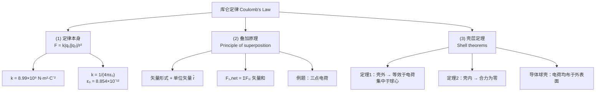
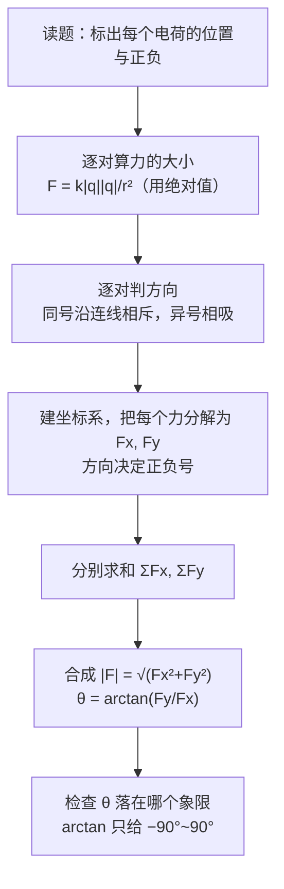

# C21.3 库仑定律 Coulomb's Law

## 本节结构总览

## 1 学习目标 Learning objectives（课件原文）

- **01** 对一对带电粒子中的任一个，用库仑定律把**静电力 (electrostatic force)** 的大小与方向、两者电荷量、以及它们之间的距离联系起来。
- **02** 若有多个力作用在一个粒子上，用**矢量**（不是标量）相加求**合力 (net force)**。
- **03** 认识**均匀带电球壳 (a shell of uniform charge)** 对**壳外**带电粒子的作用，等价于全部电荷集中在球心。
- **04** 认识若带电粒子位于**均匀带电壳内 (inside a shell)**，球壳对它的静电合力为零。
- **05** 认识若把**净余电荷 (excess charge)** 放在球形导体上，电荷会**均匀分布在外表面**。
- **06** 认识**非导体 (nonconducting object)** 可以有**任意的电荷分布 (any given distribution of charge)**，包括内部各点带电。

> [!warning] 目标 05 vs 06 的对照——这是本章最常混的一组
> - **导体**：电荷**不能**待在内部，一定跑到**外表面**并均匀分布（球形时）。因为内部一旦有场，自由电子就会移动直到场为零。
> - **绝缘体（非导体）**：电荷**动不了**，你把它放在哪它就待在哪，**内部各点都可以带电**，分布可以任意（均匀体电荷、非均匀、只在某一层，都行）。
> 做题时看到"实心带电球"必须先问一句：**导体还是绝缘体？** 两者的场分布完全不同（Ch23 高斯定律会算）。

## 2 (1) 库仑定律 The Coulomb's law

> [!important] 定律（真空中静止的点电荷 two point charges at rest in a vacuum）
> 静电力的**大小**：
> $$F = k\frac{|q_1||q_2|}{r^2}$$
> - **静电常数 Electrostatic constant（库仑常数 Coulomb constant）**
>   $$k = 8.99\times10^{9}\ \mathrm{N\cdot m^2\cdot C^{-2}}$$
> - 也常写成
>   $$k=\frac{1}{4\pi\varepsilon_0},\qquad \varepsilon_0 = 8.854\ 187\ 817\ 62\times10^{-12}\ \mathrm{N^{-1}m^{-2}C^{2}}$$
>   $\varepsilon_0$ 称**真空介电常数 Permittivity 介电常数**，课件标注为**精确值 Exact value**。

> [!note] 三个"适用条件"课件写在标题里，一定要念出来
> 1. **点电荷 (point charges)**：电荷的线度远小于它们之间的距离。
> 2. **静止 (at rest)**：运动电荷之间还有磁力（Ch28），且高速时要考虑推迟效应。
> 3. **真空 (in a vacuum)**：介质中要把 $\varepsilon_0$ 换成 $\varepsilon=\varepsilon_r\varepsilon_0$（Ch25）。

> [!note] 为什么写成 $k=\dfrac{1}{4\pi\varepsilon_0}$ 这么别扭的形式
> 这叫**有理化单位制 (rationalized units)**。$4\pi$ 是半径为 1 的球的立体角，把它塞进库仑定律里，是为了让后面**高斯定律**（Ch23）写出来干干净净：
> $$\oint\vec E\cdot d\vec A=\frac{q_{enc}}{\varepsilon_0}$$
> 如果库仑定律里不放 $4\pi$，那 $4\pi$ 就会跑到高斯定律、麦克斯韦方程组里去。**$4\pi$ 这个因子躲不掉，只能选择让它出现在哪。** 现代物理选择让它出现在库仑定律，因为麦克斯韦方程组用得更多。

> [!warning] 易错点：公式里的绝对值
> $F=k\dfrac{|q_1||q_2|}{r^2}$ 里带绝对值，算出来永远是**正数**，它只给**大小**。**方向必须另行判断**：同号沿连线相斥，异号沿连线相吸。把负号代进去然后说"力是负的"是常见的失分点——除非你用的是下面的矢量形式，那时符号才有意义。

### 相关常数（课件附页 Permittivity & Permeability）

> [!important] 电磁学四个基本常数的关系
> $$c_0=\frac{1}{\sqrt{\varepsilon_0\mu_0}}=3\times10^{8}\ \mathrm{m/s}$$
> $$\mu_0=4\pi\times10^{-7}\ \mathrm{[(V\cdot s)/(A\cdot m)]}\quad\text{（磁导率 Permeability）}$$
> $$\varepsilon_0=\frac{1}{36\pi}\times10^{-9}\ \mathrm{[(A\cdot s)/(V\cdot m)]}$$
> $$Z_0=\sqrt{\frac{\mu_0}{\varepsilon_0}}=120\pi\ \mathrm{[V/A]}\approx377\ \Omega\quad\text{（真空波阻抗）}$$

课件附的量纲对照（右侧黄框）：

| 量 | SI 量纲 |
|---|---|
| $[H]$ 亨利 | $\left[\dfrac{kg\cdot m^2}{s^2\cdot A^2}\right]$ |
| $[V]$ 伏特 | $\left[\dfrac{kg\cdot m^2}{s^3\cdot A}\right]$ |
| $[F]$ 法拉 | $\left[\dfrac{s^4\cdot A^2}{kg\cdot m^2}\right]$ |
| $\mu_0$：$[H/m]$ | $\left[\dfrac{kg\cdot m}{s^2\cdot A^2}\right]=\left[\dfrac{V\cdot s}{A\cdot m}\right]$ |
| $\varepsilon_0$：$[F/m]$ | $\left[\dfrac{s^4\cdot A^2}{kg\cdot m^3}\right]=\left[\dfrac{A\cdot s}{V\cdot m}\right]$ |

> [!note] 这一页课件不解释，但它是整册电磁学的"剧透"
> $c_0=1/\sqrt{\varepsilon_0\mu_0}$ 里，$\varepsilon_0$ 来自**静电学**（库仑定律），$\mu_0$ 来自**静磁学**（安培定律）。两个用静止电荷和恒定电流就能测出来的常数，组合起来居然精确等于**光速**——这是麦克斯韦 1865 年发现的，也是"光是电磁波"这一论断的出发点。
> 记住这条线索：**Ch21 的 $\varepsilon_0$ + Ch29 的 $\mu_0$ → Ch32 的电磁波**。
>
> $\varepsilon_0=\frac{1}{36\pi}\times10^{-9}$ 是工程上常用的记忆形式：代入即 $8.842\times10^{-12}$，与精确值差 0.1%，考试估算够用。
> $Z_0\approx377\ \Omega$ 是**真空波阻抗**，天线设计里 50 Ω 同轴线要匹配到自由空间就是在跟这个数打交道。

> [!warning] 关于"精确值"的一个更新
> 课件说 $\varepsilon_0$ 是精确值、$e$ 是近似值——这是 **2019 年 SI 改制前**的说法。2019 年后 SI 反过来了：**元电荷 $e=1.602176634\times10^{-19}\ \mathrm{C}$ 被定义为精确值**（用来定义安培），而 $\varepsilon_0$、$\mu_0$ 变成了有实验不确定度的测量量（$\mu_0$ 不再严格等于 $4\pi\times10^{-7}$，但差异在 $10^{-10}$ 量级）。**本课程按课件口径答题即可**，知道有这回事就行。

## 3 (2) 叠加原理 Principle of superposition 叠加原理

> [!important] 矢量形式 Vector form
> 2 对 1 的作用力（Force on 1 by 2）：
> $$\vec F_{12}=\frac{1}{4\pi\varepsilon_0}\frac{q_1q_2}{r^2}\hat r,\qquad \vec r = \vec r_1-\vec r_2$$
> 其中 $\hat r$ 是由 **2 指向 1** 的单位矢量。

> [!warning] 矢量形式里符号是怎么自动生效的——课件一句带过，必须自己想明白
> 这里 $q_1q_2$ **不带绝对值**：
> - 同号 → $q_1q_2>0$ → $\vec F_{12}$ 与 $\hat r$（从 2 指向 1）**同向** → 1 被推离 2 → **排斥** ✓
> - 异号 → $q_1q_2<0$ → $\vec F_{12}$ 与 $\hat r$ **反向** → 1 被拉向 2 → **吸引** ✓
>
> 所以矢量形式**自带方向判断**，不需要额外讨论。但前提是 $\hat r$ 的定义必须记牢：**下标顺序 "12" 表示"2 作用在 1 上"，$\vec r=\vec r_1-\vec r_2$ 由施力者指向受力者。** 定义反了，所有力的方向全错。
> 牛顿第三定律在这里体现为 $\vec F_{12}=-\vec F_{21}$（大小相等、方向相反、沿同一连线）。

> [!important] 叠加原理
> 若有 $n$ 个带电粒子作用在一个带电粒子上，该粒子受到的**静电合力是各粒子按库仑定律单独产生的力的矢量和** (vector sum)：
> $$\vec F_{1,net}=\vec F_{12}+\vec F_{13}+\cdots+\vec F_{1n}$$

![[C21-库仑力叠加原理矢量图.png]]

> [!note] 叠加原理是独立的实验事实，不是从库仑定律推出来的
> 库仑定律只说了"两个电荷"怎么办。当 $q_3$ 出现时，$q_2$ 对 $q_1$ 的力**会不会因为 $q_3$ 的存在而改变**？逻辑上完全可能改变（很多相互作用就是这样）。实验回答：**不会**。每一对之间的力互不干扰，这叫**线性叠加**。
> 这条性质极其重要，它使得后面**电场 $\vec E$**（Ch22）、**电势 $V$**（Ch24）都可以逐个源求和/积分——整个电磁学的计算方法都建立在线性叠加之上。
>
> **专业关联**：线性叠加正是"卷积"在物理里的原型。连续电荷分布产生的场 $\vec E(\vec r)=\int \vec K(\vec r-\vec r')\,\rho(\vec r')\,dV'$ 就是电荷密度与库仑核的卷积。你在 CNN 里做的事，和这里做的事是同一个数学结构：**线性系统 + 平移不变核**。

### 例题 1 Example 1（课件原题）

> [!example] 题目
> 三个点电荷位于一个三角形的顶点上：$q_1=6.00\times10^{-9}\ \mathrm{C}$，$q_2=-2.00\times10^{-9}\ \mathrm{C}$，$q_3=5.00\times10^{-9}\ \mathrm{C}$。求 $q_3$ 所受的合力。

![[C21-例题1三点电荷几何.png]]

**几何**（由图读出）：$q_1$ 在原点，$q_2$ 在其正上方 $3.00\ \mathrm{m}$ 处，$q_3$ 在 $q_2$ 右方 $4.00\ \mathrm{m}$ 处。于是

- $r_{23}=4.00\ \mathrm{m}$
- $r_{13}=\sqrt{3^2+4^2}=5.00\ \mathrm{m}$（图上标注的 5.00 m）
- $q_1q_3$ 连线与水平方向夹角 $\theta=\arctan\frac{3}{4}=37.0^\circ$

**解 Solution：用叠加原理**

$$F_{32}=k\frac{|q_3||q_2|}{r_{23}^2}=8.99\times10^9\times\frac{5.00\times10^{-9}\times2.00\times10^{-9}}{4.00^2}=5.62\times10^{-9}\ \mathrm{N}$$

$$F_{31}=k\frac{|q_3||q_1|}{r_{13}^2}=8.99\times10^9\times\frac{5.00\times10^{-9}\times6.00\times10^{-9}}{5.00^2}=1.08\times10^{-8}\ \mathrm{N}$$

$$F_x=F_{32}+F_{31}\cos37.0^\circ=3.01\times10^{-9}\ \mathrm{N}$$
$$F_y=F_{31}\sin37.0^\circ=6.50\times10^{-9}\ \mathrm{N}$$
$$|F|=\sqrt{F_x^2+F_y^2}=7.16\times10^{-9}\ \mathrm{N},\qquad \theta=65.2^\circ$$

> [!warning] 课件这一行写错了符号，考试照抄会算错——务必自己判方向
> 课件写的是 $F_x=F_{32}+F_{31}\cos37^\circ$，但直接代数会得到
> $$5.62\times10^{-9}+1.08\times10^{-8}\times0.799=1.42\times10^{-8}\ \mathrm{N}\neq3.01\times10^{-9}$$
> 正确的方向分析：
> - $q_2<0,\ q_3>0$ → **吸引** → $q_3$ 被拉向 $q_2$，即沿 **$-x$** 方向（图中蓝色箭头向左），所以 $F_{32,x}=-5.62\times10^{-9}$
> - $q_1>0,\ q_3>0$ → **排斥** → $q_3$ 被推离 $q_1$，方向沿 $q_1\to q_3$，即与 $+x$ 轴成 $37^\circ$ 斜向右上（图中蓝色箭头向右上）
>
> 于是
> $$F_x=-F_{32}+F_{31}\cos37.0^\circ=-5.62\times10^{-9}+8.63\times10^{-9}=3.01\times10^{-9}\ \mathrm{N}\ ✓$$
> $$F_y=0+F_{31}\sin37.0^\circ=1.08\times10^{-8}\times0.602=6.50\times10^{-9}\ \mathrm{N}\ ✓$$
> $$|F|=\sqrt{(3.01)^2+(6.50)^2}\times10^{-9}=7.16\times10^{-9}\ \mathrm{N}\ ✓$$
> $$\theta=\arctan\frac{6.50}{3.01}=65.2^\circ\ \text{（从 }+x\text{ 轴逆时针量）}\ ✓$$
> **课件里的 "+" 是"矢量求和"的意思，不是"代数相加"。** 数值对得上，说明老师算的时候是带方向的。

> [!warning] $\arctan$ 的象限陷阱
> 本题 $F_x>0,F_y>0$ 落在第一象限，$\arctan$ 直接可用。若 $F_x<0$，计算器给的 $\arctan(F_y/F_x)$ 会差 $180^\circ$，必须自己加上。**先画草图确定合力大致指向哪，再验证角度。**

## 4 (3) 壳层定理 Shell theorems 壳层定理

### 定理 1：壳外

> [!important] Shell theorem 1
> **均匀带电球壳对壳外的带电粒子的吸引或排斥，等效于把球壳的全部电荷集中在球心处的点电荷所产生的作用力。**
> 壳外电荷受力等价于电荷聚集于球心对外电荷的作用力。

课件用两幅并列的图说明这个"等效"：上图是半径 $R$、均匀带电 $q_2$ 的球壳与壳外点电荷 $q_1$，受力 $\vec F_{1,shell}$；下图把球壳换成位于球心的点电荷 $q_2$，受力 $\vec F_{1,point2}$。结论：**两个力完全相同**。

$$\vec F_{1,shell}=\vec F_{1,point2}$$

### 定理 1 的完整推导（课件给了但没讲透，逐步补全）

![[C21-均匀带电球壳受力积分几何.png]]

**几何设定**（对照上图）：球壳半径 $R$，球心 $O$，面电荷密度 $\sigma$；场点 $P$ 距球心 $r$（$r>R$）。把球壳切成一圈圈**圆环带 (elementary circle)**，用张角 $\theta$ 标记（从 $OP$ 方向量起），环带宽度 $R\,d\theta$，环带半径 $R\sin\theta$。$x$ 是环带上任一点到 $P$ 的距离，$\alpha$ 是该连线与 $OP$ 轴的夹角。

**第 1 步：环带的面积与电荷**

$$dS=2\pi R\sin\theta\cdot R\,d\theta$$

> [!note] 这个式子怎么来的
> 环带是一条"腰带"：周长 $=2\pi\times(\text{环半径})=2\pi R\sin\theta$，宽度 $=R\,d\theta$（半径 $R$ 上张角 $d\theta$ 对应的弧长）。面积 = 周长 × 宽度。

$$dq_2=\sigma\cdot 2\pi R\sin\theta\cdot R\,d\theta$$

**第 2 步：环带对 $P$ 的作用力——只留轴向分量**

$$\mathrm dF=\frac{1}{4\pi\varepsilon_0}\frac{Q_1\,dq_2}{x^2}\cos\alpha$$

> [!important] 为什么可以只算 $\cos\alpha$ 分量
> 环带关于 $OP$ 轴**旋转对称**。取环上对称的两点 $A$、$B$（图中标出），它们对 $P$ 的力 $\vec F_A$、$\vec F_B$ 大小相等，垂直于轴的分量**方向相反、精确抵消**，只剩下沿轴的分量 $\cos\alpha$ 部分。整个环带积分下来，横向分量总和为零。
> **这是所有球对称问题的通用套路**：先用对称性砍掉两个分量，把三维积分降成一维。

由图中三角形（$P$、$O$、环带上一点）的几何关系：

$$\cos\alpha=\frac{r-R\cos\theta}{x}$$

> [!note] 补一步：这个 $\cos\alpha$ 怎么读出来
> 环带上一点到轴的垂足距球心 $R\cos\theta$，因此该垂足到 $P$ 的**轴向距离**是 $r-R\cos\theta$。而斜边就是 $x$。所以 $\cos\alpha = \dfrac{\text{邻边}}{\text{斜边}}=\dfrac{r-R\cos\theta}{x}$。

$$\Rightarrow\ \mathrm dF=\frac{1}{4\pi\varepsilon_0}\frac{Q_1\,dq_2}{x^2}\cdot\frac{r-R\cos\theta}{x}$$

**第 3 步：换积分变量 $\theta\to x$（本推导的关键技巧）**

由余弦定理（三角形 $OP$–环带点）：

$$x^2=r^2+R^2-2rR\cos\theta$$

两边对 $\theta$ 微分：

$$2x\,dx = 2rR\sin\theta\,d\theta\ \Longrightarrow\ x\,dx=rR\sin\theta\,d\theta$$

> [!note] 为什么要换成 $x$
> 因为 $\sin\theta\,d\theta$ 恰好可以整体替换成 $\dfrac{x\,dx}{rR}$，把被积函数里所有的 $\theta$ 一次清干净。这是 Newton 当年处理引力壳层定理时用的同一个技巧（引力和静电力都是 $1/r^2$，两个定理完全同构）。

代入：

$$\mathrm dF=\frac{1}{4\pi\varepsilon_0}\frac{Q_1\cdot\sigma\cdot2\pi R\sin\theta\cdot R\,d\theta}{x^2}\cdot\frac{r-R\cos\theta}{x}
=\frac{1}{4\pi\varepsilon_0}\frac{Q_1\cdot\sigma\cdot2\pi R}{r}\cdot(r-R\cos\theta)\cdot\frac{dx}{x^2}$$

**第 4 步：把 $R\cos\theta$ 也换成 $x$**

再由余弦定理反解：

$$R\cos\theta=\frac{r^2+R^2-x^2}{2r}$$

代入 $(r-R\cos\theta)$：

$$r-R\cos\theta=r-\frac{r^2+R^2-x^2}{2r}=\frac{2r^2-r^2-R^2+x^2}{2r}=\frac{r^2-R^2+x^2}{2r}$$

于是

$$\mathrm dF=\frac{1}{4\pi\varepsilon_0}\frac{Q_1\sigma\,2\pi R}{r}\cdot\frac{r^2-R^2+x^2}{2r}\cdot\frac{dx}{x^2}
=\frac{1}{4\pi\varepsilon_0}\frac{Q_1\sigma\pi R}{r^2}\left(\frac{r^2-R^2}{x^2}+1\right)dx$$

（与课件写的完全一致。）

**第 5 步：定积分**

$\theta$ 从 $0$ 走到 $\pi$，对应 $x$ 从 $r-R$ 走到 $r+R$（$\theta=0$ 时最近点距离 $r-R$；$\theta=\pi$ 时最远点距离 $r+R$）：

$$F=\frac{1}{4\pi\varepsilon_0}\frac{Q_1\sigma\pi R}{r^2}\int_{r-R}^{r+R}\left(\frac{r^2-R^2}{x^2}+1\right)dx$$

课件直接给出 $\displaystyle\int_{r-R}^{r+R}\left(\frac{r^2-R^2}{x^2}+1\right)dx=4R$。**补上这一步：**

$$\int_{r-R}^{r+R}\frac{r^2-R^2}{x^2}dx=(r^2-R^2)\left[-\frac1x\right]_{r-R}^{r+R}=(r^2-R^2)\left(\frac{1}{r-R}-\frac{1}{r+R}\right)$$

$$=(r^2-R^2)\cdot\frac{(r+R)-(r-R)}{(r-R)(r+R)}=(r^2-R^2)\cdot\frac{2R}{r^2-R^2}=2R$$

$$\int_{r-R}^{r+R}1\,dx=(r+R)-(r-R)=2R$$

$$\therefore\ \int_{r-R}^{r+R}\left(\frac{r^2-R^2}{x^2}+1\right)dx=2R+2R=4R\quad ✓$$

**第 6 步：结论**

$$F=\frac{1}{4\pi\varepsilon_0}\frac{Q_1\cdot\sigma\cdot4\pi R^2}{r^2}=\frac{1}{4\pi\varepsilon_0}\frac{Q_1\cdot Q_2}{r^2}$$

因为球壳总电荷 $Q_2=\sigma\cdot 4\pi R^2$（球面积 $\times$ 面密度）。**这正是把 $Q_2$ 当作位于球心的点电荷得到的库仑力**——定理 1 得证。$\blacksquare$

> [!note] 这个结果里最惊人的是什么
> 结果里 **$R$ 完全消失了**。也就是说无论球壳多大（只要 $r>R$），只要总电荷相同，壳外的受力就一模一样。这在数学上是 $1/r^2$ 这个**特定幂次**的专属性质：如果库仑定律是 $1/r^{2.01}$，壳层定理就不成立了。
> 历史上这正是**验证平方反比律的最精密方法**：与其直接测力，不如去测"带电球壳内部是否真的没有场"（定理 2），因为一旦偏离平方反比，壳内就会有可测的残余场。现代实验把指数偏差限制在 $10^{-16}$ 以内。
>
> **前后联系**：等你学到 **Ch23 高斯定律**，这一整页积分会变成三行——高斯定律的本质就是把 $1/r^2$ 与球对称打包成了一个通用定理。**现在辛苦推一遍的价值，是理解高斯定律为什么能成立，而不是把它当口诀。**

### 定理 2：壳内

> [!important] Shell theorem 2
> **若带电粒子位于均匀带电球壳的内部，球壳对它的静电合力为零。** 壳内电荷不受静电力。

![[C21-均匀带电球壳受力积分几何.png]]
（同一套几何，只是把场点 $P$ 移到球内）

> [!note] 一个不用积分的漂亮证明（课件没给，但比积分好懂太多）
> 设 $P$ 在壳内任意位置。过 $P$ 作一个极窄的双向锥（顶角立体角 $d\Omega$），它在球壳上截出两块面元 $dA_1$、$dA_2$，距离分别为 $r_1$、$r_2$。
> - 面积随距离平方增大：$dA_1\propto r_1^2 d\Omega$，$dA_2\propto r_2^2 d\Omega$
> - 电荷正比于面积：$dq_1\propto r_1^2$，$dq_2\propto r_2^2$
> - 力反比于距离平方：$dF_1\propto \dfrac{dq_1}{r_1^2}\propto d\Omega$，$dF_2\propto \dfrac{dq_2}{r_2^2}\propto d\Omega$
>
> **两者大小相等、方向相反，精确抵消。** 把整个球壳按这样的锥对分完，处处抵消，故合力为零。
> 注意这里 $r^2$ 出现了两次且方向相反：面积的 $r^2$ 增长，恰好被力的 $1/r^2$ 衰减抵消。**又是平方反比律的专属魔法。**

> [!warning] 定理 2 的常见误解
> "合力为零"**不等于**"电势为零"。壳内 $\vec E=0$，但电势 $V$ 是常数且等于球壳表面的电势（不为零）。$E=0$ 只说明 $V$ **不随位置变化**。这个区别到 Ch24 电势会反复考。

### 推论：导体球壳上的净余电荷

> [!important] 课件原文
> 若把**净余电荷 (excess charge)** 放在**导体材料 (conducting material)** 制成的球壳上，净余电荷会**均匀地分布在表面**。因此**金属内部没有电场 (no electric field inside the metal)**。
> 导体球壳的电荷均匀分布在其表面。

> [!note] 为什么必须均匀分布——一句话的自洽论证
> 导体内自由电子会一直移动，直到内部电场为零（否则电子还在受力、还在动，就不是静电平衡）。而**同号电荷互相排斥**，会尽可能彼此远离，结果就是全部跑到最外表面；球对称的形状下唯一自洽的分布就是**均匀**。
> 再把定理 2 套上：均匀带电球壳内部合力为零 ✓ 与"导体内部无场"完全自洽。**两条结论互相印证。**

> [!warning] 只有球形才"均匀"
> 课件说的是**球形**导体。任意形状的导体上，电荷仍然全部在外表面，但**分布不均匀**：曲率大的地方（尖端）电荷密度高——这就是**尖端放电**（避雷针的原理）。Ch24 会定量讨论。

> [!note] 专业关联：法拉第笼
> 定理 2 + 导体推论 = **静电屏蔽**。把敏感电路装进金属壳里，外部静电场在壳上激起感应电荷，壳内场恒为零。这就是芯片的金属封装、示波器探头的屏蔽层、屏蔽机房、以及为什么车里被雷劈中相对安全。

---

## 本节自测 Self-Test

> [!question] 1. 写出库仑定律的标量形式与矢量形式，指出各自适用什么场合。
> 标量：$F=k\dfrac{|q_1||q_2|}{r^2}$，只给大小，方向另判（同号斥、异号吸）。
> 矢量：$\vec F_{12}=\dfrac{1}{4\pi\varepsilon_0}\dfrac{q_1q_2}{r^2}\hat r$，$\hat r$ 由施力者 2 指向受力者 1，符号自动给出方向。

> [!question] 2. $k$ 与 $\varepsilon_0$ 的关系与数值？为什么要写成 $1/(4\pi\varepsilon_0)$？
> $k=\dfrac{1}{4\pi\varepsilon_0}=8.99\times10^9\ \mathrm{N\cdot m^2\cdot C^{-2}}$，$\varepsilon_0=8.854\times10^{-12}$。写成这个形式是有理化单位制，为的是让高斯定律和麦克斯韦方程组中不出现 $4\pi$。

> [!question] 3. 例题 1 中为什么 $F_{32}$ 要取负号？
> $q_2$ 为负、$q_3$ 为正，两者吸引，$q_3$ 被拉向 $q_2$（$-x$ 方向）。课件写的 "+" 表示矢量求和。

> [!question] 4. 壳层定理推导中，为什么可以只保留 $\cos\alpha$ 分量？换元 $\theta\to x$ 的关键关系式是什么？
> 因为环带绕 $OP$ 轴旋转对称，垂直轴的分量成对抵消。关键关系：$x^2=r^2+R^2-2rR\cos\theta$ 微分得 $x\,dx=rR\sin\theta\,d\theta$。

> [!question] 5. 计算 $\displaystyle\int_{r-R}^{r+R}\left(\frac{r^2-R^2}{x^2}+1\right)dx$。
> $(r^2-R^2)\left(\frac{1}{r-R}-\frac{1}{r+R}\right)+2R=2R+2R=4R$。

> [!question] 6. 壳层定理成立依赖于什么？如果库仑定律是 $1/r^3$ 还成立吗？
> 严格依赖于 $1/r^2$ 平方反比律（面积的 $r^2$ 增长与力的 $1/r^2$ 衰减恰好抵消）。$1/r^3$ 则两条定理都不成立。

> [!question] 7. 实心带电球在导体和绝缘体两种情况下，电荷分布有什么根本区别？
> 导体：电荷全部跑到外表面（球形时均匀），内部无电荷无场。绝缘体：电荷不能移动，可以任意分布，包括内部各点带电。

> [!question] 8. 球壳内部 $\vec E=0$，是否意味着 $V=0$？
> 不是。$V$ 在壳内为常数，等于球壳表面的电势，一般不为零。$\vec E=-\nabla V=0$ 只说明 $V$ 不随位置变化。

---

上一节 ← [[C21.2 导体与绝缘体]] ｜ 下一章 → 第 22 章 电场 Electric Fields
索引 → [[电磁学 MOC]]
