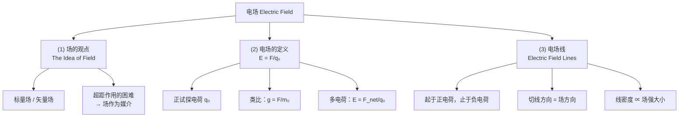
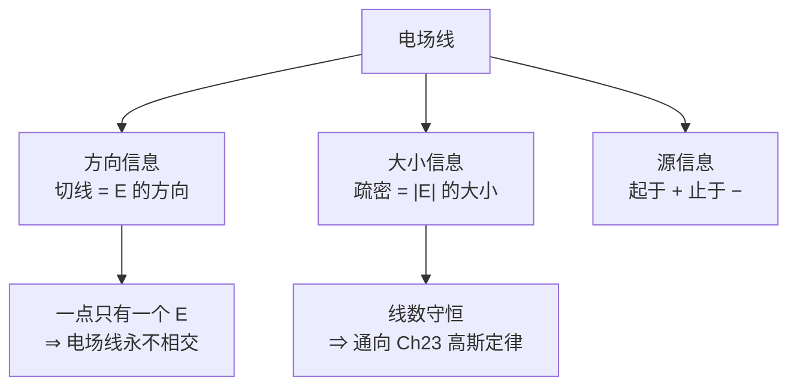

# C22.1 电场 Electric Field

## 本章导航

第 22 章共 7 节：

1. Electric Field 电场 → 本篇
2. Electric Field due to a Point Charge 点电荷电场 → [[C22.2 点电荷的电场]]
3. Electric Field due to an Electric Dipole 电偶极电场 → [[C22.3 电偶极子的电场]]
4. Electric Field due to a Line of Charge 线电荷电场 → [[C22.4 线电荷的电场]]
5. Electric Field due to a Charged Disk 带电圆盘电场 → [[C22.5 带电圆盘的电场]]
6. A Point Charge in an Electric Field 电场中的点电荷 → [[C22.6 电场中的点电荷]]
7. A Dipole in an Electric Field 电场中的电偶极子 → [[C22.7 电场中的电偶极子]]

> [!important] 课后作业（课件原文）
> **Problems: 18, 21, 26, 32, 37, 58**

**Keywords（课件列出）**

- Electric Field, Vector Field, Electric Field Lines
- Uniform Electric Field, Nonuniform Electric Field
- Point Charge, Test Charge
- Electric Dipole, Dipole Axis, Electric Dipole Moment
- Torque on a Dipole
- Potential Energy of a Dipole

> [!note] 上一章回顾（课件 Review 页原样）
> - 电荷 (electrically neutral, positive & negative charge)
> - 同号相斥 (repel)，异号相吸 (attract)
> - 元电荷 (elementary charge)
> - 电荷守恒 (conservation of charge)
> - 导体 (conductor) & 绝缘体 (insulator)
> - 库仑定律 (Coulomb's law)
>
> 详见 [[C21.1 电荷]]、[[C21.2 导体与绝缘体]]、[[C21.3 库仑定律]]。

## 本节结构总览



## 1 What is Physics（课件本章总纲）

> [!important] 三句话概括本章
> - 带电粒子在其周围空间**建立一个电场（矢量场）** (A charged particle sets up an electric field (vector field) in the surrounding space.)
> - **静电力通过电场作用在带电粒子上** (Electrostatic force acts on charged particles via electric field.)
> - **电场线帮助我们把电场的方向和大小可视化** (Electric field lines help us visualize the direction and magnitude of electric fields.)
![[Pasted image 20260903164341.png]]
左边是**经典的静电场实验演示**——绝缘油里悬浮的草籽（grass seed）在两根带电电极之间被极化后排成一条条链，直接把电场线"显影"出来；右边是计算机绘制的一排交替正负点电荷的**电场线流线图**，配色表示场强大小。

> [!note] 草籽实验为什么能显示电场线
> 细长的草籽在电场中被**极化**（一端感应负电、一端感应正电，见 [[C21.2 导体与绝缘体]]），受到力矩后转到与场平行的方向，再首尾相吸连成链。链的走向就是电场方向，链密集处场强大——这正是"电场线"这个概念的实验来源，不是纯粹的画图约定。

## 2 学习目标 Learning objectives（课件原文）

- **01** 认识到带电粒子周围空间的**每一点**都被它建立起一个**电场**，电场是**矢量**，有大小也有方向。
- **02** 认识到电场 $E$ 可以解释：**在两粒子没有接触 (no contact between the particles)** 的情况下，一个带电粒子如何对另一个带电粒子施加**静电力 $F$**。
- **03** 解释如何用一个**小的正试探电荷 (test charge)** 测量任一点的电场。
- **04** 解释**电场线**：它们从哪里发出、到哪里终止，它们的**疏密**代表什么。

## 3 (1) 场的观点 The Idea of Field 场的观点

> [!important] 两类场
> - **标量场 Scalar fields 标量场**：温度 $T(x,y,z)$；压强 $p(x,y,z)$。每点只有一个数。
> - **矢量场 Vector fields 矢量场**：流体的速度；引力场。每点是一个矢量。

> [!important] 课件提出的核心问题
> 库仑定律告诉我们一个电荷如何与其他带电粒子相互作用，**但电荷是怎么"知道"其他电荷存在的？**（but how does the charge "know" of the presence of the other particles?）
> 如果说 $q_1$ 直接隔空作用于 $q_2$，那就是**超距作用 Action at a distance？超距作用**。

> [!important] 场的回答
> - 带电粒子 $q_1$ 在空间中**建立起一个电场** (sets up an electric field in the space)。
> - **电场力通过电场（作为媒介 intermediary 媒介）作用在带电粒子上。**

```mermaid
graph LR
    subgraph 超距作用观点（被抛弃）
    A1["q₁"] -.->|"瞬时、隔空<br/>直接作用"| A2["q₂"]
    end
    subgraph 场的观点（现代）
    B1["q₁"] -->|"① 建立"| B2["电场 E<br/>（弥漫整个空间）"]
    B2 -->|"② 作用"| B3["q₂"]
    end
```

> [!note] 为什么必须抛弃超距作用——课件只提问不回答，这里补上
> 超距作用意味着 $q_1$ 一动，$q_2$ 受的力**立刻**改变，信息传递速度无限大，与相对论冲突。
> 场的观点说：$q_1$ 动了，它周围的场以**光速 $c$** 重新调整，$q_2$ 要过 $r/c$ 之后才"感觉到"。这个延迟在 Ch32 电磁波里就是**电磁波的传播**。
> 更强的证据：**场本身携带能量和动量**。两个电荷相互作用时，如果只看粒子，动量在延迟期间不守恒；把场的动量算进来才守恒。所以**场不是数学记账工具，它是真实存在的物理实体**。这一点是 Ch21 到 Ch22 最重要的观念跳跃。

> [!important] 电场是矢量场
> **正点电荷的电场方向向外，负点电荷的电场方向向内。**（The direction of electric field is outward from a positive point charge, inward from a negative point charge.）
> **带电粒子通过电场与另一个带电粒子相互作用。**

## 4 (2) 电场的定义 Definition of Electric Field

> [!important] 定义
> 要"感受"P 点的电场，就在 P 点放一个**正试探电荷 (positive test charge) 正试探电荷** $q_0$，测量它受的力 $\vec F$。定义该点电场为
> $$\vec E=\frac{\vec F}{q_0}=\frac{1}{4\pi\varepsilon_0}\frac{q}{r^2}\hat r$$
> 类比**引力场 gravitational field**：$\vec g=\dfrac{\vec F}{m_0}$，$m_0$ 是试探质量 (test mass)。
>
> 多个带电粒子时：
> $$\vec E=\frac{\vec F_{net}}{q_0}$$

> [!warning] "试探电荷"三个隐含条件——课件不写，考试常考
> 1. **必须是正电荷**：否则 $\vec E$ 与 $\vec F$ 反向，定义就反了。规定用正电荷是为了让 $\vec E$ 与正电荷受力同向。
> 2. **必须足够小 (电荷量)**：$q_0$ 本身也会产生场，会**推动源电荷重新分布**（尤其源是导体时），测出来的就不是原来的场。严格定义应写成
> $$\vec E=\lim_{q_0\to0}\frac{\vec F}{q_0}$$
> 3. **必须足够小 (几何尺寸)**：否则不是"一点"的场，而是一片区域的平均。
>
> 注意第 2 条与 [[C21.1 电荷]] 的电荷量子化有张力：$q_0$ 最小只能是 $e$，不能真的趋于零。物理上的做法是"小到不扰动源分布即可"，$\lim$ 是数学上的理想化。

> [!important] 单位与量纲
> $$[E]=\frac{\mathrm N}{\mathrm C}=\frac{\mathrm V}{\mathrm m}$$
> 课件此处只用 N/C；V/m 要到 [[C24.1 电势与电势能]] 学了电势之后才能理解为什么等价。**两者完全等同，工程上几乎只用 V/m。**

> [!note] $\vec E$ 与 $\vec g$ 的对照表——把力学的直觉搬过来
> | | 引力 | 静电力 |
> |---|---|---|
> | 源 | 质量 $m$（只有正） | 电荷 $q$（有正负）|
> | 场 | $\vec g=\vec F/m_0$ | $\vec E=\vec F/q_0$ |
> | 场公式 | $g=G\dfrac{M}{r^2}$ | $E=\dfrac{1}{4\pi\varepsilon_0}\dfrac{q}{r^2}$ |
> | 力 | $\vec F=m\vec g$ | $\vec F=q\vec E$ |
> | 方向 | 永远指向源（只吸引） | 正源向外、负源向内 |
> | 强度比 | 两质子间引力与斥力之比约 $10^{-36}$ | |
>
> **唯一的结构性差别是电荷有两种符号**，这带来了引力没有的现象：屏蔽、偶极子、电中性。引力不能被屏蔽，正因为没有负质量。

## 5 (3) 电场线 Electric Field Lines 电场线

![[C22-电场线四种典型分布.png]]

课件横排四张图，从左到右：**正点电荷**（线向外辐射）、**电偶极子**（正负一对，线由正到负）、**两个同号正电荷**（线互相排斥、中间有一个场强为零的鞍点）、**负点电荷**（线向内会聚）。每张图旁标出了试探电荷 $q_0$ 及其受力方向。

> [!important] 电场线的三条规则
> 1. **电场线从正电荷发出，终止于负电荷。**（Electric field lines extend away from positive charge and toward negative charge.）
> 2. **任一点电场线的切线方向就是该点的电场方向。**（At any point, the tangent of the electric field lines gives the direction of the electric field.）
> 3. **垂直于电场线的单位面积上穿过的线数（线密度）正比于电场强度的大小。**（The number of lines per unit area in a plane perpendicular to the lines (density) is proportional to the magnitude of the electric field.）

课件右下角用一组疏密变化的曲线示意第 3 条：线挤在一起的地方 $\vec E$ 大，线稀疏的地方 $\vec E$ 小。



> [!warning] 电场线的四个易错点（课件全部没写，但都是考点）
> 1. **电场线永不相交。** 若相交，交点处切线有两个方向，等于说该点有两个 $\vec E$，矛盾。
> 2. **电场线不是带电粒子的运动轨迹。** 只有粒子从静止释放且场线是直线时两者才重合。一般情况下 $\vec E$ 给的是**加速度方向**，不是速度方向——就像斜抛运动中重力向下但轨迹是抛物线。
> 3. **电场线是"画"出来的，条数是人为选的。** 真实的场处处连续。有意义的是**相对疏密**，不是绝对条数。
> 4. **静电场的电场线不闭合**（必有起点或终点，或伸向无穷远）。这对应静电场是**保守场** $\oint\vec E\cdot d\vec l=0$（Ch24 会证）。**但 Ch30 感应电场的电场线是闭合的**——那时电场线规则要改写，这是全册的一个重要转折。

> [!note] 为什么线密度正好正比于 $E$——课件只给结论
> 看一个孤立点电荷：从它发出 $N$ 条线，向各方向均匀辐射。在半径 $r$ 的球面上，**线的总数不变**（线不中断），球面积 $A=4\pi r^2$，所以
> $$\text{线密度}=\frac{N}{4\pi r^2}\propto\frac{1}{r^2}\propto E$$
> 正好与库仑场的 $1/r^2$ 一致。**这个巧合不是巧合**：正是因为库仑定律是平方反比，"线数守恒"这套画法才能同时正确表示方向和大小。
> 把"穿过曲面的线数"这个想法写成积分，就是**电通量**；把"线数只由内部电荷决定"写成方程，就是 **[[C23.2 高斯定律]]**。**本节是下一章的直接铺垫。**

> [!note] 专业关联：矢量场与可视化
> 电场线在数学上就是矢量场的**流线 (streamline)**，与流体力学的流线、机器学习里梯度场的积分曲线是同一个对象（解常微分方程 $d\vec r/ds\parallel\vec E$）。课件右图那种带配色的流线图，正是 matplotlib 的 `streamplot` 做的事。

---

## 本节自测 Self-Test

> [!question] 1. "超距作用"的困难是什么？场的观点如何解决？
> 超距作用意味着信息瞬时传递，与相对论矛盾，且不引入场时动量不守恒。场的观点：源电荷建立场，场以光速调整，力通过场作用。

> [!question] 2. 写出电场的定义式，并说明试探电荷必须满足哪三个条件。
> $\vec E=\vec F/q_0$（严格 $\lim_{q_0\to0}$）。试探电荷必须：为正、电荷量足够小（不扰动源分布）、几何尺寸足够小。

> [!question] 3. 电场的单位有哪两种写法？
> N/C 与 V/m，完全等价。

> [!question] 4. 电场线的三条规则是什么？
> 起于正电荷止于负电荷；切线方向为场方向；线密度正比于场强大小。

> [!question] 5. 电场线为什么不能相交？它是带电粒子的运动轨迹吗？
> 相交则一点有两个场方向，矛盾。不是轨迹——场给的是力（加速度）方向而非速度方向。

> [!question] 6. 为什么"线密度 ∝ E"这套画法能成立？
> 因为库仑场是平方反比：球面积随 $r^2$ 增长，线数守恒使密度随 $1/r^2$ 下降，恰与 $E$ 一致。这直接通向电通量与高斯定律。

---

下一节 → [[C22.2 点电荷的电场]]
索引 → [[电磁学 MOC]]
