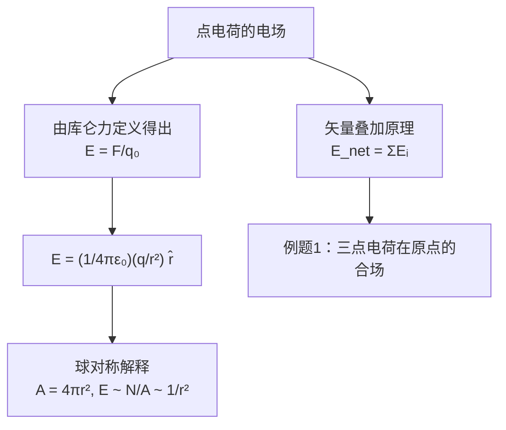
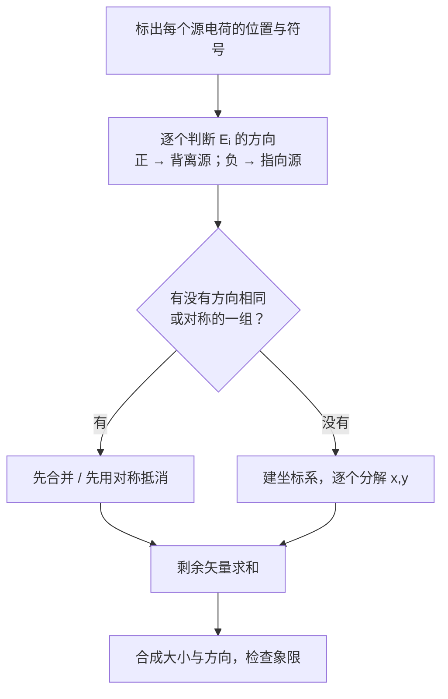

# C22.2 点电荷的电场 Electric Field due to a Point Charge

## 本节结构总览

## 1 学习目标 Learning objectives（课件原文）

- **01** 画一个带电粒子，标出符号，取附近一点，画出该点的电场矢量（矢量的**尾巴锚在该点上**）。
- **02** 对带电粒子电场中的给定点，判断粒子**带正电**和**带负电**时场矢量的**方向**。
- **03** 应用**场强 $E$**、**电荷量 $|q|$** 与**距离 $r$** 之间的关系。
- **04** 若一点上有多个电场，画出各个电场矢量，再**按矢量相加**求**合场**。

> [!warning] 目标 01 里"尾巴锚在该点上"是个画图规范
> 电场矢量画在**场点**上，箭尾在场点、箭头指向场的方向。**不要**把箭头画在源电荷上，也不要把箭尾画在源上——那会让人误以为矢量描述的是源。这是阅卷时会扣分的细节。

## 2 点电荷电场公式

![[C22-电场线四种典型分布.png]]

从库仑定律出发（[[C21.3 库仑定律]]），源电荷 $q$ 对试探电荷 $q_0$ 的力：

$$\vec F=\frac{1}{4\pi\varepsilon_0}\frac{qq_0}{r^2}\hat r$$

按定义 $\vec E=\vec F/q_0$：

> [!important] 点电荷的电场
> $$\vec E=\frac{\vec F}{q_0}=\frac{1}{4\pi\varepsilon_0}\frac{q}{r^2}\hat r$$
> $\hat r$ 是由**源电荷指向场点**的单位矢量。
> - $q>0$：$\vec E$ 沿 $\hat r$，**向外**
> - $q<0$：$\vec E$ 逆 $\hat r$，**向内**

> [!important] 课件给的球对称解释
> **spherical symmetry 球对称**：$A=4\pi r^2$，$E\sim N/A\sim 1/r^2$。
> 即：从点电荷发出的电场线总数 $N$ 固定，均匀分布在半径 $r$ 的球面上，球面积按 $r^2$ 增长，故线密度（即场强）按 $1/r^2$ 衰减。

> [!note] 这句话的分量：$1/r^2$ 的几何来源
> 平方反比不是随便凑的经验公式，而是**三维空间 + 通量守恒**的必然结果。
> - 三维空间：球面积 $\propto r^2$ → 力 $\propto 1/r^2$
> - 若空间是 $n$ 维：球面积 $\propto r^{n-1}$ → 力 $\propto 1/r^{n-1}$
> 引力同样是 $1/r^2$，同样是因为它的"场线"也守恒。**这个观察就是高斯定律的胚胎**：与其记 $1/r^2$，不如记"通量守恒"。到 [[C23.2 高斯定律]] 会把它写成方程。

> [!warning] 公式里 $q$ 不带绝对值
> 与库仑定律的标量形式不同，这里 $q$ 带符号，符号自动决定 $\vec E$ 与 $\hat r$ 同向还是反向。只有求**大小**时才写 $E=\dfrac{1}{4\pi\varepsilon_0}\dfrac{|q|}{r^2}$。

## 3 多个点电荷：矢量叠加原理

> [!important] 叠加原理（矢量形式）
> **多个粒子产生的电场可以用叠加原理计算。**（The electric field due to several particles can be calculated by the principle of superposition. 矢量叠加原理）
> $$\vec E_{net}=\vec E_1+\vec E_2+\cdots+\vec E_n=\sum_{i=1}^{n}\frac{q_i}{4\pi\varepsilon_0 r_i^2}\hat r_i$$

> [!note] 为什么这条比 [[C21.3 库仑定律]] 里的力叠加更好用
> 力的叠加每次都要带上试探电荷 $q_0$；场的叠加把 $q_0$ 除掉了，得到的是**只属于源分布的性质**。于是可以：
> - 先一劳永逸地算出 $\vec E(\vec r)$（"这块空间被怎样的场充满了"）
> - 之后任意放一个电荷 $q$，直接用 $\vec F=q\vec E$
>
> 这是把**源**和**受力者**解耦。工程上一切场仿真（有限元、FDTD）都建立在这个解耦上。

### 例题 1 Example 1（课件原题）

> [!example] 题目
> 图中三个粒子的电荷分别为 $q_1=+2Q$，$q_2=-2Q$，$q_3=-4Q$，三者到原点的距离均为 $d$。求**原点处的合电场**。

![[C22-例题1三点电荷求原点场.png]]

**几何**（由图读出）：$q_1$ 在第二象限、与 $-x$ 轴成 $30°$；$q_3$ 在第一象限、与 $+x$ 轴成 $30°$；$q_2$ 在第四象限、与 $+x$ 轴成 $-30°$。三者到原点距离都是 $d$。

**解 Solution**

$$E_1=E_2=\frac{1}{4\pi\varepsilon_0}\frac{2Q}{d^2},\qquad E_3=\frac{1}{4\pi\varepsilon_0}\frac{4Q}{d^2},\qquad E_1+E_2=E_3$$

课件结论：**合场沿 $+x$ 轴正方向**，大小为

$$E=2\times\frac{1}{4\pi\varepsilon_0}\frac{4Q}{d^2}\times\cos30^\circ=\frac{\sqrt3\,Q}{\pi\varepsilon_0 d^2}$$

> [!note] 课件跳过的方向判断——三个方向必须逐个想清楚，否则那句 "$E_1+E_2=E_3$" 是天书
> - $q_1=+2Q$ 在**左上**（$-x$ 轴上方 $30°$）。正电荷的场**背离源**，所以 $\vec E_1$ 在原点指向**右下**，即与 $+x$ 轴成 $-30^\circ$。
> - $q_2=-2Q$ 在**右下**（$+x$ 轴下方 $30°$）。负电荷的场**指向源**，所以 $\vec E_2$ 在原点指向**右下**，同样与 $+x$ 轴成 $-30^\circ$。
> - **$\vec E_1$ 与 $\vec E_2$ 方向完全相同**，大小又都是 $\dfrac{2Q}{4\pi\varepsilon_0d^2}$，所以它们**直接标量相加**，合矢量大小 $=\dfrac{4Q}{4\pi\varepsilon_0d^2}=E_3$，方向 $-30^\circ$。这就是课件那行 $E_1+E_2=E_3$ 的意思——**它说的是"这个合矢量的大小恰好等于 $E_3$"**，不是什么代数恒等式。
> - $q_3=-4Q$ 在**右上**（$+x$ 轴上方 $30°$）。负电荷的场指向源，所以 $\vec E_3$ 在原点指向**右上**，与 $+x$ 轴成 $+30^\circ$，大小 $\dfrac{4Q}{4\pi\varepsilon_0d^2}$。
>
> **最后一步**：两个**大小相等**、分别位于 $+30^\circ$ 和 $-30^\circ$ 的矢量相加。$y$ 分量等大反向抵消，$x$ 分量相加：
> $$E=2\cdot\frac{4Q}{4\pi\varepsilon_0 d^2}\cos30^\circ=\frac{8Q}{4\pi\varepsilon_0d^2}\cdot\frac{\sqrt3}{2}=\frac{4\sqrt3\,Q}{4\pi\varepsilon_0 d^2}=\frac{\sqrt3\,Q}{\pi\varepsilon_0 d^2}\ ✓$$
> 方向沿 $+x$ 轴。

> [!warning] 本题的解题精髓：先找"能合并的"再算
> 直接把三个矢量都分解成 $x,y$ 分量也能做，但要算 6 个分量。先看出 $\vec E_1\parallel\vec E_2$ 把它们并成一个，问题就变成"两个等长矢量夹角 $60°$ 求和"，一步到位。
> **考场上先花 20 秒观察对称性，往往比闷头分解省一半时间。**

---

## 本节自测 Self-Test

> [!question] 1. 写出点电荷电场的矢量式，说明 $\hat r$ 的定义与符号的作用。
> $\vec E=\dfrac{1}{4\pi\varepsilon_0}\dfrac{q}{r^2}\hat r$，$\hat r$ 由源指向场点；$q>0$ 时 $\vec E$ 沿 $\hat r$ 向外，$q<0$ 时反向指向源。

> [!question] 2. 用"球对称 + 线数守恒"解释为什么 $E\propto1/r^2$。
> 电场线总数不变，球面积 $4\pi r^2$ 随 $r^2$ 增长，故线密度（∝ $E$）按 $1/r^2$ 衰减。这是三维空间的几何结果。

> [!question] 3. 场叠加相比力叠加的好处是什么？
> 除掉了试探电荷，得到只属于源分布的场；源与受力者解耦，先算 $\vec E(\vec r)$，再对任意 $q$ 用 $\vec F=q\vec E$。

> [!question] 4. 例题 1 中 $E_1+E_2=E_3$ 这一行到底在说什么？
> $\vec E_1$ 与 $\vec E_2$ 方向相同（都是 $-30°$），合起来的大小恰等于 $E_3$（大小 $4Q/4\pi\varepsilon_0d^2$）；不是代数恒等式。

> [!question] 5. 例题 1 的合场为什么沿 $+x$？
> 两个等大矢量分别在 $+30°$ 与 $-30°$，$y$ 分量抵消，$x$ 分量相加，故沿 $+x$，大小 $2E_3\cos30°=\sqrt3Q/(\pi\varepsilon_0d^2)$。

---

上一节 ← [[C22.1 电场]] ｜ 下一节 → [[C22.3 电偶极子的电场]]
索引 → [[电磁学 MOC]]
