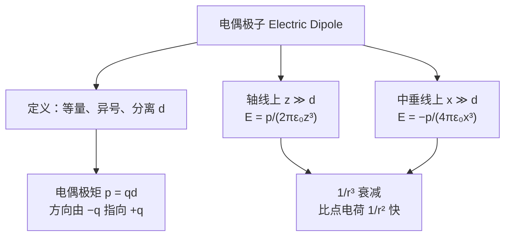

# C22.3 电偶极子的电场 Electric Field due to an Electric Dipole

## 本节结构总览

## 1 学习目标 Learning objectives（课件原文）

- **01** 画出一个**电偶极子**，标出电荷以及**电偶极矩**的方向与大小。
- **02** 判断**偶极轴 (dipole axis)** 上任一给定点的电场方向。
- **03** 对**单个带电粒子**和**电偶极子**，比较电场大小**随距离增大而衰减的快慢**。
- **04** 对偶极轴上任一**远点**，应用**场强 $E$、距中心距离 $z$、偶极矩 $p$** 三者的关系。

## 2 定义

> [!important] 电偶极子 Electric Dipole
> **两个电荷，等量 (equal in magnitude)、异号 (opposite sign)、相隔一个小距离 $d$ (separated by a small distance $d$)。**
> 课件的中文口诀：**电偶极矩："等量""异号""分离"电荷**

> [!important] 电偶极矩 Electric dipole moment 电偶极矩
> $$\boxed{p\equiv qd}$$
> 矢量形式 $\vec p=q\vec d$，**$\vec d$ 的方向由 $-q$ 指向 $+q$**（课件在 p.15 底部注明：Direction of $d$ from $-q$ to $+q$）。
> 单位：$\mathrm{C\cdot m}$。

> [!warning] 方向约定是纯人为的，而且与"场线方向"相反，最容易记反
> 偶极矩 $\vec p$：**由负指向正**。
> 而偶极子的**电场线**：**由正流向负**。
> 两者方向恰好相反，别混。记法：$\vec p$ 跟着"$+$"走（$\vec p$ 的箭头端是正电荷那端）。
> 化学里的键偶极矩约定与物理相反（化学习惯从正指向负），看跨学科文献时要留意。

## 3 偶极轴上的电场（$z\gg d$）

![[C22-电偶极子轴线上的场几何.png]]

设偶极子中心在原点，偶极轴为 $z$ 轴，$+q$ 在 $z=+d/2$，$-q$ 在 $z=-d/2$。场点 P 在轴上距中心 $z$ 处。

**两个分场**

$$E_{(+)}=\frac{1}{4\pi\varepsilon_0}\frac{q}{r_{(+)}^2}=\frac{1}{4\pi\varepsilon_0}\frac{q}{\left(z-\dfrac d2\right)^2}\quad(\text{沿}+z)$$

$$E_{(-)}=\frac{1}{4\pi\varepsilon_0}\frac{-q}{r_{(-)}^2}=\frac{1}{4\pi\varepsilon_0}\frac{-q}{\left(z+\dfrac d2\right)^2}\quad(\text{沿}-z)$$

**相加**

$$E=E_{(+)}+E_{(-)}=\frac{1}{4\pi\varepsilon_0}\frac{q}{z^2}\left(\frac{1}{\left(1-\dfrac{d}{2z}\right)^2}-\frac{1}{\left(1+\dfrac{d}{2z}\right)^2}\right)$$

> [!note] 这一步的代数：为什么能提出 $q/z^2$
> $\left(z\mp\dfrac d2\right)^2=z^2\left(1\mp\dfrac{d}{2z}\right)^2$，把 $z^2$ 提到外面即可。**提出 $z^2$ 的目的是让括号里只剩无量纲小量 $\dfrac{d}{2z}$，为下一步取近似做准备。** 这是所有"远场展开"的标准第一步。

**通分**

$$E=\frac{1}{4\pi\varepsilon_0}\frac{q}{z^2}\cdot\frac{\dfrac{2d}{z}}{\left(1-\left(\dfrac{d}{2z}\right)^2\right)^2}=\frac{1}{4\pi\varepsilon_0}\frac{q}{z^3}\cdot\frac{2d}{\left(1-\left(\dfrac{d}{2z}\right)^2\right)^2}$$

> [!note] 课件直接跳到这里，中间通分补上
> 令 $u=\dfrac{d}{2z}$。分子
> $$\frac{1}{(1-u)^2}-\frac{1}{(1+u)^2}=\frac{(1+u)^2-(1-u)^2}{(1-u)^2(1+u)^2}=\frac{4u}{\left[(1-u)(1+u)\right]^2}=\frac{4u}{(1-u^2)^2}$$
> 代回 $u=\dfrac{d}{2z}$ 得 $4u=\dfrac{2d}{z}$，分母 $(1-u^2)^2=\left(1-\left(\dfrac{d}{2z}\right)^2\right)^2$，与课件一致。$\dfrac{q}{z^2}\cdot\dfrac{2d}{z}=\dfrac{2qd}{z^3}$，所以可以写成 $\dfrac{q}{z^3}\cdot 2d$。

**取远场极限**

for $z\gg d$，$\left(\dfrac{d}{2z}\right)^2\to0$，分母 $\to1$：

> [!important] 偶极轴上的远场
> $$E=\frac{1}{2\pi\varepsilon_0}\frac{qd}{z^3}=\boxed{\frac{1}{2\pi\varepsilon_0}\frac{p}{z^3}}$$
> 矢量方向：与 $\vec p$ **同向**。

> [!important] 关键物理：$1/z^3$ 而不是 $1/z^2$（对应学习目标 03）
> 单个点电荷 $E\propto 1/r^2$，电偶极子 $E\propto1/r^3$，**衰减更快**。
> **物理原因**：远处看，偶极子的正负电荷几乎重合，总电荷为零，$1/r^2$ 项完全抵消，剩下的只是两者微小错位造成的**一阶残余**。
> 这是**多极展开 (multipole expansion)** 的第一课：
> 
> | 多极 | 总电荷 | 远场衰减 |
> |---|---|---|
> | 单极 (monopole) | $q\ne0$ | $1/r^2$ |
> | 偶极 (dipole) | $0$，但 $\vec p\ne0$ | $1/r^3$ |
> | 四极 (quadrupole) | $0$，$\vec p=0$ | $1/r^4$ |
> **每多抵消一阶，就多掉一个 $1/r$。** 中性分子之间的范德华力衰减极快（$1/r^6$ 量级），根子就在这里。

> [!warning] $z\gg d$ 这个条件不能忘
> 公式 $E=p/(2\pi\varepsilon_0z^3)$ 只在远场成立。在 $z\sim d$ 的近场，必须用未近似的完整表达式。考试若给的 $z$ 与 $d$ 同量级，直接套 $1/z^3$ 就错了。

## 4 中垂线上的电场（$x\gg d$）

![[C22-电偶极子中垂线上的场几何.png]]

> [!important] 课件结论
> **中垂线 (perpendicular bisection) 上距中心 $x\gg d$ 处：**
> $$\vec E=-\frac{1}{4\pi\varepsilon_0}\frac{\vec p}{x^3}$$
> 负号表示方向与 $\vec p$ **反平行**。

> [!note] 课件只给了结论，推导补上（这是标准考点）
> 中垂线上一点到 $+q$ 和到 $-q$ 的距离相等，均为 $r=\sqrt{x^2+(d/2)^2}$，故两个分场**大小相等**：
> $$E_{(+)}=E_{(-)}=\frac{1}{4\pi\varepsilon_0}\frac{q}{x^2+(d/2)^2}$$
> **方向**：$\vec E_{(+)}$ 背离 $+q$（斜向外上），$\vec E_{(-)}$ 指向 $-q$（斜向内下）。把它们分解到平行于 $\vec p$ 和垂直于 $\vec p$ 两个方向：
> - **垂直于偶极轴的分量**（沿 $x$）：两者等大反向，**完全抵消** ✓（这就是图上为什么合矢量 $\vec E$ 是竖直向下的）
> - **平行于偶极轴的分量**：两者同向（都指向 $-\vec p$ 方向），相加
>
> 设 $\alpha$ 为分场与偶极轴的夹角，则 $\cos\alpha=\dfrac{d/2}{r}$：
> $$E=2E_{(+)}\cos\alpha=2\cdot\frac{1}{4\pi\varepsilon_0}\frac{q}{r^2}\cdot\frac{d/2}{r}=\frac{1}{4\pi\varepsilon_0}\frac{qd}{r^3}=\frac{1}{4\pi\varepsilon_0}\frac{p}{\left(x^2+(d/2)^2\right)^{3/2}}$$
> $x\gg d$ 时 $r\to x$：
> $$E=\frac{1}{4\pi\varepsilon_0}\frac{p}{x^3}\ ✓$$
> 方向与 $\vec p$ 相反，故写成 $\vec E=-\dfrac{1}{4\pi\varepsilon_0}\dfrac{\vec p}{x^3}$。

> [!important] 记住这个"2 倍"关系
> $$\frac{E_{\text{轴线}}}{E_{\text{中垂线}}}=\frac{1/(2\pi\varepsilon_0)}{1/(4\pi\varepsilon_0)}=2$$
> **同样距离下，轴线上的场是中垂线上的 2 倍，而且方向相反**（轴线上与 $\vec p$ 同向，中垂线上与 $\vec p$ 反向）。这是判断题的高频出处。

![[C22-电偶极子电场线图.png]]

课件配的偶极子电场线全景图：线从 $+q$ 发出，绕回 $-q$；轴线附近线最密（场最强），中垂线方向线较疏且方向与 $\vec p$ 相反。**把上面两个公式和这张图对照着看，方向关系就不会记反。**

> [!note] 专业关联：偶极子无处不在
> - **水分子** $\vec p=6.2\times10^{-30}\ \mathrm{C\cdot m}$（[[C22.7 电场中的电偶极子]] 的例题 4 会用到）。水的强偶极矩是它成为"万能溶剂"、以及微波炉能加热食物的原因。
> - **电介质极化**：绝缘体在外场中每个分子变成一个小偶极子，宏观效应就是 Ch25 的相对介电常数 $\varepsilon_r$。
> - **天线**：最基本的辐射单元就是**振荡电偶极子**，Ch32 会算它的辐射场。
> - **静电吸引中性物体**：[[C21.2 导体与绝缘体]] 里"带电体吸引碎纸屑"，微观机制就是把纸屑分子极化成偶极子，再在**非均匀场**中受净力（均匀场中偶极子净力为零，见 [[C22.7 电场中的电偶极子]]）。

---

## 本节自测 Self-Test

> [!question] 1. 电偶极子的定义与偶极矩的定义式、方向？
> 等量异号、相隔小距离 $d$ 的一对电荷；$\vec p=q\vec d$，方向由 $-q$ 指向 $+q$，单位 C·m。

> [!question] 2. 写出偶极轴上远场公式和中垂线上远场公式，并比较。
> 轴线：$E=\dfrac{p}{2\pi\varepsilon_0z^3}$，与 $\vec p$ 同向。中垂线：$\vec E=-\dfrac{\vec p}{4\pi\varepsilon_0x^3}$，与 $\vec p$ 反向、大小为轴线的一半。

> [!question] 3. 为什么偶极子的场按 $1/r^3$ 而不是 $1/r^2$ 衰减？
> 总电荷为零，$1/r^2$ 的单极项完全抵消，剩下的是电荷微小错位的一阶残余。每抵消一阶多掉一个 $1/r$。

> [!question] 4. 推导中，"提出 $q/z^2$、只留下无量纲小量 $d/2z$"这一步的意义是什么？
> 为取远场近似做准备——只有把展开量写成无量纲小量，才能判断哪些项可略。

> [!question] 5. 中垂线上，两个分场的哪个分量抵消、哪个相加？
> 垂直于偶极轴的分量等大反向抵消；平行于偶极轴的分量同向相加（方向为 $-\vec p$）。

> [!question] 6. 偶极矩 $\vec p$ 的方向与偶极子电场线的方向一致吗？
> 不一致，恰好相反：$\vec p$ 由负指向正，电场线由正流向负。

---

上一节 ← [[C22.2 点电荷的电场]] ｜ 下一节 → [[C22.4 线电荷的电场]]
索引 → [[电磁学 MOC]]
