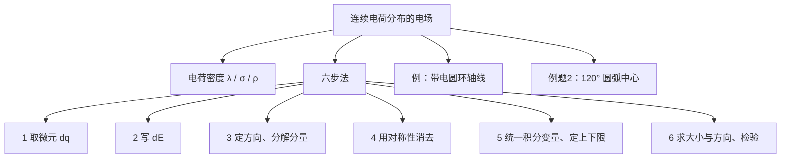
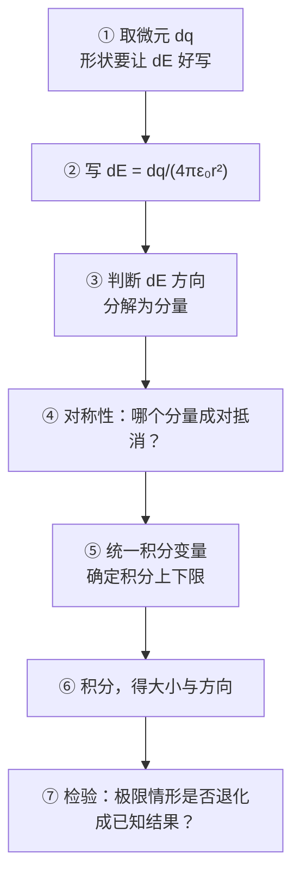

# C22.4 线电荷的电场 Electric Field due to a Line of Charge

## 本节结构总览

## 1 学习目标 Learning objectives（课件原文）

- **01** 对均匀电荷分布，会求**线电荷密度 $\lambda$**、**面电荷密度 $\sigma$**、**体电荷密度 $\rho$**。
- **02** 对沿一条线均匀分布的电荷，通过把分布**拆成电荷微元 $dq$**，再把各微元在该点产生的电场矢量**积分**，求出该点的**合电场**。
- **03** 解释如何用**对称性**简化线电荷附近某点的电场计算。

> [!important] 课件给的例子范围
> **Examples: straight line, ring, arc.**（直线、圆环、圆弧）

## 2 三种电荷密度

> [!important] 定义
> | 密度 | 符号 | 定义 | 单位 | 微元 |
> |---|---|---|---|---|
> | 线电荷密度 Linear charge density | $\lambda$ | $\lambda=\dfrac{dq}{ds}$ | $\mathrm{C/m}$ | $dq=\lambda\,ds$ |
> | 面电荷密度 Surface charge density | $\sigma$ | $\sigma=\dfrac{dq}{dA}$ | $\mathrm{C/m^2}$ | $dq=\sigma\,dA$ |
> | 体电荷密度 Volume charge density | $\rho$ | $\rho=\dfrac{dq}{dV}$ | $\mathrm{C/m^3}$ | $dq=\rho\,dV$ |
>
> 均匀分布时可直接写 $\lambda=Q/L$、$\sigma=Q/A$、$\rho=Q/V$。

> [!warning] 选哪个密度由**电荷实际占据的维度**决定，不是由物体形状决定
> - 一根细棒上的电荷 → $\lambda$
> - 一个**导体**球壳表面的电荷 → $\sigma$（[[C21.3 库仑定律]] 说了导体电荷全在表面）
> - 一个**绝缘体**实心球内部均匀带电 → $\rho$
> **同一个球，导体用 $\sigma$、绝缘体用 $\rho$。** 这个区分在 [[C23.4 对称带电绝缘体的电场]] 里会决定用哪种高斯面、算出完全不同的结果。

## 3 计算连续电荷分布电场的六个步骤（课件原文）

![[C22-连续电荷分布微元场分解.png]]

> [!important] Steps to calculate the electric field due to a continuous charge distribution 计算连续分布电荷的电场的步骤
> 1. 把带电体分成合适的**电荷微元 $dq$**（differential elements）**微电荷**
> 2. 求 $dq$ 产生的 $dE$；$dE$ 可以用点电荷公式，也可以用已经求出的已知场（**微电场**）
> 3. 确定 $E$ 的**方向**并**分解成分量**（**电场方向**）
> 4. 找出**对称性**并化简（**对称消除**）
> 5. 若积分中出现多个变量，**保留一个变量、把其余变量用它表示**，并确定积分限（**积分**）
> 6. 计算电场的**大小和方向**，**检验答案**（**大小和方向**）

> [!note] 第 6 步"检验答案"具体检验什么——课件不展开，这是最容易被忽略又最有用的一步
> 三种标准检验：
> 1. **量纲**：结果的量纲必须是 N/C。
> 2. **远场极限**：距离 $\to\infty$ 时，任何有限大小的带电体都应退化成**点电荷** $E\to\dfrac{Q}{4\pi\varepsilon_0 r^2}$（若总电荷不为零）。
> 3. **对称/特殊点**：如圆环中心 $z=0$ 应给 $E=0$；圆盘 $R\to\infty$ 应给无限大平面的 $\sigma/2\varepsilon_0$（见 [[C22.5 带电圆盘的电场]]）。
>
> 这三条能抓住 90% 的计算错误，**考试写完一定要花 30 秒做一次**。

## 4 例：均匀带电圆环轴线上的电场

![[C22-均匀带电圆环轴线场几何.png]]

> [!example] 题目
> 电荷均匀分布在半径为 $R$ 的圆环上，线电荷密度为 $\lambda$。求**中心轴线上**的电场。

**按六步法**

**① 取微元**：一小段弧 $ds$，电荷 $dq=\lambda\,ds$

**② 微元的场**：

$$d\vec E=\frac{dq}{4\pi\varepsilon_0 r^2}\hat r=\frac{\lambda\,ds}{4\pi\varepsilon_0 r^2}\hat r$$

其中 $r=\sqrt{R^2+z^2}$ 是微元到场点 P 的距离。

**③ 分解**：设 $d\vec E$ 与 $z$ 轴夹角为 $\theta$，

$$dE_{/\!/z}=dE\cos\theta,\qquad dE_{\perp z}=dE\sin\theta$$

**④ 对称性**：

$$E_{\perp z}=0$$

> [!note] 为什么垂直分量为零
> 圆环关于 $z$ 轴**旋转对称**。对任一微元 $ds$，圆环上正对面（相差 $180^\circ$）总有一个大小相同的微元 $ds'$，它的垂直分量与 $ds$ 的垂直分量**等大反向**。整圈积下来完全抵消。
> **只剩轴向分量**——这与 [[C21.3 库仑定律]] 里球壳定理的对称性论证是同一个套路：**先用对称性把矢量积分降成标量积分**。

**⑤ 积分**：

$$E=\int_L dE_{/\!/z}=\int_L dE\cos\theta=\int_0^{2\pi R}\frac{1}{4\pi\varepsilon_0}\frac{\lambda\,ds}{r^2}\cos\theta$$

> [!important] 关键观察（课件红字）
> **$s$ 是积分过程中唯一变化的量。**（$s$ is the only quantity varies during the integration.）
> 因为对轴线上的固定场点 P，**圆环上每个微元到 P 的距离 $r$ 都相同、夹角 $\theta$ 都相同**！所以 $\dfrac{1}{r^2}\cos\theta$ 可以整体提到积分号外，积分退化成 $\int_0^{2\pi R}ds=2\pi R$。
> **这就是为什么"轴线上"是唯一算得动的位置。** 偏离轴线一点，$r$ 和 $\theta$ 就随微元位置变化，积分变成椭圆积分，没有初等函数解。

$$E=\frac{2\pi R}{4\pi\varepsilon_0}\frac{\lambda}{r^2}\cos\theta=\frac{1}{4\pi\varepsilon_0}\frac{q}{r^2}\cos\theta$$

（用了 $q=\lambda\cdot2\pi R$ 是圆环总电荷。）

**⑥ 代入 $\cos\theta=\dfrac{z}{r}=\dfrac{z}{(R^2+z^2)^{1/2}}$，$r^2=R^2+z^2$：**

> [!important] 均匀带电圆环轴线上的电场
> $$\boxed{E=\frac{1}{4\pi\varepsilon_0}\frac{qz}{(R^2+z^2)^{3/2}}}$$
> 方向沿轴（$q>0$ 时背离圆环）。

> [!note] 检验与极值（课件没做，但必考）
> - **$z=0$（环心）**：$E=0$ ✓ 对称性要求如此。
> - **$z\gg R$（远场）**：$(R^2+z^2)^{3/2}\to z^3$，$E\to\dfrac{q}{4\pi\varepsilon_0z^2}$ ✓ 退化成点电荷。
> - **最大值位置**：令 $\dfrac{dE}{dz}=0$ 可解得
> $$z=\frac{R}{\sqrt2}\approx0.707R$$
> 此处场强最大。**这是一个经典填空题。**
> 求法：对 $f(z)=z(R^2+z^2)^{-3/2}$ 求导，$f'=(R^2+z^2)^{-3/2}-3z^2(R^2+z^2)^{-5/2}=0$ → $R^2+z^2=3z^2$ → $z^2=R^2/2$。

## 5 例题 2：120° 圆弧中心的电场（课件原题）

> [!example] 题目
> 一根半径为 $r$、张角 $120^\circ$ 的塑料圆弧棒，均匀带电 $-Q$。求**曲率中心**处的电场。

![[C22-例题2圆弧对称元抵消.png]]

**解 Solution（课件原步骤）**

$$dq=\lambda\,ds,\qquad d\vec E=\frac{\lambda\,ds}{4\pi\varepsilon_0 r^2}\hat r$$

$$dE_x=dE\cos\theta,\qquad dE_y=dE\sin\theta$$

**关于 $x$ 轴对称**（symmetry about x axis）：

$$\int dE_y=0$$

> [!note] 图上的 "Symmetric element $ds'$" 就是在说这件事
> 课件的图特意画了上下两个对称的微元 $ds$ 和 $ds'$，以及它们各自的 $d\vec E$ 和 $d\vec E'$：$y$ 分量一上一下抵消，$x$ 分量同向叠加。**先把坐标系的 $x$ 轴取在对称轴上**，是这类题的第一步。

$$dE_x=dE\cos\theta=\frac{\lambda\,ds}{4\pi\varepsilon_0 r^2}\cos\theta$$

**换积分变量**（课件黄底强调）：

$$\boxed{ds=r\,d\theta}$$

$$E=\int dE_x=\int_{-60^\circ}^{+60^\circ}\frac{\lambda\,r\,d\theta}{4\pi\varepsilon_0 r^2}\cos\theta=\frac{\sqrt3\,\lambda}{4\pi\varepsilon_0 r}$$

> [!note] 补上积分的一行
> $$\frac{\lambda}{4\pi\varepsilon_0 r}\int_{-60^\circ}^{+60^\circ}\cos\theta\,d\theta=\frac{\lambda}{4\pi\varepsilon_0 r}\big[\sin\theta\big]_{-60^\circ}^{+60^\circ}=\frac{\lambda}{4\pi\varepsilon_0 r}\cdot2\sin60^\circ=\frac{\sqrt3\,\lambda}{4\pi\varepsilon_0 r}\ ✓$$
> **积分上下限为什么是 $\pm60^\circ$**：总张角 $120^\circ$，$x$ 轴取在对称轴（角平分线）上，所以从 $-60^\circ$ 到 $+60^\circ$。

> [!warning] 课件没做完的一步：把答案换成用 $Q$ 表示
> 题目给的是总电荷 $-Q$，答案里却是 $\lambda$，**这不算完整答案**。
> 弧长 $L=r\cdot\dfrac{2\pi}{3}$（$120^\circ$ 的弧度），所以
> $$\lambda=\frac{Q}{L}=\frac{Q}{\dfrac{2\pi r}{3}}=\frac{3Q}{2\pi r}$$
> 代入：
> $$E=\frac{\sqrt3}{4\pi\varepsilon_0 r}\cdot\frac{3Q}{2\pi r}=\frac{3\sqrt3\,Q}{8\pi^2\varepsilon_0 r^2}$$
> **方向**：电荷为**负**，场指向电荷，即从中心指向圆弧，沿 $+x$ 方向（图中圆弧在右侧）。
> 考试若题目给总电荷，答案必须用总电荷表示。

> [!note] 一个能秒杀这类题的记忆结论
> 张角为 $\alpha$ 的均匀带电圆弧，在曲率中心处：
> $$E=\frac{\lambda}{4\pi\varepsilon_0 r}\cdot2\sin\frac{\alpha}{2}$$
> 检验两个极端：
> - $\alpha=2\pi$（完整圆环）：$2\sin\pi=0$ → $E=0$ ✓ 与圆环 $z=0$ 结果一致
> - $\alpha\to0$（很短的弧，近似点电荷）：$2\sin\frac\alpha2\to\alpha$，$E\to\dfrac{\lambda r\alpha}{4\pi\varepsilon_0r^2}=\dfrac{q}{4\pi\varepsilon_0r^2}$ ✓ 退化成点电荷
> 本题 $\alpha=120^\circ$：$2\sin60^\circ=\sqrt3$ ✓

---

## 本节自测 Self-Test

> [!question] 1. 三种电荷密度的符号、定义与单位？选哪一个由什么决定？
> $\lambda$ (C/m)、$\sigma$ (C/m²)、$\rho$ (C/m³)。由电荷实际占据的维度决定，不是由物体外形——同一个球，导体用 $\sigma$、绝缘体用 $\rho$。

> [!question] 2. 复述计算连续分布电场的六个步骤。
> 取微元 → 写 $dE$ → 定方向并分解 → 用对称性消去 → 统一变量并定限积分 → 求大小方向并检验。

> [!question] 3. 圆环轴线上，为什么 $\frac{1}{r^2}\cos\theta$ 可以提到积分号外？偏离轴线还行吗？
> 因为轴上场点到环上每个微元的 $r$ 和 $\theta$ 都相同。偏离轴线则两者随微元变化，积分不再初等。

> [!question] 4. 写出圆环轴线上的场，并回答场强最大在何处。
> $E=\dfrac{qz}{4\pi\varepsilon_0(R^2+z^2)^{3/2}}$；最大值在 $z=R/\sqrt2\approx0.707R$。

> [!question] 5. 例题 2 中积分上下限为什么取 $\pm60°$？答案用总电荷 $Q$ 怎么写？
> 总张角 120°，$x$ 轴取在角平分线上。$\lambda=3Q/(2\pi r)$，$E=\dfrac{3\sqrt3Q}{8\pi^2\varepsilon_0r^2}$，方向由中心指向圆弧（因为电荷为负）。

> [!question] 6. 张角 $\alpha$ 的圆弧在中心的场强通式是什么？如何用它检验？
> $E=\dfrac{\lambda}{4\pi\varepsilon_0r}\cdot2\sin\dfrac\alpha2$。$\alpha=2\pi$ 给 0（完整圆环），$\alpha\to0$ 退化为点电荷。

---

上一节 ← [[C22.3 电偶极子的电场]] ｜ 下一节 → [[C22.5 带电圆盘的电场]]
索引 → [[电磁学 MOC]]
