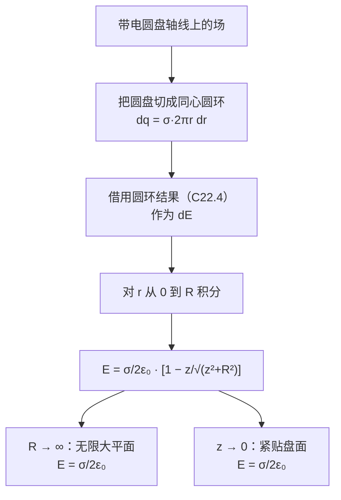
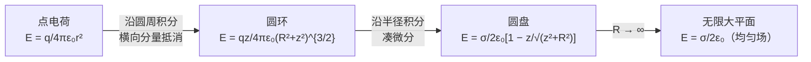

# C22.5 带电圆盘的电场 Electric Field due to a Charged Disk

## 本节结构总览

## 1 学习目标 Learning objectives（课件原文）

- **01** 对均匀电荷分布，会求面上的**面电荷密度 $\sigma$**。
- **02** 画出均匀带电圆盘，并标出中心轴上一点的电场方向（分正电荷、负电荷两种情况）。
- **03** 解释如何**用均匀带电圆环轴线上的电场公式，导出均匀带电圆盘轴线上的电场公式**。
- **04** 对均匀带电圆盘中心轴上一点，应用**面电荷密度、盘半径、到该点距离**三者的关系。

> [!important] 目标 03 是本节的方法核心
> 这一节不是重新做一遍积分，而是演示 **[[C22.4 线电荷的电场]] 六步法的第 2 步**："$dE$ 可以是点电荷的场，**也可以是已经求出的已知场**"。
> 圆盘 = 一圈圈圆环，圆环的场上一节已经算好了，直接拿来当 $dE$ 用。**这种"分层复用"是处理复杂分布的通用策略**：圆盘 ← 圆环 ← 点电荷。

## 2 推导

![[C22-均匀带电圆盘环带微元.png]]

> [!example] 题目
> 半径为 $R$ 的塑料圆盘带有均匀分布的正面电荷，面密度为 $\sigma$。求**中心轴线上**的电场。

**① 取微元：一个半径 $r$、宽 $dr$ 的圆环带**

$$dq=\sigma\,dA=\sigma\cdot2\pi r\,dr$$

> [!note] 环带面积为什么是 $2\pi r\,dr$
> 把宽为 $dr$ 的细环带"剪开拉直"，得到一个长 $2\pi r$（周长）、宽 $dr$ 的长条，面积 $2\pi r\,dr$。
> 严格说环带面积是 $\pi[(r+dr)^2-r^2]=2\pi r\,dr+\pi(dr)^2$，二阶小量 $\pi(dr)^2$ 在微分中舍去。

**② 微元的场：直接用圆环的结果（[[C22.4 线电荷的电场]]）**

$$dE=\frac{1}{4\pi\varepsilon_0}\frac{z\,dq}{(r^2+z^2)^{3/2}}=\frac{\sigma z}{4\varepsilon_0}\frac{2r\,dr}{(r^2+z^2)^{3/2}}$$

> [!note] 系数怎么合并的
> $\dfrac{1}{4\pi\varepsilon_0}\cdot\sigma\cdot2\pi r\,dr=\dfrac{\sigma\cdot 2\pi}{4\pi\varepsilon_0}r\,dr=\dfrac{\sigma}{2\varepsilon_0}r\,dr$。课件写成 $\dfrac{\sigma z}{4\varepsilon_0}\cdot\dfrac{2r\,dr}{(\cdot)^{3/2}}$，与之等价。
> 注意：**这一步已经用掉了对称性**——圆环的公式本身就是"垂直分量已抵消"的结果，所以这里 $dE$ 直接就是轴向的标量，可以**直接标量积分**，不用再分解。这正是复用已知结果的好处。

**③ 积分（对 $r$ 从 0 到 $R$，$z$ 是常数）**

> [!important] 课件强调
> **Integrating with respect to the variable $r$ ($z$ = constant)** —— 积分变量是 $r$，场点位置 $z$ 在积分过程中是常数。

$$E=\frac{\sigma z}{4\varepsilon_0}\int_0^R\frac{2r\,dr}{(r^2+z^2)^{3/2}}$$

> [!note] 补上积分的一行（凑微分）
> 令 $u=r^2+z^2$，则 $du=2r\,dr$，正好是分子。积分限：$r=0\Rightarrow u=z^2$；$r=R\Rightarrow u=R^2+z^2$。
> $$\int_{z^2}^{R^2+z^2}u^{-3/2}du=\Big[-2u^{-1/2}\Big]_{z^2}^{R^2+z^2}=2\left(\frac1z-\frac{1}{\sqrt{R^2+z^2}}\right)$$
> 代回：
> $$E=\frac{\sigma z}{4\varepsilon_0}\cdot2\left(\frac1z-\frac{1}{\sqrt{z^2+R^2}}\right)=\frac{\sigma}{2\varepsilon_0}\left(1-\frac{z}{\sqrt{z^2+R^2}}\right)\ ✓$$
> **课件把 $2r\,dr$ 写在分子上，就是为了让你一眼看出可以凑微分。** 这是设计好的。

> [!important] 均匀带电圆盘轴线上的电场
> $$\boxed{E=\frac{\sigma}{2\varepsilon_0}\left[1-\frac{z}{(z^2+R^2)^{1/2}}\right]}$$
> 方向沿轴：$\sigma>0$ 时背离圆盘，$\sigma<0$ 时指向圆盘。

## 3 检验答案 Check the answer（课件原文的两个极限）

> [!important] 极限 ①：$R\to\infty$（无限大带电平面 Infinite sheet）
> $$\frac{z}{\sqrt{z^2+R^2}}\to0\quad\Rightarrow\quad \boxed{E=\frac{\sigma}{2\varepsilon_0}}$$

> [!important] 极限 ②：$z\to0$（紧贴盘面）
> $$\frac{z}{\sqrt{z^2+R^2}}\to0\quad\Rightarrow\quad E=\frac{\sigma}{2\varepsilon_0}$$

> [!note] 两个极限为什么给出同一个答案——课件并列放着不解释，这是最值得想清楚的一点
> 因为**只有 $z/R$ 这个无量纲比值有意义**，不存在绝对的"远"和"近"。
> $$\frac{z}{\sqrt{z^2+R^2}}=\frac{z/R}{\sqrt{(z/R)^2+1}}$$
> 结果只依赖 $z/R$。$R\to\infty$（盘无限大）和 $z\to0$（贴着盘面）都是 $z/R\to0$，**是同一个物理情形**：站得离盘足够近，看到的就是一个"无边无际的平面"。
> 反过来，$z\gg R$（$z/R\to\infty$）时应退化成点电荷。验证：
> $$\frac{z}{\sqrt{z^2+R^2}}=\left(1+\frac{R^2}{z^2}\right)^{-1/2}\approx1-\frac{R^2}{2z^2}$$
> $$E\approx\frac{\sigma}{2\varepsilon_0}\cdot\frac{R^2}{2z^2}=\frac{\sigma\pi R^2}{4\pi\varepsilon_0 z^2}=\frac{q}{4\pi\varepsilon_0z^2}\ ✓$$
> （用了 $q=\sigma\pi R^2$。）**三个极限全部自洽**，这个答案可以放心用。

> [!important] $E=\dfrac{\sigma}{2\varepsilon_0}$ 的两个惊人之处
> 1. **与距离 $z$ 无关**——无限大带电平面产生**均匀电场 (uniform electric field)**。离得再远场强也不变。
>   直觉解释：走远一倍，每个面元的场按 $1/r^2$ 变成 $1/4$，但"能被你看到的有效面积"按 $r^2$ 变成 4 倍，恰好抵消。**又是平方反比的功劳。**
> 2. **分母是 $2\varepsilon_0$ 而不是 $4\pi\varepsilon_0$**——这里的 $2$ 来自"平面有两侧，场向两边各发出一半"。到 [[C23.4 对称带电绝缘体的电场]] 用高斯定律重算，这个 2 会以"高斯面有上下两个底面"的形式出现。

> [!warning] 极易混淆的三个 "$\sigma/\varepsilon_0$ 家族"公式
> | 情形 | 场强 | 出处 |
> |---|---|---|
> | 无限大**带电薄板**（电荷两侧对称向外） | $E=\dfrac{\sigma}{2\varepsilon_0}$ | 本节 |
> | **导体表面**外侧紧邻处 | $E=\dfrac{\sigma}{\varepsilon_0}$ | Ch23/Ch24 |
> | 平行板电容器**内部**（两板电荷异号） | $E=\dfrac{\sigma}{\varepsilon_0}$ | Ch25 |
> 三者差一个因子 2，原因各不相同（薄板向两侧发场 / 导体内部无场使全部通量走外侧 / 两块板的场在内部叠加）。**做题时先问"是哪一种"。**

## 4 方法总结

> [!note] 这条链条的意义
> 每一级都把上一级的结果当作 $dE$ 使用，避免重复做二重/三重积分。**建立自己的"已知场库"**（点电荷、圆环、圆盘、无限长直线、无限大平面），后面遇到复杂分布就是查表 + 一次积分。这是这门课的核心技能之一。

---

## 本节自测 Self-Test

> [!question] 1. 圆盘轴线上电场的推导中，微元取什么形状？为什么？
> 半径 $r$、宽 $dr$ 的同心圆环带，$dq=\sigma 2\pi r\,dr$。因为圆环轴线上的场已在上一节求出，可直接复用，且横向分量已自动抵消。

> [!question] 2. 写出圆盘轴线上的电场公式。
> $E=\dfrac{\sigma}{2\varepsilon_0}\left[1-\dfrac{z}{(z^2+R^2)^{1/2}}\right]$。

> [!question] 3. 为什么 $R\to\infty$ 与 $z\to0$ 给出同一个结果？
> 结果只依赖无量纲比 $z/R$，两种极限都是 $z/R\to0$，物理上是同一情形："贴近一个看不到边界的平面"。

> [!question] 4. 验证 $z\gg R$ 时公式退化为点电荷。
> $\dfrac{z}{\sqrt{z^2+R^2}}\approx1-\dfrac{R^2}{2z^2}$，代入得 $E\approx\dfrac{\sigma\pi R^2}{4\pi\varepsilon_0z^2}=\dfrac{q}{4\pi\varepsilon_0z^2}$ ✓

> [!question] 5. 无限大带电平面的场为什么与距离无关？
> $1/r^2$ 的衰减恰好被"有效可见面积 $\propto r^2$"的增长抵消。

> [!question] 6. $\sigma/2\varepsilon_0$ 与 $\sigma/\varepsilon_0$ 分别用在什么场合？
> $\sigma/2\varepsilon_0$：孤立的无限大带电薄板（向两侧发场）。$\sigma/\varepsilon_0$：导体表面外紧邻处；平行板电容器内部。

---

上一节 ← [[C22.4 线电荷的电场]] ｜ 下一节 → [[C22.6 电场中的点电荷]]
索引 → [[电磁学 MOC]]
