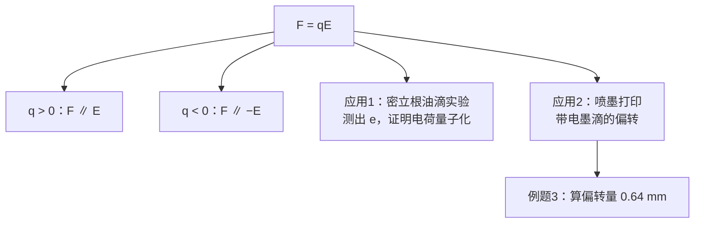

# C22.6 电场中的点电荷 A Point Charge in an Electric Field

## 本节结构总览

## 1 学习目标 Learning objectives（课件原文）

- **01** 对置于**外电场**中的带电粒子，判断粒子带正电和带负电时**力与场的相对方向**。
- **02** 解释**密立根测量元电荷的方法** (Millikan's procedure)。
- **03** 解释**喷墨打印 (ink-jet printing) 的基本原理**。

## 2 基本关系 $\vec F=q\vec E$

> [!important] 核心公式
> 当一个带电粒子置于外电场中，它受到的静电力为
> $$\boxed{\vec F=q\vec E}$$
> $$\begin{cases}\vec F\parallel\vec E & q>0\\[4pt] \vec F\parallel-\vec E & q<0\end{cases}$$
> **静电力 $\vec F$ 的方向与电场 $\vec E$ 同向或反向，取决于电荷 $q$ 的符号。**

> [!note] 这条公式的地位：整个电磁学的"受力接口"
> $\vec E$ 是**源**的性质（[[C22.1 电场]] 到 [[C22.5 带电圆盘的电场]] 都在算它）；$\vec F=q\vec E$ 是**受力者**的响应。有了它，前面所有辛苦算出的场都能立刻转成运动问题：
> $$\vec E\ \xrightarrow{\ \vec F=q\vec E\ }\ \vec F\ \xrightarrow{\ \text{牛顿第二定律}\ }\ \vec a\ \xrightarrow{\ \text{运动学}\ }\ \text{轨迹}$$
> 力学学过的所有东西（抛体运动、简谐振动、圆周运动）在这里全部复用。

> [!warning] 三个易错点
> 1. **$\vec E$ 必须是"外场"**，不包括该粒子自己产生的场。粒子不能对自己施力。
> 2. **$q$ 带符号**。负电荷沿 $-\vec E$ 受力，但**它的加速度方向不一定是它的运动方向**。
> 3. 若场是**非均匀**的，$\vec F$ 随位置变化，不能用匀加速公式；本节的两个例子都是**匀强场**才能用 $\frac12at^2$。

## 3 应用一：密立根油滴实验 Millikan oil drop experiment 密立根油滴实验

![[C22-密立根油滴实验装置.png]]

> [!important] 课件原文
> 1909 年，**Robert A. Millikan** 利用这个方程发现了**电荷是量子化的 (charge is quantized)**，并且测出了基本电荷的数值
> $$e=1.64\times10^{-19}\ \mathrm{C}$$
> 他发现电荷量总是某个基本电荷 $e$ 的整数倍（$q=ne$）。

**装置**（对照图）：上方喷雾器把油雾（Oil spray）喷入腔室 A；油滴通过 $P_1$ 板上的小孔落入两块平行板 $P_1$、$P_2$ 之间的区域 C；两板由电池 B 经开关 S 供电，产生竖直电场；侧面用显微镜（Microscope）观察单个油滴；整个腔室外壁是绝缘的（Insulating chamber wall）。

> [!note] 课件没写的实验原理——这是学习目标 02 要求"解释"的内容
> **第 1 步：关掉电场，测油滴半径。**
> 油滴在重力下下落，很快达到收尾速度（terminal velocity），此时重力 = 空气黏滞阻力（斯托克斯定律 $F=6\pi\eta a v_1$）：
> $$\frac43\pi a^3\rho g=6\pi\eta a v_1\ \Longrightarrow\ a=\sqrt{\frac{9\eta v_1}{2\rho g}}$$
> 测出 $v_1$ 就知道半径 $a$，从而知道质量 $m$。
>
> **第 2 步：加上电场，让油滴平衡（或匀速上升）。**
> 平衡时
> $$qE=mg\ \Longrightarrow\ q=\frac{mg}{E}=\frac{mgd}{U}$$
> （$E=U/d$，$U$ 是极板电压、$d$ 是板间距。）
>
> **第 3 步：对成百上千个油滴重复。**
> 把测得的所有 $q$ 值排出来，发现它们**不是连续分布的**，而全都是同一个最小值的整数倍。这个最小值就是 $e$。
> **注意逻辑顺序**：密立根**先**发现"所有电荷都是某数的整数倍"（这就是量子化的证据），**才**得到 $e$ 的数值。量子化是被"测出来"的，不是假设出来的。

> [!warning] 课件写的 $e=1.64\times10^{-19}$ 与 [[C21.1 电荷]] 的 $1.602\times10^{-19}$ 不一致——这不是笔误
> $1.64\times10^{-19}$ 是**密立根 1909 年的原始结果**，偏高约 2.4%。原因是他用的空气黏滞系数 $\eta$ 偏小。
> 有意思的后续：因为密立根声望极高，后来的实验者测出更大的值时往往不敢发表，导致 $e$ 的公认值在几十年里**一点一点地爬向正确值**——费曼在《别闹了，费曼先生》里把这当作"科学中的从众效应"的经典案例。
> **考试写 $e=1.60\times10^{-19}\ \mathrm{C}$；但要知道课件这个数字的来历。**

## 4 应用二：喷墨打印与例题 3

![[C22-喷墨打印偏转板装置.png]]

> [!example] 例题 3 Example 3（课件原题）
> 一个墨滴质量 $m=1.3\times10^{-10}\ \mathrm{kg}$、电荷 $Q=-1.5\times10^{-13}\ \mathrm{C}$，以初速度 $v_x=18\ \mathrm{m/s}$ 进入两块偏转板之间的区域。每块板长 $L=1.6\ \mathrm{cm}$。设电场竖直向下、$E=1.4\times10^6\ \mathrm{N/C}$。求墨滴离开偏转板远端时的**竖直偏转量 (vertical deflection) 竖直偏转**。

**装置**（对照图）：墨滴从左边喷出，经过充电电极 G、C（Input signals 输入信号在这里给墨滴充上与要打印内容对应的电荷量），进入偏转板（Deflecting plates）区域，电场 $\vec E$ 竖直向下，墨滴被偏转后打到右边的纸（Paper）上。

**解 Solution（课件原步骤）**

$$y=\frac12 a_yt^2,\qquad a_y=\frac{F}{m}=\frac{QE}{m},\qquad t=\frac{L}{v_x}$$

$$y=\frac12\frac{QE}{m}\left(\frac{L}{v_x}\right)^2=0.64\ \mathrm{mm}$$

> [!note] 补上完整代入（课件只给最终数字）
> $$a_y=\frac{QE}{m}=\frac{1.5\times10^{-13}\times1.4\times10^{6}}{1.3\times10^{-10}}=\frac{2.1\times10^{-7}}{1.3\times10^{-10}}=1.62\times10^{3}\ \mathrm{m/s^2}$$
> $$t=\frac{L}{v_x}=\frac{1.6\times10^{-2}}{18}=8.89\times10^{-4}\ \mathrm{s}$$
> $$y=\frac12\times1.62\times10^3\times(8.89\times10^{-4})^2=\frac12\times1.62\times10^3\times7.90\times10^{-7}=6.4\times10^{-4}\ \mathrm{m}=0.64\ \mathrm{mm}\ ✓$$

> [!important] 这道题的结构 = 高中平抛运动
> 水平方向：**匀速** $x=v_xt$（没有水平力）
> 竖直方向：**匀加速** $y=\frac12a_yt^2$（初速为零）
> 两个方向**独立**，用 $t$ 串起来。这与斜抛/平抛完全同构，只是把 $g$ 换成了 $QE/m$。

> [!warning] 三个容易被问到的追问
> 1. **偏转方向朝上还是朝下？** 电荷 $Q<0$，场 $\vec E$ 向下，所以 $\vec F=Q\vec E$ **向上**——墨滴向**上**偏转。图中的轨迹也是向上弯的。课件公式里代的是 $|Q|$，方向要另外说。
> 2. **为什么可以忽略重力？** 重力 $mg=1.3\times10^{-10}\times9.8=1.27\times10^{-9}\ \mathrm N$；电场力 $|Q|E=2.1\times10^{-7}\ \mathrm N$。电场力是重力的约 **165 倍**，忽略重力引入的误差 <1%。**这个比较应该写在答卷上**，不能默默略去。
> 3. **打到纸上的总偏转是多少？** 本题只问"离开偏转板远端时"的偏转 $y=0.64$ mm。离开板后墨滴**不再受力**，沿直线飞行，到纸面还会继续偏离。总偏转 $=y+v_y\cdot t'$，其中 $v_y=a_yt$，$t'$ 是板末端到纸的飞行时间。**实际打印机靠这段自由飞行放大偏转量。**

> [!note] 喷墨打印的完整原理（学习目标 03）
> 1. 压电/热泡喷头以固定频率喷出连续墨滴流。
> 2. **充电电极**根据要打印的图像数据，给每一滴墨滴充上**不同的电荷量**（这就是图中的 "Input signals"）。
> 3. 墨滴通过恒定的偏转电场，**充电越多偏转越大**，因此落点由电荷量决定。
> 4. 不需要的墨滴充零电荷，直线飞行被"回收槽"接住循环使用。
>
> 这是**连续式喷墨 (continuous inkjet, CIJ)**，主要用于工业喷码。家用打印机多用**按需喷墨 (drop-on-demand)**，不带电、不偏转，靠喷头移动定位——所以课件讲的是工业原理，不是你桌上那台。

> [!note] 专业关联：同样的物理，三种设备
> $\vec F=q\vec E$ 加平抛，是下列设备的共同内核：
> - **CRT 显像管 / 示波器**：电子束经偏转板扫描出图像
> - **质谱仪**：不同荷质比 $q/m$ 的离子偏转不同，从而分离
> - **静电除尘器**：给烟尘颗粒充电，再用强电场把它们吸到集尘板上
> - **电子束光刻**：芯片制造中用偏转的电子束"画"出纳米图形

---

## 本节自测 Self-Test

> [!question] 1. 写出电场中点电荷的受力公式，并说明正负电荷受力方向。
> $\vec F=q\vec E$。$q>0$ 时 $\vec F$ 与 $\vec E$ 同向，$q<0$ 时反向。

> [!question] 2. 密立根实验的三个步骤是什么？他是先测出 $e$ 还是先发现量子化？
> 关场测收尾速度求半径与质量 → 加场使油滴平衡求 $q=mg/E$ → 大量重复发现所有 $q$ 都是同一最小值的整数倍。**先发现量子化，再由此得到 $e$。**

> [!question] 3. 课件写 $e=1.64\times10^{-19}$ C，与 $1.602\times10^{-19}$ 的差别从何而来？
> 那是密立根 1909 年的原始值，因所用空气黏滞系数偏小而偏高约 2.4%。

> [!question] 4. 例题 3 中墨滴向上还是向下偏？为什么可以忽略重力？
> 向上（$Q<0$、$E$ 向下，故 $\vec F$ 向上）。电场力约为重力的 165 倍，忽略重力误差 <1%。

> [!question] 5. 例题 3 的物理结构与高中什么运动相同？
> 平抛运动：水平匀速、竖直匀加速，两方向独立、由 $t$ 联系；只是把 $g$ 换成 $QE/m$。

> [!question] 6. 连续式喷墨打印靠什么控制墨滴落点？
> 靠给每滴墨滴充上不同电荷量；在恒定偏转场中电荷越多偏转越大。

---

上一节 ← [[C22.5 带电圆盘的电场]] ｜ 下一节 → [[C22.7 电场中的电偶极子]]
索引 → [[电磁学 MOC]]
