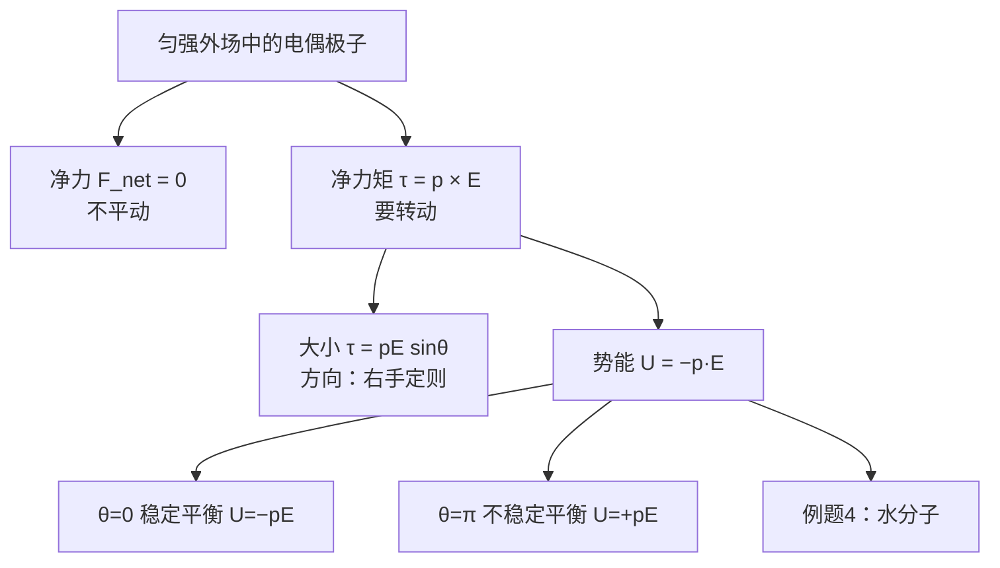
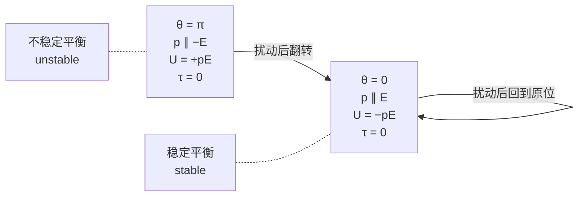

# C22.7 电场中的电偶极子 A Dipole in an Electric Field

## 本节结构总览

## 1 学习目标 Learning objectives（课件原文）

- **01** 在外电场中电偶极子的示意图上，标出**场的方向**、**偶极矩的方向**、以及**这些力使偶极子转动的方向**。
- **02** 通过计算**偶极矩矢量与电场矢量的叉乘 (cross product)**，求外电场对电偶极子的**力矩 (torque)**。
- **03** 把外电场中电偶极子的**势能**与偶极子转动时**力矩做的功**联系起来。
- **04** 通过**偶极矩矢量与电场矢量的点乘 (dot product)** 计算势能。

## 2 净力为零

![[C22-电偶极子在匀强电场中的力矩.png]]

> [!important] 净力 Net force
> $$\vec F_{net}=q\vec E+(-q)\vec E=0$$
> 匀强电场中，电偶极子的**净力为零，不会平动**。

> [!warning] "净力为零"只在**匀强场**中成立
> 若电场**非均匀**，$+q$ 和 $-q$ 所在处的 $\vec E$ 不同，两个力不再抵消，偶极子会受到净力：
> $$\vec F_{net}=(\vec p\cdot\nabla)\vec E$$
> 净力指向**场强增大的方向**（对 $\vec p$ 已与 $\vec E$ 对齐的偶极子而言）。
> **这就是 [[C21.2 导体与绝缘体]] 里"带电体吸引中性碎纸屑"的完整解释**：带电体先把纸屑极化成偶极子（$\vec p$ 与 $\vec E$ 同向），带电体附近场强大，纸屑就被拉向场强大的地方，即被吸引。**均匀场吸不动纸屑**——这一点课件完全没提，但是理解静电吸引的关键。

## 3 (1) 力矩 Torque 力矩

> [!important] 推导（课件原式）
> 对质心（或**任意一点** any point）的净力矩：
> $$\vec\tau=\vec r_+\times q\vec E+\vec r_-\times(-q\vec E)=q(\vec r_+-\vec r_-)\times\vec E=q\vec d\times\vec E$$
> $$\boxed{\vec\tau=\vec p\times\vec E}$$
> **大小 Magnitude**：$\tau=pE\sin\theta$
> **方向 Direction**：**右手定则 right-hand rule**（图 (b) 中 $\vec\tau$ 用 $\otimes$ 表示垂直纸面向里）

> [!note] "对任意一点"这句话为什么重要——课件用红字标了但没解释
> 一般来说力矩依赖于参考点的选择。但**当净力为零时，力矩与参考点无关**：
> 换一个参考点 $O'$，$\vec r_i'=\vec r_i-\vec R$，则
> $$\vec\tau'=\sum\vec r_i'\times\vec F_i=\sum\vec r_i\times\vec F_i-\vec R\times\sum\vec F_i=\vec\tau-\vec R\times\vec F_{net}=\vec\tau$$
> （因为 $\vec F_{net}=0$。）
> 这种"净力为零、净力矩不为零"的力系叫**力偶 (couple)**，它的力矩是**纯转动效应**，跟你选哪个点当支点无关。**所以偶极子在匀强场中只转不移。**

> [!note] $\vec r_+-\vec r_-=\vec d$ 的方向要对
> $\vec r_+$ 是 $+q$ 的位矢，$\vec r_-$ 是 $-q$ 的位矢，$\vec r_+-\vec r_-$ 正是**由 $-q$ 指向 $+q$** 的矢量，与 [[C22.3 电偶极子的电场]] 中 $\vec p=q\vec d$ 的方向约定完全一致。**推导本身验证了那个约定的自洽性。**

> [!important] 力矩的转动趋势
> $\tau=pE\sin\theta$：
> - $\theta=0$（$\vec p$ 与 $\vec E$ 同向）：$\tau=0$
> - $\theta=90^\circ$：$\tau=pE$ **最大**
> - $\theta=180^\circ$（反向）：$\tau=0$
>
> 力矩总是**把 $\vec p$ 转向与 $\vec E$ 对齐**的方向。

## 4 (2) 势能 Potential energy 势能

> [!important] 推导（课件原式）
> $$\Delta U=-W$$
> $$U(\theta)=-\int\tau\,d\theta=\int pE\sin\theta\,d\theta=-pE\cos\theta+U_0$$
> 令 $U\left(\dfrac{\pi}{2}\right)=0\ \Rightarrow\ U_0=0$
> $$\boxed{U(\theta)=-\vec p\cdot\vec E}$$

> [!note] 那两个负号是怎么回事——课件写得很跳，这里理清
> 力矩 $\tau=pE\sin\theta$ 的作用是**减小** $\theta$（把 $\vec p$ 转向 $\vec E$），所以它相对于"$\theta$ 增大"这个方向是**恢复性**的，做的功为
> $$W=\int\tau_\theta\,d\theta=\int(-pE\sin\theta)\,d\theta$$
> 于是
> $$U=-W=\int pE\sin\theta\,d\theta=-pE\cos\theta+U_0$$
> 取 $\theta=\pi/2$ 时 $U=0$（$\cos90^\circ=0$，正好给 $U_0=0$，这是选零点的方便之处），得
> $$U(\theta)=-pE\cos\theta=-\vec p\cdot\vec E$$
> **零点选在 $\theta=90^\circ$ 而不是 $\theta=0$，是这个漂亮点乘形式的来源。**

> [!important] 两个平衡位置
> $$U(\theta=0)=-pE\quad\textbf{最小 minimum}$$
> $$U(\theta=\pi)=+pE\quad\textbf{最大 maximum}$$

> [!warning] $\tau=0$ 的两个位置，一个稳定一个不稳定——必考
> $\theta=0$ 和 $\theta=\pi$ 力矩都为零，都是平衡位置，但性质相反：
> - $\theta=0$：势能**极小** → **稳定平衡**。稍微偏离，力矩把它推回来。
> - $\theta=\pi$：势能**极大** → **不稳定平衡**。稍微偏离，力矩把它推得更远，最终翻转到 $\theta=0$。
> 类比：单摆的最低点 vs 最高点。
>
> **从 $\theta=0$ 翻到 $\theta=\pi$ 需要外界做功** $W_{ext}=\Delta U=pE-(-pE)=2pE$。

> [!note] 小角度振动——课件没讲但很自然的延伸
> 在 $\theta=0$ 附近，$\tau\approx-pE\theta$，这是标准的线性回复力矩，转动惯量为 $I$ 的偶极子会做**简谐振动**：
> $$\omega=\sqrt{\frac{pE}{I}}$$
> 分子在外场中的转动就是这个模型；微波炉加热水就是让水分子的偶极矩不断跟随交变电场翻转，摩擦生热。

### 例题 4 Example 4（课件原题）

> [!example] 题目
> 一个水分子的电偶极矩为 $p=6.2\times10^{-30}\ \mathrm{C\cdot m}$。
> **(a)** 该分子正负电荷中心相距多远？
> **(b)** 若把 H₂O 分子放入 $E=1.5\times10^4\ \mathrm{N/C}$ 的外场中，场能施加的**最大力矩**是多少？
> **(c)** 外界要把一个水分子从 $\theta=0^\circ$ 转到 $\theta=180^\circ$，必须做多少功？

课件配图：水分子模型，中间大红球是氧（Oxygen，Negative side 负端），两侧小球是氢（Hydrogen，Positive side 正端），键角 $105^\circ$，$\vec p$ 沿角平分线由氧指向两氢中间。
![[6e6f45ee09d83b13cb61c3f3c04a3fc2.png]]
**(a) 解**

> [!important] 关键一步：$q$ 取多少
> **H₂O 有 10 个质子，所以 $q=10e$。**
> $$d=\frac pq=\frac{6.2\times10^{-30}\ \mathrm{C\cdot m}}{10\times1.6\times10^{-19}\ \mathrm C}=3.9\times10^{-12}\ \mathrm m$$

> [!note] 为什么用 $10e$ 而不是 $2e$ 或别的——这一步最容易做错
> 偶极矩定义为 $p=qd$，其中 $q$ 是**"正电荷中心"处等效集中的全部正电荷**。水分子有 8 个质子（O）+ 1 + 1（两个 H）= **10 个质子**，所以全部正电荷是 $+10e$；对应地全部负电荷（10 个电子）是 $-10e$。
> $d$ 则是这两个**电荷中心**之间的距离——不是 O–H 键长（约 $96\ \mathrm{pm}=9.6\times10^{-11}$ m）。
> 结果 $d=3.9\times10^{-12}\ \mathrm m=3.9\ \mathrm{pm}$，只有键长的 4%。**这说明水分子的正负电荷中心只错开了一点点**，但因为涉及 10 个元电荷，偶极矩已经足够大，使水成为强极性溶剂。

**(b) 解**

$$\tau_{max}=pE=(6.2\times10^{-30}\ \mathrm{C\cdot m})(1.5\times10^{4}\ \mathrm{N/C})=9.3\times10^{-26}\ \mathrm{N\cdot m}$$

> [!note] 为什么"最大"力矩就是 $pE$
> $\tau=pE\sin\theta$，$\sin\theta$ 最大为 1（$\theta=90^\circ$），故 $\tau_{max}=pE$。**题目问 "maximum torque" 就是在提示取 $\theta=90^\circ$。**

**(c) 解**

$$W=2pE=2\times9.3\times10^{-26}=1.9\times10^{-25}\ \mathrm J$$

> [!note] 补上推理
> $$W_{ext}=\Delta U=U(180^\circ)-U(0^\circ)=(+pE)-(-pE)=2pE$$
> 数值：$2\times6.2\times10^{-30}\times1.5\times10^4=1.86\times10^{-25}\approx1.9\times10^{-25}\ \mathrm J$ ✓

> [!warning] 把这个能量与热运动比一比——课件没做，但这是这道题真正的物理意义
> 室温热运动能量尺度 $kT=1.38\times10^{-23}\times300=4.1\times10^{-21}\ \mathrm J$。
> $$\frac{W}{kT}=\frac{1.9\times10^{-25}}{4.1\times10^{-21}}\approx4.6\times10^{-5}$$
> **翻转一个水分子所需的功比热运动能量小 4 个数量级！** 也就是说在这样的场里，水分子根本排不整齐——热运动一下就把它撞乱了。要让极性分子显著取向，要么场强大得多，要么温度低得多。这正是**电介质极化的统计力学**（朗之万函数）要处理的问题，Ch25 会用到定性结论。

---

## 本节自测 Self-Test

> [!question] 1. 匀强场中偶极子的净力和净力矩分别是多少？
> 净力 $\vec F_{net}=0$（不平动）；净力矩 $\vec\tau=\vec p\times\vec E$，大小 $pE\sin\theta$，方向由右手定则。

> [!question] 2. 为什么说这个力矩"对任意一点"都相同？
> 净力为零的力系（力偶）的力矩与参考点无关：换参考点多出的项是 $-\vec R\times\vec F_{net}=0$。

> [!question] 3. 偶极子在非均匀场中会受净力吗？这与什么现象有关？
> 会，净力指向场强增大的方向。这就是带电体能吸引中性纸屑/水流的原因——均匀场吸不动。

> [!question] 4. 写出偶极子的势能公式，说明零点取在哪里。
> $U=-\vec p\cdot\vec E=-pE\cos\theta$，零点取在 $\theta=90°$。

> [!question] 5. $\theta=0$ 与 $\theta=\pi$ 都是 $\tau=0$，两者有何区别？翻转需要多少功？
> $\theta=0$ 是势能极小、稳定平衡；$\theta=\pi$ 是势能极大、不稳定平衡。翻转需外界做功 $2pE$。

> [!question] 6. 例题 4(a) 中 $q$ 为什么取 $10e$？算出的 $d$ 是不是 O–H 键长？
> H₂O 有 10 个质子，正电荷中心等效电荷为 $+10e$。$d=3.9$ pm 是正负电荷中心的间距，远小于 O–H 键长（约 96 pm）。

> [!question] 7. 把例题 4(c) 的 $W$ 与室温 $kT$ 比较，说明什么？
> $W/kT\approx5\times10^{-5}$，远小于热运动能量，所以该场强下水分子无法被有效排齐——极化需要统计处理。

---

上一节 ← [[C22.6 电场中的点电荷]] ｜ 下一章 → 第 23 章 高斯定律 Gauss' Law
索引 → [[电磁学 MOC]]
