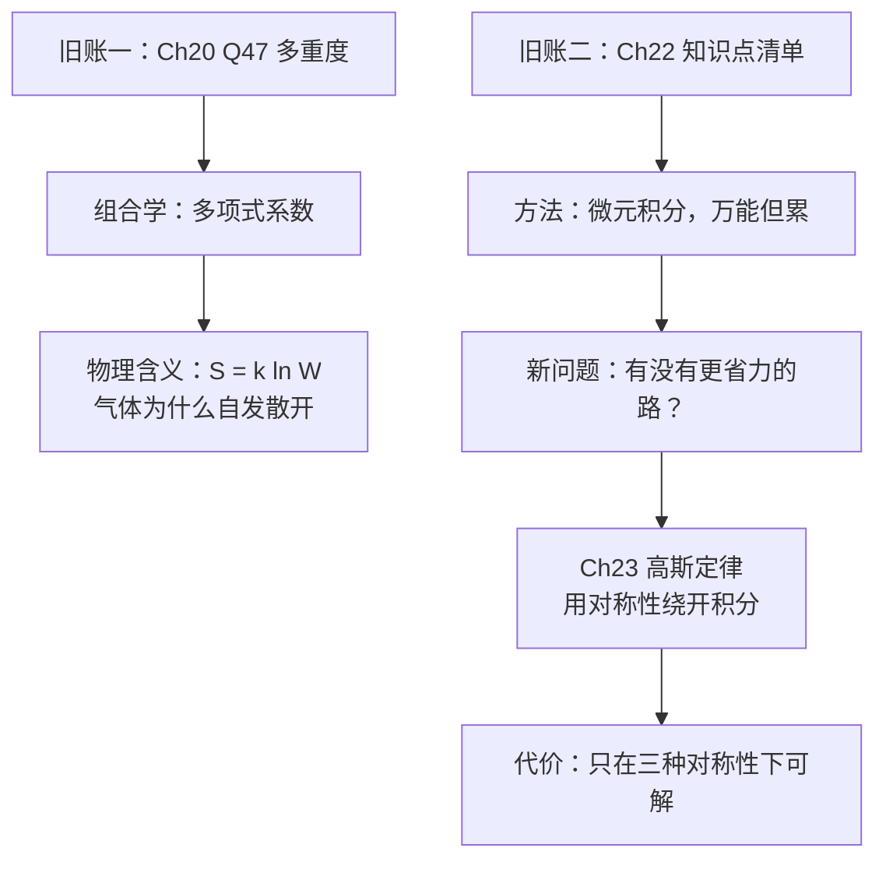

# C23.0 开篇回顾——第20章遗留习题与第22章要点

> [!abstract] 这一讲的任务
> 进入高斯定律之前，先清两笔旧账：第 20 章那道**多重度**的题（它其实在回答"气体为什么会自己散开"这个问题），以及第 22 章的知识点清单。
> 然后我们要正面回答一个问题：**第 22 章那套微元积分法明明是万能的，为什么还要再学一套新方法？**

> [!info] 怎么读这份讲义
> 第 0–1 节是统计物理的收尾，与电磁学无关但值得读完——那道题的物理含义课件没讲，而它是熵增原理最干净的一次演示。第 2–3 节才是接进第 23 章的部分。
> 标有 **（拓展）** 或 **【拓展】** 的内容，是**课堂上没有讲到、由课件和教材延伸补充**的部分。复习时可先掌握未标注的主干内容，行有余力再看拓展部分。

---

## 0. 开场：香水瓶为什么不会自己把香味收回去

打开一瓶香水，放在房间角落。十分钟后整个房间都是香味。

现在等着看它自己收回瓶子里——你可以等一辈子。

> [!question] 停一下，先自己想想
> 是什么力**推着**香水分子往外跑？
> 其实没有。分子之间的作用力和墙壁的碰撞都是对称的，**没有任何一条力学定律禁止全部分子同时回到瓶口那一小块区域**。牛顿方程对时间反演是对称的。
> 那它为什么就是不回去？

答案不在力学里，在**数数**里：**"散开"对应的微观状态数，比"聚在一角"多得不成比例。** 下面这道第 20 章的遗留题，就是把这个"多得不成比例"**算出来**。

---

## 1. 第 20 章 Question 47 讲评（分子分布的多重度）

> [!example] 原题
> A box contains $N$ gas molecules. Consider the box to be divided into **three equal parts**.
> (a) By extension of Eq. 20-20, write a formula for the **multiplicity** of any given configuration.
> (b) Consider two configurations: configuration $A$ with equal numbers of molecules in all **three thirds** of the box, and configuration $B$ with equal numbers of molecules in each **half** of the box divided into two equal parts. What is the ratio $W_A/W_B$?
> (c) Evaluate $W_A/W_B$ for $N=100$.（因为 100 不能被 3 整除，配置 A 中一份放 34 个，另两份各放 33 个。）

**(a) 任意分布的多重度**

$$W=C_N^{n_1}\cdot C_{N-n_1}^{n_2}=\frac{N!}{n_1!(N-n_1)!}\cdot\frac{(N-n_1)!}{n_2!\,n_3!}=\frac{N!}{n_1!\,n_2!\,n_3!}$$

其中 $N=n_1+n_2+n_3$。

> [!note] 这一步的组合学逻辑（课件只给公式）
> 先从 $N$ 个分子里选 $n_1$ 个放进第一格：$C_N^{n_1}$ 种；再从剩下的 $N-n_1$ 个里选 $n_2$ 个放进第二格：$C_{N-n_1}^{n_2}$ 种；剩下的 $n_3$ 个自动进第三格（只有 1 种）。相乘并约掉 $(N-n_1)!$ 即得。
> **这是"多项式系数"**，可以直接推广到 $k$ 格：$W=\dfrac{N!}{n_1!n_2!\cdots n_k!}$。

**(b) 两种配置之比**

$$W_A=\frac{N!}{\dfrac N3!\ \dfrac N3!\ \dfrac N3!},\qquad W_B=\frac{N!}{\dfrac N2!\ \dfrac N2!\ 0!}$$

$$\frac{W_A}{W_B}=\frac{\dfrac N2!\ \dfrac N2!}{\dfrac N3!\ \dfrac N3!\ \dfrac N3!}$$

> [!warning] $W_B$ 里那个 $0!$ 是关键
> 配置 B 是"盒子只分两半"，等价于在三格模型里让**第三格空着**（$n_3=0$）。$0!=1$，所以形式上仍可用同一个公式。**这个技巧是本题的设计点**：把两种不同的分割方式放到同一个公式框架下才能比较。

**(c) $N=100$**

$$\frac{W_A}{W_B}=\frac{50!\,50!}{34!\,33!\,33!}=4.2\times10^{16}$$

> [!question] 停一下，我们刚才干了什么
> 这个数字说明了什么？课件到此为止，但它才是整道题的意义所在。
>
> $W_A/W_B\approx4\times10^{16}$，即"三格均分"的微观状态数比"两半均分"多 **16 个数量级**。
> 结合 [[C21.0 开篇回顾 热学遗留]] 的玻尔兹曼熵公式 $S=k\ln W$：
> $$\Delta S=k\ln\frac{W_A}{W_B}=1.38\times10^{-23}\times\ln(4.2\times10^{16})=1.38\times10^{-23}\times38.3=5.3\times10^{-22}\ \mathrm{J/K}$$
> **分得越细、越均匀，多重度越大、熵越高。** 这正是"气体自发充满整个容器"、"熵增加原理"的组合学根源：**不是有什么力推着分子散开，而是散开的微观状态数压倒性地多。**
>
> 回到开场那瓶香水：$N$ 才 100 就差了 $10^{16}$ 倍；真实空气里 $N\sim10^{23}$，差距是天文数字的天文次方。所以"自发收回瓶子"不是被禁止，只是概率小到等不到。

---

## 2. 第 22 章知识点清单（Review 页原样）

课件用一页把上一章全部列出，右侧配公式：

- **电场 (electric field)，矢量场 (Vector field)**
  $$\vec E=\frac{\vec F}{q_0}=\frac{1}{4\pi\varepsilon_0}\frac{q}{r^2}\hat r$$
- **电场线 (electric field lines)，电场方向 (direction)，电场强度 (magnitude)**
- **点电荷电场 (electric field due to a point charge)**
- **电偶极子 (electric dipole)，电偶极矩 (electric dipole moment)，偶极轴上的电场 / 偶极中垂线上的电场**
  $$\vec E_{\text{轴}}=\frac{1}{2\pi\varepsilon_0}\frac{p}{z^3},\qquad \vec E_{\text{中垂}}=-\frac{1}{4\pi\varepsilon_0}\frac{p}{x^3}$$
- **线电荷电场 (electric field due to a line of charge)**：$dq=\lambda\,ds$
- **面电荷电场 (electric field due to a plane of charge)**：$dq=\sigma\,dA$
- **电场中的点电荷 (a point charge in an electric field)**
- **电场中的电偶极子 (a dipole in an electric field)**
  $$\vec\tau=\vec p\times\vec E$$

对应笔记：[[C22.1 电场]]、[[C22.2 点电荷的电场]]、[[C22.3 电偶极子的电场]]、[[C22.4 线电荷的电场]]、[[C22.5 带电圆盘的电场]]、[[C22.6 电场中的点电荷]]、[[C22.7 电场中的电偶极子]]

---

## 3. 为什么还要再学一套方法

> [!question] 停一下，先自己想想
> 第 22 章的微元积分法**是万能的**：任何电荷分布都能切成微元、逐个求 $d\vec E$、矢量积分。既然万能，为什么还要学新的？
>
> 回想你实际做过的题：圆环轴线上，要论证横向分量抵消；圆盘轴线上，要凑微分换元；**而"圆盘不在轴线上那一点的场"，第 22 章根本没算，也算不出来**。万能是理论上的万能，实际能算出闭式解的只有那么几个位置。

> [!important] 从第 22 章到第 23 章的方法转折
> 第 22 章的方法是**"硬算"**：把电荷切成微元、逐个求 $d\vec E$、矢量积分。优点是**万能**（任何分布都能算），缺点是**累**（圆盘已经要凑微分，非轴线上根本算不出）。
> 第 23 章要引入**高斯定律**：只要电荷分布有**足够高的对称性**（球对称、柱对称、面对称），就能绕开积分，**三行算出场**。
> **代价是它只在对称情形好用**——对称性不够时，高斯定律仍然正确，但解不出 $E$。两套方法互补，不是替代关系。

> [!note] 一句话预告这套新方法的思路（拓展）
> 微元积分是**局部求和**：把每一份电荷的贡献加起来。
> 高斯定律是**整体记账**：不管内部怎么分布，只数"有多少电场线穿出了这个袋子"。
> 从"求和"换成"守恒"，正是本章省力的全部秘密。

---

## 这一讲的三句话

1. **$N$ 个分子分入 $k$ 格的多重度 $W=\dfrac{N!}{n_1!\cdots n_k!}$**（多项式系数）；$W_B$ 里用 $0!=1$ 把"两半"塞进三格公式才好比较。
2. **$W_A/W_B\approx4\times10^{16}$**（$N=100$）：分得越细越均匀，多重度越大、熵越高（$S=k\ln W$）。气体自发扩散不是被力推的，是被**数量**碾压的。
3. **Ch22 微元积分万能但累，Ch23 高斯定律省力但挑对称性**；两者互补。

> [!abstract] 下一讲预告
> 要"数有多少电场线穿出袋子"，得先把"多少"定义清楚：**穿过一个面的场，到底怎么量？**
> 下一讲从一个和电磁学毫无关系的问题开始——**一分钟有多少雨水落进你的水桶**。你会发现，答案的形式就是本章后面所有推导的骨架。

---

## 本节自测 Self-Test

> [!question] 1. $N$ 个分子分入 $k$ 格的多重度公式是什么？

> [!success]- 参考答案
> $W=\dfrac{N!}{n_1!n_2!\cdots n_k!}$（多项式系数）。来源：依次做组合选择 $C_N^{n_1}C_{N-n_1}^{n_2}\cdots$，中间阶乘逐层约掉。

> [!question] 2. $W_B$ 表达式里为什么出现 $0!$？

> [!success]- 参考答案
> 因为"分成两半"相当于三格模型中第三格为空（$n_3=0$），$0!=1$，从而能用同一公式比较。

> [!question] 3. $W_A/W_B\approx4\times10^{16}$ 的物理含义？

> [!success]- 参考答案
> 分得越细越均匀，微观状态数越大、熵越高（$S=k\ln W$）；这是气体自发扩散、熵增原理的组合学根源。对应 $\Delta S=k\ln(4.2\times10^{16})=5.3\times10^{-22}\ \mathrm{J/K}$。

> [!question] 4. 第 22 章与第 23 章求电场的方法有何不同？各自的适用范围？

> [!success]- 参考答案
> Ch22 用微元积分，万能但繁琐（非轴线位置常算不出闭式解）；Ch23 用高斯定律，在球/柱/面对称时可绕开积分，但对称性不足时解不出 $E$（定律本身仍成立）。

---

下一节 → [[C23.1 电通量]]
索引 → [[电磁学 MOC]]
