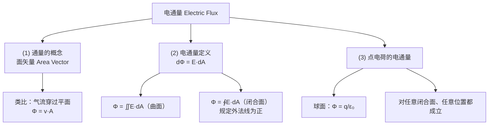
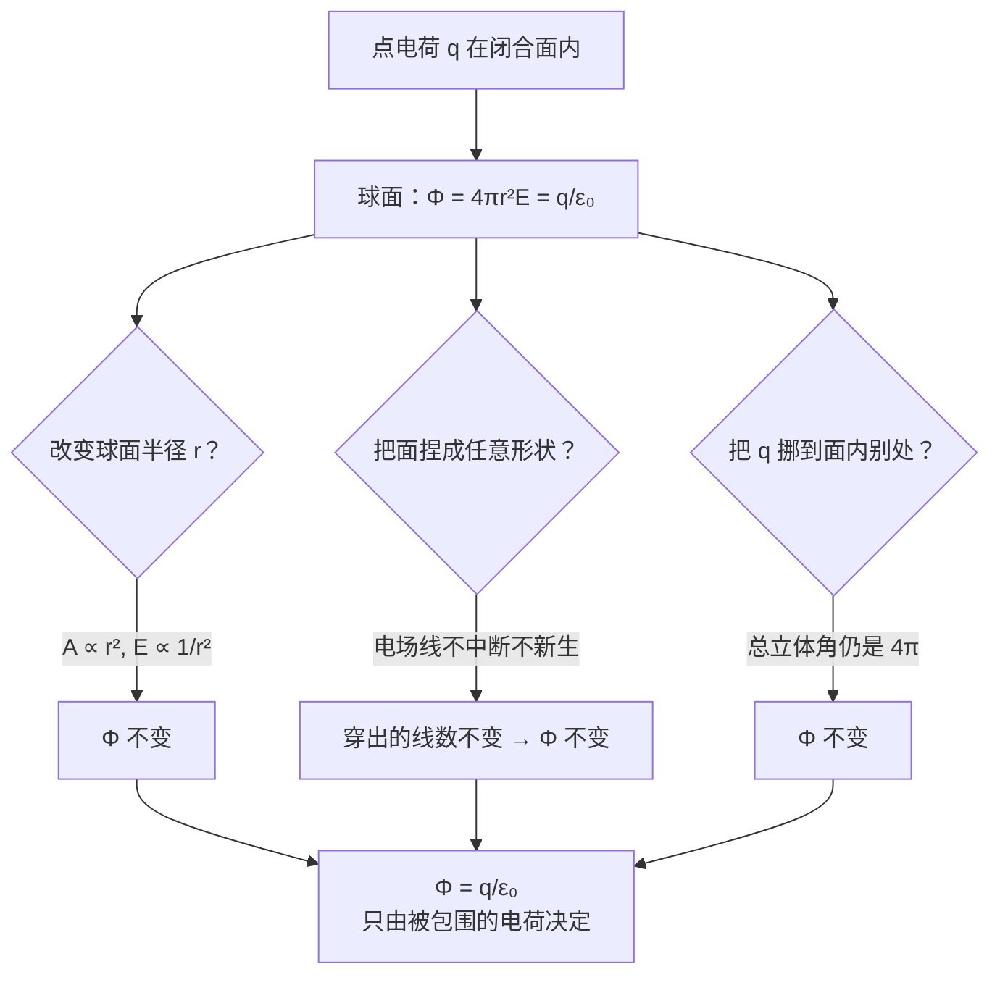

# C23.1 电通量 Electric Flux

## 本章导航

第 23 章共四节：

1. Electric Flux 电通量 → 本篇
2. Gauss' Law 高斯定理 → [[C23.2 高斯定律]]
3. Electric Field of a Charged **Conductor** 带电导体的电场 → [[C23.3 带电导体的电场]]
4. Electric Field of a Charged **Insulator** with Symmetry 对称带电绝缘体的电场 → [[C23.4 对称带电绝缘体的电场]]

> [!important] 课后作业（课件原文）
> **Problems: 16, 21, 32, 40, 43, 48, 53, 55**

**Keywords（课件列出）**

- Gauss' Law, Gaussian Surface, Gaussian Sphere
- Electric Flux, Total Flux, Net Flux
- Area Vector, Closed Surface
- Electrostatic Equilibrium
- Conduction Surface
- Infinite Nonconducting Sheet

## What is Physics（本章总纲）

> [!important] 课件原文
> - **对称性 (Symmetry)：提供了简单求解电场的工具。**
> - **高斯定律 (Gauss' Law)：电荷与电场之间的关系。**
> - **已知电荷 → 求某点的电场**（Know Charge → Find the Electric Field at some point）
> - **已知电场 → 求闭合面内包围的电荷**（Know Electric Field → Find the Charge enclosed by the surface）

课件配了高斯（Carl Friedrich Gauss）的画像，以及一张示意图：点电荷 $q$ 发出的电场线穿过一个不规则闭合曲面 $S$，图上标了两个面元 $dA_1$、$dA_2$。

> [!note] 高斯定律的"双向"用法是它最实用的一点
> 大多数定律只能单向用。高斯定律两个方向都好用：
> - **正向**（已知电荷求场）：本章第 3、4 节的全部内容。
> - **反向**（已知场求电荷）：比如测出某闭合面上的场分布，就能算出里面包了多少电荷——**不需要打开它**。这是 CT、地质勘探、非接触电荷测量的原理雏形。

## 本节结构总览

## 1 学习目标 Learning objectives（课件原文）

- **01** 认识到**穿透一个曲面的电场的多少**就是穿过该面的**电通量 (electric flux)**。
- **02** 认识到平面的**面矢量 (area vector 面矢量)** 是一个**垂直于该面**、**大小等于该面面积**的矢量。（**Direction + Magnitude**）
- **03** 通过对**电场矢量与面矢量的点乘 (dot product 点乘)** 在曲面上积分，计算穿过该面的通量。
- **04** 通过积分计算穿过**闭合面 (closed surface)** 的净通量，**含代数符号**。

## 2 (1) 通量 Flux 通量

> [!important] 面矢量 Area Vector
> **平面的面矢量：大小等于该图形的面积 (area of the figure)，方向为该图形所在平面的法线方向 (perpendicular to the plane)。**

![[C23-通量的类比气流穿过平面.png]]

> [!important] 通量的类比：均匀气流穿过一个正方形
> - **(a)** 气流垂直穿过平面：$\Phi=vA$
> - **(b)(c)** 气流速度与平面法线成 $\theta$ 角，则**体流速 (volume flow rate 体流速，单位时间穿过平面的体积)** 为
> $$\Phi=(v\cos\theta)A$$
> - 用**矢量标记 (vector notation 矢量标记)**，$\vec A$ 的方向取平面法线：
> $$\boxed{\Phi=\vec v\cdot\vec A}$$
> - **(d)** 气流与平面平行（$\theta=90^\circ$）：$\Phi=0$，没有气体穿过。

> [!note] 为什么"通量"要用点乘——直观理解
> 通量问的是"**有多少东西真正穿过去了**"。斜着吹的风，只有**垂直于平面的那个分量** $v\cos\theta$ 在往里送气；平行于平面的分量只是擦着面滑过，一点也没穿过去。点乘 $\vec v\cdot\vec A=vA\cos\theta$ 正是自动取出垂直分量的运算。
> 换个角度看也一样：把 $\cos\theta$ 归到面上，$A\cos\theta$ 就是平面在**垂直于气流方向上的投影面积**（"迎风面积"）。两种读法等价，考试时哪个顺手用哪个。

> [!warning] 面矢量的方向有两个候选，怎么定？
> 一个平面有**两侧**，法线可以朝任一侧，所以 $\vec A$ 的方向本身是**有歧义**的。
> - 对**开曲面**（一块平面、半球面）：方向要**人为规定**，题目会给或自己设，结果的**正负跟着这个规定走**。
> - 对**闭合曲面**：有一个自然的、无歧义的规定——**外法线为正**（outward is positive）。这是全世界统一的约定，也是高斯定律能写出符号的前提。

## 3 (2) 电通量 Electric flux 电通量

> [!important] 定义
> 电场穿过一个面元的通量：
> $$\boxed{d\Phi=\vec E\cdot d\vec A}$$
> $d\Phi$ 可以是**正、负或零**，取决于**两个矢量的方向**（direction of the vectors）。
>
> 穿过一个曲面的通量：
> $$\Phi=\iint\vec E\cdot d\vec A$$
>
> 对**闭合曲面**，规定**向外为正**（outward is positive）：
> $$\boxed{\Phi=\oint\vec E\cdot d\vec A}$$

![[C23-高斯面上通量的正负零.png]]

课件右图是一个不规则的**高斯面 (Gaussian surface)** 置于均匀场中，标出三个面元：

| 面元 | $\vec E$ 与 $\Delta\vec A$ 的夹角 | 通量 |
|---|---|---|
| **1**（迎着场的一侧） | $\theta>90^\circ$（钝角） | $\Phi<0$，场**流入** |
| **2**（侧面） | $\theta=90^\circ$ | $\Phi=0$，场**擦过** |
| **3**（背着场的一侧） | $\theta<90^\circ$（锐角） | $\Phi>0$，场**流出** |

> [!important] 通量的符号含义
> $$\Phi>0\ \Leftrightarrow\ \text{净流出}\qquad \Phi<0\ \Leftrightarrow\ \text{净流入}\qquad\Phi=0\ \Leftrightarrow\ \text{进出相等}$$

> [!note] 单位与"电场线条数"的对应
> $$[\Phi]=\mathrm{N\cdot m^2/C}=\mathrm{V\cdot m}$$
> 回到 [[C22.1 电场]] 的电场线图像：既然线密度 $\propto E$、面积是 $A$，那么 $EA$ 正比于**穿过该面的电场线条数**。所以：
> $$\Phi\ \propto\ \text{净穿出闭合面的电场线条数}$$
> **这个图像贯穿整章**，遇到概念题（"通量是增大还是减小"）时先用它定性判断，比列积分快得多。

### 例：均匀场中的圆柱形闭合面（净通量为零）

![[C23-圆柱面在匀强场中净通量为零.png]]

把一个圆柱面轴向平行地放在均匀电场中，分成三部分：左底 $a$、侧面 $b$、右底 $c$。

$$\Phi=\oint\vec E\cdot d\vec A=\int_a\vec E\cdot d\vec A+\int_b\vec E\cdot d\vec A+\int_c\vec E\cdot d\vec A$$

$$\int_a\vec E\cdot d\vec A=\int_a E(\cos180^\circ)dA=-EA$$
$$\int_b\vec E\cdot d\vec A=\int_b E(\cos90^\circ)dA=0$$
$$\int_c\vec E\cdot d\vec A=\int_c E(\cos0^\circ)dA=+EA$$

> [!important] 结论
> $$\Phi=\oint\vec E\cdot d\vec A=-EA+0+EA=0$$

> [!note] 这个例子在为下一节铺垫
> 均匀场里没有电荷（场线不起不止），闭合面内也就没有电荷，**净通量恰好为零**。
> "**进去多少线，就出来多少线**" —— 这正是 [[C23.2 高斯定律]] 中 $q_{enc}=0\Rightarrow\Phi=0$ 的具体演示。课件把这个例子放在高斯定律之前，是有意让你先形成直觉。

> [!warning] 三个面的法线方向别搞混
> 左底 $a$ 的外法线朝**左**（$-x$），与朝右的 $\vec E$ 成 $180^\circ$，故 $\cos180^\circ=-1$；右底 $c$ 的外法线朝**右**，$\cos0^\circ=+1$。
> **闭合面的"外法线"是各处都向外的**，不是统一朝一个方向。这是初学最容易错的地方。

## 4 (3) 点电荷产生的电通量

![[C23-点电荷穿过任意闭合面的通量.png]]

> [!important] 以点电荷为球心的球形闭合面
> 球面上处处 $\vec E\parallel d\vec A$（都沿径向向外），且 $E$ 处处相同，所以
> $$\Phi=\oint\vec E\cdot d\vec A=EA=4\pi r^2E$$
> 代入点电荷场强 $E=\dfrac{1}{4\pi\varepsilon_0}\dfrac{q}{r^2}$：
> $$\Phi=4\pi r^2\cdot\frac{1}{4\pi\varepsilon_0}\frac{q}{r^2}=\boxed{\frac{q}{\varepsilon_0}}$$

> [!important] 课件的关键补充
> **它对任何包围电荷 $q$ 的闭合曲面、以及 $q$ 在面内的任何位置都成立。**
> （It holds for **any closed surface** that encloses the charge $q$ and for **any location of $q$ inside** $A$.）
>
> 课件用三幅图说明：正球形面、被压扁的灰色面、椭圆形面——**形状随便变，通量都是 $q/\varepsilon_0$**。

> [!note] 为什么形状和位置都无所谓——两个必须想清楚的理由
> **① 与 $r$ 无关**：$\Phi=4\pi r^2E$ 里，球面积按 $r^2$ 增长，$E$ 按 $1/r^2$ 衰减，**恰好抵消**。所以球取多大都一样。
> 这再一次是**平方反比律**的功劳——与 [[C21.3 库仑定律]] 壳层定理、[[C22.2 点电荷的电场]] 线密度论证是同一件事的三次出场。
> **② 与形状无关**：用电场线图像最好懂。从点电荷发出的电场线**在无电荷处不中断、不产生**，所以不管你套一个什么形状的闭合袋子，**从袋子里穿出去的线条总数都等于电荷发出的总条数**。把球面的一块往外推，那块面积变大但 $E$ 变小，通量不变；把它捏成褶皱，线穿进又穿出，正负抵消。
> **③ 与位置无关**：电荷偏心放置时，近的一侧 $E$ 大但对应立体角内面积小，远的一侧反之，总账仍是全部立体角 $4\pi$。

> [!important] 本节的落点
> $\Phi$ **只由闭合面内的电荷决定**，与面的形状、大小，与电荷在面内的位置，都无关。
> **把这句话写成方程，就是下一节的高斯定律。**

---

## 本节自测 Self-Test

> [!question] 1. 面矢量的大小和方向如何规定？闭合面上如何消除方向的歧义？
> 大小 = 面积，方向 = 该面法线方向。闭合面统一规定**外法线为正**。

> [!question] 2. 为什么通量要用点乘定义？
> 只有垂直于面的场分量才真正"穿过"该面；点乘 $EA\cos\theta$ 自动取出该分量（等价地，$A\cos\theta$ 是投影面积）。

> [!question] 3. 通量的正、负、零分别对应什么？
> 正 = 净流出，负 = 净流入，零 = 进出相等（或场与面平行）。

> [!question] 4. 均匀场中放一个闭合圆柱面，净通量是多少？分三部分写出。
> $-EA+0+EA=0$。左底 $\cos180°$、侧面 $\cos90°$、右底 $\cos0°$。

> [!question] 5. 以点电荷为中心的球面上，通量是多少？为什么与半径无关？
> $\Phi=q/\varepsilon_0$。因为球面积 $\propto r^2$ 与 $E\propto1/r^2$ 恰好抵消（平方反比律）。

> [!question] 6. 为什么闭合面的形状、以及电荷在面内的位置都不影响通量？
> 电场线在无电荷处不中断也不新生，穿出闭合面的线条总数只由内部电荷决定；改变形状或位置只是重新分配线条，总数不变。

---

上一节 ← [[C23.0 开篇回顾 统计物理遗留]] ｜ 下一节 → [[C23.2 高斯定律]]
索引 → [[电磁学 MOC]]
