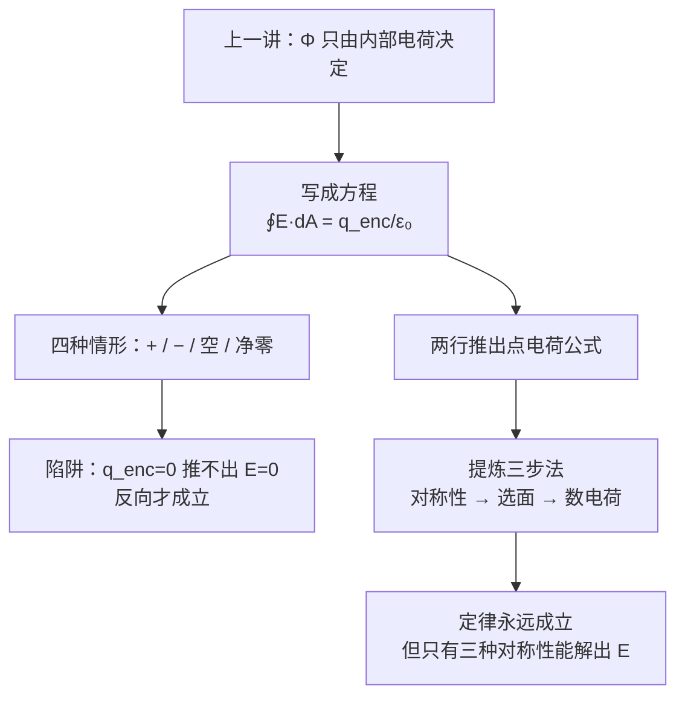
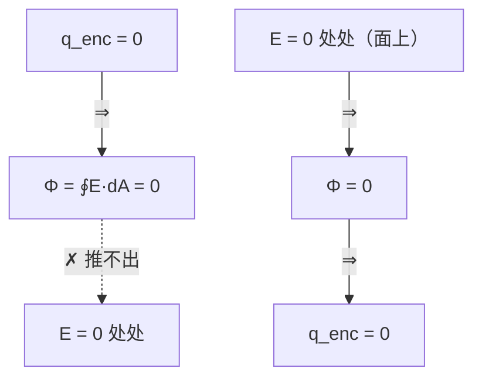

# C23.2 高斯定律 Gauss' Law 高斯定理

> [!abstract] 这一讲的任务
> 上一讲的落点是一句话：**通量只由闭合面内的电荷决定**。这一讲把这句话写成方程——那就是**高斯定律**。
> 然后马上用它**两行**推出点电荷的场强公式（第 21 章用两页积分得到的那个），并提炼出后面所有题目的**三步法**。最后要拆掉一个几乎每次考试都出现的陷阱：**$q_{enc}=0$ 到底能不能推出 $\vec E=0$？**

> [!info] 怎么读这份讲义
> 第 1 节的四色图要能逐格讲出来。第 2 节那个"推得出 / 推不出"的方向性是全章最常考的概念点。第 3 节的三步法是后面两讲的操作手册。
> 标有 **（拓展）** 或 **【拓展】** 的内容，是**课堂上没有讲到、由课件和教材延伸补充**的部分。复习时可先掌握未标注的主干内容，行有余力再看拓展部分。

---

## 0. 开场：不打开箱子，能不能知道里面有多少电荷

给你一个封好的箱子，说里面装了若干带电小球，让你说出**里面的净电荷是多少**。不许打开，不许称重。

你能做的只有：拿一支场强探头，在**箱子表面**各处测一圈 $\vec E$。

> [!question] 停一下，先自己想想
> 表面的场当然受里面电荷影响——但也受**外面**其他电荷影响（隔壁桌上可能就放着个起电机）。既然分不清哪部分是里面的、哪部分是外面的，这事儿好像做不成。
>
> 可上一讲我们算出了一件怪事：**点电荷穿过任意闭合面的通量恒为 $q/\varepsilon_0$，与形状、大小、位置全都无关。** 再加上叠加原理——每个电荷各算各的通量，加起来——**面外那些电荷的贡献是多少？**

面外电荷的场线从一侧穿进来、从另一侧穿出去，**一进一出正负抵消，净通量恰好为零**（上一讲那个均匀场里的圆柱面就是最简单的例子）。

于是：**把表面的 $\vec E$ 点乘面元、加一圈，得到的数只反映箱子里面的净电荷。** 这就是高斯定律。

---

## 1. 高斯定律

> [!important] 高斯定律（积分形式）
> $$\boxed{\oint\vec E\cdot d\vec A=\frac{q_{enc}}{\varepsilon_0}}$$
> - 左边：电场在**任意闭合曲面（高斯面）**上的通量
> - 右边：该曲面**所包围的净电荷** $q_{enc}$（enclosed，代数和）除以 $\varepsilon_0$

> [!important] 学习目标 Learning objectives（课件原文）
> - **01** 认识到**高斯定律**把**闭合面上各点的电场**与该面**包围的净电荷**联系起来。
> - **02** 认识到**净包围电荷的代数符号**如何对应**穿过高斯面 (Gaussian surface 高斯面) 的净通量的方向**（向内还是向外）。
> - **03** 认识到**高斯面外的电荷对穿过该闭合面的净通量没有贡献**。
> - **04** 用高斯定律**导出带电粒子（点电荷）电场大小的表达式**（**积分形式**）。

![[C23-高斯定律四种情形电场线.png]]

课件用一张电偶极子的电场线图，套上四个不同的闭合面（图中四块彩色区域），演示四种情形：

| 高斯面位置 | 面内电荷 | 场的方向 | 通量 |
|---|---|---|---|
| **橙色**：只套住 $+$ | **正电荷** Positive Charge inside | 面上各点场**向外** (outward) | **通量为正**，与电荷同号 |
| **黄色**：只套住 $-$ | **负电荷** Negative Charge inside | 面上各点场**向内** (inward) | **通量为负**，与电荷同号 |
| **绿色**：套在两电荷之间，不含电荷 | **无电荷** No Charge inside | 电场线**进去多少条就出来多少条** | **通量为零** |
| **蓝色**：把 $+$ 和 $-$ 一起套住 | **净电荷为零** Net Charge is zero | **进入的线数 = 离开的线数** | **通量为零** |

> [!important] 三条必须记住的推论
> 1. **通量的符号与 $q_{enc}$ 的符号一致。**
> 2. **$q_{enc}=0$ 不代表面上 $\vec E=0$**（绿色、蓝色两块面上处处有场，只是通量的正负部分互相抵消）。
> 3. **高斯面外的电荷对通量没有贡献**（学习目标 03）。

---

## 2. 全章最大的陷阱

> [!question] 停一下，先自己想想
> 看绿色那块面：它夹在正负电荷中间，里面一个电荷也没有，所以 $\Phi=0$。
> **那么这块面上的电场是多少？**
>
> 如果你的答案是"也是零"——正好掉进了本章最常考的坑里。**那块地方明明处在偶极子最强的场里。**

> [!warning] 面外电荷对 $\Phi$ 无贡献，但对 $\vec E$ 有贡献
> 高斯定律左边的 $\vec E$ 是**所有电荷（面内 + 面外）共同产生的总场**，不是只由面内电荷产生的场。
> 面外电荷的场线**穿进来又穿出去**，对**净通量**的贡献恰好为零，但它在每个面元上的 $\vec E$ 是实实在在的。
> **后果**：$q_{enc}=0$ 只能推出 $\oint\vec E\cdot d\vec A=0$，**推不出** $\vec E=0$。
> 反过来，若已知面上处处 $\vec E=0$，才能推出 $q_{enc}=0$（这是 [[C23.3 带电导体的电场]] 会用的推理方向）。
> 这个区分几乎每次考试都出一道概念题。

> [!note] 一句话记法（拓展）
> **通量是"总账"，场是"每一笔"。总账为零不等于每笔都是零。**
> 下一讲整节课都在用这个箭头的**反方向**：导体内部处处 $\vec E=0$（每一笔都是零）⇒ 总账为零 ⇒ 内部没有净电荷。

---

## 3. 两行推出点电荷公式（学习目标 04）

取以点电荷 $q$ 为球心、半径 $r$ 的球形高斯面（**Gaussian sphere**）：

**① 用对称性判断 $\vec E$ 的形式**：球对称 → $\vec E$ 沿径向，且球面上 $E$ 处处相等
**② 因此 $\vec E\parallel d\vec A$，点乘退化为标量积**：

$$\oint\vec E\cdot d\vec A=\oint E\,dA=E\oint dA=E\cdot4\pi r^2$$

**③ 代入高斯定律**：

$$E\cdot4\pi r^2=\frac{q}{\varepsilon_0}\ \Longrightarrow\ \boxed{E=\frac{1}{4\pi\varepsilon_0}\frac{q}{r^2}}$$

正是 [[C21.3 库仑定律]] 和 [[C22.2 点电荷的电场]] 的结果。

> [!question] 停一下，我们刚才干了什么
> 注意**第 ① 步做了全部的工作**：它把一个未知的矢量场（三个分量、每点不同）压缩成了**一个未知数 $E(r)$**。压缩的依据不是计算，是**对称性**。
> 第 ②③ 步只是把这一个未知数解出来——纯代数，没有积分。
>
> 这就是本章的全部套路：**用对称性把未知量减到一个，再用高斯定律把它解出来。**

> [!important] 三步法：这就是本章后面所有题目的通用套路
> ① **由对称性断定 $\vec E$ 的方向和"$E$ 在哪些点上相同"**
> ② **选一个与对称性匹配的高斯面**，使得 $\vec E\cdot d\vec A$ 要么 $=E\,dA$（$E$ 为常数可提出），要么 $=0$
> ③ **数出 $q_{enc}$**，解出 $E$
>
> **第 ① 步是全部的难点**，也是唯一需要动脑的地方。第 ②③ 步是机械的。

---

## 4. 它和库仑定律是什么关系

> [!note] 逻辑关系：高斯定律与库仑定律等价吗？
> 上面是"高斯 → 库仑"。反过来，[[C23.1 电通量]] 中由库仑定律算出 $\Phi=q/\varepsilon_0$ 再加叠加原理，就是"库仑 → 高斯"。
> **在静电学范围内，两者完全等价**——是同一个物理内容的两种写法。
> 但两者的**推广能力**天差地别：
> - 库仑定律是为**静止点电荷**写的，电荷一运动就不再适用。
> - 高斯定律**即使电荷运动、场随时间变化也依然成立**，它是**麦克斯韦方程组的第一个方程**：
> $$\oint\vec E\cdot d\vec A=\frac{q_{enc}}{\varepsilon_0}\quad\Longleftrightarrow\quad \nabla\cdot\vec E=\frac{\rho}{\varepsilon_0}$$
> 所以尽管在本章它"只是"一个计算工具，它的地位远高于库仑定律。**Ch32 会把它作为四大方程之一重新请出来。**

> [!note] 微分形式在说什么（拓展；课程只讲积分形式，但知道这句话很有用）
> $\nabla\cdot\vec E=\rho/\varepsilon_0$ 的字面意思是"**电场的散度等于电荷密度**"，即：
> **电荷是电场线的源头和归宿。** 有正电荷的地方场线"涌出"，有负电荷的地方场线"汇入"，没电荷的地方场线只是穿过。
> 这句话与 Ch30 的"磁场没有源"（$\nabla\cdot\vec B=0$，没有磁单极子）形成对照，是整个电磁学结构的骨架。

> [!warning] 高斯定律永远成立，但不总是"能用"
> 定律本身对任何电荷分布、任何闭合面都成立。但要**解出** $E$，必须能把 $E$ 从积分号里提出来——这要求高斯面上 $E$ 是常数且方向与 $d\vec A$ 固定成角。
> **只有三种对称性能做到**：球对称、（无限长）柱对称、（无限大）面对称。这就是 [[C23.4 对称带电绝缘体的电场]] 的全部内容。
> 遇到一根**有限长**的带电棒、一个**方形**带电板，高斯定律仍然正确，但解不出 $E$——那时只能回到 [[C22.4 线电荷的电场]] 的积分法。

---

## 这一讲的三句话

1. **$\displaystyle\oint\vec E\cdot d\vec A=\frac{q_{enc}}{\varepsilon_0}$**：通量的符号跟 $q_{enc}$ 同号；面外电荷对**通量**无贡献（进出抵消），但对**场**有贡献。
2. **$q_{enc}=0\Rightarrow\Phi=0$，但推不出 $\vec E=0$；反向（面上处处 $\vec E=0\Rightarrow q_{enc}=0$）才成立**——下一讲整节都在用这个反向。
3. **三步法**：对称性定 $\vec E$ 的形式 → 选匹配的高斯面 → 数 $q_{enc}$ 解出 $E$。**难点全在第一步。**

> [!important] 必背
> $$\oint\vec E\cdot d\vec A=\frac{q_{enc}}{\varepsilon_0}\qquad\Longleftrightarrow\qquad \nabla\cdot\vec E=\frac{\rho}{\varepsilon_0}\ \text{（Ch32 麦克斯韦第一方程）}$$

> [!abstract] 下一讲预告
> 工具到手了，先拿**导体**开刀。
> 下一讲从一个日常问题开始：**雷雨天为什么待在汽车里是安全的？** 答案会把"$\vec E=0\Rightarrow q_{enc}=0$"这个反向推理用到极致，并给出一个反直觉的结论：**把一个电荷放进金属壳里，不管它偏在哪个角落，外面的人都测不出来。**

---

## 本节自测 Self-Test

> [!question] 1. 写出高斯定律的积分形式，说明左右两边各是什么。

> [!success]- 参考答案
> $\oint\vec E\cdot d\vec A=\dfrac{q_{enc}}{\varepsilon_0}$。左边是电场在任意闭合面上的通量（该场由**全部**电荷产生），右边是该面所包围净电荷除以 $\varepsilon_0$。

> [!question] 2. $q_{enc}=0$ 能否推出面上 $\vec E=0$？反过来呢？

> [!success]- 参考答案
> 不能——面外电荷的场穿进又穿出，通量为零但场不为零。反过来，若面上处处 $\vec E=0$，则 $\Phi=0$，可推出 $q_{enc}=0$。

> [!question] 3. 高斯定律左边的 $\vec E$ 由哪些电荷产生？

> [!success]- 参考答案
> **全部电荷**（面内的和面外的）共同产生的总场。只是面外电荷对净通量的贡献为零。

> [!question] 4. 用高斯定律推出点电荷的场强，写出三个步骤。

> [!success]- 参考答案
> ① 球对称 ⇒ $\vec E$ 沿径向、球面上 $E$ 相同；② 取同心球高斯面，$\oint\vec E\cdot d\vec A=E\cdot4\pi r^2$；③ $q_{enc}=q$，解得 $E=\dfrac{q}{4\pi\varepsilon_0r^2}$。

> [!question] 5. 高斯定律与库仑定律等价吗？谁更基本？

> [!success]- 参考答案
> 静电学范围内等价。高斯定律更基本：电荷运动、场随时间变化时它仍成立，是麦克斯韦方程组的第一个方程（微分形式 $\nabla\cdot\vec E=\rho/\varepsilon_0$）。

> [!question] 6. 高斯定律"总是成立"和"总是能用来求 $E$"是一回事吗？

> [!success]- 参考答案
> 不是。定律永远成立，但只有球对称、无限长柱对称、无限大面对称三种情形能把 $E$ 从积分号中提出来解出。有限长棒、方形板只能回到微元积分。

> [!question] 7. 四色图里绿色那块面（夹在正负电荷之间、不含电荷）上的通量和电场各是多少？

> [!success]- 参考答案
> 通量为零（线进多少出多少）；电场**不为零**，而且恰好处在偶极子场最强的区域。这是第 2 题那条推理方向性的具体例子。

---

上一节 ← [[C23.1 电通量]] ｜ 下一节 → [[C23.3 带电导体的电场]]
索引 → [[电磁学 MOC]]
