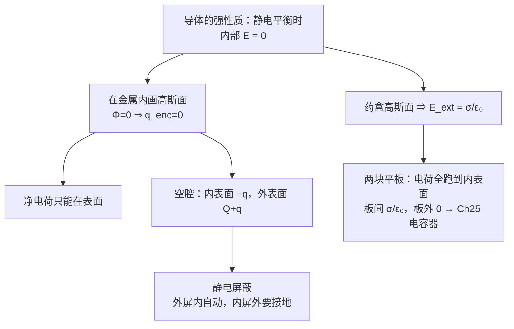
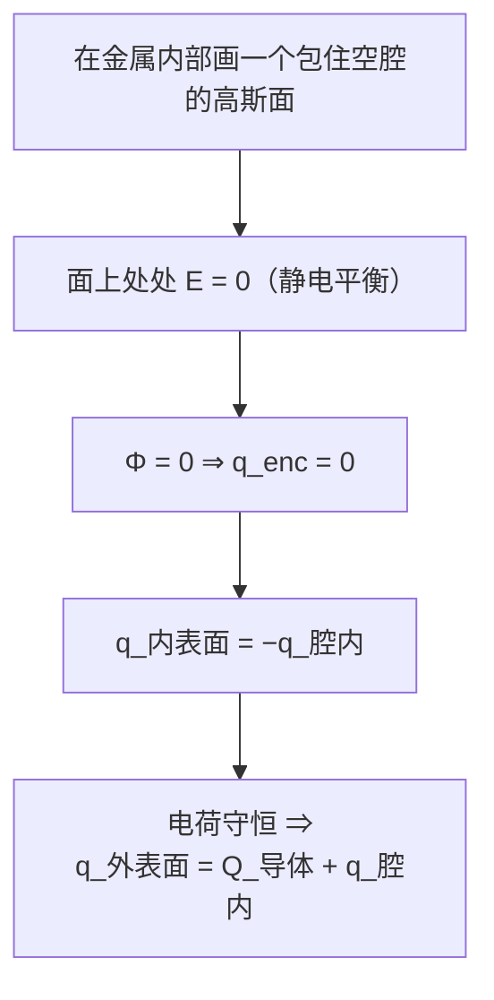
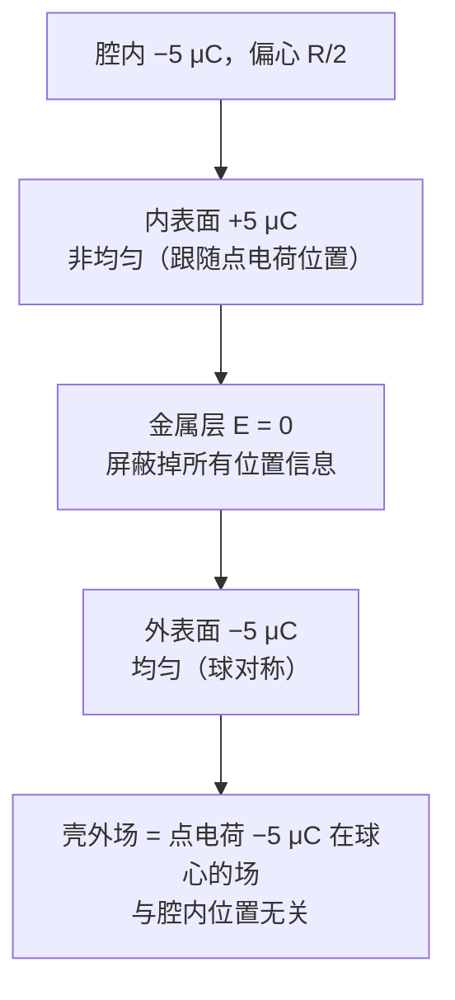

# C23.3 带电导体的电场 Electric Field of a Charged Conductor

> [!abstract] 这一讲的任务
> 高斯定律到手了，先拿**导体**开刀——因为导体有一条极强的性质（内部 $\vec E=0$），配上上一讲那个"$\vec E=0\Rightarrow q_{enc}=0$"的反向推理，几乎不用算就能把电荷分布全部确定下来。
> 这一讲会依次得到：电荷只能待在表面 → 空腔内外表面的感应电荷 → 表面外侧 $E=\sigma/\varepsilon_0$ → 平行板之间的场。最后一道例题给出静电屏蔽的定量表述：**外面的人测不出腔内电荷偏在哪儿。**

> [!info] 怎么读这份讲义
> 第 1 节那条"$E=0\Rightarrow q=0$"的推理是后面全部内容的母题，每一节都在重复用它，只是把高斯面画在不同地方。第 4 节的 $\sigma/\varepsilon_0$ 与 $\sigma/2\varepsilon_0$ 一定要分清。
> 标有 **（拓展）** 或 **【拓展】** 的内容，是**课堂上没有讲到、由课件和教材延伸补充**的部分。复习时可先掌握未标注的主干内容，行有余力再看拓展部分。

---

## 0. 开场：雷雨天为什么待在车里是安全的

一道闪电打在汽车顶上，几万安培的电流从车壳流过。**车里的人为什么没事？**

常见的说法是"橡胶轮胎绝缘"——这个说法不对：闪电能击穿几公里的空气，几厘米厚的橡胶拦不住它。

> [!question] 停一下，先自己想想
> 真正的原因和车壳是**金属**有关。金属里的自由电子可以随便跑（[[C21.2 导体与绝缘体]]）。当外面来了强电场，这些电子会怎么做？它们跑到哪儿才肯停下来？

**电子会一直跑，直到没有力推它们为止。** 而"没有力"就意味着**金属内部的电场被抵消到零**。车壳内部（以及被车壳围住的车厢）因此成了一个零场区。

这一条就是本讲的全部出发点，它有个正式名字：**静电平衡**。

---

## 1. 导体内部的电场 Electric field inside a conductor

> [!important] 学习目标 Learning objectives（课件原文）
> - **01** 认识到若把**净余电荷**放在一个**孤立导体**上，该电荷会移动到**表面**，内部没有电荷。
> - **02** 认识到**孤立导体内部的电场为零**。
> - **03** 对于**内含带电体的带空腔导体**，确定**空腔壁上**和**外表面上**的电荷。
> - **04** 解释**如何用高斯定律求带有面电荷密度的孤立导体表面附近的电场**。
> - **05** 对**大的均匀带电导体表面**，确定距该面有限距离处各点的电场。

![[Pasted image 20260914141848.png]]
![[C23-带空腔导体的电荷分布.png]]

> [!important] 两条核心结论
> **静电平衡 (electrostatic equilibrium) 时，导体内部的电场处处为零。**
> $$\text{inside}\ \vec E=0$$
> **导体上的净余电荷全部位于导体表面。**（Excess charge on a conductor is entirely on the conductor's surface. 多余电荷只能在表面）

**课件的论证链**：

$$\text{inside}\ E=0\ \xrightarrow{\ \oint\vec E\cdot d\vec A=\dfrac{q_{enc}}{\varepsilon_0}\ }\ \text{inside}\ q=0$$

即：在导体内部**紧贴表面下方**任取一个闭合高斯面（课件右图的红色虚线），面上处处 $\vec E=0$，故 $\Phi=0$，故 $q_{enc}=0$——**导体内部任何地方都没有净电荷**，电荷只能在表面。

> [!question] 停一下，我们刚才干了什么
> 这正是 [[C23.2 高斯定律]] 结尾强调的那个**反方向**推理：
> **每一笔都是零（面上处处 $\vec E=0$）⇒ 总账为零（$\Phi=0$）⇒ 里面没有净电荷。**
> 本讲后面每一个结论，都是把这同一个推理里的高斯面**画在不同地方**而已：画在表面下方 → 电荷全在表面；画成包住空腔 → 内表面 $-q$；画成跨过表面的药盒 → $E=\sigma/\varepsilon_0$。**只有一招，用三次。**

> [!note] "内部 $E=0$"本身是怎么来的——课件当作前提，但它其实是可以论证的
> 反证：假设导体内部某处 $\vec E\ne0$，那里的自由电子就会受力 $\vec F=-e\vec E$ 而**移动**（[[C21.2 导体与绝缘体]]：导体内电子可自由移动）。只要还有电子在动，系统就**还没达到静电平衡**。
> 电子会持续重新分布，直到它们产生的场恰好抵消掉内部的一切场为止。**"静电平衡"这个词的定义就是"电荷不再宏观移动"**，所以内部 $E=0$ 是平衡的必要条件。
> 这个过程有多快？金属中的**弛豫时间**约 $10^{-19}$ s 量级，所以宏观上可以认为是**瞬时**完成的——开场那道闪电打上来的瞬间，车壳就已经把车厢保护好了。

> [!warning] 三个限定词一个都不能少
> 1. **静电**平衡：有稳恒电流时导体内部**有场**（Ch26：$\vec E=\rho\vec J$），否则电流无法维持。
> 2. **导体内部**（金属材料内部）：不包括空腔里的真空区域。
> 3. **净余电荷在表面**：说的是"净"电荷。导体内部当然还有海量的正离子和电子，只是它们处处抵消。

---

## 2. 带空腔的导体 Charge distribution in a conductor with cavity 空腔

现在把导体挖空，往腔里放一个电荷。

> [!question] 停一下，先自己想想
> 腔里放了 $+q$，导体本身原来是中性的。**内表面、外表面各带多少电荷？**
> 提示：高斯面该画在哪儿，才能用上"面上处处 $\vec E=0$"这个已知条件？

> [!important] 两种情形（课件原文）
> **(a) 空腔内没有电荷 $q$ → 内表面上也没有电荷。**（No charge $q$ in the cavity, no charge on the inner surface.）
> **(b) 空腔内有电荷 $q$ → 内表面上的电荷为**
> $$\boxed{q_{in}=-q}$$

> [!note] 推理过程（课件只画图给结论）
> 在导体材料内部、把空腔整个包住，画一个闭合高斯面（课件图中的黑色虚线）。这个面**完全走在金属里**，所以面上处处 $\vec E=0$，故
> $$\Phi=0\ \Longrightarrow\ q_{enc}=0$$
> 而 $q_{enc}=q_{\text{腔内}}+q_{\text{内表面}}$，于是
> $$q_{\text{内表面}}=-q_{\text{腔内}}$$
> - 腔内无电荷 → 内表面电荷为 0 ✓
> - 腔内有 $+q$ → 内表面感应出 $-q$ ✓（课件右图内表面画满了 "−"）
>
> **再用电荷守恒**（整个导体原本电中性）：
> $$q_{\text{外表面}}=Q_{\text{导体原有}}-q_{\text{内表面}}=Q_{\text{导体原有}}+q$$
> 对中性导体（$Q=0$）：外表面带 $+q$ ✓（课件右图外表面画满了 "+"）。

> [!important] 静电屏蔽的两个方向——这是本节最重要的应用
> - **外屏蔽内**：外界的电场无法进入空腔（腔内无电荷时腔内 $\vec E=0$）。→ **法拉第笼**保护内部电子设备、屏蔽机房、同轴电缆屏蔽层。开场那辆汽车就是一个法拉第笼。
> - **内屏蔽外**（**需要接地**）：腔内电荷 $q$ 的影响会通过外表面的 $+q$ 传到外界。**只有把导体接地**，外表面电荷被导走，外界才感受不到腔内电荷。
>
> **注意这两者不对称**：外屏内是自动的，内屏外必须接地。考试常考这个区别。

---

## 3. 表面外侧的场：$E=\sigma/\varepsilon_0$

电荷既然都待在表面，那紧贴表面外侧的场是多少？**把高斯面画成跨过表面的小药盒**，还是那一招。

![[C23-导体表面外场的高斯药盒.png]]

> [!important] 结论
> **紧贴导体表面外侧的电场**：
> $$\boxed{E_{ext}=\frac{\sigma}{\varepsilon_0}}$$
> $\sigma$ 是**该点处**表面的电荷密度（$\sigma$ is the charge density on the surface at the point）。

**证明 Proof：画一个圆柱形（药盒形）高斯面**（课件原文 Draw a cylindrical Gaussian surface），一半嵌在导体内、一半露在外，底面积 $\Delta A$：

$$\oint_A\vec E\cdot d\vec A=\int_{\text{internal}}+\int_{\text{curved}}+\int_{\text{external}}$$

$$=0+0+E_{ext}\Delta A=\frac{q_{enc}}{\varepsilon_0}=\frac{\sigma}{\varepsilon_0}\Delta A$$

$$\Longrightarrow\ E_{ext}=\frac{\sigma}{\varepsilon_0}$$

> [!note] 三项各自为什么是那个值——课件写了式子但没逐项说明
> - **internal（导体内的那个底面）**：$\vec E=0$（静电平衡）→ 贡献 **0**
> - **curved（圆柱侧面）**：紧贴表面处 $\vec E$ **垂直于导体表面**，而侧面的法线**平行于表面**，两者垂直 → $\cos90^\circ=0$ → 贡献 **0**
> - **external（外面的底面）**：$\vec E$ 与外法线**同向** → 贡献 $E_{ext}\Delta A$
>
> 其中"$\vec E$ 必须垂直于导体表面"这一点课件没证：若 $\vec E$ 有沿表面的**切向分量**，表面上的自由电荷就会沿表面移动，那就不是静电平衡了。**所以静电平衡时导体表面的电场必定处处垂直于表面。**

> [!warning] $\sigma/\varepsilon_0$ 与 $\sigma/2\varepsilon_0$ 的区别（这是本章最经典的混淆）
> | | 公式 | 为什么 |
> |---|---|---|
> | **导体表面**外侧 | $E=\dfrac{\sigma}{\varepsilon_0}$ | 导体内 $E=0$，通量**全部**从外侧一个底面出去 |
> | **绝缘薄板**（[[C22.5 带电圆盘的电场]]、[[C23.4 对称带电绝缘体的电场]]） | $E=\dfrac{\sigma}{2\varepsilon_0}$ | 场向两侧对称发出，通量**平分**给两个底面 |
>
> 差别不在公式，在**药盒有几个底面在"出通量"**：导体是 1 个，绝缘板是 2 个。**画图时把这一点标出来，就永远不会记反。**

---

## 4. 导体平板 Conducting plates with uniform surface charge density

![[C23-单块大导体板的场.png]]

> [!important] (i) 单块大平板 Single large plate
> 一块孤立的大导体板，**两个表面各带面密度 $\sigma_1$**（课件图 (a) 中两侧都标 $\sigma_1$）：
> $$E=\frac{\sigma_1}{\varepsilon_0}$$
> 场从两侧向外（板带正电时），如课件图 (b) 所示（负电时向内）。

![[C23-两块导体板电荷移到内表面.png]]

> [!question] 停一下，先自己想想
> 现在把两块大平板面对面放着，一块带 $+Q$、一块带 $-Q$。
> **每块板的电荷会怎么分布？** 还是像单板那样两面各一半吗？

> [!important] (ii) 两块大平板 Double large plates
> **两个导体上的净余电荷会全部移动到内侧表面上**（The excess charge of the two conductors will move onto the inner faces.）**每个内表面的面电荷密度变为**
> $$\sigma=\pm2\sigma_1$$
> $$E=\frac{\sigma}{\varepsilon_0}$$
> 课件图 (c)：两板之间标着 $2\sigma_1$，板外两侧 $E=0$。

> [!note] 电荷为什么会全跑到内侧——课件只陈述结果
> 设两块板分别带 $+Q$ 和 $-Q$。异号电荷互相吸引，正电荷被对面板的负电荷拉向内侧，负电荷同理。最终**全部**集中在相对的两个内表面上。
> **面密度翻倍的算法**：原来 $Q$ 分布在**两个**面上，每面 $\sigma_1=\dfrac{Q}{2A}$；现在全挤到**一个**面上，$\sigma=\dfrac{Q}{A}=2\sigma_1$ ✓
> **板外为什么 $E=0$**：板外一点，两块板的场大小相等（$\sigma$ 相同）、方向相反（一正一负），完全抵消。这正是**平行板电容器把场完全约束在内部**的原因（Ch25）。

> [!warning] $E=\sigma/\varepsilon_0$ 里的 $\sigma$ 是哪一个？
> 双板情形的 $E=\sigma/\varepsilon_0$ 中，$\sigma=2\sigma_1$ 是**内表面**的密度，不是原来单板的 $\sigma_1$。所以两板之间的场是单板孤立时的 **2 倍**：$E=2\sigma_1/\varepsilon_0$。
> 也可以从叠加角度验证：两板内表面各产生 $\dfrac{\sigma}{2\varepsilon_0}$ 的场（把内表面当作带电薄层），在板间同向叠加得 $\dfrac{\sigma}{\varepsilon_0}$ ✓ 两条路线一致。

---

## 5. 例题 1：一个测不出来的秘密

> [!example] 题目 Example 1（课件原题）
> 一个负点电荷 $q=-5\ \mathrm{\mu C}$ 位于一个**电中性**的、半径为 $R$ 的**球形金属壳**内，距球心 $R/2$（即**偏心放置**）。求球壳上**感应电荷 (induced charges 感应电荷)** 的分布。

![[C23-例题1中性金属球壳内偏心点电荷.png]]

**解 Solution（课件原文）**

> [!important] 答案
> - **内表面 (inner surface)** 的感应电荷是 $+5\ \mathrm{\mu C}$，**非均匀分布 (nonuniform distribution)**
> - **外表面 (outer surface)** 的感应电荷是 $-5\ \mathrm{\mu C}$，**均匀分布 (uniform distribution)**

> [!question] 课堂追问：电荷明明是偏心的，凭什么外表面是均匀的？
> 先自己想 30 秒。关键在于：**外表面"能看到"里面的偏心吗？**

> [!note] 完整推理（课件只给结论，这三步必须自己讲得出来）
> **① 内表面电荷量**：在金属内画一个包住空腔的高斯面 → 面上 $\vec E=0$ → $q_{enc}=0$ → $q_{\text{内}}=-q_{\text{腔内}}=+5\ \mathrm{\mu C}$ ✓
> **② 外表面电荷量**：球壳原本中性，总电荷守恒 → $q_{\text{外}}=0-q_{\text{内}}=-5\ \mathrm{\mu C}$ ✓
> **③ 为什么内非均匀、外均匀**——这是本题真正的考点：
> - **内表面**：它"看得见"腔内的点电荷偏在哪一侧。离点电荷近的那一小块内表面必须感应出更多正电荷，才能把该处的场抵消掉。所以**内表面的分布跟着点电荷的位置走，是非均匀的**（课件图中靠近 $-q$ 的一侧 "+" 更密）。
> - **外表面**：金属层里 $\vec E=0$，把内部的一切信息**完全屏蔽**掉了。外表面"不知道"里面的电荷偏在哪儿，只知道自己总共有 $-5\ \mathrm{\mu C}$。在球对称的外表面上，唯一自洽的分布就是**均匀**的（同号电荷互斥，球面上均匀分布是唯一平衡态）。
>
> **④ 由此得出的重要推论**：球壳**外部**的电场，就像 $-5\ \mathrm{\mu C}$ 集中在**球心**产生的场一样：
> $$E_{\text{外}}=\frac{1}{4\pi\varepsilon_0}\frac{5\ \mathrm{\mu C}}{r^2}\quad(r>R)$$
> **与点电荷放在腔内哪个位置完全无关！** 这就是静电屏蔽的定量表述——**外面永远看不出里面的电荷偏在哪儿**。

---

## 这一讲的三句话

1. **一招用三次**：在导体里画高斯面，面上处处 $\vec E=0$ ⇒ $\Phi=0$ ⇒ $q_{enc}=0$。由此得到"净电荷全在表面""内表面 $-q$、外表面 $Q+q$""$E_{ext}=\sigma/\varepsilon_0$"。
2. **静电屏蔽不对称**：外屏内自动成立（法拉第笼、汽车），内屏外必须**接地**。
3. **$\sigma/\varepsilon_0$（导体）vs $\sigma/2\varepsilon_0$（绝缘板）**，差别只在药盒有几个底面出通量；两块导体板的电荷全跑到内表面（$\sigma=2\sigma_1$），板间 $E=\sigma/\varepsilon_0$，**板外 $E=0$**——这就是电容器的雏形。

> [!important] 必背
> $$\text{导体内}\ \vec E=0,\qquad q_{\text{内表面}}=-q_{\text{腔内}},\qquad E_{ext}=\frac{\sigma}{\varepsilon_0},\qquad E_{\text{双板间}}=\frac{\sigma}{\varepsilon_0}=\frac{2\sigma_1}{\varepsilon_0}$$

> [!abstract] 下一讲预告
> 导体这么好办，是因为它自带"内部 $E=0$"这条强性质。**绝缘体没有这条**——电荷被钉死在原地，想怎么分布就怎么分布，内部也有场。
> 那高斯定律还有用吗？有，但要付出代价：**必须靠对称性**。下一讲会把能用高斯定律解出来的情形一网打尽，只有三种；同时你会看到第 21 章用两页积分证明的壳层定理，这里**两行**就出来了。

---

## 本节自测 Self-Test

> [!question] 1. 为什么静电平衡时导体内部 $\vec E=0$？

> [!success]- 参考答案
> 若内部有场，自由电子就会受力移动，即未达平衡；电子重新分布直到内部场被完全抵消。弛豫时间约 $10^{-19}$ s，宏观上瞬时。

> [!question] 2. 由 $\vec E=0$ 如何推出"净电荷全在表面"？

> [!success]- 参考答案
> 在导体内部任取闭合高斯面，面上 $\vec E=0\Rightarrow\Phi=0\Rightarrow q_{enc}=0$，故内部无净电荷。注意这用的是 [[C23.2 高斯定律]] 里那条推理的**反方向**。

> [!question] 3. 空腔内放 $+q$，导体（原带 $Q$）的内、外表面各带多少电荷？

> [!success]- 参考答案
> 内表面 $-q$（金属内高斯面 $q_{enc}=0$）；外表面 $Q+q$（电荷守恒）。

> [!question] 4. 静电屏蔽的两个方向有何不对称？

> [!success]- 参考答案
> "外屏内"自动成立；"内屏外"必须把导体**接地**，否则腔内电荷的影响经外表面传到外界。

> [!question] 5. 推导 $E_{ext}=\sigma/\varepsilon_0$ 时，药盒高斯面三部分的通量各是多少？为什么？

> [!success]- 参考答案
> 内底 0（导体内 $E=0$）；侧面 0（$\vec E$ 垂直于导体表面，与侧面法线垂直）；外底 $E_{ext}\Delta A$。另外"$\vec E$ 必垂直于导体表面"本身也来自静电平衡（否则切向分量会推动表面电荷）。

> [!question] 6. 导体表面 $\sigma/\varepsilon_0$ 与绝缘薄板 $\sigma/2\varepsilon_0$ 差在哪？

> [!success]- 参考答案
> 差在药盒有几个底面出通量：导体内 $E=0$，只有 1 个底面出；绝缘板两侧对称，2 个底面平分通量。

> [!question] 7. 两块大导体板相对放置时，电荷如何分布？板间和板外的场各是多少？

> [!success]- 参考答案
> 净余电荷全部移到两个内表面，每面 $\sigma=\pm2\sigma_1$；板间 $E=\sigma/\varepsilon_0=2\sigma_1/\varepsilon_0$，板外 $E=0$（两板的场抵消）。

> [!question] 8. 例题 1 中为什么内表面电荷非均匀而外表面均匀？外部场与腔内电荷位置有关吗？

> [!success]- 参考答案
> 内表面"看得见"腔内电荷的偏心位置，须逐点抵消；金属层 $E=0$ 屏蔽掉位置信息，外表面只知总量，球对称下唯一自洽分布是均匀。外部场等于同样电荷集中在球心的场，与腔内位置**无关**。

---

上一节 ← [[C23.2 高斯定律]] ｜ 下一节 → [[C23.4 对称带电绝缘体的电场]]
索引 → [[电磁学 MOC]]
