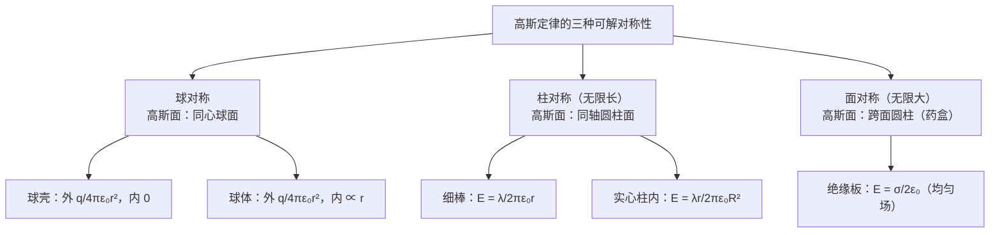
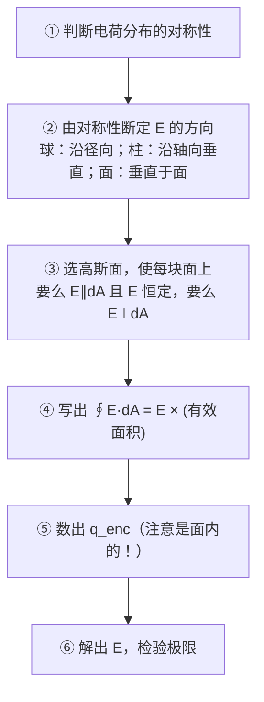
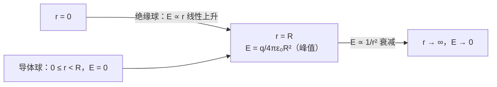

# C23.4 对称带电绝缘体的电场 Electric Field of a Charged Insulator with Symmetry

## 本节结构总览

## 1 学习目标 Learning objectives（课件原文）

- **01** 解释如何用高斯定律导出具有**球、柱、面对称性 (spherical, cylindrical and planar symmetry)** 的**带电绝缘体**的电场。
- **02** 对均匀带电的**球壳或实心球 (spherical shell or solid sphere)**，求**内部和外部**各点的电场。
- **03** 对长的均匀带电**棒 (rod)**，求垂直距离 $r$ 处的电场。
- **04** 对均匀带电的**柱壳或实心柱 (cylindrical shell or cylinder)**，求内部和外部各点的电场。
- **05** 对大的均匀带电**板 (sheet)**，求电场。

## 2 核心方法：高斯面必须匹配对称性

![[C23-三种对称性与匹配的高斯面.png]]

> [!important] 课件原文（本节的方法总纲）
> **高斯面应当与电荷分布的对称性相匹配，以便简化积分。（匹配）**
> （The Gaussian surface should **match** the symmetry of the charge so that to simplify the integral.）
>
> 三种对称性与对应结果：
>
> | 对称性 | 高斯面 | 结果 |
> |---|---|---|
> | **球对称**（左图） | 同心球面 | $E=\dfrac{1}{4\pi\varepsilon_0}\dfrac{q_{in}}{r^2}$ |
> | **柱对称**（中图，无限长带电线 $\lambda$，高斯面半径 $r$、高 $h$） | 同轴圆柱面 | $E=\dfrac{\lambda}{2\pi\varepsilon_0 r}$ |
> | **面对称**（右图，无限大带电面 $\sigma$，高斯面为跨面圆柱） | 跨面圆柱（药盒） | $E=\dfrac{\sigma}{2\varepsilon_0}$ |

> [!important] "匹配"的具体含义——高斯面要满足两个条件之一（逐面）
> ① 面元上 $\vec E$ **大小恒定且方向与 $d\vec A$ 平行** → $\int\vec E\cdot d\vec A=EA$，$E$ 可提出积分号
> ② 面元上 $\vec E$ **垂直于 $d\vec A$** → 贡献为 0
>
> **只要每一块面都落入这两类，积分就变成代数。** 选高斯面时脑子里想的就是这件事，不是"哪个形状好看"。

> [!warning] 对称性论证不能省——这是评分点
> 很多同学直接写 "$E\cdot4\pi r^2=q/\varepsilon_0$"，但**凭什么 $E$ 在球面上是常数？** 必须先说明：
> "电荷分布球对称 ⇒ 场只能沿径向（否则把整个系统绕轴旋转，物理情形不变但场变了，矛盾）⇒ 且 $E$ 只依赖 $r$。"
> 这类"**由对称性排除其他可能**"的论证是本节的核心思维，不是形式主义。

## 3 (1) 球对称 Spherically symmetric charges 球对称

### (a) 均匀带电球壳 spherical shell（电荷 $q$，半径 $R$）

![[C23-均匀带电球壳的高斯面.png]]

**i. 壳外 Outside the shell $r>R$**

$$\oint\vec E\cdot d\vec A=E(4\pi r^2)=q/\varepsilon_0\ \Longrightarrow\ \boxed{E=\frac{1}{4\pi\varepsilon_0}\frac{q}{r^2}}$$

> [!important] 课件的解读
> **均匀带电球壳对壳外带电粒子的作用，就像全部电荷都集中在球心一样。**
> （A shell of uniform charge attracts or repels a charged particle that is outside the shell, as if all the shell's charge were **concentrated at its center**.）

**ii. 壳内 Inside the shell $r<R$**

$$\oint\vec E\cdot d\vec A=0\ \Longrightarrow\ \boxed{E=0}$$

> [!important] 课件的解读
> **若带电粒子位于均匀带电球壳内部，球壳对它没有净静电力。**

> [!note] 与 [[C21.3 库仑定律]] 的对照——本章最有说服力的一页
> 第 21 章证明这两条壳层定理，用掉了**整整两页积分**：切环带、换元 $x\,dx=rR\sin\theta\,d\theta$、算 $\int_{r-R}^{r+R}(\cdots)dx=4R$。
> 这里，**每条只用两行**。
> 差别在哪？第 21 章是"硬算所有微元的贡献再求和"；高斯定律是"**不看内部细节，只数进出的电场线**"。
> **这就是为什么值得学高斯定律**：它把"局部求和"换成了"整体守恒"。同时也解释了第 21 章那个推导的价值——那里辛苦验证的正是"平方反比"这条使高斯定律成立的性质。

### (b) 均匀带电实心球 sphere（半径 $R$，总电荷 $q$ 均匀分布在**体积**中）

![[C23-均匀带电球体内外的高斯面.png]]

**(i) 球外 Outside the sphere $r>R$**

$$\Phi=E(4\pi r^2)=\frac{q}{\varepsilon_0}\ \Longrightarrow\ \boxed{E=\frac{1}{4\pi\varepsilon_0}\frac{q}{r^2}}$$

**(ii) 球内 Inside the sphere $r<R$**

$$E=\frac{1}{4\pi\varepsilon_0}\frac{q_{enc}}{r^2}$$

由**体电荷密度均匀**：

$$\rho=\frac{q_{enc}}{\dfrac{4\pi r^3}{3}}=\frac{q}{\dfrac{4\pi R^3}{3}}\ \Longrightarrow\ q_{enc}=\frac{r^3}{R^3}q$$

$$\boxed{E=\left(\frac{1}{4\pi\varepsilon_0}\frac{q}{R^3}\right)r}$$

> [!important] 球内场强与 $r$ 成**正比**
> 这与球外的 $1/r^2$ 完全不同。原因：往里走时，虽然 $1/r^2$ 变大，但被包围的电荷 $q_{enc}\propto r^3$ 减少得更快，净效果是 $E\propto\dfrac{r^3}{r^2}=r$。

> [!note] 检验（课件没做）
> - $r=0$（球心）：$E=0$ ✓ 对称性要求
> - $r=R$（表面）：内式给 $\dfrac{q}{4\pi\varepsilon_0}\dfrac{R}{R^3}=\dfrac{q}{4\pi\varepsilon_0R^2}$；外式给 $\dfrac{q}{4\pi\varepsilon_0R^2}$ ✓ **两式在边界连续**——这是这类分段结果的标准检验，必做。

> [!warning] 实心导体球 vs 实心绝缘球——本章最常考的对比
> | | 实心**绝缘**球（本节） | 实心**导体**球（[[C23.3 带电导体的电场]]） |
> |---|---|---|
> | 电荷分布 | 均匀充满整个体积（$\rho$） | 全部在**表面**（$\sigma$） |
> | $r<R$ 的场 | $E\propto r$（线性增长） | $E=0$ |
> | $r>R$ 的场 | $\dfrac{q}{4\pi\varepsilon_0r^2}$ | $\dfrac{q}{4\pi\varepsilon_0r^2}$（相同） |
>
> **外部完全一样，内部截然不同。** 题目只说"半径 $R$ 带电 $q$ 的球"是不够的，必须先问：**导体还是绝缘体？**（这正是 [[C21.3 库仑定律]] 学习目标 05/06 的区分在这里兑现。）

## 4 (2) 柱对称 Cylindrically symmetric charges 柱对称

![[C23-无限长带电细棒的柱形高斯面.png]]

> [!important] 无限长带电细棒 thin rod（线电荷密度 $\lambda$）
> 取**同轴圆柱形**高斯面，半径 $r$、高 $h$。
> - **两个底面**：$\vec E$ 沿径向（垂直于轴），底面法线沿轴向 → $\vec E\perp d\vec A$ → 贡献 **0**
> - **侧面**：$\vec E$ 处处垂直于侧面、大小相同 → 贡献 $E\cdot2\pi rh$
>
> $$\int_{\text{cylinder}}\vec E\cdot d\vec A=E\int_{\text{cylinder}}dA=E(2\pi rh)=\lambda h/\varepsilon_0$$
> $$\boxed{E=\frac{\lambda}{2\pi\varepsilon_0 r}}$$

> [!note] 高度 $h$ 为什么消掉了、以及 $1/r$ 而不是 $1/r^2$
> $h$ 同时出现在"侧面积 $2\pi rh$"和"包围电荷 $\lambda h$"里，必然约掉——**结果不依赖高斯面取多高**，这是柱对称的自洽性检验。
> 衰减是 $1/r$ 而非 $1/r^2$：因为"场线摊开"的方式不同。点电荷的线摊在**球面**（$\propto r^2$）上，无限长线的线摊在**柱侧面**（$\propto r$）上。**几何决定衰减律**——这与 [[C22.2 点电荷的电场]] 的"线密度"论证是同一件事。

> [!important] 无限长实心带电柱 cylinder（半径 $R$，线电荷密度 $\lambda$）
> **柱内 $r<R$**：
> $$\boxed{E=\frac{\lambda r}{2\pi\varepsilon_0 R^2}\qquad(r<R)}$$

> [!note] 补上推导（课件直接给结果）
> 取半径 $r<R$、高 $h$ 的同轴圆柱高斯面。被包围的电荷按**体积比**折算：
> $$q_{enc}=\lambda h\cdot\frac{\pi r^2h}{\pi R^2h}=\lambda h\frac{r^2}{R^2}$$
> $$E(2\pi rh)=\frac{\lambda h r^2}{\varepsilon_0R^2}\ \Longrightarrow\ E=\frac{\lambda r}{2\pi\varepsilon_0R^2}\ ✓$$
> **检验**：$r=R$ 时给 $\dfrac{\lambda}{2\pi\varepsilon_0R}$，与外部公式在 $r=R$ 处相等 ✓ 连续。
> 与球体情形结构完全一样：**内部 $E\propto r$，外部按几何衰减律，边界连续**。

> [!warning] "无限长"这个条件不能省
> 只有无限长（或"离两端很远的长棒中部"）才有严格的柱对称——有限长棒的两端破坏对称性，底面通量不再为零，高斯定律解不出。这时只能回到 [[C22.4 线电荷的电场]] 的积分法。

## 5 (3) 面对称 Planar symmetric charges 平面对称

![[C23-无限大绝缘带电板的柱形高斯面.png]]

> [!important] 无限大绝缘带电板 Nonconducting sheet 绝缘带电板（面电荷密度 $+\sigma$）
> 课件给的两条对称性论断：
> - **$\vec E$ 必定垂直于板面，且在与板等距离 $r$ 处大小相同。**（E must be perpendicular to the sheet and have the same magnitude at the same distance $r$.）
> - **选一个圆柱形高斯面，让它垂直地穿过板面。**（Choose a cylindrical Gaussian surface and it pierces to the sheet perpendicularly.）
>
> $$\varepsilon_0\oint_A\vec E\cdot d\vec A=q_{enc}\ \Longrightarrow\ \varepsilon_0(EA+0+EA)=\sigma A$$
> $$\boxed{E=\frac{\sigma}{2\varepsilon_0}}$$
> **这是一个均匀电场 (uniform electric field)。**

> [!note] 那三项 $EA+0+EA$
> 药盒的**两个底面**都在"出通量"（板两侧的场都向外），各贡献 $EA$；**侧面**上 $\vec E$ 平行于侧面 → 贡献 0。
> 这就是 [[C23.3 带电导体的电场]] 里说的"绝缘板有 **2 个**底面出通量，导体只有 **1 个**"——因子 2 的唯一来源。
> 结果与 [[C22.5 带电圆盘的电场]] 中令 $R\to\infty$ 得到的完全一致 ✓ **两种方法互相验证。**

> [!important] 课件的实用补充
> **它对有限大的板也成立**（Its also holds for a **finite sheet**），只要**取点靠近板面且不太靠近边缘**（at points close to the sheet and not too near its edges）。

> [!note] "无限大"的实用判据
> 严格的无限大平面不存在。判据是：**场点到板的距离 $z$ ≪ 板到边缘的距离**。
> 此时站在场点上"看不到边界"，板在你眼中就是无限大的。这与 [[C22.5 带电圆盘的电场]] 中 $z/R\to0$ 的分析完全一致——**极限的本质是无量纲比值小，不是绝对尺寸大。**

## 6 全章公式汇总

| 电荷分布 | 区域 | 电场 |
|---|---|---|
| 点电荷 $q$ | 任意 $r$ | $\dfrac{q}{4\pi\varepsilon_0r^2}$ |
| 均匀带电**球壳**（电荷 $q$，半径 $R$） | $r>R$ | $\dfrac{q}{4\pi\varepsilon_0r^2}$ |
| | $r<R$ | $0$ |
| 均匀带电**实心绝缘球**（$q$，$R$） | $r>R$ | $\dfrac{q}{4\pi\varepsilon_0r^2}$ |
| | $r<R$ | $\dfrac{q}{4\pi\varepsilon_0R^3}r$ |
| **实心导体球**（$q$，$R$） | $r>R$ | $\dfrac{q}{4\pi\varepsilon_0r^2}$ |
| | $r<R$ | $0$ |
| 无限长**带电细线**（$\lambda$） | 任意 $r$ | $\dfrac{\lambda}{2\pi\varepsilon_0r}$ |
| 无限长**实心带电柱**（$\lambda$，$R$） | $r>R$ | $\dfrac{\lambda}{2\pi\varepsilon_0r}$ |
| | $r<R$ | $\dfrac{\lambda r}{2\pi\varepsilon_0R^2}$ |
| 无限大**绝缘带电板**（$\sigma$） | 两侧 | $\dfrac{\sigma}{2\varepsilon_0}$（均匀场）|
| **导体表面**外侧（$\sigma$） | 紧邻 | $\dfrac{\sigma}{\varepsilon_0}$ |
| 两块**导体平板**（内表面 $\sigma$） | 板间 | $\dfrac{\sigma}{\varepsilon_0}$；板外 $0$ |

> [!note] 三种衰减律的几何统一
> $$\text{点（球对称）}: E\propto\frac{1}{r^2}\qquad\text{线（柱对称）}: E\propto\frac{1}{r}\qquad\text{面（面对称）}: E\propto r^0$$
> 规律：**源的维度每升高一维，衰减就慢一个 $1/r$。** 因为高斯面的"有效面积"分别按 $r^2$、$r^1$、$r^0$ 增长，而通量守恒。
> **记住这条，三个公式的形式就永远不会记混**，只剩系数需要背。

---

## 本节自测 Self-Test

> [!question] 1. "高斯面匹配对称性"的具体标准是什么？
> 每块面上要么 $\vec E$ 大小恒定且平行于 $d\vec A$（可提出积分号），要么 $\vec E\perp d\vec A$（贡献为零）。

> [!question] 2. 均匀带电球壳内外的场分别是多少？与第 21 章的壳层定理什么关系？
> 外：$\dfrac{q}{4\pi\varepsilon_0r^2}$；内：$0$。就是壳层定理 1 和 2，只是这里两行推出，第 21 章用了两页积分。

> [!question] 3. 均匀带电实心绝缘球内部为什么 $E\propto r$？
> $q_{enc}\propto r^3$ 增长快于 $1/r^2$ 的衰减，净效果 $E\propto r^3/r^2=r$。

> [!question] 4. 实心导体球与实心绝缘球，内外场有何异同？
> 外部完全相同（$q/4\pi\varepsilon_0r^2$）；内部：导体 $E=0$，绝缘体 $E\propto r$。

> [!question] 5. 无限长带电线的场为什么按 $1/r$ 衰减？高斯面的高度 $h$ 为什么会消掉？
> 场线摊在柱侧面上（面积 $\propto r$）而非球面上。$h$ 同时出现在侧面积和包围电荷中，必然约掉。

> [!question] 6. 无限大绝缘板 $\sigma/2\varepsilon_0$ 中的因子 2 从哪来？
> 药盒的**两个**底面都出通量（场向两侧对称发出），通量被平分。导体表面只有 1 个底面出通量，故为 $\sigma/\varepsilon_0$。

> [!question] 7. "无限大平面"的实用判据是什么？
> 场点到板的距离远小于板到边缘的距离——站在场点看不到边界。

> [!question] 8. 点、线、面三种源的衰减律分别是什么？统一的几何解释？
> $1/r^2$、$1/r$、$r^0$。高斯面有效面积分别按 $r^2$、$r$、$r^0$ 增长，通量守恒故 $E$ 反比于此。源的维度每升一维，衰减慢一个 $1/r$。

---

上一节 ← [[C23.3 带电导体的电场]] ｜ 下一章 → 第 24 章 电势 Electric Potential
索引 → [[电磁学 MOC]]
