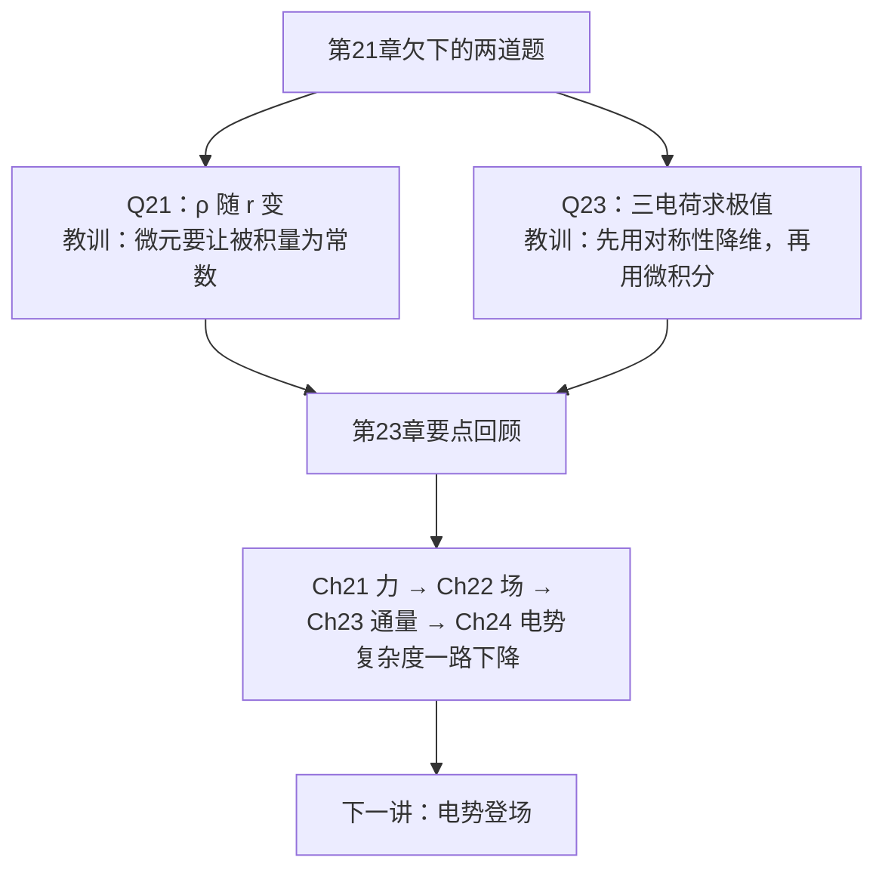

# C24.0 开篇回顾——第21章遗留习题与第23章要点

> [!abstract] 这一讲的任务
> 正式进入电势之前，先把第 21 章欠下的两道题还清。它们不是"随便复习一下"——一道教你**怎么选积分微元**，一道教你**怎么用对称性把矢量问题降成一维**。这两招在第 24 章会被反复使用。
> 然后我们回头看第 21→24 章的方法主线，你会发现这四章其实在做**同一件事的四个版本**，而且一版比一版省力。

> [!info] 怎么读这份讲义
> 两道题都先自己动手做，再看解答——尤其是第 1 题，你很可能一上来就掉进坑里（那正是这道题被留到现在讲的原因）。
> 标有 **（拓展）** 或 **【拓展】** 的内容，是**课堂上没有讲到、由课件和教材延伸补充**的部分。复习时可先掌握未标注的主干内容，行有余力再看拓展部分。

---

## 0. 开场：一道会让人一上来就算错的题

先看题，别急着往下翻。

> [!example] 第 21 章 Question 21（课件原题）
> A **nonconducting spherical shell**, with an inner radius of 4.0 cm and an outer radius of 6.0 cm, has charge spread **nonuniformly** through its volume between its inner and outer surfaces. The **volume charge density** $\rho$ is the charge per unit volume, with the unit coulomb per cubic meter. For this shell $\rho=b/r$, where $r$ is the distance in meters from the center of the shell and $b=3.0\ \mathrm{\mu C/m^2}$. What is the **net charge** in the shell?
>
> 一个**非导体球壳**，内半径 4.0 cm、外半径 6.0 cm，电荷**非均匀地**分布在内外表面之间的体积中。体电荷密度为 $\rho=b/r$，$b=3.0\ \mathrm{\mu C/m^2}$。求球壳内的**净电荷**。

> [!question] 停一下，先自己想想
> 求总电荷，最顺手的一步是什么？多半是写下
> $$q=\rho V=\rho\cdot\frac43\pi\left(r_o^3-r_i^3\right)$$
> 然后卡住——**$\rho$ 到底代哪个值？** 内表面处的 $\rho=b/0.04$？外表面处的 $b/0.06$？还是中间某处的？
>
> 这正是这道题的**墙**：$\rho$ 不是一个数，它是 $r$ 的函数。**$q=\rho V$ 这个公式，只在 $\rho$ 是常数时成立。**

### 破局：把球壳切成 $\rho$ 为常数的薄层

既然 $\rho$ 只随 $r$ 变，那就把球壳切成**同心的薄球壳**——每一层内部 $r$ 几乎不变，$\rho$ 就成了常数，$dq=\rho\,dV$ 才写得下去。

课件标出的三个题眼：**非导体球壳**、**电荷非均匀分布**、**电荷密度是半径的函数**。

**解**

$$q=\int_{r_i}^{r_o}dq=\int_{r_i}^{r_o}\rho\,dV=\int_{r_i}^{r_o}\frac br\left(4\pi r^2dr\right)=4\pi b\int_{r_i}^{r_o}r\,dr=2\pi b\left(r_o^2-r_i^2\right)$$

$$q=2\pi\times3\times(0.06^2-0.04^2)=0.038\ \mathrm{\mu C}$$

> [!note] 三个必须自己想清楚的地方（课件跳过）
> **① 为什么 $dV=4\pi r^2dr$**
> 因为 $\rho$ 只依赖 $r$，所以要把球壳切成**同心薄球壳**，每层内部 $\rho$ 才是常数。薄球壳的体积 = 球面积 × 厚度 = $4\pi r^2\,dr$。
> **选微元的原则永远是"让待积的量在微元内为常数"**，与 [[C22.4 线电荷的电场]] 的六步法第 1 步同源。
> **② 为什么用 $\rho$ 而不是 $\sigma$**
> 题目说的是"**nonconducting**（非导体）球壳，电荷分布在内外表面**之间的体积里**"。非导体电荷动不了，可以填满体积 → 用 $\rho$。
> 若是**导体**球壳，电荷会全跑到外表面 → 用 $\sigma$，题目就完全不同了。这正是 [[C23.4 对称带电绝缘体的电场]] 反复强调的区分。
> **③ $b$ 的单位为什么是 $\mathrm{\mu C/m^2}$ 而不是 $\mathrm{\mu C/m^3}$**
> 因为 $\rho=b/r$，$[\rho]=\mathrm{C/m^3}$，$[r]=\mathrm m$，所以 $[b]=\mathrm{C/m^3\cdot m}=\mathrm{C/m^2}$ ✓ **量纲自洽是检查这类题有没有代错的第一手段。**

> [!question] 停一下，我们刚才干了什么
> 我们没学任何新公式，只是**换了个微元**。"$q=\rho V$ 用不了"这件事本身，就是在提醒你：**每次见到"非均匀""随 $r$ 变化"字样，第一反应必须是切微元，而且切的方向由"谁在变"决定**——这里是 $r$ 在变，所以按 $r$ 分层。
> 这一招在本章求连续分布的电势（[[C24.4 叠加原理算电势]]）时会原封不动地再用一次。

---

## 1. 第二道题：先降维，再求极值

> [!example] 第 21 章 Question 23（课件原题）
> 图中粒子 1 和 2 电荷 $q_1=q_2=+3.20\times10^{-19}\ \mathrm C$，位于 $y$ 轴上距原点 $d=17.0\ \mathrm{cm}$ 处（一上一下）。粒子 3 电荷 $q_3=+6.40\times10^{-19}\ \mathrm C$ 沿 $x$ 轴从 $x=0$ 缓慢移到 $x=+5.0\ \mathrm m$。
> 在什么 $x$ 处，另外两个粒子对第三个粒子的静电力**(a) 最小**、**(b) 最大**？**(c)(d)** 最小值和最大值各是多少？

课件标出的两个题眼：**矢量对称简化**、**矢量运算标量化**。

> [!question] 停一下，先自己想想
> 一上来就写"两个力的矢量和，分解成 $x$、$y$ 分量，再对 $x$ 求导找极值"——能做，但会很惨：你要处理一个二维矢量函数的极值。
> **有没有办法在动笔之前就把维度降下来？** 看一眼图：$q_1=q_2$，而且**关于 $x$ 轴上下对称**。

**第一步：分解与对称化简**

$$\vec F_{31}=\frac{1}{4\pi\varepsilon_0}\frac{q_3q_1}{r_{31}^2}\hat r_{31},\qquad F_{31,x}=\frac{1}{4\pi\varepsilon_0}\frac{q_3q_1}{r_{31}^2}\cos\theta,\qquad F_{31,y}=-\frac{1}{4\pi\varepsilon_0}\frac{q_3q_1}{r_{31}^2}\sin\theta$$

$$\vec F_{32}=\frac{1}{4\pi\varepsilon_0}\frac{q_3q_2}{r_{32}^2}\hat r_{32},\qquad F_{32,x}=\frac{1}{4\pi\varepsilon_0}\frac{q_3q_2}{r_{32}^2}\cos\theta,\qquad F_{32,y}=+\frac{1}{4\pi\varepsilon_0}\frac{q_3q_2}{r_{32}^2}\sin\theta$$

$$q_1=q_2\ \Rightarrow\ F_{31,y}+F_{32,y}=0$$

$$\vec F_3=\vec F_{31}+\vec F_{32}=\frac{2}{4\pi\varepsilon_0}\frac{q_3q_1}{r_{31}^2}\cos\theta\ \hat x$$

代入 $r_{31}=\sqrt{x^2+d^2}$、$\cos\theta=\dfrac{x}{\sqrt{x^2+d^2}}$：

$$F_3=\frac{2}{4\pi\varepsilon_0}\frac{q_3q_1}{x^2+d^2}\cdot\frac{x}{\sqrt{x^2+d^2}}$$

**第二步：代入 $q_1=q_2=2e$、$q_3=4e$**

$$F_3=\frac{4}{\pi\varepsilon_0}\frac{e^2x}{(x^2+d^2)^{3/2}}$$

**第三步：求极值**

$$\frac{dF_3}{dx}=\frac{4e^2}{\pi\varepsilon_0}\left[(x^2+d^2)^{-3/2}-3x^2(x^2+d^2)^{-5/2}\right]=0$$

$$\Rightarrow\ x^2+d^2=3x^2\ \Rightarrow\ 2x^2=d^2\ \Rightarrow\ \boxed{x=\frac{d}{\sqrt2}}$$

$$F_{3,\min}=0\ @\ x=0$$

$$F_{3,\max}=\frac{4e^2}{\pi\varepsilon_0}\cdot\frac{2}{3\sqrt3}\cdot\frac{1}{d^2}\ @\ x=\frac{d}{\sqrt2}$$

$$F_{3,\max}=\frac{4\times(1.6\times10^{-19})^2}{\pi\times\dfrac{1}{36\pi}\times10^{-9}}\cdot\frac{2}{3\sqrt3}\cdot\frac{1}{(0.17)^2}=4.9\times10^{-26}\ \mathrm N$$

> [!important] "矢量运算标量化"是本题的方法核心
> 三个电荷本来要做二维矢量合成，但因为 $q_1=q_2$ 且关于 $x$ 轴对称，**$y$ 分量必然抵消**，问题立刻退化成一维标量函数 $F_3(x)$ 的极值问题。
> 之后就是纯微积分：求导、令零、代回。**先用对称性降维，再用微积分求极值**——这是这门课处理"最大最小"题的标准两步。

> [!question] 课堂追问：$x=0$ 处的力为什么是零，而不是最大？
> 直觉上"离得最近力最大"，但 $x=0$ 时 $q_3$ 正处在两个电荷的**正中间**，两个力**大小相等、方向相反**，完全抵消。
> 而 $x\to\infty$ 时力又趋于零（距离太远）。**两端都是零，中间必有极大**——这就保证了 $x=d/\sqrt2$ 处的驻点一定是极大值，不用再去算二阶导数。**"检查两端行为"是判断驻点性质最省事的办法。**

> [!note] $x=d/\sqrt2\approx0.707d$ 这个数字见过吗
> 见过。[[C22.4 线电荷的电场]] 里"均匀带电圆环轴线上场强最大的位置"也是 $z=R/\sqrt2$。
> **不是巧合**：两者的函数形式完全相同，都是 $f(x)=\dfrac{x}{(x^2+a^2)^{3/2}}$——因为都是"一圈（或一对）对称分布的电荷在轴线上的合场/合力"，横向分量抵消后剩下的都是这个形状。
> **记住 $\dfrac{x}{(x^2+a^2)^{3/2}}$ 在 $x=a/\sqrt2$ 取极大**，这个结论在本课程会反复用到。

> [!warning] $\varepsilon_0$ 的代入写法
> 课件用了 $\varepsilon_0=\dfrac{1}{36\pi}\times10^{-9}$（见 [[C21.3 库仑定律]]），所以 $\pi\varepsilon_0=\dfrac{10^{-9}}{36}$，分母算起来很干净。**手算时用这个形式比用 $8.854\times10^{-12}$ 快得多。**

---

## 2. 第 23 章知识点清单（Review 页原样）

- **面矢量 (Area vector)**
- **电通量 (electric flux)**：$d\Phi=\vec E\cdot d\vec A$ ｜ **流体通量 (fluid flux)**：$d\Phi=\vec v\cdot d\vec A$
- **电通量的积分形式**：$\Phi=\iint\vec E\cdot d\vec A$ ｜ 闭合面：$\Phi=\oint\vec E\cdot d\vec A$
- **点电荷的电通量**：$\Phi=\dfrac{q}{\varepsilon_0}$
- **高斯定理 (Gauss's law)**：$\displaystyle\oint\vec E\cdot d\vec A=\frac{q_{enc}}{\varepsilon_0}$
- **带电导体的电场**
  - 导体内电场处处为 0
  - 导体空腔内有电荷，则导体内壁和外壁产生等量异号感应电荷
  - 贴体外电场等于面电荷密度与介电常数的比值：$E_{ext}=\dfrac{\sigma}{\varepsilon_0}$
  - 导体平板外的电场：1. 单平板 $E=\dfrac{\sigma_1}{\varepsilon_0}$；2. 双平板 $E=\dfrac{\pm2\sigma_1}{\varepsilon_0}$
- **带电绝缘体的电场**：球体、圆柱、平面

对应笔记：[[C23.1 电通量]]、[[C23.2 高斯定律]]、[[C23.3 带电导体的电场]]、[[C23.4 对称带电绝缘体的电场]]

---

## 3. 四章连起来看：我们一直在做同一件事

> [!important] 从第 23 章到第 24 章的方法转折
> - **Ch21**：力 $\vec F$（矢量，逐对求和）
> - **Ch22**：场 $\vec E$（矢量，把 $q_0$ 除掉）
> - **Ch23**：通量（把矢量积分变成对称性代数）
> - **Ch24**：电势 $V$（**标量**！）
>
> 每一步都在**降低计算复杂度**。到了电势这一步，叠加变成了**代数相加**，不再需要分解分量、不再需要画矢量图。**这是本章最大的红利**，也是为什么工程上几乎只谈"电压"不谈"电场矢量"。

---

## 这一讲的三句话

1. **微元要切在"谁在变"的那个方向上**：$\rho$ 随 $r$ 变，就按 $r$ 切同心薄球壳，$dV=4\pi r^2dr$。$q=\rho V$ 只对常数 $\rho$ 成立。
2. **先用对称性降维，再用微积分求极值**：$q_1=q_2$ 的上下对称让 $y$ 分量抵消，二维问题退化成一维 $F_3(x)$；$\dfrac{x}{(x^2+a^2)^{3/2}}$ 在 $x=a/\sqrt2$ 取极大。
3. **Ch21→24 是同一件事的四个版本，一版比一版省力**：力（矢量逐对）→ 场（矢量，除掉试探电荷）→ 通量（对称性代数）→ 电势（标量代数）。

> [!abstract] 下一讲预告
> 第 21–23 章我们一直在处理**矢量**：分解分量、检查象限、画箭头。有没有可能，把整个静电场的信息装进一个**只有大小、没有方向**的数里？
> 听起来像是要丢掉一半信息。但下一讲会证明：**什么也没丢**——方向信息被藏进了那个数的"变化率"里，随时可以取回来。而代价是零，收益是整套矢量工序全部作废。

---

## 本节自测 Self-Test

> [!question] 1. Q21 中微元为什么取薄球壳？$dV$ 等于什么？

> [!success]- 参考答案
> 因为 $\rho$ 只随 $r$ 变，薄球壳内 $\rho$ 才是常数。$dV=4\pi r^2\,dr$。
> 直接写 $q=\rho V$ 是错的——那个公式只在 $\rho$ 为常数时成立。

> [!question] 2. Q21 中 $b$ 的单位为什么是 $\mathrm{\mu C/m^2}$？

> [!success]- 参考答案
> 由 $\rho=b/r$ 及 $[\rho]=\mathrm{C/m^3}$ 得 $[b]=\mathrm{C/m^3}\cdot\mathrm m=\mathrm{C/m^2}$。量纲自洽是检查的第一手段。

> [!question] 3. Q21 若把"非导体"改成"导体"球壳，答案和做法会怎么变？

> [!success]- 参考答案
> 导体中的自由电荷会全部跑到**外表面**，无法在体积内按 $\rho=b/r$ 分布，题目本身就不成立了。若改问"导体球壳带电 $q$ 时电荷怎么分布"，答案是全在外表面、用面密度 $\sigma$ 描述（[[C23.3 带电导体的电场]]）。

> [!question] 4. Q23 中"矢量运算标量化"具体指什么？

> [!success]- 参考答案
> 由 $q_1=q_2$ 和上下对称，$y$ 分量抵消，二维矢量合成退化为一维标量函数 $F_3(x)$，再用微积分求极值。

> [!question] 5. $F_3(x)\propto\dfrac{x}{(x^2+d^2)^{3/2}}$ 的极大值在何处？在哪些别的题里见过？

> [!success]- 参考答案
> $x=d/\sqrt2$。同样形式出现在圆环轴线场强最大位置 $z=R/\sqrt2$（[[C22.4 线电荷的电场]]）。因为两者都是"对称分布的电荷在轴线上、横向分量抵消后"的结果。

> [!question] 6. 为什么不必算二阶导数就能确定 $x=d/\sqrt2$ 是极大值？

> [!success]- 参考答案
> 检查两端：$x=0$ 时两力抵消 $F=0$；$x\to\infty$ 时 $F\to0$。两端都是零而中间为正，唯一的驻点必然是极大值。

> [!question] 7. Ch21→Ch24 的方法演进主线是什么？

> [!success]- 参考答案
> 力（矢量、逐对）→ 场（矢量、除掉试探电荷）→ 通量（用对称性把积分变代数）→ 电势（**标量**、代数叠加）。复杂度逐级下降。

---

下一节 → [[C24.1 电势与电势能]]
索引 → [[电磁学 MOC]]
