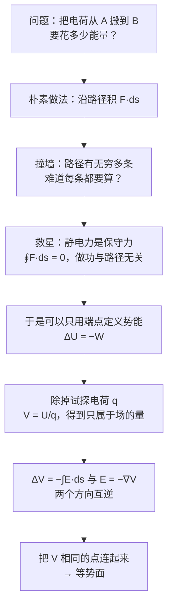
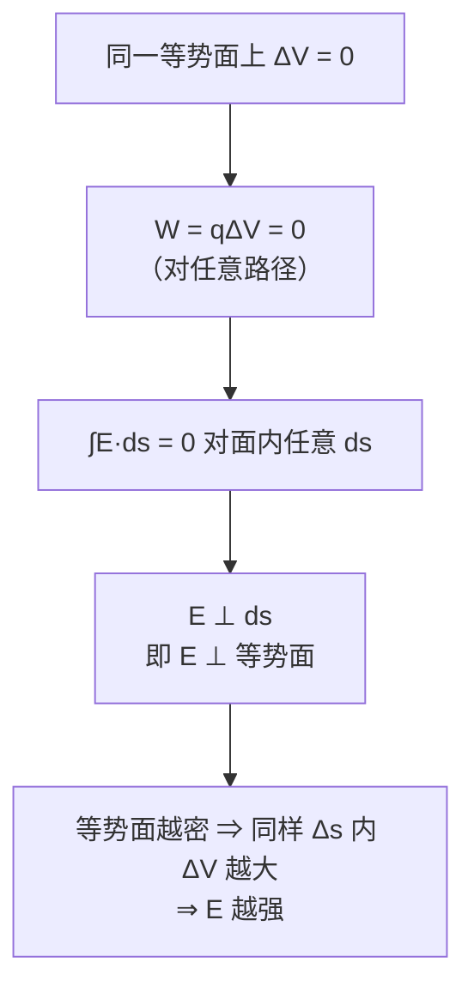

# C24.1 电势与电势能 Electric Potential & Potential Energy

> [!abstract] 这一讲的任务
> 上一讲我们把第 21–23 章串成了一条线：力 → 场 → 通量，每一步都在减少计算量。这一讲要走出最大的一步——**把矢量换成标量**。
> 出发点是一个非常实际的问题：**把一个电荷从 A 搬到 B，要花多少能量？** 顺着这个问题往下追，会依次逼出：静电力是保守力 → 可以定义势能 $U$ → 除掉试探电荷得到电势 $V$ → 电势相等的点连成等势面。整章的骨架就是这一条链。

> [!info] 怎么读这份讲义
> 第 1 节是全章的立足点（保守力），第 2–3 节建立 $U$ 和 $V$，第 4 节把它们画成图（等势面）。第 3 节里那张"$V$ 之于 $U$，正如 $\vec E$ 之于 $\vec F$"的对照表是整章的骨架，看懂它就成功一半。
> 标有 **（拓展）** 或 **【拓展】** 的内容，是**课堂上没有讲到、由课件和教材延伸补充**的部分。复习时可先掌握未标注的主干内容，行有余力再看拓展部分。

---

## 0. 开场：搬一个电子要花多少钱

设想你在设计一支电子枪：要把一个电子从阴极 A 送到阳极 B。**这一趟需要多少能量？**

用第 22 章的办法：先算出路径上每一点的 $\vec E$（矢量），再算力 $\vec F=q\vec E$（矢量），再沿路径积分 $W=\int\vec F\cdot d\vec s$。

> [!question] 停一下，先自己想想
> 问题来了：**从 A 到 B 有无穷多条路径。** 走直线？绕个大弯？贴着电极爬过去？
> 如果不同路径花的能量不同，那"从 A 搬到 B 要多少能量"这个问题根本**没有唯一答案**，你的设计也就无从谈起。

### 救星：静电力是保守力

好消息是：对静电力来说，**所有路径的答案都一样**。

![[C24-保守力做功与路径无关.png]]

课件配图：正电荷 $A$ 沿三条不同路径（1、2、3）移动到 $B$ 附近的同一点，静电力做的功完全相同。

> [!important] 保守力与非保守力（课件对照表）
> | **保守力 Conservative Forces** | **非保守力 Non-Conservative Forces** |
> |---|---|
> | 可以用一个势表示：$\vec F=-\nabla U$ | 不能用势表示 |
> | 守恒能量 (Conserve energy) | 不守恒能量 |
> | **路径无关 (Path independent)** | 路径相关 (Path dependent) |
> | 旋度恒为零：$\nabla\times\vec F=0$ | 旋度不为零：$\nabla\times\vec F\ne0$ |
> | **例**：引力、**静电力 (electrostatic force)** | **例**：摩擦力、空气阻力、**感生电磁力 (induced electromagnetic force)** |
>
> **像引力一样，静电力是保守的。保守力有一个与之相联系的势能。**
> $$\vec F=-\nabla U=-\left(\frac{\partial U}{\partial x}\hat i+\frac{\partial U}{\partial y}\hat j+\frac{\partial U}{\partial z}\hat k\right)$$
> $$\oint\vec F_c\cdot d\vec s=0$$

> [!important] 静电场的环路定理 Circuital theorem of electrostatic field 环路定理
> $$\boxed{\oint\vec E\cdot d\vec s=0}$$

> [!question] 停一下，我们刚才干了什么
> 靠一条"路径无关"，那个无穷多条路径的困境**整个消失了**：既然走哪条都一样，那这个功就**只由起点和终点决定**。
> 而"只由端点决定的量"，正好可以写成**两个端点上各自的一个数之差**——那个数就是**势能**。
> 所有的势能概念（重力势能、弹性势能、电势能）都是这么来的：**先有路径无关，才配有势能。**

> [!warning] 表格右下角那一栏是个重要预告
> **"感生电磁力"（Ch30 的感应电场）是非保守力！**
> 也就是说：**本章建立的一切（电势、等势面、$\oint\vec E\cdot d\vec s=0$）只对静电场成立**。等到 Ch30 出现变化的磁场时，感应电场的环路积分不为零，"电势"这个概念就失效了（或者说需要重新定义）。
> **本章的每一个公式都默默带着"静电"这个前提**，看到这张表就该记住这一点。

> [!note] 环路定理与高斯定律：静电场的两个"骨架方程"
> $$\oint\vec E\cdot d\vec A=\frac{q_{enc}}{\varepsilon_0}\quad\text{（高斯定律：场有源）}$$
> $$\oint\vec E\cdot d\vec s=0\quad\text{（环路定理：场无旋）}$$
> 这两条**完全刻画了静电场**：一个说场线从哪儿来到哪儿去（有源），一个说场线不会自己转圈（无旋，故不闭合，与 [[C22.1 电场]] 中"静电场电场线不闭合"一致）。
> 到 **Ch32 麦克斯韦方程组**，这两条会分别变成第一和第三个方程，只是第三个方程的右边会多出 $-\dfrac{d\Phi_B}{dt}$——那正是感应电场变成非保守力的原因。

---

## 1. 本章的地图与预备信息

第 24 章共五节：

1. Electric Potential & Potential Energy 电势和势能 → 本篇
2. Electric Potential due to Point Charges 点电荷电势 → [[C24.2 点电荷的电势]]
3. Calculating Potential from Field 从电场算电势 → [[C24.3 从电场算电势]]
4. Calculating Potential by Superposition 叠加原理算电势 → [[C24.4 叠加原理算电势]]
5. Calculating Field from Potential 从电势算电场 → [[C24.5 从电势算电场]]

> [!important] 课后作业（课件原文）
> **Problems: 11, 18, 28, 32, 37, 40, 61, 67**

**Keywords（课件列出）**

- Conservative Force, Potential Energy
- Electric Potential, Electric Potential Energy, **Electron-volt**
- Equipotential Surface
- Potential Difference, Zero Potential

> [!important] What is Physics（课件原文三条）
> - **电场力是保守力，因而与一个势能相联系。**（Electric force is conservative, thus it associates with a potential energy.）
> - **势能是标量，它的负梯度就是力。**（Potential energy is a **scalar**, its **negative gradient** is force.）
> - **电荷的排布方式决定了附近空间的电势。**（The **arrangement of charges** influences the electric potential in the near space.）

> [!important] 学习目标 Learning objectives（课件原文）
> - **01** 认识到电场力是**保守力 (conservative)**，因而有一个相联系的**势能 (potential energy)**。
> - **02** 认识到在带电体电场中的**每一点**，该带电体都建立起一个**电势 $V$**。
> - **03** 对置于带电体电场中某点的带电粒子，应用**该点的电势 $V$、粒子电荷 $q$、以及粒子—带电体系统的势能 $U$** 三者的关系。
> - **04** 认识**等势面 (equipotential surfaces)**，并描述它们与相应电场的**方向和大小**的关系。

![[C24-分子的静电势面图.png]]

课件配了三张分子的**静电势面 (electrostatic potential surface)** 图：**水 (Water)**、**苯 (Benzene)**、**一个复杂分子 (A complex molecule)**。用颜色表示分子表面各点的电势——红色是低电势（富电子）、蓝色是高电势（缺电子）。

> [!note] 这三张图想说什么
> 它们是"**电荷排布决定电势分布**"的直观展示，也是电势这个标量场比矢量场好用的最佳广告：
> - **矢量场**要在每一点画一个箭头，三维分子表面上根本没法看。
> - **标量场**只需一个颜色。整张图一眼就能读出"哪里亲电、哪里亲核"。
>
> 这就是计算化学里的 **ESP (electrostatic potential) map**，用来预测反应位点、分子对接、药物与靶点的结合方式。**你在 Ch22 辛苦算的矢量场，到这里被一个标量彻底取代了。**

---

## 2. 电势能 Electric potential energy 电势能

既然做功与路径无关，就可以正式定义势能了。

> [!important] 电势能的定义
> **系统从初始构型 (configuration 构型) 变到末构型时电势能的变化，由静电力做的功 $W$ 给出：**
> $$\boxed{\Delta U=U_f-U_i=-W}$$

![[C24-方形四电荷构型.png]]

课件配了一个正方形四角放 $+q,-q,-q,+q$ 的"构型"示意图。

> [!note] "构型 (configuration)"这个词为什么重要
> 电势能**不属于某一个电荷，而属于整个电荷系统**。说"这个电荷的势能是多少"其实不严格，严格的说法是"**这个电荷与其它电荷构成的系统的势能**"。
> 这一点在 [[C24.2 点电荷的电势]] 的例题 3（三电荷系统的势能）里会看得很清楚：那里的 $U$ 是三对相互作用能之和，无法拆给某一个电荷。
> 学习目标 03 里那句"the potential energy $U$ of the **particle–object system**"（粒子—物体**系统**的势能）就是在强调这件事。

> [!warning] $\Delta U=-W$ 里的负号是怎么来的
> $W$ 是**静电力（场）**做的功。场做正功 → 系统"消耗"了势能 → $U$ 下降。
> 类比重力：物体下落，重力做正功，重力势能下降。**完全同构。**
> 若问的是"**外力**做的功"，那么在准静态（无动能变化）条件下 $W_{ext}=-W_{\text{电}}=\Delta U$，符号相反。**考试务必看清题目问的是场做的功还是外力做的功。**

---

## 3. 电势 Electric potential 电势：把试探电荷除掉

$U$ 已经很好用了，但它有个毛病：**它依赖于你放进去的是什么电荷**。换一个电荷量，$U$ 全变，可场本身明明没变。

这个毛病我们在第 22 章见过一模一样的版本：力 $\vec F$ 依赖试探电荷，于是我们定义 $\vec E=\vec F/q_0$ 把它除掉（[[C22.1 电场]]）。**这里照做一次就行。**

> [!important] 定义
> **在其它物体建立的电场中，某点处的单位电荷所具有的势能，称为该点的电势。**
> $$\boxed{V=\frac Uq}$$
> **电势差 Electric potential difference**：
> $$\Delta V=\frac{\Delta U}{q}$$
> $$\boxed{\Delta V=V_f-V_i=-\int_i^f\vec E\cdot d\vec s}$$
> **单位**：$1\ \mathrm V=1\ \mathrm{J/C}$

> [!important] 课件强调的三点
> - **电势与电场相联系。**（Electric potential is associated with the electric field.）
> - **带电体在其电场中的各点建立起电势 $V$。**
> - **如果我们把一个带电粒子 $q$ 放在已知电势为 $V$ 的一点，就能立刻得到该构型的势能：**
> $$\boxed{U=qV}$$

> [!note] $V$ 之于 $U$，正如 $\vec E$ 之于 $\vec F$——这个平行结构是本章的骨架
> | | 矢量语言 | 标量语言 |
> |---|---|---|
> | 源建立的东西 | 电场 $\vec E$ | 电势 $V$ |
> | 放入电荷 $q$ 后 | 力 $\vec F=q\vec E$ | 势能 $U=qV$ |
> | 两者的关系 | $\vec E=-\nabla V$ | $\vec F=-\nabla U$ |
> | 从场求它 | — | $\Delta V=-\displaystyle\int\vec E\cdot d\vec s$ |
>
> **左列每一样都有右列的标量对应物，而右列算起来简单得多。** 记住这张表，本章就通了一大半。

> [!important] 梯度关系（课件专门一页）
> **静电力是电势能的负梯度：**
> $$\vec F=-\nabla U=-\left(\frac{\partial U}{\partial x}\hat i+\frac{\partial U}{\partial y}\hat j+\frac{\partial U}{\partial z}\hat k\right)$$
> **电场是电势的负梯度：**
> $$\vec E=-\nabla V=-\left(\frac{\partial V}{\partial x}\hat i+\frac{\partial V}{\partial y}\hat j+\frac{\partial V}{\partial z}\hat k\right)$$
> 配合 $\vec F=q\vec E$、$U=qV$（电荷 $q$ 放在**已存在的**电场中）。

> [!question] 课堂追问：把矢量换成标量，方向信息不是丢了吗？
> 没丢。方向信息被藏进了 $V$ 的**空间变化率**里——$\vec E=-\nabla V$ 随时能把它取回来。
> 打个比方：一张地形图上只标海拔（一个标量），但"水往哪儿流"完全可以从等高线读出来。**海拔图没有丢失坡度信息，只是把它编码成了另一种形式。**
> 所以这是一次**无损的信息重新编码**：存储时用标量（省事），需要方向时求一次梯度（也省事）。**代价为零，收益是整套矢量工序作废。**

> [!note] 梯度的几何意义与"负号"
> $\nabla V$ 指向 **$V$ 增长最快**的方向，大小是那个方向上的变化率。加负号后，$\vec E$ 指向 **$V$ 下降最快**的方向。
> 类比地形图：$V$ 是海拔，$-\nabla V$ 是"水往哪儿流"的方向，也就是最陡的下坡方向。**电场就是电势地形的最陡下坡方向，坡越陡场越强。**
> 这个类比在 [[C24.5 从电势算电场]] 里会正式用到。

> [!warning] $\vec E=-\nabla V$ 与 $\Delta V=-\int\vec E\cdot d\vec s$ 是同一件事的两个方向
> - 已知 $\vec E$ 求 $V$：**积分**（[[C24.3 从电场算电势]]）
> - 已知 $V$ 求 $\vec E$：**求导**（[[C24.5 从电势算电场]]）
>
> 两者互逆，就像位移与速度。**注意积分那条给的是"差"，需要额外选一个零点才能定出 $V$ 本身；求导那条不需要——因为常数求导为零，$V$ 的零点选择不影响 $\vec E$。**

### 例题 1 Example 1（课件原题）

> [!example] 题目
> 在均匀电场 $E=150\ \mathrm{N/C}$ 中，一个电子**沿场的反方向**移动了距离 $d=5.20\ \mathrm m$。
> **(a)** 电子的**电势能变化**是多少？
> **(b)** 该处**电场的电势变化**是多少？

![[C24-例题1电子逆场移动.png]]

课件右侧的示意图：绿色箭头 $\vec E$ 向下，红色箭头 $\vec F$ 向上，电子 $-e$ 在下方。

**解 (a)**

$$\Delta U=-W=-\int_i^f\vec F_e\cdot d\vec s=-\int_i^f q\vec E\cdot d\vec s$$

$$W=eEd,\qquad \Delta U=-eEd$$

$$\Delta U=-1.6\times10^{-19}\times150\times5.20=-1.25\times10^{-16}\ \mathrm J$$

$$\Delta U=-780\ \mathrm{eV}$$

**解 (b)**

$$\Delta V=Ed=780\ \mathrm V$$

> [!warning] 符号陷阱：为什么 $\Delta U<0$ 而 $\Delta V>0$
> $$\Delta V=\frac{\Delta U}{q}=\frac{-1.25\times10^{-16}}{-1.6\times10^{-19}}=+780\ \mathrm V$$
> **电荷 $q=-e$ 是负的，除以负数把符号翻了过来。**
> 物理上：电子**逆着** $\vec E$ 运动，就是朝着**电势升高**的方向运动（$\vec E$ 指向电势降低方向），所以 $\Delta V>0$ ✓；同时它受的力 $\vec F=-e\vec E$ 与 $\vec E$ 反向、与运动方向**同向**，场对它做正功，所以 $\Delta U=-W<0$ ✓
> **两个符号都对，而且必须一正一负。** 这是本章最经典的符号陷阱：**$\Delta U$ 和 $\Delta V$ 对负电荷来说符号相反。**

> [!important] 电子伏特 electron-volt 电子伏特（能量单位 unit of energy）
> $$\boxed{1\ \mathrm{eV}=1.60\times10^{-19}\ \mathrm J}$$
> 换算：$\dfrac{1.25\times10^{-16}}{1.60\times10^{-19}}=780$ ✓

> [!note] eV 是从哪来的、为什么要用它
> **定义**：一个元电荷通过 1 V 电势差所获得的能量，$1\ \mathrm{eV}=e\times1\ \mathrm V$。
> **为什么用**：焦耳对微观世界太大了。原子的电离能、化学键能都是几个 eV；用焦耳写全是 $10^{-19}$ 量级，读起来很痛苦。
> **常用尺度感**（值得记住）：
> - 可见光光子：$1.6\sim3.3\ \mathrm{eV}$
> - 化学键：$1\sim10\ \mathrm{eV}$
> - 硅的带隙：$1.12\ \mathrm{eV}$
> - 室温热运动 $kT$：$0.026\ \mathrm{eV}$（$1/40$ eV）
> - X 射线：$\mathrm{keV}$；核反应：$\mathrm{MeV}$（对照 [[C21.1 电荷]] 中对产生的 $1.022$ MeV）
>
> **本题的 780 eV** 说明这个电子获得的能量相当于几百个化学键——在真空管、电子枪里这是很典型的量级。

---

## 4. 等势面 Equipotential surfaces 等势面

有了"每一点一个数"的电势场，就可以像画地形图一样，把**数值相同的点连起来**——得到的就是等势面。

![[C24-等势面匀强场与点电荷.png]]

> [!important] a. 匀强电场 Uniform electric field
> - **等势面 = 一族平行平面**（Equipotential surfaces = planes），垂直于电场线
> - **电场指向电势较低的方向**（Electric fields point toward lower electric potential values.）
> - 图中左侧标 higher electric potential，右侧标 Lower electric potential

> [!important] b. 点电荷的电场
> - **等势面 = 一族同心球面**（Equipotential surfaces = Spheres）
> - 电场线沿径向，处处与球面垂直

![[C24-一般等势面与四条路径.png]]

> [!important] c. 一般情形 Equipotential surfaces in general
> **电势相同的点构成一个等势面。**
> - **当带电粒子在同一等势面上的两点之间移动时，电场对它不做功。**
> - **对连接两个等势面的任意路径，电场对带电粒子做的功都相同。**

课件配图画了四条路径 I、II、III、IV 穿行在四个等势面 $V_1>V_2>V_3>V_4$ 之间：I 和 II 在同一等势面上（$W=0$），III 和 IV 都从 $V_1$ 走到 $V_2$（走法不同但 $W$ 相同）。

> [!question] 停一下，先自己想想
> 上面这两条为什么成立？它们其实**不是新知识**，是第 0 节"路径无关"的直接翻译：
> $W=q\Delta V$，而 $\Delta V$ 只看首末两个等势面的编号。同一面上 $\Delta V=0$ → $W=0$；两个面之间不管怎么走 $\Delta V$ 都一样 → $W$ 一样。**整节课只用了一条原理。**

> [!important] 等势面必定垂直于电场（课件原文的论证）
> **Equipotential surface must be perpendicular to the electric field**，否则电荷会受到一个**平行于该面**的电场力，电场就会在同一等势面上做功（与"同一等势面上不做功"矛盾）。
> **电场线垂直于等势面**（或说电场线平行于等势面的**面矢量**方向）$\Rightarrow\ \vec E\parallel d\vec A$
> $$\Delta V=-\int_i^f\vec E\cdot d\vec s=0\ \Rightarrow\ \vec E\perp d\vec s\quad\text{（电场线与等势面内的运动路径垂直）}$$

> [!note] 三条实用推论（课件没并列写出，但都是考点）
> 1. **等势面永不相交**（一点不能有两个电势值）。与 [[C22.1 电场]] 中"电场线永不相交"配对。
> 2. **等势面越密集的地方场强越大**。因为 $E\approx\left|\dfrac{\Delta V}{\Delta s}\right|$，同样的 $\Delta V$ 间隔挤在更小的 $\Delta s$ 里，$E$ 就大。**画等势面时通常取等间隔的 $\Delta V$，于是疏密就直接读出场强**——和地形图的等高线完全一样（等高线密 = 坡陡）。
> 3. **导体表面是等势面**。因为导体内 $\vec E=0$（[[C23.3 带电导体的电场]]），任意两点间 $\Delta V=-\int\vec E\cdot d\vec s=0$。**整个导体（包括表面和内部）是一个等势体**。这直接解释了为什么导体表面的 $\vec E$ 必须垂直于表面。

---

## 这一讲的三句话

1. **静电力是保守力**（$\oint\vec E\cdot d\vec s=0$），所以做功与路径无关，才配有势能 $\Delta U=-W$；这条前提在 Ch30 的感应电场里会失效。
2. **$V=U/q$ 把试探电荷除掉**，于是 $V$ 只属于场本身。四个量的关系：$U=qV$、$\vec F=q\vec E$、$\vec E=-\nabla V$、$\Delta V=-\int\vec E\cdot d\vec s$。**换成标量没有丢方向信息**，它藏在梯度里。
3. **等势面处处垂直于 $\vec E$，$\vec E$ 指向电势降低方向，等势面越密场越强**；导体是等势体。

> [!important] 必背
> $$\oint\vec E\cdot d\vec s=0,\qquad \Delta U=-W,\qquad V=\frac Uq,\qquad U=qV,\qquad \Delta V=-\int_i^f\vec E\cdot d\vec s,\qquad \vec E=-\nabla V$$
> $$1\ \mathrm V=1\ \mathrm{J/C},\qquad 1\ \mathrm{eV}=1.60\times10^{-19}\ \mathrm J$$

> [!abstract] 下一讲预告
> 框架搭好了，但我们还一个具体的电势都没算过。下一讲从最简单的源开始：**一个点电荷**。
> 然后立刻会遇到一道极好的概念题：**12 个电子摆在圆周上，把它们全挤到一侧，圆心的电势变不变？** 答案会让"标量"这两个字变得非常具体。

---

## 本节自测 Self-Test

> [!question] 1. 保守力有哪四条等价刻画？静电力和感生电磁力各属哪类？

> [!success]- 参考答案
> 可用势表示 $\vec F=-\nabla U$；守恒能量；做功路径无关；旋度为零。静电力保守；**感生电磁力（Ch30）非保守**——所以本章一切只对静电场成立。

> [!question] 2. 写出静电场的两个骨架方程，各说明什么？

> [!success]- 参考答案
> $\oint\vec E\cdot d\vec A=q_{enc}/\varepsilon_0$（有源）；$\oint\vec E\cdot d\vec s=0$（无旋）。到 Ch32 它们分别成为麦克斯韦方程组的第一和第三条。

> [!question] 3. $\Delta U=-W$ 中的 $W$ 是谁做的功？外力做功等于什么？

> [!success]- 参考答案
> 是**静电力（场）**做的功。准静态下外力做功 $W_{ext}=\Delta U=-W_{\text{电}}$。审题时务必看清问的是哪一个。

> [!question] 4. 写出 $V$、$U$、$\vec E$、$\vec F$ 四者之间的全部关系。

> [!success]- 参考答案
> $V=U/q$，$U=qV$；$\vec F=q\vec E$；$\vec E=-\nabla V$，$\vec F=-\nabla U$；$\Delta V=-\int\vec E\cdot d\vec s$。

> [!question] 5. 例题 1 中为什么 $\Delta U<0$ 而 $\Delta V>0$？

> [!success]- 参考答案
> $\Delta V=\Delta U/q$，电子 $q=-e<0$，除以负数翻符号。物理上：电子逆场运动即走向高电势（$\Delta V>0$），而场力与运动同向做正功（$\Delta U<0$）。

> [!question] 6. 1 eV 等于多少焦耳？为什么要用它？列举几个尺度。

> [!success]- 参考答案
> $1.60\times10^{-19}$ J。焦耳对微观太大。可见光光子 1.6–3.3 eV，化学键 1–10 eV，硅带隙 1.12 eV，室温 $kT\approx0.026$ eV，X 射线 keV，核反应 MeV。

> [!question] 7. 为什么等势面必须垂直于电场？等势面的疏密说明什么？

> [!success]- 参考答案
> 若不垂直，电场有沿面的分量，在同一等势面上移动就会做功，与 $\Delta V=0$ 矛盾。疏密对应 $E\approx|\Delta V/\Delta s|$：越密场越强（类比等高线越密坡越陡）。

> [!question] 8. 为什么整个导体是等势体？

> [!success]- 参考答案
> 导体内 $\vec E=0$，故任意两点 $\Delta V=-\int\vec E\cdot d\vec s=0$。这也解释了导体表面 $\vec E$ 必垂直于表面。

> [!question] 9. 把矢量 $\vec E$ 换成标量 $V$，为什么说没有丢失信息？

> [!success]- 参考答案
> 方向信息被编码进了 $V$ 的空间变化率，$\vec E=-\nabla V$ 随时可以取回。类比地形图：只标海拔（标量），但坡度和水流方向完全可以从等高线读出。

---

上一节 ← [[C24.0 开篇回顾 第21章遗留习题]] ｜ 下一节 → [[C24.2 点电荷的电势]]
索引 → [[电磁学 MOC]]
