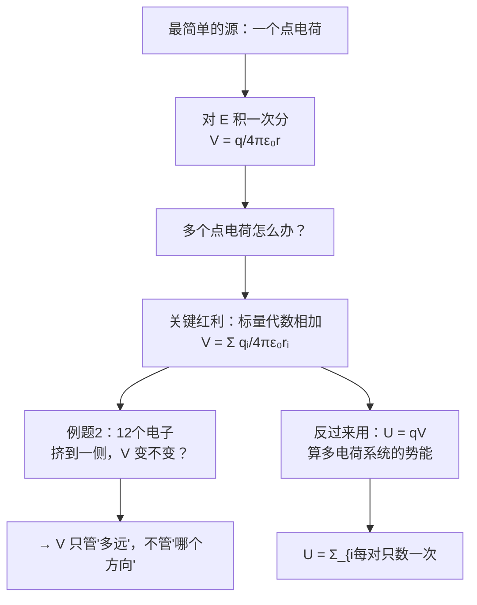

# C24.2 点电荷的电势 Electric Potential due to Point Charges

> [!abstract] 这一讲的任务
> 上一讲把框架搭好了：$V=U/q$，$\Delta V=-\int\vec E\cdot d\vec s$。但我们一个具体的数都还没算过。
> 这一讲从最简单的源开始——**一个点电荷**——然后立刻推广到一堆点电荷。推广的那一步会带来本章最大的红利：**电势叠加是代数相加，不是矢量相加。** 最后我们用这一条去算多电荷系统的**电势能**。

> [!info] 怎么读这份讲义
> 第 2 节的例题 2 是全章最好的一道概念题，务必自己先想，再看解答。第 3 节的 $\sum_{i<j}$ 要弄清楚"为什么每对只数一次"。
> 标有 **（拓展）** 或 **【拓展】** 的内容，是**课堂上没有讲到、由课件和教材延伸补充**的部分。复习时可先掌握未标注的主干内容，行有余力再看拓展部分。

---

## 0. 开场：把第一个电势算出来

上一讲给了工具 $V=-\displaystyle\int\vec E\cdot d\vec r$，也给了第 22 章的点电荷场 $E=\dfrac{q}{4\pi\varepsilon_0r^2}$。两者一拼，第一个电势就出来了。

![[C24-点电荷电势的积分路径.png]]

$$E(r)=\frac{q}{4\pi\varepsilon_0r^2},\qquad V(r)=-\int E(r)\,dr$$

> [!important] 结果
> $$\boxed{V(r)=\frac{q}{4\pi\varepsilon_0 r},\qquad V(\infty)=0}$$

> [!note] 补上这个不定积分（课件直接给结果）
> $$V(r)=-\int\frac{q}{4\pi\varepsilon_0r^2}dr=-\frac{q}{4\pi\varepsilon_0}\int r^{-2}dr=-\frac{q}{4\pi\varepsilon_0}\cdot\left(-\frac1r\right)+C=\frac{q}{4\pi\varepsilon_0r}+C$$
> 取 $V(\infty)=0$ 得 $C=0$。**这就是"选无穷远为零电势点"的全部含义**——它只是在定一个积分常数。

> [!important] 符号规则（课件学习目标 02）
> **若取无穷远处 $V=0$**：
> - **正电荷**产生**正电势**（$V>0$）
> - **负电荷**产生**负电势**（$V<0$）

> [!warning] $V\propto 1/r$，$E\propto1/r^2$——衰减快慢不同
> $$E=\frac{q}{4\pi\varepsilon_0r^2}\qquad V=\frac{q}{4\pi\varepsilon_0r}$$
> **电势比场衰减得慢一个 $1/r$。** 这不是巧合：$V$ 是 $E$ 对 $r$ 的积分，积分一次就把幂次抬高一阶。
> 实用后果：**远处电势的影响比电场持久**。这也是为什么等势面在远处仍能画得清楚，而电场线已经很稀疏了。

> [!warning] $V$ 里的 $q$ 带符号，且没有绝对值
> 与 $\vec E$ 的矢量式一样，$V$ 的公式里 $q$ **必须带符号**。这正是"标量代数和"能自动处理正负电荷的原因：负电荷贡献负电势，加起来就自动抵消了一部分。
> **千万不要写成 $|q|$。**

---

## 1. 多个点电荷：本章最大的红利

> [!question] 停一下，先自己想想
> 现在有六个点电荷，问某一点的电势。你需要做哪些工作？
> 回忆 [[C22.2 点电荷的电场]] 求**场**的流程：算每个 $\vec E_i$ 的大小 → 判断方向 → 分解成 $x$、$y$ 分量 → 分别求和 → 合成大小 → 用 $\arctan$ 求方向（还要检查象限）。六个电荷，光分量就要写十二个。
> **求电势要做哪几步？**

答案是：**量距离，然后相加。完了。**

> [!important] 电势叠加原理 Superposition principle of electric potentials 电势叠加原理
> $$V(\vec r)=\sum_{i=1}^N V_i(\vec r),\qquad V_i(r_i)=-\int E_i(r_i)\,dr_i,\qquad E(r_i)=\frac{q_i}{4\pi\varepsilon_0r_i^2}$$
> $$\boxed{V(r_1,r_2,\ldots,r_N)=\frac{1}{4\pi\varepsilon_0}\sum_{i=1}^{N}\frac{q_i}{r_i},\qquad V(\infty)=0}$$

> [!important] 课件学习目标 03 是本章的分水岭
> **01** 对**带电粒子**电场中的给定点，应用**电势 $V$、粒子电荷 $q$、到粒子的距离 $r$** 三者的关系。
> **02** 认识**粒子建立的电势的代数符号与粒子电荷的符号之间的对应关系**。
> **03** 计算**多个带电粒子**在任一给定点产生的**合电势**，并认识到用的是**代数相加 (algebraic addition)，不是矢量相加 (not vector addition)**。
>
> **电势叠加是标量代数和，电场叠加是矢量和。** 这一个差别把 [[C22.2 点电荷的电场]] 里"分解分量、检查象限"的全套工序都省掉了。
> 代价：**$V$ 丢掉了方向信息**。但方向信息并没有真的丢——它藏在 $V$ 的**空间变化率**里，随时可以用 $\vec E=-\nabla V$ 取回来（[[C24.5 从电势算电场]]）。**这是一次无损的信息重新编码。**

![[C24-六个点电荷的电势叠加.png]]

课件给了一个六电荷的算例：一个 $d\times2d$ 的矩形，上排从左到右 $+5.0q$、$-2.0q$、$-3.0q$，下排 $+3.0q$、$-2.0q$、$+5.0q$，求**中心**处的电势，结果为

$$V=\frac{q}{\pi\varepsilon_0d}\left(\sqrt5-2\right)$$

> [!note] 这个算例怎么来的（课件只给答案）
> 设中心为原点。六个电荷分成两类：
> - **中间两个**（$-2.0q$ 各一个，上下）：距中心 $d/2$
> - **四个角**：距中心 $\sqrt{(d)^2+(d/2)^2}=\dfrac{d\sqrt5}{2}$
>
> 角上四个电荷之和：$5.0q-3.0q+3.0q+5.0q=10.0q$
> 中间两个之和：$-2.0q-2.0q=-4.0q$
>
> $$V=\frac{1}{4\pi\varepsilon_0}\left[\frac{10.0q}{\dfrac{d\sqrt5}{2}}+\frac{-4.0q}{\dfrac d2}\right]=\frac{1}{4\pi\varepsilon_0}\cdot\frac{2q}{d}\left[\frac{10}{\sqrt5}-4\right]=\frac{q}{2\pi\varepsilon_0d}\left(2\sqrt5-4\right)=\frac{q}{\pi\varepsilon_0 d}\left(\sqrt5-2\right)\ ✓$$
> （用了 $\dfrac{10}{\sqrt5}=2\sqrt5$。）

> [!question] 停一下，我们刚才干了什么
> 注意这道题里做过的**全部工作**：量距离、把同距离的电荷**电荷量直接相加**、代公式。
> **没有画一个箭头、没有分解一个分量、没有用一次 $\arctan$。** 同一道题若问电场，工作量至少是这的五倍。
> 而且注意那个技巧：**距离相同的电荷可以先把电荷量加起来**——因为它们在公式里共用同一个分母。这在标量世界里是合法的，在矢量世界里绝对不行（方向不同）。

---

## 2. 例题 2：一道把"标量"讲透的题

> [!example] 题目（课件原题）
> **12 个电子**均匀分布在半径为 $R$ 的圆周上。**圆心处**的电势是多少？

![[C24-例题2圆周上12个电子.png]]

**解**

$$V=-\frac{e}{4\pi\varepsilon_0R}\times12=-\frac{3e}{\pi\varepsilon_0R}$$

> [!question] 课堂追问：**如果把 12 个电子挤到圆周的一侧（不再均匀分布），圆心的电势是多少？**
> 课件在这里配了第二张图：12 个电子全部挤在圆的左半侧，圆心画着一个大问号。
> **先自己想 30 秒再往下看。**
>
> **答案是一样的 (The answer is the same)。**

> [!note] 为什么位置无所谓——想清楚这一点，本章就懂了一半
> $V=\dfrac{1}{4\pi\varepsilon_0}\sum\dfrac{q_i}{r_i}$ **只依赖每个电荷到该点的距离 $r_i$**。12 个电子无论怎么排，**每一个到圆心的距离都是 $R$**，所以每一项都不变，和当然不变。
> **对比一下电场**：均匀分布时 12 个 $\vec E_i$ 两两对称抵消，$\vec E_{\text{中心}}=0$；挤到一侧时完全不抵消，$\vec E_{\text{中心}}\ne0$，**电场变了而电势没变**。
>
> 这生动地说明了：
> - $V$ 是**标量**，只管"多远"，不管"在哪个方向"。
> - $\vec E$ 是**矢量**，方向至关重要。
> - $V$ 相同**不代表** $\vec E$ 相同——因为 $\vec E=-\nabla V$ 取的是**变化率**，两种排布下圆心的 $V$ 相同，但**圆心附近**的 $V$ 分布不同，梯度自然不同。
>
> **这是本章最好的一道概念题，务必能自己讲出来。**

> [!warning] 反过来也要成立：$\vec E=0$ 不代表 $V=0$
> 均匀排布时圆心 $\vec E=0$，但 $V=-\dfrac{3e}{\pi\varepsilon_0R}\ne0$。
> 同样，[[C23.4 对称带电绝缘体的电场]] 中均匀带电球壳内部 $\vec E=0$，但 $V$ 是一个不为零的常数（见 [[C24.3 从电场算电势]] 的例题 4）。
> **$E=0$ 只说明 $V$ 不随位置变化，不说明 $V$ 的值。** 这与 [[C21.3 库仑定律]] 壳层定理那里埋的伏笔终于在这里兑现。

---

## 3. 反过来用：多点电荷系统的电势能

有了 $V$，$U=qV$ 就把势能送上门了。这一节我们用它算**整个系统**的势能。

> [!example] 例题 3（课件原题）
> 三个电荷被固定在确定位置上（等边三角形，边长 $d$；图中 $q_1$、$q_3$ 为正，$q_2$ 为负）。这个**系统的电势能**是多少？

![[C24-例题3三电荷系统的势能.png]]

**解 Solution（用 $U=qV$）**

$$U_{12}=\frac{q_1q_2}{4\pi\varepsilon_0 d},\qquad U_{13}=\frac{q_1q_3}{4\pi\varepsilon_0 d},\qquad U_{23}=\frac{q_2q_3}{4\pi\varepsilon_0 d}$$

$$U=U_{12}+U_{13}+U_{23}$$

> [!important] 推论 Corollary 推论（课件原文）
> **一个构型中多个点电荷的电势能为**
> $$\boxed{U=\frac{1}{4\pi\varepsilon_0}\sum_{i<j}\frac{q_iq_j}{r_{ij}}}$$

> [!question] 停一下：为什么是 $i<j$ 而不是对所有 $i,j$ 求和？
> 因为 $U_{12}$ 和 $U_{21}$ 说的是**同一对**电荷的相互作用能，数两次就翻倍了。
> 想验证这一点，最好的办法是问：**这个 $U$ 到底是什么功？**

> [!note] 这个 $U$ 的物理含义：把电荷从无穷远搬来所需的功
> 想象从空无一物开始，把电荷一个个从无穷远搬到位：
> - 搬第 1 个：周围没有场，**不需要做功**
> - 搬第 2 个：要克服 $q_1$ 的场，做功 $\dfrac{q_1q_2}{4\pi\varepsilon_0r_{12}}$
> - 搬第 3 个：要克服 $q_1$ 和 $q_2$ 的场，做功 $\dfrac{q_1q_3}{4\pi\varepsilon_0r_{13}}+\dfrac{q_2q_3}{4\pi\varepsilon_0r_{23}}$
>
> 总功正好是三项之和 ✓ **每一对只在"后来者搬到"的那一步被数一次**，这就是 $i<j$ 的来源。

> [!warning] $i<j$ 这个条件是全式的灵魂
> 它保证**每一对电荷只数一次**。如果写成 $\sum_{i\ne j}$，每对会被数两次（$U_{12}$ 和 $U_{21}$），结果偏大一倍；那时必须补一个 $\dfrac12$：
> $$U=\frac{1}{2}\cdot\frac{1}{4\pi\varepsilon_0}\sum_{i\ne j}\frac{q_iq_j}{r_{ij}}$$
> **两种写法等价，但不能混用。** 三个电荷有 $C_3^2=3$ 对，$N$ 个电荷有 $\dfrac{N(N-1)}{2}$ 对。

> [!warning] $U$ 属于系统，不属于某个电荷
> $U_{12}$ 不是"$q_1$ 的势能"也不是"$q_2$ 的势能"，而是**这一对**的相互作用能。这呼应了 [[C24.1 电势与电势能]] 中"构型 (configuration)"那个用词。
> **实用后果**：题目问"把 $q_3$ 移到无穷远需要做多少功"时，答案是 $-(U_{13}+U_{23})$，**只去掉与 $q_3$ 有关的项**，$U_{12}$ 不动（因为 $q_1,q_2$ 没动）。

> [!note] 与 $U=qV$ 的关系
> 也可以这样理解：$U_{13}+U_{23}=q_3\cdot V_{3}$，其中 $V_3$ 是 $q_1,q_2$ 在 $q_3$ 位置产生的电势。**先算 $V$ 再乘 $q$，比逐对写更快**，尤其电荷多的时候。

---

## 这一讲的三句话

1. **$V=\dfrac{q}{4\pi\varepsilon_0r}$（取 $V(\infty)=0$）**，$q$ 带符号不加绝对值；$V\propto1/r$ 比 $E\propto1/r^2$ 衰减慢一阶，因为 $V$ 是 $E$ 的积分。
2. **电势叠加是代数相加**：$V=\dfrac{1}{4\pi\varepsilon_0}\sum\dfrac{q_i}{r_i}$，只管距离不管方向。例题 2：电子怎么挪，只要到圆心距离不变，$V$ 就不变——而 $\vec E$ 会变。
3. **系统势能 $U=\dfrac{1}{4\pi\varepsilon_0}\sum_{i<j}\dfrac{q_iq_j}{r_{ij}}$**，$i<j$ 保证每对只数一次；$U$ 属于**整个构型**，不属于某个电荷。

> [!important] 必背
> $$V=\frac{q}{4\pi\varepsilon_0r},\qquad V=\frac{1}{4\pi\varepsilon_0}\sum_i\frac{q_i}{r_i},\qquad U=\frac{1}{4\pi\varepsilon_0}\sum_{i<j}\frac{q_iq_j}{r_{ij}}$$

> [!abstract] 下一讲预告
> 到这里我们求电势的办法只有一条：**已知每个电荷在哪儿，加起来**。可如果题目给的不是电荷分布，而是**电场**呢（比如高斯定律已经把 $\vec E$ 算出来了）？
> 下一讲走另一条路：$\Delta V=-\int\vec E\cdot d\vec s$。路上会踩到一个真正的陷阱——**对无限长带电线，"取无穷远为零电势"这个习惯做法会直接算出无穷大。**

---

## 本节自测 Self-Test

> [!question] 1. 写出单点电荷的电势公式，说明零点选在哪里、符号规则如何。

> [!success]- 参考答案
> $V=\dfrac{q}{4\pi\varepsilon_0r}$，$V(\infty)=0$。正电荷产生正电势，负电荷产生负电势；$q$ 必须带符号，不加绝对值。

> [!question] 2. 为什么 $V\propto1/r$ 而 $E\propto1/r^2$？

> [!success]- 参考答案
> $V$ 是 $E$ 对 $r$ 的积分，积分一次把幂次抬高一阶。所以电势比场衰减慢一个 $1/r$。

> [!question] 3. 电势叠加与电场叠加最本质的区别是什么？

> [!success]- 参考答案
> 电势是**标量代数和**（只看距离），电场是**矢量和**（要分解分量）。方向信息没丢，藏在 $V$ 的梯度里。

> [!question] 4. 例题 2 中把 12 个电子挤到一侧，圆心的 $V$ 和 $\vec E$ 分别怎么变？

> [!success]- 参考答案
> $V$ **不变**（每个电荷到圆心的距离仍是 $R$）；$\vec E$ **改变**（原来对称抵消为零，现在不为零）。

> [!question] 5. "$\vec E=0$ 的地方 $V$ 一定为零"对吗？举反例。

> [!success]- 参考答案
> 不对。均匀分布 12 电子的圆心 $\vec E=0$ 但 $V=-3e/\pi\varepsilon_0R$；均匀带电球壳内 $\vec E=0$ 但 $V$ 是非零常数。$E=0$ 只说明 $V$ 不随位置变化。

> [!question] 6. 多电荷系统的势能公式为什么写成 $\sum_{i<j}$？

> [!success]- 参考答案
> 保证每对只数一次。写成 $\sum_{i\ne j}$ 则需补因子 $1/2$。$N$ 个电荷共 $N(N-1)/2$ 对。物理上对应"逐个从无穷远搬来"时每对只在后来者到位那一步被计入。

> [!question] 7. 例题 3 中把 $q_3$ 移到无穷远需做多少功？

> [!success]- 参考答案
> 外力做功 $=-(U_{13}+U_{23})$；$U_{12}$ 不变，因为 $q_1,q_2$ 未动。

> [!question] 8. 六电荷算例里"把距离相同的电荷的电荷量先加起来"这一步，为什么在求电场时不能这么做？

> [!success]- 参考答案
> 因为电势是标量，同一距离的各项共用同一个分母 $r$，可以先把分子加起来。电场是矢量，距离相同但**方向不同**，必须分解后再合成，不能直接把 $q$ 相加。

---

上一节 ← [[C24.1 电势与电势能]] ｜ 下一节 → [[C24.3 从电场算电势]]
索引 → [[电磁学 MOC]]
