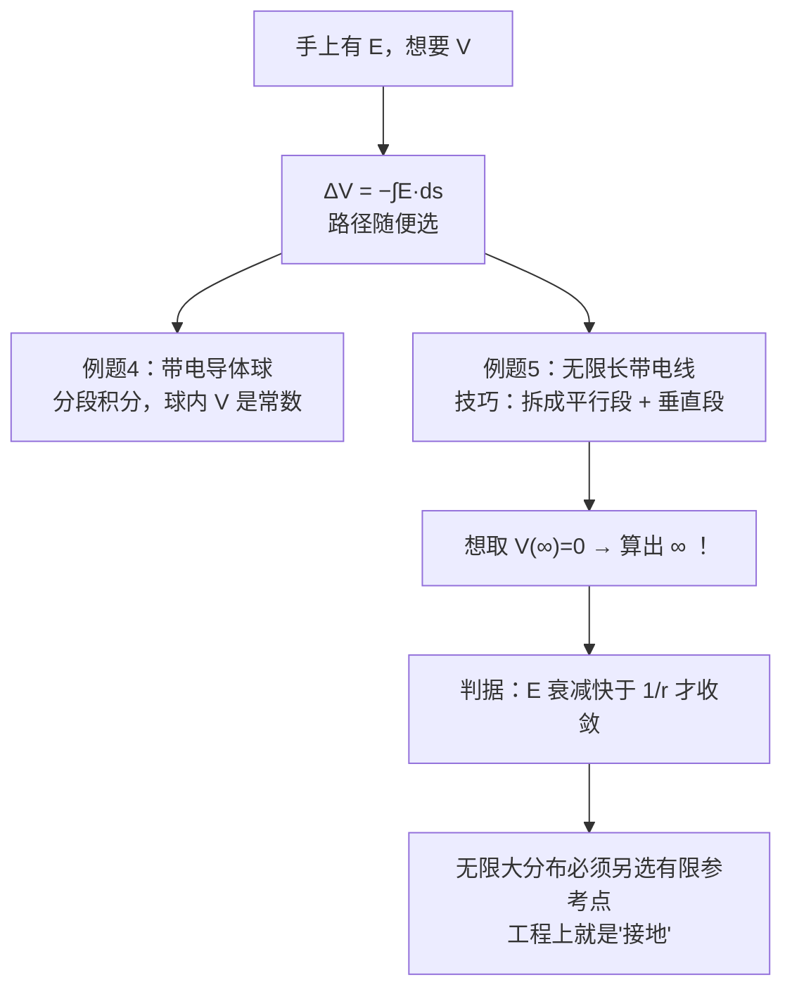
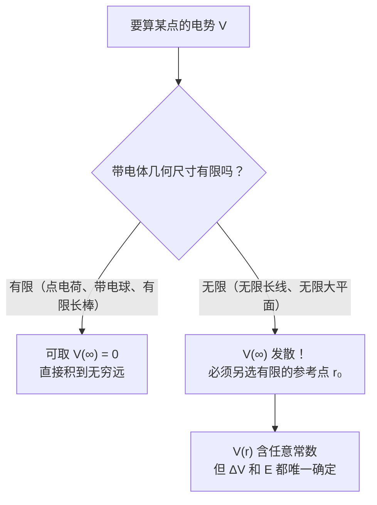

# C24.3 从电场算电势 Calculating Potential from Field

> [!abstract] 这一讲的任务
> 上一讲求电势的办法只有一条：知道每个电荷在哪儿，加起来。可很多时候手上拿到的是**电场**——第 23 章用高斯定律辛辛苦苦算出来的那些 $\vec E$，总不能浪费。
> 这一讲走另一条路：$\Delta V=-\int\vec E\cdot d\vec s$。两道例题分别教两件事：**怎么挑一条好走的路径**，以及**零电势点该选在哪儿**。第二件事上有个很多人会栽的坑：对无限长带电线，"取无穷远为零"会直接算出无穷大。

> [!info] 怎么读这份讲义
> 第 1、2 节是两道例题，第 3 节是全章概念上最要紧的一节（零势点）。第 3 节的判据值得背下来。
> 标有 **（拓展）** 或 **【拓展】** 的内容，是**课堂上没有讲到、由课件和教材延伸补充**的部分。复习时可先掌握未标注的主干内容，行有余力再看拓展部分。

---

## 0. 开场：把高斯定律的成果接过来

第 23 章我们用高斯定律算了一堆场：带电导体球、无限长带电线、无限大平板……每一个都只用几行就出来了，因为对称性太好用。

现在想知道这些情形下的**电势**。要不要回头去把电荷切成微元、一项项加起来（[[C24.2 点电荷的电势]] 的办法）？**完全不必**——$\vec E$ 已经在手上了，积一次分就行。

> [!important] 学习目标 Learning objectives（课件原文）
> - **01** 给定一个**电场**，计算**电势**。
> - **02** 场对电荷做的功：
>   $$dW=\vec F\cdot d\vec s=q_0\vec E\cdot d\vec s$$
> - **03** 势能的变化：
>   $$\Delta U=-q_0\int_i^f\vec E\cdot d\vec s$$

![[C24-任意路径上场做的功.png]]

课件配图：试探电荷 $q_0$ 沿一条任意曲线（绿色 Path）从 $i$ 走到 $f$，穿过一族电场线（Field line），每一点上受力 $q_0\vec E$，位移元 $d\vec s$。

> [!important] 两个核心公式
> **电势的变化（定积分形式）**：
> $$\boxed{\Delta V=V_f-V_i=-\int_i^f\vec E\cdot d\vec s}$$
> **不定积分形式 (indefinite integral)**：
> $$\boxed{V=-\int\vec E\cdot d\vec s}$$

> [!question] 停一下，先自己想想
> 这个积分看着就麻烦：$\vec E\cdot d\vec s$ 里的夹角一路在变，曲线还可能拐来拐去。
> **但有一件事我们在 [[C24.1 电势与电势能]] 已经证明了，它能让这个积分变得几乎不用算。是哪件事？**

> [!note] 路径无关——本节最重要的解题技巧
> 因为静电力是保守力，$\oint\vec E\cdot d\vec s=0$（环路定理）。既然**走哪条路结果都一样**，那就**挑最好算的那条走**：
> - 沿电场方向走：$\vec E\cdot d\vec s=E\,ds$，点乘退化成标量乘
> - 沿垂直于电场的方向走：$\vec E\cdot d\vec s=0$，这一段**直接白送**
>
> 例题 5 就是把这两招都用上的典型。**以后遇到 $\int\vec E\cdot d\vec s$，第一反应永远是："能不能拆成平行段 + 垂直段？"**

> [!warning] 定积分给"差"，不定积分给"值"——但后者需要定零点
> $\Delta V$ 永远有确定含义（可测量）。而 $V$ 本身**依赖零点的选择**，所以说"某点的电势是 5 V"必须先讲清零点在哪。
> 这一点在下面的例题 5 会变成一个真正的陷阱。

---

## 1. 例题 4：带电导体球（课件原题，Problem 24-67）

> [!example] 题目
> 求一个总电荷为 $q$、半径为 $R$ 的**带电球形导体**的电势。

![[C24-例题4带电导体球的场与电势曲线.png]]

**解 Solution（课件原文）**

**内部电场为零，外部电场垂直于表面。**（The electric field inside is zero. The electric field outside is **perpendicular to** the surface.）

$$\text{If}\ r<R,\quad E(r)=0$$
$$\text{If}\ r>R,\quad E(r)=\frac{q}{4\pi\varepsilon_0r^2}$$

$$V(r)-V(\infty)=-\int_\infty^r E(r)\,dr,\qquad V(\infty)=0$$

**For $r>R$：**

$$V(r)=-\int_\infty^r\frac{q}{4\pi\varepsilon_0r^2}dr=\frac{q}{4\pi\varepsilon_0 r}$$

**For $r<R$：**

$$V(r)=-\int_\infty^R\frac{q}{4\pi\varepsilon_0r^2}dr-\int_R^r 0\,dr=\boxed{\frac{q}{4\pi\varepsilon_0R}}$$

> [!question] 课堂追问：球内 $\vec E=0$，为什么 $V$ 不是 0？
> 这是最容易混淆的一点。$V$ 不是由**这一点**的 $E$ 决定的，而是由**从零势点走到这一点沿途所有的 $E$** 决定的。
> 从 $\infty$ 走到球心，路上经过了 $r>R$ 那一段有场的区域，**电势在那一段就已经攒起来了**；进了球壳之后 $E=0$，电势不再变化，于是**保持在进门时的值**。
> 一句话：**$E=0$ 意味着 $V$ 不变，不意味着 $V=0$。**

> [!important] 结论：球内电势是常数，等于表面电势
> 课件下方画了 $E(r)$（红线）和 $V(r)$（蓝线）的对照曲线：
> - $r<R$：$E=0$（红线贴着横轴）；$V=\dfrac{q}{4\pi\varepsilon_0R}$（蓝线**水平**）
> - $r=R$：$E$ 突然跳到 $\dfrac{q}{4\pi\varepsilon_0R^2}$（**不连续**）；$V$ 达到最大值后开始下降（**连续**）
> - $r>R$：$E\propto1/r^2$；$V\propto1/r$（蓝线在红线上方，衰减更慢）

> [!note] 三个必须读懂的图形特征
> **① 为什么内部积分"分两段"**
> 从 $\infty$ 走到 $r<R$ 必须穿过表面，而表面内外 $E$ 的表达式不同，所以拆成 $\infty\to R$ 和 $R\to r$ 两段。**第二段 $E=0$，贡献为零**，所以内部电势就等于表面电势。
> **② 为什么 $E$ 在 $r=R$ 处不连续而 $V$ 连续**
> $E$ 在表面有跳变（0 → $\sigma/\varepsilon_0$），这是面电荷层的特征。而 $V=-\int E\,dr$ 是 $E$ 的积分，**积分会把有限的跳变抹平**——一个有限跳变的函数积分出来必定连续。
> **通用结论：$V$ 处处连续，$E$ 可以在面电荷处跳变。** 这是判断答案对不对的有力检验。
> **③ 为什么 $V$ 曲线在 $E$ 曲线上方**
> $V\propto1/r$ 比 $E\propto1/r^2$ 衰减慢（[[C24.2 点电荷的电势]]）。

> [!important] 这道题兑现了 [[C21.3 库仑定律]] 埋的伏笔
> 那里说过："壳内 $\vec E=0$ **不等于** $V=0$；$V$ 在壳内是常数且等于表面电势。"
> 现在算出来了：$V_{\text{内}}=\dfrac{q}{4\pi\varepsilon_0R}$，是一个**不为零的常数** ✓
> 物理上：$\vec E=-\nabla V=0$ 只说明 $V$ **不随位置变化**，完全没说 $V$ 等于多少。

> [!note] 与 [[C24.1 电势与电势能]] "导体是等势体"的呼应
> 本题算出的"球内 $V$ = 常数 = 表面电势"，正是那条一般结论在球形导体上的具体化。**任何形状的导体都有这个性质**，球形只是让我们能把数值算出来。

---

## 2. 例题 5：无限长带电线——先看技巧，再看陷阱

> [!example] 题目（课件原题）
> 一根**无限长直线**具有线电荷密度 $\lambda$。求 $a$ 点与 $c$ 点之间的**电势差**。

![[C24-例题5无限长带电线的折线路径.png]]

课件配图：竖直的带电直线，$a$ 点在距线 $r_a$ 处；从 $a$ **先水平向右**走到 $b$（距线 $r_b$），**再竖直向下**走到 $c$（距线 $r_c$）；图中注明 $r_b=r_c$。

> [!question] 停一下，先自己想想
> 从 $a$ 直接连一条直线到 $c$，$\vec E$ 与 $d\vec l$ 的夹角一路都在变，这个积分会很难看。
> **既然路径随便选，你会怎么走？**

**解 Solution（课件原文）**

已知（[[C23.4 对称带电绝缘体的电场]]）：$E=\dfrac{\lambda}{2\pi\varepsilon_0 r}$

$$\Delta V_{ac}=V_a-V_c=-\int_c^a\vec E\cdot d\vec l=\int_a^c\vec E\cdot d\vec l$$

**分成两段**：

$$=\int_{r_a}^{r_b}\frac{\lambda}{2\pi\varepsilon_0r}\cos0^\circ\,dr+\int_{r_b}^{r_c}\frac{\lambda}{2\pi\varepsilon_0r_c}\cos90^\circ\,dl$$

$$=\frac{\lambda}{2\pi\varepsilon_0}\ln\frac{r_b}{r_a}+0=\boxed{\frac{\lambda}{2\pi\varepsilon_0}\ln\frac{r_c}{r_a}}$$

（最后一步用了 $r_b=r_c$。）

> [!important] 这道题的全部技巧：选一条聪明的路径
> 课件把路径拆成两段，各自都是"送分"的：
> - **$a\to b$：沿径向**（垂直于带电线，与 $\vec E$ **平行**）→ $\cos0^\circ=1$，退化成一维积分 $\int\dfrac{dr}{r}=\ln r$
> - **$b\to c$：沿平行于带电线的方向**（与 $\vec E$ **垂直**）→ $\cos90^\circ=0$，**整段贡献为零**
>
> **能这样做的唯一理由是路径无关**（$\oint\vec E\cdot d\vec s=0$）。

> [!note] 补上那个对数积分
> $$\int_{r_a}^{r_b}\frac{\lambda}{2\pi\varepsilon_0 r}dr=\frac{\lambda}{2\pi\varepsilon_0}\Big[\ln r\Big]_{r_a}^{r_b}=\frac{\lambda}{2\pi\varepsilon_0}\ln\frac{r_b}{r_a}$$
> **注意 $E\propto1/r$ 积出来是对数**，而点电荷的 $E\propto1/r^2$ 积出来是 $1/r$。**衰减律决定了电势的函数形式**：
> | 源 | $E$ | $V$ |
> |---|---|---|
> | 点电荷 | $\propto1/r^2$ | $\propto1/r$ |
> | 无限长线 | $\propto1/r$ | $\propto\ln r$ |
> | 无限大平面 | 常数 | $\propto r$（线性） |

---

## 3. 零势点该选在哪儿——本节最重要的概念

技巧讲完了，现在是陷阱。

> [!question] 停一下，先自己想想
> 上面只求了**电势差**。如果题目问"$a$ 点的电势是多少"呢？
> 按 [[C24.2 点电荷的电势]] 的老规矩，取 $V(\infty)=0$，然后从 $\infty$ 积到 $a$——**试试看会发生什么。**

**验算（课件原式）**：

$$V_a=V_a-V_\infty=-\int_\infty^a\vec E\cdot d\vec l=\int_a^\infty\vec E\cdot d\vec l=\int_{r_a}^{\infty}\frac{\lambda}{2\pi\varepsilon_0r}dr=\frac{\lambda}{2\pi\varepsilon_0}\ln r\Big|_{r_a}^{\infty}\ \longrightarrow\ \boxed{\infty}$$

**算出了无穷大。** 不是算错，是这个零点选得不对。

> [!important] 课件原文
> **参考点不能取在 $\infty$ 或 0 处。**（The **reference point** cannot be at $\infty$ or 0.）
> **选择无穷远为零势能点的前提是：带电体几何尺寸有限。**（课件红字结论）

> [!note] 为什么"无限大"的电荷分布不能用无穷远做零点——想清楚这一点
> 物理上：无限长带电线**在无穷远处仍然有电荷**。你走到再远，还是"贴着"一根无限长的线，场并没有真正消失。所谓"无穷远"根本不是一个"什么都没有的地方"。
> 数学上：$\ln r$ 在 $r\to\infty$ 时发散。发散的根源是 $E\propto1/r$ 衰减太慢，积分不收敛。
>
> **判据（记住这条）**：
> - $E$ 衰减**快于** $1/r$（如点电荷的 $1/r^2$、有限带电体的远场）→ 积分收敛 → **可以取 $V(\infty)=0$**
> - $E$ 衰减**不快于** $1/r$（无限长线的 $1/r$、无限大平面的常数）→ 积分发散 → **必须另选零点**

> [!warning] 为什么也"不能取 $r=0$"
> $\ln r$ 在 $r\to0$ 时同样发散（趋于 $-\infty$）。带电线本身处（$r=0$）电势无穷大。
> 所以无限长带电线的零点只能取在**某个有限的 $r_0$**，得到
> $$V(r)=\frac{\lambda}{2\pi\varepsilon_0}\ln\frac{r_0}{r}$$
> $r_0$ 的选择是任意的，它只影响 $V$ 的常数偏移，**不影响任何两点间的电势差，也不影响 $\vec E=-\nabla V$**。

> [!question] 停一下，我们刚才干了什么
> 我们发现"取无穷远为零"并不是一条物理定律，而是一个**在多数情况下好用的约定**。一旦电荷分布延伸到无穷远，这个约定就崩了。
> 但**没有任何物理量因此变得不确定**：$\Delta V$ 照样算得出，$\vec E=-\nabla V$ 照样算得出。不确定的只是"$V$ 本身等于几"这个**本来就依赖约定**的问题。

> [!note] 工程上的零点选择：接地
> 实际电路里没人纠结无穷远，大家统一把**大地 (ground)** 定为 0 V。示波器、万用表测的都是相对地的电势。
> **道理是一样的**：零点是人为约定，只有电势**差**才有物理意义。这就是为什么电池标"1.5 V"而不是标两个端子各自的电势。

---

## 这一讲的三句话

1. **$\Delta V=-\int_i^f\vec E\cdot d\vec s$，路径随便选**——所以永远挑"平行段（$\cos0°$）+ 垂直段（$\cos90°$，白送）"来走。
2. **穿过场的不连续处要分段积分**：导体球内 $E=0$ 那一段贡献为零，所以球内 $V$ 是常数且等于表面值 $\dfrac{q}{4\pi\varepsilon_0R}$。**$V$ 处处连续，$E$ 可在面电荷处跳变。**
3. **取 $V(\infty)=0$ 的前提是带电体尺寸有限**（判据：$E$ 衰减快于 $1/r$）。无限长线、无限大平面必须另选有限参考点；零点的任意性不影响 $\Delta V$ 和 $\vec E$。

> [!important] 必背
> $$\Delta V=V_f-V_i=-\int_i^f\vec E\cdot d\vec s,\qquad V_{\text{导体球内}}=\frac{q}{4\pi\varepsilon_0R},\qquad V_{\text{无限长线}}=\frac{\lambda}{2\pi\varepsilon_0}\ln\frac{r_0}{r}$$

> [!abstract] 下一讲预告
> 现在我们有两条求 $V$ 的路：加点电荷（$\S24.2$）、对 $\vec E$ 积分（本讲）。但如果电荷是**连续分布**的——一根棒、一个圆盘——而对称性又不足以用高斯定律求 $\vec E$ 呢？
> 那就回到微元积分。好消息是：**在标量世界里，第 22 章那套六步法要砍掉一半。**

---

## 本节自测 Self-Test

> [!question] 1. 写出由 $\vec E$ 求 $V$ 的定积分和不定积分形式。为什么积分与路径无关？

> [!success]- 参考答案
> $\Delta V=V_f-V_i=-\int_i^f\vec E\cdot d\vec s$；$V=-\int\vec E\cdot d\vec s$。因为静电力保守，$\oint\vec E\cdot d\vec s=0$。

> [!question] 2. 例题 4 中，为什么球内积分要分两段？结果是什么？

> [!success]- 参考答案
> 从 $\infty$ 到球内必须穿过表面，内外 $E$ 表达式不同。$V_{\text{内}}=\dfrac{q}{4\pi\varepsilon_0R}$，是非零常数。球内那一段 $E=0$，贡献为零。

> [!question] 3. 为什么 $E$ 在导体表面不连续而 $V$ 连续？

> [!success]- 参考答案
> $V$ 是 $E$ 的积分，有限跳变积分后被抹平。通用结论：$V$ 处处连续，$E$ 可在面电荷处跳变。这是检验答案的有力手段。

> [!question] 4. 例题 5 为什么把路径拆成"径向 + 平行于线"两段？

> [!success]- 参考答案
> 径向段 $\vec E\parallel d\vec l$（$\cos0°=1$），退化成一维积分；平行段 $\vec E\perp d\vec l$（$\cos90°=0$），贡献为零。路径无关允许这样选。

> [!question] 5. 点电荷、无限长线、无限大平面，三者的 $V(r)$ 函数形式分别是什么？

> [!success]- 参考答案
> $\propto1/r$；$\propto\ln r$；$\propto r$（线性）。由各自的 $E$ 衰减律积分决定。

> [!question] 6. 什么时候可以取 $V(\infty)=0$？判据是什么？

> [!success]- 参考答案
> 带电体几何尺寸有限时可以。判据：$E$ 衰减快于 $1/r$ 则积分收敛；不快于 $1/r$（无限长线、无限大平面）则发散，必须另选有限参考点。

> [!question] 7. 无限长带电线的零点选在 $r_0$，这个任意性会影响什么、不影响什么？

> [!success]- 参考答案
> 影响 $V$ 的常数偏移；**不影响**任意两点的电势差，也不影响 $\vec E=-\nabla V$。工程上直接把大地定为 0 V，同理。

---

上一节 ← [[C24.2 点电荷的电势]] ｜ 下一节 → [[C24.4 叠加原理算电势]]
索引 → [[电磁学 MOC]]
