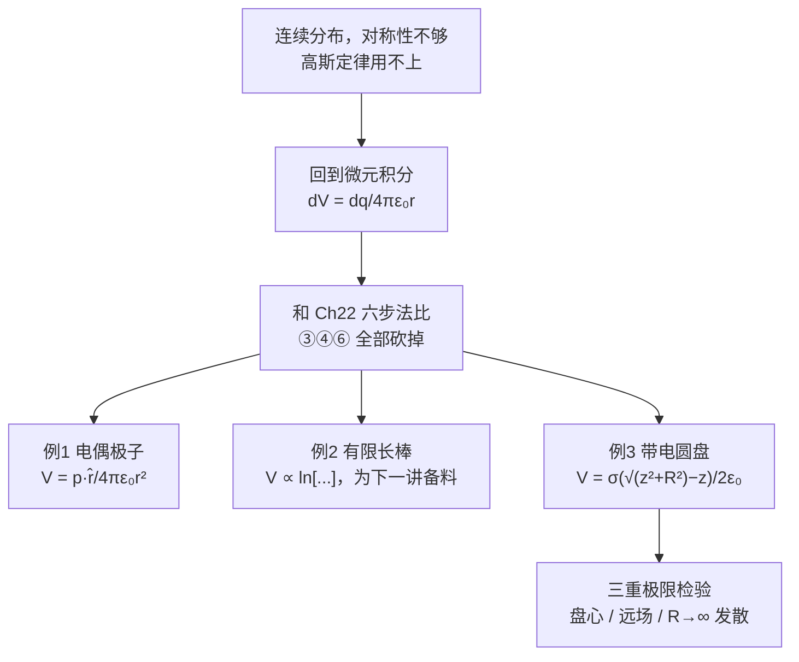

# C24.4 叠加原理算电势 Calculating Potential by Superposition

> [!abstract] 这一讲的任务
> 电荷连续分布、对称性又不够用高斯定律时，只能回到微元积分。第 22 章我们这样求过电场，那是一套痛苦的六步法。
> 这一讲把同样的活儿在**标量世界**里再干一遍——你会看到**六步砍掉三步**。三个例子（电偶极子、有限长棒、带电圆盘）每一个都会拿去和第 22 章的结果对照，两条完全不同的路线给出同一个答案。

> [!info] 怎么读这份讲义
> 第 1 节那张六步法对照表是本讲的眼睛。三个例子里，圆盘（第 4 节）的交叉验证最值得自己动手做一遍。
> 标有 **（拓展）** 或 **【拓展】** 的内容，是**课堂上没有讲到、由课件和教材延伸补充**的部分。复习时可先掌握未标注的主干内容，行有余力再看拓展部分。

---

## 0. 开场：同一根棒，两种算法

设想要求一根均匀带电细棒在某点产生的场。第 22 章的做法（[[C22.4 线电荷的电场]] 六步法）是：取微元 → 写 $d\vec E$ → **判断方向** → **分解成 $x$、$y$ 分量** → **用对称性消掉一些** → 统一变量积分 → **再把分量合成回矢量**。

> [!question] 停一下，先自己想想
> 现在改问**电势**。上面那七件事里，有几件还需要做？
> 提示：$dV=\dfrac{dq}{4\pi\varepsilon_0r}$ 是个**数**，不是箭头。

> [!important] 基本框架
> **有限尺寸的连续带电体**（Continuous distribution of charges，课件中文注：**有限尺寸的连续带电体**）
>
> P 点由电荷微元 $dq$ 产生的电势：
> $$dV=\frac{dq}{4\pi\varepsilon_0 r},\qquad V(\infty)=0$$
> P 点由整个连续分布产生的电势：
> $$\boxed{V=\int dV=\int\frac{1}{4\pi\varepsilon_0}\frac{dq}{r}}$$
>
> **课件学习目标**：对沿一条**线**或一个**面**均匀分布的电荷，通过**积分**求**电势**。求出**电偶极子**的电势。

> [!important] 与 [[C22.4 线电荷的电场]] 六步法的对照——本节的最大红利
> | 步骤 | 求电场 $\vec E$（Ch22） | 求电势 $V$（本节） |
> |---|---|---|
> | ① 取微元 | 需要 | 需要（**相同**） |
> | ② 写微元贡献 | $d\vec E=\dfrac{dq}{4\pi\varepsilon_0r^2}\hat r$ | $dV=\dfrac{dq}{4\pi\varepsilon_0r}$ |
> | ③ 定方向、分解分量 | **必须** | **不需要！** |
> | ④ 用对称性消去分量 | **必须** | **不需要！** |
> | ⑤ 统一变量、定限积分 | 需要 | 需要（**相同**） |
> | ⑥ 合成大小与方向 | **必须** | **不需要**（$V$ 就是标量） |
>
> **六步砍掉三步。** 这就是为什么很多题的标准解法是：**先积分求 $V$，再求梯度得 $\vec E$**——绕开矢量积分。[[C24.5 从电势算电场]] 的例题 6 正是这个策略的示范。

> [!warning] "有限尺寸"这四个字不能省
> 公式里默认了 $V(\infty)=0$，而这只对**几何尺寸有限**的带电体成立（[[C24.3 从电场算电势]]）。
> 无限长线、无限大平面不能用这个积分式——必须先用高斯定律求 $E$，再选有限参考点积分。**课件的中文注释特意写了"有限尺寸"，就是在提醒这一点。**

---

## 1. 电偶极子的电势 Potential due to an Electric Dipole

![[C24-电偶极子电势的远场几何.png]]

**精确表达式**（两个点电荷的电势直接相加，一步到位）

$$V=V_++V_-=\frac{q}{4\pi\varepsilon_0}\left(\frac{1}{r_+}-\frac{1}{r_-}\right)=\frac{q}{4\pi\varepsilon_0}\frac{r_--r_+}{r_-r_+}$$

**远场近似**（课件原文：If point P is far away from the dipole, we can assume that the $r_+$ and $r_-$ are **parallel**.）

$r\gg d$ 时：

$$r-r_+\approx\frac d2\cos\theta,\qquad r_--r\approx\frac d2\cos\theta$$
$$\Rightarrow\ r_--r_+\approx d\cos\theta,\qquad r_+r_-\approx r^2$$

$$V=\frac{q}{4\pi\varepsilon_0}\frac{r_--r_+}{r_-r_+}=\frac{q}{4\pi\varepsilon_0}\frac{d\cos\theta}{r^2}$$

> [!important] 用偶极矩表示
> **Electric dipole moment**：$p=qd$
> $$\boxed{V(\vec r)=\frac{\vec p\cdot\hat r}{4\pi\varepsilon_0r^2}=\frac{p\cos\theta}{4\pi\varepsilon_0r^2}}$$

> [!question] 停一下，我们刚才干了什么
> 对比一下 [[C22.3 电偶极子的电场]] 求**场**的那一页：那里要把 $\vec E_+$ 和 $\vec E_-$ 分解、相减、再做二项式展开，写满一整页。
> 这里只写了三行，而且**第一行就是精确解**——因为两个点电荷的电势可以直接用加号连起来。**这就是标量的威力。**

> [!note] "$r_+$ 与 $r_-$ 平行"这个近似到底在说什么
> 远处看，从 P 点分别望向 $+q$ 和 $-q$ 的两条视线**几乎重合**（图中两条绿线在 P 处并拢）。于是可以把 $r_+$、$r_-$ 都投影到中线 $r$ 上，长度差就是偶极轴在视线方向的投影 $d\cos\theta$（图中标出的 $r_{(-)}-r_{(+)}$ 那一小段）。
> **这是所有远场展开的标准做法**：把两个几乎相同的量的**差**用几何投影近似，而不是各自展开再相减（那样会丢精度）。

> [!important] 检验：与 [[C22.3 电偶极子的电场]] 的结果自洽吗
> **轴线上** $\theta=0$：$V=\dfrac{p}{4\pi\varepsilon_0z^2}$。求梯度：
> $$E_z=-\frac{\partial V}{\partial z}=-\frac{p}{4\pi\varepsilon_0}\cdot\left(-\frac{2}{z^3}\right)=\frac{2p}{4\pi\varepsilon_0z^3}=\frac{p}{2\pi\varepsilon_0z^3}\ ✓$$
> 与 Ch22 的轴线场公式**完全一致**。
> **中垂线上** $\theta=90^\circ$：$V=0$！但那里 $\vec E\ne0$（Ch22 给出 $-\dfrac{p}{4\pi\varepsilon_0x^3}$）。
> **这又是一个 "$V=0$ 但 $\vec E\ne0$" 的例子**：中垂面上 $V$ 恒为零，但沿垂直于该面的方向 $V$ 在变，梯度不为零。**$V$ 的值和 $V$ 的变化率是两回事。**

> [!warning] $V_{\text{偶极}}\propto1/r^2$，比点电荷的 $1/r$ 快一阶
> 与 [[C22.3 电偶极子的电场]] 中 $E_{\text{偶极}}\propto1/r^3$ 比点电荷 $1/r^2$ 快一阶完全对应。
> **总电荷为零 ⇒ 单极项消失 ⇒ 电势和场都各降一阶。** 多极展开的规律在电势上同样成立：
> | 多极 | $V$ | $E$ |
> |---|---|---|
> | 单极 | $1/r$ | $1/r^2$ |
> | 偶极 | $1/r^2$ | $1/r^3$ |
> | 四极 | $1/r^3$ | $1/r^4$ |

---

## 2. 线电荷的电势 Potential due to a line of charge 线电荷

![[C24-有限长带电棒的电势几何.png]]

> [!example] 题目（Problem 24-28）
> 一根长为 $L$ 的**细的非导体棒**带有均匀线电荷密度 $\lambda$ 的正电荷。求 P 点的电势，P 点到棒的**左端**的**垂直距离**为 $d$。

**解**

$$dV=\frac{\lambda\,dx}{4\pi\varepsilon_0\sqrt{x^2+d^2}}$$

课件在红框里给出所需的积分公式：

$$\int\frac{dx}{\sqrt{x^2+d^2}}=\ln\left(x+\sqrt{x^2+d^2}\right)$$

$$V=\int_0^L dV=\frac{\lambda}{4\pi\varepsilon_0}\ln\left[\frac{L+\sqrt{L^2+d^2}}{d}\right]$$

> [!note] 补上定积分的代入（课件跳过）
> $$\frac{\lambda}{4\pi\varepsilon_0}\Big[\ln\left(x+\sqrt{x^2+d^2}\right)\Big]_0^L=\frac{\lambda}{4\pi\varepsilon_0}\left[\ln\left(L+\sqrt{L^2+d^2}\right)-\ln\left(0+\sqrt{0+d^2}\right)\right]$$
> $$=\frac{\lambda}{4\pi\varepsilon_0}\ln\frac{L+\sqrt{L^2+d^2}}{d}\ ✓$$
> **下限那一项 $\ln d$ 很容易漏掉**，它正是分母上的 $d$。

> [!important] 一般点 $P(x,y)$ 的电势（课件下一页）
> 把场点移到任意位置 $P(x,y)$，积分限相应改变：
> $$dV=\frac{\lambda\,ds}{4\pi\varepsilon_0\sqrt{s^2+y^2}}$$
> $$V(x,y)=\int_{x}^{L-x}\frac{\lambda\,ds}{4\pi\varepsilon_0\sqrt{s^2+y^2}}$$
> $$\boxed{V(x,y)=\frac{\lambda}{4\pi\varepsilon_0}\ln\left[\frac{(L-x)+\sqrt{(L-x)^2+y^2}}{-x+\sqrt{x^2+y^2}}\right]}$$

> [!question] 课堂追问：为什么要费劲写出 $V(x,y)$ 这个一般式？
> 因为 **[[C24.5 从电势算电场]] 的例题 6 要对它求偏导**，从而一次性得到 $E_x$ 和 $E_y$。
> 若走 Ch22 的老路直接积分求场，$E_x$ 和 $E_y$ 要**分别做两次矢量积分**；这里只做**一次标量积分**再求两次偏导。
> **这是一个伏笔**：本节多花的力气，下一节会连本带利收回来。**积分难、求导易**——这正是整个第 24 章存在的意义。

> [!warning] 积分限为什么是 $x$ 到 $L-x$
> 课件把坐标原点取在**场点 P 的正下方**（即 P 在 $(0,y)$ 的正上方那种参考系），$s$ 从棒的左端量到右端相对于 P 的水平偏移。所以左端对应 $s=-x$（写成下限时符号体现在结果分母的 $-x$ 上），右端对应 $s=L-x$。
> **建立坐标时把原点放在场点的投影处，是让结果最对称的做法。** 做题时若坐标系设得不同，结果形式会变但物理相同。

---

## 3. 带电圆盘的电势 Potential due to a Charged Disk 带电圆盘

![[C24-带电圆盘电势的环带微元.png]]

> [!example] 题目
> 一个半径为 $R$、面电荷密度均匀为 $\sigma$ 的圆盘。求中心轴上距盘 $z$ 处的电势。

**课件的做法**：把圆盘分成**同心的薄扁环 (concentric thin flat rings)**，半径 $R'$、径向宽度 $dR'$。

> [!note] 为什么切成环而不是切成小方块
> 因为**同一个环上所有点到场点的距离都相等**（都是 $\sqrt{z^2+R'^2}$）。既然 $dV$ 只依赖距离，等距的一圈电荷就可以**当成一个整体**处理——这正是 [[C24.0 开篇回顾 第21章遗留习题]] 里说的"让被积量在微元内为常数"。
> 求电场时也切环，但那时还要额外论证"环上各点的横向分量互相抵消"。这里连这一步都省了。

$$dq=\sigma\cdot2\pi R'dR'$$

$$dV=\frac{dq}{4\pi\varepsilon_0r}=\frac{1}{4\pi\varepsilon_0}\frac{\sigma(2\pi R')dR'}{\sqrt{z^2+R'^2}}=\frac{\sigma}{2\varepsilon_0}\frac{R'dR'}{\sqrt{z^2+R'^2}}$$

$$V=\frac{\sigma}{2\varepsilon_0}\int_0^R\frac{R'dR'}{\sqrt{z^2+R'^2}}=\boxed{\frac{\sigma}{2\varepsilon_0}\left(\sqrt{z^2+R^2}-z\right)}$$

> [!note] 补上积分（凑微分）
> 令 $u=z^2+R'^2$，$du=2R'dR'$：
> $$\int_0^R\frac{R'dR'}{\sqrt{z^2+R'^2}}=\frac12\int_{z^2}^{z^2+R^2}u^{-1/2}du=\Big[u^{1/2}\Big]_{z^2}^{z^2+R^2}=\sqrt{z^2+R^2}-z\ ✓$$
> 与 [[C22.5 带电圆盘的电场]] 中求 $E$ 的凑微分是同一招，只是那里的被积函数是 $u^{-3/2}$（因为分母多一次方）。

> [!important] 与 [[C22.5 带电圆盘的电场]] 交叉验证——务必自己做一遍
> 对 $V$ 求梯度应该回到 Ch22 的场公式：
> $$E_z=-\frac{\partial V}{\partial z}=-\frac{\sigma}{2\varepsilon_0}\frac{\partial}{\partial z}\left(\sqrt{z^2+R^2}-z\right)=-\frac{\sigma}{2\varepsilon_0}\left(\frac{z}{\sqrt{z^2+R^2}}-1\right)$$
> $$=\frac{\sigma}{2\varepsilon_0}\left[1-\frac{z}{\sqrt{z^2+R^2}}\right]\ ✓$$
> **与 Ch22 的结果一字不差。** 两章用完全不同的路线得到同一个答案，这是对两套方法都正确的最强证明。

> [!note] 三个极限检验
> - **$z=0$（盘心）**：$V=\dfrac{\sigma R}{2\varepsilon_0}$，有限值 ✓（不像 $E$ 那样简单，但也不发散）
> - **$z\gg R$（远场）**：$\sqrt{z^2+R^2}\approx z\left(1+\dfrac{R^2}{2z^2}\right)$，
> $$V\approx\frac{\sigma}{2\varepsilon_0}\cdot\frac{R^2}{2z}=\frac{\sigma\pi R^2}{4\pi\varepsilon_0z}=\frac{q}{4\pi\varepsilon_0z}\ ✓$$
> 退化成点电荷电势 ✓
> - **$R\to\infty$（无限大平面）**：$V\to\infty$ ✗ **发散**！
> 这正是 [[C24.3 从电场算电势]] 说的："无限大带电体不能取 $V(\infty)=0$"。有限圆盘可以，无限平面不行。**两节在这里精确对上。**

> [!question] 停一下，我们刚才干了什么
> 三个例子，三次都用同一套流程：**切微元（让距离在微元内为常数）→ 写 $dV$ → 积分**。没有一次需要画箭头。
> 而且三次都做了**交叉验证**：偶极子对 $z$ 求导回到 Ch22 的轴线场，圆盘对 $z$ 求导回到 Ch22 的盘轴场，圆盘取 $R\to\infty$ 回到 $\S24.3$ 的发散结论。
> **养成这个习惯**：算完一个 $V$，顺手求一次梯度看看能不能回到已知的 $E$——这是最有效的自查方式。

---

## 这一讲的三句话

1. **$V=\displaystyle\int\frac{dq}{4\pi\varepsilon_0 r}$，六步法砍掉三步**（定方向、分解分量、矢量合成全免）；微元要切成"到场点等距"的形状（棒切段、盘切环）。
2. **电偶极子远场 $V=\dfrac{p\cos\theta}{4\pi\varepsilon_0r^2}$**，比点电荷快一阶衰减；中垂面上 $V=0$ 但 $\vec E\ne0$。
3. **带电圆盘轴上 $V=\dfrac{\sigma}{2\varepsilon_0}\left(\sqrt{z^2+R^2}-z\right)$**；求一次梯度就回到 Ch22 的场公式，取 $R\to\infty$ 则发散——两条交叉验证都要会。

> [!important] 必背
> $$V=\int\frac{dq}{4\pi\varepsilon_0r},\qquad V_{\text{偶极}}=\frac{p\cos\theta}{4\pi\varepsilon_0r^2},\qquad V_{\text{圆盘轴上}}=\frac{\sigma}{2\varepsilon_0}\left(\sqrt{z^2+R^2}-z\right)$$
> $$\int\frac{dx}{\sqrt{x^2+d^2}}=\ln\left(x+\sqrt{x^2+d^2}\right)$$

> [!abstract] 下一讲预告
> 本讲留了个伏笔：那个费劲写出来的 $V(x,y)$。下一讲就去收它——**对它求两次偏导，一次性拿到 $E_x$ 和 $E_y$**，顺便得到半无限长带电棒那个漂亮的 $45°$ 结论。
> 至此第 24 章的两条主线（$\vec E\to V$ 积分、$V\to\vec E$ 求导）就闭合了。

---

## 本节自测 Self-Test

> [!question] 1. 求连续分布电势与求电场相比，六步法省掉了哪几步？为什么？

> [!success]- 参考答案
> 省掉③定方向分解分量、④对称性消去、⑥矢量合成。因为 $V$ 是标量，只需距离不需方向。

> [!question] 2. 连续分布电势公式默认了什么前提？

> [!success]- 参考答案
> $V(\infty)=0$，这要求带电体**几何尺寸有限**。无限长线/无限大平面不能用，必须先用高斯定律求 $E$ 再选有限参考点。

> [!question] 3. 写出电偶极子的远场电势，说明"$r_+$ 与 $r_-$ 平行"这个近似的几何含义。

> [!success]- 参考答案
> $V=\dfrac{\vec p\cdot\hat r}{4\pi\varepsilon_0r^2}=\dfrac{p\cos\theta}{4\pi\varepsilon_0r^2}$。远处两条视线几乎重合，长度差近似为偶极轴在视线方向的投影 $d\cos\theta$。

> [!question] 4. 偶极子中垂面上 $V=0$，那里 $\vec E$ 也为零吗？

> [!success]- 参考答案
> 不为零（$-p/4\pi\varepsilon_0x^3$）。$V$ 沿垂直该面的方向在变，梯度不为零。$V$ 的值与 $V$ 的变化率是两回事。

> [!question] 5. 多极展开中 $V$ 与 $E$ 的衰减律对应关系？

> [!success]- 参考答案
> 单极 $V\sim1/r$、$E\sim1/r^2$；偶极 $1/r^2$、$1/r^3$；四极 $1/r^3$、$1/r^4$。$V$ 总比 $E$ 慢一阶。

> [!question] 6. 带电圆盘轴线上的电势是多少？如何验证它与 Ch22 的场公式一致？

> [!success]- 参考答案
> $V=\dfrac{\sigma}{2\varepsilon_0}(\sqrt{z^2+R^2}-z)$。求 $-\partial V/\partial z$ 得 $\dfrac{\sigma}{2\varepsilon_0}\left[1-\dfrac{z}{\sqrt{z^2+R^2}}\right]$，与 [[C22.5 带电圆盘的电场]] 一致。

> [!question] 7. 圆盘电势在 $R\to\infty$ 时会怎样？说明了什么？

> [!success]- 参考答案
> 发散。说明无限大平面不能取 $V(\infty)=0$，必须另选有限参考点——与 [[C24.3 从电场算电势]] 的结论一致。

> [!question] 8. 为什么要写出棒的一般点电势 $V(x,y)$ 而不只是特殊点？

> [!success]- 参考答案
> 因为下一节要对它求两个偏导，一次标量积分换来 $E_x$ 和 $E_y$，比做两次矢量积分省得多。

> [!question] 9. 求圆盘的 $V$ 时为什么把它切成同心环？

> [!success]- 参考答案
> 同一个环上所有点到轴上场点的距离都相等（$\sqrt{z^2+R'^2}$），而 $dV$ 只依赖距离，所以整环可以当一项处理。微元要切成"被积量在其内为常数"的形状。

---

上一节 ← [[C24.3 从电场算电势]] ｜ 下一节 → [[C24.5 从电势算电场]]
索引 → [[电磁学 MOC]]
