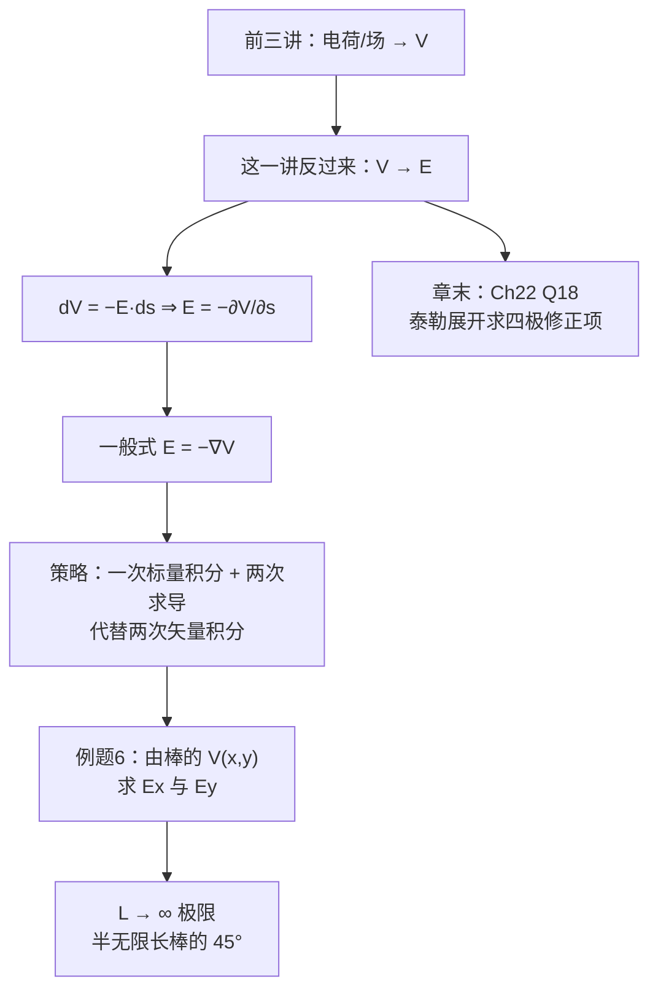
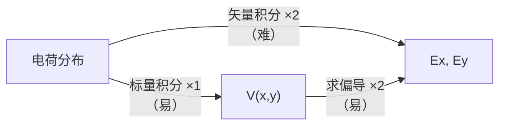

# C24.5 从电势算电场 Calculating Field from Potential

> [!abstract] 这一讲的任务
> 前三讲一直在往一个方向走：由电荷或由场，算出电势。这一讲**把箭头掉过来**——已知 $V$，求 $\vec E$。
> 这不只是"补齐另一半"。它是一个**实战策略**：矢量积分难、标量积分易、求导最易，所以求场的最优路线常常是"先积分求 $V$，再求导拿回 $\vec E$"。上一讲埋的那个 $V(x,y)$ 伏笔，这一讲就来收。
> 最后用第 22 章一道遗留题（泰勒展开求偶极场次级项）给整个静电场部分收尾。

> [!info] 怎么读这份讲义
> 第 1 节是公式，第 2 节是那条"先 $V$ 后 $\vec E$"策略的完整演示，第 3 节是章末附加题（方法上属于近似技巧，内容上补 Ch22 的尾巴）。
> 标有 **（拓展）** 或 **【拓展】** 的内容，是**课堂上没有讲到、由课件和教材延伸补充**的部分。复习时可先掌握未标注的主干内容，行有余力再看拓展部分。

---

## 0. 开场：一个更省力的走法

回忆一下 [[C24.4 叠加原理算电势]] 最后留下的东西：一根有限长带电棒在任意点的电势

$$V(x,y)=\frac{\lambda}{4\pi\varepsilon_0}\ln\left[\frac{(L-x)+\sqrt{(L-x)^2+y^2}}{-x+\sqrt{x^2+y^2}}\right]$$

现在题目问：**这根棒在 P 点产生的电场是多少？**

> [!question] 停一下，先自己想想
> 按 [[C22.4 线电荷的电场]] 的老办法：$E_x$ 做一次矢量积分（带 $\cos\theta$、统一变量），$E_y$ 再做一次（带 $\sin\theta$）。**两次矢量积分。**
> 可我们手上已经有 $V(x,y)$ 了。而 $\vec E=-\nabla V$——**求两次偏导，完事。**
>
> 积分和求导，哪个更容易？这个问题在微积分课上就有答案了。

---

## 1. 核心关系

> [!important] 课件学习目标
> 给定作为**位置函数的电势**，求出**电场**。

![[C24-电场垂直于等势面指向电势降低方向.png]]

> [!important] 课件原文
> **电场垂直于等势面，并指向电势减小的方向。**（The electric field is perpendicular to the equipotential surfaces and points to the direction in which the **potential decreases**.）
>
> $$dV=-E\,ds$$
> $$\boxed{E=-\frac{\partial V}{\partial s}}$$
>
> 一般地，任一点 $(x,y,z)$ 处的 $\vec E$ 由**梯度 (gradient 梯度)** 给出：
> $$\boxed{\vec E=-\nabla V=-\left(\frac{\partial V}{\partial x}\hat i+\frac{\partial V}{\partial y}\hat j+\frac{\partial V}{\partial z}\hat k\right)}$$

> [!note] $E=-\dfrac{\partial V}{\partial s}$ 到底给的是什么
> 它给的是 **$\vec E$ 沿 $\hat s$ 方向的分量**，即 $E_s=-\dfrac{\partial V}{\partial s}$。
> 想得到完整的 $\vec E$，要么对三个坐标各求一次偏导（梯度式），要么**沿 $V$ 变化最快的方向求**——那个方向就是 $\vec E$ 的方向，那个方向上的变化率就是 $|\vec E|$。
> **地形类比**（承 [[C24.1 电势与电势能]]）：$-\dfrac{\partial V}{\partial s}$ 是"沿某条小路的坡度"，$-\nabla V$ 是"最陡下坡方向及其陡度"。沿等高线走坡度为零（$\vec E\perp$ 等势面）✓

> [!important] 三种情形的实用简化
> | 对称性 | $\vec E$ 的表达式 |
> |---|---|
> | 只依赖 $x$ | $E_x=-\dfrac{dV}{dx}$，$E_y=E_z=0$ |
> | 球对称 $V(r)$ | $E_r=-\dfrac{dV}{dr}$，只有径向分量 |
> | 柱对称 $V(r)$ | $E_r=-\dfrac{dV}{dr}$（$r$ 为到轴的距离）|
>
> 快速验证：点电荷 $V=\dfrac{q}{4\pi\varepsilon_0r}\Rightarrow E_r=-\dfrac{d}{dr}\dfrac{q}{4\pi\varepsilon_0r}=\dfrac{q}{4\pi\varepsilon_0r^2}$ ✓

> [!warning] 求导对零点的选择"免疫"
> 若把 $V$ 整体加一个常数 $C$，$\vec E=-\nabla(V+C)=-\nabla V$ **完全不变**。
> 这正是 [[C24.3 从电场算电势]] 中"零点任选不影响物理"的严格根据。**所以做 $V\to E$ 的题时，完全不用管零点选在哪。**

> [!important] 本章两条主线的闭环
> $$\vec E\ \xrightarrow[\text{积分}]{\ \Delta V=-\int\vec E\cdot d\vec s\ }\ V\ \xrightarrow[\text{求导}]{\ \vec E=-\nabla V\ }\ \vec E$$
> 两个方向互逆。**实用策略**：难算矢量积分时，先积分求标量 $V$，再求导拿回 $\vec E$——例题 6 就是这个策略的完整示范。

---

## 2. 例题 6：由带电棒的电势求电场（课件原题）

> [!example] 题目
> **由电势计算**线电荷在 P 点（到棒**左端**的**垂直距离**为 $d$）的**电场**。

![[C24-例题6由电势求场的几何.png]]

已知（[[C24.4 叠加原理算电势]]）：

$$V=\frac{\lambda}{4\pi\varepsilon_0}\ln\left[\frac{L+\sqrt{L^2+d^2}}{d}\right]$$

### 情形一：在 $P(0,y)$ 上求 $E_y$

把 $d$ 换成变量 $y$：

$$V=\frac{\lambda}{4\pi\varepsilon_0}\ln\left[\frac{L+\sqrt{L^2+y^2}}{y}\right]$$

$$E_y=-\frac{dV}{dy}=-\frac{\lambda}{4\pi\varepsilon_0}\frac{d}{dy}\ln\left[\frac{L+\sqrt{L^2+y^2}}{y}\right]$$

> [!warning] 这一步为什么必须"先把 $d$ 换成 $y$"再求导
> 因为 $d$ 在原式里是一个**固定的数**，对一个常数求导没有意义。
> **要求某方向的场，必须先让电势表达式里的那个坐标变成变量。** 这是本题最容易做错的地方——很多同学直接对着含 $d$ 的表达式写 $\partial/\partial d$，虽然形式上算得出来，但概念是混乱的：$V$ 必须先写成**位置的函数** $V(\vec r)$，才谈得上求梯度。

> [!note] 把这个导数算完（课件留白）
> 令 $u=\dfrac{L+\sqrt{L^2+y^2}}{y}$，则 $\ln u=\ln\left(L+\sqrt{L^2+y^2}\right)-\ln y$。
> $$\frac{d}{dy}\ln u=\frac{\dfrac{y}{\sqrt{L^2+y^2}}}{L+\sqrt{L^2+y^2}}-\frac1y$$
> 通分（记 $S=\sqrt{L^2+y^2}$）：
> $$=\frac{y^2-S(L+S)}{yS(L+S)}=\frac{y^2-SL-S^2}{yS(L+S)}=\frac{y^2-SL-L^2-y^2}{yS(L+S)}=\frac{-L(S+L)}{yS(L+S)}=-\frac{L}{yS}$$
> $$\Rightarrow\ E_y=-\frac{\lambda}{4\pi\varepsilon_0}\cdot\left(-\frac{L}{y\sqrt{L^2+y^2}}\right)=\frac{\lambda}{4\pi\varepsilon_0}\frac{L}{y\sqrt{L^2+y^2}}$$
> **检验**：$L\to\infty$ 时 $\dfrac{L}{y\sqrt{L^2+y^2}}\to\dfrac{L}{yL}=\dfrac1y$，得
> $$E_y\to\frac{\lambda}{4\pi\varepsilon_0 y}$$
> 与课件下一页给出的极限一致 ✓（见下）

### 情形二：在任意点 $P(x,y)$ 上求 $E_x$

$$V(x,y)=\frac{\lambda}{4\pi\varepsilon_0}\ln\left[\frac{(L-x)+\sqrt{(L-x)^2+y^2}}{-x+\sqrt{x^2+y^2}}\right]$$

$$E_x=-\frac{\partial V}{\partial x}=-\frac{\lambda}{4\pi\varepsilon_0}\frac{\partial}{\partial x}\ln\left[\frac{(L-x)+\sqrt{(L-x)^2+y^2}}{-x+\sqrt{x^2+y^2}}\right]$$

> [!important] 极限结果（课件标黄，对应 Problem 22-33）
> $$L\to\infty:\qquad \boxed{E_x=-\frac{\lambda}{4\pi\varepsilon_0 d},\qquad E_y=\frac{\lambda}{4\pi\varepsilon_0 d}}$$

> [!question] 停一下：这两个数在说一件很漂亮的事
> 这是**半无限长带电棒**（从原点延伸到 $+\infty$）在其**端点正上方**距离 $d$ 处的场：
> - $E_x=-\dfrac{\lambda}{4\pi\varepsilon_0d}$（指向 $-x$，即**背离**棒延伸的方向）
> - $E_y=+\dfrac{\lambda}{4\pi\varepsilon_0d}$（垂直于棒向外）
> - **两个分量大小相等** ⇒ 合场与棒成 $45^\circ$ 角，大小 $|\vec E|=\dfrac{\sqrt2\,\lambda}{4\pi\varepsilon_0d}$
>
> **这个 $45^\circ$ 是半无限长棒的著名结论**，值得记住。
> 而且它可以**不算就验证**：对照 [[C23.4 对称带电绝缘体的电场]] 的**全**无限长棒 $E=\dfrac{\lambda}{2\pi\varepsilon_0d}$（只有垂直分量）。把两根半无限长棒对拼成一整根：垂直分量相加 $\dfrac{\lambda}{4\pi\varepsilon_0d}\times2=\dfrac{\lambda}{2\pi\varepsilon_0d}$ ✓，平行分量方向相反正好抵消 ✓
> **两条独立路线再次对上。**

> [!important] 本题的方法论价值
> 直接用 [[C22.4 线电荷的电场]] 的六步法求这根棒在任意点 $P(x,y)$ 的场，需要**两次矢量积分**（$E_x$ 和 $E_y$ 各一次），且每次都要写 $\cos\theta$、$\sin\theta$ 并统一变量。
> 本题的路线是：**一次标量积分**（求 $V(x,y)$，[[C24.4 叠加原理算电势]]）+ **两次求偏导**。
> **积分难、求导易**——这是把矢量问题标量化的最大收益，也是整个第 24 章存在的意义。

---

## 3. 章末：第 22 章 Question 18（泰勒展开求偶极场的次级项）

> [!example] 原题
> The electric field of an electric dipole along the dipole axis is approximated by Eqs. 22-8 and 22-9. If a **binomial expansion** is made of Eq. 22-7, what is the **next term** in the expression for the dipole's electric field along the dipole axis? That is, what is $E_{next}$ in
> $$E=\frac{1}{2\pi\varepsilon_0}\frac{qd}{z^3}+E_{next}\ ?$$

> [!note] 这道题在补 [[C22.3 电偶极子的电场]] 留下的尾巴
> Ch22 推到 $E=\dfrac{1}{4\pi\varepsilon_0}\dfrac{q}{z^3}\cdot\dfrac{2d}{\left(1-\left(\frac{d}{2z}\right)^2\right)^2}$ 之后，直接令分母 $\to1$ 就得到了 $\dfrac{p}{2\pi\varepsilon_0z^3}$。
> **这道题问的是：那个被扔掉的分母里还藏着什么？**

**Taylor 展开（课件给的一般式）**

$$f(x)=f(a)+(x-a)\frac{f'(a)}{1!}+(x-a)^2\frac{f''(a)}{2!}+\cdots$$

**设** $\dfrac{d}{2z}=x$，则 Ch22 的精确式写成

$$E=\frac{1}{4\pi\varepsilon_0}\frac{q}{z^3}\cdot\frac{2d}{\left(1-\left(\frac{d}{2z}\right)^2\right)^2}=\frac{1}{2\pi\varepsilon_0}\frac{qd}{z^3}\cdot(1-x^2)^{-2}$$

**展开 $f(x)=(1-x^2)^{-2}$ 在 $x=0$ 附近**

$$f'(x)=4x(1-x^2)^{-3}\ \Rightarrow\ f'(0)=0$$
$$f''(x)=4(1-x^2)^{-3}+24x^2(1-x^2)^{-4}\ \Rightarrow\ f''(0)=4$$
$$f(x)=f(0)+x\frac{f'(0)}{1!}+x^2\frac{f''(0)}{2!}+\cdots=1+0+2x^2$$

**代回**

$$E=\frac{1}{2\pi\varepsilon_0}\frac{qd}{z^3}\left(1+2\left(\frac{d}{2z}\right)^2\right)=\frac{1}{2\pi\varepsilon_0}\frac{qd}{z^3}+\frac{1}{4\pi\varepsilon_0}\frac{qd^3}{z^5}$$

> [!important] 答案
> $$\boxed{E_{next}=\frac{1}{4\pi\varepsilon_0}\frac{qd^3}{z^5}}$$

> [!note] 补一步系数化简（课件跳得快）
> $\dfrac{1}{2\pi\varepsilon_0}\dfrac{qd}{z^3}\cdot2\cdot\dfrac{d^2}{4z^2}=\dfrac{1}{2\pi\varepsilon_0}\cdot\dfrac{qd^3}{2z^5}=\dfrac{1}{4\pi\varepsilon_0}\dfrac{qd^3}{z^5}$ ✓

> [!important] 这个 $1/z^5$ 项是什么——课件不说，但它有名字
> 它是**电四极项 (quadrupole term)** 的贡献。
> 回顾多极展开（[[C22.3 电偶极子的电场]]、[[C24.4 叠加原理算电势]]）：
> | 阶 | $E$ 的衰减 | 何时是主导项 |
> |---|---|---|
> | 单极 | $1/z^2$ | 总电荷 $\ne0$ |
> | 偶极 | $1/z^3$ | 总电荷 $=0$ 但 $\vec p\ne0$ |
> | **四极** | $1/z^5$ ← **本题** | 总电荷 $=0$ 且 $\vec p=0$ |
>
> 对一个**理想**偶极子（$d\to0$ 但 $p=qd$ 固定），四极项趋于零，$1/z^3$ 就是精确解。对**真实**的有限间距偶极子，$1/z^5$ 是最大的修正项，其相对大小是 $\left(\dfrac{d}{2z}\right)^2\cdot2$——在 $z=10d$ 处约为 $0.5\%$。

> [!question] 课堂追问：为什么下一项是 $1/z^5$，而不是 $1/z^4$？
> 因为 $f(x)=(1-x^2)^{-2}$ 是 $x$ 的**偶函数**（只含 $x^2$），所有奇次导数在 0 点为零（本题算出的 $f'(0)=0$ 不是巧合）。**所以修正项直接从 $x^2$ 开始，跳过了 $x^1$。**
> 物理上：偶极子沿轴的场关于 $d\to-d$ 有确定的对称性，禁止了奇数阶修正。**对称性再一次决定了展开的结构**——从 [[C24.0 开篇回顾 第21章遗留习题]] 的 Q23 到这里，这已经是本章第三次靠对称性省掉一半工作量了。

> [!note] 二项式展开的快捷记法
> 不必真的求两次导。用 $(1+u)^n\approx1+nu+\dfrac{n(n-1)}{2}u^2$，取 $u=-x^2$、$n=-2$：
> $$(1-x^2)^{-2}\approx1+(-2)(-x^2)=1+2x^2\ ✓$$
> 一行搞定。**$(1+u)^n\approx1+nu$ 是本课程使用频率最高的近似**，[[C22.3 电偶极子的电场]]、[[C22.5 带电圆盘的电场]]、[[C24.4 叠加原理算电势]] 的远场检验全都用它。

---

## 这一讲的三句话

1. **$\vec E=-\nabla V$；$E_s=-\partial V/\partial s$ 给的只是 $\hat s$ 方向的分量。** 求导前必须先把该坐标写成变量（不能对常数 $d$ 求导）。
2. **最优解题路线是"一次标量积分 + 两次求偏导"**，替代两次矢量积分；顺带得到半无限长棒端点上方场与棒成 $45°$、$|\vec E|=\dfrac{\sqrt2\lambda}{4\pi\varepsilon_0d}$。
3. **零点选择对 $\vec E$ 完全无影响**（常数的梯度为零）；偶极场的下一项是四极项 $\dfrac{qd^3}{4\pi\varepsilon_0z^5}$，跳过 $1/z^4$ 是因为展开函数是偶函数。

> [!important] 必背
> $$\vec E=-\nabla V,\qquad E_s=-\frac{\partial V}{\partial s},\qquad (1+u)^n\approx1+nu+\frac{n(n-1)}{2}u^2$$

> [!abstract] 第 24 章到此结束，下一章预告
> 四章下来，静电场已经被我们从四个角度看了个遍：力、场、通量、电势。但所有电荷一直是**别人摆好的**。
> 第 25 章要主动干预：**把电荷攒起来**。两块导体、一个电压，能存多少电荷、多少能量？这个问题的答案叫**电容**，而它会把本章的 $V$ 和第 23 章的高斯定律同时用上。

---

## 本节自测 Self-Test

> [!question] 1. 写出由 $V$ 求 $\vec E$ 的两个公式，说明 $E=-\partial V/\partial s$ 给的是什么。

> [!success]- 参考答案
> $E_s=-\dfrac{\partial V}{\partial s}$（$\hat s$ 方向的**分量**）；$\vec E=-\nabla V$（完整矢量）。

> [!question] 2. 为什么 $V$ 的零点选择不影响 $\vec E$？

> [!success]- 参考答案
> 加常数后梯度不变：$-\nabla(V+C)=-\nabla V$。这正是 [[C24.3 从电场算电势]] 中"零点任选"的严格根据。

> [!question] 3. 例题 6 中为什么必须先把 $d$ 换成变量 $y$ 才能求导？

> [!success]- 参考答案
> $d$ 在原式中是常数，对常数求导无意义。要求梯度，$V$ 必须先写成位置的函数。

> [!question] 4. 半无限长带电棒在端点正上方 $d$ 处的场是多少？方向如何？

> [!success]- 参考答案
> $E_x=-\dfrac{\lambda}{4\pi\varepsilon_0d}$，$E_y=+\dfrac{\lambda}{4\pi\varepsilon_0d}$；两分量等大，合场与棒成 $45°$，$|\vec E|=\dfrac{\sqrt2\lambda}{4\pi\varepsilon_0d}$。

> [!question] 5. 用"两个半根拼一整根"检验上题结果。

> [!success]- 参考答案
> 半根的垂直分量 $\dfrac{\lambda}{4\pi\varepsilon_0d}$ ×2 = $\dfrac{\lambda}{2\pi\varepsilon_0d}$ = 全无限长棒的场 ✓；平行分量方向相反抵消 ✓

> [!question] 6. "先求 $V$ 再求梯度"相比直接矢量积分省在哪？

> [!success]- 参考答案
> 一次标量积分 + 两次求偏导，替代两次矢量积分（每次还要写 $\cos\theta$、$\sin\theta$ 并统一变量）。积分难、求导易。

> [!question] 7. 偶极子轴上场的次级项是什么？为什么是 $1/z^5$ 而不是 $1/z^4$？

> [!success]- 参考答案
> $E_{next}=\dfrac{qd^3}{4\pi\varepsilon_0z^5}$（四极项）。因为 $(1-x^2)^{-2}$ 是偶函数，奇次项全为零，修正从 $x^2$ 开始。

> [!question] 8. 写出本课程用得最多的那个二项式近似。

> [!success]- 参考答案
> $(1+u)^n\approx1+nu+\dfrac{n(n-1)}{2}u^2$（$|u|\ll1$）。

> [!question] 9. 点电荷的 $V=\dfrac{q}{4\pi\varepsilon_0r}$，用梯度公式验证它给出正确的场。

> [!success]- 参考答案
> 球对称，只有径向分量：$E_r=-\dfrac{dV}{dr}=-\dfrac{q}{4\pi\varepsilon_0}\dfrac{d}{dr}\left(\dfrac1r\right)=\dfrac{q}{4\pi\varepsilon_0r^2}$ ✓ 与 [[C22.2 点电荷的电场]] 一致。

---

上一节 ← [[C24.4 叠加原理算电势]] ｜ 下一章 → [[C25.1 电容器与电容的计算]]
索引 → [[电磁学 MOC]]
