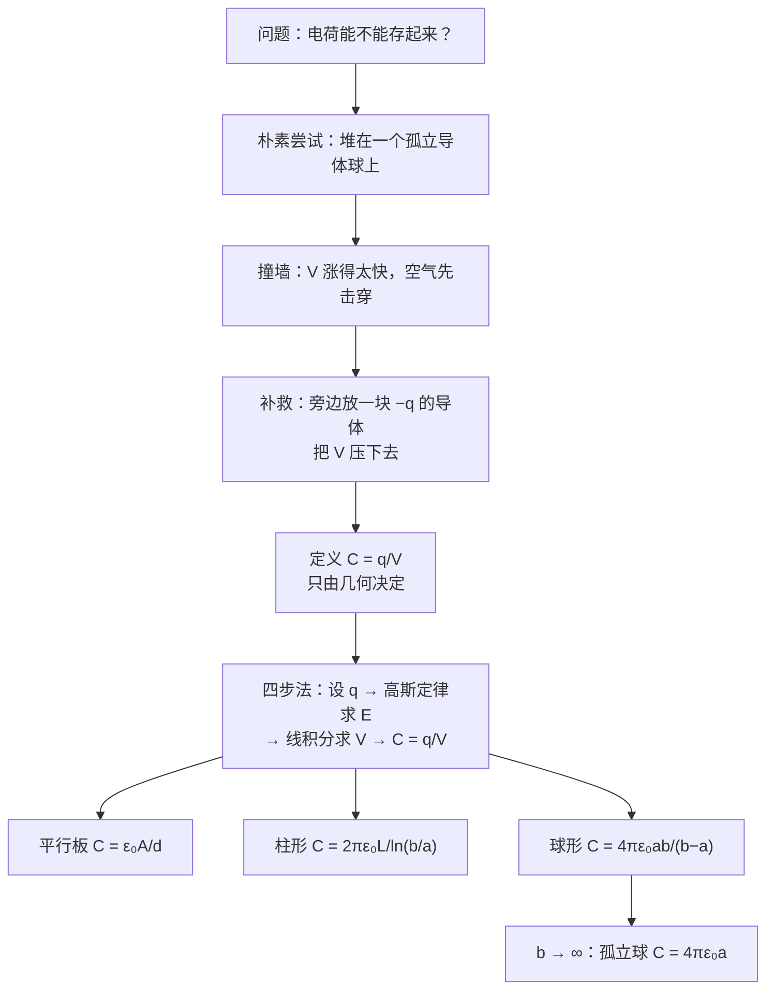

# C25.1 电容器与电容的计算 Capacitor, Capacitance & Calculating C

> [!abstract] 这一讲的任务
> 第 24 章我们把「场 → 能量」这条路打通了：给定电荷分布能算 $V$，给定 $V$ 能算 $\vec E$。但整整四章，电荷都是「摆在那里」的——没人问过**怎么把电荷攒起来、攒多少、攒的时候要花多少能量**。
> 这一讲就问这一件事：**给两块导体，它们能存多少电荷？** 答案会归结为一个只跟形状有关的数，叫**电容**。然后我们用第 23 章的高斯定律，把平行板、柱形、球形三种电容器的电容一个个算出来。

> [!info] 怎么读这份讲义
> 按顺序读即可，每一节都用得上前一节的结论。第 3 节的「四步法」是本章所有计算题的通用套路，务必背下来。
> 标有 **（拓展）** 或 **【拓展】** 的内容，是**课堂上没有讲到、由课件和教材延伸补充**的部分。复习时可先掌握未标注的主干内容，行有余力再看拓展部分。

---

## 0. 开场：闪光灯为什么不能直接接电池

你按下相机快门，氙气闪光灯在大约 **1 毫秒**内放出一次强光。粗算一下它要的功率：一次闪光约 $10\ \mathrm{J}$ 的能量，除以 $10^{-3}\ \mathrm{s}$，就是 **$10\ \mathrm{kW}$**。

而相机里那两节 AA 电池，持续输出撑死几瓦。差了三个数量级。

那闪光灯是怎么亮的？**中间有个器件，在你按快门之前的几秒里，把电池慢慢送出的电荷一点点攒起来，然后在 1 毫秒里一次倒光。** 这个「攒电荷的桶」就是**电容器 Capacitor**。

> [!question] 停一下，先自己想想
> 要「攒电荷」，最朴素的做法是什么？——大概是**找一块金属，不停往上灌电子**。
> 这个办法行不行？如果不行，是卡在哪里？

### 朴素尝试与它撞的墙

拿一个半径 $R$ 的孤立导体球，往上灌电荷 $q$。由 [[C24.3 从电场算电势]]，它的电势是

$$V=\frac{q}{4\pi\varepsilon_0 R}$$

灌得越多，$V$ 涨得越高——而且是**正比例地涨**。取 $R=10\ \mathrm{cm}$，只灌 $1\ \mu\mathrm{C}$，电势就到了

$$V=\frac{8.99\times10^{9}\times1\times10^{-6}}{0.1}=9.0\times10^{4}\ \mathrm{V}$$

九万伏。而球面处的场强 $E=V/R=9\times10^5\ \mathrm{V/m}$，已经很接近**空气的击穿场强 $3\times10^6\ \mathrm{V/m}$**（见 [[C25.4 电介质与电介质中的高斯定律]] 的介电强度表）。再灌几倍，球就开始对着空气打火，电荷自己跑光。

**结论：一个孤立导体存不了多少电荷，因为电势涨得太快。**

### 破局：让电势别涨那么快

电势为什么涨得快？因为正电荷产生的 $V$ 无处抵消。那就**在旁边放第二块导体，让它带 $-q$**。

负电荷贡献负电势，两者一叠加，两块导体之间的**电势差被压得很低**。同样是灌 $1\ \mu\mathrm{C}$，孤立球要 $9\times10^4\ \mathrm{V}$；换成两块间距 $1\ \mathrm{mm}$ 的大平板，可能只要几十伏。

**同样的电压，能存多得多的电荷——这就是电容器的全部诀窍。**

> [!important] 定义：电容器 Capacitor（课件原文）
> A capacitor is a device in which **electrical energy is stored**. It consists of **two isolated conductors (plates)** with **insulating material** between them.
> 电容器是储存电能的器件，由**两块彼此绝缘的孤立导体（极板 plate）**构成，中间是绝缘材料。
>
> 课件「What is Physics」页对本章的两句定位：
> - **Capacitance 电容**：Separated electric charge storing electric potential (electric potential energy)——被分开的电荷储存电势能。
> - **Applications 应用**：Energy storage 储能、Digital circuits 数字电路、Signal processing 信号处理、Sensors 传感器。

![[C25-电容器结构与电场线.png]]

> [!note] 读图：三张小图分别在说什么
> - **左**：一对 $+q,-q$ 的电场线——这是「两块导体」最原始的样子。
> - **中**：把它们压扁成两块面积 $A$、间距 $d$ 的平行板，上板底面带 $+q$，下板顶面带 $-q$。**注意电荷跑到了相对的两个面上**，这正是 [[C23.3 带电导体的电场]] 里「异号电荷互相吸引到内表面」的结论。
> - **右**：真实的场线分布。**板间是均匀场，边缘处向外弯**——这叫**边缘效应 fringing**。整章所有公式都建立在「忽略边缘效应」上，前提是 $d\ll\sqrt A$。

---

## 1. 电容：把「存货能力」变成一个数

现在给「能存多少」下定义。对同一个电容器，$q$ 灌得越多，$V$ 越大——而且**严格成正比**。所以比值是个常数，这个常数就是电容。

> [!important] 定义：电容 Capacitance（课件原文）
> The capability of **how much charge** a capacitor can store is called **capacitance**.
> $$\boxed{C=\frac{q}{V_{ab}}}$$
> - $q$ 是**一块**极板上的电荷量（另一块是 $-q$，**不要相加**）；
> - $V_{ab}$ 是两板之间的**电势差**（取正值）；
> - **$C$ depends only on geometry（几何结构）of the conductor.** $C$ 只由导体的几何结构（和中间填的材料）决定。
>
> **单位**：farad 法[拉]，$1\ \mathrm{F}=1\ \mathrm{C/V}$。常用 $1\ \mu\mathrm{F}=10^{-6}\ \mathrm{F}$（微法），$1\ \mathrm{pF}=10^{-12}\ \mathrm{F}$（皮法）。

> [!question] 课堂追问：$C$ 凭什么跟 $q$、$V$ 都无关？
> 定义式里明明写着 $q$ 和 $V$，怎么能说「与外加电压和充电电量无关」？
>
> 因为这两个量是**锁死在一起**的。把极板电荷加倍：由高斯定律，处处的 $\vec E$ 加倍（高斯定律对 $q$ 是线性的）；$V=-\int\vec E\cdot d\vec s$ 又对 $\vec E$ 线性，所以 $V$ 也加倍。比值 $q/V$ **纹丝不动**。
>
> 这就是课件那句红字的严格根据：**「电容是本征材料和结构决定的，与外加电压和充电电量无关。」** 正因为如此，$C$ 才配印在电容器外壳上当作产品参数——它是器件的属性，不是这次实验的属性。

> [!warning] 三个最容易错的地方
> 1. **$q$ 是单板电荷，不是总电荷**。电容器整体是电中性的（$+q$ 和 $-q$ 之和为零），若按「总电荷」代入，答案恒为 0。
> 2. **$V$ 是两板电势差，不是某一板的电势**。电势零点可以任选，但**差**不受零点影响（[[C24.3 从电场算电势]]）。
> 3. **$C$ 恒为正**。定义式里的 $q$ 和 $V_{ab}$ 取的是同一块板的符号，两者同号。

### 1 法拉到底有多大

> [!example] 数量感（课件原样数据）
> | 器件 | 参数 | $Q=CV$ |
> |---|---|---|
> | 普通电解电容 | $1000\ \mu\mathrm{F}$，$6.3\ \mathrm{V}$ | $0.001\times6.3=0.0063\ \mathrm{C}$ |
> | 超级电容 | $3000\ \mathrm{F}$，$2.7\ \mathrm{V}$ | $3000\times2.7=8100\ \mathrm{C}$ |
> | 超级电容组（$14.2\ \mathrm{kg}$） | $165\ \mathrm{F}$，$48\ \mathrm{V}$ | $165\times48=7920\ \mathrm{C}$ |
>
> 三个数都复算过 ✓。
> **1 F 是个巨大的单位**：常见电容是 pF 到 µF 量级，能做到「法拉」量级的只有超级电容器，而且要付出体积和重量的代价（第三行 14.2 kg）。这也解释了为什么公式里 $C=\varepsilon_0A/d$ 前面顶着一个 $8.85\times10^{-12}$——想要 1 F，得有天文数字的面积或者纳米级的间距。

### 充电时到底发生了什么

![[C25-电容器充电电路图.png]]

> [!important] 充电过程（课件原文）
> When a capacitor is charged by a battery, **opposite charges** begin to accumulate on the plates until the potential difference $V$ between the plates **equals the potential difference between the battery's terminals**. **No more current flow when $C$ is fully charged.**
> $$q=CV_{ab}$$

> [!note] 电子并没有穿过中间的绝缘层
> 初学者最常见的误解是「电子从一板跑到另一板」。实际过程是：合上开关 S 后，电池把电子**从上板经外电路抽走**、**送到下板**。上板缺电子成 $+q$，下板多电子成 $-q$。**中间是绝缘的，没有电荷穿过。**
> 随着电荷堆积，板间电势差越来越大，直到**正好顶住电池端电压**，推不动了，电流停止——这就是「充满」。所以电容器**充满后相当于断路**（这一点在 [[C25.2 电容器的串并联]] 和第 27 章 RC 电路里反复要用）。

---

## 2. 怎么算电容：一套四步法

电容既然只由几何决定，就应该能**从几何算出来**。课件给了固定套路：

> [!important] 计算电容的四步法（课件原文 The plan for calculating the capacitance）
> 1. **Assume a charge $q$ on the plates**——先假设极板带电 $q$；
> 2. **Calculate the electric field $E$** between the plates in terms of this charge, **using Gauss' law**——用高斯定律求板间的 $\vec E$；
> 3. **Calculate the potential difference $V$** between the plates（线路积分）——$V=-\displaystyle\int\vec E\cdot d\vec s$；
> 4. **Get capacitance from $C=q/V$**——两者相除，$q$ 自动消掉。

> [!question] 停一下，我们刚才干了什么
> 这四步不是新东西，它是把**前三章串成了一条流水线**：
> 第 23 章（高斯定律：$q\to\vec E$）→ 第 24 章（线积分：$\vec E\to V$）→ 本章（$q/V\to C$）。
> **第 4 步里 $q$ 一定会消掉**——如果你算到最后 $C$ 里还带着 $q$，那一定是哪一步算错了。这是最好用的自检。

---

## 3. 平行板电容器 Parallel-Plate Capacitor

![[C25-平行板电容器高斯面.png]]

**第 1 步**：设上板带 $+q$，下板 $-q$，面电荷密度 $\sigma=q/A$。

**第 2 步**（高斯定律）：取图中虚线所示的**药盒形高斯面**，一个底面在导体内部（那里 $E=0$），一个底面在板间场区，侧面与 $\vec E$ 平行（无通量）。于是

$$\varepsilon_0EA_{\text{盒}}=\sigma A_{\text{盒}}\quad\Longrightarrow\quad E=\frac{\sigma}{\varepsilon_0}=\frac{1}{\varepsilon_0}\frac{q}{A}$$

> [!warning] 为什么是 $\sigma/\varepsilon_0$ 而不是 $\sigma/2\varepsilon_0$
> 这是跨章最常错的一处（[[C23.4 对称带电绝缘体的电场]] 已强调过）：
> - **导体表面**：药盒只有**一个**底面在出通量（另一个底面在导体内，$E=0$）→ $E=\sigma/\varepsilon_0$。
> - **无限大绝缘薄板**：药盒**两个**底面都在出通量 → $E=\sigma/2\varepsilon_0$。
>
> 平行板电容器的极板是**导体**，所以用 $\sigma/\varepsilon_0$。
> 另一种等价算法：把两块板各看成绝缘薄板，每块在板间贡献 $\sigma/2\varepsilon_0$，方向相同，叠加得 $\sigma/\varepsilon_0$，**板外则相互抵消为零**——两条路殊途同归 ✓

**第 3 步**（线积分）：图中从 $i$（负板）沿 $d\vec s$ 走到 $f$（正板）。$\vec E$ 由正板指向负板，与 $d\vec s$ **反向**，所以 $\vec E\cdot d\vec s=-E\,ds$：

$$V_f-V_i=-\int_i^f\vec E\cdot d\vec s=+\int_0^d E\,ds=Ed$$

即 $V=Ed=\dfrac{1}{\varepsilon_0}\dfrac{q}{A}d$，且**正板电势高** ✓（与「$\vec E$ 指向电势降低方向」一致，[[C24.5 从电势算电场]]）。

**第 4 步**：

$$\boxed{C=\frac{q}{V}=\frac{\varepsilon_0A}{d}}$$

$q$ 果然消掉了 ✓

> [!important] 课件的两条设计提示
> **Large area 大面积** ｜ **Small distance 小间距**。
> 想把 $C$ 做大，就是把 $A$ 做大、$d$ 做小。实际电解电容的做法是**把两条长金属箔中间夹绝缘纸卷成圆柱**（课件右侧剖面图：negative pole / positive pole / dielectric / metal plate / aluminum / insulation）——用卷绕换取巨大的 $A$，用极薄的介质膜换取极小的 $d$。

> [!example] 例题 1（课件原题）
> 平行板电容器：$A=2.00\ \mathrm{m^2}$，$d=5.00\ \mathrm{mm}$，加电压 $10{,}000\ \mathrm{V}$。求 (a) 电容 (b) 每块板上的电荷。
>
> **(a)** $C=\varepsilon_0\dfrac{A}{d}=\left(8.85\times10^{-12}\right)\dfrac{2.00}{5.00\times10^{-3}}=3.54\times10^{-9}\ \mathrm{F}=3.54\ \mathrm{nF}$
>
> **(b)** $Q=C\Delta V=(3.54\times10^{-9})(10^4)=3.54\times10^{-5}\ \mathrm{C}$
>
> 两问均已独立复算 ✓。
> **数量感**：$2\ \mathrm{m^2}$ 的大板子（差不多一张单人床），也只有 3.54 nF。

---

## 4. 柱形电容器 Cylindrical Capacitor

![[C25-柱形电容器几何.png]]

两个**同轴**圆柱面，内半径 $a$，外半径 $b$，长度 $L$（设 $L\gg b$，忽略两端效应）。

**第 2 步**：取半径 $r$、长 $L$ 的同轴圆柱形高斯面（$a<r<b$）。由 [[C23.4 对称带电绝缘体的电场]] 的柱对称结果：

$$\varepsilon_0E(r)\cdot2\pi rL=q\quad\Longrightarrow\quad E(r)=\frac{q}{2\pi\varepsilon_0rL}$$

**第 3 步**：沿径向从 $a$ 积到 $b$（注意这次 $E$ 随 $r$ 变，不能简单写 $Ed$）：

$$V=\int_a^b\frac{q}{2\pi\varepsilon_0rL}dr=\frac{q}{2\pi\varepsilon_0L}\ln\frac{b}{a}$$

**第 4 步**：

$$\boxed{C=\frac{2\pi\varepsilon_0L}{\ln(b/a)}}$$

> [!important] 课件的设计提示
> **Long length 长** ｜ **Narrow gap 窄间隙**。
> 想让 $C$ 大：$L$ 大，或者 $b/a\to1$（此时 $\ln(b/a)\to0$，$C\to\infty$）。同轴电缆就是这个结构，它的**单位长度电容** $C/L=2\pi\varepsilon_0/\ln(b/a)$ 是电缆的基本参数。

> [!warning] $\ln(b/a)$ 里的两个坑
> 1. **必须是 $b/a$（外比内），不能反**——反了得负数，$C<0$ 显然荒谬。
> 2. **$b/a$ 是无量纲比值**，所以 $a$、$b$ 用 mm 还是 m 都行，只要**单位一致**；但 $L$ 必须用国际单位 m。

> [!note] 窄间隙极限：柱形会退回平行板吗？（拓展）
> 令 $b=a+d$，$d\ll a$：$\ln\dfrac{b}{a}=\ln\left(1+\dfrac{d}{a}\right)\approx\dfrac{d}{a}$，于是
> $$C\approx\frac{2\pi\varepsilon_0L}{d/a}=\frac{\varepsilon_0(2\pi aL)}{d}=\frac{\varepsilon_0A}{d}$$
> 其中 $2\pi aL$ 正是内圆柱的侧面积 $A$。**间隙很窄时，柱形电容器就是一张卷起来的平行板电容器** ✓ 这种「取极限回到已知结果」的自检，本章每个公式都值得做一次。

---

## 5. 球形电容器 Spherical Capacitor

![[C25-球形电容器几何.png]]

两个同心球壳，内半径 $a$，外半径 $b$（$a<b$）。

**第 2 步**：半径 $r$ 的同心球面高斯面（$a<r<b$）：

$$\varepsilon_0E(r)\cdot4\pi r^2=q\quad\Longrightarrow\quad E(r)=\frac{q}{4\pi\varepsilon_0r^2}$$

**第 3 步**：

$$V=\int_a^b\frac{q}{4\pi\varepsilon_0r^2}dr=\frac{q}{4\pi\varepsilon_0}\left(\frac1a-\frac1b\right)=\frac{q}{4\pi\varepsilon_0}\cdot\frac{b-a}{ab}$$

**第 4 步**：

$$\boxed{C=4\pi\varepsilon_0\frac{ab}{b-a}}$$

> [!question] 课堂追问：课件在这里打了个问号——$b\to\infty$ 会怎样？
> 把外壳推到无穷远，就只剩下一个孤立的带电球。直接取极限：
> $$C=4\pi\varepsilon_0\frac{ab}{b-a}=4\pi\varepsilon_0\frac{a}{1-a/b}\ \xrightarrow{\ b\to\infty\ }\ \boxed{C=4\pi\varepsilon_0a}$$
>
> **孤立导体球的电容**。它和开场那个「朴素尝试」严丝合缝：$V=\dfrac{q}{4\pi\varepsilon_0a}\Rightarrow \dfrac{q}{V}=4\pi\varepsilon_0a$ ✓
>
> 代个数看看：$a=10\ \mathrm{cm}$ 的球，$C=4\pi\times8.85\times10^{-12}\times0.1=1.11\times10^{-11}\ \mathrm{F}=11.1\ \mathrm{pF}$。
> **一个篮球大的金属球，只有 11 pF。** 开场说的「孤立导体存不了电荷」，现在有了定量的说法：**它的电容小得可怜。** 而把外壳套回来、让 $b-a$ 变得很小，$C$ 就能翻几百倍——这就是「第二块导体」的全部功劳。
>
> 课件右侧的金属球照片正是**范德格拉夫起电机**的球顶，它的用途恰恰相反：因为 $C$ 小，灌一点电荷就能把 $V$ 顶到几十万伏。

> [!important] 课件的设计提示
> **Large radius 大半径** ｜ **Narrow gap 窄间隙**——与柱形同理。

---

## 6. 三种电容器一起看

> [!important] 电容公式速查（真空中）
> | 结构 | 电容 | 做大的办法 |
> |---|---|---|
> | 平行板（面积 $A$，间距 $d$） | $C=\dfrac{\varepsilon_0A}{d}$ | $A$ 大、$d$ 小 |
> | 柱形（内 $a$，外 $b$，长 $L$） | $C=\dfrac{2\pi\varepsilon_0L}{\ln(b/a)}$ | $L$ 长、间隙窄 |
> | 球形（内 $a$，外 $b$） | $C=4\pi\varepsilon_0\dfrac{ab}{b-a}$ | 半径大、间隙窄 |
> | 孤立导体球（半径 $a$） | $C=4\pi\varepsilon_0a$ | —— |
>
> **共同点**：全都正比于 $\varepsilon_0$、正比于「面积类」的量、反比于「间距类」的量。这不是巧合——$C=q/V$ 中 $V\sim Ed\sim\dfrac{q}{\varepsilon_0A}d$，所以 $C\sim\varepsilon_0A/d$ 是**所有**电容器的量纲骨架。

> [!note] 接到你的专业：电容在哪儿真出现（拓展）
> - **CMOS 图像传感器**：每个像素就是一个小电容，光生载流子灌进去改变 $V$，读出电路量的是这个电压——「攒电荷再一次读走」和闪光灯是同一件事。
> - **DRAM**：一个晶体管 + 一个电容存 1 bit，靠电容里有没有电荷区分 0/1；电容会漏电，所以要**刷新**。
> - **电容触摸屏**：手指靠近改变了极板间的介质（见 [[C25.4 电介质与电介质中的高斯定律]]），$C$ 变化被检测到。
> - **神经网络加速器里的模拟计算**：用电容阵列做电荷域的乘加，功耗远低于数字乘法器。

---

## 这一讲的三句话

1. **电容器 = 两块带等量异号电荷的导体**；第二块导体的作用是**把电势差压下去**，从而在同样电压下存下多得多的电荷。
2. **$C=q/V$ 只由几何（和介质）决定**，因为 $q$ 加倍时 $E$ 和 $V$ 同步加倍，比值不变。
3. **算电容永远是四步**：设 $q$ → 高斯定律求 $E$ → 线积分求 $V$ → 相除消掉 $q$。

> [!important] 必背
> $$C=\frac{q}{V},\qquad C_{\text{平行板}}=\frac{\varepsilon_0A}{d},\qquad C_{\text{柱}}=\frac{2\pi\varepsilon_0L}{\ln(b/a)},\qquad C_{\text{球}}=4\pi\varepsilon_0\frac{ab}{b-a},\qquad C_{\text{孤立球}}=4\pi\varepsilon_0a$$

> [!abstract] 下一讲预告
> 现在我们会算**一个**电容器了。但电路里从来不是一个——手机主板上有几百个电容。把它们并排接、串起来接，等效电容是多少？
> 有个反直觉的结论在等着你：**串联之后，等效电容比其中最小的那个还要小。** 为什么「多接一个电容」反而存得更少？下一讲见。

---

## 本节自测 Self-Test

> [!question] 1. 为什么说电容只由几何结构决定，尽管定义式里写着 $q$ 和 $V$？

> [!success]- 参考答案
> 高斯定律给出 $\vec E\propto q$，$V=-\int\vec E\cdot d\vec s\propto\vec E\propto q$，所以 $q$ 加倍时 $V$ 同步加倍，比值 $q/V$ 恒定。这个常数只依赖于导体的形状、尺寸、相对位置和中间的介质。

> [!question] 2. 一个 $2.0\ \mu\mathrm{F}$ 的电容器接在 $12\ \mathrm{V}$ 电源上充满。它「储存的总电荷」是多少？

> [!success]- 参考答案
> 单板电荷 $q=CV=2.0\times10^{-6}\times12=2.4\times10^{-5}\ \mathrm{C}=24\ \mu\mathrm{C}$。
> **陷阱**：若问「整个电容器的净电荷」，答案是 **0**（$+q$ 与 $-q$ 抵消）。习惯上说的「电容器储存的电荷」指的是**单板电荷 $q$**。

> [!question] 3. 平行板电容器板间用 $E=\sigma/\varepsilon_0$，而无限大绝缘带电板用 $E=\sigma/2\varepsilon_0$。区别在哪？

> [!success]- 参考答案
> 高斯药盒有几个底面在出通量。导体极板：一个底面在导体内部（$E=0$），只有一个底面出通量，$E=\sigma/\varepsilon_0$。孤立绝缘薄板：两侧都有场，两个底面都出通量，$E=\sigma/2\varepsilon_0$。

> [!question] 4. 把平行板电容器的间距 $d$ 增大一倍（电荷 $q$ 保持不变，已断开电源），$C$、$E$、$V$ 各如何变化？

> [!success]- 参考答案
> $C=\varepsilon_0A/d$ **减半**；$E=q/(\varepsilon_0A)$ **不变**（只取决于面电荷密度）；$V=Ed$ **加倍**。
> 检验：$C=q/V$，$q$ 不变而 $V$ 加倍 → $C$ 减半 ✓

> [!question] 5. 柱形电容器 $a=1.0\ \mathrm{mm}$，$b=3.0\ \mathrm{mm}$，$L=10\ \mathrm{m}$。求 $C$。

> [!success]- 参考答案
> $$C=\frac{2\pi\varepsilon_0L}{\ln(b/a)}=\frac{2\pi\times8.85\times10^{-12}\times10}{\ln 3}=\frac{5.560\times10^{-10}}{1.0986}=5.06\times10^{-10}\ \mathrm{F}=506\ \mathrm{pF}$$
> （$2\pi\varepsilon_0=5.560\times10^{-11}$，乘 $L=10$ 得 $5.560\times10^{-10}$。）

> [!question] 6. 把球形电容器的外壳推到无穷远，电容变成多少？这说明了什么？

> [!success]- 参考答案
> $C=4\pi\varepsilon_0\dfrac{ab}{b-a}=\dfrac{4\pi\varepsilon_0a}{1-a/b}\to4\pi\varepsilon_0a$。
> 说明**孤立导体也有电容，但小得多**：$a=10\ \mathrm{cm}$ 只有 11.1 pF。第二块导体离得越近（$b-a$ 越小），$C$ 越大——这正是电容器要用「两块导体」的理由。

> [!question] 7. 用极限法说明窄间隙的柱形电容器会退化成平行板电容器。

> [!success]- 参考答案
> 令 $b=a+d$，$d\ll a$：$\ln(1+d/a)\approx d/a$，$C\approx\dfrac{2\pi\varepsilon_0L a}{d}=\dfrac{\varepsilon_0(2\pi aL)}{d}=\dfrac{\varepsilon_0A}{d}$，$A=2\pi aL$ 即内柱侧面积 ✓

> [!question] 8. 电容器充满电后，电路里还有电流吗？为什么？

> [!success]- 参考答案
> 没有。电荷堆积到板间电势差等于电池端电压时，电池再也推不动电荷，电流为零。**充满的电容器在直流电路中相当于断路**。

---

上一章 ← [[C24.5 从电势算电场]] ｜ 下一节 → [[C25.2 电容器的串并联]]
索引 → [[电磁学 MOC]]
