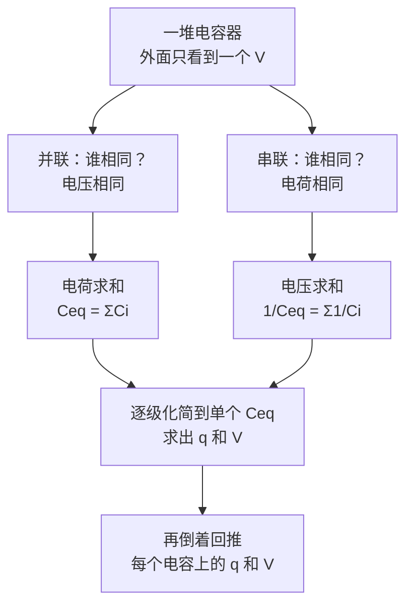
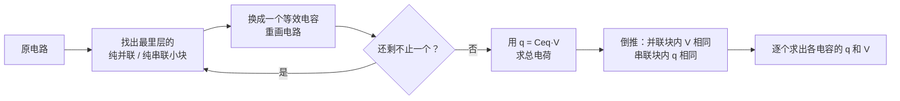

# C25.2 电容器的串并联 Capacitors in Parallel and in Series

> [!abstract] 这一讲的任务
> 上一讲我们会算**一个**电容器的电容了。可现实里电容从来是成群出现的。这一讲要做的是：**把一堆电容器换成一个等效电容器 equivalent capacitor**，让外面的电路看不出区别。
> 只有两种基本接法——并联和串联——但它们的规律恰好相反，而且串联的结论反直觉。搞清楚「谁相同、谁求和」，本章的电路题就全通了。

> [!info] 怎么读这份讲义
> 第 1、2 节是两种接法的推导，第 3 节是「拆电路」的通用流程，第 4 节是两道课件例题。做题时反复回到第 3 节那张流程图。
> 标有 **（拓展）** 或 **【拓展】** 的内容，是**课堂上没有讲到、由课件和教材延伸补充**的部分。复习时可先掌握未标注的主干内容，行有余力再看拓展部分。

---

## 0. 开场：一个只有两个接线柱的黑盒

桌上有个黑盒子，只引出两根线。你往上加 $12\ \mathrm{V}$，测到它吸进了 $60\ \mu\mathrm{C}$ 的电荷。

**你能说出盒子里有几个电容器吗？**

说不出。你只能说：从外面看，它等效于一个 $C=\dfrac{60\ \mu\mathrm{C}}{12\ \mathrm{V}}=5\ \mu\mathrm{F}$ 的电容器。盒子里可能是一个 5 µF，可能是两个 10 µF 串联，也可能是 2 µF 和 3 µF 并联。

> [!important] 等效电容器 Equivalent Capacitor（课件原文）
> When there is a **combination of capacitors** in a circuit, we can **replace that combination with an equivalent capacitor**. 等效电容器。
>
> 「等效」的准确含义：**在同样的端电压下，吸进同样多的电荷**。外电路无法分辨。

> [!question] 停一下，先自己想想
> 两个 $10\ \mu\mathrm{F}$ 的电容器接在一起，等效电容是多少？
> 先别急着套公式——想想 $20\ \mu\mathrm{F}$ 和 $5\ \mu\mathrm{F}$ 这两个答案，**哪种接法给哪个**？为什么会有两个答案？

---

## 1. 并联 Capacitors in Parallel：电压相同，电荷求和

![[C25-并联电路图.png]]

看图：三个电容器的**左端全接在一起、右端也全接在一起**，两端就是电池的两极。

**第一问：谁相同？** 每个电容器的两块板，分别连在同一个导体（导线）上。导线是等势体（[[C23.3 带电导体的电场]]），所以**每个电容器承受的电压都等于电源电压**：

$$V=V_1=V_2=V_3$$

**第二问：谁求和？** 电源送出的总电荷分给三个电容器：

$$q=q_1+q_2+q_3$$

**合起来**：

$$q=C_1V+C_2V+C_3V=(C_1+C_2+C_3)V$$

$$\boxed{C_{eq}=C_1+C_2+C_3=\sum_i C_i}$$

> [!note] 为什么并联是「直接相加」——一眼看穿的办法
> 把三个平行板电容器并联，相当于**把它们的极板拼成一块更大的板**：$C=\varepsilon_0A/d$ 里 $A$ 相加，$d$ 不变，所以 $C$ 相加。
> **并联 = 加大面积。** 记住这句，符号永远不会记反。

> [!important] 课件的两句口诀（原样）
> **等压** ｜ **电荷求和**

---

## 2. 串联 Capacitors in Series：电荷相同，电压求和

![[C25-串联电路图.png]]

看图：三个电容器首尾相接连成一串，只有两头接电源。

**第一问：谁相同？** 这里是全章最需要想明白的一步。

看 $C_1$ 的下极板和 $C_2$ 的上极板：它们由一段导线连着，**这一整块「导线 + 两块极板」是与外界完全隔绝的孤立导体**，电源的电荷根本进不去。它原本电中性，现在也必须保持电中性。

所以当 $C_1$ 下板感应出 $-q$ 时，$C_2$ 上板必然出现 $+q$（总量守恒）。一路传下去：

$$q=q_1=q_2=q_3$$

**每个电容器带的电荷完全相同**——不管它们容量差多少。

> [!question] 课堂追问：串联时电荷是怎么「传」下去的？
> 电源只把电荷送到了**最外面的两块板**上（顶上 $+q$、底下 $-q$）。中间那些极板上的电荷，**全部是静电感应出来的**，靠的是「中间导体块必须保持电中性」这一条。
> 这就是为什么串联的电荷相等是**严格的**，不是近似——它是电荷守恒的直接结果。

**第二问：谁求和？** 从电源正极走到负极，要依次跨过三个电容器，电势一路降下去：

$$V=V_1+V_2+V_3=\frac{q}{C_1}+\frac{q}{C_2}+\frac{q}{C_3}=q\left(\frac1{C_1}+\frac1{C_2}+\frac1{C_3}\right)$$

又 $V=q/C_{eq}$，于是

$$\boxed{\frac{1}{C_{eq}}=\frac{1}{C_1}+\frac{1}{C_2}+\frac{1}{C_3}=\sum_i^n\frac{1}{C_i}}$$

> [!important] 课件的两句口诀（原样）
> **等电荷** ｜ **电压求和**

> [!warning] 反直觉的结论：串联越串越小
> 两个 $10\ \mu\mathrm{F}$ 串联：$\dfrac1{C_{eq}}=\dfrac1{10}+\dfrac1{10}=\dfrac2{10}\Rightarrow C_{eq}=5\ \mu\mathrm{F}$。
> **比其中任何一个都小**，而且一定如此：$\dfrac1{C_{eq}}$ 是一堆正数之和，必然大于其中任何一项，所以 $C_{eq}$ 小于其中最小的那个。
>
> **为什么多接一个反而存得更少？** 因为串联时每个电容器都要**分走一部分电压**。电荷是同一份 $q$，却要撑起更大的总电压 $V$，比值 $q/V$ 自然变小。
> 几何图像：两个平行板电容器串联 ≈ 把间距 $d$ 加倍（$C=\varepsilon_0A/d$，$d$ 翻倍 → $C$ 减半）。**串联 = 拉大间距。**

> [!warning] 最容易失分的三处
> 1. **串联算完别忘了取倒数**。公式给的是 $1/C_{eq}$，很多人算出 $0.2$ 就当答案写上去了。
> 2. **两个电容器串联可以直接用积和形式**：$C_{eq}=\dfrac{C_1C_2}{C_1+C_2}$。**三个以上不能这么推广**，必须老老实实用倒数和。
> 3. **别和电阻搞混**：电阻是串联相加、并联取倒数和；电容**恰好相反**。
>    记法：$C=\varepsilon_0A/d$ 与 $R=\rho L/A$，$C$ 正比于面积、$R$ 正比于长度——所以「加大面积」对 $C$ 是并联、对 $R$ 是并联降阻，两者行为自然相反。

> [!note] 电容与电阻的对照表（拓展：归纳整理）
> | | 串联 | 并联 |
> |---|---|---|
> | **电容 $C$** | $\dfrac1{C_{eq}}=\sum\dfrac1{C_i}$（变小） | $C_{eq}=\sum C_i$（变大） |
> | **电阻 $R$**（第 26–27 章） | $R_{eq}=\sum R_i$（变大） | $\dfrac1{R_{eq}}=\sum\dfrac1{R_i}$（变小） |
>
> 一句话：**电容像「反过来的电阻」**。这张表到第 27 章还要用，现在就记住能省一次混淆。

> [!note] 串联的实际用途（拓展）
> 既然串联让 $C$ 变小，为什么还要串？因为**耐压翻倍**。单个电容器有击穿电压上限（见 [[C25.4 电介质与电介质中的高斯定律]] 的介电强度），两个串联后每个只分到一半电压，总耐压就翻倍了。**用电容量换耐压**——高压电路里常见。

---

## 3. 拆电路的通用流程

> [!important] 课件学习目标 03 说的就是这个流程
> For a circuit with a battery and some capacitors in parallel and some in series, **simplify the circuit in steps** by finding equivalent capacitors, until the charge and potential on the final equivalent capacitor can be determined, **and then reverse the steps** to find the charge and potential on the individual capacitors.

> [!important] 倒推时的两条铁律
> - **回到并联块**：这一块的**电压**就是它作为整体时的电压，各支路电荷按 $q_i=C_iV$ 分配。
> - **回到串联块**：这一块的**电荷**就是它作为整体时的电荷，各元件电压按 $V_i=q/C_i$ 分配。
>
> 一句话：**并联分电荷（按 $C$ 正比），串联分电压（按 $C$ 反比）。**

---

## 4. 两道课件例题

> [!example] 例题 2（课件原题）：$3\ \mu\mathrm{F}$ 与 $6\ \mu\mathrm{F}$，接 $18\ \mathrm{V}$ 电池
> 求 (a) 并联 (b) 串联时的等效电容和总电荷。
>
> **(a) 并联**
> $$C_{eq}=C_1+C_2=3+6=9\ \mu\mathrm{F}$$
> $$Q=C_{eq}\Delta V=(9\times10^{-6})(18)=1.62\times10^{-4}\ \mathrm{C}$$
> 课件写作 $1.6\times10^{-4}\ \mathrm{C}$（两位有效数字），复算一致 ✓
>
> **(b) 串联**
> $$C_{eq}=\frac{C_1C_2}{C_1+C_2}=\frac{3\times6}{3+6}=2\ \mu\mathrm{F}$$
> $$Q=C_{eq}\Delta V=(2\times10^{-6})(18)=3.6\times10^{-5}\ \mathrm{C}$$
>
> **对比一下**：同样两个电容、同样的电池，并联存 $162\ \mu\mathrm{C}$，串联只存 $36\ \mu\mathrm{C}$，**差 4.5 倍**。并联存电荷，串联扛电压。
>
> **顺手做个自检（课件没写，但值得做）**：串联时 $V_1=q/C_1=36/3=12\ \mathrm{V}$，$V_2=36/6=6\ \mathrm{V}$，$V_1+V_2=18\ \mathrm{V}$ ✓ 而且**小电容分到大电压**（$C$ 小 → $V=q/C$ 大）——这是串联的一般规律，考试常考。

![[C25-例题3电路图.png]]

> [!example] 例题 3（课件原题）：混联
> $C_1=12.0\ \mu\mathrm{F}$，$C_2=5.30\ \mu\mathrm{F}$，$C_3=4.50\ \mu\mathrm{F}$。求 (a) 等效电容；(b) 若 $V=12.5\ \mathrm{V}$，$C_1$ 上的电荷是多少。
>
> **(a)** 先看图中虚线框：$C_1$ 与 $C_2$ 左右并排、上下两端分别连在一起 → **并联**。
> $$C_{12}=C_1+C_2=12.0+5.30=17.3\ \mu\mathrm{F}$$
> 这个等效块再与 $C_3$ 首尾相接 → **串联**。
> $$C_{eq}=\frac{C_{12}C_3}{C_3+C_{12}}=\frac{17.3\times4.50}{4.50+17.3}=\frac{77.85}{21.8}=3.57\ \mu\mathrm{F}$$
>
> **(b)** 先求总电荷：
> $$q_{eq}=C_{eq}V=3.571\times10^{-6}\times12.5=4.46\times10^{-5}\ \mathrm{C}=44.6\ \mu\mathrm{C}$$
> **倒推第一步（串联块）**：$C_{12}$ 与 $C_3$ 串联，所以 $C_{12}$ 这一块带的电荷就是 $q_{eq}=44.6\ \mu\mathrm{C}$，即
> $$q_1+q_2=q_{eq}$$
> **倒推第二步（并联块）**：$C_1$ 与 $C_2$ 并联、按电容正比分电荷：
> $$q_1=q_{eq}\frac{C_1}{C_1+C_2}=44.6\times\frac{12.0}{17.3}=31.0\ \mu\mathrm{C}$$
> 全部数值已独立复算 ✓（$C_{eq}=3.5711$，$q_{eq}=44.639\ \mu\mathrm{C}$，$q_1=30.96\approx31.0\ \mu\mathrm{C}$）
>
> **自检**：$q_2=44.6-31.0=13.6\ \mu\mathrm{C}$，$V_{12}=q_{eq}/C_{12}=44.6/17.3=2.58\ \mathrm{V}$，$V_3=44.6/4.50=9.92\ \mathrm{V}$，两者之和 $12.5\ \mathrm{V}$ ✓

> [!question] 停一下，我们刚才干了什么
> 例题 3 把整套方法走了一遍：**先从里往外化简（并联 → 串联 → 单个），再从外往里回推（总电荷 → 串联块同电荷 → 并联块分电荷）。**
> 化简时看「哪两个能合并」，回推时看「这一块当初是串还是并」。所有混联题都是这两句话。

> [!warning] 怎么判断「是串还是并」——别靠画得像不像
> 图画得歪一点就认不出来了。用定义判断：
> - **两端分别接在同两个节点上** → 并联（电压必然相同）。
> - **首尾相接，中间那个节点不再接任何第三根线** → 串联（中间导体孤立，电荷必然相同）。
>
> 关键是**中间节点有没有第三条支路**。有，就不是串联。

---

## 这一讲的三句话

1. **并联：电压相同、电荷求和 → $C_{eq}=\sum C_i$**（等于加大极板面积，$C$ 变大）。
2. **串联：电荷相同、电压求和 → $1/C_{eq}=\sum 1/C_i$**（等于拉大极板间距，$C$ 比最小的还小）；串联的电荷相同源于**中间导体块必须电中性**。
3. **混联题的固定流程**：逐级化简到单个 → $q=C_{eq}V$ → 倒推，**并联分电荷（正比于 $C$），串联分电压（反比于 $C$）**。

> [!important] 必背
> $$C_{eq}^{\text{并}}=\sum_i C_i,\qquad \frac{1}{C_{eq}^{\text{串}}}=\sum_i\frac1{C_i},\qquad C_{eq}^{\text{两个串联}}=\frac{C_1C_2}{C_1+C_2}$$

> [!abstract] 下一讲预告
> 我们现在会算「存了多少电荷」了。但开场那盏闪光灯要的不是电荷，是**能量**——1 毫秒里放出 10 焦耳。
> 一个电容器充到 $V$，里面到底存了多少能量？更要命的问题是：**这能量存在哪儿？** 存在电荷上，还是存在两板之间那片看不见的空间里？下一讲会给出一个让人意外的答案。

---

## 本节自测 Self-Test

> [!question] 1. 并联和串联，各是「谁相同、谁求和」？

> [!success]- 参考答案
> 并联：**电压相同**，电荷求和 → $C_{eq}=\sum C_i$。
> 串联：**电荷相同**，电压求和 → $1/C_{eq}=\sum 1/C_i$。

> [!question] 2. 串联时为什么每个电容器的电荷必然相等？

> [!success]- 参考答案
> 相邻两个电容器之间的「导线 + 两块极板」是一个与外界隔绝的孤立导体，必须保持电中性。前一个电容器下板感应出 $-q$，后一个上板就必须是 $+q$。这是电荷守恒的直接结果，不是近似。

> [!question] 3. 三个 $6\ \mu\mathrm{F}$ 的电容器，(a) 全并联 (b) 全串联 (c) 两个并联后与第三个串联，各是多少？

> [!success]- 参考答案
> (a) $6\times3=18\ \mu\mathrm{F}$
> (b) $1/C=3/6\Rightarrow C=2\ \mu\mathrm{F}$
> (c) 并联块 $12\ \mu\mathrm{F}$，再与 $6\ \mu\mathrm{F}$ 串联：$\dfrac{12\times6}{12+6}=4\ \mu\mathrm{F}$

> [!question] 4. 为什么串联的等效电容一定小于其中最小的那个？

> [!success]- 参考答案
> $\dfrac1{C_{eq}}=\sum\dfrac1{C_i}$ 是若干正数之和，必大于其中任何一项 $\dfrac1{C_i}$，取倒数后 $C_{eq}<C_i$ 对每个 $i$ 都成立。
> 物理上：电荷是同一份，却要撑起各段电压之和，$q/V$ 自然更小。

> [!question] 5. $2\ \mu\mathrm{F}$ 与 $4\ \mu\mathrm{F}$ 串联接 $12\ \mathrm{V}$。各自分到多少电压？哪个分得多？

> [!success]- 参考答案
> $C_{eq}=\dfrac{2\times4}{6}=1.333\ \mu\mathrm{F}$，$q=1.333\times12=16\ \mu\mathrm{C}$。
> $V_1=16/2=8\ \mathrm{V}$，$V_2=16/4=4\ \mathrm{V}$，和为 $12\ \mathrm{V}$ ✓
> **小电容分到大电压**（$V=q/C$，$q$ 相同）。设计高压电路时要特别注意：串联的小电容最容易先被击穿。

> [!question] 6. 电容的串并联规律与电阻的相比，有什么关系？

> [!success]- 参考答案
> **恰好相反**：电容并联相加、串联倒数和；电阻串联相加、并联倒数和。根源在 $C\propto A/d$ 而 $R\propto L/A$——面积对两者的作用方向相反。

> [!question] 7. 例题 3 中，如果只问 $C_3$ 上的电压，最快的算法是什么？

> [!success]- 参考答案
> $C_3$ 与并联块串联，带的电荷就是总电荷 $q_{eq}=44.6\ \mu\mathrm{C}$，所以 $V_3=q_{eq}/C_3=44.6/4.50=9.92\ \mathrm{V}$。不需要先算 $q_1$、$q_2$。

> [!question] 8. 给定两个不同的电容器，怎么接能得到最大的等效电容？怎么接耐压最高？

> [!success]- 参考答案
> **并联**给出最大等效电容（$C_1+C_2$，比任何一个都大）。
> **串联**耐压最高（总电压被两个分担），代价是等效电容变小。

---

上一节 ← [[C25.1 电容器与电容的计算]] ｜ 下一节 → [[C25.3 电场的能量]]
索引 → [[电磁学 MOC]]
