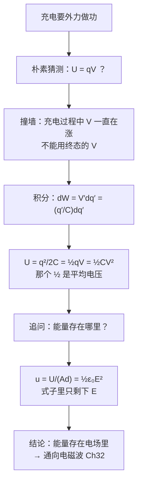

# C25.3 电场的能量 Energy of an Electric Field

> [!abstract] 这一讲的任务
> 前两讲都在算「存了多少**电荷**」。但我们真正想要的从来不是电荷，是**能量**——闪光灯要的是 10 焦耳，不是 10 微库仑。
> 这一讲先算出电容器储存的能量 $U$，然后问一个更要紧的问题：**这能量存在哪儿？** 答案会把「能量」从电荷身上转移到**空间本身**，并且直接通向第 32 章的电磁波。

> [!info] 怎么读这份讲义
> 第 1 节推 $U$ 的三个表达式，第 2 节是全章概念上最重要的一段（能量密度），第 3、4 节是数量感和例题。第 2 节值得慢读。
> 标有 **（拓展）** 或 **【拓展】** 的内容，是**课堂上没有讲到、由课件和教材延伸补充**的部分。复习时可先掌握未标注的主干内容，行有余力再看拓展部分。

---

## 0. 开场：一个断了电还能电人的盒子

老式相机的闪光灯板上，那个大电容旁边总印着一行小字：**HIGH VOLTAGE, DO NOT TOUCH**。拔掉电池、关机、放进抽屉，一小时后拆开，手指碰到两个引脚——照样被狠狠电一下。

电池早就拿走了。**那么这一下的能量，是从哪来的？**

它一直待在那个电容器里。上一讲我们说「电容器攒电荷」，但攒电荷的**同时就攒下了能量**——因为把同号电荷硬堆到一块板上，是要克服排斥力做功的。

> [!question] 停一下，先自己想想
> 一个电容 $C$ 的电容器，充到电压 $V$、电荷 $q$。凭直觉猜一下它存了多少能量。
> 第 24 章学过「把电荷 $q$ 移过电势差 $V$，功是 $qV$」。所以答案就是 $U=qV$ 吗？

---

## 1. 那个 $\frac12$ 是怎么冒出来的

### 朴素猜测与它撞的墙

$U=qV$ 错在哪？错在**它假定整个过程中电压一直是 $V$**。

可是充电的第一个电子搬过去时，两板之间还没有电势差，几乎不费力；搬到一半时电压是 $V/2$；搬最后一个电子时才要顶着满电压 $V$。**电压是一路涨上去的**，不能用终态的值去乘全部电荷。

### 正确做法：把充电过程切成一片一片

设某个中间时刻，极板上已有电荷 $q'$，此时电压为 $V'=q'/C$。再搬一小份 $dq'$ 过去，外力要做的功是

$$dW=V'\,dq'=\frac{q'}{C}dq'$$

从 $0$ 积到 $q$：

$$W=\int_0^q\frac{q'}{C}dq'=\frac{q^2}{2C}$$

外力做的功全部变成电容器的电势能（课件：$dW_{ex}=dU$），所以

> [!important] 电容器储存的能量（课件原文）
> $$\boxed{U=\frac{1}{2}\frac{q^2}{C}=\frac12qV=\frac12CV^2}$$
> To charge a capacitor and store electric potential energy in it, **work must be done by an external force**：$dW_{ex}=dU$。

> [!question] 课堂追问：那个 $\frac12$ 的物理意义是什么？
> $U=\frac12qV=q\cdot\dfrac{V}{2}$——**搬运的是全部电荷 $q$，但它感受到的是「平均电压」$V/2$**（电压从 $0$ 线性涨到 $V$，平均值正是 $V/2$）。
>
> 这个 $\frac12$ 和 [[C24.2 点电荷的电势]] 里「多电荷系统势能要避免重复计数」是同一类东西，也和 $\frac12mv^2$、$\frac12kx^2$ 是同一类东西：**凡是「阻力随进度线性增长」的积累过程，都会出现 $\frac12$。**
>
> 反过来说：如果电压被外部**固定**住（比如电荷从电池搬过恒定的 $V$），那就没有 $\frac12$，功就是 $qV$。区别只在于「电压是否随过程变化」。

> [!warning] 三个表达式该用哪一个
> 三者完全等价（用 $q=CV$ 互换），但用错会绕远路：
> | 情形 | 用哪个 | 理由 |
> |---|---|---|
> | **电源一直连着**（$V$ 固定） | $U=\frac12CV^2$ | $V$ 是已知不变量 |
> | **电源已断开**（$q$ 固定） | $U=\dfrac{q^2}{2C}$ | $q$ 是已知不变量 |
> | 两者都已知 | $U=\frac12qV$ | 最省事 |
>
> 这张表在 [[C25.4 电介质与电介质中的高斯定律]] 里「插入电介质」的两种情形中**直接决定答案的方向**（能量是增是减），务必记牢。

> [!warning] $U\propto V^2$ 是非线性的
> 电压翻倍，**能量变四倍**，不是两倍。所以超级电容器拼命提高耐压比拼命提高容量更划算——可惜耐压受介电强度限制（[[C25.4 电介质与电介质中的高斯定律]]）。

---

## 2. 能量存在哪里？——本章最重要的一段

现在问一个看起来有点形而上的问题：上面那份 $U$，**物理上放在什么位置**？

有两种说法：
- **说法 A**：存在电荷上（电荷被挤在一起，所以有势能）。
- **说法 B**：存在两板之间那片空荡荡的空间里。

课件用一个改写把答案逼了出来。对平行板电容器，把 $C=\varepsilon_0A/d$、$V=Ed$ 代进 $U=\frac12CV^2$，再除以板间体积 $Ad$：

$$u=\frac{U}{\mathcal V}=\frac{\frac12CV^2}{Ad}=\frac{\frac12\left(\varepsilon_0\dfrac{A}{d}\right)(Ed)^2}{Ad}$$

把分子整理一下：$\frac12\varepsilon_0\dfrac{A}{d}E^2d^2=\frac12\varepsilon_0AdE^2$，再除以 $Ad$：

> [!important] 电场的能量密度 Energy density of an electric field（课件原文）
> $$\boxed{u=\frac12\varepsilon_0E^2}\qquad\text{单位：}\mathrm{J/m^3}$$

> [!question] 停一下，我们刚才干了什么
> 看看这个结果里**还剩下什么**：没有 $C$，没有 $q$，没有 $A$，没有 $d$，**连电容器都不见了**。只剩下一个 $E$。
>
> 这就是说：**只要某处有电场，那里就有能量，密度是 $\frac12\varepsilon_0E^2$**——不管这个场是电容器造的、点电荷造的，还是一束光带来的。**说法 B 赢了：能量存在场里。**
>
> 这是整个电磁学里最重要的观念转变之一，和第 22 章「从力到场」是同一层级的跃迁：
> - 第 22 章：场不只是记账工具，它是**真实存在**的（[[C22.1 电场]]）；
> - 本节：场不只是真实存在，它还**携带能量**。
>
> 既然场携带能量，那么当场脱离电荷自己跑出去时（电磁波），能量就跟着一起跑——这就是**太阳能怎么穿过一亿五千万公里真空到达你手上**。第 32 章会正式讲，但根就埋在这一行公式里。

> [!note] 这个公式对非均匀场也成立吗？（拓展）
> 上面的推导用的是平行板的均匀场。但 $u=\frac12\varepsilon_0E^2$ 是**普适**的：对非均匀场，取一个足够小的体积元 $dV$，在其中 $E$ 可视为均匀，于是
> $$U=\int u\,d\mathcal V=\int\frac12\varepsilon_0E^2\,d\mathcal V$$
> 第 4 节的例题 5 会用这个积分做一次独立验算——两条完全不同的路算出同一个数，这是对「能量存在场里」最硬的证据。

---

## 3. 数量感：电容器 vs 电池

![[C25-电容器与电池储能对比.png]]

> [!example] 课件原样数据（全部已复算 ✓）
> | 器件 | 公式 | 储能 |
> |---|---|---|
> | 电容 $1000\ \mu\mathrm{F}$，$6.3\ \mathrm{V}$ | $U=\frac12CV^2=0.5\times0.001\times6.3^2$ | $0.02\ \mathrm{J}$ |
> | 超级电容 $3000\ \mathrm{F}$，$2.7\ \mathrm{V}$ | $0.5\times3000\times2.7^2$ | $10{,}935\ \mathrm{J}$ |
> | 超级电容组 $165\ \mathrm{F}$，$48\ \mathrm{V}$（$14.2\ \mathrm{kg}$） | $0.5\times165\times48^2$ | $190{,}080\ \mathrm{J}$ |
> | 镍氢电池 $1.2\ \mathrm{V}$，$1350\ \mathrm{mAh}$ | $U=QV=\dfrac{1350\times1.2}{1000}$ | $1.62\ \mathrm{Wh}=5832\ \mathrm{J}$ |
> | 锂离子电池 $3.6\ \mathrm{V}$，$3500\ \mathrm{mAh}$ | $\dfrac{3500\times3.6}{1000}$ | $12.6\ \mathrm{Wh}=45{,}360\ \mathrm{J}$ |

> [!note] 这张表在说什么
> 1. **普通电容器存的能量少得可怜**（0.02 J，大约一颗花生米从桌上掉到地上的能量）。它的本事不在「存得多」，在于**放得快**——开场的闪光灯正是要这一点。
> 2. **电池的公式是 $U=QV$ 而不是 $\frac12QV$**：电池放电时端电压基本恒定（化学反应维持），不是从 $V$ 线性降到 $0$，所以没有那个 $\frac12$。**这正好印证了第 1 节说的「$\frac12$ 来自电压随过程变化」。**
> 3. **重量的代价**：$14.2\ \mathrm{kg}$ 的超级电容组存 $190\ \mathrm{kJ}$，$\approx13\ \mathrm{kJ/kg}$；一节几十克的锂电池存 $45\ \mathrm{kJ}$，$\approx900\ \mathrm{kJ/kg}$。**电池的能量密度高出近两个数量级。**
>    所以两者不是竞争关系：**电池负责「存得多」，电容负责「放得快」。**（做手机快充、电动车能量回收时这两者是配合使用的。）

---

## 4. 两道课件例题

![[C25-例题4电路图.png]]

> [!example] 例题 4（课件原题）：$V=48\ \mathrm{V}$，$C_1=9.0\ \mu\mathrm{F}$，$C_2=4.0\ \mu\mathrm{F}$，$C_3=8.0\ \mu\mathrm{F}$
> 求 (a) 电路的等效电容；(b) 三个电容器储存的总能量。
>
> **(a)** $C_2$ 与 $C_3$ 并联，再与 $C_1$ 串联（[[C25.2 电容器的串并联]]）：
> $$C_{23}=C_2+C_3=4.0+8.0=12\ \mu\mathrm{F}$$
> $$C_{eq}=\frac{C_1C_{23}}{C_1+C_{23}}=\frac{9\times12}{9+12}=\frac{108}{21}=5.1\ \mu\mathrm{F}$$
>
> **(b)** 电源电压已知且固定，用 $U=\frac12CV^2$：
> $$U=\frac12C_{eq}V^2=\frac12(5.1\times10^{-6})(48)^2=5.9\times10^{-3}\ \mathrm{J}$$
> 复算：$C_{eq}=5.1429\ \mu\mathrm{F}$，$U=5.92\times10^{-3}\ \mathrm{J}$ ✓
>
> > [!note] 为什么可以直接用 $C_{eq}$ 算总能量？
> > 因为「等效」的含义就是外电路完全分辨不出区别——电源送出的电荷、做的功都一样，所以总储能也一样。**不需要**分别算三个电容器的能量再相加（当然那样算结果也相同，可以作为自检）。

> [!example] 例题 5（课件原题）：孤立导体球，$R=6.85\ \mathrm{cm}$，$q=1.25\ \mathrm{nC}$
> 求 (a) 空间中储存了多少电能；(b) 球面处的能量密度。
>
> **(a)** 孤立导体球的电容（[[C25.1 电容器与电容的计算]]）$C=4\pi\varepsilon_0R$，于是
> $$U=\frac{q^2}{2C}=\frac{q^2}{2(4\pi\varepsilon_0R)}=\frac{(1.25\times10^{-9})^2\times8.99\times10^9}{2\times0.0685}=1.03\times10^{-7}\ \mathrm{J}$$
>
> **(b)** 球面处 $E=\dfrac{q}{4\pi\varepsilon_0R^2}=\dfrac{8.99\times10^9\times1.25\times10^{-9}}{0.0685^2}=2394\ \mathrm{V/m}$
> $$u=\frac12\varepsilon_0E^2=\frac12(8.85\times10^{-12})(2394)^2=2.54\times10^{-5}\ \mathrm{J/m^3}$$
> 与课件一致 ✓
>
> > [!warning] 课件 (a) 的数值对不上（已独立复算两遍）
> > **课件写的是 $8.21\times10^{-8}\ \mathrm{J}$，但正确结果是 $1.03\times10^{-7}\ \mathrm{J}$。**
> > 验算过程：$C=4\pi\varepsilon_0R=\dfrac{0.0685}{8.99\times10^9}=7.62\times10^{-12}\ \mathrm{F}$，
> > $U=\dfrac{(1.25\times10^{-9})^2}{2\times7.62\times10^{-12}}=\dfrac{1.5625\times10^{-18}}{1.524\times10^{-11}}=1.025\times10^{-7}\ \mathrm{J}$。
> > **(b) 问的 $2.54\times10^{-5}$ 是对的**，只有 (a) 这一个数有问题（疑为课件笔误）。考试若遇到同题，按 $1.03\times10^{-7}\ \mathrm{J}$ 写，并把过程写全。

> [!note] 用能量密度独立验证例题 5(a)（拓展）
> 这是检验「能量存在场里」的最好机会。导体球内部 $E=0$（[[C23.3 带电导体的电场]]），能量全在球外。把 $u=\frac12\varepsilon_0E^2$ 对球外整个空间积分，体积元取球壳 $d\mathcal V=4\pi r^2dr$：
> $$U=\int_R^\infty\frac12\varepsilon_0\left(\frac{q}{4\pi\varepsilon_0r^2}\right)^2 4\pi r^2\,dr=\frac{q^2}{8\pi\varepsilon_0}\int_R^\infty\frac{dr}{r^2}=\frac{q^2}{8\pi\varepsilon_0R}$$
> 而 $\dfrac{q^2}{2C}=\dfrac{q^2}{2\cdot4\pi\varepsilon_0R}=\dfrac{q^2}{8\pi\varepsilon_0R}$ ——**完全相同** ✓
> 代入数值：$\dfrac{8.99\times10^9\times(1.25\times10^{-9})^2}{2\times0.0685}=1.03\times10^{-7}\ \mathrm{J}$，与上面 (a) 的修正值一致，**同时也再次说明课件那个 $8.21\times10^{-8}$ 不对**。
>
> 两条完全独立的路径（「电容公式」与「对场的能量密度积分」）给出同一个数——这就是「能量真的存在场中」最直接的证据。

---

## 这一讲的三句话

1. **$U=\dfrac{q^2}{2C}=\frac12qV=\frac12CV^2$**；那个 $\frac12$ 来自「充电过程中电压从 0 线性涨到 $V$，平均只有 $V/2$」。电源固定 $V$ 用 $\frac12CV^2$，断开电源固定 $q$ 用 $q^2/2C$。
2. **能量密度 $u=\frac12\varepsilon_0E^2$**——式子里只有 $E$，没有电容器。**能量存在电场本身之中**，这是通向电磁波的关键一步。
3. **电容与电池分工不同**：电池能量密度高（存得多），电容放电快（放得猛）；电池用 $U=QV$（无 $\frac12$），因为端电压恒定。

> [!important] 必背
> $$U=\frac{q^2}{2C}=\frac12qV=\frac12CV^2,\qquad u=\frac12\varepsilon_0E^2,\qquad U=\int u\,d\mathcal V$$

> [!abstract] 下一讲预告
> 到这里，电容器里始终是**真空**。可现实中的电容器，两板之间永远塞着东西——聚酯薄膜、陶瓷、电解纸。
> 塞进去之后会发生什么？课件的答案是一句话：**电容会变大，倍数叫介电常数 $\kappa$。** 但下一讲真正要回答的是：**为什么塞一块绝缘体进去，它就能存更多电荷？** 明明绝缘体不导电、什么也没做。答案藏在分子内部。

---

## 本节自测 Self-Test

> [!question] 1. 为什么电容器的能量是 $\frac12qV$ 而不是 $qV$？

> [!success]- 参考答案
> 充电过程中板间电压从 $0$ 线性涨到 $V$，每一小份电荷 $dq'$ 感受到的是当时的电压 $q'/C$，不是终态的 $V$。积分 $\int_0^q(q'/C)dq'=q^2/2C=\frac12qV$。那个 $\frac12$ 就是「平均电压 $V/2$」。

> [!question] 2. 电容器充满后断开电源，再把两板拉开一倍距离。储能如何变化？能量从哪来？

> [!success]- 参考答案
> $q$ 固定，用 $U=q^2/2C$。$d$ 加倍 → $C$ 减半 → **$U$ 加倍**。
> 多出来的能量来自**你拉开极板时克服两板吸引力做的功**。（两板异号相吸，拉开要做正功。）

> [!question] 3. 同一个电容器，若保持接在电源上（$V$ 固定）把间距拉开一倍，储能又如何变化？

> [!success]- 参考答案
> $V$ 固定，用 $U=\frac12CV^2$。$C$ 减半 → **$U$ 减半**。
> 注意与第 2 题**结论相反**：同样的机械动作，「断开电源」和「保持接电源」结果完全不同。差别在于后者电荷会流回电源。**做题第一件事永远是问：电源还连着吗？**

> [!question] 4. 写出电场能量密度公式，并说明它为什么重要。

> [!success]- 参考答案
> $u=\frac12\varepsilon_0E^2$。重要在于式子里只剩下 $E$——不含电容、电荷、几何。这说明**能量属于电场本身**，只要有场的地方就有能量。电磁波能脱离电荷携带能量穿越真空，根据就在这里。

> [!question] 5. 电压翻倍，电容器储能变几倍？如果是电荷翻倍呢？

> [!success]- 参考答案
> 电压翻倍：$U=\frac12CV^2$ → **4 倍**。电荷翻倍：$U=q^2/2C$ → 同样 **4 倍**（因为 $q$ 与 $V$ 成正比，两种说法等价）。

> [!question] 6. 为什么电池的储能写成 $U=QV$，没有 $\frac12$？

> [!success]- 参考答案
> 电池放电时端电压由化学反应维持、基本恒定，不像电容器那样从 $V$ 线性降到 $0$。恒定电压搬运总电荷 $Q$，功就是 $QV$。$\frac12$ 只在「电压随过程线性变化」时出现。

> [!question] 7. 一个 $2.0\ \mu\mathrm{F}$ 电容器充到 $100\ \mathrm{V}$，若板间距 $d=0.10\ \mathrm{mm}$，求板间能量密度。

> [!success]- 参考答案
> $E=V/d=100/1.0\times10^{-4}=1.0\times10^{6}\ \mathrm{V/m}$
> $u=\frac12\varepsilon_0E^2=0.5\times8.85\times10^{-12}\times10^{12}=4.4\ \mathrm{J/m^3}$
> 自检：$U=\frac12CV^2=0.5\times2.0\times10^{-6}\times10^4=0.01\ \mathrm{J}$，所以板间体积应为 $0.01/4.4=2.3\times10^{-3}\ \mathrm{m^3}$，对应 $A=\mathcal V/d=23\ \mathrm{m^2}$——确实需要很大的面积才能做到 2 µF ✓

> [!question] 8. 用两种方法算出孤立导体球（半径 $R$、电荷 $q$）的静电能，并说明它们相符意味着什么。

> [!success]- 参考答案
> 方法一：$U=\dfrac{q^2}{2C}=\dfrac{q^2}{2\cdot4\pi\varepsilon_0R}=\dfrac{q^2}{8\pi\varepsilon_0R}$
> 方法二：$U=\displaystyle\int_R^\infty\frac12\varepsilon_0\left(\frac{q}{4\pi\varepsilon_0r^2}\right)^2 4\pi r^2dr=\frac{q^2}{8\pi\varepsilon_0}\int_R^\infty\frac{dr}{r^2}=\frac{q^2}{8\pi\varepsilon_0R}$
> 两者相同，说明「把能量记在电容器账上」和「把能量摊在空间各处的场里」是同一笔账——**能量确实存在电场中**。

---

上一节 ← [[C25.2 电容器的串并联]] ｜ 下一节 → [[C25.4 电介质与电介质中的高斯定律]]
索引 → [[电磁学 MOC]]
