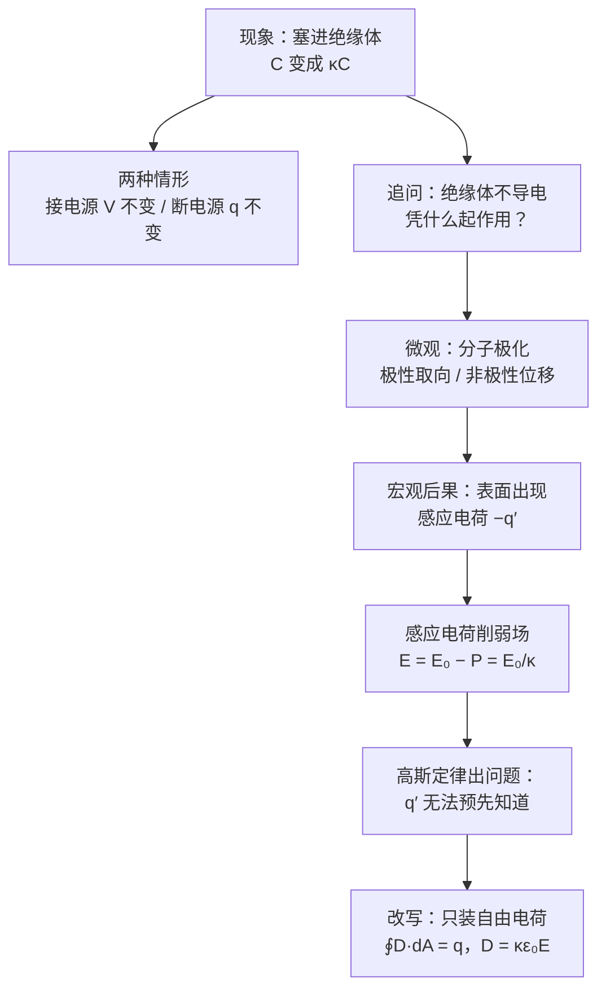

# C25.4 电介质与电介质中的高斯定律 Capacitor with a Dielectric & Gauss' Law in Dielectric

> [!abstract] 这一讲的任务
> 前三讲的电容器，两板之间一直是**真空**。但你手上任何一个真实的电容器，中间都塞着东西——聚酯膜、陶瓷、电解纸。
> 这一讲回答三个层层深入的问题：**塞进去会怎样？**（$C$ 变成 $\kappa C$）**为什么会这样？**（分子极化产生感应电荷）**那高斯定律还能用吗？**（能，但要改写成 $\oint\vec D\cdot d\vec A=q_{\text{自由}}$）
> 这是第 21–25 章静电学的收官：高斯定律在这里迎来它的最终形式，第 32 章麦克斯韦方程组里的那一条就是它。

> [!info] 怎么读这份讲义
> 第 1–2 节讲现象和用法（做题够用），第 3 节讲微观机制（理解为什么），第 4–5 节把高斯定律改写出来（概念最难，但考点集中）。
> 标有 **（拓展）** 或 **【拓展】** 的内容，是**课堂上没有讲到、由课件和教材延伸补充**的部分。复习时可先掌握未标注的主干内容，行有余力再看拓展部分。

---

## 0. 开场：把一张纸塞进电容器

做个思想实验。两块平行板，充电到 $q$，然后断开电源，接上电压表，读数 $V_1$。

现在把一块**塑料板**（绝缘的，不导电）塞进两板之间。

> [!question] 停一下，先自己想想
> 电压表的读数会怎么变？塑料不导电，电荷一个也跑不掉，$q$ 完全没变。既然 $q$ 没变，$V=q/C$ 里的 $C$ 是几何决定的、几何也没变——**读数应该纹丝不动**才对？
>
> 实验结果：**读数掉下来了**，而且是掉到原来的 $1/\kappa$（比如塞聚苯乙烯掉到 $1/2.6$，塞瓷片掉到 $1/6.5$）。

一块不导电的东西，凭什么改变了电压？这一讲就是在追这个问题。先把现象规律说清楚，再挖到分子层面。

> [!important] 定义：电介质 Dielectric（课件原文）
> An **insulating material** is called a **dielectric**, when we study its behavior in an electric field. **绝缘材料 = 电介质**。
>
> 「绝缘体」和「电介质」是同一类物质的两个名字：关心它**不导电**时叫绝缘体，关心它**在电场中的行为**时叫电介质。

---

## 1. 现象：插入电介质，电容变大 $\kappa$ 倍

> [!important] 核心结论（课件原文）
> When a dielectric is inserted into a capacitor, its capacitance is **increased by a factor called dielectric constant $\kappa$ (kappa)**.
> **电介质插入双极板，电容以介电常数倍增加。**
> $$\boxed{C=\kappa C_{\text{真空}}}$$
> 即所有真空中的电容公式，把 $\varepsilon_0$ 换成 $\kappa\varepsilon_0$ 即可：
> $$C_{\text{平行板}}=\frac{\kappa\varepsilon_0A}{d},\qquad C_{\text{柱}}=\frac{2\pi\kappa\varepsilon_0L}{\ln(b/a)},\qquad C_{\text{球}}=4\pi\kappa\varepsilon_0\frac{ab}{b-a}$$

> [!important] 更一般的替换法则（课件学习目标 02 + p.29）
> In a region **completely filled** by a dielectric, **all electrostatic equations containing $\varepsilon_0$ are to be replaced with $\kappa\varepsilon_0$**.
> 例如点电荷的场：
> $$E_{\text{真空}}=\frac{q}{4\pi\varepsilon_0r^2}\quad\longrightarrow\quad E_{\text{介质}}=\frac{q}{4\pi\kappa\varepsilon_0r^2}$$
> **For a fixed distribution of charges**（电荷分布固定不变时）：
> $$\boxed{E=\frac{E_0}{\kappa}}$$
> 即：**电荷量固定时，加入介质，电场强度削弱到 $1/\kappa$。**

> [!warning] 「completely filled 完全充满」这个前提很重要
> 只有当**整个有场的区域**都被同一种介质填满时，才能简单地把 $\varepsilon_0$ 换成 $\kappa\varepsilon_0$。
> 如果介质只填了一部分（比如第 6 节的例题 9，只塞了一块厚 $b<d$ 的板），**不能整体替换**，必须分区域处理：有介质的地方 $E=E_0/\kappa$，没介质的地方仍是 $E_0$。这是本章最典型的失分点。

### 两种情形：电源接着还是断开

![[C25-插入电介质两种情形.png]]

这是本节最重要的一张图，也是考试最爱考的对比。

> [!important] 情形 A：电源一直连着（课件：Voltage does not change，固定电势）
> $V$ 被电池锁死不变。$C$ 变成 $\kappa C_1$，由 $q=CV$：
> $$\boxed{q_2=\kappa q_1>q_1}$$
> **电荷增加**——多出来的电荷由电池补上（有电流流过）。
> 储能 $U=\frac12CV^2$ 也**增大** $\kappa$ 倍（能量由电池提供）。

> [!important] 情形 B：电源已断开（课件：Charge does not change，固定电量）
> $q$ 被孤立锁死不变。$C$ 变成 $\kappa C_1$，由 $V=q/C$：
> $$\boxed{V_2=\frac{V_1}{\kappa}<V_1}$$
> **电压下降**——这正是开场实验看到的现象。
> 储能 $U=\dfrac{q^2}{2C}$ 则**减小**到 $1/\kappa$（能量去哪了？见例题 7）。

> [!question] 课堂追问：做题第一句话永远是问「电源还连着吗？」
> 同一个动作（塞进介质），两种情形下**几乎每个量的变化方向都不同**：
>
> | 量 | A：接着电源（$V$ 不变） | B：断开电源（$q$ 不变） |
> |---|---|---|
> | $C$ | $\times\kappa$ | $\times\kappa$ |
> | $V$ | 不变 | $\div\kappa$ |
> | $q$ | $\times\kappa$ | 不变 |
> | $E$（板间） | 不变（$E=V/d$） | $\div\kappa$ |
> | $U$ | $\times\kappa$ | $\div\kappa$ |
>
> 只有 $C$ 的变化两种情形相同。**背这张表不如记住判断顺序：先问电源，再挑那个「被锁死」的量当出发点。**（这与 [[C25.3 电场的能量]] 里选 $\frac12CV^2$ 还是 $q^2/2C$ 是同一个判断。）

### 介电常数与介电强度

![[C25-介电常数与介电强度表.png]]

> [!important] 介电强度 Dielectric strength $E_{max}$（课件原文）
> The **maximum electric field** of a dielectric it can tolerate **without breakdown**（击穿）。
> 当 $E>E_{max}$ 时，介质内部被电离出一条**导电通道 conducting path**，电容器被击穿、直接短路报废。

> [!example] 课件表格中被红线标出的几行（原样抄录）
> | 材料 Material | 介电常数 $\kappa$ | 介电强度 (kV/mm) |
> |---|---|---|
> | **Air (1 atm) 空气** | **1.00054** | **3** |
> | **Polystyrene 聚苯乙烯** | **2.6** | **24** |
> | Paper 纸 | 3.5 | 16 |
> | Transformer oil 变压器油 | 4.5 | — |
> | Pyrex 派热克斯玻璃 | 4.7 | 14 |
> | Ruby mica 红宝石云母 | 5.4 | — |
> | Porcelain 瓷 | 6.5 | — |
> | Silicon 硅 | 12 | — |
> | Germanium 锗 | 16 | — |
> | Ethanol 乙醇 | 25 | — |
> | Water (20 °C) 水 | 80.4 | — |
> | Water (25 °C) 水 | 78.5 | — |
> | Titania ceramic 钛陶瓷 | 130 | — |
> | **Strontium titanate 钛酸锶** | **310** | **8** |
> | **真空 For a vacuum** | **$\kappa=1$**（严格） | — |

> [!note] 从这张表能读出什么
> 1. **真空的 $\kappa\equiv1$，空气的 $\kappa=1.00054$**——所以平时把空气当真空处理，误差万分之五，完全可以忽略。
> 2. **$\kappa$ 与介电强度往往此消彼长**：钛酸锶 $\kappa=310$ 很惊人，但介电强度只有 $8\ \mathrm{kV/mm}$；聚苯乙烯 $\kappa$ 只有 2.6，却能扛 $24\ \mathrm{kV/mm}$。选材料要在「容量」和「耐压」之间权衡。
> 3. **水的 $\kappa\approx80$ 极高**，因为水分子是强极性分子（见第 3 节）。这也是为什么水是**优良溶剂**——它能把离子间的库仑吸引削弱到 $1/80$，盐就散开了。**这条把电磁学接到了化学。**
> 4. **硅 $\kappa=12$**：半导体器件的电容计算（比如 MOS 栅电容）都要用它。

> [!note] 插入电介质的三重好处（拓展：归纳整理）
> 教材（Halliday）总结插介质有三个实际作用，课件只讲了第二个：
> 1. **机械支撑**：把两块极板隔开、保证间距 $d$ 均匀又极小，还不会碰在一起短路。
> 2. **提高电容**：$C\to\kappa C$。
> 3. **提高耐压**：多数固体介质的介电强度远高于空气的 $3\ \mathrm{kV/mm}$，因此同样间距能承受高得多的电压。

> [!example] 例题 6（课件原题）：$A=2.0\ \mathrm{m^2}$，$d=1.0\ \mathrm{mm}$，充到 $V_1=3.0\ \mathrm{kV}$ 后**断开**，插入介质后电压变为 $V_2=1.0\ \mathrm{kV}$
> 求 (1) 原电容与新电容；(2) 介电常数；(3) 电容器上的电荷。
>
> **判断**：断开电源 → **$q$ 不变**（情形 B）。
>
> **(1)** $$C_1=\varepsilon_0\frac{A}{d}=(8.85\times10^{-12})\frac{2.0}{1.0\times10^{-3}}=1.77\times10^{-8}\ \mathrm{F}$$
> $$C_2=\frac{q}{V_2}=\frac{q}{V_1}\cdot\frac{V_1}{V_2}=C_1\frac{V_1}{V_2}=1.77\times10^{-8}\times3.0=5.31\times10^{-8}\ \mathrm{F}$$
>
> **(2)** $$\kappa=\frac{C_2}{C_1}=\frac{V_1}{V_2}=\frac{3.0}{1.0}=3.0$$
>
> **(3)** $$Q=C_1V_1=(1.77\times10^{-8})(3.0\times10^{3})=5.31\times10^{-5}\ \mathrm{C}$$
>
> > [!warning] 课件这一页有两处问题（已独立复算）
> > 1. **数值差 10 倍**：课件写 $C_1=1.8\times10^{-7}\ \mathrm{F}$、$C_2=5.4\times10^{-7}\ \mathrm{F}$、$Q=5.4\times10^{-4}\ \mathrm{C}$。
> >    实际 $\varepsilon_0A/d=8.85\times10^{-12}\times2.0/10^{-3}=\mathbf{1.77\times10^{-8}\ F}$，**课件的指数多了一位**。相应地 $C_2=5.31\times10^{-8}\ \mathrm{F}$，$Q=5.31\times10^{-5}\ \mathrm{C}$。
> >    好在 **(2) 问的 $\kappa=3.0$ 不受影响**（它是比值，公共因子约掉了）。
> > 2. **符号笔误**：课件把 $C_2=\dfrac{q}{V_1}\dfrac{V_1}{V_2}=C_1\dfrac{V_1}{V_2}$ 写成了 $C_2\dfrac{V_1}{V_2}$（右边应是 $C_1$，否则等式自相矛盾）。
> >
> > 这道题的**方法**是对的，照抄方法、别照抄数值。

---

## 2. 插入介质时的能量与受力

> [!example] 例题 7（课件原题）：$C=13.5\ \mathrm{pF}$ 充到 $V=12.5\ \mathrm{V}$ 后**断开**，插入瓷片（porcelain 瓷）$\kappa=6.5$
> 求 (a) 插入前后的电势能；(b) 插入者做的功。
>
> **(a)** 断开电源 → $q$ 不变，用 $U=\frac12CV^2$（插入前）与 $U=q^2/2C$（插入后更方便）：
> $$U_{before}=\frac12C_1V_1^2=\frac12(13.5\times10^{-12})(12.5)^2=1055\ \mathrm{pJ}$$
> $$U_{after}=\frac12C_2V_2^2=\frac{U_{before}}{\kappa}=\frac{1055}{6.5}=162\ \mathrm{pJ}$$
> 复算 ✓（$U_{before}=1.0547\times10^{-9}\ \mathrm{J}$，$U_{after}=1.623\times10^{-10}\ \mathrm{J}$）
>
> > [!note] 为什么 $U_{after}=U_{before}/\kappa$
> > $q$ 固定时 $U=\dfrac{q^2}{2C}$，而 $C\to\kappa C$，所以 $U\to U/\kappa$。
> > 用 $\frac12C_2V_2^2$ 算也一样：$C_2=\kappa C_1$ 但 $V_2=V_1/\kappa$，$\kappa\cdot(1/\kappa)^2=1/\kappa$ ✓
>
> **(b)** 能量少了，说明**系统对外做了功**：
> $$W_{appl}=U_{after}-U_{before}=162-1055=-893\ \mathrm{pJ}$$
> $$W_{cap}=+893\ \mathrm{pJ}$$
> **课件的结论：The capacitor will pull the dielectric slab in.（电容器会把介质板吸进去。）**
>
> > [!question] 课堂追问：$W_{appl}<0$ 到底什么意思？
> > 人施加的功是**负的**，意味着人不是在「推」而是在「拉着不让它冲进去」——介质板是被**吸**进电容器的。
> > **物理原因**：极板边缘的场是非均匀的（边缘效应，[[C25.1 电容器与电容的计算]]），它把介质极化后产生的感应电荷往场强大的地方拉。这是一个普遍规律：**电介质总是被吸向场强较强的区域。**
> > **能量判据**：系统总是自发地朝**势能降低**的方向演化。$q$ 固定时插入介质使 $U$ 降低，所以插入是自发的 ✓
> >
> > **反问**：如果电源**一直连着**呢？那 $U=\frac12CV^2$ 反而**增大** $\kappa$ 倍——那介质还会被吸进去吗？
> > 仍然会。因为这时要算的是**系统 + 电池**的总能量：电池为了维持 $V$ 必须多送 $\Delta q=(\kappa-1)q_1$ 的电荷，做功 $\Delta q\cdot V=(\kappa-1)C_1V^2$，而电容器储能只增加了 $(\kappa-1)\frac12C_1V^2$，**恰好是电池做功的一半**，另一半正是电容器吸入介质板所做的机械功。结论一致 ✓（拓展）

---

## 3. 微观机制：绝缘体凭什么起作用

回到开场那个问题：塑料不导电，电荷一个也没动，它凭什么改变电压？

答案是：**电荷虽然跑不掉，但可以在分子内部「挪一点点」。** 这叫**极化 Polarization**。介质分两类，极化的方式不同。

### (a) 极性电介质 Polar dielectrics

![[C25-极性电介质取向极化.png]]

> [!important] 课件原文
> The molecules of a polar dielectric have **permanent electric dipole moments 永久电偶极矩**（$\vec p\neq0$）。
> When an electric field is applied, the molecules will **align along the field direction**. This alignment produces an electric field **opposing the applied field**. Therefore the dielectric **reduces** the applied electric field.

典型代表是**水分子 $\mathrm{H_2O}$**：氧端偏负、氢端偏正，本身就是个小电偶极子（[[C22.3 电偶极子的电场]]）。

- **无外场时**（图 a）：分子热运动使偶极矩**随机取向**，宏观上互相抵消，整体不显电性。
- **加外场后**（图 b）：每个分子受到力矩 $\vec\tau=\vec p\times\vec E$（[[C22.7 电场中的电偶极子]]），被扭得**沿场方向排列**。排列并不完全——热运动一直在捣乱，温度越高排得越差，所以**极性介质的 $\kappa$ 随温度升高而下降**（拓展）。

### (b) 非极性电介质 Nonpolar dielectrics

![[C25-非极性电介质位移极化.png]]

> [!important] 课件原文
> A nonpolar dielectric has **no permanent dipole moments 非永久电偶极矩**（$\vec p=0$）。
> An applied field will **polarize the molecule** in some extents. The result is an electric field **opposing to the applied field**. This produces the **induced surface charge 表面感应电荷**。

典型代表是**甲烷 $\mathrm{CH_4}$**：结构对称，正负电荷中心重合，$\vec p=0$。加上外场后，电子云被拉向一边、原子核被推向另一边，**正负中心被拉开**，硬生生"长"出一个感应偶极矩。

> [!note] 读图：底下三格在演示同一件事
> 课件底部三张图是一组递进：
> 1. **左**：$\vec E_0=0$，分子都是圆的（无偶极矩）；
> 2. **中**：加上 $\vec E_0$，每个分子被拉成偶极子，整齐排列；
> 3. **右**：**中间的正负端首尾相接、逐对抵消**，只剩下**两个端面上的电荷没有配对**——这就是**表面感应电荷**。图中画出了它产生的反向场 $\vec E'$，与 $\vec E_0$ 方向相反，合成后的 $\vec E$（红色）明显更短。

> [!important] 两类介质的共同结局
> 机制不同（一个是**转向**，一个是**被拉开**），但结果完全一样：
> **介质表面出现一层感应电荷 $\mp q'$，它产生的场与外场反向，把介质内部的合场削弱到 $1/\kappa$。**
>
> 做题时**不需要**区分极性还是非极性，只需要 $\kappa$。区分它们是为了理解「$\kappa$ 为什么会因材料、温度、频率而不同」。

> [!warning] 感应电荷 vs 导体的感应电荷
> | | 导体（[[C23.3 带电导体的电场]]） | 电介质（本节） |
> |---|---|---|
> | 电荷能否自由移动 | 能，跑遍整个表面 | **不能**，只能在分子内挪一点 |
> | 内部合场 | **完全为零** | 削弱到 $E_0/\kappa$，**不为零** |
> | 感应电荷量 | 恰好抵消外场所需的量 | $q'=\dfrac{\kappa-1}{\kappa}q<q$ |
> | 极限情形 | —— | $\kappa\to\infty$ 时退化为导体 ✓ |
>
> 最后一行是很好的自检：把 $\kappa\to\infty$ 代入本节任何公式，都应该回到导体的结论。

---

## 4. 高斯定律遇到的麻烦，和它的解决办法

![[C25-电介质中的高斯面与感应电荷.png]]

现在把上面的图像写成公式。设平行板上的电荷为 $q$（这是我们**能控制、能测量**的，叫**自由电荷 free charge**），介质表面的感应电荷为 $\mp q'$（这是**极化出来的、事先不知道多少**，叫**束缚电荷 / 感应电荷 induced charge**）。

**第一步：没有介质时**（高斯面只圈住上极板）

$$\varepsilon_0\oint\vec E\cdot d\vec A=\varepsilon_0E_0A=q\quad\Longrightarrow\quad E_0=\frac{q}{\varepsilon_0A}$$

**第二步：只看感应电荷的贡献**（课件记它产生的场为 $P$）

$$\varepsilon_0\oint\vec P\cdot d\vec A=-\varepsilon_0PA=-q'\quad\Longrightarrow\quad P=\frac{q'}{\varepsilon_0A}$$

**第三步：把两者都圈进去**（高斯面同时包住 $+q$ 和 $-q'$）

$$\varepsilon_0\oint\vec E\cdot d\vec A=\varepsilon_0EA=q-q'\quad\Longrightarrow\quad E=\frac{q-q'}{\varepsilon_0A}=E_0-P$$

> [!warning] 课件写的是 $\vec E=\vec E_0+\vec P$，别当成加号（重要）
> 课件同一页上既有 $E=E_0-P$ 又有 $\vec E=\vec E_0+\vec P$，看起来矛盾，其实是**矢量式与标量式**的区别，课件紧接着就注明了：
> **"$\vec E_0$ and $\vec P$ have opposite directions. $\vec E_0$ is larger than $\vec P$."**
> 即：矢量相加，但 $\vec P$ 与 $\vec E_0$ **反向**，所以大小相减；又因为 $E_0>P$，合场方向仍与 $\vec E_0$ 相同、只是变小了。
> 课件红字总结：**「固定电荷量，加入介质，电场强度削弱。」**

> [!warning] 这门课的 $P$ 与标准教材的极化强度不是同一个量（两种口径）
> 课件里的 $P=\dfrac{q'}{\varepsilon_0A}$，**量纲是电场**（V/m），它实际上是**感应电荷产生的退极化场**的大小（很多教材写作 $E'$）。
> 而多数教材（含 Halliday 及国内通用教材）里的**极化强度矢量 $\vec P$** 定义为单位体积的电偶极矩，$P_{\text{标准}}=\dfrac{q'}{A}$，**量纲是 C/m²**。
> 两者相差一个 $\varepsilon_0$：$P_{\text{课件}}=P_{\text{标准}}/\varepsilon_0$。
> **考试按课件口径答题**，但看教材或做课外题时务必先确认符号含义，否则会差 $\varepsilon_0$ 倍。

**第四步：引入 $\kappa$**。实验事实是 $E=E_0/\kappa$，代回上面几式：

> [!important] 一组必须会推的关系（课件 p.37 原样，本讲已逐条验算 ✓）
> $$\kappa=\frac{E_0}{E}=\frac{E_0}{E_0-P}\quad\Longrightarrow\quad \boxed{P=\frac{\kappa-1}{\kappa}E_0},\qquad \boxed{E=\frac{1}{\kappa}E_0}$$
> $$\kappa=\frac{q}{q-q'}\quad\Longrightarrow\quad\boxed{q'=\frac{\kappa-1}{\kappa}q}$$
> 以及用**（绝对）介电常数 permittivity** $\varepsilon$ 写出的等价形式：
> $$\boxed{\varepsilon=\kappa\varepsilon_0},\qquad \kappa=\frac{\varepsilon}{\varepsilon_0},\qquad \varepsilon P=(\varepsilon-\varepsilon_0)E_0,\qquad \varepsilon E=\varepsilon_0E_0$$
> **The dielectric constant $\kappa$ is always greater than 1.**（$\kappa>1$ 恒成立——极化产生的场总是削弱外场，绝不会增强。）

> [!question] 停一下，我们刚才干了什么
> 检查两个极限，确认公式讲得通：
> - $\kappa\to1$（真空）：$P\to0$、$q'\to0$、$E\to E_0$ ✓ 什么也没发生。
> - $\kappa\to\infty$（理想导体）：$P\to E_0$、$q'\to q$、$E\to0$ ✓ 感应电荷完全抵消，内部无场——正是导体的结论。
>
> **介质是「半个导体」**：感应电荷抵消掉一部分（比例 $\frac{\kappa-1}{\kappa}$）外场，而不是全部。

### 麻烦在哪里，$\vec D$ 又怎么解决它

> [!important] 问题的要害
> 真空中的高斯定律 $\varepsilon_0\oint\vec E\cdot d\vec A=q_{enc}$ 里，$q_{enc}$ 必须包括**所有**电荷，也就是 $q-q'$。
> 可是 $q'$ **事先并不知道**——它依赖于场，而场又依赖于它。想用高斯定律求 $E$，却发现右边的量要先知道 $E$。**循环了。**

解决办法：把 $q'$ 从右边挪到左边、藏进 $\kappa$ 里。由 $q-q'=q/\kappa$：

$$\varepsilon_0\oint\vec E\cdot d\vec A=q-q'=\frac{q}{\kappa}\quad\Longrightarrow\quad\boxed{\varepsilon_0\oint\kappa\vec E\cdot d\vec A=q}$$

定义**电位移矢量 Electric displacement vector**：

> [!important] 介质中的高斯定律（课件四条原文）
> $$\boxed{\vec D=\kappa\varepsilon_0\vec E=\varepsilon\vec E}\qquad\boxed{\oint\vec D\cdot d\vec A=q}$$
> 1. The flux integral involves $\kappa\vec E$, **not just** $\vec E$.（通量积分里是 $\kappa\vec E$，不是 $\vec E$。）
> 2. The charge $q$ enclosed by the Gaussian surface is the **free charge only**.（$q$ 只算**自由电荷**，不含感应电荷。）
> 3. Original statement（真空）：$\varepsilon_0\displaystyle\oint\vec E\cdot d\vec A=q$
> 4. Modified statement（有介质）：$\varepsilon_0\displaystyle\oint\kappa\vec E\cdot d\vec A=q$

> [!question] 课堂追问：$\vec D$ 到底"高明"在哪？
> 高明在**右边只剩下自由电荷**——那是我们能控制、能直接数出来的量（电池送了多少电荷上去）。感应电荷 $q'$ 被完全打包进了左边的 $\kappa$ 里，不再需要单独求。
>
> 于是整套解题流程和真空时**一模一样**：选对称高斯面 → $\oint\vec D\cdot d\vec A=q_{\text{自由}}$ → 求出 $D$ → 用 $E=D/(\kappa\varepsilon_0)$ 换回 $E$。
>
> 这是**第 21–25 章静电学的收官式**。这条方程会原封不动出现在第 32 章的麦克斯韦方程组里（$\nabla\cdot\vec D=\rho_{\text{自由}}$）。

> [!warning] 关于 $\vec D$ 的三个易错点
> 1. **$\vec D$ 的高斯定律右边没有 $\varepsilon_0$**（它已经吸收进 $\vec D$ 的定义里了）。写成 $\oint\vec D\cdot d\vec A=q/\varepsilon_0$ 是错的。
> 2. **右边只装自由电荷**。把感应电荷也算进去是最常见的错误。
> 3. **$\vec D$ 的连续性**：穿过两种介质的分界面时，$\vec D$ 的法向分量连续而 $\vec E$ 不连续（$E$ 在界面两侧按 $\kappa$ 突变）。例题 9 里 $E_0\neq E_1$ 而 $D$ 处处相同，就是这条的体现（拓展）。

---

## 5. 两道压轴例题

![[C25-例题8球形介质壳.png]]

> [!example] 例题 8（课件原题）：半径 $a$ 的导体球带电 $q$，外面同心包一层外半径 $b$、介电常数 $\kappa$ 的介质壳。求空间各点的电场。
>
> 分三个区域，每次都取**半径 $r$ 的同心球面**作高斯面。
>
> **$r<a$（导体内部）**：静电平衡，$\boxed{E=0}$（[[C23.3 带电导体的电场]]）
>
> **$a<r<b$（介质层内）**：用介质中的高斯定律
> $$\varepsilon_0\oint\kappa\vec E\cdot d\vec A=q\ \Longrightarrow\ \varepsilon_0\kappa E(4\pi r^2)=q\ \Longrightarrow\ \boxed{E=\frac{q}{4\pi\varepsilon_0\kappa r^2}}$$
>
> **$r>b$（介质外，又是真空）**：高斯面把整个介质壳都包在里面，**壳内外表面的感应电荷 $+q'$ 与 $-q'$ 正好互相抵消**，净感应电荷为零：
> $$\boxed{E=\frac{q}{4\pi\varepsilon_0r^2}}$$
>
> > [!note] 三个结论连起来看
> > 场在 $r=a$ 处从 0 跳到 $\dfrac{q}{4\pi\varepsilon_0\kappa a^2}$（导体表面本来就允许跳变），在介质层里被压低到真空值的 $1/\kappa$，**过了 $r=b$ 又跳回真空的值**。
> > 换句话说：**介质只在它自己占的那块地方削弱场，出了介质就恢复原状。** 而 $\vec D=\kappa\varepsilon_0\vec E=\dfrac{q}{4\pi r^2}\hat r$ 在 $r>a$ 的**全部区域里连续、处处相同**——这正是用 $\vec D$ 的好处。

![[C25-例题9部分填充介质.png]]

> [!example] 例题 9（课件原题）：$A=115\ \mathrm{cm^2}$，$d=1.24\ \mathrm{cm}$，加 $V_0=85.5\ \mathrm{V}$ 后**断开电源**，再塞入厚 $b=0.78\ \mathrm{cm}$、$\kappa=2.61$ 的介质板（**只填了一部分**）
>
> **(a) 插入前的电容**
> $$C_0=\frac{\varepsilon_0A}{d}=\frac{(8.85\times10^{-12})(115\times10^{-4})}{1.24\times10^{-2}}=8.21\ \mathrm{pF}$$
>
> **(b) 极板上的自由电荷**（断开电源，此后恒定不变）
> $$q=C_0V_0=(8.21\times10^{-12})(85.5)=702\ \mathrm{pC}$$
>
> **(c) 空隙中的场 $E_0$**——取**高斯面 I**（只包住上极板，下底面落在空气隙里）：
> $$\varepsilon_0E_0A=q\ \Longrightarrow\ E_0=\frac{q}{\varepsilon_0A}=6.90\ \mathrm{kV/m}$$
>
> **(d) 介质板中的场 $E_1$**——取**高斯面 II**（包住下极板，上底面落在介质内），用介质中的高斯定律：
> $$\varepsilon_0\oint\kappa\vec E_1\cdot d\vec A=-\varepsilon_0\kappa E_1A=-q\ \Longrightarrow\ E_1=\frac{q}{\varepsilon_0\kappa A}=\frac{E_0}{\kappa}=2.64\ \mathrm{kV/m}$$
>
> **(e) 插入后的电压**——沿路径把两段分别积分（**这一步是全题的关键**）：
> $$V=-\int_-^+\vec E\cdot d\vec s=\int_+^-E\,ds=E_0(d-b)+E_1b=6.90\times10^3\times0.0046+2.64\times10^3\times0.0078=52.3\ \mathrm{V}$$
>
> **(f) 插入后的电容**
> $$C=\frac{q}{V}=\frac{7.02\times10^{-10}}{52.3}=13.4\ \mathrm{pF}$$
>
> 六问全部已独立复算 ✓（$C_0=8.2115\ \mathrm{pF}$，$q=702.1\ \mathrm{pC}$，$E_0=6895\ \mathrm{V/m}$，$E_1=2642\ \mathrm{V/m}$，$V=52.32\ \mathrm{V}$，$C=13.42\ \mathrm{pF}$）

> [!question] 停一下，例题 9 最值得学的是哪一步？
> 是 **(e)**。介质只填了一部分，**不能**直接套 $C=\kappa\varepsilon_0A/d$（那是「完全充满」才成立的）。正确做法是**分段积分**：空气段长 $d-b$、场强 $E_0$；介质段长 $b$、场强 $E_1=E_0/\kappa$。
>
> **自检**：$C/C_0=13.4/8.21=1.63$，**介于 1 与 $\kappa=2.61$ 之间** ✓ 合理——只填了一部分，好处自然只拿到一部分。若算出 $C/C_0>\kappa$ 或 $<1$，一定错了。
>
> **另一种解法（拓展）**：把部分填充看成「厚 $b$ 的介质电容器」与「厚 $d-b$ 的真空电容器」**串联**（[[C25.2 电容器的串并联]]）：
> $$C_{\text{介}}=\frac{\kappa\varepsilon_0A}{b},\quad C_{\text{空}}=\frac{\varepsilon_0A}{d-b},\quad \frac1C=\frac{b}{\kappa\varepsilon_0A}+\frac{d-b}{\varepsilon_0A}$$
> 代入得 $C=\dfrac{\varepsilon_0A}{(d-b)+b/\kappa}=\dfrac{1.0178\times10^{-13}}{0.0046+0.00299}=13.4\ \mathrm{pF}$ ✓ 与课件解法一致。**串联观点往往更快，推荐掌握。**

---

## 这一讲的三句话

1. **插入电介质，$C\to\kappa C$**；做题先问「电源还连着吗」：连着则 $V$ 不变、$q$ 与 $U$ 各涨 $\kappa$ 倍；断开则 $q$ 不变、$V$、$E$、$U$ 各降到 $1/\kappa$。
2. **微观上是分子极化**（极性分子转向、非极性分子被拉开），宏观后果是表面出现感应电荷 $q'=\frac{\kappa-1}{\kappa}q$，它产生反向场把内部合场削弱到 $E_0/\kappa$。
3. **介质中的高斯定律 $\oint\vec D\cdot d\vec A=q_{\text{自由}}$，$\vec D=\kappa\varepsilon_0\vec E$**——把算不出来的感应电荷打包进 $\kappa$，右边只留自由电荷。这是静电学高斯定律的最终形式。

> [!important] 必背
> $$C=\kappa C_0,\quad E=\frac{E_0}{\kappa},\quad q'=\frac{\kappa-1}{\kappa}q,\quad P=\frac{\kappa-1}{\kappa}E_0,\quad \varepsilon=\kappa\varepsilon_0,\quad \vec D=\kappa\varepsilon_0\vec E,\quad \oint\vec D\cdot d\vec A=q_{\text{自由}}$$

> [!abstract] 第 25 章到此结束，下一章预告
> 静电学五章（21–25）全部讲完：电荷 → 力 → 场 → 通量 → 电势 → 电容与能量。这一路电荷始终是**静止**的。
> 但闪光灯真正亮起来的那 1 毫秒，电荷在**流动**。流动的电荷叫**电流**，阻碍流动的叫**电阻**——这就是第 26 章。第 27 章会把电容和电阻接到一起（RC 电路），你会看到本章那个「充满即断路」的结论在时间轴上是怎么展开的。

---

## 本节自测 Self-Test

> [!question] 1. 插入电介质后电容变为多少？写出「完全充满」时三种电容器的公式。

> [!success]- 参考答案
> $C=\kappa C_0$。即把所有真空公式里的 $\varepsilon_0$ 换成 $\kappa\varepsilon_0$：
> $C_{\text{平行板}}=\dfrac{\kappa\varepsilon_0A}{d}$，$C_{\text{柱}}=\dfrac{2\pi\kappa\varepsilon_0L}{\ln(b/a)}$，$C_{\text{球}}=4\pi\kappa\varepsilon_0\dfrac{ab}{b-a}$。
> 前提是介质**完全充满**有场的区域。

> [!question] 2. 一个充电后断开电源的电容器插入 $\kappa=4$ 的介质。$C$、$q$、$V$、$E$、$U$ 各如何变化？

> [!success]- 参考答案
> $q$ **不变**；$C$ 变 4 倍；$V=q/C$ 降到 $1/4$；$E=V/d$ 降到 $1/4$；$U=q^2/2C$ 降到 $1/4$。

> [!question] 3. 同一个电容器，若**保持接在电池上**插入同样的介质，上述各量又如何变化？

> [!success]- 参考答案
> $V$ **不变**；$C$ 变 4 倍；$q=CV$ 变 4 倍；$E=V/d$ **不变**；$U=\frac12CV^2$ 变 4 倍（多出的能量由电池提供）。
> 与第 2 题对比：除了 $C$，其余全部相反。**做题必须先确认电源状态。**

> [!question] 4. 极性电介质与非极性电介质的极化机制有何不同？最终效果一样吗？

> [!success]- 参考答案
> 极性介质分子**本身就有**永久电偶极矩（如 $\mathrm{H_2O}$），外场使它们**转向排齐**；非极性介质分子原本 $\vec p=0$（如 $\mathrm{CH_4}$），外场把正负电荷中心**拉开**产生感应偶极矩。
> **最终效果完全相同**：表面出现感应电荷，产生反向场，内部合场削弱到 $E_0/\kappa$。

> [!question] 5. 自由电荷与感应电荷有什么区别？为什么必须区分？

> [!success]- 参考答案
> 自由电荷 $q$ 是电源送到极板上的，可控、可测；感应电荷 $q'$ 是介质极化产生的束缚电荷，事先未知（它依赖于场，而场又依赖于它）。
> 必须区分是因为真空高斯定律要求右边填**全部**电荷（$q-q'$），这会导致循环。改用 $\oint\vec D\cdot d\vec A=q_{\text{自由}}$ 后，右边只需自由电荷，循环解开。

> [!question] 6. 写出 $\vec D$ 的定义与介质中的高斯定律，并说明右边的 $q$ 指什么。

> [!success]- 参考答案
> $\vec D=\kappa\varepsilon_0\vec E=\varepsilon\vec E$；$\displaystyle\oint\vec D\cdot d\vec A=q$，右边**只包含高斯面内的自由电荷**，不含感应电荷。等价写法 $\varepsilon_0\displaystyle\oint\kappa\vec E\cdot d\vec A=q$。

> [!question] 7. $\kappa=5$、自由电荷 $q=10\ \mathrm{nC}$ 时，感应电荷是多少？介质内的场是真空值的几分之几？

> [!success]- 参考答案
> $q'=\dfrac{\kappa-1}{\kappa}q=\dfrac45\times10=8\ \mathrm{nC}$；$E=E_0/5$，即真空值的 $1/5$。
> 检验：$q-q'=2\ \mathrm{nC}=q/\kappa$ ✓

> [!question] 8. 平行板电容器 $d=2.0\ \mathrm{mm}$，其中 $1.0\ \mathrm{mm}$ 填了 $\kappa=4$ 的介质，另 $1.0\ \mathrm{mm}$ 是空气。等效电容是原来（全空气）的几倍？

> [!success]- 参考答案
> 看成两个电容器串联：$\dfrac1C=\dfrac{b}{\kappa\varepsilon_0A}+\dfrac{d-b}{\varepsilon_0A}=\dfrac{1}{\varepsilon_0A}\left(\dfrac{0.001}{4}+0.001\right)=\dfrac{0.00125}{\varepsilon_0A}$
> $C=\dfrac{\varepsilon_0A}{0.00125}$，而原来 $C_0=\dfrac{\varepsilon_0A}{0.002}$，故 $C/C_0=\dfrac{0.002}{0.00125}=1.6$ 倍。
> 检验：介于 $1$ 与 $\kappa=4$ 之间 ✓

> [!question] 9. 为什么断开电源后插入介质，介质板会被"吸"进去？

> [!success]- 参考答案
> $q$ 固定时 $U=q^2/2C$，插入使 $C$ 增大、$U$ 减小。系统自发朝势能降低的方向演化，所以插入是自发的，人反而要"拉住"它（例题 7 中 $W_{appl}=-893\ \mathrm{pJ}$）。
> 微观原因：极板边缘的非均匀场把介质极化后产生的感应电荷拉向场强更大的区域。

> [!question] 10. 课件里的 $P$ 和教材里的极化强度 $\vec P$ 是同一个量吗？

> [!success]- 参考答案
> 不是。课件的 $P=\dfrac{q'}{\varepsilon_0A}$ 量纲是电场（V/m），实为感应电荷产生的退极化场；教材的极化强度 $P=\dfrac{q'}{A}$ 量纲是 C/m²。两者相差 $\varepsilon_0$ 倍。考试按课件口径，查书时注意区分。

---

上一节 ← [[C25.3 电场的能量]] ｜ 下一章 → 第 26 章 电流与电阻 Current and Resistance
索引 → [[电磁学 MOC]]
